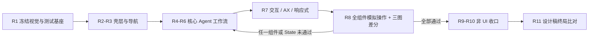

# Pawork 路线图

> 本文档是 Pawork 的**任务事实源**：只保留当前指针、未完成阶段、开放任务、候选池与任务约定。已完成阶段、旧编号和实现过程不在本文重复，统一从 [docs/history.md](docs/history.md) 检索。
>
> 文档导航见 [README.md](README.md)；架构红线与冻结契约见 [docs/architecture.md](docs/architecture.md)；Desktop 视觉差异与 99% 门禁见 [docs/UI_Review.md](docs/UI_Review.md)；视觉事实源见 [design/README.md](design/README.md) 与 [docs/gui-design.md](docs/gui-design.md)。

---

## 1. 当前指针

| 字段 | 值 |
| --- | --- |
| 活动线 | **Desktop UI 99% 视觉还原与全功能交互验证（R1–R8）** |
| 当前阶段 | **R6 — Inspector、Changes、Terminal 与 Activity（Wave B 🔵）** |
| 下一任务 | 待 macOS AX 注册恢复后，只补录一次审查后最终二进制的 R6 Wave B U2 九场景；通过后再确认 State A/B 分区 SSIM `≥0.99` 是否统一留给 R8，并关闭 R6/恢复 R7（任务书 [R4–R6](plan/R4-R6-ui-workflows.md#r6--inspectorchangesterminal-与-activity)；证据 [r6-wave-b](docs/ui-review/r6-wave-b/notes.md)） |
| 总目标 | 三张 v3 定稿图的结构与状态 100% 对齐；主区域分区相似度 `≥0.99`；所有可见组件具备真实交互、键盘/AX 语义与模拟操作测试 |
| 阻塞 | 实现与定向门禁无阻塞；审查后 U2 复跑在业务场景前连续 3 次命中 macOS AX 递归 `AXApplication`，按 fail-closed/熔断规则停止同方式重试。此前完整矩阵已通过，最终两项补修由 app 178 + Desktop 144 定向测试覆盖，但最终二进制 U2 仍待外部状态恢复后补录。R6 退出另需视觉门禁移交确认。 |

状态符号：⚪未开始 · 🔵进行中 · 🟢已完成 · ⚠️阻塞 · ⏭️用户跳过（未完成）。一次只推进一个阶段；事实冲突时**工作区实态 > 本表 > 任务书**，先同步文档再继续。

---

## 2. 顺序排期

UI 是当前唯一主线。R1–R8 未完成前，不插入非安全紧急的代码债务或产品扩张；其余已知任务按 R9–R11 顺延。

| 阶段 | 目标 | 关键交付 | 任务书 | 状态 |
| --- | --- | --- | --- | --- |
| R1 | 视觉合同与测试基座 | 1440×1024 三状态、量图表、真实 fixture、组件/状态清单、UI driver 方案、reference/current/diff 基线 | [R1 存档](docs/history.md#r1--视觉合同固定-fixture-与-ui-测试基座2026-08-2527) | 🟢 |
| R2 | Window shell 与全局视觉系统 | 深色沉浸式 titlebar、三栏几何、字体/图标/间距/surface、StatusBar、窗口级响应式基线 | [R2 存档](docs/history.md#r2--window-shell-与全局视觉系统2026-08-27) | 🟢 |
| R3 | TaskRail 与任务导航 | Timeline/Projects、scope、project/task、连接、新建、账户区、选择/恢复/滚动与键盘导航 | [R3 存档](docs/history.md#r3--taskrail-与任务导航2026-08-2728) | 🟢 |
| R4 | Workspace、Timeline 与 Agent 状态 | Header、消息、tool activity、审批、错误/取消、完成摘要、流式与长会话 | [R4–R6](plan/R4-R6-ui-workflows.md#r4--workspacetimeline-与-agent-状态) | 🟢 |
| R5 | Composer 与运行控制 | 多行/IME/粘贴、模型/reasoning、workspace、Context、发送/取消、引用与所有输入状态 | [R5 存档](docs/history.md#r5--composer-与运行控制2026-08-2829) | 🟢 |
| R6 | Inspector、Changes、Terminal 与 Activity | Files/Summary/DiffView、Terminal、Resources/Add tool、Inspector 折叠与右上 ActivityPopover | [R4–R6](plan/R4-R6-ui-workflows.md#r6--inspectorchangesterminal-与-activity) | 🔵（Wave A 🟢；Wave B 实现/定向绿，U2 最终补录待 AX） |
| R7 | 全局交互、Accessibility 与响应式 | hover/active/focus、菜单/Popover、纯键盘、VoiceOver/AX、1080×720、长列表与边界状态 | [R7–R8](plan/R7-R8-ui-quality-gates.md#r7--全局交互accessibility-与响应式) | ⚪（Wave A 资产已交付；R6 退出后恢复） |
| R8 | 模拟操作全功能验收 | 全组件端到端 UI suite、三状态逐图差分、重连/后台 Run/恢复、性能与失败证据、用户视觉签字 | [R7–R8](plan/R7-R8-ui-quality-gates.md#r8--模拟操作全功能验收) | ⚪ |
| R9 | UI 后一致性与代码债务 | 文档/Spec/断言一致、usage 幂等、依赖与注释漂移、路径内核、测试箱整理 | [R9–R11](plan/R9-R11-post-ui-closeout.md#r9--一致性与代码债务收口) | ⚪ |
| R10 | 关键回归与真实环境验证 | 三类关键回归、K-01、四通道/三客户端、OAuth refresh、历史人工冒烟与平台探针 | [R9–R11](plan/R9-R11-post-ui-closeout.md#r10--关键回归与真实环境验证) | ⚪ |
| R11 | 设计稿与实际 UI 终局比对 | 对照 v3 定稿图与已归档 current/diff，将不符合的显示效果归纳为下一阶段完善任务（只改文档） | [R9–R11](plan/R9-R11-post-ui-closeout.md#r11--设计稿与实际-ui-终局比对) | ⚪ |

阶段默认严格串行：`R1 → R2 → … → R11`。2026-08-29 用户先授权 R6→R7 的单次跳过，后又明确恢复 R6 Wave B；Wave B 实现与定向门禁已于 2026-08-30 收口，当前指针仍停在 R6 等待最终二进制 U2 补录与阶段退出确认。R7 Wave A 已交付资产不作废、但暂停继续验收。R11 是文档任务：不查询、不修改代码。发布准备已移出本编号，见 §5。

---

## 3. UI 主线硬约束

### 3.1 事实源优先级

1. 架构红线、协议契约、真实 capability 与数据真实性；
2. [docs/gui-design.md](docs/gui-design.md) 的信息架构和交互规则；
3. [design/README.md](design/README.md) 三张 v3 定稿图的视觉细节；
4. [docs/UI_Review.md](docs/UI_Review.md) 的差异、容差、fixture 和验收合同；
5. [Agent UI 参照调研](plan/UI-reference-research.md) 的交互经验。

Codex 与其他 Agent 产品只提供**操作方式和状态反馈的参照**，不替代 Pawork design。发生冲突时保留 Pawork 的三栏视觉、协议边界和安全语义，不复制竞品品牌、文案或未接入能力。

### 3.2 所有 UI 阶段共同完成条件

- 设计稿可见的区域、组件、顺序和状态 100% 对齐；只允许 [UI Review §0.1](docs/UI_Review.md#01-99-一致性的硬定义) 规定的细微几何误差。
- 每个可见控件必须有真实能力或诚实的 hidden/disabled/unavailable 状态；禁止假 quota、假 diff、假 Agent、假按钮和无效点击面。
- 所有按钮、列表行、tabs、菜单、Popover、输入、滚动区和状态变化必须覆盖 mouse、keyboard、focus、AX name/role/value 与错误恢复。
- 同一 State 的 reference/current/overlay/diff/mask/checklist 必须成套保存；不能只看全屏 SSIM，也不能用空白区域稀释差异。
- 生产 UI 不写死 fixture 文案。测试数据必须经 Host、协议与实际 projection 进入 Desktop。
- 每个阶段先补可观察回归，再改视觉/交互；R8 只汇总和补跨阶段缺口，不替代前置测试。

### 3.3 模拟操作测试架构

UI 自动化分四层，细节见 [R7–R8 任务书](plan/R7-R8-ui-quality-gates.md)：

| 层 | 目的 | 最低证据 |
| --- | --- | --- |
| U0 状态/投影 | 固定 Session、Run、tool、approval、diff、terminal、disconnect 等输入 | deterministic fixture + projection 断言 |
| U1 组件/窗口内 | 验证 GPUI 组件渲染状态、动作分发、焦点和布局不变量 | 组件场景测试 + 结构快照/几何断言 |
| U2 真进程/真协议 | 隔离 `PAWORK_DATA_DIR` 启动 Host + Desktop，模拟点击、键入、快捷键、滚轮、resize 与重连 | driver action trace + screenshot + Host/event log |
| U3 视觉/系统 | 1440 三状态、1080 响应式、AX/VoiceOver、IME 与性能 | R1 只验证证据管线和失败样本；R8 产出 reference/current/diff、AX tree、性能记录与用户签字 |

R8 的“全功能”含义是：所有组件清单中的可达状态都有脚本、断言和失败证据；不是只跑一条 happy path，也不是完全依赖人工点验。

### 3.4 阶段门禁



---

## 4. UI 之后的剩余任务

### 4.1 R9：一致性与代码债务

- 常设文档、包级 Spec、ADR、候选与断言按当前 21 包布局复核；旧 R/S 编号只留 history。
- 修复 usage record id 多轮冲突；清理 policy/workflow/orchestration 死依赖与过期描述/注释。
- 到期后移除 `StoredCredential` serde alias；合并 protocol 测试箱并评估 client dev-dep。
- 统一 resources 的 `canonical_within` 到 policy 路径内核。
- 修复 transport local_unix accept 跨 await 持锁导致的 listener close 死锁（R1 Wave B 在 fixture example 侧以 abort accept 任务规避；生产 `pawork gui serve` 靠 select! 丢弃 accept future 不受影响）。
- 复查 Claude import 五项 P3、上游多版本、usage 哨兵、shell wrapper、probe flake 与 UI 主线未顺带关闭的低风险残项；需要扩大行为或 wire 时另立 ADR。

- 扩展 `scripts/clean-stale-incremental.py` 覆盖 deps 面：2026-08-26 发现 `target/debug/deps` 积累约 77.5 万个 V1/R1 时代 `*.rcgu.o` 与死包产物，冷态 readdir 需数分钟、拖死 rustc 启动扫描；已一次性外科手术清理，脚本化防护待补。

### 4.2 R10：回归与真实环境

- K-01 config 仓库根/子目录/非 git 三态闭环。
- 安全红线、持久化与重放、协议与解析三类关键回归。
- 四个低消耗 Provider 通道；`gui serve` + Desktop、Zed ACP、headless json-stdio 与 doctor。
- ChatGPT/xAI OAuth 自然临期 refresh；真实 Anthropic/GLM Anthropic、fork/compact、kill -9 与 ACP 交错等人工项。
- Seatbelt 真机探针、Windows SCM/Job 等缺平台项如实记录，不以 mock 代替。

R10 不接收任何未通过的 Desktop UI 项；若 startup、PTY/审批恢复、Diff 横滚或其他组件仍有缺口，则 R8 仍未完成，不能进入本阶段。

### 4.3 R11：设计稿与实际 UI 终局比对

R11 只做文档：对照 [design/](design/README.md) 三张 v3 定稿图与 R8（及前置波次）已归档的 current / overlay / diff / checklist，按分区登记仍不符合的**显示效果**，并归纳为下一阶段完善任务。不打开、不查询、不修改任何代码；不重跑实现、不重拍 current、不改 design。

- 输入仅限设计图、gui-design / UI Review 合同、以及已入库的截图与量图证据。
- 容差内或 R8 已接受的项不重复立项；结构未对齐或仍刺眼的可见差异必须登记，并附 design 与 current/diff 路径。
- 交付物是差异清单 + 下一阶段完善任务草案（回写后续指针 / 新任务书）。本阶段不修 UI。
- 发布、License、安装器与全量门禁不属于 R11，见 §5。

---

## 5. 开放决策与候选池

以下不进入 R1–R11，除非成为 UI 还原或安全正确性的硬前置：

- HunkStageService 与 stage/unstage/hunk wire：需 ADR 定义协议与审批语义。
- **State C reference 底色归一（R8 前置，设计基准变更）**：R3 拍板 c 已把 TaskRail 分区 SSIM ≥0.99 与 fixture 演示数据重塑移交 R8（可执行条款见 [R7–R8 任务书](plan/R7-R8-ui-quality-gates.md) §3）。State C 定稿图中位 RGB (0,9,17) 比冻结 token base `0x07121a` 更暗；是否在生成 reference 时按冻结 token 归一底色，须 R8 重采集前由用户批准，不得把当前漂移追认为新基准。
- **R4 State A/B 分区 SSIM（R8 终局，2026-08-28 拍板 1）**：R4 以结构门禁与 U2 九场景退出；Header/Timeline 等区域 SSIM ≥0.99 同 R3 先例移交 R8。主因仍是 fixture 演示内容与设计稿形状差（重塑已在 R3 拍板 c 移交 R8），不得把当前记录值追认为通过。
- **live wire 诚实缺口（开放）**：live `RunChanged` 不带失败原因、无用户消息 wire 事件；R4 以乐观回显 + 重放兜底覆盖且零 wire 变更。是否接受现状或立 ADR 演进 wire（含把用户消息持久化提前到 plan 闸门之前）待拍板。
- **macOS 26 AX server 注册 flake（R7 前置复核）**：无 bundle debug 二进制的外部 AX 树间歇性只返回递归 `AXApplication`（自进程诞生即存在、激活无效、进程级持久、按时段成簇）；R6 Wave A 已在 driver 层以 AXWindows 回退 + desktop-restart ≤3 兜底绕过（fail-closed）。R7 VoiceOver/AX 门禁前须复核 bundled/签名形态能否根治，否则该门禁可能同类受阻。**2026-08-29 A3 结论**：bundled/签名形态注册正常（raw 46 / bundled 63 Pawork identifiers，无 AXWindows 回退），但当晚 20:23 起平台时段性递归劣化对两种形态均生效且 desktop-restart 不恢复——判定为平台时段问题而非 app 形态问题，State 补充采集待窗口过后重跑。
- 命令级交互审批：当前 terminal AskUser fail-closed；新增承载需 ADR。
- **Terminal stop / exit 生命周期 wire（R6 Wave B 闸门）**：冻结 GUI 协议当前只有 `terminal_create` / `terminal_write` / `terminal_resize` 与 `TerminalOutput`，无 stop/close 命令及 live exit/failure 事件；不得把写入 `exit` 或本地进程操作伪装为通用停止能力。Wave B 先完成现有合同内的 create/write/output/resize/snapshot reconnect 与失败诚实展示；若 R6 退出仍要求专用 Stop 与 live 终态，须另立 ADR 演进 wire。
- `@` file-index 候选查询与 Resources“已加载规则”Host 出口：只有在目标 UI 真实展示对应入口时，才作为 R5/R6 前置接入。
- 多账户 factory、远程 GUI、teams/goal/automation/monitor、GUI git 高级面、WASM 插件/市场/Hooks/LSP、artifact 流式与 egress broker：保持候选，资产位置见 [docs/history.md](docs/history.md) 与 [docs/design.md](docs/design.md)。
- Windows CI/Job、跨平台真窗口驱动：R8 先完成 macOS 主门禁，R10 再扩平台证据；发布级三平台矩阵见下方发布准备候选。
- 发布准备：License、crates.io 占名、供应链、安装/升级/回滚、三平台与发布级全量门禁。需用户明确授权后另立阶段，不占用 R11。

---

## 6. 风险与缓解

| 风险 | 缓解 |
| --- | --- |
| 用当前实现反改 design 以制造通过 | design 变更必须单独请求用户批准；UI 任务只能修实现 |
| 全屏相似度被空白区域抬高 | 主区域独立比较 + 结构一票否决 + overlay 人工复核 |
| fixture 侵入生产或伪造能力 | 测试专用种子，经真实 Host/协议/projection；生产组件无演示分支 |
| UI driver 脆弱、只靠坐标 | 稳定 AX identifier/role + 语义定位；坐标只用于视觉几何验证 |
| UI 优化破坏 Run/协议/安全 | Desktop 仍只经 GUI Connection Protocol；涉及 wire/审批先过 ADR 与关键回归 |
| 只测 happy path | 每个组件矩阵同时列 idle/running/completed/failed/disabled/disconnected/overflow |
| macOS 通过却跨平台退化 | R8 明确 macOS 主门禁；R10 对 Linux/Windows 编译、服务与窗口环境分别登记 |

---

## 7. 任务约定（开启 / 进行 / 收尾）

### 7.1 任务开启

波次任务从 §1 当前阶段对应的 `plan/*.md` 开启；一次只做一个 Wave：

```text
按 ROADMAP.md §7 执行 plan/<任务书>.md 的〈阶段 / Wave〉。
范围：〈写入集；不写则以任务书为准〉
凭证：〈auth 已就绪 / 本任务无需真实 key〉
```

开启时主代理必须亲自核对：任务书全文、design/current 同状态证据、写入集包 Spec、相关协议/安全契约和已有测试。需要 ADR、真实凭证或用户视觉决策时先停在闸门，不自行降低目标。

子代理只用于边界独立的核查/实现/审查，提示必须包含写入集、验收证据、禁止范围以及“不得撤销他人改动”。文档事实源和阶段状态由主代理统一回写。

### 7.2 进行中纪律

- 每个 UI Wave 固定一个 reference State 和一个可重复 fixture；先采 current，再改，再用同输入复拍。
- 先修结构与交互，再做 token/像素 polish；结构未通过不得靠阴影、渐变或动画掩盖。
- 不新增 Node/Bun/V8/WebView；Desktop 仍为独立 GPUI 进程，只连接 `pawork` Host。
- 保留用户未提交改动；写入集最小。新增依赖、提交、推送、发布须另获授权。
- 无权威数据时保持诚实缺省；不可用组件不得假装可点击。
- UI 用户可见行为、验证边界或状态变化同批更新 `docs/gui-design.md`、`design/README.md`、`docs/spec/desktop.md`、包级 Desktop Spec 与任务书。

### 7.3 测试纪律

- 普通实现仍按写入集运行关键定向测试；默认：`cargo test -p <crate> --offline --lib --tests`。多个相关包可在一个 Cargo 进程中追加 `-p`，不使用 `--workspace`。
- UI Wave 还必须执行任务书列出的 U0/U1 场景；触及真窗口、输入、菜单、滚动、resize、重连或视觉时，由主代理执行对应 U2/U3 门禁。
- 安全红线、持久化与重放、协议与解析三类关键测试不推迟；触及对应面时同批跑定向种子/golden。
- 全会话同一时刻只允许一个 Cargo 进程。禁止 `cargo clean`；审查者读既有日志与 diff，不重复编译。
- R8 不是发布级 Workspace Full Gate；只运行完整 UI suite、UI 关联包定向测试和三状态视觉/AX/性能门禁。
- R11 只改文档：对照已归档 design/current/diff，不跑 cargo、不重拍 current、不查源码。

### 7.4 测试通道与凭证

通道事实源为 `crates/providers/src/channels/registry.rs`。真实 API 仅用于 R10 或任务书明确要求的冒烟；常规 UI fixture 不消耗真实 Provider。

| 通道 | 默认低消耗模型 | 凭证 |
| --- | --- | --- |
| DeepSeek | `deepseek-v4-flash` | API key |
| GLM Coding Plan | `glm-4.7` | API key |
| OpenCode Go | `deepseek-v4-flash` | API key |
| xAI Grok | `grok-4.3` | OAuth bearer |

正式凭证只放 `$PAWORK_HOME/auth.json` / `~/.pawork/auth.json`；不得进入仓库、fixture、截图、日志或事件。凭证缺失即 fail-closed，不把 mock 写成真实冒烟。

### 7.5 收尾与状态回写

1. 只执行并记录本 Wave 的定向门禁；UI Wave 同时归档对应 State 的 current/overlay/diff 与 action trace。
2. 回写任务书 Wave 状态、实际写入、验证、未做项和计划偏差。
3. 回写本文 §1 当前指针；新发现放入 §5 或后续阶段，已完成细节移入 [docs/history.md](docs/history.md)，不留在 ROADMAP。
4. 影响架构、功能、Spec、Desktop 或验证边界时，同批更新相应常设文档；设计基准变更必须先获用户批准。
5. 最终报告至少包含：

```text
Implemented: <生产路径/用户入口，或 none>
Validated: <实际命令、场景和结果，或 none + 原因>
Targeted regressions: <安全/持久化/协议覆盖，或 none>
Real-world evidence: <真窗口/Provider/OS/客户端，或 pending + 原因>
Full workspace gate: NOT RUN（当前未设置全量门禁）
```

6. 不提交、不推送、不发布，除非用户当场要求。
