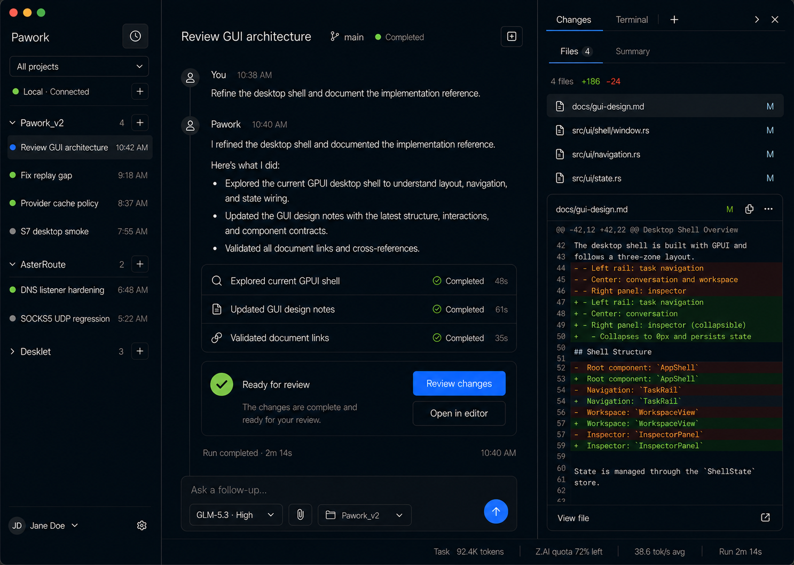
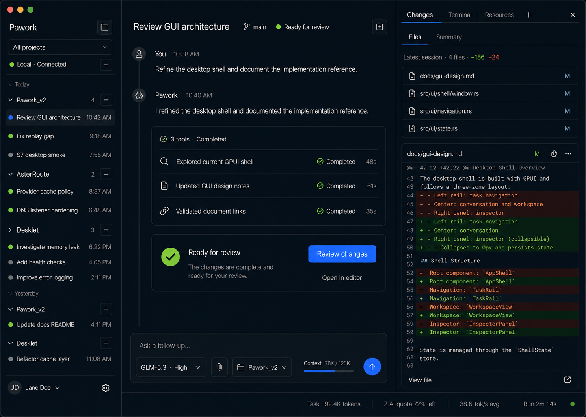
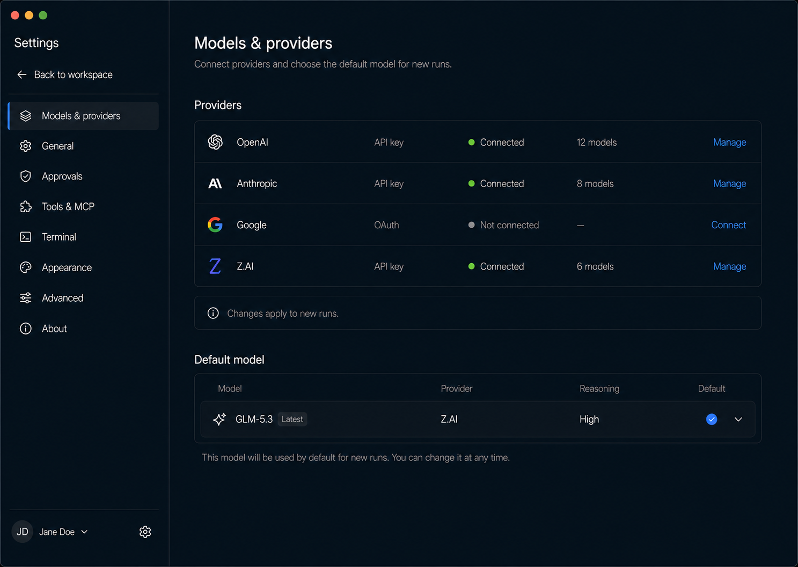

# Pawork Desktop 分阶段视觉基准

> 本目录保留 P0–P2 三张已交付目标设计图，并新增 OPT-D 六张统一候选稿（已获用户签字）。行为事实源：[GUI 设计](../docs/gui-design.md)；P0–P2 收尾证据见 [Desktop Spec](../docs/spec/desktop.md#8-gui-收尾验收记录2026-09-05)。当前活动线 [Desktop 优化 OPT](../docs/ROADMAP.md) 的候选稿见下一节；旧三张图不否决 OPT 需求。

## 0. OPT-D 统一设计交付（2026-09-05，已签字）

六张 PNG 均为 1440×1024，共用深色工作台、8px 节奏、蓝色主操作与稳定侧栏。它们是同一套设计的不同状态；当前生产 GUI 尚未按 OPT 图改像素。生成参考、完整修订提示词和尺寸处理见 [opt-prompts.md](opt-prompts.md)。

| 画幅 | 资产与验收重点 |
| --- | --- |
| 工作台，Inspector 收起 | [无项目任务](opt-workbench-inspector-collapsed-v1.png)：Unassigned、行右改名/归档、New task、No project 与文件工具不可用提示、右上重开入口 |
| 工作台，Inspector 打开 | [Changes / Terminal / Resources](opt-workbench-inspector-open-v1.png)：折叠控制与对话区让位 |
| Composer 模型菜单 | [供应商分组菜单](opt-composer-enabled-model-menu-v1.png)：只列启用项 |
| Settings 壳 | [全宽内容与四默认角色](opt-settings-shell-default-roles-v1.png)：固定导航占位、Conversation/Naming/Vision/Search |
| 供应商详情 | [展开凭证与模型弹层](opt-settings-providers-expanded-v1.png)：Proxy Switch、多个凭证状态、全开/全关、无 quota 数字 |
| 模型状态板 | [四种状态](opt-model-enablement-states-v1.png)：已连接空目录、未连接、部分启用、全关后不可发送 |

交给 OPT-2/3/4 的约束（签字后实施）：

- TaskRail / Settings Rail 目标 288px；1080–1279px 收敛到 240px。Inspector 默认收起，打开目标 440px，空间不足保持折叠。PNG 为生成视觉参考，尺寸以本段为准。
- 六处主要动作（分组、项目/任务新增、Activity、Inspector 折叠、Send/Cancel）的可见图标 20–22px，命中区至少 36×36px；Session 行改名/归档至少 32×32px，保留键盘与 AX 入口。
- Settings 内容用满 Rail 外可用宽度，两侧 32px padding，不保留 820px 上限；导航选中使用背景和不参与布局的内描边，文字坐标不变。
- 全局 New task 直接创建无项目任务，项目头 `+` 保留定向项目入口；文件工具须等选择项目。图中其他 New task 箭头不是第二条默认建项目流程。
- 四默认角色只从已连接且启用的候选中选；关闭所选模型显式失效。Vision/Search 在真实路由接线前只保存选择，说明这一限制。未连接时进入认证；空目录时刷新；全关时禁用发送。
- 图中 provider、模型、任务、凭证、diff 为设计样例，不是当前可用能力或运行证据。三张首稿保留的 `Jane Doe`/头像、附件与 `Open in editor` 不构成新增产品要求；正式实现统一使用 Local + gear，未实现入口隐藏。额度无权威数据时隐藏轨道与数字。

**交付状态**：资产与状态检查完成；**用户视觉签字已于 2026-09-05 确认**。设计闸门已放行；OPT-2/3/4 留待后续任务实施。下文 §1–3 仍描述 P0–P2 历史基线，冲突处在签字后按本节与 [GUI 设计 §8](../docs/gui-design.md#8-opt-d-统一候选稿已签字) 更新生产合同。

## 1. 保留资产

| 阶段 | 资产 | 用途 |
| --- | --- | --- |
| P0 Foundation | [desktop-ui-p0-foundation-v4.png](desktop-ui-p0-foundation-v4.png) | 三栏比例、组件状态、Projects 模式、直接切换按钮与 Composer |
| P1 Run & Review | [desktop-ui-p1-run-review-v4.png](desktop-ui-p1-run-review-v4.png) | Timeline 模式、Run 工作单元、tool group、完成摘要与 Changes |
| P2 Settings & Polish | [desktop-ui-p2-settings-v4.png](desktop-ui-p2-settings-v4.png) | Settings Rail、provider 概览、默认模型、留白与敏感信息层级 |

本目录允许 P0–P2 与 OPT 的目标设计资产；不向本目录或 `docs/` 检入真窗口截图、遮罩、差分图、标注图和临时视觉证据。需要复验时从当前源码和真实状态采集，结论写入当轮报告。

三张图分别冻结 P0、P1、P2 的视觉方向，不是三个可互换主题。动态内容与真实状态不同不构成单独的通过或失败依据。

## 2. 布局合同

- 宽屏为三栏：TaskRail 约 288px、Workspace 弹性伸缩、Inspector 约 440px。
- `1080–1279px` 时 TaskRail 收敛到 240px，Inspector 默认折叠；主操作不得被裁切或遮挡。
- Workspace Header 常驻；Timeline 从 Header 下开始阅读，短会话不沉到窗口底部。
- Composer 常态总高 88–94px，Send/Cancel 使用单一主操作槽；RunStatusBar 高 24px。
- Inspector 提供 Changes、Terminal、Resources；折叠后 Workspace 扩展，Activity 入口位于 Workspace Header 右侧。
- Settings 从 `Local` 行 gear 进入；进入后隐藏 Workspace/Inspector，以约 288px Settings Rail + 弹性内容区呈现，1080px 宽时 rail 收敛至 240px。
- 深色桌面工作台语言、8px 间距节奏。生产色值与尺寸以 `apps/desktop/src/ui/theme.rs` 为事实源，设计图不反向覆盖已验证的可访问性约束。

## 3. 交互与诚实性

- `Timeline / Projects` 是分组方式，`All projects / <project>` 是项目范围，两者正交。
- 分组按钮是 28×28px 二态直接切换，不打开菜单：Timeline 视图显示 folder icon + `Show projects`；Projects 视图显示 clock icon + `Show timeline`。图标表达目标动作，切换后随新目标变化。
- 项目范围菜单必须提供 `Add project…`，通过系统目录选择器把真实目录交给 Host；不得用 fixture 或预置项目冒充添加成功。
- 新 Task 绑定当前项目；无项目时明确要求先选择或添加项目。
- Timeline 只展示真实 Session / Run / Tool 事件。能力不可用时显示 unavailable、禁用或隐藏，不补假数据。
- Changes 只展示 Host 权威 Git 状态与 diff；Terminal 只展示真实 PTY 输出，纯文本视图必须过滤 ANSI/VT 控制序列。
- 菜单支持方向键、Enter 与 Escape；主路径控件需要稳定 identifier、role、name、value、enabled、focused 与 selected。

## 4. 对照方法

1. 使用 `./scripts/pawork-desktop.sh start` 构建并启动正式 Host/Desktop；不加载 fixture、seed、probe 或测试 profile。
2. 用磁盘文件、`git status` / diff 与终端 stdout 交叉核对 UI，不用截图单独证明功能正确。
3. 按 P0/P1/P2 对照对应设计图检查信息架构、层级、密度和主操作可达性；动态内容不同不构成通过或失败的唯一依据。
4. 自动检查、真窗口验收、人工视觉签字和发布状态分别记录，不能互相替代。

## 5. 非目标

- 不把 Desktop 改成 WebView、IDE 或多 Agent 控制中心。
- 不为匹配设计图写入演示数据、假 quota、假 diff、假 Agent 或不可用按钮。
- 不在视觉修复中演进 GUI wire、绕过 Workspace/Policy/Sandbox，或让 Desktop 直连 Core 服务。
