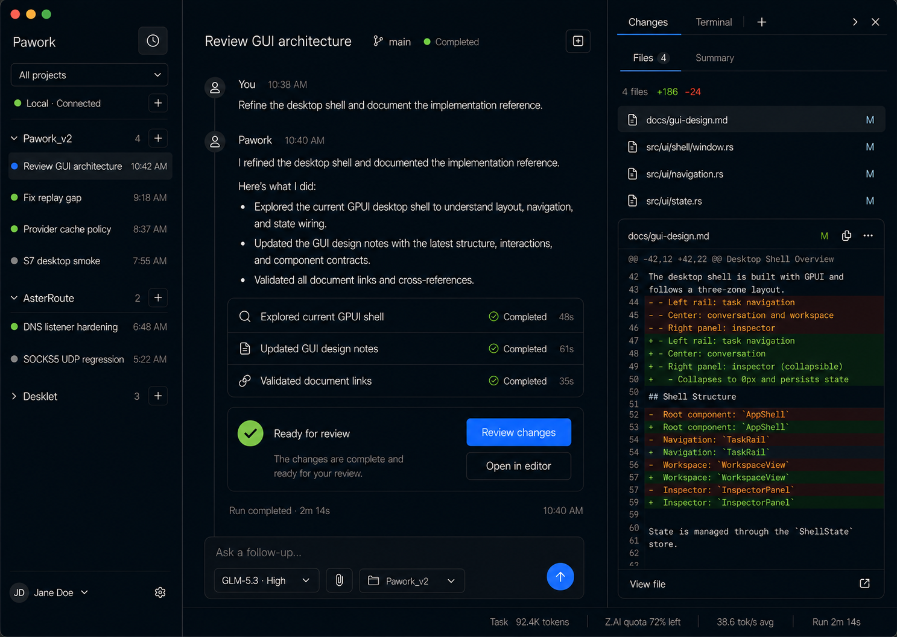
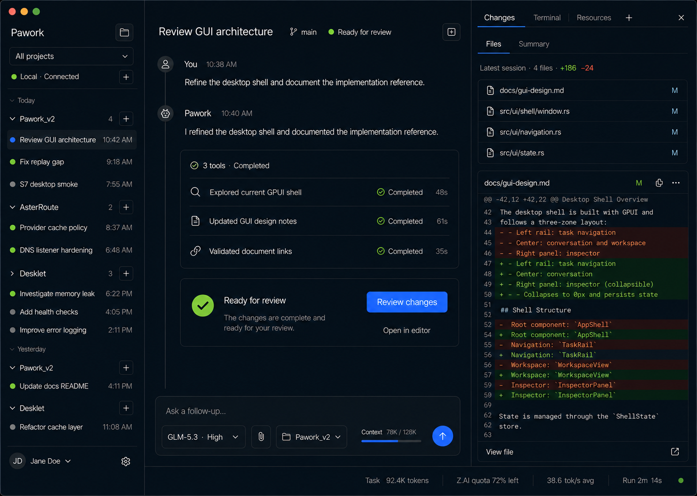
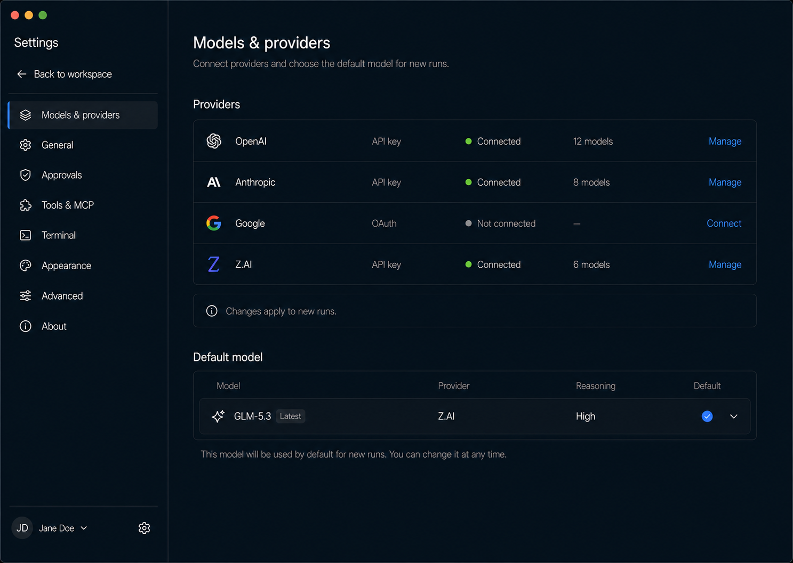

# Pawork Desktop 历史视觉资产

> 本目录保留视觉参考和生成素材；现行界面合同见 [GUI 设计](../docs/gui-design.md)，待办与未闭合验收见 [ROADMAP](../docs/ROADMAP.md)。历史图片不覆盖当前源码，也不作为新功能验收证据。

## 1. UI 规格与示意

| 参考 | 用途 |
| --- | --- |
| [工作台与共享 token](ui1-workbench-tokens.svg) | UI-1 工作台层级与共享组件示意 |
| [TaskRail 状态](ui2-taskrail-states.svg) | UI-2 普通、悬停 / 当前会话与键盘聚焦的几何示意 |
| [时间线](../docs/gui-design.md#ui-3-时间线更新2026-09-08进行中) | 阅读列、Markdown、思考与工具折叠 |
| [Settings](../docs/gui-design.md#ui-5-设置更新2026-09-08) | 导航、内容布局与 AX |
| [供应商](../docs/gui-design.md#ui-6a-供应商更新2026-09-08) | 供应商卡、凭证动作和模型目录 |
| [账号](../docs/gui-design.md#ui-6b-账号交互更新2026-09-08) | 命名账号、逐账号操作与选择 |
| [额度](../docs/gui-design.md#ui-6b-g2-额度交互更新2026-09-09) | 权威额度、过期与模式开关 |

SVG 为规格示意，PNG 为生成视觉参考；产品色值、尺寸和状态以当前源码与 GUI 设计为准。

## 2. OPT-D 设计资产

六张 PNG 均为 1440×1024，共用深色工作台、8px 节奏、蓝色主操作与稳定侧栏。生成参考、提示词与尺寸处理见 [opt-prompts.md](opt-prompts.md)。

| 画幅 | 资产与画面内容 |
| --- | --- |
| 工作台，Inspector 收起 | [无项目任务](opt-workbench-inspector-collapsed-v1.png)：Unassigned、行右改名/归档、New task、No project 与文件工具不可用提示、右上重开入口 |
| 工作台，Inspector 打开 | [Changes / Terminal / Resources](opt-workbench-inspector-open-v1.png)：折叠控制与对话区让位 |
| Composer 模型菜单 | [供应商分组菜单](opt-composer-enabled-model-menu-v1.png)：只列启用项 |
| Settings 壳 | [全宽内容与四默认角色](opt-settings-shell-default-roles-v1.png)：固定导航占位、Conversation/Naming/Vision/Search |
| 供应商详情 | [展开凭证与模型弹层](opt-settings-providers-expanded-v1.png)：Proxy Switch、多个凭证状态、全开/全关、无 quota 数字 |
| 模型状态板 | [四种状态](opt-model-enablement-states-v1.png)：已连接空目录、未连接、部分启用、全关后不可发送 |

图中 provider、模型、任务、凭证和 diff 是设计样例。旧图中的头像、附件及 `Open in editor` 不构成产品要求；额度无权威数据时不画轨道或数字。

## 3. P0–P2 阶段参考

| 阶段 | 资产 | 用途 |
| --- | --- | --- |
| P0 Foundation | [desktop-ui-p0-foundation-v4.png](desktop-ui-p0-foundation-v4.png) | 三栏比例、组件状态、Projects 模式、直接切换按钮与 Composer |
| P1 Run & Review | [desktop-ui-p1-run-review-v4.png](desktop-ui-p1-run-review-v4.png) | Timeline 模式、Run 工作单元、tool group、完成摘要与 Changes |
| P2 Settings & Polish | [desktop-ui-p2-settings-v4.png](desktop-ui-p2-settings-v4.png) | Settings Rail、provider 概览、默认模型、留白与敏感信息层级 |

三张图分别描述 Foundation、Run & Review、Settings & Polish 的视觉方向。它们是历史基线，不是可互换主题；动态内容与真实状态不同不单独决定验收结果。

## 4. 对照与证据

1. 使用正式 Host / Desktop 和当前源码采集窗口状态。
2. 用真实文件、Git、Host 或 PTY 输出核对功能效果；截图不能单独证明业务正确。
3. 对照当前 GUI 设计检查层级、密度与主操作可达性，历史资产只作视觉参考。
4. 自动检查、代理真窗口、用户验收和发布状态分别记录。

不向本目录或 `docs/` 检入真窗口截图、遮罩、差分图、标注图和临时视觉证据；新图另存，不覆盖历史资产。
