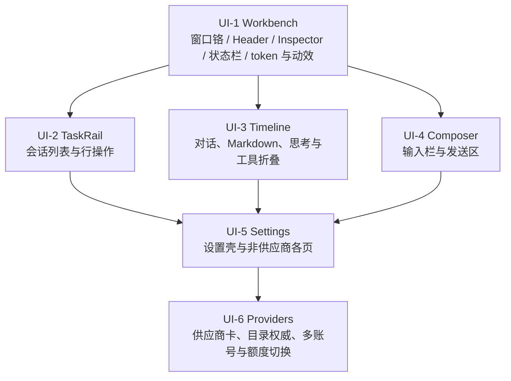

# Pawork 活动路线图：Desktop 模块重设计（UI）

> 基线日期：2026-09-07。状态：**UI-1 已实现、自动检查通过、用户人工视觉验收通过；未归档。UI-2 已实现、自动检查与代理真窗口检查通过，等待用户人工视觉验收；UI-3～UI-6 未开始**。来源：当日正式 Desktop 真窗口人工走查（#01–#05）。本文件是当前活动线的任务规划，**不是**源码或冻结契约的事实源。上一条 OPT-D / OPT-1～OPT-4 已关闭，全文与验收证据见 [review/roadmap-opt-2026-09-05.md](review/roadmap-opt-2026-09-05.md)。P0–P2 收尾证据仍见 [Desktop Spec §8](spec/desktop.md#8-gui-收尾验收记录2026-09-05)；未排期候选仍见 [backlog.md](spec/backlog.md)。

**做法**：每个任务重新设计**一个模块**的 UI 和交互，对照竞品与 [gui-design.md](gui-design.md) 参照项目（Codex Desktop、OpenCode、Cursor Agent、Zed Agent Panel、DeepSeek Harness）拉到同一美观度；静态观感和动态交互一起做。OPT-D 旧签字稿保留为历史，**不再否决**本线新视觉。

**共享约束**：

- UI-1 先定工作台 token / 动效节奏，后续模块沿用，不另起一套。
- 不造假额度、假模型、假搜索；无权威 QuotaSnapshot 就不画数字。
- 模型列表以供应商远端目录为权威，探测成功则替换静态条目；**禁止**按模型 id 硬编码隐藏。
- 不引入 Node/JS；不改四层 Desktop 架构；Desktop 仍只依赖 `pawork-client`。
- 凭证只进 auth backend；发布与全量门禁仍是 BK-RELEASE-01，未授权。

---

## 1. 走查总表

| ID | 模块 | 摘要 |
| --- | --- | --- |
| #01 | TaskRail | 鼠标悬停/选中会话行即显示重命名与归档，不必先点一次；归档图标更简洁 |
| #02 | Timeline + Composer | 对话区与输入栏观感远落后竞品；工具/思考默认铺开；Markdown 不成稿；Composer 贴边 |
| #03 | Workbench + Settings | 整个 GUI 静态和动态都过于原始；Settings 要按竞品等级重做 |
| #04 | Providers | DeepSeek 弹出已下线的 chat/reasoner；原因是静态目录与远端探测并集，不要硬编码过滤 |
| #05 | Providers | 同一供应商不能添加多个 OAuth 订阅或 API key；后续要能按剩余额度切换账号 |

---

## 2. 阶段

每个任务只重设计**一个模块**的 UI 与交互（静态观感 + 动态行为），不跨模块顺手改。

UI-2 / UI-3 / UI-4 写入集不重叠，可在 UI-1 token 稳定后并行。UI-5 用同一套 Settings 视觉语言。UI-6 在 UI-5 的供应商页上做产品与内核，不另做一页壳。

---

## 3. UI-1 — Workbench（主窗口壳）

对应 #03 的全局观感。模块：窗口铬、Workspace Header、Inspector、RunStatusBar、主题 token 与动效。

| 任务 | 内容 |
| --- | --- |
| UI-1 | 按竞品重做主窗口壳的静态布局和动态交互：留白、层级、焦点、悬停、折叠/展开过渡。定下本线共用色板、字阶、圆角、阴影、动效时长。Header / Inspector / 状态栏达到可与参照项目并排的完成度，后续模块不得各画一套。 |

不在本任务改会话行操作、时间线消息结构、Composer 或 Settings 内页。

---

## 4. UI-2 — TaskRail（会话列表）

对应 #01。模块：左栏范围筛选、分组、项目头、会话行。

| 任务 | 内容 |
| --- | --- |
| UI-2 | 重做会话行 UI 与交互：指针悬停或键盘选中时立即露出重命名/归档，不必先单击进入「已选中才出按钮」。归档图标改成更简洁的竞品形态。行高、时间戳、选中/悬停/当前会话三态一起设计，避免多一次操作。 |

改名/归档写口沿用 OPT-2；本任务不重做存储契约，只重做发现性与样式。

---

## 5. UI-3 — Timeline（对话时间线）

对应 #02 的聊天区。模块：消息气泡、Markdown、tool group、思考、Run 终态。

| 任务 | 内容 |
| --- | --- |
| UI-3 | 按有竞争力的 Agent 产品重做对话显示：重点（回复正文）与非重点（思考、命令、工具细节）分层；思考和执行命令默认自动折叠为摘要，可展开。修工具卡片叠字/透出、Markdown 原样星号、重复的空「Run completed」卡片、过密的作者行。 |

内核事件不减；改的是投影与渲染合同。

---

## 6. UI-4 — Composer（输入栏）

对应 #02 的输入栏。模块：草稿区、发送、模型选择、工作区 chip、上下文。

| 任务 | 内容 |
| --- | --- |
| UI-4 | 重做 Composer 的 UI 与交互：与窗口底边、侧栏、时间线脱开，不再贴边挤压。占位、模型、发送、上下文的层级和命中区按竞品对齐；空会话/无项目/全禁用模型等诚实空态保留。 |

---

## 7. UI-5 — Settings（设置壳与各页）

对应 #03 的设置页。模块：Settings Rail、全宽内容、Models 以外的各页（Network / Approvals / Tools / Terminal / Appearance / Advanced / About）。

| 任务 | 内容 |
| --- | --- |
| UI-5 | Settings 整页按竞品重做视觉和交互：导航选中、页内分区、控件（按钮/Switch/输入）与主窗口同一 token。本任务覆盖壳层和上述各页；供应商卡的多账号与目录权威放到 UI-6，避免同一文件双任务抢写。 |

已落盘的设置行为不重做；本任务是呈现与交互。

---

## 8. UI-6 — Providers（供应商、目录、多账号）

对应 #04、#05。模块：Models & providers 页的供应商卡、Manage models 弹层、Credentials、Usage。

| 任务 | 内容 | 内核 |
| --- | --- | --- |
| UI-6a | 重做供应商卡与模型弹层的 UI/交互；探测成功时该 provider **以远端 /models 为权威**（替换静态条目，失败才 fallback）。DeepSeek 因此只出现 v4 三模型。禁止按 id 黑名单隐藏 chat/reasoner。 | models_overview / model_catalog 的并集改替换；静态 builtin_entries 只作探测失败回退 |
| UI-6b | 同一供应商可按其支持的方式添加**多个** OAuth 订阅或 API key（同 kind 多账户，不再只是 key 与 OAuth 两类各一份）。可在账号间切换；有权威额度后再按剩余额度切换，无来源时不画假数字，但切换入口要先在。 | 将 backlog G1 账户池纳入本线；G2 QuotaSnapshot 有来源才接自动切换。Secret 仍只进 auth backend |

---

## 9. 明确不做（本线）

- 不一次做完 G3–G6（缓存亲和、子 Agent 绑定、缓存策略、账户导入）和 G7 网关。
- 不为填图造假额度或伪造模型目录。
- 不把全局代理/审批写进仓库 `.pawork/config.toml`。
- 不覆盖 P0–P2 与 OPT-D 历史设计资产；本线新图另存 `design/`。
- 发布、全量门禁、三平台安装器仍是 [BK-RELEASE-01](spec/backlog.md)。

---

## 10. 契约与文档同步

实现触及下列项时，**同批**更新对应文档，golden 先于 wire 改动：

- GUI 命令/查询/config schema → ADR + [architecture.md](architecture.md) §3.2 + [contracts.md](spec/contracts.md) + 包级 Spec
- 目录权威、多账号、额度切换 → [settings.md](spec/settings.md)（新 ADR）
- 主窗口信息架构与模块视觉 → [gui-design.md](gui-design.md) + [design/README.md](../design/README.md)
- 用户可见能力 → [capabilities.md](spec/capabilities.md)

---

## 11. 状态

| 任务 | 状态 |
| --- | --- |
| UI-1 Workbench | 已实现；Desktop 定向自动检查 213/213 通过；代理真窗口检查通过；用户人工视觉验收通过（2026-09-07）；未归档 |
| UI-2 TaskRail | 已实现；Desktop 自动检查 214/214 通过；代理真窗口检查通过；等待用户人工视觉验收；未归档 |
| UI-3 Timeline | 已立项，未开始 |
| UI-4 Composer | 已立项，未开始 |
| UI-5 Settings | 已立项，未开始 |
| UI-6 Providers | 已立项，未开始 |

走查原文与截图在本机走查笔记中，不检入仓库。

### UI-1 本批证据（2026-09-07）

- **已实现**：共享中性深色 token、紧凑 Header、Inspector 两级页签、180ms 连续开合、30px 分组运行状态栏。过渡期 AX 与可见宽度一致，隐藏动作不发布；1288px / 1320px 展开下限保证 Workspace ≥560px。规格见 [GUI 设计](gui-design.md#ui-1-工作台视觉更新2026-09-07) 与 [设计索引](../design/README.md#ui-1-当前工作台规格2026-09-07)。
- **自动检查通过**：`cargo test -p pawork-desktop --offline --bins --features gpui/runtime_shaders`，213 passed / 0 failed；`cargo build -p pawork-desktop --offline --bins --features gpui/runtime_shaders` 成功。`git diff --check`、新增 SVG XML 与本批文档本地链接检查通过。未运行全量 workspace 门禁。
- **本机构建说明**：`target/debug/deps` 有 478,508 个历史产物，目录遍历约 74s，旧路径宏库加载也长时间等待。本批使用临时 `RUSTC_WRAPPER=/tmp/pawork-ui1-rustc-wrapper.py` 将 Desktop 的依赖搜索指向 `target/ui1-rustc-deps`（复用现有库；宏库复制到小目录），不修改 Cargo 配置或依赖。单个 Desktop 增量目录移到 `target/ui1-cache-backup` 保留，未执行清理命令。实际日志：`/tmp/pawork-ui1-tests.log`、`/tmp/pawork-ui1-build.log`。
- **代理真窗口检查通过**：解锁后，以独立候选 bundle `target/pawork-desktop-runtime/Pawork-UI1.app` 连接 `/tmp/pawork-opt4-review/data/pawork-gui-opt4-review.sock`；二进制 SHA-256 与本次 build 相同，未覆盖原运行 bundle。已检查 Inspector 开合 / 连续切换、Changes / Terminal / Resources 页签、Activity → Changes 与焦点、宽窗和 1080×720 内容下限、100% / 125% / 150% 字号；窄窗自动收起，恢复宽窗后保留所选页签，Header 与状态栏保持可见。最后恢复 100% 字号。
- **窗口外证据**：候选 `--probe --socket /tmp/pawork-opt4-review/data/pawork-gui-opt4-review.sock` 成功，`sessions=1, models=13`（`/tmp/pawork-ui1-probe.log`）；进程参数确认测试 Host 为 `opencode-go / glm-5.3-flash`。创建了一个未绑定项目的空测试会话，未发起 Run；Changes 如实显示 `no workspace`，Resources 显示 0 servers，状态栏保持 unavailable / idle。本批未验证真实 Run、文件差异或终端执行。
- **用户人工视觉验收通过**：2026-09-07 用户确认「UI-1 视觉通过」。验收范围是工作台壳观感、Inspector 开合 / 反向过渡 / 页签，以及 100% / 125% / 150% 下 Header 与状态栏仍可见；会话行、时间线、Composer、Settings 不在本批。截图不检入仓库。
- **状态边界**：已实现、自动检查通过、用户人工视觉验收通过；UI-1 未归档（未做发布级收口）。本记录为 UI-1 收口时状态，当时 UI-2～UI-6 未开始；UI-1 已推送到 origin/main（`0ae22304`），未发布。

### UI-2 本批证据（2026-09-07）

- **已实现**：非当前会话在指针悬停或键盘聚焦时立即露出改名 / 归档，焦点进入动作后继续保留；当前会话始终显示。时间戳与两个 32×32px 动作共用 64px 固定槽，标题不随按钮出现而挤动。44px 行高、14px 标题、12px 日期 / 时间、14px 项目头，沿用 UI-1 色板与 6px 控件圆角；归档使用 16px 单色盒形图标。改名 / 归档点击停止传播，不误开会话。规格见 [GUI 设计](gui-design.md#ui-2-会话行更新2026-09-07) 和 [状态图](../design/ui2-taskrail-states.svg)。
- **自动检查通过**：`cargo test -p pawork-desktop --offline --bins --features gpui/runtime_shaders`，214 passed / 0 failed；新增一个真实 GPUI hover / click / Tab 回归，覆盖非当前会话直接改名、行宽稳定、取消后焦点、断线禁写与 AX 可见性。`cargo build -p pawork-desktop --offline --bins --features gpui/runtime_shaders` 成功。`git diff --check`、规格 SVG XML 与文档本地文件链接检查通过。日志：`/tmp/pawork-ui2-tests.log`、`/tmp/pawork-ui2-build.log`。
- **本机缓存复用**：继续使用 UI-1 的 `RUSTC_WRAPPER=/tmp/pawork-ui1-rustc-wrapper.py`。测试运行增加临时 `CARGO_TARGET_AARCH64_APPLE_DARWIN_RUNNER=/tmp/pawork-ui2-test-runner.py`，仅将已编译测试二进制复制到 `/tmp` 执行，绕过巨大 `target/debug/deps` 目录带来的加载等待；不改 Cargo 配置、依赖或测试逻辑。
- **代理真窗口检查通过**：独立 `target/pawork-desktop-runtime/Pawork-UI2.app` 连接既有 `opt4-review` 测试 Host（当次参数 `opencode-go / glm-5.3-flash`），未覆盖运行中的原 bundle。候选与 build SHA-256 均为 `efd94d9ff89247bccc36308c0803ba4c447748d9513c1f1b29a64fad670b200b`。已检查悬停非当前会话、Tab 聚焦后 Enter 改名、Esc 取消、长标题、100% / 125% / 150% 字号及窄窗布局；直接归档非当前会话后当前会话未切换。已恢复宽窗与 100% 字号，保留候选窗口供用户验收。
- **窗口外事实**：只读测试 Host `session.db` 确认 `ses-1788785563281-2` 长标题已落盘且 `archived=1`，`ses-1788785605178-3` 标题为 `UI-2 视觉验收 · 会话列表与行操作`、`archived=0`；记录 `/tmp/pawork-ui2-persistence.json`。候选 `--probe` 成功，`sessions=2, models=13`（`/tmp/pawork-ui2-probe.log`）。本批只操作两个新建测试会话，未发起 Run。
- **审查**：确定性检查后只读代码审查无可行动发现，检查了可见性、点击隔离、Tab、断线 gate 与共享组件默认行为。此前一次 GLM 审查因任务传输格式不兼容在执行前失败，改用原生审查者完成。提交前复查项目头计数命中区、悬停可见性与规格链接，无阻塞问题。
- **用户视觉反馈修正**：项目头计数移入同一交互区域，悬停背景与键盘焦点边框完整覆盖右侧计数；同步 AX 点击区域。有项目的独立「+」按钮保持独立。修正后上述 Desktop 测试仍为 214 passed / 0 failed，构建成功（`/tmp/pawork-ui2-header-tests.log`、`/tmp/pawork-ui2-header-build.log`）。独立 `target/pawork-desktop-runtime/Pawork-UI2-header.app` 真窗口确认完整高亮、点击计数折叠、Enter 展开及完整焦点边框；候选与 build SHA-256 均为 `000653aac319d4c28cd51c14c97f08c5001f0a400e6a415a0582e0f721b38620`，保留修正窗口供用户验收。
- **状态边界**：已实现、自动检查通过、代理真窗口检查通过；**等待用户人工视觉验收，未归档**。本提交收录实现与规格，未推送、未发布；未运行全量 workspace 门禁。UI-3～UI-6 未开始。
