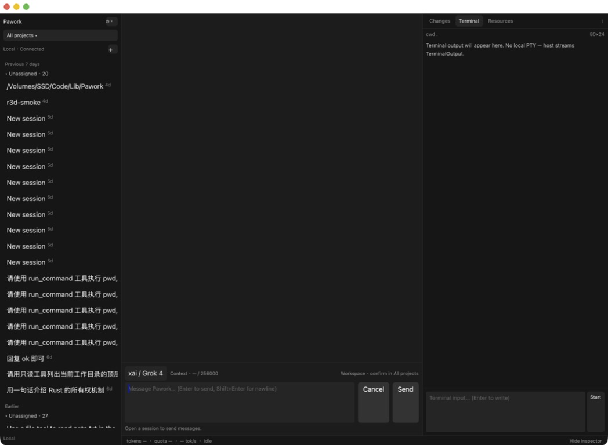
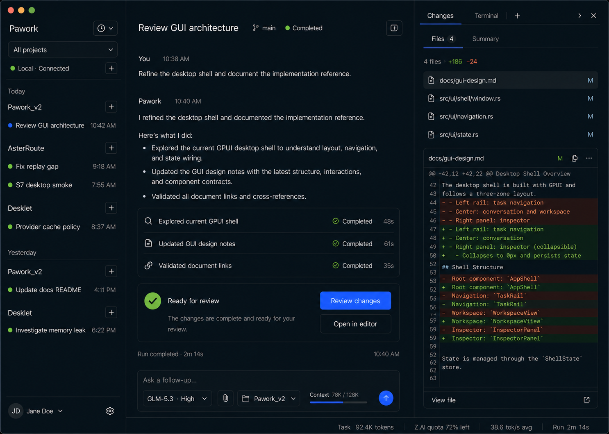
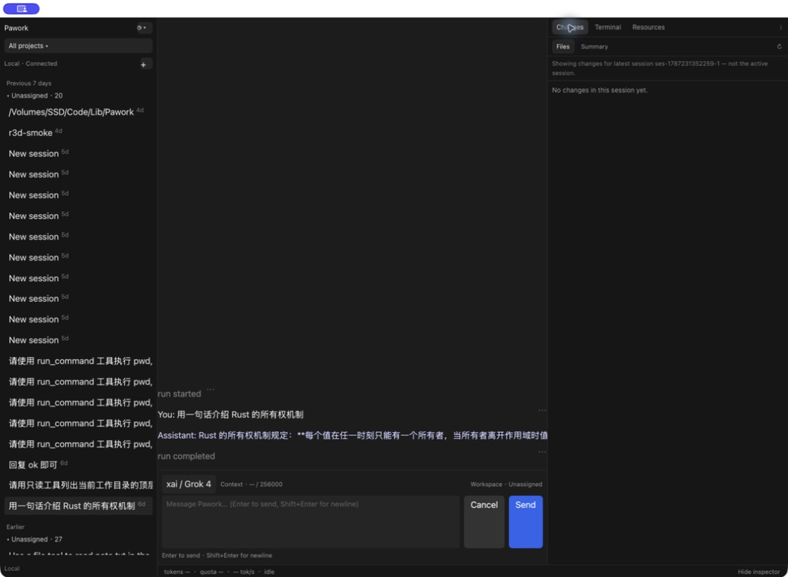
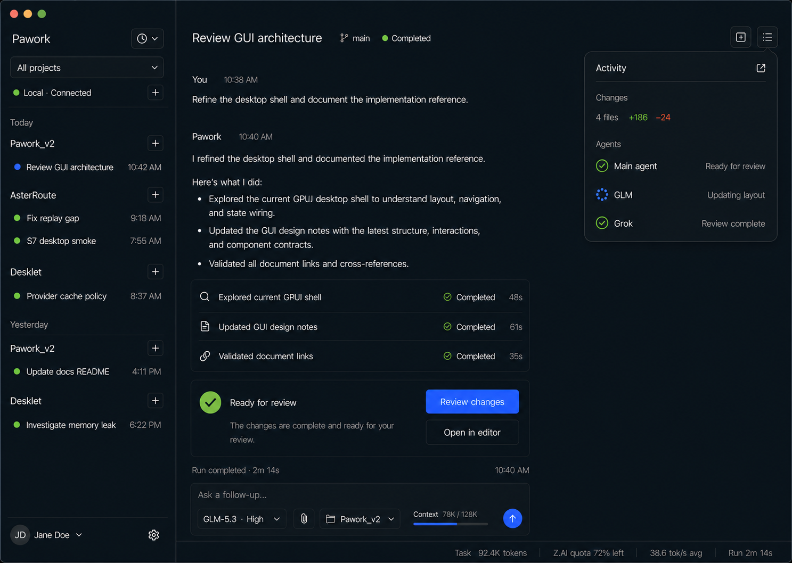
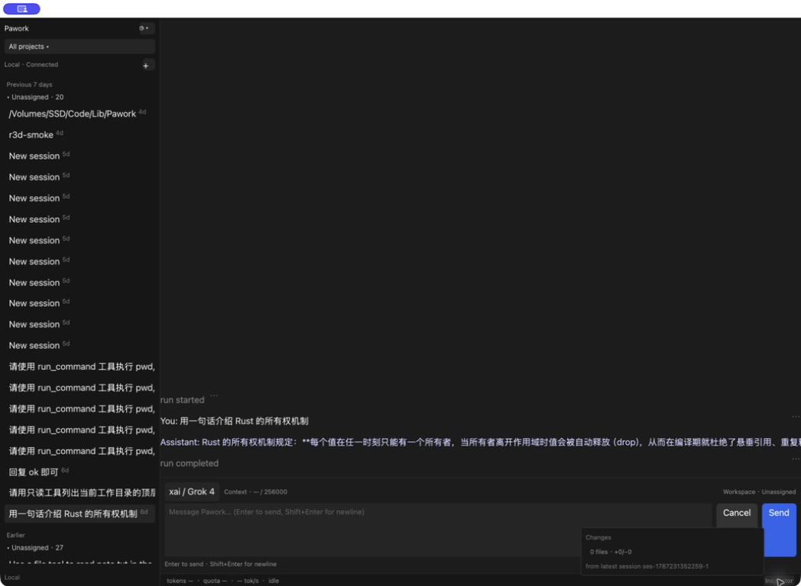
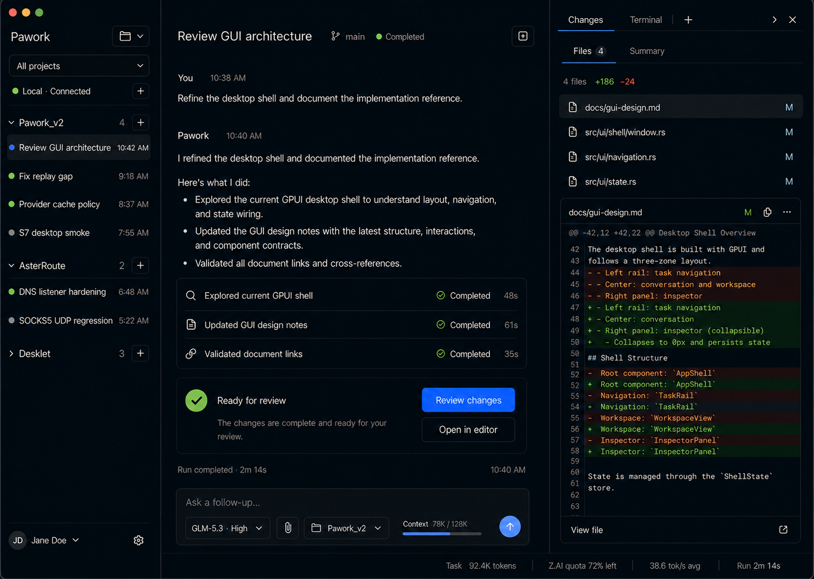
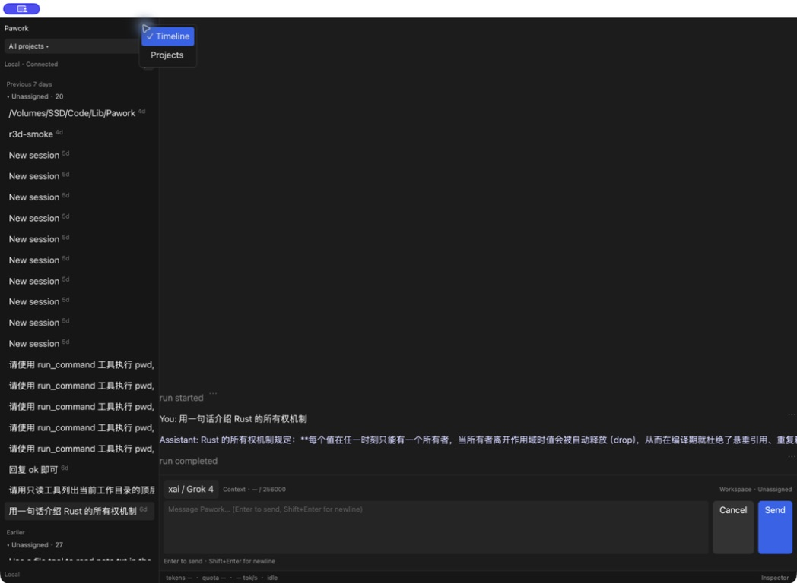
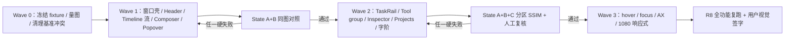

# Pawork Desktop UI 视觉复审与 99% 一致性验收合同

> 复审日期：2026-08-25；Wave A 合同复核：2026-08-26；Wave D State A 取证：2026-08-27 
> 初始复审对象：`apps/desktop` `main@ada6249` 的真实 GPUI 窗口；最新 State A 证据见 [Wave D 收口记录](ui-review/wave-d/notes.md) 
> 视觉事实源：[GUI v3 视觉实施基准](../design/README.md) · [Desktop GUI 设计](gui-design.md) 
> 定稿图：[Timeline 展开](../design/desktop-shell-timeline-v3.png) · [Timeline 折叠](../design/desktop-shell-timeline-collapsed-v3.png) · [Projects](../design/desktop-shell-projects-v3.png) 
> 当前执行入口：[ROADMAP R1–R8](../ROADMAP.md#2-顺序排期) · [R1 收口存档](history.md#r1--视觉合同固定-fixture-与-ui-测试基座2026-08-2527) · [R7–R8 全功能验收](../plan/R7-R8-ui-quality-gates.md) 
> 本轮追加约束：后续美观化必须与定稿图对齐；只允许细微像素、大小和宽窄误差，不允许用“已经可用”或“当前实现如此”替代视觉还原。

## 0. 复审结论：当前不通过

当前 UI **明显未达到 99% 一致性，也不具备新路线 R8 的 1440×1024 视觉签字条件**。差异集中在窗口壳、Workspace header、Timeline 内容层级、Composer、折叠态 ActivityPopover、字体与 Projects 取证，不属于只需微调颜色或圆角的尾差。

本轮不输出虚假的“当前完成度百分比”：现有当前截图被取证工具缩放为 `1048×768`，且 Projects 终态缺失，不满足同尺寸、同状态的像素量化前提。但白色标题栏、缺失 Header、底部 Popover、平面 Timeline 和超高 Composer 等结构级差异已经足以判定 **远低于 99%**。

### 0.1 “99% 一致性”的硬定义

`99%` 不是一张全屏图的主观评分，也不能只用全屏 SSIM 证明。大面积空白会稀释关键区域差异。最终必须同时通过下列约束：

| 层级 | 硬要求 | 允许误差 |
| --- | --- | --- |
| 结构与状态 | 定稿图可见区域、组件、顺序、展开/折叠和选中状态 100% 对齐；不得缺失、替换或增加破坏层级的 Surface | 不允许误差 |
| 主几何 | TaskRail、Workspace、Inspector、Header、Composer、StatusBar 与 Popover 的位置和比例一致 | 主栏宽高 `±8px` 或 `±1.5%`，取更严格者 |
| 组件几何 | 重复间距、内边距、行高、按钮和图标槽位一致 | 间距 `±2px`；字体、图标、描边、圆角 `±1px` |
| 视觉语言 | 深色整窗、surface 层级、文字层级、边框、状态色和图标语义一致 | 冻结 token 精确复用；仅忽略字体抗锯齿和显示器色差 |
| 交互 | hover、active、focus、菜单、折叠、滚动与主操作位置符合设计；开合不引发布局跳动 | 不允许遮挡、截断、漂移或用错锚点 |
| 区域量化 | TaskRail、Header、Timeline、Composer、Inspector/Popover、StatusBar 分区比较 | 动态内容遮罩后，每个区域的每个 RGB channel SSIM `≥ 0.99`；代码固化 0.99 下限，配置只能提高；不能用全屏均值替代 |

动态数据只允许遮罩“值本身”，例如时间、token、文件名、diff 文本和 Agent 名称；多行正文与 Diff 必须逐行紧遮，Diff 的 gutter、+/− 前缀、行距和语义底色必须保留。另只允许四边 2px 的 reference artifact，以及锚点仍无法表达时收敛到纯边缘背景的 `geometry-drift`（当前三态未使用）。容器位置、文字基线、字阶、行数密度、状态图标和留白仍须对齐。遮罩区域须在两图中先写入相同中性值再排除统计，避免局部 SSIM 窗口泄漏；任一分区遮罩面积不得超过代码固化的 35%，zone 公共裁剪覆盖率不得低于代码固化的 50%，配置只能收紧这两项。设计图的演示数据不得写入生产代码。

以下任一项存在即直接判定不通过，即使 SSIM 数值超过 `0.99`：

- 白色或分离的原生标题栏；
- 缺失 Workspace header、工具活动组、完成摘要或目标状态中的关键入口；
- Composer、Popover、菜单或 Inspector 遮挡主操作；
- 文本截断、不可读的无限行宽、面板溢出或布局跳动；
- 用假 quota、假 diff、假 Agent、假按钮或不可用入口填充定稿图；
- 用修改设计基准来追认当前漂移，而未先取得用户对设计变更的明确批准。

### 0.2 目标优先级与本轮纠偏

- 架构红线、协议事实和真实 capability 仍高于截图演示数据；没有权威数据时隐藏、disabled 或显示 `unavailable`，不能伪造。
- 在不涉及数据真伪的视觉层面，三张 v3 定稿图和 `design/README.md` 的冻结布局是本轮目标；当前实现和历史验收记录不能反向降级目标。
- 设计图中的轻微蓝色渐变和抗锯齿不硬编码为新 token；这是冻结文档已经明确的唯一色彩例外，不是放宽布局和层级的口子。
- 原审查中的“有意偏离时先更新设计文档”已撤回。若确需改变设计，必须另立设计变更任务并由用户明确批准；本轮优化不得顺手改基准以制造通过。

## 1. 审核范围与证据

本次为 Combined audit：复核视觉还原、主路径层级、关键交互状态与截图可见的 accessibility 风险。用户在本轮明确要求重新审视既有 Review，因此以下本地截图继续作为当前实现证据；没有新截图的状态保持阻塞，不以源码推断冒充视觉验收。

| 项目 | 本轮口径 |
| --- | --- |
| 构建证据 | 先前已验证 `cargo build -p pawork -p pawork-desktop --offline --features gpui/runtime_shaders` 通过；Wave A 只改视觉合同资产、Python 门禁与文档，不改 Rust 生产路径，因此不重复构建 |
| 运行证据 | 当前源码启动 `pawork gui serve` 与真实 `pawork-desktop`，连接本机持久化会话 |
| 目标视口 | `1440×1024` 内容窗口；最终不得把 macOS 额外标题栏高度混入内容区 |
| 初始截图 | Computer Use 保存的窗口截图被缩放为 `1048×768`，只支持结构和相对比例判断；Wave D 另存同 fixture 的 1440×1024 真窗口 current/diff |
| 设计基准 | State A `1486×1059`、State B/C `1487×1058`；使用全画布 LANCZOS 缩放、无裁切归一到 `1440×1024` |
| 数据状态 | 固定真实 fixture 已由 R1 Wave B 建立（fixtures/ui/seed.json + ui_fixture example）；R1 Wave D 已完成 State A 真窗口双基线、故意漂移与恢复取证，当前视觉还原仍由 R2–R6 继续推进 |

初始截图左上角的紫色小浮层是取证工具控件，不属于 Pawork UI，比较时必须裁除。

## 2. 逐状态复审

### Step 0 — 启动空态：需改进

健康度：**⚠️ 可用，但不满足目标首屏质感。**

- 诚实空态是正确方向，没有用假卡片填满主区。
- 白色系统标题栏割裂深色窗口；缺少明确而克制的“选择或新建 Task”引导。
- 右侧默认 Terminal 抢占首屏注意力，整体更像调试壳而非设计稿中的 Agent 工作台。
- 空态不纳入三张主图的 99% 像素门禁，但必须继承同一窗口壳、字阶、Composer 和 Inspector 视觉系统。

### Step 1 — Timeline + Inspector 展开：不通过

| v3 设计基准 | 当前真实 UI |
| --- | --- |
|  |  |

健康度：**❌ 结构级不一致。**

- 整窗深色 chrome 未实现；白色 titlebar 是第一眼最大偏差。
- Workspace 缺失 Task 标题、branch、Completed 状态和右侧动作入口。
- Timeline 以 `You:`、`Assistant:`、`tool · status` 平面前缀呈现，缺少设计稿中的消息节奏、工具活动组和完成摘要。
- `ListAlignment::Bottom` 让短会话沉在底部，Header 下方出现失控空白；目标图从 Header 下连续阅读。
- Composer 把 `88px` 用作输入框最小高度，而不是常态总高度；Cancel 与 Send 被拉成大块并持续抢占注意力。
- Inspector 顶层与二级 tabs 过小，Changes 空态贴边；Files 列表和 DiffView 因缺少真实 diff 数据尚不能签字。

### Step 2 — Timeline + Inspector 折叠 + ActivityPopover：不通过

| v3 设计基准 | 当前真实 UI |
| --- | --- |
|  |  |

健康度：**❌ 核心交互位置与定稿图相反。**

- 当前 ActivityPopover 从底部 StatusBar 向上打开并覆盖 Composer 右侧；目标是 Workspace 右上触发、向下展开且不侵入输入区。
- 当前 Popover 只有弱层级 Changes 摘要和 raw session id；目标有清晰标题、摘要分区、状态图标和动作出口。
- Agent 数据仍必须 capability-driven。S11 数据不可用时可隐藏内容行，但 Popover 的右上位置、标题、宽度、surface 和间距仍须匹配。
- Inspector 折叠释放 440px 宽度的行为正确，但 Timeline 随后无限拉宽，长文本延伸到右缘并被截断。

### Step 3 — GroupingMenu → Projects：阻塞

| v3 Projects 基准 | 当前 GroupingMenu 取证 |
| --- | --- |
|  |  |

健康度：**⏸️ 菜单已取证，Projects 终态未取证。**

- GroupingMenu 是浮层且当前项有 checkmark，未挤动内容流；这一交互方向正确。
- 菜单、glyph、文字与触发器明显偏小，视觉密度仍未对齐。
- 切换 Projects 的最后一步遇到 macOS 自动锁屏；没有用旧截图或源码推断冒充终态。
- 在补齐 Projects 当前截图前，项目头、task count、定向 `+`、展开态、选中态和滚动保持均不能判定通过。

## 3. 逐区域一致性矩阵

下表是后续实现的直接写入清单。“验收”指同视口、同 fixture 的 reference/current/overlay/diff 证据，而不是开发者自评“更好看”。

| ID | 区域 | 定稿目标 | 当前差异 | 必须更新 | 99% 验收点 |
| --- | --- | --- | --- | --- | --- |
| F-01 P0 | Window chrome | traffic lights 与深色壳一体，顶部无白带 | 原生白色 titlebar 独立存在 | 配置沉浸式/透明 macOS titlebar，保留安全区 | 1440 图顶部结构一致；无白边、重复标题栏或内容偏移 |
| F-02 P0 | 三栏骨架 | 288px TaskRail、弹性 Workspace、约 440px Inspector | 基础宽度接近，但额外 titlebar 与内部留白改变整体比例 | 固定内容视口，再校准分隔线与底栏连续性 | 主栏在容差内；分隔线贯通且无双线 |
| F-03 P1 | TaskRail 顶部 | Pawork + grouping glyph；范围筛选；连接 + 全局新建 | 字号、glyph、点击面和行距过小 | 按量图结果重建标题、筛选和连接三层节奏 | 三行层级、图标槽位、hover/active 与图一致 |
| F-04 P1 | TaskRail 列表与底部 | Timeline 为日期→项目→Task；Projects 为项目→Task；底部账户/设置 | `Unassigned`、raw path、重复 `New session` 主导；底部仅 Local | 先补真实标题/Workspace 元数据，再对齐分组密度、账户区与设置位 | 不出现重复身份噪声；目标 fixture 下结构和密度一致 |
| F-05 P0 | Workspace header | Task 标题、branch、终态、右侧动作固定在顶部 | 整块缺失 | 新增真实字段驱动 Header；缺字段只隐藏单项，不删除骨架 | 标题基线、状态间距、动作槽位与图一致 |
| F-06 P0 | Timeline 起始位置 | Header 下方连续阅读，短会话不出现巨幅空画布 | 短会话被钉底 | 区分初始/短会话布局与流式 follow 行为 | 首条消息位置一致；follow-scroll 仍正确 |
| F-07 P1 | 消息层级 | 发言者、时间、正文、列表和段落有稳定节奏 | 扁平前缀行、字号过小、长行截断 | 重构 entry 视觉结构并设置 readable width | 正文不超宽；段落、列表与角色间距一致 |
| F-08 P0 | Tool group 与完成摘要 | tool 活动组、状态、耗时、Ready for review 摘要清晰 | 只有单行 `tool · status`，完成摘要缺失 | 基于真实事件组装可折叠活动组与终态摘要 | 不伪造事件；固定 fixture 下数量、层级与状态匹配 |
| F-09 P0 | Composer | 88–94px 常态总高；28–30px 控件；32px Send；ContextMeter 同行 | 88px 变成输入框最小高，Cancel/Send 过大 | 重新定义总高、增长策略、idle/running 动作和 footer | 常态总高在容差内；无按钮拉伸、遮挡或跳动 |
| F-10 P1 | Inspector tabs | 顶层与 Files/Summary 二级层次明确；动作位清晰 | 顶层过小；`Resources` 与定稿 `+`/Add tool 范围冲突 | 先完成 D-02 范围决策，再按真实 capability 呈现 | 顶/二级视觉不可混用；目标 fixture 的可见项一致 |
| F-11 P1 | Changes / DiffView | 文件摘要、选中行、diff 卡面、行语义色和底部动作完整 | 本轮只有空态，无法证明完整形态 | 构造真实 diff fixture，逐项校准 Files 与 DiffView | 文件行、diff 行高、横滚、语义色和动作均有证据 |
| F-12 P0 | 折叠 Activity | 右上约 320px Popover，不覆盖 Composer；摘要可恢复 Inspector | 底部锚定并遮挡输入 | 移动触发器和 anchored popover；保留 capability honesty | State B 位置、宽度、标题与间距一致；零遮挡 |
| F-13 P1 | RunStatusBar | 24px，Task/quota/tok/s/Run 顺序稳定 | 字阶和分隔弱，Inspector 触发器喧宾夺主 | 恢复信息顺序、稳定占位和窄窗收敛 | 高度、基线、分隔与目标一致；缺值诚实 |
| F-14 P0 | Projects | 项目头、count、展开、定向 `+`、Task 选中完整 | 终态无当前截图 | 补真实 Projects 取证并逐组件修复 | State C reference/current/diff 全部存在后才能签字 |
| F-15 P0 | 字体/图标/间距 | 桌面可读字阶、克制字重、16px 级图标、8px 节奏 | 全局 11/12/13px 过小，控件像调试 UI | Wave 0 先量图，不把 `12/14/16` 猜测写成定稿 | 字体/图标 `±1px`，重复间距 `±2px`，层级肉眼一致 |
| F-16 P1 | 交互与 focus | hover/active/focus 不改布局；菜单可键盘操作 | R7 Wave A/B 已补齐主路径与边角焦点交接；Wave C 默认平台态又通过 1080×720、1024 行、长内容、三轮 resize、断线重连、Composer 焦点耐久与连接长文案定宽截断的最终 U2；VoiceOver、字号放大、主动平台偏好和 R8 全矩阵仍未完成 | Wave C 补字号放大与主动 reduced motion / 高对比态，R8 汇总系统级与全组件证据 | 原生 AX、鼠标和纯键盘 trace/清单通过；无颜色单一编码 |

## 4. 设计文档冲突与处理决定

这些冲突若不先清理，会让实现者继续选择对自己有利的段落，无法达到 99%。本轮先在 Review 中给出验收解释；实现波次同批回写正式事实源。

| ID | 冲突 | 本轮处理 |
| --- | --- | --- |
| D-01 | `design/README.md` §2/§5.1 与定稿图要求 ActivityPopover 在右上；§8.5 又记录由底部 StatusBar 触发 | 以用户本轮要求、定稿图和 §2/§5.1 为验收目标；§8.5 只视为当前实现记录，不再作为视觉通过依据 |
| D-02 | 定稿图与 §5 显示 `Changes / Terminal / Add tool`；§8.5 暂时固定 `Changes / Terminal / Resources` | 不画假 Add tool，也不把 Resources 当作已经对齐。先确定真实 surface 注册路径；在完成前 F-10 保持未通过 |
| D-03 | 冻结布局要求 1080–1279 收窄 rail、默认折叠 Inspector；K-03 历史记录曾接受延期 | 99% 主门禁只针对 1440×1024 三状态；1080×720 恢复为必须通过的响应式功能门禁，不要求与 1440 截图像素相同 |

## 5. 固定视觉 fixture 与取证协议

现有本机历史会话内容随机、密度失控，不能用于 99% 对照。Wave 0 必须建立可重复的真实 fixture；fixture 可以固定输入，但最终 UI 必须由 Host/协议/真实组件渲染，不能在生产组件里写死演示文本。

### 5.1 固定数据状态

- 至少 3 个真实 Workspace，覆盖 Timeline 日期分组与 Projects 展开/折叠。
- 1 个选中的完整会话，含 user/assistant 多段正文、列表、3 个 completed tool events、run terminal summary。
- 1 个真实 Changes 状态，含 4 个文件、选中文件、增删统计和可横滚 diff。
- Inspector 展开、Inspector 折叠 + ActivityPopover、Projects 展开三状态消费同一 active session。
- capability 不可用的 quota、Agent 或 tool surface 使用真实 `unavailable`/hidden 语义，并在遮罩清单中注明，不补假数。

### 5.2 三个固定截图状态

| State | 必须固定的可见状态 | 对应基准 |
| --- | --- | --- |
| A | Timeline；Inspector 展开；Changes/Files；选中文件与 diff；完整 Header、Timeline、Composer、StatusBar | `desktop-shell-timeline-v3.png` |
| B | Timeline；Inspector 折叠；ActivityPopover 右上打开；同一会话与滚动位置 | `desktop-shell-timeline-collapsed-v3.png` |
| C | Projects；目标项目展开；当前 Task 可见且选中；Inspector 与 State A 相同 | `desktop-shell-projects-v3.png` |

### 5.3 捕获条件

- macOS、dark、内容区严格 `1440×1024`、显示缩放与字体渲染固定；记录 OS、显示器 scale、HEAD 与 fixture id。
- reference 使用同一脚本归一到 `1440×1024`；current 直接捕获内容区，不先缩放到聊天窗口尺寸。
- 截图前等待字体、diff、滚动与状态稳定；关闭光标闪烁、取证浮层和非 Pawork overlay。
- 每次只比较同一 State；不得拿空会话与丰富设计稿、Timeline 与 Projects、Inspector 展开与折叠交叉比较。

## 6. 修复顺序与新 R1–R8 映射

下图保留审计发现的修复依赖，不再作为独立旧任务编号：Wave 0 对应 R1；Wave 1 分配到 R2/R4/R5/R6；Wave 2 分配到 R3/R4/R6；Wave 3 对应 R7；最终整套复跑与用户签字对应 R8。实际状态与细节以 ROADMAP 和 `plan/` 为准。

### Wave 0 — 建立不可被稀释的基线

- 建立隔离 `PAWORK_DATA_DIR`、固定 fixture、三状态切换与截图脚本。
- 对归一后的定稿图量出字体、行高、间距、按钮和主要边界；输出测量表，停止猜尺寸。
- 解决 D-01/D-02/D-03 并同批回写 `design/README.md`、`docs/gui-design.md` 与对应任务状态；不得改定稿图来迎合当前实现。
- 产出 State A/B/C 的 reference 包；若 C 仍无法捕获，则后续不得宣称达到 99%。

### Wave 1 — 先恢复结构，不做零散 polish

- 深色沉浸式窗口壳与 traffic lights 安全区。
- Workspace header、短会话起始位置、readable width 与长文本换行。
- Composer 常态总高、控件几何、idle/running 状态。
- ActivityPopover 右上锚定、320px 级宽度和零遮挡。
- 门禁只检查 State A/B 的结构 100% 对齐；失败时不进入 Wave 2。

### Wave 2 — 恢复设计稿的组件语言

- TaskRail 顶部、日期/项目/Task 层级、Projects、账户/设置区。
- 发言层级、tool activity group、run completion summary。
- Inspector 顶/二级 tabs、Files 列表、DiffView、动作区与 StatusBar。
- 按 Wave 0 测量表统一字体、图标、间距、surface、边框和状态色。
- State A/B/C 每个主区域分别满足 `SSIM ≥ 0.99`，同时通过肉眼硬失败清单。

### Wave 3 — 交互、Accessibility 与窄窗

- hover、active、focus、menu、popover 与 follow-scroll 全状态，不允许尺寸变化或内容跳动。
- VoiceOver / Accessibility Inspector 复核角色、名称、值与阅读顺序。
- 完整 Tab / Shift+Tab / 方向键 / Enter / Escape 主路径。
- 1080×720 通过响应式功能门禁：无裁切、遮挡、状态栏溢出或不可达主操作。

## 7. 每波必须提交的证据包

每个 State 单独保存以下文件；文件名可调整，类型不可省略：

| 证据 | 用途 | 通过条件 |
| --- | --- | --- |
| `reference.png` | 归一后的定稿图 | 尺寸、裁切和 State 固定 |
| `current.png` | 当前实现原始内容区截图 | 同视口、同 fixture、无外部 overlay |
| `overlay-50.png` | 原坐标 50% 叠图 | 主边界、文字基线、组件槽位无明显双影 |
| `diff-heatmap.png` | 遮罩后的全图差分 | 差异只剩允许的抗锯齿和微小容差；动态值已被排除 |
| `zone-evidence/` | 按 anchor 对齐后的逐分区 overlay / heatmap | 两侧锚定控件均有证据，不能靠裁掉整侧制造通过 |
| `diff-report.json` | RGB 分通道 SSIM 与共同覆盖率机器报告 | 所有 zone 三通道均达标，且共同面积满足 `min_coverage` |
| `mask.json` | 动态值、reference artifact 与受限 geometry-drift 遮罩 | 只遮允许内容，不遮容器、层级、状态或缺失组件 |
| `checklist.md` | 结构、状态、交互、AX 人工复核 | 零 P0/P1；每项有证据或明确阻塞 |

一次全屏 SSIM 只能作为辅助信息。任何主区域低于 `0.99`、任何硬失败项存在、任何截图状态缺失，整轮均不得标记完成。

## 8. Accessibility 风险

这些是风险，不等同于已完成 WCAG 合规判定。

1. **macOS Accessibility 系统验收仍不完整（高风险）**：R7 Wave A 已取得含 Pawork 自定义节点的 raw / bundled AX 树（46 / 63 identifiers）、原生 AX action 与焦点 trace，不再是仅有 Window / traffic lights；但 VoiceOver 未执行，屏幕朗读措辞 / 顺序仍未验证。用户于 2026-08-30 批准原生 AX tree/action + 纯键盘 + U2 仅作为 Wave A 替代门禁，R8 系统级口径不自动豁免。
2. **目标尺寸风险（高风险）**：项目 `+` 约 `18px`、全局新增/Grouping 约 `22px`；建议可见 glyph 保持定稿密度，但实际 hit area 至少 `24×24px`，主操作更大。
3. **文字与对比度风险（高风险）**：当前 `11px` tertiary/disabled 文本过小；Wave 0 量图与 Wave 2 字阶修复后，再对每组 token 做对比度检查。
4. **键盘路径风险（Wave B 自动路径已收口，R8 汇总）**：grouping/scope 触发器 tab stop、菜单方向键 / Enter / Escape、task cycling / next-needs-attention，以及 task/审批/Fork/Review changes 后的焦点交接已由 R7 Wave A/B 的导航 26 相位、审批/状态 14 相位和审查边角 3 相位 U2 通过；边角证据同时覆盖 AXPress 当前 task 关闭菜单与单可见 task cycling 的焦点交接。VoiceOver 与完整系统级人工顺序仍按风险 1 保留。
5. **状态表达风险（中风险）**：Task 状态大量依赖小圆点颜色；还需要文字、选中面和 accessible name。
6. **平台偏好与字号风险（Wave C 未收口）**：默认平台态真窗口已通过 1080×720、长内容、1024 行与反复 resize；只读快照中 reduced motion / 高对比等四项均关闭。当前固定 px 字体没有已批准的字号放大机制，也未验证主动平台偏好态，不能据默认态证据宣称支持。

## 9. 99% 完成定义

- [ ] State A/B/C 均有同尺寸 reference/current/overlay/diff/mask/checklist。
- [ ] 三状态的区域、组件、顺序与交互状态 100% 对齐，没有缺失或替代结构。
- [ ] 每个主区域遮罩后 `SSIM ≥ 0.99`，且人工对照无硬失败项。
- [ ] 主栏、组件、字体、图标、间距、描边与圆角全部落在 §0.1 容差内。
- [ ] 白色 titlebar、缺失 Header、底部 Popover、超高 Composer、无限正文宽度和 Projects 取证缺口全部关闭。
- [ ] 固定 fixture 中的 tool group、run summary、Files/DiffView、Projects 和 capability 缺省均由真实数据链路渲染。
- [ ] hover/active/focus/menu/scroll/折叠无布局位移、遮挡或不可达状态。
- [ ] VoiceOver 与纯键盘主路径通过；颜色不作为唯一状态编码。
- [x] 1080×720 响应式功能门禁通过：Connected / ActivityPopover / Disconnected、三轮宽窄 resize 与长连接文案定宽截断均有修复后真实窗口证据，截图级门禁最终 `lit=0`（[R7 Wave C](ui-review/r7-wave-c/notes.md)）；字号放大与主动平台偏好另列未完成。
- [ ] 用户在 1440×1024 三状态逐屏对照后完成新 R8 视觉签字。

## 10. 主要代码触点

| 写入目标 | 主要文件 |
| --- | --- |
| Window chrome | `apps/desktop/src/main.rs` |
| 字阶、间距、宽高、surface token | `apps/desktop/src/ui/theme.rs` |
| Workspace header、三栏与折叠入口 | `apps/desktop/src/ui/mod.rs`、`apps/desktop/src/ui/timeline.rs` |
| Timeline 消息、tool group、completion | `apps/desktop/src/ui/timeline_entry.rs`、`apps/desktop/src/ui/approval_card.rs` |
| Composer | `apps/desktop/src/ui/input_area.rs`、`apps/desktop/src/ui/text_input.rs` |
| TaskRail 与 Projects | `apps/desktop/src/ui/task_rail.rs` |
| Inspector、Changes、ActivityPopover | `apps/desktop/src/ui/inspector.rs`、`apps/desktop/src/ui/changes.rs`、`apps/desktop/src/ui/resources.rs` |
| RunStatusBar | `apps/desktop/src/ui/components/status_bar.rs`、`apps/desktop/src/ui/mod.rs` |
| 正式设计与状态同步 | `design/README.md`、`docs/gui-design.md`、`docs/spec/crates/desktop.md`、`ROADMAP.md` / 当前任务书 |

## 11. 证据边界

- Projects 终态因 macOS 自动锁屏未完成当前运行截图；这是明确阻塞，不能据此签字。
- 当前会话短且 Changes 为空；完整 tool group、审批卡、DiffView、长列表和横滚仍需固定 fixture。
- 现有 current 截图被缩放，不能用于最终 SSIM 或逐像素声明；只支持本次结构复审。
- hover、pressed、focus、IME、长时间滚动、VoiceOver 和 1080×720 不可由现有静态截图证明。
- 本文件是视觉修复合同与验收输入，不等同于已经完成实现、发布验收或完整 WCAG 审计。
