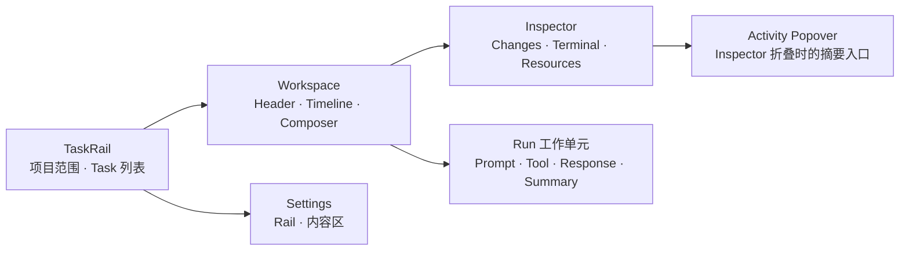
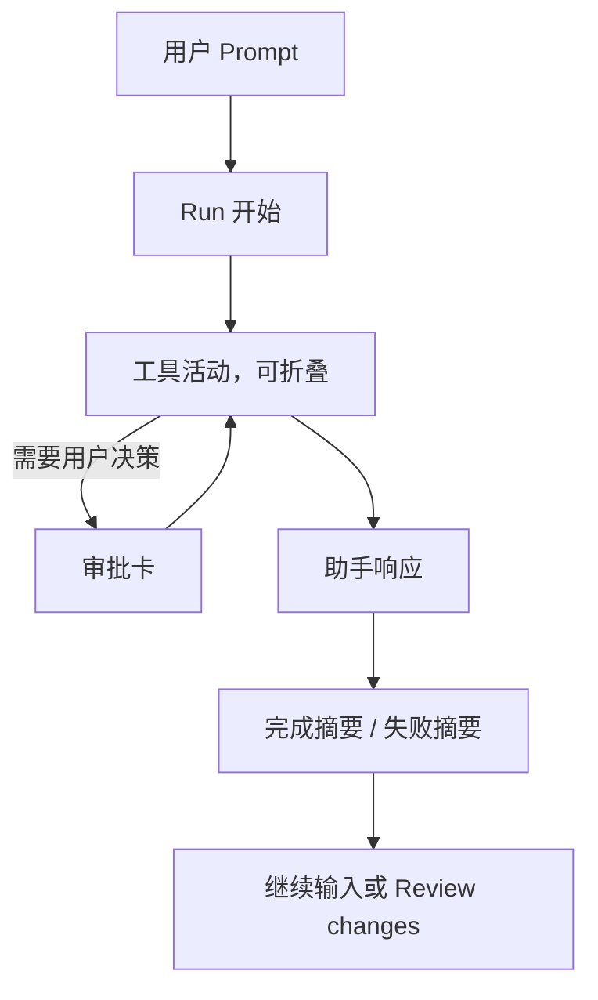

# Pawork Desktop UI / Design 全面优化方案

> 状态：目标设计文档，尚未实现。
> 基线日期：2026-09-04。现状结论来自正式 `pawork gui serve` + `pawork-desktop` 真窗口走查；行为事实仍以 [GUI 设计](gui-design.md)、[Desktop Spec](spec/desktop.md) 与源码为准。
> 实施 Roadmap：[gui-roadmap.md](gui-roadmap.md)。阶段视觉基准：[P0 Foundation](../design/desktop-ui-p0-foundation-v4.png) · [P1 Run & Review](../design/desktop-ui-p1-run-review-v4.png) · [P2 Settings & Polish](../design/desktop-ui-p2-settings-v4.png)。

---

## 1. 结论

Pawork 当前的问题不是缺少功能，而是**正确的功能没有被组织成成熟的桌面产品体验**：信息层级弱、密度失衡、状态表达像调试界面、菜单和空态缺乏产品化处理，Settings 尤其像数据直出页。

本轮目标不是复制某个竞品的皮肤，而是把现有能力收敛成与 Codex Desktop、Zed Agent Panel、Cursor Agent、OpenCode Web 同级的前端效果：

1. 用户第一眼能认出「项目 / Task / 当前对话 / 变更与终端」四层关系。
2. 当前动作、运行状态和下一步始终明确；没有“看得到但不知道能不能点”的控件。
3. 长时间工作时，Timeline 是视觉主角，侧栏和 Inspector 不抢注意力。
4. Settings 从技术字段堆叠改成可扫描、可理解、可安全操作的设置界面。
5. 保持 Pawork 的产品边界：本机、单窗口、单 active session、纯 Rust / GPUI、真实 Host 数据、Changes 只读、不伪造能力。

### 1.1 非目标

- 不把 Pawork 改成 IDE、Dashboard 或多 Agent 指挥中心。
- 不引入 WebView、Node、JS Runtime、新 GUI framework 或新 crate。
- 不新增协议能力，不借视觉优化实现 stage/unstage、附件、远程 Host、worktree 或插件市场。
- 不用 fixture、假 quota、假 diff、假任务填充空态。
- 不照抄竞品品牌、图标、颜色或专有交互；只吸收通用结构与可验证行为。

---

## 2. 当前真窗口审计

### 2.1 审计范围与证据

- 启动方式：`./scripts/pawork-desktop.sh start`，正式 Host 与正式 Desktop，无 fixture / seed / probe。
- 走查路径：启动空态 → 打开既有 Task → Timeline → grouping / scope / model 菜单 → Inspector 三页 → 折叠 Inspector / Activity → Settings 八页。
- 同时核对：当前 AX 语义树、[阶段视觉基准](../design/README.md)、`apps/desktop/src/ui/theme.rs` 与布局合同。
- 仓库约定不检入真窗口截图；Provider、Advanced、About 页面还包含凭证片段或本机路径，因此本轮截图只用于当轮判断，不保存、不纳入文档。

### 2.2 分步健康度

| 步骤 | 所见 | 健康度 | 主要问题 |
| --- | --- | --- | --- |
| 1. 启动与空态 | TaskRail、空 Workspace、Composer、Inspector 同时出现 | 较差 | 中央只有一行很小的说明，页面大面积失重；视觉上无法判断第一步应选 Task 还是新建 |
| 2. 打开既有 Task | Header、消息、工具、完成摘要可见 | 一般偏下 | 事件元信息重复、正文与事件提示层级接近；工具行和消息行缺乏清晰分组；完成摘要过重但上下文不足 |
| 3. grouping / scope 菜单 | 菜单可打开、可键盘选择、Escape 可关闭 | 功能可用，视觉较差 | 浮层贴边、尺寸窄、遮住下方信息；触发器只有小图标，模式含义不直观 |
| 4. model 菜单 | 可列出真实模型并显示当前项 | 较差 | 长列表直接堆叠，缺少 provider 分组与快速筛选；浮层侵入 Composer，选中态与 hover 态噪声大 |
| 5. Inspector | Changes / Terminal / Resources 可切换 | 一般偏下 | 空态只是一行文本；工具栏与状态信息像调试控件；主区被固定宽 Inspector 长期挤压 |
| 6. 折叠与 Activity | Workspace 扩展，右上可打开 Activity | 一般 | 320×320 浮层只显示一条 Changes 时留下大片空白；触发器、标题和内容密度不匹配 |
| 7. Settings | 八页均可进入，Host-backed 与本地页边界真实 | 较差 | 中英混排；表单缺少分区、标签和帮助层级；provider 卡片纵向堆积；技术字段直接暴露；多数页左上拥挤、其余区域空置 |

### 2.3 根因排序

1. **P0 — 信息层级没有落到渲染**：已有文档定义正确，但真实窗口中标题、正文、meta、状态和动作对比不足。
2. **P0 — 组件状态不成体系**：button、row、menu、tab、card、input 在 hover / selected / focused / disabled 上缺少统一视觉语法。
3. **P0 — 布局密度不平衡**：顶部和左上角拥挤，主内容与 Settings 右侧大面积空置。
4. **P1 — 运行过程被拆成碎片**：Run started、tool、assistant、summary、footer 没有形成一眼可读的“本轮工作单元”。
5. **P1 — 技术事实未经产品化翻译**：endpoint、catalog source、runtime、stale 等正确事实直接以工程字段呈现。
6. **P2 — 精修不足**：间距、圆角、分隔、阴影、图标和动效没有共同节奏，整体像原型而不是完成品。

---

## 3. 参照与竞品对比

### 3.1 对标结论

| 参照 | 值得吸收的结构 / 交互 | Pawork 的对应修改 | 明确不吸收 |
| --- | --- | --- | --- |
| Codex Desktop | Thread 按 project 组织；任务与变更审查连续；完成后在对话内进入 Review / Open in editor | 保留三栏；强化 Task 状态、Run summary 和 Changes 跳转；Review changes 成为完成态唯一主 CTA | 多 Agent command center、worktree 编排、cloud / remote |
| Zed Agent Panel | Threads Sidebar 按 project 分组；Composer 附近集中 model / context；tool activity 随回复流式呈现；长对话提供明确导航 | TaskRail 项目层级更清楚；Composer footer 收敛；tool group 可展开；用户脱离底部时显示回底动作 | 编辑器、Terminal Thread 类型、worktree picker、可编辑消息 |
| Cursor Agent | 运行中即时显示变化；完成后集中 Review；权限模式用用户语言描述“会发生什么” | Changes 显示本轮范围和文件数；权限页改为整行单选；危险性和生效范围就地说明 | IDE diff 编辑、inline accept/reject、checkpoint 回滚 |
| OpenCode Web | Session 首页清楚区分会话与 server status；新会话入口明显；Web/TUI 共享后端事实 | 连接状态降噪但可追溯；空态给出唯一主路径；Advanced 承担诊断细节 | Web 壳、网络 server 管理页、TUI 键位 |
| Apple macOS HIG | Sidebar 层级不超过两层；窄窗可隐藏；toolbar 承担标题和常用动作；系统字体与熟悉行为优先 | TaskRail 保持两层；Inspector 自适应折叠；Header 变成真正 toolbar；使用 SF Pro / SF Mono 语义 | 为追随平台趋势而改协议或引入材质特效 |

### 3.2 Pawork 应形成的差异

- **比 Codex 更单纯**：只服务一个本地 active session，不假装具备并行 Agent 能力。
- **比 Zed / Cursor 更独立**：不依赖编辑器上下文，Timeline 必须自己完成阅读、状态和 review 入口。
- **比 OpenCode Web 更原生**：保持 macOS 桌面密度、系统菜单、目录选择器、键盘和 AX 行为。
- **比当前版本更诚实但不更粗糙**：unknown / unavailable / stale 继续真实呈现，但使用用户能理解的文案、层级和位置。

---

## 4. 目标产品结构

### 4.1 宽度与响应式合同

| 窗口 | TaskRail | Workspace | Inspector | 行为 |
| --- | ---: | ---: | ---: | --- |
| `≥1280` | 288px | 弹性，正文列 618px | 440px | 默认三栏；用户可折叠 Inspector |
| `1080–1279` | 240px | 至少 560px | 默认折叠为 0 | Header 显示 Activity；关键动作不得进 overflow 后消失 |
| 150% 字号且 `<1320` | 320px | 剩余宽度 | 保持折叠 | 优先保证 Task 标题、正文和 Composer，不强行保留三栏 |

默认窗口继续为 1440×1024，最小 1080×720。不得用缩小字体“解决”窄窗，必须通过折叠 Inspector、截断非关键 meta 和换行解决。

### 4.2 垂直骨架

| 区域 | 目标尺寸 | 规则 |
| --- | ---: | --- |
| 沉浸式 titlebar 安全带 | 36px | traffic lights 区域不放可点击内容 |
| Workspace Header | 68–72px 可见内容，整体不超过现有 104px 合同 | 标题左；branch / run 状态紧随；New Task / Activity 右对齐 |
| Timeline | 弹性 | 从 Header 后立即开始；短会话顶对齐，不沉到底部 |
| Composer | 常态 88–94px；最大 220px | 固定底部；输入增长不覆盖 Timeline |
| RunStatusBar | 24px | 全窗底部单行；窄窗按优先级裁切 |

---

## 5. 视觉系统

### 5.1 视觉方向

关键词：**quiet、focused、native、precise**。以深色工具型桌面应用为基线，使用低饱和蓝作动作色、少量绿色表达成功，不做霓虹、玻璃卡片墙、粗边框或大面积渐变。

现有 palette 可以保留，优化重点是正确使用 token，而不是继续增加颜色：

| 角色 | 当前 token / 建议值 | 使用规则 |
| --- | --- | --- |
| Window base | `#07121A` | Workspace 大背景 |
| Rail / panel | `#061219` | TaskRail、Inspector；靠明度差而非粗边框分区 |
| Raised surface | `#10171C` | Composer、tool group、summary、设置中可操作区 |
| Menu | `#0E171D` | 仅 menu / popover；配轻阴影 |
| Hover | `#182229` | hover / pressed，不改变尺寸 |
| Border subtle / strong | `#1A2129` / `#2C3338` | subtle 用于结构；strong 只用于 focus、选中或重要分隔 |
| Text primary | `#F0EFEC` | 标题、正文、关键值 |
| Text secondary | `#8A8D8C` | 时间、帮助、路径；重要操作不能只用该色 |
| Accent | `#2F6FED` | 主按钮、focus、当前 tab；同一局部最多一个实心主按钮 |
| Success / warning / danger | `#74C94C` / `#F0D58C` / `#F48771` | 状态必须同时配图标或文字，不只靠颜色 |

### 5.2 字体层级

使用系统 SF Pro，代码、命令、路径和 diff 使用 SF Mono / Menlo。产品界面只保留以下层级：

| 层级 | 建议 | 用途 |
| --- | --- | --- |
| Window / Task 标题 | 20–22px，500/600 | Workspace Header、Settings 页标题 |
| Section 标题 | 15–16px，500/600 | 项目名、设置分区、summary 标题 |
| Timeline 正文 | 15–16px，400，22–24px 行高 | 用户与助手内容 |
| Control / list | 13–14px，400/500 | Task 行、tab、button、field |
| Meta | 12px，400 | 时间、provider、context、status |
| 最小辅助文字 | 11px | 仅非关键短标签；正文、空态、错误不得使用 |

不得同时用小字号、低对比、细字重表达同一信息。当前真实窗口中最影响观感的就是大量关键内容落在“辅助文字”视觉层。

### 5.3 间距、圆角与阴影

- 间距只用 `4 / 8 / 12 / 16 / 24 / 32` 六档；主要页面按 8px 节奏。
- 小控件圆角 4px，输入与菜单 6px，Composer / tool group / summary 8px；同屏不再混用无理由的多种圆角。
- 列表行不逐行画卡片。通过选中背景、缩进、分隔和留白表达层级。
- 阴影只用于 menu / popover：`0 8px 24px rgba(0,0,0,.28)` 的视觉等价效果；普通 panel 不加阴影。
- hover / pressed 只改变背景或前景色，禁止缩放、位移或边框变粗导致抖动。

### 5.4 图标

- 采用单一线性图标体系；优先平台语义或项目现有图标，统一 14 / 16 / 18px 三档。
- 图标按钮可见尺寸 16px 左右，但点击区至少 28×28px；主动作 32×32px。
- `+`、gear、collapse、more、refresh 必须有 tooltip 和 AX label。
- 状态 icon 与文字绑定：running = spinner + Running；needs input = warning + Needs approval；failed = error + Failed。

---

## 6. 主工作台逐区修改

### 6.1 Window chrome 与 Header

当前 Header 更像空白区域中的散落文字。目标是把它变成清楚的工作上下文 toolbar：

1. 左侧第一行：Task 标题，单行截断；点击标题不产生未实现编辑能力。
2. 标题后：branch icon + branch 名；随后显示 `Running / Needs approval / Completed / Failed`，配 icon 与文字。
3. 右侧：New Task、Activity / Inspector toggle；只有一个视觉高亮动作。
4. 下方不再重复 run started 等弱信息；Run 起点留在 Timeline 内。
5. Header 与 Timeline 用留白 + 1px subtle divider 分隔，不用大块不同背景。

### 6.2 TaskRail

#### 顶部

- `Pawork` 为 16px/600 品牌标题，不占用大块品牌区。
- grouping 改为 28×28px 二态直接切换按钮，不再打开菜单：Timeline 视图显示 folder icon + `Show projects`，Projects 视图显示 clock icon + `Show timeline`。
- 图标表达目标动作，AX `value` 表达当前视图；单击、Enter、Space、AX Press 同源切换并保持 active Task、scope、草稿、Run 与项目展开状态。
- Project scope 是全宽单行 selector：folder icon、当前范围、chevron；高度 32–36px。
- 连接行显示状态点 + `Local`；`Connected` 降为 secondary。New Task 放在右侧 28px icon button。

#### 列表

- Timeline 模式严格保持 `日期 → 项目 → Task`，Projects 模式保持 `项目 → Task`；最多两层可折叠层级。
- 日期标题 12px secondary，项目标题 13–14px/500，Task 13–14px/400。
- Task 行高保持 44px：左侧 8px 状态槽，中间标题，右侧 56px meta 槽。
- 当前 Task：`raised` 背景 + 2px accent 左指示，不用大面积亮蓝。
- hover：hover 背景；unread 用 6px 实心点；idle 用空心点；running 用 spinner；failed 用 danger icon。禁止把所有完成 Task 画成绿色。
- 项目级 `+` 只在 hover / keyboard focus 时增强显示，但点击区始终存在。
- 长标题单行省略号；tooltip / AX value 保留完整标题。

### 6.3 Timeline

Timeline 保持透明、无消息气泡墙。每轮按“工作单元”组织：

#### 消息

- 正文列最大 618px；宽屏可居中，窄屏使用 28px 两侧 inset。
- 行首只显示 `You / Pawork` 与相对时间；同一消息内部不重复角色。
- Assistant 的连续 delta 合并成同一正文块；只显示一个 Entry actions。
- 段落间距 12–16px，消息组间 32–40px；三行以上文本保持 22–24px 行高。
- command / path / code 使用 mono 与轻微 raised surface，不用纯文本硬挤在正文中。

#### 工具活动

- 同一 Run 的连续工具聚合为一个 tool group；默认显示工具名、简短目标、状态、耗时。
- 成功项使用中性前景 + 小型 success icon；绿色只点到为止。
- running 行显示 spinner 和当前动作；failed 行展开错误摘要并提供 Copy。
- 详情折叠区显示输入摘要和输出，不默认铺开 JSON。
- tool group header 可显示 `3 tools · 2 completed · 1 running`，而不是三条等权卡片。

#### Run summary

- 完成：图标 + `Ready for review` + 一句结果；若有 Changes，`Review changes` 为唯一主按钮。
- 无 Changes：不画假的 Review 按钮，改为 `Run completed` 的轻量 summary。
- 失败：danger icon + 可读错误标题 + 一句恢复建议；Copy error 为 secondary。
- 取消：neutral icon + `Run cancelled`，允许继续输入。
- summary 下方不再另画重复的“Run completed”大行；时间和 duration 合并到 footer meta。

### 6.4 Composer

Composer 是主操作，应明显但不笨重：

- 整体为单一 raised panel，1px subtle border，8px radius，常态 88–94px。
- 输入区首屏 1–3 行，placeholder 使用一句动作提示：`Ask Pawork to inspect, change, or explain…`。
- Footer 左侧依次为 model picker、workspace；右侧为 ContextMeter 和 Send / Cancel 单槽。
- model picker 显示 `Grok 4 · High`；provider 只在菜单或 tooltip 中显示，避免 `xai / grok-4` 像内部 ID。
- workspace 只显示项目名，不在 Composer 重复绝对路径。
- ContextMeter 使用条 + `78k / 128k`；未知显示 `Context unavailable`，不显示 `— / 256000`。
- Send 32×32px 圆形主按钮；空输入 / stale / running 时禁用并给出 tooltip 原因。
- Run 中主按钮切为 Cancel，颜色使用 danger，但不改变布局。
- 输入增长到 220px 后内部滚动；Timeline 可见高度不能被无限挤压。

### 6.5 菜单与浮层

这是当前最明显的交互缺口之一，所有菜单统一为同一组件合同：

- 与触发器间距 6–8px，保持在窗口边界内；不得覆盖触发器本身。
- 最小宽度 220px，最大 360px；8px 内边距，6px radius，1px strong border + menu shadow。
- 行高 32–36px；选中项用 check + label，不用整行亮蓝覆盖所有层级。
- 项目菜单：All projects、真实项目、divider、Add project…。
- grouping 不进入本节菜单合同；它是直接切换按钮，必须移除 chevron、选项面板和 expanded 状态。
- model 菜单：当模型超过 8 个时提供本地筛选；按 provider 分组；当前模型、不可用原因和 context window 分层显示。
- 单开互斥；触发器再点、选择、Escape、外点关闭；方向键循环、Enter 选择；滚轮不穿透。
- 打开方向由可用空间决定。Composer 附近的 model 菜单优先向上，但底边不得被 Composer 或状态栏裁切。

### 6.6 Inspector

#### 通用

- 宽屏 440px；顶层 tab 高 52–58px；tab 只用 active underline + primary text。
- 面板 Header 右侧放 collapse；Refresh 属于当前页，不与全局动作混在一起。
- Empty state 统一为：16px icon、14px 标题、12–13px 说明、最多一个真实动作。不得只显示一行灰字。

#### Changes

- 页顶显示本轮 scope：`Latest session · 4 files · +186 −24`；若不是 active session，使用明确 banner。
- Files / Summary 二级 tab 保留，但 Files 是默认主路径。
- 文件列表行有 file icon、路径、状态、增删数；选中行使用 raised surface。
- DiffView header 固定，路径与 Copy / Open in editor 分开；diff 内容保持 mono 和 gutter。
- Changes 只读，不画 Accept、Stage 或 Hunk action。

#### Terminal

- 顶部 compact toolbar：workspace、cwd、live / exited / stale、80×24；尺寸 stepper 收进二级菜单或紧凑组。
- 主区域使用真正的 mono 终端阅读面；空态居中显示 `Terminal not started` + `Start terminal`。
- 输入固定底部；running 显示 Stop，exited 显示 New / Close，failed 明确要求先 Close。
- 继续声明“纯文本，不是 VT emulator”，但该事实放在帮助信息，不占主视觉。

#### Resources

- 有 MCP 时按 server 行展示：name、connected / error、tool count、Refresh。
- 无 MCP 时显示简洁空态：`No MCP servers configured`，不绘制未实现的 Add 按钮。
- unavailable / stale 与 0 servers 分开表达。

### 6.7 Inspector 折叠与 Activity

- 折叠后 Workspace 占满剩余宽度，Activity 触发器固定在 Header 右侧。
- popover 仍以 320×320 为上限而非固定空盒；内容少时高度按内容收缩，最低不强撑 320px。
- 按 section 展示 Changes、Terminal、Resources 的真实摘要；不存在 capability 的 section 不渲染。
- 每个 section 是整行可点击入口，显示状态与摘要；不额外套卡片。

---

## 7. Settings 重构

### 7.1 全局结构

- 保留 288px Settings Rail + 弹性内容区；1080px 时 rail 为 240px。
- 内容区顶部 48–56px page header；正文左对齐，最大宽度 760–880px，不把表单拉满全屏。
- 同一语言完成整套 UI。本轮不引入 i18n 基础设施，先统一为 **English**，因为主工作台和既有视觉基准已经以 English 为主；中文仅保留在文档。
- Settings 导航统一：Models & providers / General / Approvals / Tools & MCP / Terminal / Appearance / Advanced / About。
- Settings 页不显示工作台 RunStatusBar；运行事实只在返回工作台后查看，避免无关噪声长期占底部。
- 每页结构固定：Title + 一句说明 → section → inline feedback。Refresh 只在 Host-backed 页出现。

### 7.2 Models & providers

当前 provider 纵向大卡片把连接、凭证、endpoint、catalog 和错误堆在一起。目标改为“概览列表 + 单行展开详情”：

- 默认行高 60–68px：provider 名、认证方式、状态、模型数、More / Connect。
- Connected 使用 status dot + `Connected`；不在默认列表展示 token / key 片段。
- 错误显示一行用户文案，如 `Model catalog unavailable`；完整 HTTP / endpoint 细节放在展开区。
- 展开区才显示 endpoint、catalog source、client version、Replace credential、Remove。
- `Remove` 为 destructive secondary，点击后两步确认；绝不与 Connect / Verify 同等权重。
- Models & defaults 独立 section：按 provider 分组的紧凑列表，当前 default 使用 check；`Set default` 只在 hover / focus 时显著。
- 模型名称优先，raw model id 作为 secondary mono；不可运行模型禁用并解释原因。

### 7.3 General

- Form label：`HTTP proxy`；当前继承状态在 label 下说明。
- 输入宽 480–560px；Save 为 primary，Clear 为 secondary，Refresh 位于 page header。
- “何时生效”使用一条 info callout，不与字段挤在同一行。
- 成功、失败和 stale 反馈紧贴字段；保存期间禁止重复提交。

### 7.4 Approvals

- 五档模式改为整行 radio list，而不是右侧重复“选择”按钮。
- 每行包含标题 + 一句结果描述；当前项用 radio / check + accent border。
- 顺序从保守到自动：Always ask → Ask for writes → Ask for dangerous actions → Never ask → Read only。
- `Never ask` 使用 warning 文案；灾难命令仍由 Host 拒绝的事实放在该行说明。
- Workspace trust 独立 section，用 switch / checkbox 与当前 workspace 名称表达；Global default 为只读辅助行。
- 页面底部统一说明“仅当前会话生效；不影响进行中的 Run”。

### 7.5 Tools & MCP

- 空态使用 title + 一句说明，不显示开发者式长段落。
- server 行展示 name、transport、status、tools count；Test / Remove 为行内动作。
- Test 状态在行内更新，不弹全局 toast；Remove 仍需确认。
- 未实现 Add 时不绘制假入口；可用 CLI 配置提示放在 Help 文档，不放主页面。

### 7.6 Terminal

- 三个真实字段：Default shell、Columns、Rows；每个都有 label、当前值、校验与单位。
- Columns / Rows 放同一行，两列各 120–160px；Save 在 section 尾部。
- `Follow platform default` 用 Clear / Reset to default 表达，不把空字符串当 UI 语义。
- 生效范围作为 section footer：`Applies to newly created terminals.`

### 7.7 Appearance

- Theme 作为只读设置行：`Dark · Follows macOS Increase Contrast`。
- Text size 使用三段 radio / segmented control：100% / 125% / 150%，当前项清晰选中。
- 下方显示一行 15–16px 正文样例和一行 12px meta 样例，让用户立刻理解差异。
- 快捷键作为辅助说明；不重复写成长段落。

### 7.8 Advanced / About

- 使用 definition list，不用散落文本：label 固定 160px，value 可选中复制。
- Connection、Runtime、Protocol、Capabilities、Endpoint、Resume 分 section。
- 敏感字段不显示；本机路径避免在全局 AX summary 中拼成长句。
- About 只显示 Desktop version、GUI API、Host data directory；路径允许 Copy，但不提供 Open / Delete。
- 页面底部的工程说明折叠为 `Why this information is shown`，默认不展开。

---

## 8. 交互状态合同

### 8.1 统一组件状态

| 状态 | Row / Button | Input | Menu / Tab |
| --- | --- | --- | --- |
| Default | primary / secondary text；透明或 raised surface | subtle border | inactive tab 用 secondary |
| Hover | hover background | strong border | hover background，不移动 underline |
| Pressed | hover 更深一档 | — | 保持 1px 边界，不缩放 |
| Focused | 2px accent ring，和 hover 可同时存在 | accent ring + caret | focus 与 selected 可同时辨认 |
| Selected | raised + accent 指示 + check（按类型） | — | primary text + 2px underline |
| Disabled | 仍可读；透明度不低于可辨范围；无 Press action | disabled surface | 提供禁用原因 |
| Loading | spinner + 动词，保持控件宽度 | 禁止重复提交 | 原内容保留，避免跳空 |
| Error | danger icon + 可执行恢复文案 | danger border + inline message | 不只把文字变红 |
| Stale | neutral banner + `Reconnect` 或 Refresh | 禁写 | 旧内容保留并明确不是最新 |

### 8.2 核心任务流

1. **选择 / 新建 Task**：当前项目范围清楚 → 选中 Task → Header 和 Timeline 同时更新 → Composer 自动聚焦。
2. **发送**：输入有效且已连接 → Send 可用 → Run 立即出现 → Composer 切 Cancel → model / workspace 禁用并解释原因。
3. **审批**：Timeline 内卡片抢占视觉层级但不跳页 → 默认无选择 → 决策后状态原位更新 → 焦点回 Composer。
4. **完成**：Run summary 说明结果 → 有 Changes 才出现 Review changes → 点击展开 Inspector 并聚焦 Changes。
5. **断线**：保留投影但显示 stale → 所有写入口禁用 → Header / rail 提供 Reconnect → 恢复后说明 resume / snapshot 结果。

### 8.3 动效

- hover / focus：80–120ms。
- menu / popover：120–160ms opacity + 2–4px translate；不使用弹簧或缩放。
- Inspector 折叠：160–200ms width / opacity，同步重排 Workspace。
- streaming 内容不逐 token 做动画，只自然追加；spinner 可持续旋转。
- 检测 Reduce Motion 后取消 translate、width 插值和非必要旋转，只保留即时状态变化。

动效属于 P2 精修；P0/P1 未完成前不得先做动画。

---

## 9. 文案与空态

### 9.1 文案原则

- 用户文案描述“现在发生什么 / 下一步能做什么”，技术细节放 Help 或 Advanced。
- 状态统一使用动词或结果：Connecting、Running、Waiting for approval、Ready for review、Failed、Cancelled。
- 避免把内部 ID 当主文案：`xai / grok-4` → `Grok 4`；`ws-default` → `Pawork`。
- unknown、unavailable、stale 三者不混用：unknown = Host 未提供值；unavailable = 当前能力不存在；stale = 展示的是旧值。

### 9.2 建议空态

| Surface | 标题 | 说明 / 动作 |
| --- | --- | --- |
| 无 active Task | `Start a task` | `Choose a task from the sidebar or create a new one.` + New task |
| 新 Task 无消息 | `What should Pawork work on?` | Composer 自动聚焦，不再额外画卡片 |
| Changes 为空 | `No changes in this session` | `Files changed by the latest run will appear here.` |
| Terminal 未启动 | `Terminal not started` | `Start a terminal in Pawork.` + Start terminal |
| Resources 为空 | `No MCP servers configured` | 不画 Add，只有 Refresh（能力存在时） |
| Settings 数据 stale | `Connection lost` | `Showing the last known settings. Reconnect to make changes.` + Reconnect |

---

## 10. Accessibility 与键盘

- macOS 正文默认至少接近系统 13pt，最小辅助文字不低于 10pt；Timeline 正文必须高于平台最低值。
- 所有交互目标至少 24×24px；桌面常用目标采用 28×28px，Send / Cancel 32×32px。
- 普通文本对比目标 4.5:1；大文本和 UI 状态边界至少 3:1。
- focus ring 不被 clip；键盘 focus、mouse hover、selected 是三个不同状态。
- 状态不只靠颜色；icon、文字和 AX value 同源。
- Tab 顺序遵循可见阅读顺序：TaskRail → Header → Timeline actions → Composer → Inspector；菜单打开后焦点限制在菜单，关闭回触发器。
- `Enter` 仅在 IME 未组合时发送；`Shift+Enter` 换行；Escape 只关闭最上层浮层。
- 100% / 125% / 150% 下均不截断主动作；Increase Contrast 使用现有增强 palette。
- 真正的 WCAG / VoiceOver 结论必须经实现后的对比度计算、键盘走查和 VoiceOver 人工验收，本文件不宣称已合规。

---

## 11. 实施顺序与写入集

### P0：视觉基础与明显缺陷

目标：先让整个产品不再像原型。

- `ui/theme.rs`：收敛字体、间距、radius、focus、surface token；不增加第二套主题。
- `ui/components/{button,dropdown,list_row,panel,label}.rs`：统一八类状态和 menu 合同。
- `ui/shell_layout.rs`：保持现有响应式宽度，只修真实窗口中的对齐、Header 和空态分配。
- `ui/task_rail.rs`：重做层级、选中、状态点、顶部 controls。
- `ui/input_area.rs`：Composer 与 model menu 优先完成。

验收：1440×1024 与 1080×720 下，主路径无裁切；菜单不遮挡触发器；正文、meta、动作一眼可区分。

### P1：核心 Run 阅读体验

- `ui/timeline.rs` / `ui/timeline_entry.rs`：按 Run 工作单元重排现有真实事件；不改 reducer 和 wire。
- `ui/approval_card.rs`：提高决策层级，保持 fail-closed。
- `ui/changes.rs` / `ui/inspector.rs` / `ui/resources.rs`：补齐工具栏、空态和折叠摘要。

验收：用户从 Prompt 到 Tool 到结果再到 Review 的视觉路径连续；失败、取消、审批和 stale 均可仅凭界面辨认。

### P2：Settings 产品化与精修

- `ui/settings/`：按页重排，统一 English 文案，隐藏默认列表中的 credential 片段。
- 添加轻量过渡并实现 Reduce Motion 分支。
- 完成 100% / 125% / 150%、Increase Contrast、长标题、长模型列表的真窗口走查。

验收：Settings 每页有稳定 header / section / field / feedback 结构；无技术字段墙、无中英混排、无敏感片段进入普通截图。

### 11.1 明确不改动

- `projection/`、`controller/`、`pawork-client` 与 GUI wire，除非实现中发现现有 UI 无法从既有状态推导已接受的视觉需求；若出现这种情况另立协议任务。
- Changes 的只读边界、Terminal 的纯文本边界、Settings 的 Host capability gate。
- 现有安全语义、持久化与 replay 语义。

---

## 12. 最终验收清单

### 12.1 视觉

- [ ] 1440×1024 主工作台与三张视觉基准在结构、层级、密度上达到同一方向。
- [ ] 1080×720 自动折叠 Inspector，Workspace ≥560px，Composer / Activity / Send 可见。
- [ ] 标题、正文、meta、状态、主动作形成稳定的五级层级。
- [ ] 普通列表不出现卡片墙；menu / popover 之外不滥用阴影。
- [ ] 所有 icon、radius、border、spacing 来自共同 token。

### 12.2 交互

- [ ] scope、model、entry、Activity 四类菜单锚定正确，不越界、不穿透滚轮。
- [ ] grouping 按钮单击即在 Timeline / Projects 间切换，图标与目标动作同步变化且不出现菜单。
- [ ] model ≥13 条时可筛选 / 分组，当前项和不可用项可辨认。
- [ ] Task 切换、审批、Fork 后焦点回 Composer；Escape 与 IME 行为不回退。
- [ ] Run 中 Send / Cancel 单槽稳定，禁止动作有可读原因。
- [ ] Review changes 展开并聚焦正确 Changes surface。

### 12.3 状态与诚实性

- [ ] loading / empty / unavailable / stale / error / success 不再共享一套灰字。
- [ ] 无 capability 不画入口；unknown 不伪造成 0。
- [ ] credential 片段、GUI token、token path 不进入普通 UI 或 AX 摘要。
- [ ] Changes 与 Terminal 仍由 Host 权威事实驱动。

### 12.4 可访问性

- [ ] 主路径可全键盘完成；焦点环始终可见。
- [ ] 关键文字和控件对比度经实际颜色计算通过目标值。
- [ ] 100% / 125% / 150% 真窗口无裁切；Increase Contrast 真系统态复验。
- [ ] VoiceOver 朗读顺序、控件名、value、enabled / selected / focused 与视觉一致。

### 12.5 证据

- [ ] 每阶段保存“视觉基准 + 同尺寸真窗口”并排对比；截图只作视觉证据，不代替 Host / Git / PTY 外部事实。
- [ ] 先跑 diff / link 检查，再跑受影响的 Desktop 定向测试；不为纯文档变更跑 Cargo。
- [ ] 分开记录：已实现、自动门禁通过、真窗口验收、VoiceOver 人工签字、发布。

---

## 13. 参照来源

- [OpenAI：Introducing the Codex app](https://openai.com/index/introducing-the-codex-app/) — project / thread 组织、in-thread review、open in editor、桌面任务管理。
- [Zed：Agent Panel](https://zed.dev/docs/ai/agent-panel) — thread、Composer、tool activity、context、长对话导航。
- [Zed：Parallel Agents](https://zed.dev/docs/ai/parallel-agents) — Threads Sidebar 与 project 分组；Pawork 只借结构，不引入并行 Agent。
- [Cursor：Agent mode](https://prod.cursor.com/help/ai-features/agent) — 运行中变化、Stop、完成后 Review、权限模式的用户表达。
- [Cursor：Diffs & Review](https://docs.cursor.com/en/agent/review) — 文件级 Review 与最终集中审查路径。
- [OpenCode：Web](https://opencode.ai/docs/web/) — Session 首页、server status、前后端事实分离。
- [Apple HIG：Sidebars](https://developer.apple.com/design/human-interface-guidelines/sidebars) — 两层层级、可隐藏、窄窗自适应。
- [Apple HIG：Toolbars](https://developer.apple.com/design/human-interface-guidelines/toolbars) — 标题、导航与常用动作的位置。
- [Apple HIG：Typography](https://developer.apple.com/design/human-interface-guidelines/typography) — macOS 字号、系统字体和层级。
- [WCAG 2.2：Target Size (Minimum)](https://www.w3.org/WAI/WCAG22/Understanding/target-size-minimum.html) — 24×24 最小交互目标。
- [WCAG 2.2：Contrast (Minimum)](https://www.w3.org/WAI/WCAG22/Understanding/contrast-minimum.html) — 文本对比度目标与适用范围。
