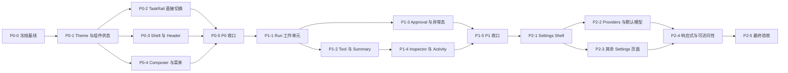

# Pawork Desktop UI 优化 Roadmap

> 状态：**源码已实现、自动门禁已通过**（P0–P2；三张阶段图的真窗口人工验收待补。Increase Contrast 功能与 VoiceOver 验收门禁已于 2026-09-04 按用户要求移除）。
> 基线日期：2026-09-04。目标设计见 [UI / Design 全面优化方案](gui-optimization.md)，现行行为见 [GUI 设计](gui-design.md)、[Desktop Spec](spec/desktop.md) 与源码。
> 本 Roadmap 只拆分已接受的 UI 优化，不代表生产路径、自动门禁或人工验收已经完成。

---

## 1. 目标、范围与完成定义

### 1.1 目标

用三个可独立验收的阶段，把 Pawork Desktop 从功能可用的原型感界面收敛为成熟的 macOS 本地 Coding Agent 工作台：

1. **P0 — Foundation**：统一视觉基础、组件状态、TaskRail、Header、Composer，并完成 Timeline / Projects 单击切换。
2. **P1 — Run & Review**：把 Prompt → Tool → Response → Review 组织成连续、可扫描的 Run 工作单元。
3. **P2 — Settings & Polish**：产品化 Settings，完成响应式、字号、对比度和键盘收口。

### 1.2 非目标

- 不修改 GUI wire、Domain、Provider、存储、Policy、Sandbox 或事件持久化语义。
- 不增加 stage/unstage、附件、远程 Host、worktree、多 Agent、插件市场或不存在的 MCP 配置入口。
- 不引入新 crate、第三方图标依赖、第二套主题或完整动画框架。
- 不补全历史测试体系；只为当前可见行为保留最小定向回归。
- 不在同一子任务内同时重构状态层和大面积重绘 UI。

### 1.3 全局完成定义

- 1440×1024 与 1080×720 的真实窗口结构、层级和密度达到三张阶段设计图的方向。
- 所有新交互具备 Default / Hover / Pressed / Focused / Disabled / Loading / Error / Stale 中实际需要的状态。
- 鼠标、键盘和 AX Press 调用同一 handler；视觉、value、enabled、selected 与 AX tree 一致。
- 真实 Host / Git / PTY 事实与界面一致；设计图中的示例内容不得进入生产数据路径。
- 需要真实模型的功能验证固定使用 `opencode-go / glm-5.3-flash`（当次 Host 参数覆盖，不改持久默认）；口径见 [spec/verification.md](spec/verification.md) §2.1。
- 每阶段分别记录「已实现」「定向门禁通过」「真窗口验收」；未取得的证据不得互相替代。

---

## 2. 阶段关系



执行纪律：共享同一文件的任务必须串行；只有写入集不重叠时才允许并行。每个实现任务完成后先做差异检查和定向验证，再进入下一任务。

---

## 3. 阶段设计基准

| 阶段 | 设计图 | 重点 | 不用于证明 |
| --- | --- | --- | --- |
| P0 | [Foundation](../design/desktop-ui-p0-foundation-v4.png) | 三栏比例、层级、Projects 状态、直接切换按钮、Composer 与基础组件 | Host 数据正确、菜单键盘行为、真实 diff |
| P1 | [Run & Review](../design/desktop-ui-p1-run-review-v4.png) | Timeline 状态、Run 工作单元、tool group、完成摘要、Changes 关联 | 流式时序、审批安全、持久化与 replay |
| P2 | [Settings & Polish](../design/desktop-ui-p2-settings-v4.png) | Settings Rail、provider 行、默认模型、留白、敏感信息隐藏 | credential 安全存储、Host capability |

三图是视觉方向，不是像素级源码事实。实施验收使用相同逻辑窗口尺寸并排比较，但必须以真实 Host / 文件 / Git / PTY 输出交叉核对功能。

---

## 4. 已接受的交互变更：Timeline / Projects 直接切换

### 4.1 组件合同

`task-rail-grouping` 从下拉菜单触发器改为**二态直接切换按钮**。它显示“下一步动作”，单击立即切换，不再出现 grouping menu。

| 当前视图 | 可见图标 | Tooltip / AX name | Press 后 |
| --- | --- | --- | --- |
| Timeline | folder / projects | `Show projects` | 切到 Projects，图标变为 clock / timeline |
| Projects | clock / timeline | `Show timeline` | 切到 Timeline，图标变为 folder / projects |

视觉细节：

- 位置继续在 `Pawork` 标题行右侧；28×28px hit area、4px radius、Ghost variant。
- 只显示一个 14–16px 线性图标；**移除 chevron、选中勾和下拉面板**。
- Default 无底色；Hover / Pressed 使用 `surface.raised` / `surface.hover`；Focused 显示 2px accent ring。
- 图标描述目标动作，不同时显示当前模式文字；当前模式由列表结构和 AX value 表达。
- `value` 分别为 `Timeline view` / `Projects view`；不发布 `expanded`、menu child 或 selected menu item。

行为细节：

- mouse click、Enter、Space、AX Press 调用同一 `toggle_grouping()` 路径。
- 切换只更新本地 presentation preference，不改变 active session、Composer 草稿、Run、project scope 或项目折叠状态。
- 切换后沿用现有 `rail_scroll_to_active = true`，active Task 被 scope 过滤时不伪造选中。
- 切换时关闭其它已打开的浮层并清空 menu highlight，焦点保持在按钮。
- `All projects / <project>` 仍是独立 scope 下拉；本变更不能把 grouping 与 scope 合并。

### 4.2 最小源码影响

- `ui/task_rail.rs`：删除 grouping Dropdown / MenuPanel；图标、tooltip 和点击路径直接按相反模式切换。
- `ui/mod.rs`：删除 `MenuKind::Grouping` 的菜单计数、选中、激活和回焦分支；保留稳定 id、focus handle 和 rail Tab 顺序。
- `ui/accessibility/app.rs`：AX Press 直接切换；删除 grouping menu 子树与 `group-timeline` / `group-projects` action。
- `projection/session.rs`：把当前模式 label 与目标动作 label 分开；不改 `TaskRailGrouping` 数据形状。
- `docs/spec/crates/desktop.md`：实现同批回写当前行为、模块树和 AX 合同。

### 4.3 定向回归

最多保留两个行为断言：

1. 一次激活从 Timeline 切到 Projects，再激活切回 Timeline；不产生 `MenuKind::Grouping`。
2. 切换前后 active session、scope、draft 和 collapsed projects 不变，active Task 重新滚动到可见。

若现有 projection 测试已覆盖第二条，只调整现有测试，不新建重复矩阵。

---

## 5. P0 — Foundation

目标图：[desktop-ui-p0-foundation-v4.png](../design/desktop-ui-p0-foundation-v4.png)。完成后产品应先摆脱“原型感”，但不在此阶段重组事件或 Settings 数据。

### P0-0：冻结当前事实与验收场景

- **写入集**：无生产代码；仅当现有记录缺失时补 Roadmap 状态。
- **工作**：记录 1440×1024、1080×720、100% / 150% 的启动空态、Projects、Timeline、运行中和断线场景；确认用户已有未提交改动。
- **验收**：每个场景有真实窗口状态和对应外部事实；敏感路径或凭证不进入仓库截图。
- **不做**：不修 UI、不生成 fixture、不跑 Cargo。

执行记录（2026-09-04）：

- 正式 `pawork` Host / Desktop 路径下完成 1440×1024、1080×720、100% / 150% 的真窗口基线；覆盖启动未选 Task、Projects、Timeline、运行中与断线保留旧投影。截图只作当轮临时证据，未写入仓库。
- 测试模型按用户指定固定为 `opencode-go / glm-5.3-flash`，通过本次临时 Host 参数覆盖，不修改持久默认配置。RunStart 已进入真实 `Running`，界面同步显示 Task / Header running、Cancel 与 `Run 00:00`；随后因当前环境到 OpenCode 服务的 HTTP 连接失败进入 failed，未伪造成功终态。
- 外部事实交叉核对：`pawork --instance desktop status` 确认本机 socket listening；Git 仍为 `main` 且只保留启动前已有的 GUI 设计文档 / 图片改动；本轮基线未产生工作区文件改动。
- 基线时观察到 grouping 两项菜单、150% 下 Inspector 页签 / CTA 拥挤、Settings provider AX summary 朗读 masked credential 片段；这些是后续 P0–P2 的输入，其中 grouping 与 credential summary 已在本 Roadmap 内收口，最终 150% 真窗口复验仍 pending。
- 自动门禁：按本任务约束未运行 Cargo。Human acceptance：PENDING。

### P0-1：Theme 与基础组件状态

- **写入集**：`ui/theme.rs`、`ui/components/{button,label,list_row,panel,dropdown}.rs`、包级 Desktop Spec。
- **工作**：收敛字阶、surface、border、radius、focus ring 与 4/8/12/16/24/32 间距；统一 Button、Row、Tab、Input、Menu 的必要状态。
- **组件细节**：正文 15–16px、control 13–14px、meta 12px；普通 panel 无 shadow；menu/popover 才使用 elevation；icon button 28×28px。
- **验收**：同类控件的 hover / pressed / focused 不改变几何。
- **不做**：不加 light theme、新 icon crate、通用动画系统。

执行记录（2026-09-04）：

- 已实现：字阶收敛为 Header 22 / title 20 / 正文 16 / control 14 / meta 12px；新增共享 4/8/12/16/24/32 spacing、4/6/8 radius、2px focus、28px icon 与 220–360px menu token。默认仍是单一 dark palette，surface 含 pressed 色。
- 已实现：Button / ListRow 分离 Hover 与 Pressed 且不缩放；Button disabled 不再挂 mouse press；Badge 使用 12px meta；MenuPanel 使用 8px 锚距、8px padding、r6、strong border 与 menu-only shadow，MenuRow 改为 34px、check + label 选中语义，不再整行亮蓝。
- 自动门禁：theme 定向测试 10/10；`git diff --check` 通过。现有测试内扩展 1 条 token 断言，没有新增测试文件或依赖。
- 真窗口视觉验收：PENDING（按 P0-5 与三张阶段图统一收口）。

### P0-2：TaskRail 与直接切换按钮

- **依赖**：P0-1。
- **写入集**：`ui/task_rail.rs`、`ui/mod.rs` 的菜单与焦点分派、`ui/accessibility/app.rs`、`projection/session.rs`、相关现有测试、包级 Desktop Spec。
- **工作**：实施 §4 二态直接切换；强化 Project / Task / meta 层级和 selected / unread / running / failed 状态。
- **验收**：一次 Press 立即切换；无 grouping menu；鼠标、Enter、Space、AX 等价；active session 与草稿不变；scope 菜单行为不回退。
- **不做**：不改 Task 分组算法、不引入第三种视图。

执行记录（2026-09-04）：

- 已实现：`task-rail-grouping` 改为 28×28 二态 Ghost 直接按钮；Timeline 显示 Projects 目标 glyph / `Show projects`，Projects 显示 Timeline 目标 glyph / `Show timeline`，移除 chevron、Dropdown、`MenuKind::Grouping`、grouping menu 与两项 AX 子树。
- 同源交互：mouse、Enter、Space、AX Press 均调用 `toggle_grouping()`；AX name 是目标动作，value 是 `Timeline view` / `Projects view`。切换关闭其它浮层、清高亮并保留按钮焦点、active session、scope、draft 与 collapsed projects，随后滚动 active task 到可见。
- 自动门禁：`cargo test -p pawork-desktop --offline --bin pawork-desktop --features gpui/runtime_shaders grouping`，2/2；`git diff --check` 通过。复用并调整既有 AX 测试，没有增加测试数量或依赖。
- 真窗口视觉 / 键盘验收：PENDING（P0-5 统一收口）。

### P0-3：Shell、Header 与空态

- **依赖**：P0-1。
- **写入集**：`ui/shell_layout.rs`、`ui/mod.rs` 的壳层装配、必要的 AX bounds、包级 Desktop Spec。
- **工作**：Header 收敛为标题、branch、Run 状态和右侧动作；空态给出唯一主路径；宽屏三栏与窄窗折叠按既有合同重排。
- **验收**：1440×1024 三栏比例稳定；1080×720 Workspace ≥560px、Inspector 默认折叠；关键动作不被 titlebar 或 overflow 裁切。
- **不做**：不改窗口生命周期、连接协议或 Inspector capability。

执行记录（2026-09-04）：

- 已核对：既有 `shell_layout::resolve` 已满足 1440×1024 的 288 / 弹性 / 440 三栏，以及 1080×720 的 240 / ≥560 / Inspector 折叠合同；未重复改写布局算法。
- 已实现：Workspace Header 增加 1px subtle divider；标题、branch、live Run 状态和右侧 New task / Activity 继续使用真实投影与既有 enable gate。无 active Task 时，中央空态改为 `Start a task` + 一句说明 + 唯一 Primary `New task`，并隐藏 Header 中重复的新建动作。
- 同源交互：空态按钮复用既有 `header-new-task` focus、mouse / Enter / Space / AX Press 与 WorkspaceConfirm 回焦路径；断线时 disabled 且不发布 AX Press。
- 自动门禁：空态定向测试 2/2、shell layout 4/4、相关 AX Press 1/1；`git diff --check` 通过。未新增测试文件、依赖或协议行为。
- 真窗口视觉 / 键盘验收：PENDING（P0-5 统一收口）。

### P0-4：Composer 与通用浮层

- **依赖**：P0-1。
- **写入集**：`ui/input_area.rs`、`ui/components/dropdown.rs`、必要的 `ui/mod.rs` 菜单分派与 AX 节点、包级 Desktop Spec。
- **工作**：Composer 收敛为单一 raised surface；Send / Cancel 单槽；model menu 分组、长列表滚动和边界碰撞；保留 scope / model / entry / Activity 的单开互斥。
- **组件细节**：常态 88–94px、最大 220px；Send 32×32px；menu 220–360px、行高 32–36px、6–8px 锚定间距。
- **验收**：空输入、running、stale 的禁用原因可读；菜单不遮触发器、不越窗、不穿透滚轮；IME 行为不回退。
- **不做**：不加附件、搜索服务或远端模型目录。

执行记录（2026-09-04）：

- 已核对：Send / Cancel 32×32 单槽、88–94px 常态 / 220px 上限、空输入 / running / stale 禁用原因、单开互斥、Escape / 外点关闭、240px 长列表滚动与 `occlude()` 滚轮拦截均已存在，未重复实现。
- 已实现：Composer 改用单一 raised surface、1px subtle border 与 8px radius；model picker 只显示 display name，provider / raw id 留在 tooltip、菜单与 AX value。
- 已实现：model menu 按 provider 分组，组内保持目录顺序；鼠标、方向键 / Enter 与 AX 使用同一扁平索引。Composer 菜单固定优先向上锚定，通用 `anchored` 继续处理窗口边界，超长行截断、超高菜单内部滚动。
- 自动门禁：既有 InputArea 测试 3/3（含交错 provider 的分组 / 选中索引回归）；`git diff --check` 通过。没有新增测试数量、依赖、搜索服务或模型来源。
- 真窗口视觉 / 键盘 / IME 验收：PENDING（P0-5 统一收口）。

### P0-5：阶段收口

- **写入集**：只修复 P0 验收发现的局部缺陷；同步 `docs/gui-design.md`、`docs/spec/crates/desktop.md` 与 Roadmap 状态。
- **自动验证**：先 diff / 文档链接，再运行受影响的现有 Desktop 定向测试；最后至多一次 `cargo test -p pawork-desktop --offline --bins --features gpui/runtime_shaders`。
- **真窗口**：P0 设计图 + 1440×1024 / 1080×720 实窗并排；键盘走完 scope、direct toggle、New Task、model、Send / Cancel。
- **退出条件**：P0 未通过前不进入 Timeline 结构重排。

执行记录（2026-09-04）：

- 已实现：P0-1～P0-4 的 Theme / 组件状态、TaskRail 直接切换、Header / 空态、Composer / model menu 已同步到 [GUI 设计](gui-design.md) 与 [Desktop 包级 Spec](spec/crates/desktop.md)。
- 自动门禁：`cargo test -p pawork-desktop --offline --bins --features gpui/runtime_shaders`，187/187；`./scripts/pawork-desktop.sh build` 成功；`git diff --check` 通过。门禁首次暴露 2 处只反映旧字号 / 间距的 AX 几何期望，按同源公式修正后定向测试与完整 Desktop bin 门禁均通过。
- 测试 Host：按用户指定以 `opencode-go / glm-5.3-flash` 启动真实 `pawork gui serve`；不修改持久默认配置。当前环境无法连接 OpenCode，模型调用只能验到真实 Running → failed 闭环，不能宣称成功响应。
- 真窗口复验：正式 Host 与刚编译的 Desktop 已启动，但 macOS 锁屏使窗口读取 / 操作被系统拒绝；1440×1024、1080×720 与键盘主路径仍为 PENDING，不能由自动门禁替代。

---

## 6. P1 — Run & Review

目标图：[desktop-ui-p1-run-review-v4.png](../design/desktop-ui-p1-run-review-v4.png)。本阶段只重排既有投影的呈现，不演进事件或 wire。

### P1-1：Run 工作单元边界

- **写入集**：`ui/timeline.rs`、`ui/timeline_entry.rs`、必要的 AX Timeline rows、包级 Desktop Spec。
- **工作**：按 `run_id` 和既有 entry 顺序建立视觉分组；User prompt、Assistant response、tool activity、summary 共享一条阅读主线。
- **验收**：不重复角色、Run started 或 Run completed；历史 replay 与 live projection 渲染结构一致；虚拟化高度更新不跳滚动。
- **不做**：不改 reducer、序列号、event id、持久化或 replay。

执行记录（2026-09-04）：

- 已实现：复用既有 `timeline_rows()` 的 `run_id` / entry 顺序，不改 reducer、wire、sequence 或 replay。User、Pawork、连续 tool group、terminal summary 保持同一阅读主线；terminal summary 吸收同 Run 的重复 phase，live 与 replay 都由同一投影结构渲染。
- 自动门禁：Timeline projection / geometry 与完整 Desktop bin 门禁通过；Human acceptance：PENDING。

### P1-2：Tool group 与完成摘要

- **依赖**：P1-1。
- **写入集**：`ui/timeline_entry.rs`、`ui/components/panel.rs`、必要的 `ui/changes.rs` 跳转入口、包级 Desktop Spec。
- **工作**：连续工具聚合为可折叠 group；默认行展示动词、目标、状态、耗时；完成时只保留一个 summary。
- **组件细节**：header 显示 `N tools · state`；成功为中性文字 + 小 success icon；失败项原位展开错误摘要；有 Changes 才显示唯一主 CTA `Review changes`。
- **验收**：0 / 1 / 多工具、running / failed / cancelled 均不伪造完成；CTA 打开并聚焦 Changes。
- **不做**：不默认展开 JSON、不增加 Accept / Stage / Hunk action。

执行记录（2026-09-04）：

- 已实现：连续 tool 使用首个 tool event id 作为稳定 group key；44px header 汇总 `N tools · <state counts>`，默认展开，mouse / Enter / Space / AX Press 共用折叠 handler 与状态。行内只展示已有 name、detail、状态，不伪造 wire 缺失的耗时。
- 已实现：Run 终态只保留一个 summary；完成 / 失败 / 取消使用不同文字与 glyph。只有当前 Session 存在真实 Changes 时才出现唯一 `Review changes`，激活后展开并聚焦 Changes；没有 Open-in-editor capability 时不画入口。
- 自动门禁：既有 tool 定向测试 5/5、Timeline projection / AX / 完整 Desktop bin 门禁通过；Human acceptance：PENDING。

### P1-3：Approval、失败与断线状态

- **依赖**：P1-1。
- **写入集**：`ui/approval_card.rs`、`ui/timeline_entry.rs`、相关 AX action、包级 Desktop Spec。
- **工作**：审批卡成为本轮最高层级；失败、取消、stale 使用统一状态语言和恢复动作。
- **验收**：默认无审批选择；三个决策保持 fail-closed；断线保留旧投影但所有写入口禁用；状态不只靠颜色。
- **不做**：不改审批语义、Policy 或 Host 终态收口。

执行记录（2026-09-04）：

- 已核对并收口：Approval 仍是 Timeline 最高层级，无默认选择；Allow once / Allow for run / Deny 的 mouse、keyboard、AX 走同一 fail-closed gate。disabled AX button 不再发布 Press；断线保留旧投影并禁用写动作。
- 自动门禁：Approval AX 定向测试与 187/187 Desktop bin 门禁通过；未改审批语义、Policy 或 Host 收口。Human acceptance：PENDING。

### P1-4：Inspector 与折叠 Activity

- **依赖**：P1-2。
- **写入集**：`ui/inspector.rs`、`ui/changes.rs`、`ui/resources.rs`、相关 AX bounds、包级 Desktop Spec。
- **工作**：统一 Changes / Terminal / Resources header、empty / unavailable / stale；Activity 高度按内容收缩；section 整行进入真实 surface。
- **验收**：无 capability 不显示入口；Changes 仍只读；Terminal 仍是过滤 ANSI/VT 的纯文本视图；折叠不改变 Run。
- **不做**：不加 Git 写操作、VT emulator 或 MCP 添加入口。

执行记录（2026-09-04）：

- 已实现：Changes / Resources 的 unavailable、empty、error、stale 使用分层且诚实的占位；Changes 仍只读，Terminal 仍为过滤 ANSI/VT 的纯文本投影。
- 已实现：Activity 只有真实 Changes section 时从旧固定 320×320 收缩为 320×144；render 与 AX 使用同一几何常量，不为未实现 Agent / Add tool 留空白。
- 自动门禁：Changes / Resources / Inspector / Activity 几何定向测试与完整 Desktop bin 门禁通过；Human acceptance：PENDING。

### P1-5：阶段收口

- **验证**：受影响的现有 Timeline / projection / AX 测试 + 一次 Desktop 定向 Cargo 门禁；不跑 workspace 全量。
- **真窗口**：发送一轮真实 Run，覆盖 streaming、tool、完成或失败、Review changes、Inspector 折叠与 Activity。
- **退出条件**：Prompt → Review 的主路径无需用户在重复状态行中寻找下一步。

执行记录（2026-09-04）：

- 已实现并同步 [GUI 设计](gui-design.md) 与 [Desktop 包级 Spec](spec/crates/desktop.md)。Prompt → tool group → response / terminal summary → conditional Review 的源码路径已收敛。
- 自动门禁：`CARGO_INCREMENTAL=0 cargo test -p pawork-desktop --offline --bins --features gpui/runtime_shaders`，187/187。
- 测试 Host / 模型：`opencode-go / glm-5.3-flash`。真实 Run 已到达 Running，但当前环境无法连接 OpenCode，随后 failed；因此 streaming / successful response / Review changes 的本轮真窗口串联未完成。Human acceptance：PENDING。
- 解锁后复验：Host 以当次 `--provider opencode-go --model glm-5.3-flash` 启动；真窗口发出的 run 在持久化事件中依次记录 `provider_request_started{provider_id: opencode-go, model: glm-5.3-flash}` 与 `run_failed{category: unavailable}`，证明选择已到达真实 Provider 请求且失败终态诚实收口。网络仍不可达，故 successful streaming / tool / Review 串联仍为 PENDING。

---

## 7. P2 — Settings & Polish

目标图：[desktop-ui-p2-settings-v4.png](../design/desktop-ui-p2-settings-v4.png)。本阶段不扩 Settings capability，只重排真实字段与动作。

### P2-1：Settings Shell 与导航

- **写入集**：`ui/settings/mod.rs`、`ui/accessibility/settings.rs`、必要的 shell layout、包级 Desktop Spec 与 Settings Spec。
- **工作**：统一 English；固定 page header / section / feedback 结构；正文最大宽 760–880px；返回工作台恢复进入前状态。
- **验收**：八页导航顺序稳定；断线仍可进入 Advanced；无真实能力的页继续隐藏；Settings 不显示 RunStatusBar。
- **不做**：不引入 i18n 基础设施、不取消正在运行的 Run。

执行记录（2026-09-04）：

- 已实现：Settings Rail、八页导航、page header / section / field / feedback 可见文案统一 English；内容列最大宽 820px。返回工作台、Settings 不显示 RunStatusBar、Advanced 离线可达和 capability 隐藏继续复用既有状态逻辑。
- 自动门禁：Settings route / local pages AX 定向测试与完整 Desktop bin 门禁通过；未引入 i18n、未改 Run 生命周期。Human acceptance：PENDING。

### P2-2：Providers 与默认模型

- **依赖**：P2-1。
- **写入集**：`ui/settings/providers.rs`、`ui/accessibility/settings_providers.rs`、相关现有测试、Settings / Desktop Spec。
- **工作**：provider 改为 60–68px 概览行；连接、目录、错误分层；credential、endpoint 和 raw id 只在正确层级出现；默认模型独立 section。
- **验收**：普通列表和 AX summary 无 credential 片段；Connected 与 catalog available 分开；Remove 保持 destructive 二步确认。
- **不做**：不硬编码 Provider 特例、不增加 marketplace。

执行记录（2026-09-04）：

- 已实现：provider 默认层改为 64px 概览，分列显示认证方式、连接态、目录 / 模型数与常用动作；默认模型独立 section。Connect / Replace 才展开 API key editor，Remove 仍二次确认。
- 安全层级：普通 render 与 AX summary 不发布 masked credential、endpoint、catalog error 或 raw model id；endpoint / 错误只进入连接、等待或确认详情。连接与目录分别表达，不按 Provider 名称走特例。
- 自动门禁：provider projection 断言更新；secure input + ordinary summary 泄漏 / stale gate 现有 AX 回归通过；完整 Desktop bin 门禁通过。Human acceptance：PENDING。

### P2-3：其余 Settings 页面

- **依赖**：P2-1。
- **写入集**：`ui/settings/{general,permissions,tools,terminal,appearance,advanced,about}.rs` 及对应 accessibility 文件、Settings / Desktop Spec。
- **工作**：Approvals 改整行 radio；General 与 Terminal 形成 label / help / feedback；Appearance 加即时字阶样例；Advanced / About 改 definition list。
- **验收**：每页一个明确主动作；success / error / stale 就地反馈；敏感 token、路径不进入全局 AX summary。
- **不做**：不为缺失 capability 画灰色入口。

执行记录（2026-09-04）：

- 已实现：Approvals 改为整行 radio，row click / Enter / Space / AX Press 同源；General 明确 Proxy URL section；Terminal 保留 label / current / help / feedback；Appearance 新增即时正文与 control 字阶样例；Advanced / About 改为 label 固定列的 definition list。
- 自动门禁：Settings 定向测试 12/12、完整 Desktop bin 门禁 187/187；缺失 capability 仍不画入口。Human acceptance：PENDING。

### P2-4：响应式、字号与动效

- **依赖**：P2-2、P2-3。
- **写入集**：`ui/theme.rs`、受影响 surface；只在实际存在动画时补 Reduce Motion 分支。
- **工作**：100% / 125% / 150%、长标题、长模型列表、窄窗重排；必要时加入 80–200ms 的非阻塞过渡。
- **验收**：主动作不裁切；focus ring 不被 clip；普通文本达到 4.5:1、UI 边界达到 3:1 的目标；Reduce Motion 取消非必要位移与插值。
- **不做**：不先做动画再修布局。

执行记录（2026-09-04）：

- 已核对：现有 `shell_layout::resolve` 与 theme 定向测试继续钉住 1440×1024、1080×720 与 100%/125%/150%；P2 内容宽、64px provider 行、focus / disabled / selected 状态复用同一 token / gate。
- 当前 UI 没有动画或过渡，因此未制造 Reduce Motion 分支。自动布局 / theme / AX 门禁通过；三档字号与窄窗的本轮真窗口视觉复验因锁屏为 PENDING。

### P2-5：最终验收与状态同步

- **自动验证**：文档链接、diff、受影响现有测试；一次 Desktop 定向 Cargo 门禁。全量 workspace 与发布门禁仍不在范围。
- **真窗口**：三张阶段图对应状态 + 1080×720 + 三档字号。
- **人工验收**：键盘主路径、控件 AX name / value / enabled / selected / focused 与视觉一致。
- **状态同步**：Roadmap 逐项从 `Planned` 更新为 `Implemented` / `Validated` / `Human accepted`；不能直接写 `Done` 混淆证据。

执行记录（2026-09-04）：

- 已实现并完成文档状态同步；`cargo check`、Settings 定向 12/12、Activity AX 定向 1/1、Desktop bin 187/187 与 `git diff --check` 通过。GLM 审查发现的 2 处 AX 几何缺陷已同批修复并各补 1 条现有测试内断言 / 1 条定向测试：Settings 各页 AX 列宽与 render 820px 内容列同源（含 provider connection/catalog 列 +300/+440 平移）、model 菜单只发布 240px 裁剪框内子节点。
- 真窗口 / 人工：P0 基线曾覆盖 1440×1024、1080×720、100%/150%、empty、Projects、Timeline、Running 与 disconnect；最终新构建的 P1/P2 复验、125% 与键盘主路径因 macOS 锁屏未取得证据，均保持 PENDING。
- 模型记录：测试模型为 `opencode-go / glm-5.3-flash`，仅通过临时 Host 参数选择，未修改持久默认；网络失败意味着没有成功模型响应证据。
- 解锁后真窗口补证：当前新构建在 1080×720 逻辑最小窗（显示缩放截图为 1152×768）下无主动作裁切；Appearance 100% / 125% / 150% 均即时生效且样例完整；Timeline / Projects 经 mouse、Return、Space 同源切换并保持焦点；Settings 八页、provider 概览与 AX summary 已逐页核对。三张阶段图的并排签字仍为 PENDING。
- 2026-09-04 范围调整：按用户要求移除 macOS Increase Contrast 功能（删除 `ui/platform_preferences.rs` 系统偏好桥，theme 回归单一冻结 palette 并移除对应定向测试）与全部 VoiceOver 人工验收门禁；AX tree 与键盘支持保留。Desktop 定向门禁 186/186。

---

## 8. 任务状态表

| ID | 状态 | 依赖 | 核心产物 |
| --- | --- | --- | --- |
| P0-0 | Implemented | — | 真实基线与场景清单 |
| P0-1 | Validated | P0-0 | Theme / component state |
| P0-2 | Validated | P0-1 | Direct grouping toggle |
| P0-3 | Validated | P0-1 | Shell / Header / empty state |
| P0-4 | Validated | P0-1 | Composer / menus |
| P0-5 | Validated | P0-2/3/4 | P0 证据与文档同步；Human acceptance PENDING |
| P1-1 | Validated | P0-5 | Run visual grouping；Human acceptance PENDING |
| P1-2 | Validated | P1-1 | Tool group / summary；Human acceptance PENDING |
| P1-3 | Validated | P1-1 | Approval / failure / stale；Human acceptance PENDING |
| P1-4 | Validated | P1-2 | Inspector / Activity；Human acceptance PENDING |
| P1-5 | Validated | P1-3/4 | P1 证据与文档已同步；Human acceptance PENDING |
| P2-1 | Validated | P1-5 | Settings shell；Human acceptance PENDING |
| P2-2 | Validated | P2-1 | Providers / default model；Human acceptance PENDING |
| P2-3 | Validated | P2-1 | Remaining Settings pages；Human acceptance PENDING |
| P2-4 | Validated | P2-2/3 | Responsive / AX / polish；Human acceptance PENDING |
| P2-5 | Validated | P2-4 | 自动证据与状态已同步；Human acceptance PENDING |

状态词：`Planned` = 仅设计；`Implemented` = 源码已落地；`Validated` = 指定自动门禁通过；`Human accepted` = 真窗口与人工 AX 验收完成。

---

## 9. 统一验收模板

每个子任务结束只报告与自身有关的证据：

```text
Implemented: <实际文件与可见行为，或 none>
Validated: <实际命令 / tests / checks，或 none>
Targeted regressions: <覆盖的本次行为，或 none>
Visual evidence: <逻辑尺寸、状态、与哪张阶段图对照，或 none>
Human acceptance: PENDING / PASSED
Full workspace gate: NOT RUN（当前未设置全量门禁）
```
