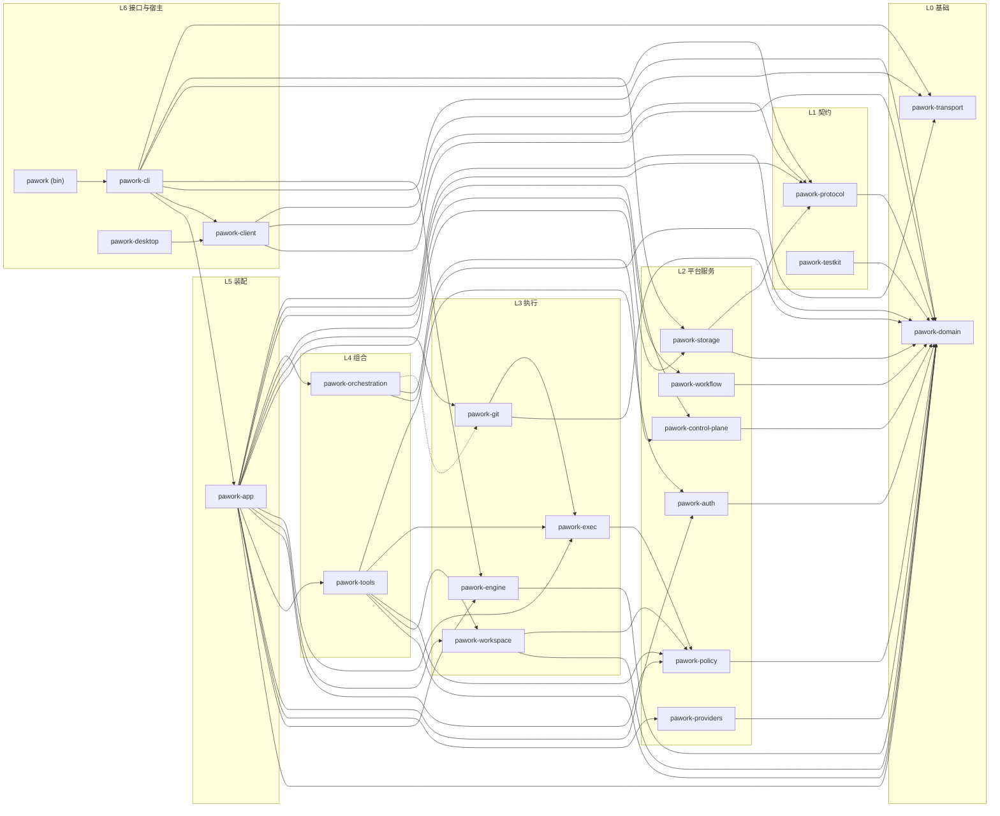
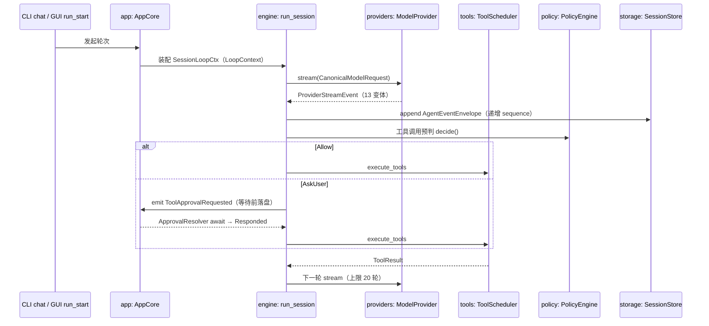
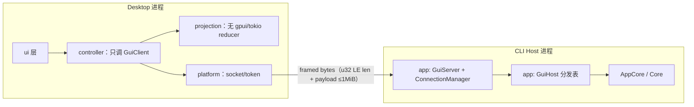
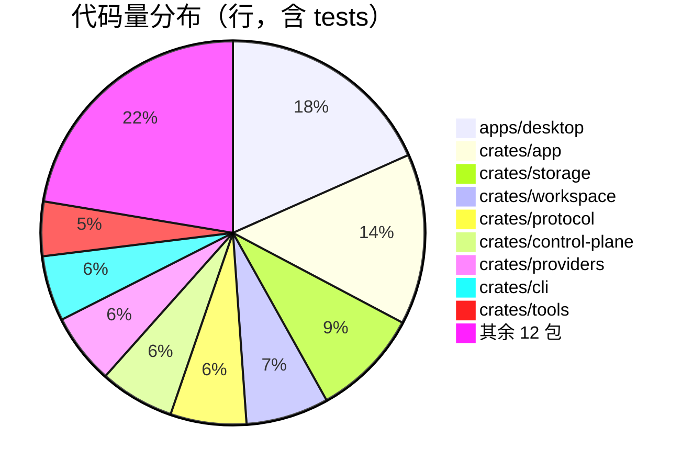

# Pawork 全景架构 Review

> 本文是代码 Review 的总架构篇：分层模型、全量依赖图、跨包数据流与冻结契约速查。逐 crate / 逐文件细节见 [README.md](README.md) 索引下的各篇文档。事实源为当前工作区源码；红线与契约的权威表述见 [../architecture.md](../architecture.md)，本文为便于分析做了图形化重组。

## 1. 一句话架构

单一 Cargo workspace，21 成员。**CLI 与 Core 同进程同二进制**（pawork 是唯一宿主，纯 Rust）；**Desktop 是独立 GPUI 进程**，只能经 GUI Connection Protocol（UDS / named pipe + 帧协议）连接 CLI Host，不加载任何 Core crate。所有 Agent 事件可持久化、可重放；Secret 明文只在 SecretBackend 内部与受保护信封中停留。

## 2. 分层模型与全量依赖图

七层依赖方向（上层可依赖下层，禁止循环；权威表见 [../architecture.md](../architecture.md) §2）：

| 层 | 包 | 角色 |
| --- | --- | --- |
| L0 基础 | domain, transport | canonical 类型与字节搬运，零内部依赖 |
| L1 契约 | protocol, testkit | wire 格式 / typegen / mock |
| L2 平台服务 | policy, auth, providers, storage, workflow, control-plane | 安全内核、凭证、通道、持久化、控制面 |
| L3 执行 | exec, git, workspace, engine | 进程沙箱、Git、工作区、Agent 循环 |
| L4 组合 | tools, orchestration | 工具集与多智能体编排 |
| L5 装配 | app | AppCore + GuiServer + GuiHost 分发表 |
| L6 接口 / 宿主 | cli, client, pawork(bin), desktop | 命令行、连接面、composition root、GUI |

关键依赖纪律（违反即红线，均有测试或布局断言护航）：

- pawork-domain 零内部依赖，且不得依赖 GUI framework / SQLite / HTTP Client / OS Keychain / Git / 具体 Provider（canonical 纯净红线）。
- pawork-engine 生产依赖仅 domain（tests/domain_only.rs 断言）；不得按 provider 名走特例分支。
- pawork-desktop 业务依赖恰好 = {pawork-client}（deny-list 断言）；protocol/domain 纯类型可入编译闭包但不构成运行时耦合。
- pawork-exec → policy 仅为路径 helper；pawork-orchestration 不依赖 workflow（装配在 app）。
- 路径安全内核只在 policy：canonicalize / within-root / relative-to-root 单源，workspace 与 exec 必须调用不得复制。

## 3. 跨包热路径

四条链路细节与「不要做的」清单见 [../spec/flows.md](../spec/flows.md)；这里给出图形化速览。

### 3.1 Agent loop（一轮对话的工具循环）

要点：engine 不落库、不选通道、不按 Provider 名分支；审批 Requested 事件先于等待落盘；文件路径一律 workspace_id + 相对路径 → policy::resolve_workspace_path。

### 3.2 GUI 连接（Desktop 不加载 Core）

要点：编解码类型在 protocol（ClientFrame / ServerFrame）；三通道可用性单源 protocol::app::registry，未登记 fail-closed；鉴权靠 gui.token（UDS 0600）；断线不取消进行中 Run；Resume 三态 Replay / SnapshotRequired / UpToDate；Timeline 投影 reducer 在 protocol::projection，host 与 desktop 同源。

### 3.3 事件持久化与重放

写入：engine / host emit AgentEvent（32 变体）→ 包进 AgentEventEnvelope（schema_version=1，session_id + 递增 sequence）→ SessionStore 经 SQLite Actor 串行 append（append-only 双触发器 + UNIQUE(session_id, sequence)）。读取：resume 重放信封；Timeline 经 protocol::projection::project_event；幂等命令走 CommandLedger(tenant, client_scope, command_id)。两套版本号勿混：信封 v1（domain）与 DB migration v14（storage）相互独立。

### 3.4 凭证与脱敏

明文 token 允许停留点：SecretBackend 内部、adapter 瞬时 expose_secret()、PWB1 protected AEAD 信封。解析链：auth::locator（env 名 / service 前缀 / 文件名单源）→ resolve_provider_credential（AuthFile / EnvFallback / None）→ app::provider_assembly 注入通道适配器（ResolvedCredential Debug 脱敏、无 Serialize）。日志由 apps/pawork/src/redact.rs 的 RedactingFmtLayer 全覆盖；配置类型**无 api_key 字段**。

## 4. 冻结契约速查

改动以下任何一项须用户确认 + golden 先行（权威表见 [../architecture.md](../architecture.md) §3.2）：

| 契约 | 形状 | golden / 锚 |
| --- | --- | --- |
| Provider 契约 | ModelProvider / CanonicalModelRequest / ProviderStreamEvent 13 变体 / ResolvedCredential | crates/domain tests |
| 事件信封 | AgentEventEnvelope v1 + AgentEvent 32 变体 | crates/domain/tests/events_golden.rs |
| 会话存储 | session_events DDL + CURRENT_SCHEMA_VERSION=14 + import/export v3 | crates/storage/src/session/migration.rs + fixtures/ |
| 工具契约 | AgentTool / ToolResult / ToolExecutionContext / ToolDescriptor | crates/domain::tool_api |
| Policy 契约 | PolicyDecision / ApprovalPrompt / ApprovalMode | crates/policy 红线回归 |
| 引擎语义 | 审批事件对 + CancelHandle + LoopContext | crates/engine 定向回归 |
| 配置 schema | TOML 六层 ConfigTier，ProviderConfig 无 api_key | crates/workspace::config 六层矩阵测试 |
| blob 格式 | PWB1 + protected AEAD + artifact/checkpoint 三区 | crates/storage::blob golden |
| GUI 协议 | 帧格式 + SUPPORTED_API_VERSIONS 1.0–1.13 + typegen 检入 schemas/ | crates/protocol 帧 golden |
| headless JSON | HeadlessResponse type=event/response，stdout 仅 JSONL | crates/protocol headless golden |
| 控制面 | usage dedup_key + audit JSONL | fixtures/audit/event-v1.jsonl |

## 5. 代码规模与热点

重构视角的观察：

- **pawork-app 是最大的耦合汇**：15 条出向依赖，全部装配、gui_server、gui_host 分发表集中于此；改动它要同时核对 [backend/app.md](backend/app.md) 与 GUI 协议 golden。
- **apps/desktop 体量已超任何库**（4 万行），但依赖面极窄（仅 client），四层纪律保证了可独立演进。
- **domain / protocol / storage 是契约密集区**：行数不大但冻结物最多，改动成本主要在 golden 与迁移链。
- **engine 刻意保持小依赖面**（仅 domain），扩展行为应加在 LoopContext 宿主侧而非 engine 内。

## 6. 文档索引

逐 crate / 逐文件 Review 见 [README.md](README.md)。
