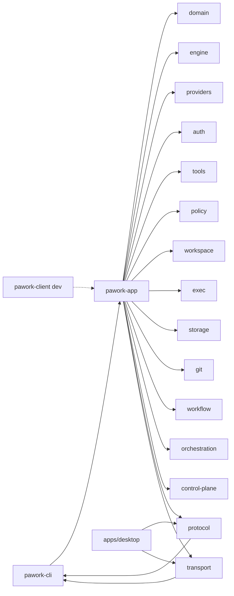

# pawork-app Review
> 应用装配门面（assembly host）：把 15 个上游 `pawork-*` crate 焊成 `AppCore`，并实现 GUI Connection Protocol 的宿主侧（`gui_server` + `GuiHostAdapter`）。65 个 `.rs` 文件 / 31,541 行（src 59 + tests 5 + examples 1）；主模块 `app_core`、`provider_assembly`、`services/`、`gui_host/`、`gui_server/`。

## 1. 职责与边界

本包处于库依赖图顶端，是 Core 的唯一正式装配层。生产上只被 `pawork-cli` 消费（`pawork` 二进制经 cli 间接使用）；`pawork-client` 仅 dev-dependency 做集成测试。Desktop 进程禁止依赖本包，只能经 protocol + transport 连 CLI。

做什么：

1. **装配 `AppCore`**：配置发现（Builtin → Global → Workspace → CLI 覆盖）、凭证链（auth 文件 → env）、协议中立 provider、八个内建工具 + MCP、session / checkpoint / artifact / protected 存储、usage/quota/audit 控制面。
2. **承载一次 run**：`chat_turn` → `pawork_engine::run_session`，事件 persist-first 落库再渲染；审批、压缩、写前 checkpoint 由 `SessionLoopCtx` 桥进 engine loop。
3. **实现 GUI 宿主**：`gui_server` 管连接/心跳/订阅/resume 帧循环；`gui_host` 实现 `GuiHost` trait，静态分发 12 个 query / 28 个 command，幂等、timeline 投影、事件总线。
4. **CLI 领域门面**：auth/OAuth、模型目录与切换、diff/checkpoint/rollback、MCP、compat import、tasks、plan gate、usage 报表、S11 多 Agent demo。

不做什么：不定义 wire 契约（帧形状、`AppCommand`/`AppQuery`/`AppEvent`、timeline 投影规则全在 `pawork-protocol`）；不实现 Provider 协议、工具本体、SQLite、Policy 判定；不做终端/GUI 渲染。`services/` 与 `CatalogOnlyProvider` 均非公开 API。

### Spec 与源码差异（以源码为准）

- Spec 写「全包约 2 万行，src/ 58 个 `.rs`，tests/ 4 个」；实测 **31,541 行 / 65 个 `.rs`**（src 59，含 `gui_host/tests/` 7 个；`tests/` 5 个；`examples/ui_fixture.rs` 1 个）。
- Spec / `lib.rs` crate 文档仍写「六通道正式装配」；源码 `FIRST_PARTY_CHANNELS` 从 providers `CHANNEL_REGISTRY` 派生 **八条**：chatgpt、xai、glm-coding、opencode-go、qwen-token-plan、deepseek、kimi-platform、kimi-code。内嵌测试名 `models_overview_aggregates_six_channels` 也过期。
- Spec 若干行数偏旧：`app_core.rs` ~1790 vs 2055；`provider_assembly.rs` ~1250 vs 1453；`auth.rs` ~440 vs 584；`auto_title.rs` ~150 vs 127；`gui_host/mod.rs` ~950 vs 1070。
- Spec 写 `AppError`「30+ 变体」；源码 **46 个变体**（含 ADR-055 `ModelDisabled`、`SessionWorkspaceUnassigned`、`WorkspaceUnavailable` 等）。
- `AdapterProtocol::Responses` 只由 ChatGPT/xAI 通道装配硬编码；`parse_protocol` 只认 `chat_completions`/`openai-compatible`/`messages`/`anthropic-messages`，extra 里写 `responses` 会 `ProtocolError::Unknown` fail-closed。
- Spec 写「`from_parts_with_protocol` 的 HTTP 客户端为 `pawork_auth::http_client()`」；源码该入口确实走 `pawork_auth::http_client()`（`redirect(Policy::none())`）。`AppCore.http` 由 `http_from_config`（全局 `proxy_url`）构建；OAuth begin/complete、token 刷新、GUI API key 验证与 `assemble_provider` 走 `provider_http`（按该 provider `use_proxy`）。`http_client()` getter 已删除。
- `workspace_list` query 对每个 workspace 写全局 `core.workspace_trusted()`（进程当前 attached 信任）；snapshot `Workspaces` 段用 `workspace_trusted_for_roots` 按该 root 逐项信任。两入口语义不一致，改信任模型时两边都要改。
- `gui_server/session.rs` 的 `host_stamp_command` / `host_stamp_query` 一律盖 `CommandSource::LocalGui`，不区分 `ConnectionLocality`。幂等 scope 因此总是 client_id，远程 GUI 也走同一列。

改动时保持：wire 契约在 protocol 不在本包；分发表与 `gui.available` 双射；persist-first；明文 Secret 不进 `AppError` / 日志 / 事件；Desktop 不依赖本包；断连不取消 Run。

## 2. 依赖关系

| 方向 | crate | 用途 |
| --- | --- | --- |
| 依赖 | pawork-domain | 信封、ID、`ModelProvider`/`AgentTool` trait、Degrade、凭证类型 |
| 依赖 | pawork-engine | `run_session` / `LoopContext` / compaction / `HeuristicEstimator` |
| 依赖 | pawork-providers | 八通道 features 全开：装配 ChatGPT/xAI/Kimi/API-key 适配器、`CHANNEL_REGISTRY`、builtin 目录 |
| 依赖 | pawork-auth | SecretBackend、API key / OAuth store、PKCE / Device Flow、刷新 |
| 依赖 | pawork-tools | 八个内建工具、`ToolScheduler`、MCP client / registry |
| 依赖 | pawork-policy | `ApprovalMode`、`PolicyEngine`、RiskLevel |
| 依赖 | pawork-workspace | 配置发现、WorkspaceService、file-index、资源注入、compat import |
| 依赖 | pawork-exec | `PtyService`（GUI 终端） |
| 依赖 | pawork-storage | SessionStore（compaction）、CheckpointService、ArtifactStore、ProtectedBlobStore、CommandLedger |
| 依赖 | pawork-git | 会话 diff、`git_status_note` |
| 依赖 | pawork-workflow | PlanService / TaskManager |
| 依赖 | pawork-orchestration | S11 demo 的 `AgentSupervisor`（`default-features = false`） |
| 依赖 | pawork-control-plane | usage ledger / quota / audit |
| 依赖 | pawork-protocol | GUI 帧、`AppCommand`/`AppQuery`/`AppEvent`、Handshake、timeline 投影 |
| 依赖 | pawork-transport | `GuiTransportServer` / 连接抽象（生产不开 local/memory） |
| 被依赖（生产） | pawork-cli | `pawork` 二进制唯一正式宿主：装配 `AppCore`、绑 `GuiServer` |
| 被依赖（dev） | pawork-client | 仅 dev-dependency，GUI 连接侧集成测试 |
| 禁止依赖 | apps/desktop | 架构红线：只经 protocol + transport 连 CLI |

| 外部 crate | 用途 |
| --- | --- | --- |
| tokio（macros / rt-multi-thread / fs / sync / time） | 装配、GUI 会话任务、幂等等待、OAuth 超时 |
| reqwest | OAuth / API key 验证 / 命名补全 HTTP；`redirect(Policy::none())` |
| toml | 配置写回（Settings / MCP / proxy） |
| blake3 | protected `master.key` 派生 AEAD key |
| getrandom | 创建 `master.key` |
| tracing | degrade / 装配告警；测试用 `RecordingCapture` |
| serde / serde_json | Settings Data、幂等缓存、snapshot JSON |
| async-trait | `GuiHost` / `ApprovalPromptHost` / `LoopContext` |
| futures | 工具并发 `join_all` |
| thiserror | `AppError` |

feature 门：`default = []`；`ui-fixture` 编译 `devfixture` + example + 对应集成测试；`live-smoke` 编译真实 API 冒烟。providers / storage 的 features 由本包 Cargo.toml 固定开启，不随本包 feature 切换。

dev-dependencies：`pawork-testkit`、`pawork-transport`（local + memory）、wiremock、tempfile。

## 3. 文件清单

路径相对 `crates/app/`。

| 相对路径 | 行数 | 职责 |
|---|---:|---|
| src/lib.rs | 80 | 模块声明与 crate 根 re-export；唯一 `pub mod` 是 `gui_server` |
| src/app_core.rs | 2,055 | `AppLoadOptions`、`AppError`（46 变体）、`CatalogOnlyProvider`、`AppCore` 装配与门面、`RoleModelKind` |
| src/provider_assembly.rs | 1,453 | provider 装配单点：通道→协议、凭证链、切换、目录聚合、自动标题 |
| src/gui_host/mod.rs | 1,070 | `GuiHostAdapter`：snapshot/timeline/query/command、静态分发表、幂等 wrap |
| src/gui_host/bus.rs | 312 | `GuiEventBus` / `GuiBroadcastSink` / `GuiRunRegistry`；合成序号 `2^60` |
| src/gui_host/events.rs | 182 | `AgentEvent`→`AppEvent` 投影；幂等 client scope |
| src/gui_host/auto_title.rs | 127 | ADR-054 成功 run 后自动标题（不阻塞终态） |
| src/gui_host/handlers/mod.rs | 8 | handler 子模块声明 |
| src/gui_host/handlers/query.rs | 257 | 12 个 query 中的 8 个：workspace/session/model/run/diff/quota/mcp |
| src/gui_host/handlers/command.rs | 45 | `workspace_add` / `run_cancel` |
| src/gui_host/handlers/session.rs | 225 | SessionCreate/Open/Fork/Rename/Archive |
| src/gui_host/handlers/run_start.rs | 362 | RunStart：切换、stale 重装配、`@` 展开、登记、spawn、无终态收口 |
| src/gui_host/handlers/approval.rs | 92 | ToolApprove 三态（Live / durable seal / queued） |
| src/gui_host/handlers/terminal.rs | 563 | TerminalCreate/Write/Resize/Close + Policy 闸 |
| src/gui_host/handlers/mcp.rs | 154 | `mcp_test` / `mcp_server_remove` |
| src/gui_host/handlers/settings/mod.rs | 151 | Settings 门面、`AuthFlight` 单飞守卫 |
| src/gui_host/handlers/settings/auth.rs | 348 | auth_set_api_key / auth_start / auth_cancel / auth_remove（命中当前 provider 标 stale） |
| src/gui_host/handlers/settings/catalog.rs | 671 | provider_auth_status、默认模型/角色、禁用、use_proxy（写锁复核；禁用按盘面合并） |
| src/gui_host/handlers/settings/general.rs | 65 | general_settings / set_proxy_url |
| src/gui_host/handlers/settings/permissions.rs | 107 | permissions_settings / set_approval_mode / workspace_trust |
| src/gui_host/handlers/settings/terminal.rs | 100 | terminal_settings / set_terminal_settings |
| src/gui_host/tests/mod.rs | 379 | 分发表双射、timeline 分页、ModelList、bus |
| src/gui_host/tests/run.rs | 1,244 | RunStart / 自动标题 / 合成终态 / 禁用模型 |
| src/gui_host/tests/session.rs | 297 | snapshot / SessionCreate / Fork / Rename / Archive |
| src/gui_host/tests/approval.rs | 463 | ToolApprove 三态与重启后 pending 重建 |
| src/gui_host/tests/idempotency.rs | 593 | CommandLedger 幂等、InFlight、record 失败 |
| src/gui_host/tests/settings.rs | 2,324 | SET-2/4/5/6 Settings 主路径、stale 重装配、fail-closed |
| src/gui_host/tests/terminal.rs | 142 | terminal_close / 自然退出广播 |
| src/gui_server/mod.rs | 181 | `GuiHost` trait、`GuiServer` bind/accept |
| src/gui_server/connection.rs | 552 | `ConnectionManager`：心跳 30s、队列 1024、lagged |
| src/gui_server/session.rs | 1,015 | 单连接握手与帧循环、Resume 三态、capability 门 |
| src/services/mod.rs | 9 | 七个领域服务模块声明 |
| src/services/session.rs | 1,204 | 会话生命周期、resume 分叉、启动清扫 |
| src/services/run.rs | 616 | `chat_turn` persist-first、compact、append_payload |
| src/services/approval.rs | 633 | 审批模式/信任/宿主；写工具审批集成测试 |
| src/services/extension.rs | 404 | workspace / file-index / `@` 展开 / 注入层 / MCP slot |
| src/services/usage.rs | 402 | 预算预检、ledger 落账、overview |
| src/services/import.rs | 319 | 本机扫描、compat 两段式、export/import |
| src/services/tasks.rs | 262 | TaskManager + `tasks.json` 原子写 |
| src/idempotency.rs | 677 | `IdempotencyStore`：SQLite CAS + 进程内 Notify |
| src/hub.rs | 421 | `EventHub` 全局序 + ring 4096 + broadcast |
| src/approval.rs | 577 | `ApprovalPromptHost` / `GuiApprovalHost` / 写工具预览 |
| src/loop_ctx.rs | 430 | `SessionLoopCtx` 实现 engine `LoopContext` |
| src/auth.rs | 584 | auth_status / set-key / logout / OAuth 编排 |
| src/protected.rs | 609 | `FileKeyResolver` / `SwappableReasoningProtector` |
| src/extensions.rs | 616 | 内建工具、MCP 装配、`at_tokens`、64 KiB 附件 |
| src/channels.rs | 231 | 八通道 facade + `oauth_override` |
| src/protocol.rs | 141 | `AdapterProtocol` 解析（extra → 默认表 → ChatCompletions） |
| src/diff.rs | 414 | 会话累计 diff（git 过滤 / 快照回退） |
| src/checkpoint.rs | 339 | 写前快照、列表、rollback |
| src/control.rs | 366 | `ControlPlaneRuntime` + usage 报表行 |
| src/data_dir.rs | 296 | 数据目录、instance 白名单、各实例路径 |
| src/import_host.rs | 314 | compat 导入宿主包装、指纹防 TOCTOU |
| src/plan_host.rs | 232 | Plan CRUD + fail-closed 执行闸 |
| src/orchestration_host.rs | 206 | S11 多 Agent demo（非通用 API） |
| src/tasks_host.rs | 94 | tasks 门面 + `parse_task_kind` |
| src/persist.rs | 24 | `PersistThenRender` |
| src/devfixture.rs | 1,475 | `ui-fixture` 种子器（`#[doc(hidden)]`） |
| src/testsupport.rs | 395 | 仅 `cfg(test)`：mock core、`RecordingCapture` |
| tests/gui_server/session.rs | 1,189 | 具名 bin：握手/resume/心跳/capability |
| tests/gui_server/multi_gui_runtime.rs | 841 | 具名 bin：多 GUI 一致性、断连不取消 |
| tests/timeline_projection_host.rs | 158 | host timeline 与 protocol golden 对拍 |
| tests/ui_fixture_projection.rs | 425 | `ui-fixture`：seed → snapshot/timeline |
| tests/smoke.rs | 112 | `live-smoke` + `--ignored` 真实 API 冒烟 |
| examples/ui_fixture.rs | 909 | fixture CLI：seed / serve / self-check / snapshot-dump |

## 4. 类型与方法功能列表

### 4.1 lib.rs

唯一 `pub mod` 是 `gui_server`。`gui_host` 与 `services` 目录私有，公开类型经 crate 根 re-export。`devfixture` 仅 `cfg(any(test, feature = "ui-fixture"))` + `#[doc(hidden)]`；`testsupport` 仅 `cfg(test)`。crate 文档仍写「六通道」，与源码八通道不一致。

| 名称 | 种类 | 功能 / 语义 |
|---|---|---|
| `gui_server` | pub mod | 连接层：`GuiHost` trait、`GuiServer`、`ConnectionManager` |
| `devfixture` | pub mod（hidden） | UI fixture 种子器；默认 feature 关闭，不进生产闭包 |
| `session_title_from_text` | fn | 从首条用户文本派生会话标题（截断到 72，空则 `New session`） |
| `AppCore` / `AppError` / `AppLoadOptions` | re-export | 装配门面 |
| `ApprovalAsk` / `ApprovalPromptHost` / `GuiApprovalHost` / `DenyAllApprovals` / `PendingToolApproval` / `ApprovalResolve` / `parse_approval_mode` | re-export | 审批宿主家族 |
| `AuthChannelStatus` / `AuthSource` / `OAuthLogin` | re-export | 凭证状态与 OAuth 登录态 |
| `FIRST_PARTY_CHANNELS` / `first_party_channel` / `is_first_party` / `ChannelKind` / `FirstPartyChannel` | re-export | 八通道 facade（`ChannelKind` 来自 providers） |
| `CheckpointSummary` / `RollbackOutcome` | re-export | 检查点列表与回滚结果 |
| `LedgerTotals` / `QuotaWindowLine` / `SessionUsageLine` / `UsageOverview` | re-export | usage 报表行 |
| data_dir 家族 | re-export | 见 §4.8 |
| `paginate_diff` / `render_diff_file` / `render_session_diff` / `GitDiffHeader` / `SessionDiff` | re-export | 会话 diff |
| `AtAttachment` / `McpServerStatus` | re-export | `@` 附件与 MCP 状态 |
| `GuiHostAdapter` / `GuiEventBus` / `GuiBroadcastSink` / `GuiRunRegistry` / `project_timeline_item` | re-export | GUI 宿主适配 |
| `EventHub` / `HubError` / `HubSubscription` / `DEFAULT_HUB_CAPACITY` | re-export | 事件扇出 |
| `IdempotencyStore` 家族 | re-export | 命令幂等 |
| `CompatTool` / `SessionImportFormat` / `SessionImportOutcome` 等 | re-export | compat 导入 |
| `MultiAgentDemoOptions` / `MultiAgentDemoReport` | re-export | S11 demo |
| `PersistThenRender` | re-export | persist-first 组合子 |
| `AdapterProtocol` / `ProtocolError` | re-export | 适配器协议 |
| `parse_task_kind` / `review_status_label` | fn | tasks / plan 辅助 |
| 上游类型便捷 re-export | re-export | `ApprovalMode`/`RiskLevel`、`SessionRecord`/`SessionExport`/`EXPORT_SCHEMA_VERSION`、`PlanSnapshot`/`TaskSnapshot`、`DiffFile`/`DiffPage`、compat 扫描类型 |

改 re-export 会牵动 cli 全部 import。`unbound_workspace` 与 `RETAINED_MESSAGES` 仅 `pub(crate)`。

### 4.2 app_core.rs

| 名称 | 种类 | 功能 / 语义 |
|---|---|---|
| `AppLoadOptions` | struct | `workspace_root` / `provider` / `model` / `data_dir` / `approval_mode` / `trust_workspaces` / `approval_host` / `auth_backend` / `instance`。`trust_workspaces` 仅可信宿主显式覆盖本进程，不写回配置。`from_cli(provider, model)` 用 `current_dir` 作 workspace、instance=`default`。Debug 不打印宿主/后端本体 |
| `AppError` | enum | 46 变体，明文 key 不得进任何变体。透传：`Config`/`Auth`/`Provider`/`Engine`/`Session`/`Io`/`Workspace`/`Tools`/`Protocol`/`Checkpoint`/`Artifact`/`Git`/`ProtectedBlob`/`Mcp`/`Resources`/`Compat`/`FileIndex`。本包语义：`MissingDefaultProvider`/`MissingDefaultModel`/`UnknownProvider{id}`/`MissingBaseUrl{id}`/`MissingCredential{provider,env_name}`/`OAuthLoginRequired`/`OAuthLogin`/`UnknownModel{model,provider}`/`ModelDisabled{provider,model}`/`ModelBelongsToProvider{model,owner,current}`/`StoreNotOpen`/`SessionNotFound`/`SessionWorkspaceUnassigned`/`WorkspaceUnavailable`/`AmbiguousSession{prefix,matches}`/`EmptyTurn`/`ApprovalMode`/`InvalidProxy`/`InvalidInstance`/`CheckpointStoreNotOpen`/`CheckpointNotFound`/`AmbiguousCheckpoint`/`Protected`/`Import`/`PlanNotApproved{plan_id,version,status}`/`Plan`/`ControlPlane`/`Task`/`Orchestration` |
| `RoleModelKind` | pub(crate) enum | `Conversation` / `Naming` / `Vision` / `Search`。`ALL` 固定序；`from_wire` 未知 → None（宿主 `unknown_role`）；Conversation 复用 `default_provider`/`default_model`，不建第二份真相。半配对按 None |
| `RETAINED_MESSAGES` | pub(crate) const | `4`；压缩时 session 侧按 `/2` 轮对齐 |
| `PLACEHOLDER_SESSION_TITLE` | pub(crate) const | `"New session"`；自动标题只在此占位名上写回 |
| `CatalogOnlyProvider` | 私有 struct | 缺凭证占位：`list_models` 空；`stream` 报 `ProviderErrorKind::Authentication`。Engine 无感知。`load_for_catalog` 专用 |
| `AppCore` | struct | 字段全 `pub(crate)` 或私有。持有 provider/credential/model/config/backend/http/registry/heuristic/session_estimator/adapter_protocol/store/scheduler/tool_defs/descriptors、七个 services、checkpoints/artifacts/protected、发号原子、`provider_pending`/`provider_stale`、`trust_override`。Debug 筛选，不含凭证本体 |
| `SessionTokenEstimatorBridge` | 私有 struct | 把 engine `HeuristicEstimator` 桥到 storage 窄口 `TokenEstimator` |
| `unbound_workspace` | pub(crate) fn | 构造 `ws-unbound` 哨兵 Workspace，无归属会话用 |

`AppCore` 装配入口：

| 名称 | 种类 | 功能 / 语义 |
|---|---|---|
| `load` | async fn | `load_with(options, allow_pending=false)`：缺凭证 fail-closed。发现配置 → 装配 provider → `configure_approval` → `attach_workspace` → 按 instance 开 session.db / artifacts / protected / control-plane |
| `load_for_catalog` | async fn | 同路径但缺凭证不失败，退 `CatalogOnlyProvider`；`provider_pending()==true`。chat 请求时报 Authentication |
| `load_from` / `from_config` | async fn | 跳过发现、注入已解析配置 |
| `from_resolved` | fn | 要求 provider+model，内部 `block_on(assemble_provider)` |
| `from_parts` | fn | 注入件直接拼 Core，测试/smoke 用；协议默认 ChatCompletions |
| `from_parts_with_protocol` | pub(crate) fn | 再注入 `AdapterProtocol` 与 `ModelRegistry`；HTTP 用 `pawork_auth::http_client()`（全局默认客户端，不是 provider proxy） |
| `http_from_config` / `http_with_proxy` | pub(crate) fn | `redirect(Policy::none())`；proxy 走 `loopback_aware_proxy`。非法 URL → `InvalidProxy`（文案不含原文） |
| `configure_approval` | fn | 设 mode + trust + host，并 `refresh_scheduler_approval`（Arc-swap）。须在 `attach_workspace` 前 |
| `set_approval_host` | fn | 只换交互入口，不改启动 trust |
| `attach_workspace` | fn | 进程内登记：空库首个固定 `ws-default`，其后 `allocate_workspace_id`。生产 `workspace_add` 走 `register_workspace` |
| `register_workspace` | async fn | 持久幂等：同 canonical root 复用 stable id，同 id 异 root fail-closed |
| `open_store` | async fn | 开 session.db、读 v14 注册表、预载 session 归属、`install_builtin_tools`、末尾 `seal_interrupted_runs` |
| `open_checkpoints` / `open_control_plane` / `open_protected` | fn | 打开 blob / usage / PWB1；protected 绑定 `SwappableReasoningProtector` |
| `prime_extensions` | async fn | file-index 扫描（失败 warn）+ MCP auto-start（失败不拖垮装配） |
| `shutdown` | async fn | 关 MCP、落 tasks 快照、关 store；消费 self |

只读与会话门面（多转发 `services/`）：`provider_id`/`model`/`adapter_protocol`/`config`/`auth_backend`/`store`/`provider_pending`/`workspace_*`/`registered_workspaces`/`workspace_by_id`/`workspace_for_session`/`latest_session_for_workspace`/`approval_mode`/`approval_host`/`tool_names`/`turn_context`；`create_session`（当前 workspace）/`create_session_with_workspace`/`create_session_unbound`（落盘 NULL）/`rename_session`/`archive_session`/`list_sessions`/`get_session`/`resolve_session`/`next_sequence`；`resume_messages`（CLI：孤儿审批 seal Denied）/`resume_messages_keep_pending`（GUI：保留 pending）；`chat_turn`/`chat_turn_with_run_id`；`compact_session`；`session_diff`/`list_checkpoints`/`rollback`；usage 四件套。

`workspace_name` 读当前 attached 显示名。`workspace_for_session_or_unbound` / `session_workspace_for_record` 在绑定缺失时回 `ws-unbound` 哨兵，不编造假 workspace。`RoleModelKind` 辅助：`wire_name` / `provider_key` / `model_key` / `pair_in_config`（Conversation 复用 default_*）。`from_config_inner` 是 `from_config` 的异步核；`with_state` 测试注入内部状态。

内存写口（Settings handler 写盘成功后调用，进行中 run 不变）：`set_default_model_pair`/`set_proxy_url`/`set_provider_use_proxy`/`set_provider_disabled_models`/`set_role_model_pair`/`set_terminal_settings`/`set_approval_mode`/`set_workspace_trusted`。`workspace_trusted_for_roots` 按目标根路径读逐项目信任，不借用 attached 项目。`provider_needs_rebuild` = pending 或 stale。GUI 在 `auth_set_api_key` / OAuth 成功 / `auth_remove` / `set_provider_use_proxy` 命中当前 provider 时置 `provider_stale`；`set_proxy_url` 只改 `config.proxy_url` 与 `core.http`，不置 stale。`bind_session_workspace` 仅内存，给 devfixture。

改动注意：`open_store` 会 `replace_workspace_cache` 再清扫悬空 run；重复 open 不得保留旧库归属。`from_resolved` 的 `block_on` 不能在已有 tokio runtime 线程上调。

### 4.3 `provider_assembly.rs`

Host 装配层唯一的 Provider 选择点。Engine 只看 `ModelProvider` trait，不读本模块。

| 名称 | 种类 | 功能 / 语义 |
|---|---|---|
| `is_credential_pending` | pub(crate) fn | 仅 `MissingCredential` / `OAuthLoginRequired` / `OAuthLogin` / `Auth` 视为目录可容忍；配置/协议/未知 provider 仍 fail-closed |
| `provider_models` | pub fn | 当前 provider 在 registry 的静态目录（REPL `/model`） |
| `switch_model` | pub async fn | 会话内切模型；ADR-055 目标禁用 → `ModelDisabled`，不静默回退。有 session 时落 `Diagnostic{code:"model.switched"}` |
| `switch_provider` | pub async fn | 重建 adapter。未知 id → `UnknownProvider`。模型选择：显式 → 当前模型若属目标 provider → 目标 registry 首条。成功清 `provider_pending`/`provider_stale` 并 `rebind_persistent_protector` |
| `generate_session_title` | pub(crate) fn | 返回不借用 Core 的 Future。20s 总超时、64 output tokens、输入截 4000 字、无工具。命名模型未配或禁用 → `Ok(None)`。首个非空行经 `session_title_from_text`，等于占位名则丢弃 |
| `model_catalog` | pub async fn | 当前通道 builtin + 运行期 `/models` 探测；探测失败 warn 后退静态 |
| `models_overview` | pub async fn | 八通道 + config providers。按 `(provider, model)` 去重（单供应商 Registry 不能跨供应商去重）。探测 4s timeout，超时/失败静默退该通道静态 |
| `resolve_provider_model` | pub(crate) async fn | 静态命中且 provider 匹配则返回；否则 `list_models` 惰性合并。同名属其他 provider → `ModelBelongsToProvider`；仍无 → `UnknownModel` |
| `provider_proxy` | pub(crate) fn | Global `proxy_url` 生效，仅该 provider `use_proxy=false` 绕过。不按 id 特判 |
| `provider_http` | pub(crate) fn | 认证与模型请求共用该 provider 的 proxy 选择 |
| `channel_protocol` | pub(crate) fn | `ChatGptOAuth`/`XaiOAuth` → `Responses`；`ApiKey`/`KimiOAuth` → `ChatCompletions`；自定义走 `resolve_adapter_protocol` |
| `assemble_registry` | pub(crate) fn | builtin + Messages 静态目录 + xAI/Kimi builtin + config.models + transport override |
| `AssembledProvider` | pub(crate) struct | `adapter` / `credential` / `protocol` / `registry` |
| `assemble_provider` | pub(crate) async fn | 唯一装配入口。`refresh_oauth=true` 时请求前刷新（`provider_http`）。ChatGPT 缺 account_id → `OAuthLogin`。xAI 双认证：先 `try_api_key_credential`（auth 文件或 env），无则 OAuth |
| `oauth_refresh_endpoint` | pub(crate) fn | `[oauth.<id>].token_url` 覆盖 → 通道 preset |

私有实现：`naming_request` 固定中文 system 指令、无工具；`TitleTextSink` 只收集 `TextDelta`。`try_api_key_credential` / `oauth_credential` 明文不进返回类型。自定义 extra 写 `responses` 会在 `channel_protocol` → `parse_protocol` 处 `ProtocolError::Unknown` fail-closed——`Responses` 只由 ChatGPT/xAI 硬编码，不是可配置字符串。

`apply_config_models` 把 config.models 与 transport override 合并进 registry，`assemble_registry` 调用。

改动注意：切 provider 必须清 pending/stale，否则 GUI `run_start` 会因 `provider_needs_rebuild` 反复重装配。overview 探测超时是 Desktop ModelList 的 10s 客户端超时地板，不要加长到拖死 UI。

### 4.4 `protocol.rs` / `channels.rs` / `persist.rs`

| 名称 | 种类 | 功能 / 语义 |
|---|---|---|
| `AdapterProtocol` | pub enum | `ChatCompletions` / `Messages` / `Responses`。非冻结契约字段 |
| `resolve_adapter_protocol` | pub fn | extra `provider_protocols[id]` → 默认表 → `ChatCompletions`。无法识别 fail-closed |
| `parse_protocol` | 私有 fn | 只认 `chat_completions`/`openai-compatible`/`messages`/`anthropic-messages`。不认 `responses` |
| `default_protocol` | 私有 fn | 仅 `glm-coding-anthropic` → `Messages`，其余 `ChatCompletions` |
| `ProtocolError` | pub enum | 唯一变体 `Unknown { provider, value }` |
| `FirstPartyChannel` | pub struct | `id` / `kind` / `default_base_url` / `display_name`；preset 私有。`oauth_preset()` / `auth_methods()` 转发 providers 注册表 |
| `FIRST_PARTY_CHANNELS` | pub static | 从 `CHANNEL_REGISTRY` 派生八条：chatgpt、xai、glm-coding、opencode-go、qwen-token-plan、deepseek、kimi-platform、kimi-code |
| `first_party_channel` / `is_first_party` | pub fn | 按 id 查找 |
| `api_key_channel` | pub fn | 注册表声明 `api_key` 的通道（含 xAI 双认证） |
| `oauth_override` | pub fn | 读 `[oauth.<id>]`。Device Flow 只需 `device_auth_url`；PKCE 需要 `auth_url`+`redirect_uri`。两者同时提供时 device 优先 |
| `PersistThenRender` | pub struct | `store` / `render` / `branch_id`。先 `append_event(active branch)` 再 render；失败 `EngineError::sink`。fork 后 `branch_id` 必须是当前 active，不得默认 `main` |

`ChannelKind` / `OAuthFlow` / `OAuthPreset` re-export 自 `pawork-providers`。本模块是 host facade，Engine 不读。

### 4.5 `services/`

`mod.rs` 只声明七个 `pub(crate) mod`，无类型。服务均非公开 API，由 `AppCore` 转发。

#### SessionService（`services/session.rs`）

| 名称 | 种类 | 功能 / 语义 |
|---|---|---|
| `SessionService` | pub(crate) struct | `workspaces: Mutex<HashMap<session_id, WorkspaceId>>` 进程内绑定缓存 |
| `INTERRUPTED_TOOL_RESULT_MESSAGE` | pub(crate) const | `"run interrupted before completion"` |
| `INTERRUPTED_RUN_FAILED_MESSAGE` | pub(crate) const | `"host process ended before the run reached a terminal state"` |
| `insert_workspace_cache` / `replace_workspace_cache` | pub(crate) fn | 生产创建后更新；启动预载以存储非 NULL 绑定**原子替换** |
| `create_session` | pub async fn | 当前 attached workspace；`ws-unbound` 或不在注册表则落盘无绑定 |
| `create_session_with_workspace` | pub async fn | GUI：显式绑定 command 里的 workspace_id |
| `create_session_unbound` | pub async fn | ADR-054：落盘 `workspace_id=NULL`，不进缓存 |
| `rename_session` / `archive_session` | pub async fn | 不存在由存储报 `SessionNotFound` |
| `resume_messages` | pub async fn | CLI：先 `seal_orphaned_approvals`（waiting → Denied），再按 active branch 投影 |
| `resume_messages_keep_pending` | pub async fn | GUI：不封孤儿审批，卡片可重建 |
| `seal_interrupted_runs` | pub(crate) async fn | `open_store` 末尾调用。`running` → 非 waiting 的未完成 tool 封 `ToolExecutionCompleted(is_error)` + `RunFailed`。**waiting_for_approval 不封 tool**，留给 GUI 重建 pending |
| `resolve_waiting_tool_call` | pub(crate) async fn | Denied/Approved 都落 `Responded` + `Completed(is_error=true)` + `MessageCommitted`。工具一律不重跑。已有 result 则早退只含 Responded |
| `next_sequence` | pub async fn | 尾事件 +1；空会话为 1；溢出 `EngineError::sink` |
| `resolve_session` | pub async fn | `latest` / 完整 id / 唯一前缀；多命中 `AmbiguousSession` |

改动注意：CLI 与 GUI 的 resume 分叉不要合并。启动清扫若误封 waiting，重启后审批卡片消失且无法 durable seal。

#### RunService（`services/run.rs`）

| 名称 | 种类 | 功能 / 语义 |
|---|---|---|
| `RunService` | pub(crate) struct | 无状态 |
| `append_payload` | pub(crate) async fn | persist-first 追补事件，写 **active branch** |
| `chat_turn` | pub async fn | 自分配 `run-{ts}-{n}` 后转 `chat_turn_with_run_id` |
| `chat_turn_with_run_id` | pub async fn | GUI 上移 run_id 分配。末条必须 User 否则 `EmptyTurn`。user `message_id` 换成全局 `msg-{ts}-{next_message}`（V1 `messages.message_id` 跨 session UNIQUE）。顺序：Plan gate → file-index 扫描（失败 warn）→ `git_status_note` 插 system → `assemble_request_with_tools` → `PersistThenRender` → `SessionLoopCtx`（scheduler 快照 mode+该 session 信任）→ `tasks_start_agent`（失败不阻断）→ `run_session` → usage ledger → `tasks_finish` |
| `compact_session` | pub async fn | 手动压缩，事件序与自动链相同 |

`emit_tasks_finish_degrade`：tasks 快照失败经 sink 发 Diagnostic；取 sequence 失败则只打 error 日志。

改动注意：user message 不得用 `next_request` 起号。fork 后 `branch_id` 取 `session_active_branch`，写回 main 会把事件接到祖先。

#### ApprovalService（`services/approval.rs`）

| 名称 | 种类 | 功能 / 语义 |
|---|---|---|
| `ApprovalService` | pub(crate) struct | 默认 `ReadOnly` + 不信任 + `DenyAllApprovals`。字段：`mode` / `workspace_trusted` / `host` |
| `configure` | pub(crate) fn | 设 mode + trust + host。须在 `attach_workspace` 前，否则首轮 scheduler 快照错 |
| `set_mode` | pub(crate) fn | 只影响之后 Run；进行中 Run 保留启动时 `scheduler_approval_snapshot` |
| `mode` / `workspace_trusted` / `host` | 只读 | GUI Settings 与 snapshot 读口 |

内嵌测试钉：AskForWrites 一次批准落盘+事件对；rollback 恢复；DenyAll 不写文件；ReadOnly/untrusted 不询问；K02 崩溃 pending 不重跑；快照失败诊断仍写入。

#### ExtensionService（`services/extension.rs`）

| 名称 | 种类 | 功能 / 语义 |
|---|---|---|
| `ExtensionService` | pub(crate) struct | `workspaces` / `workspace_catalog` / 当前 `workspace_id`/`name`/`roots` / `file_index` / `resource_loader` / `mcp_servers` |
| `new_file_index` | pub(crate) fn | 空 `FileIndex` |
| `resource_loader_for` | pub(crate) fn | 按 WorkspaceService 建 `ResourceLoader`（AGENTS.md / skills） |
| `load_injected_layers` | pub(crate) async fn | 信任才注入根 AGENTS.md 与 skills；按**目标 session workspace** 的信任，不借用 attached |
| `expand_at_refs` | pub async fn | 原文为首 Text part，每个命中附件另 part（`[attached file: path (truncated|complete)]`），`AT_FILE_MAX_BYTES=64KiB` 截断。绝对路径或 `..` fail-closed。 |
| `complete_at` | pub async fn | `@` 补全；未索引则先扫描 |
| `mcp_list` | pub fn | 槽状态；无 client 也回报 name/state |
| `shutdown_mcp` | pub(crate) async fn | 关已启动 MCP，装配 `shutdown` 调用 |

`resolve_at_query`：相对当前 workspace root 解析。改注入层时同步 `extensions.rs` 的 MCP 槽与 secret 前缀。

#### UsageService（`services/usage.rs`）

| 名称 | 种类 | 功能 / 语义 |
|---|---|---|
| `UsageService` | pub(crate) struct | 持 `ControlPlaneRuntime` |
| `in_memory` | pub(crate) fn | 测试用内存 ledger |
| `projected_run_usage` | pub(crate) async fn | 从 run 事件 JSON 抽 `TokenUsage` |
| `record_completed_usage` | pub(crate) async fn | `record_id=rec-<run_id>`；`account_id=local/default`；`upstream_attempt=Some(1)`；`trace_id=None`（ADR-038） |
| `usage_overview` | pub async fn | 当前 session 行 + ledger 合计 + quota 窗口。provider 为 `catalog`/空 → `ControlPlane` 错误，不编造 |
| `session_usage` | pub async fn | 累加 completed/failed/cancelled |
| `last_run_usage` | pub async fn | 按时间正序覆盖，拿最新 |
| `estimate_cost_for` | pub fn | registry 有定价才算；无定价隐藏，**不用 USD 占位**（无定价货币为 `XXX`） |

#### ImportService（`services/import.rs`）

| 名称 | 种类 | 功能 / 语义 |
|---|---|---|
| `ImportService` | pub(crate) struct | 无状态，方法挂 `AppCore` |
| `scan_local_sessions` | pub fn | 列本机外部会话文件，**不读内容** |
| `preview_compat_import` | pub fn | 两段式第一段：预览 + 源文件指纹 |
| `apply_compat_import` | pub fn | 指纹不匹配 fail-closed（防 TOCTOU）。hooks/permissions 跳过 |
| `export_session_doc` | pub async fn | 本会话 Export v3 |
| `import_session_file` | pub async fn | `SessionImportFormat`：Export / Compat / Pi |

#### TaskService（`services/tasks.rs`）

| 名称 | 种类 | 功能 / 语义 |
|---|---|---|
| `TaskService` | pub(crate) struct | `TaskManager` + 可选 `tasks.json` |
| `tasks_list` / `tasks_status` / `tasks_register` / `tasks_cancel` | pub fn | CLI 门面；`resolve_task` 支持前缀，多命中 fail-closed |
| `tasks_start_agent` / `tasks_finish` | pub(crate) fn | run 生命周期挂钩；start 失败不阻断对话 |
| `tasks_finish_with_degrade` | pub(crate) fn | 写盘失败返回 `DegradeKind::TasksFinishFailed`，不把 finish 本身失败掉 |
| `persist_tasks` | 私有 fn | `tasks.json.tmp` + rename |
| `open_tasks` | pub(crate) fn | 读 snapshot replay |
| `take_last_degrade` | pub(crate) fn | 测试取最近 degrade |

### 4.6 `loop_ctx.rs` / `approval.rs` / `checkpoint.rs`

#### SessionLoopCtx

| 名称 | 种类 | 功能 / 语义 |
|---|---|---|
| `SessionLoopCtx` | pub(crate) struct | 实现 engine `LoopContext`。字段含 scheduler / policy / approval_host / store / checkpoints / workspace_roots |
| `execute_tools` | trait 方法 | `join_all` 并发，上限来自 scheduler `max_concurrent=8` |
| `request_approval` | trait 方法 | `AskUser` 先 emit `ToolApprovalRequested` 再 `approval_host.decide`。`ApprovedForRun` 批内短路后续 Ask。`Allow`/`Deny` 走 `ApprovalGate::NotRequired`，**不**再给 scheduler resolve（避免只读工具弹窗） |
| `compact_history` | trait 方法 | 无 store → `Ok(None)`（engine 退消息层压缩）。storage 失败 → `EngineError::sink`，禁止吞掉。按 active branch 祖先链建 `RetentionInputs`；`retained_turns = RETAINED_MESSAGES/2` |
| `snapshot_write_tools` | trait 方法 | 转 `checkpoint::snapshot_write_tools` |

`decide_policy`：descriptor `requires_approval` 且非 Deny 时强制 AskUser。`execute_one` 对已 Ask 的工具注入 `PreApprovedResolver`（`can_resolve_policy_prompt=true`），让 scheduler 不再二次询问。`fill_error_content` 把空错误填成 Text part。

#### 审批宿主

| 名称 | 种类 | 功能 / 语义 |
|---|---|---|
| `ApprovalAsk` | pub struct | `run_id` / `session_id` / `tool_name` / `tool_call_id` / `relative_path` / `message` / `risk` / `preview` |
| `ApprovalPromptHost` | pub trait | `decide(&self, ask, cancel) -> ApprovalDecision` |
| `DenyAllApprovals` | pub struct | 任何 AskUser → `Denied`（`--json` / 缺省 fail-closed） |
| `PendingToolApproval` | pub struct | Snapshot / Desktop 卡片摘要 |
| `ApprovalResolve` | pub enum | `Live` / `Queued`。无 restore_detached 第三态 |
| `GuiApprovalHost` | pub struct | **pending 与 queued 共用一把锁**。`resolve`：在 pending 则唤醒 oneshot 返回 Live；否则入 queued 返回 Queued。run_id 不匹配报错。关窗不断 oneshot、不自动允许 |
| `set_on_pending` | pub fn | 注册时回调；`GuiHostAdapter` 用来广播 `ToolApprovalRequired` |
| `pending` / `clear_run` | pub fn | 列表；run 结束清该项 |
| `PreApprovedResolver` | pub(crate) struct | loop 已问过用户后给 scheduler 的短路 resolver |
| `parse_approval_mode` | pub fn | kebab 与 snake：`always-ask`/`always_ask` 等 |
| `preview_for_tool` | pub(crate) fn | write_file 对照现文件；edit_file hunk；apply_patch 取首 op 路径 |
| `relative_path_from_input` | pub(crate) fn | 从工具 args 抽相对路径，预览与审批卡片共用 |

`decide`：先查 queued（决策先到立即返回），再插 pending 等 oneshot；cancel 后 `Denied`。两把锁的窗口会丢唤醒，禁止拆锁。

#### 写前 checkpoint

| 名称 | 种类 | 功能 / 语义 |
|---|---|---|
| `WRITE_TOOLS` | pub(crate) const | `write_file` / `edit_file` / `apply_patch` |
| `is_write_tool` / `write_paths` | pub(crate) fn | 识别写工具；从 args 抽路径列表 |
| `snapshot_write_tools` | pub(crate) async fn | 快照失败发 `checkpoint.snapshot_failed` 诊断（persist-first），**写入仍继续** |
| `CheckpointSummary` | pub struct | `checkpoint_id` / `run_id` / `tool_call_id` / `created_at_ms` / `files` |
| `RollbackOutcome` | pub struct | `checkpoint_id` / `restored` |
| `ResolvedCheckpoint` | pub(crate) struct | 解析后的 id + run + 可选 tool_call |
| `resolve_spec` | pub(crate) fn | 按 id 或前缀；多命中 `AmbiguousCheckpoint` |
| `perform_rollback` | pub(crate) async fn | tool-call 级或 run 级 restore；**绝不 `git reset --hard`** |
| `persist_rolled_back` | pub(crate) async fn | 追补 `CheckpointRolledBack` |
| `session_run_ids` / `run_checkpoints` / `summaries_from_runs` | pub(crate) | 列表投影 |
| `session_changed_paths` / `first_snapshots` | pub(crate) | diff 回退路径与基线快照 |

### 4.7 `hub.rs` / `idempotency.rs` / `protected.rs`

#### EventHub

| 名称 | 种类 | 功能 / 语义 |
|---|---|---|
| `DEFAULT_HUB_CAPACITY` | pub const | 4096 |
| `HubError` | pub enum | `Lagged { missed }` / `Closed` / `ReplayUnavailable { requested_from, earliest_available }` / `Empty` |
| `EventHub` | pub struct | `AtomicU64` 下一序号 + ring `VecDeque` + `broadcast` |
| `with_capacity` | pub fn | 测试注入小 ring |
| `publish` / `publish_with_envelope` | pub fn | **强制重写** `global_sequence`；`fetch_add+1`，首条 seq=1。ring 满淘汰最旧。返回投递订阅者数 |
| `publish_lagged_degrade` | pub fn | 发 `degrade.event_stream_lagged` Diagnostic |
| `publish_lagged_degrade_envelope` | pub fn | 信封先以 seq=0 构造，**必须经 hub publish 拿真序列**，禁止伪造 seq-0 旁路 |
| `current` | pub fn | 最新已发布；空为 0 |
| `earliest_available` | pub fn | ring 最旧；空为 None |
| `replay` | pub fn | `[from, to]`，`from` 早于 earliest → `ReplayUnavailable` |
| `subscribe` / `subscribe_receiver` | pub fn | 新订阅者只收之后的事件 |
| `HubSubscription` | pub struct | `recv` / `try_recv` 映射 Lagged/Closed/Empty |

改动注意：Lagged 后补历史只能 `replay` 真窗口。连接层把 `ManagerError::Lagged` 映射 `ReplayUnavailable`（retryable）。

#### IdempotencyStore

| 名称 | 种类 | 功能 / 语义 |
|---|---|---|
| `DEFAULT_IDEMPOTENCY_CAPACITY` | pub const | 等于 storage `DEFAULT_COMMAND_LEDGER_CAPACITY` |
| `IdempotencyCheck` | pub enum | `New` / `Replay(AppResponseEnvelope)` / `InFlight(Arc<Notify>)` |
| `IdempotencyStats` | pub struct | `entries` / `replays` / `new_commands` / `evicted` / `record_failures` |
| `IdempotencyError` | pub enum | `DuplicateCommand` / `KeyConflict` / `StoreUnavailable` / `Closed` / `Other`。DB 类 `LedgerError::Database` → `Closed` |
| `IdempotencyStore` | pub struct | SQLite `CommandLedger` 权威 CAS + 内存 Notify。scope=`client_scope` |
| `new` / `for_store` / `for_store_with_scope` | pub fn | 内存-only / 绑 ledger / 绑 ledger+scope |
| `check` | pub async fn | InFlight waiter 按**调用方 command_id** 注册，不是占位行持有者的 id |
| `record` | pub async fn | 成功或失败都 `notify`。失败必须 `bump_record_failure`；调用方还要 `release`，否则同进程重试挂死 |
| `release` | pub async fn | 放弃 inflight（dispatch 失败或 Error 不缓存） |
| `stats` | pub async fn | 计数器快照 |
| `with_scope` / `share_waiters_from` | pub fn | 按 client 列隔离；adapter 级共享 Notify map |
| `should_cache` | pub fn | `AppResponse::Error` 不缓存，允许修复后重试 |

宿主侧 adapter（`gui_host/mod.rs`）对 InFlight 做约 50ms 有界等待后回 loop 重查 SQLite CAS，避免 Notify 丢唤醒。DB 类 record 失败先幂等重试再 release。

#### Protected

| 名称 | 种类 | 功能 / 语义 |
|---|---|---|
| `FileKeyResolver` | pub struct | `<protected>/master.key` 32B、0600，缺失原子创建。blake3 keyed_hash 派生 AEAD。Drop 清零。Debug 红acted。拒 symlink |
| `PersistentReasoningProtector` | pub struct | 实现 `ReasoningProtector`。scope=`BlobScope(provider, SessionId(instance-reasoning))`——**instance 级，非 chat session**（canonical 请求无 session_id，已接受偏差） |
| `SwappableReasoningProtector` | pub struct | `in_memory()` 装配早期；`bind` / `current`；`open_protected` 后 bind Persistent |
| `rebind_persistent_protector` | pub(crate) fn | 切 provider 后换 scope 的 provider_id |

### 4.8 `auth.rs` / `extensions.rs` / `data_dir.rs` / `control.rs` / `diff.rs`

#### auth.rs

| 名称 | 种类 | 功能 / 语义 |
|---|---|---|
| `AuthSource` | pub enum | `File` / `Env` / `None`；`as_str` |
| `AuthChannelStatus` | pub struct | `provider` / `kind` / `source` / `masked` / `expires_at_ms`。无明文 |
| `OAuthLogin` | pub enum | `Pkce { provider, auth_url, session, server }` / `Device { provider, config, prompt }` |
| `auth_status` | pub fn | 八通道。ADR-056：双形态通道 api key 命中后**继续输出 oauth 行** |
| `auth_set_key` | pub fn | 写 api key **不删** OAuth（跨 kind 清理只属 logout） |
| `auth_logout` | pub fn | 双类都删（幂等）；env fallback 不动 |
| `oauth_begin` / `oauth_complete` | pub async fn | override → preset。Device/token 交换走 `provider_http`，不再用 Core 共享 `http`。`oauth_finish` 由调用方注入 http、不持 Core 锁，供 GUI 后台任务 |

#### extensions.rs

| 名称 | 种类 | 功能 / 语义 |
|---|---|---|
| `AT_FILE_MAX_BYTES` | pub(crate) const | 64 KiB |
| `McpServerStatus` | pub struct | `name` / `transport` / `state` / `tools` / `last_error` |
| `AtAttachment` | pub struct | `query` / `relative_path` / `content` / `truncated` |
| `McpServerSlot` | pub(crate) struct | 运行期槽：上列 + `client: Option<Arc<ManagedMcpClient>>` |
| `install_builtin_tools` | pub(crate) fn | 八工具：read_file / write_file / edit_file / apply_patch / list_directory / find_files / search_text / run_command。scheduler `max_concurrent=8` |
| `prime_extensions` | pub async fn | file-index 失败 warn；MCP auto-start 失败不拖垮装配 |
| `mcp_list` / `mcp_test` | pub | 列表；试连（可选单 name） |
| `remove_mcp_server` | pub(crate) async fn | Global 原子写 → 清密 → 内存同步 |
| `mcp_config_from_pawork` | pub(crate) fn | 配置 → MCP 运行配置 |
| `mcp_server_secrets_for_removal` / `clear_mcp_server_secrets` / `mcp_secret_backend` | pub(crate) | secret 必须 `pawork.mcp.*`；收集失败 fail-closed |
| `at_tokens` | pub(crate) fn | `@` 词法；`discover_skill_ids` 扫 skill 目录 |
| stdio 沙箱 | 契约 | 信任才 `NativeRestricted` + secret 挖洞；untrusted 拒绝 auto-start |

#### data_dir.rs

| 名称 | 种类 | 功能 / 语义 |
|---|---|---|
| `DEFAULT_INSTANCE` | pub const | `default` |
| `DataDirOutcome` | pub struct | `path` + 可选 `HomeDirFallback` degrade |
| `default_data_dir` / `default_data_dir_outcome` | pub fn | `PAWORK_DATA_DIR` → `%LOCALAPPDATA%\\pawork` → `~/.pawork` → temp |
| `consume_data_dir_outcome` | pub fn | **唯一告警点**（避免 attach/GUI 重复 warn） |
| `normalize_instance` | pub fn | 仅 `[A-Za-z0-9._-]`，拒空/`..`/`/` |
| `instance_dir` | pub fn | `<data_dir>/<instance>` |
| `session_db_path` / `session_db_path_for` | pub fn | 默认 instance / 指定 instance 的 `session.db` |
| `artifact_store_path` / `artifact_store_path_for` | pub fn | artifacts 目录 |
| `protected_store_path_for` | pub fn | protected 目录 |
| `usage_ledger_path_for` | pub fn | `usage-ledger.sqlite3` |
| `audit_log_path_for` | pub fn | `audit.jsonl` |
| `tasks_snapshot_path_for` | pub fn | `tasks.json` |

#### control.rs

| 名称 | 种类 | 功能 / 语义 |
|---|---|---|
| `LEDGER_ACCOUNT` | pub const | `local/default` |
| `ControlPlaneRuntime` | pub struct | `ledger` / `quota` / `audit` / `policy` / `pool`。`in_memory()` 测试；`persistent(dir)` 开 SQLite ledger + FileAudit |
| `UsageOverview` | pub struct | `provider_id` / `session` / `ledger` / `windows` |
| `SessionUsageLine` / `LedgerTotals` | pub struct | 四类 token 计数 |
| `QuotaWindowLine` | pub struct | `window` / `used` / `limit` / `remaining` / `confidence` |
| `usage_record` | pub fn | ADR-038 哨兵：`record_id=rec-<run_id>`、`account_id=local/default`、`upstream_attempt=Some(1)`、`trace_id=None` |
| `ledger_tenant` / `quota_scope` | pub fn | 单机 tenant 哨兵；quota 按 provider |
| `ledger_totals` / `quota_windows` / `append_audit` | pub | 报表与审计。无定价货币 `XXX`，禁止编造 USD |

#### diff.rs

| 名称 | 种类 | 功能 / 语义 |
|---|---|---|
| `SessionDiff` | pub struct | `session_id` / `files` / 可选 `git` |
| `GitDiffHeader` | pub struct | `branch` / `work_dir` / `dirty_files` |
| `session_diff` | pub async fn | git 仓按 session 改动路径过滤；非 git / GitNotFound 回退写前快照行级全量替换 |
| `paginate_diff` | pub fn | 转 `DiffPage` |
| `render_session_diff` / `render_diff_file` | pub fn | CLI 文本渲染 |
| `git_status_note` | pub async fn | 注入短 git 状态；失败省略，不阻断对话 |

### 4.9 `plan_host.rs` / `import_host.rs` / `orchestration_host.rs` / `tasks_host.rs`

#### plan_host.rs

| 名称 | 种类 | 功能 / 语义 |
|---|---|---|
| `plan_snapshot` / `plan_create` / `plan_replace` / `plan_submit` | pub async fn | 事件重放建 `PlanService`；无 store → `StoreNotOpen` |
| `plan_approve` / `plan_reject` | pub async fn | Draft 先 `request_review` 再批准/拒绝；落 `AgentEvent::Plan` + audit |
| `ensure_plan_allows_execution` | pub(crate) async fn | 无 Plan（snapshot None）放行；未批准 `PlanNotApproved { plan_id, version, status }`。**重放失败原样上抛**，禁止 fail-open |
| `review_status_label` | pub fn | CLI 展示用状态标签 |

#### import_host.rs

| 名称 | 种类 | 功能 / 语义 |
|---|---|---|
| `CompatTool` | pub struct | `parse`：claude / codex / grok / cursor / pi |
| `CompatImportPreview` | pub struct | `tool` / `preview` / `fingerprint` / `items` / `source_files` |
| `CompatImportItemView` | pub struct | `id` / `category` / `status` / `relative_path` / `requires_review` |
| `CompatImportReport` | pub struct | `applied` / `skipped` / `plan_path` / `sources_unchanged` |
| `SessionImportFormat` | pub enum | `Export` / `Compat` / `Pi` |
| `SessionImportOutcome` | pub enum | `Export { session_id }` / `Compat(...)` / `Pi(...)` |
| `parse_session_source` | pub fn | claude / codex / grok / cursor（Pi 走独立格式） |
| `FileSnapshot` | pub(crate) struct | 源文件 path + mtime + bytes；`snapshots_match` 防 TOCTOU |
| `apply_payload` | pub(crate) fn | instructions / skill / MCP merge / profile 落盘 |

`AppCore` 上 `scan_local_sessions` / `preview_compat_import` / `apply_compat_import` / `export_session_doc` / `import_session_file` 转发 `ImportService`。

#### orchestration_host.rs / tasks_host.rs

| 名称 | 种类 | 功能 / 语义 |
|---|---|---|
| `MultiAgentDemoOptions` | pub struct | `cancel` / `budget_input_tokens` |
| `MultiAgentDemoReport` | pub struct | `parent_id` / `workers` / `cancelled` / `budget_exceeded` / `event_kinds` |
| `run_multi_agent_demo` | pub async fn | S11 demo，固定 session `ses-s11-demo`，非通用 API。parent + glm-coding/glm-4.7 + opencode-go/deepseek-v4-flash 两 worker |
| `parse_task_kind` | pub fn | `agent` / `automation` / `monitor` / `process` |
| `tasks_list` / `tasks_status` / `tasks_register` / `tasks_cancel` | AppCore 转发 | 见 TaskService |
| `load_task_manager` / `save_task_manager` | pub(crate) fn | 读 snapshot replay；写 `tasks.json.tmp` 再 rename |

### 4.10 `gui_server/`

本包唯一 `pub mod`。CLI 进程内接受 GUI 连接：bind → accept 派生连接任务 → 握手 → 登记 `ConnectionManager` → Snapshot → 帧循环。

| 名称 | 种类 | 功能 / 语义 |
|---|---|---|
| `GuiHostError` | pub struct | `code` / `message` / `retryable`。签名冻结，由本包实现 |
| `GuiHost` | pub trait | 必实现：`instance_id` / `snapshot` / `timeline(session, after, limit)` / `query` / `command` / `subscribe_events`。default：`current_sequence=0`、`earliest=None`、`replay` 空 vec、`publish_event_stream_lagged=None`（返回 sequenced envelope 供队列已满时仍告知客户端） |
| `GuiServerConfig` | pub struct | `host` / `handshake` / `transport` / 可选 `connections`（测试注入短超时或小队列） |
| `GuiServer` | pub struct | `new` / `host` / `handshake` / `connections` / `bind`。`accept` 分配 `client-{n}` / `connection-{n}` 后 `session::spawn`，任务 `tokio::spawn` |
| `Inner` | pub(crate) struct | 共享 `host` + `handshake` + `connections` |
| `DEFAULT_HEARTBEAT_TIMEOUT` | pub const | 30s。连接在超时内无任何入站帧即视为断线 |
| `DEFAULT_QUEUE_CAPACITY` | pub const | 1024 |
| `ConnectionManagerConfig` | pub struct | `heartbeat_timeout` / `queue_capacity` |
| `ManagerError` | pub enum | `UnknownClient` / `AlreadyRegistered` / `Lagged { client_id }` / `ChannelClosed` |
| `ClientRegistration` | pub struct | `client_id` / `connection_id` / `name` / `version` / `locality` / `identity` / `capabilities` / `connected_at` |
| `GuiSubscription` | pub struct | `subscription_id` 去重；`streams` 空 = 订阅全部事件流 |
| `GuiClientSession` | pub struct | 只读视图：上述字段 + `last_heartbeat_at` / `last_ack` / `subscriptions` / `lagged` |
| `ConnectionManager` | pub struct | `Mutex<BTreeMap>`，方法同步廉价；跨任务用 `Arc`。`with_config` 测试注入 |

`ConnectionManager` 方法：

| 名称 | 功能 / 语义 |
|---|---|
| `register` | 返回有界 mpsc Rx；重复 client_id → `AlreadyRegistered` |
| `unregister` | 只移除连接与队列，**不取消任何 Run**。返回被移除会话 |
| `heartbeat` | 刷新 `last_heartbeat_at`。任意入站帧都走这里 |
| `ack` | `last_ack` 单调前进，更旧值忽略 |
| `subscribe` | 同 `subscription_id` 替换 streams |
| `unsubscribe` | 幂等 |
| `should_forward` | 无订阅不投递；任一订阅 streams 空或含该流则投递 |
| `enqueue` | `try_send`；满则 `lagged=true` 且 `Lagged`（**新**事件丢弃，旧条目仍在队列） |
| `mark_lagged` | broadcast 丢事件时用，不加新协议帧 |
| `is_timed_out` | `now - last_heartbeat >= timeout`；清理由调用方 |

单连接循环（`gui_server/session.rs`，模块私有）：

| 名称 | 功能 / 语义 |
|---|---|
| `spawn` / `SessionHandle` | accept 后派生；封装 send/recv/close |
| `host_stamp_command` / `host_stamp_query` | 一律 `CommandSource::LocalGui { client_id }` + `ActorIdentity::LocalUser`，不看 `ConnectionLocality` |
| `gui_channel_gate` | `gui.available=false` 或缺 `required_capability` → `PermissionDenied`，在进宿主之前 |
| `handle_resume` | `last==0` 回落 Ack。Replay / SnapshotRequired / UpToDate。replay 失败 → SnapshotRequired（需 Snapshots）。窗口事件全被能力过滤 → UpToDate，避免客户端空等 |
| `snapshot_for_client` | host 共源 snapshot 后再裁：无 `TerminalStreaming` 去掉 `TerminalSessions` |
| `event_is_granted` | 无 Events 全丢；Terminal 流还要 TerminalStreaming |
| `deliverable_to_negotiated` | `TerminalExited` 仅 minor>=3 |
| `send_lagged_degrade` | 经 `host.publish_event_stream_lagged` 拿真序列，禁止 seq-0 旁路 |
| `host_error_to_protocol` | `not_found`→RequestNotFound；`busy`→Busy（retryable）；`auth_verify`/`invalid_secret`/`unsupported`/`unknown_provider`/`unknown_model`/`invalid_proxy_url`→ValidationFailed；其余 Internal |
| `manager_error_frame` | Lagged → `ReplayUnavailable`（retryable） |
| `FrameOutcome` | 私有：Continue / Close |

握手后先 Snapshot 再帧循环。对端关闭 / 心跳超时只 `unregister`。

### 4.11 `gui_host/` 适配

| 名称 | 种类 | 功能 / 语义 |
|---|---|---|
| `GuiHostAdapter` | pub struct | `core: Arc<RwLock<AppCore>>`、bus、runs、approvals、IdempotencyStore waiters、PtyService、`terminals` 映射、`auth_flights`。`new`/`with_approvals`：`Arc::try_unwrap` 失败则 panic（必须独占） |
| `from_locked` | pub fn | 已加锁 Core + 注入 approvals；`set_on_pending` 广播 `ToolApprovalRequired` |
| `bus` / `runs` / `approvals` / `pty` | pub fn | 共享句柄 |
| `core_instance_id` / `session_store` | pub | snapshot / timeline 用 |
| `shutdown` | pub async fn | 关 Pty；独占 Core 则 `AppCore::shutdown` |
| `host_error` / `app_error` / `session_error` | pub(crate) fn | AppError：`UnknownModel`/`ModelBelongsToProvider`→`unknown_model`；`ModelDisabled`→`model_disabled`；SessionNotFound→`not_found`。SessionStore：NotFound→`not_found`；BranchAlreadyExists→`conflict`。Pty：NotFound→`not_found`；Ownership→`forbidden`；Closed→`conflict` |
| `persist_command_response` | pub(crate) async fn | `should_cache` 则 record；DB 类失败重试一次 record（inflight UPDATE 幂等），仍失败才 release。`KeyConflict`/`DuplicateCommand` 不带键重试。已返回响应不变、不发客户端帧 |
| `QUERY_HANDLERS` | static | 12 项，见下 |
| `COMMAND_HANDLERS` | static | 28 项，见下 |
| `project_timeline_item` | pub re-export | `pawork-protocol::projection::project_event` |
| `SYNTHETIC_SEQUENCE_BASE` | pub(crate) const | `1 << 60`（`bus.rs`） |
| `GuiEventBus` | pub struct | 内部唯一 EventHub + revision + `terminal_reported` 去重集 |
| `publish` / `publish_raw` / `publish_terminal` / `publish_provider_auth` / `publish_diagnostic` | 方法 | engine 映射走真实 stream_sequence；合成走 2^60；terminal/auth 的 stream_sequence=0，global_sequence 仍由 hub 重写 |
| `GuiBroadcastSink` | pub struct | `AgentEventSink`：`broadcast_event` 过滤后入 bus |
| `GuiRunRegistry` / `ActiveGuiRun` | pub struct | 内存 run_id → cancel token + session_id + workspace + started_at。`run_status` / `contains` 只查这里 |
| `broadcast_event` | pub(crate) fn | `ToolApprovalRequested` 返回 None。映射 Created/Completed/Cancelled/Failed、AssistantDelta、ToolStarted/Output/Completed、Diagnostic。`degrade.*` 用 `details.severity` |
| `client_scope_from_source` | pub(crate) fn | LocalGui/RemoteGui → client_id 字符串；Automation → `automation`；其余空 |
| `auto_title_after_successful_run` | pub(crate) async fn | 成功终态后 spawn，网络不持 Core 写锁。素材 `resume_messages_keep_pending` 首条 User Text。`rename_session_if_title` 原子校验仍为 `New session`。禁用/失败/超时/用户已改名均静默 |

`GuiHost` 实现要点：

- **snapshot** 六节：Workspaces（`workspace_trusted_for_roots` 逐 root）、SessionTree（含 branches）、ActiveRuns、PendingToolApprovals（`GuiApprovalHost::pending` 并 `waiting_tool_calls`，live 去重，按 run_id+tool_call_id 排序；重启项文案 `approval pending across restart`，preview=None）、TerminalSessions、ProviderStatus（`authentication_required` / `ready`）。`snapshot_sequence` 取 hub current。
- **timeline**：`limit` 默认 200 clamp `1..=500`；`from = after+1` 或 1；读 **active branch lineage**。`project_timeline_item` 过滤不可投影事件，但 `next_sequence` 按持久化信封推进（跨过 ToolApprovalRequested 等）。
- **query/command**：按 `query_wire_name`/`command_wire_name` 查表。command 先 `check` 幂等：New 执行；Replay 直接返回；InFlight 50ms 等 Notify 再 loop。

QUERY 12：`workspace_list` `session_get` `run_status` `model_list` `diff_list_files` `diff_get` `quota_overview` `mcp_list` `provider_auth_status` `general_settings` `permissions_settings` `terminal_settings`。

COMMAND 28：`workspace_add` `workspace_trust` `session_create` `session_open` `session_fork` `session_rename` `session_archive` `run_start` `run_cancel` `auth_start` `auth_remove` `auth_set_api_key` `auth_cancel` `set_default_model` `set_proxy_url` `set_provider_use_proxy` `set_model_enabled` `set_provider_models_enabled` `set_default_role_model` `set_approval_mode` `set_terminal_settings` `tool_approve` `terminal_create` `terminal_write` `terminal_resize` `terminal_close` `mcp_test` `mcp_server_remove`。

改动注意：增删必须同步分发表与 protocol `gui.available`（`dispatch_tables_match_gui_available_registry_entries`）。合成终态不得用 seq=0。

### 4.12 handlers

| 文件 | 入口 | 功能 / 语义 |
|---|---|---|
| `handlers/query.rs` | `workspace_list` | 每项写全局 `core.workspace_trusted()`，与 snapshot 逐 root **不一致** |
| | `session_get` | 调 `timeline`，转发 items/next/head/complete |
| | `run_status` | 只查 `GuiRunRegistry`，不在内存不报成功 |
| | `model_list` | `models_overview`；含 disabled 标记 |
| | `diff_list_files` / `diff_get` | 会话 diff 分页 |
| | `quota_overview` / `mcp_list` | 控制面窗口；MCP 槽状态 |
| `handlers/command.rs` | `workspace_add` | `register_workspace` 持久幂等 |
| | `run_cancel` | registry 取 token 并 cancel；找不到不报成功 |
| `handlers/session.rs` | `session_create` | workspace 缺省/null → `create_session_unbound` |
| | `session_rename` | trim 空 → `invalid_title`；成功广播 `SessionMetaChanged` |
| | `session_archive` | 归档/反归档 + 广播 |
| | `session_open` | 返回 session 视图 JSON |
| | `session_fork` | 无绑定诚实 Unassigned，不挂假 workspace |
| `handlers/run_start.rs` | `run_start` | 先处理显式 provider/model 切换；之后若 `provider_needs_rebuild()` 则对当前对 `switch_provider` 重装配（缺凭证不再提前 Authentication 早退）。禁用闸在登记 ActiveGuiRun 与 `@` 展开之前。`@` 失败整命令失败且不留 active run。spawn `chat_turn_with_run_id`；成功终态后 `auto_title` |
| | `seal_run_without_terminal` | `terminal_reported` 则跳过。先 persist `RunFailed` 再经映射广播；persist 失败才 `publish_raw`（seq>=2^60）并补 `run.failed` 诊断 |
| | `run_start_requested_provider_switch` | 有 `RunStart.provider` 且与当前对不同才 `switch_provider`；同通道同模型返回 None |
| | `run_start_overview_owner` | 仅 `cfg(test)`：旧客户端只传 model 时按 overview 取首个同 id 归属 |
| `handlers/approval.rs` | `tool_approve` | protocol 决策映射 domain。Live：oneshot，不落盘。Queued 且 run 不在内存 + store 有 waiting → `resolve_waiting_tool_call` durable seal，wire 只补 `ToolCompleted`。无 waiting 保持 Queued |
| `handlers/terminal.rs` | `TerminalCreateGate` | `Allow` / `Deny { reason }` / `Ask` |
| | `decide_terminal_create` | 纯函数：ReadOnly/NeverAsk 直拒；AskUser 的 AskUser fail-closed Deny；untrusted Deny |
| | `terminal_create` | cwd 按 workspace 注册表严格解析，逃逸 fail-closed。登记 owner+cwd |
| | `terminal_write`/`resize` | 所有权校验，Ownership→forbidden |
| | `terminal_close` | `PtyService::cleanup`；未知/重复 id → `not_found`。**forwarder 是终态唯一广播点**（killed / exited） |
| `handlers/mcp.rs` | `mcp_test` | 试连，失败结构化 |
| | `mcp_server_remove` | 跨层同名 fail-closed → Global 原子写 → 清密 → 内存同步。写盘成功后清密失败仍同步内存，再 `secret_cleanup` |
| `settings/mod.rs` | `AuthFlight` | `token: CancellationToken` + `oauth_wait: bool` |
| | `AuthFlights` | 按 provider 单飞。`flight_begin` 已有 → `busy`。`flight_end` 按 Arc 身份。`cancel_oauth_flight_if_present`：None 无飞行；Some(false) api_key 拒绝取消；Some(true) OAuth 已取消 |
| `settings/auth.rs` | `auth_set_api_key` | 10s verify-then-replace，不可取消。验证 HTTP 走 `provider_proxy`；写入后若是当前 provider 置 `provider_stale` |
| | `auth_start` | OAuth 600s，可取消。进 flight 前按 `provider_http` 建客户端；成功写 default 条目、置 stale（当前 provider）并 `publish_provider_auth` |
| | `auth_cancel` / `auth_remove` | 仅 OAuth 可取消（api_key 验证中 cancel → busy）。`auth_remove` 与写入共用 AuthFlight（`oauth_wait=false`），验证中 busy；写锁内双类清理；当前 provider 置 stale |
| `settings/catalog.rs` | `provider_auth_status` | 双形态通道两行；无明文 |
| | `set_default_model` / `set_default_role_model` | Conversation 复用 default_*；未知/禁用 ValidationFailed。写锁内 `validate_model_enabled` 复核，防探测后被并发禁用 |
| | `set_model_enabled` / `set_provider_models_enabled` | ADR-055：按盘上 persisted 计算 denylist，`write_provider_model_preferences` 一次写禁用+清除角色对。全关保留盘上已有、今日目录没有的禁用项 |
| | `set_provider_use_proxy` | 仅该 provider 开关；命中当前 provider 时置 `provider_stale` |
| `settings/general.rs` | `set_proxy_url` | 非法 URL 文案只带解析类别，**不含原文** |
| `settings/permissions.rs` | `set_approval_mode` / `workspace_trust` | 内存 `set_mode` 只影响之后 Run |
| `settings/terminal.rs` | `set_terminal_settings` | 非法值保持旧配置 |

### 4.13 `devfixture.rs` / `testsupport.rs` / `examples/ui_fixture.rs`

#### devfixture.rs（`#[doc(hidden)]`，feature `ui-fixture` 或 test）

| 名称 | 种类 | 功能 / 语义 |
|---|---|---|
| `FIXTURE_NOW_MS` | pub const | 固定墙钟 `1_767_225_600_000` |
| `FIXTURE_MARKER_FILE` | pub const | `.pawork-ui-fixture` |
| `SeedSpec` | pub struct | `fixture_version` / `now_ms` / `workspaces` / `sessions` / `diffs` / `pty` |
| `SeedWorkspace` | pub struct | `id` / `name` / `path` / `git` |
| `SeedSession` | pub struct | `id` / `workspace_id` / `title` / 创建/更新 offset / `state` / `turns` |
| `SeedTurn` | pub struct | `user` / `assistant` / `stream_chunks` / `tools` / `usage` / `stop` |
| `SeedTool` | pub struct | `name` / `status` / `path` / `error` |
| `SeedUsage` | pub struct | `input` / `output` |
| `SeedDiff` / `SeedDiffFile` | pub struct | 会话 diff 种子；`action` / `long_line` |
| `SeedPty` | pub struct | `script` |
| `FixtureWorkspace` | pub struct | 解析后的 id/name/path |
| `SeedOutcome` | pub struct | root / 计数 / `manifest` |
| `FixtureHostProfile` | pub enum | `Default` / `R6Terminal` / `R6Resources` / `R6ReadOnly`。parse：`default` / `r6-terminal` / `r6-resources` / `r6-read-only` |
| `configure_fixture_host_profile` | pub fn | attach 前设审批与 MCP 槽；R6Resources 注入 connected+failed 两个假 MCP |
| `validate_root` | pub fn | 拒绝默认数据目录、仓库与其父、绝对/`..`、Unix socket 过长 |
| `validate_spec` | pub fn | 引用、枚举、相对路径、时间锚点；时间戳溢出 fail-closed |
| `marker_path` / `fixture_marker_present` / `fixture_marker_ready` | pub fn | seed 先写 `preparing`，完整收口改 `ready`；serve 未 ready fail-closed |
| `resolve_workspaces` / `attach_fixture_workspaces` / `bind_fixture_sessions` | pub fn | 建隔离 workspace 并 `bind_session_workspace`（仅内存） |
| `seed` | pub async fn | 经 SessionStore / CheckpointService 公开 API + git/文件写入；不依赖 testkit |

#### testsupport.rs（仅 `cfg(test)`）

| 名称 | 种类 | 功能 / 语义 |
|---|---|---|
| `RecordingEvents` | pub(crate) struct | 收集 `AgentEventEnvelope` |
| `ScriptedProvider` | pub(crate) struct | 按预设 `ProviderStreamEvent` 流 |
| `mock_core` / `mock_core_with_usage` / `core_with_registry` | pub(crate) | 单测装配 |
| `sample_config` / `set_env` / `remove_env` / `user_hello` | pub(crate) | 夹具 |
| `CapturedTrace` / `RecordingSubscriber` | pub(crate) | tracing 捕获 |
| `RecordingCapture` | pub(crate) struct | **两次** `Dispatch::new` 钉住 tracing interest，防 `has_just_one` 缓存 `Interest::never()` |

#### `examples/ui_fixture.rs`（feature `ui-fixture`）

CLI 入口，不进生产二进制。子命令：

| 子命令 | 功能 |
|---|---|
| `seed` | 调 `devfixture::seed`，写隔离 root |
| `serve` | 装配 fixture Core + `FixtureDispatchProvider`（按 user 文本首行前缀分派，冻结合同）+ `GuiServer`；barrier `drop`/`stop` 控生命周期 |
| `self-check` | 连 serve：握手 → Snapshot → 建 session → `run_start`，断言 snapshot 与 spec 一致 |
| `snapshot-dump` | 导出规范化 snapshot JSON（id 按 spec 替换） |

`Client` 是 example 内协议客户端（handshake / command envelope），只服务视觉回归，不是 `pawork-client`。

## 5. 关键行为与契约

面向重构：改这些点等于改冻结语义，先对 golden / 定向测试。

1. **GUI 协议装配**。分发表 `QUERY_HANDLERS`(12) / `COMMAND_HANDLERS`(28) 必须与 protocol `gui.available` 双射。capability 门在 `gui_server/session.rs` 进宿主之前拒绝（`PermissionDenied`）。未支持命令结构化 fail-closed，不编造成功。
2. **心跳与连接**。`DEFAULT_HEARTBEAT_TIMEOUT=30s`；任意入站帧刷新。Desktop 空闲约 15s 发 `heartbeat()`，否则约 30s 必断。队列 1024，满则丢新事件、标 lagged、不阻塞其他 GUI。断连只 `unregister`，**不取消已进入 Core 的 Run**。
3. **Resume 三态**。`last_global_sequence==0` 回落 Ack。Replay / SnapshotRequired / UpToDate。越界或 hub `ReplayUnavailable` 不得伪造 seq-0 旁路，改经 hub 真序列取信封并回 SnapshotRequired 或 `ReplayUnavailable`。能力过滤后空窗改报 UpToDate。
4. **CommandLedger 幂等**。scope=`client_id`（因 stamp 一律 LocalGui）。InFlight waiter 按调用方 `command_id` 注册，占位行可能是另一 id。adapter 50ms 轮询回 loop 重查 CAS。`record` 失败必须计数并 `release`；Error 响应 `should_cache=false`。
5. **EventHub**。首条 seq=1，`publish` 重写 `global_sequence`，ring 4096。合成 wire 事件 `stream_sequence ≥ 2^60`，避免与持久化 1… 碰撞且插到时间线末尾。
6. **审批桥**。`GuiApprovalHost` pending/queued 单锁。CLI `resume_messages` 把孤儿 waiting seal Denied；GUI `resume_messages_keep_pending` 保留。启动清扫 running→RunFailed，waiting 不封 tool。`tool_approve` Live 走 oneshot；Queued+非 live+waiting 才 durable seal（Responded+Completed(is_error)+MessageCommitted，工具不重跑）。关窗不断 oneshot、不自动允许。
7. **Secret 注入点**。凭证链 auth 文件 → env。明文不进 `AppError` / 日志 / 事件 / ledger / auth_status。MCP secret 必须 `pawork.mcp.*`。`set_proxy_url` 错误只带解析类别不含原文 URL。master.key Debug 红acted。
8. **persist-first**。`PersistThenRender` 先 `append_event(active branch)` 再 render。Plan gate 重放失败禁止 fail-open。写前 checkpoint 失败发诊断，写入仍继续。rollback 走 CheckpointService restore，绝不 `git reset --hard`。
9. **Provider 装配单点**。`assemble_provider` 是唯一选择点；Engine 无 provider 名称分支。`Responses` 只硬编码 ChatGPT/xAI；extra `responses` fail-closed。ADR-055 禁用模型在 switch / run_start / 命名路径 fail-closed。凭证 / `use_proxy` 变更置 `provider_stale`，下一轮 RunStart 即使同模型也 `switch_provider` 重装配。
10. **信任模型分叉**。`workspace_list` 写全局 attached 信任；snapshot Workspaces 用 `workspace_trusted_for_roots`。改信任必须两边一起改。

## 6. 测试资产

约 **241** 个 `#[test]`/`#[tokio::test]`。不跑 cargo；下列为源码钉点，按文件聚合。

| 文件 | 条数 | 验证点 |
|---|---:|---|
| `src/gui_host/tests/mod.rs` | 6 | **分发表 ↔ `gui.available` 双射**；timeline 按 sequence 分页；ModelList 走 overview；bus 经 EventHub；lagged degrade |
| `src/gui_host/tests/idempotency.rs` | 7 | 重放无副作用；client 隔离；跨重启；record 失败计数；**同 key 不同 command_id 不挂死**；丢唤醒有界轮询收敛；record 失败 release 可重入 |
| `src/gui_host/tests/run.rs` | 19 | 自动标题 / 占位名 / 手动改名；`@` 展开与失败不留 active run；禁用模型 fail-closed；合成终态去重（真实终态后不补幽灵 Failed） |
| `src/gui_host/tests/approval.rs` | 6 | Live 不 durable seal；非 live waiting durable + 广播 ToolCompleted；无 waiting 保持 Queued；重启 snapshot 重建 pending |
| `src/gui_host/tests/settings.rs` | 32 | SET-2/4/5/6：默认模型、proxy、use_proxy、禁用、角色模型、审批模式、terminal settings、auth 单飞 busy（cancel 与 remove）、verify-then-replace 后 RunStart 重装配、禁用保留盘上 denylist、无效 URL 不含原文 |
| `src/gui_host/tests/session.rs` | 6 | snapshot 六节；Create unbound；rename/archive 广播；fork 切支 |
| `src/gui_host/tests/terminal.rs` | 2 | close 广播 killed；自然退出广播 exited |
| `src/gui_host/handlers/terminal.rs` | 7 | ReadOnly/NeverAsk 直拒；AskUser 的 AskUser Deny；cwd `.`；payload 诚实 |
| `src/gui_host/events.rs` | 3 | degrade.* 用 details.severity；非 degrade 保持 Info |
| `tests/gui_server/session.rs` | 15 | 握手/Snapshot；非握手首帧关闭；stamp；Resume 三态+Ack；心跳 Pong；**断连不取消 Run**；lagged→ReplayUnavailable；capability 门在 host 前；TerminalSessions 需 TerminalStreaming |
| `tests/gui_server/multi_gui_runtime.rs` | 6 | 三 GUI 同事件；重连 replay；越界 snapshot；慢客户端不阻塞；断连/心跳超时不发 RunCancel |
| `tests/timeline_projection_host.rs` | 2 | 与 protocol golden 条目一致；游标跨不可投影事件仍前进 |
| `tests/ui_fixture_projection.rs` | 1 | `ui-fixture` required-features：seed→snapshot/timeline |
| `tests/smoke.rs` | 1 | `live-smoke` required-features |
| `src/services/session.rs` | 9 | 绑定预载；清扫幂等；waiting 不封 tool；CLI seal Denied vs GUI keep pending；fork 祖先前缀 |
| `src/services/run.rs` | 6 | persist-first resume；fork 写 active branch；跨 session message_id 不撞 UNIQUE；metadata 脱敏；tasks_finish 失败经 sink |
| `src/services/approval.rs` | 7 | AskForWrites 一次批准；rollback 恢复；DenyAll；ReadOnly/untrusted 不询问；K02 崩溃 pending 不重跑；快照失败诊断仍写入 |
| `src/services/extension.rs` | 5 | 八工具；信任才注入 AGENTS.md/skills；`@` 另 part |
| `src/services/usage.rs` | 4 | 累加终态 run；last 取最新；无定价不编造 |
| `src/services/import.rs` | 3 | compat 保源 mtime；scan 不读内容；export v3 round-trip |
| `src/services/tasks.rs` | 3 | 注册/取消；persist 新 id；失败 degrade |
| `src/provider_assembly.rs` | 14 | catalog 容忍缺凭证、chat 不容；overview 按 (provider, model) 保留同名（测试名仍写 six）；OAuth 单飞刷新；刷新失败不泄密；extra 未知协议 fail-closed |
| `src/protocol.rs` / `channels.rs` | 3+5 | extra 覆盖；`responses` 字符串 fail-closed；八通道派生；device 优先 PKCE |
| `src/hub.rs` / `idempotency.rs` | 8+9 | 序号连续；越界 ReplayUnavailable；慢订阅 Lagged；Error 不缓存；缺 store fail-closed |
| `src/protected.rs` | 8 | master.key 32B/0600/拒 symlink；scope instance-reasoning；swappable bind |
| `src/auth.rs` | 4 | xAI 双形态共存；status 两行；device login 走 provider_http（可绕过全局无效代理） |
| `src/app_core.rs` | 9 | 脱敏；plan gate；HOME 回退只 warn 一次；dangling 绑定 fail-closed |
| `src/plan_host.rs` | 1 | 重放失败上抛非 fail-open |
| `src/data_dir.rs` / `control.rs` / `diff.rs` / `extensions.rs` | 4+2+1+1 | instance 转义；ADR-038 sentinel；session 根过滤；MCP secret 前缀 |
| `src/devfixture.rs` / `testsupport.rs` | 7+1 | fixture root 隔离；RecordingCapture 治愈 interest 投毒 |
| `src/gui_server/connection.rs` / `session.rs` | 6+1 | 队列滞后不阻塞；host_error 语义码映射 |

`ui-fixture` / `live-smoke` 有 required-features，默认 `cargo test -p pawork-app --lib --tests` 不编译这两条集成测试。

## 7. 协作关系

生产边：Desktop → protocol/transport → CLI → `AppCore`/`GuiServer`。`pawork-client` 仅 dev。本包不定义 wire，不实现 Provider/工具/SQLite。
