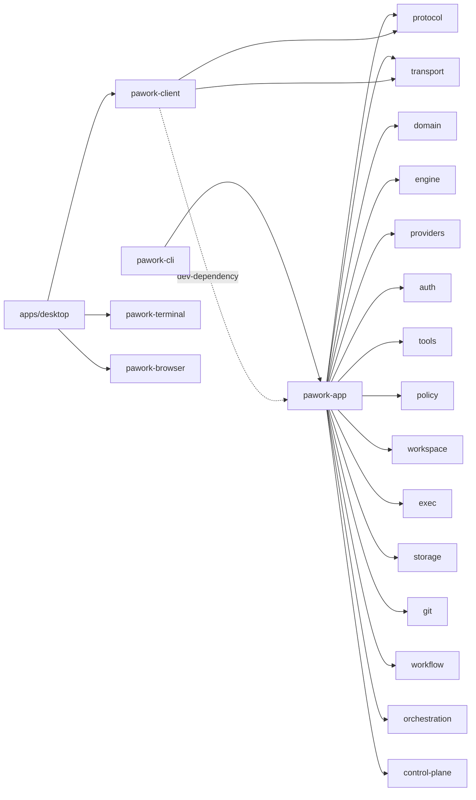

# pawork-app Review
> 应用装配门面（assembly host）：把 15 个上游 `pawork-*` crate 焊成 `AppCore`，并实现 GUI Connection Protocol 的宿主侧（`gui_server` + `GuiHostAdapter`）。70 个 `.rs` 文件 / 35,860 行（src 64 = 32,026 + tests 5 = 2,925 + examples 1 = 909）；主模块 `app_core`、`provider_assembly`、`services/`、`gui_host/`、`gui_server/`。静态分发 15 个 query / 36 个 command wire 名（49 个宏生成包装函数 + 2 个 direct 手写入口），与 protocol registry `gui.available` 51 条双射。

## 1. 职责与边界

本包处于库依赖图顶端，是 Core 的唯一正式装配层。生产上只被 `pawork-cli` 消费（`pawork` 二进制经 cli 间接使用）；`pawork-client` 仅以 dev-dependency 引用本包做集成测试（方向：client dev-depends app，app 不依赖 client）。Desktop 进程禁止依赖本包，只能经 protocol + transport 连 CLI。

做什么：

1. **装配 `AppCore`**：配置发现（Builtin → Global → Workspace → CLI 覆盖）、凭证链（auth 文件 → env）、协议中立 provider、八个内建工具 + MCP + 聊天控制工具（terminal / browser）、session / checkpoint / artifact / protected 存储、usage/quota/audit 控制面。
2. **承载一次 run**：`chat_turn` → `pawork_engine::run_session`，事件 persist-first 落库再渲染；审批、压缩、写前 checkpoint 由 `SessionLoopCtx` 桥进 engine loop。
3. **实现 GUI 宿主**：`gui_server` 管连接/心跳/订阅/resume 帧循环；`gui_host` 实现 `GuiHost` trait，静态分发表、幂等、timeline 投影、事件总线。
4. **CLI 领域门面**：auth/OAuth（含 UI-6b 命名账号）、模型目录与切换、Go 账号三窗 quota（`provider_quota.rs`）、diff/checkpoint/rollback、MCP、compat import、tasks、plan gate、usage 报表、S11 多 Agent demo。
5. **GUI 1.19 文件面板**：`workspace_files` / `workspace_file_read` / `workspace_file_write` 本机 GUI 手动文件操作（正文不进命令账本）。

不做什么：不定义 wire 契约（帧形状、`AppCommand`/`AppQuery`/`AppEvent`、timeline 投影规则全在 `pawork-protocol`）；不实现 Provider 协议、工具本体、SQLite、Policy 判定；不做终端/GUI 渲染。`services/` 与 `CatalogOnlyProvider` 均非公开 API。

### Spec 与源码差异（以源码为准）

- Spec 写「全包约 2 万行，src/ 58 个 `.rs`，tests/ 4 个」；实测 **35,860 行 / 70 个 `.rs`**（src 64，含 `gui_host/tests/` 8 个；`tests/` 5 个；`examples/ui_fixture.rs` 1 个）。
- Spec 若干行数偏旧：`app_core.rs` ~1790 vs 2082；`provider_assembly.rs` ~1250 vs 1714；`services/session.rs` ~730 vs 1204；`gui_host/mod.rs` ~950 vs 1184；`auth.rs` ~440 vs 656；`gui_host/events.rs` ~190 vs 271；`handlers/run_start.rs` ~290 vs 401；`settings/catalog.rs` ~620 vs 703；`gui_server/session.rs` ~1000 vs 1041；`gui_host/tests/` ~4000 vs 6291（7 → 8 个文件，缺 `chat_controls.rs`）；`tests/gui_server/session.rs` ~1000 vs 1348。
- Spec §5 写「`let _` 非测试归零（当前全包仅 3 处且都在 `cfg(test)`）」；实测生产代码 **4 处**：`provider_quota.rs:86-87`（URL 凭证脱敏）、`browser_tool.rs:88`（oneshot 发送）、`files.rs:208`（失败清理临时文件），均属良性 best-effort，但契约文本已过期。
- Spec / `lib.rs` crate 文档仍写「六通道正式装配」；`FIRST_PARTY_CHANNELS` 从 providers `CHANNEL_REGISTRY` 派生 **八条**。内嵌测试名 `models_overview_aggregates_six_channels`（`provider_assembly.rs:1171`）也过期。
- Spec 写 `AppError`「30+ 变体」；源码 **46 个变体**（「30+」未失效但不精确）。
- 多个 wire 名映射到同一 handler 函数是有意设计（handler 内按 `AppCommand` 变体再分派，如 `auth_account_select`/`set_selection_mode`/`rename` 复用 `command_auth_remove`）。
- `workspace_list` query 与 snapshot `Workspaces` 段都用 `workspace_trusted_for_roots` 按各 workspace 自身 root 逐项判定信任（`handlers/query.rs:22`、`app_core.rs:1171`），两入口语义一致。
- `gui_server/session.rs` 的 `host_stamp_command` / `host_stamp_query`（:421-436）一律盖 `CommandSource::LocalGui`，不区分 `ConnectionLocality`。幂等 scope 因此总是 client_id，远程 GUI 也走同一列。
- `provider_quota.rs:62` 以 provider 名称字符串特判（`!= "opencode-go"`）门账号 quota；ADR-060 已文档化，红线仅约束 Engine，但属名称分支形态。

改动时保持：wire 契约在 protocol 不在本包；分发表与 `gui.available` 双射；persist-first；明文 Secret 不进 `AppError` / 日志 / 事件；Desktop 不依赖本包；断连不取消 Run。

## 2. 依赖关系

| 方向 | crate | 用途 |
| --- | --- | --- |
| 依赖 | pawork-domain | 信封、ID、`ModelProvider`/`AgentTool` trait、Degrade、凭证类型 |
| 依赖 | pawork-engine | `run_session` / `LoopContext` / compaction / `HeuristicEstimator` |
| 依赖 | pawork-providers | 八通道 features 全开：适配器、`CHANNEL_REGISTRY`、builtin 目录、Go usage 读取 |
| 依赖 | pawork-auth | SecretBackend、API key / OAuth store（含命名账号）、PKCE / Device Flow、刷新 |
| 依赖 | pawork-tools | 八个内建工具、`ToolScheduler`、MCP client / registry |
| 依赖 | pawork-policy | `ApprovalMode`、`PolicyEngine`、RiskLevel、`resolve_workspace_path` |
| 依赖 | pawork-workspace | 配置发现、WorkspaceService、file-index、资源注入、compat import |
| 依赖 | pawork-exec | `PtyService`（GUI 终端 + 聊天 terminal 工具） |
| 依赖 | pawork-storage | SessionStore（compaction）、CheckpointService、ArtifactStore、ProtectedBlobStore、CommandLedger |
| 依赖 | pawork-git | 会话 diff、`git_status_note` |
| 依赖 | pawork-workflow | PlanService / TaskManager |
| 依赖 | pawork-orchestration | S11 demo 的 `AgentSupervisor`（`default-features = false`） |
| 依赖 | pawork-control-plane | usage ledger / quota / audit |
| 依赖 | pawork-protocol | GUI 帧、`AppCommand`/`AppQuery`/`AppEvent`、Handshake、timeline 投影、quota 视图类型 |
| 依赖 | pawork-transport | `GuiTransportServer` / 连接抽象（生产不开 local/memory） |
| 被依赖（生产） | pawork-cli | `pawork` 二进制唯一正式宿主：装配 `AppCore`、绑 `GuiServer` |
| 被依赖（dev） | pawork-client | client 的 dev-dependency（`crates/client/Cargo.toml`），GUI 连接侧集成测试；app 不依赖 client |
| 禁止依赖 | apps/desktop | 架构红线：只经 protocol + transport 连 CLI（desktop 仅依赖 client / terminal / browser） |

| 外部 crate | 用途 |
| --- | --- |
| tokio（macros / rt-multi-thread / fs / sync / time） | 装配、GUI 会话任务、幂等等待、OAuth 超时 |
| reqwest | OAuth / API key 验证 / 命名补全 / Go quota HTTP；`redirect(Policy::none())` |
| toml | 配置写回（Settings / MCP / proxy） |
| blake3 | protected `master.key` 派生 AEAD key、文件面板 revision 哈希 |
| getrandom | 创建 `master.key` |
| tracing | degrade / 装配告警；测试用 `RecordingCapture` |
| serde / serde_json | Settings Data、幂等缓存、snapshot JSON |
| async-trait | `GuiHost` / `ApprovalPromptHost` / `LoopContext` |
| futures | 工具并发 `join_all` |
| thiserror | `AppError` |

feature 门：`default = []`；`ui-fixture` 编译 `devfixture` + example + 对应集成测试；`live-smoke` 编译真实 API 冒烟。providers / storage 的 features 由本包 Cargo.toml 固定开启，不随本包 feature 切换。

dev-dependencies：`pawork-testkit`、`pawork-transport`（local + memory）、wiremock、tempfile（另有 domain / engine / providers / storage 的 dev 重声明以开测试 feature）。

## 3. 文件清单

路径相对 `crates/app/`。

| 相对路径 | 行数 | 职责 |
|---|---:|---|
| src/lib.rs | 81 | 模块声明与 crate 根 re-export；唯一 `pub mod` 是 `gui_server`（`devfixture` 为 hidden pub mod） |
| src/app_core.rs | 2,082 | `AppLoadOptions`、`AppError`（46 变体）、`CatalogOnlyProvider`、`AppCore` 装配与门面、`RoleModelKind` |
| src/provider_assembly.rs | 1,714 | provider 装配单点：通道→协议、凭证链、切换、目录聚合、自动标题、`provider_proxy`、账号 CAS 选择 |
| src/provider_quota.rs | 331 | UI-6b G2：Go 指定账号三窗 Percent 查询、30s 新鲜度、auth revision 复核（ADR-060） |
| src/gui_host/mod.rs | 1,184 | `GuiHostAdapter`：snapshot/timeline/query/command、静态分发表（15 query / 36 command）、幂等 wrap、49 个包装函数 |
| src/gui_host/bus.rs | 330 | `GuiEventBus` / `GuiBroadcastSink` / `GuiRunRegistry`；合成序号 `2^60` |
| src/gui_host/events.rs | 271 | `AgentEvent`→`AppEvent` 投影；幂等 client scope |
| src/gui_host/auto_title.rs | 127 | ADR-054 成功 run 后自动标题（不阻塞终态） |
| src/gui_host/terminal_tool.rs | 753 | Agent-facing 聊天 terminal 工具：共用 GUI PtyService 与注册表，list/create/read/write/interrupt/close |
| src/gui_host/browser_tool.rs | 326 | 聊天 browser 工具：`BrowserBroker` 请求绑定 run+客户端、一次领取、25s 超时回收 |
| src/gui_host/handlers/mod.rs | 9 | handler 子模块声明 |
| src/gui_host/handlers/query.rs | 274 | query 入口：workspace/session/model/run/diff/quota/mcp（含 workspace_files/read） |
| src/gui_host/handlers/command.rs | 45 | `workspace_add` / `run_cancel` |
| src/gui_host/handlers/session.rs | 225 | SessionCreate/Open/Fork/Rename/Archive |
| src/gui_host/handlers/run_start.rs | 401 | RunStart：切换、stale 重装配、`@` 展开、terminal/browser 工具注册、登记、spawn、无终态收口 |
| src/gui_host/handlers/approval.rs | 92 | ToolApprove 三态（Live / durable seal / queued） |
| src/gui_host/handlers/terminal.rs | 601 | TerminalCreate/Write/Resize/Close + Policy 闸 |
| src/gui_host/handlers/mcp.rs | 154 | `mcp_test` / `mcp_server_remove` |
| src/gui_host/handlers/files.rs | 336 | GUI 1.19 文件面板：目录 / 读取 / 带版本校验保存；正文不进账本；`SAVE_LOCK` 全局串行 |
| src/gui_host/handlers/settings/mod.rs | 151 | Settings 门面、`AuthFlight` 单飞守卫 |
| src/gui_host/handlers/settings/auth.rs | 504 | auth_set_api_key / auth_start / auth_cancel / auth_remove（承接 account select/mode/rename） |
| src/gui_host/handlers/settings/catalog.rs | 703 | provider_auth_status、默认模型/角色、禁用、use_proxy（写锁复核；禁用按盘面合并） |
| src/gui_host/handlers/settings/general.rs | 65 | general_settings / set_proxy_url |
| src/gui_host/handlers/settings/permissions.rs | 107 | permissions_settings / set_approval_mode / workspace_trust |
| src/gui_host/handlers/settings/terminal.rs | 102 | terminal_settings / set_terminal_settings |
| src/gui_host/tests/mod.rs | 379 | 分发表双射、timeline 分页、ModelList、bus |
| src/gui_host/tests/run.rs | 1,254 | RunStart / 自动标题 / 合成终态 / 禁用模型 |
| src/gui_host/tests/session.rs | 297 | snapshot / SessionCreate / Fork / Rename / Archive |
| src/gui_host/tests/approval.rs | 462 | ToolApprove 三态与重启后 pending 重建 |
| src/gui_host/tests/idempotency.rs | 592 | CommandLedger 幂等、InFlight、record 失败 |
| src/gui_host/tests/settings.rs | 2,966 | SET-2/4/5/6 + UI-6b 命名账号主路径、stale 重装配、fail-closed |
| src/gui_host/tests/terminal.rs | 147 | terminal_close / 自然退出广播 |
| src/gui_host/tests/chat_controls.rs | 194 | computer 工具审批前零调用 / 图片持久化 / 恢复不重执行 |
| src/gui_server/mod.rs | 181 | `GuiHost` trait、`GuiServer` bind/accept |
| src/gui_server/connection.rs | 552 | `ConnectionManager`：心跳 30s、队列 1024、lagged |
| src/gui_server/session.rs | 1,041 | 单连接握手与帧循环、Resume 三态、capability 门 |
| src/services/mod.rs | 9 | 七个领域服务模块声明 |
| src/services/session.rs | 1,204 | 会话生命周期、resume 分叉、启动清扫 |
| src/services/run.rs | 815 | `chat_turn` persist-first、compact、append_payload、账号 CAS 选择 |
| src/services/approval.rs | 699 | 审批模式/信任/宿主；写工具审批集成测试 |
| src/services/extension.rs | 658 | workspace / file-index / `@` 展开 / 注入层 / MCP slot |
| src/services/usage.rs | 402 | 预算预检、ledger 落账、overview |
| src/services/import.rs | 319 | 本机扫描、compat 两段式、export/import |
| src/services/tasks.rs | 262 | TaskManager + `tasks.json` 原子写 |
| src/idempotency.rs | 677 | `IdempotencyStore`：SQLite CAS + 进程内 Notify |
| src/hub.rs | 421 | `EventHub` 全局序 + ring 4096 + broadcast |
| src/approval.rs | 578 | `ApprovalPromptHost` / `GuiApprovalHost` / 写工具预览 |
| src/loop_ctx.rs | 472 | `SessionLoopCtx` 实现 engine `LoopContext` |
| src/auth.rs | 656 | auth_status / set-key / logout / OAuth 编排 / 命名账号选择 |
| src/protected.rs | 609 | `FileKeyResolver` / `SwappableReasoningProtector` |
| src/extensions.rs | 634 | 内建工具、MCP 装配、`at_tokens`、64 KiB 附件 |
| src/channels.rs | 231 | 八通道 facade + `oauth_override` |
| src/protocol.rs | 141 | `AdapterProtocol` 解析（extra → 默认表 → ChatCompletions） |
| src/diff.rs | 414 | 会话累计 diff（git 过滤 / 快照回退） |
| src/checkpoint.rs | 339 | 写前快照、列表、rollback |
| src/control.rs | 366 | `ControlPlaneRuntime` + usage 报表行 |
| src/data_dir.rs | 296 | 数据目录、instance 白名单、各实例路径 |
| src/import_host.rs | 314 | compat 导入宿主包装、指纹防 TOCTOU |
| src/plan_host.rs | 232 | Plan CRUD + fail-closed 执行闸 |
| src/orchestration_host.rs | 206 | S11 多 Agent demo（非通用 API） |
| src/tasks_host.rs | 94 | tasks 门面 + `parse_task_kind` |
| src/persist.rs | 24 | `PersistThenRender` |
| src/devfixture.rs | 1,475 | `ui-fixture` 种子器（`#[doc(hidden)]`） |
| src/testsupport.rs | 445 | 仅 `cfg(test)`：mock core、`RecordingCapture` |
| tests/gui_server/session.rs | 1,348 | 具名 bin：握手/resume/心跳/capability/慢账号 quota |
| tests/gui_server/multi_gui_runtime.rs | 843 | 具名 bin：多 GUI 一致性、断连不取消 |
| tests/timeline_projection_host.rs | 197 | host timeline 与 protocol golden 对拍 |
| tests/ui_fixture_projection.rs | 425 | `ui-fixture`：seed → snapshot/timeline |
| tests/smoke.rs | 112 | `live-smoke` + `--ignored` 真实 API 冒烟 |
| examples/ui_fixture.rs | 909 | fixture CLI：seed / serve / self-check / snapshot-dump |

## 4. 类型与方法功能列表

### 4.1 lib.rs

唯一 `pub mod` 是 `gui_server`。`gui_host` 与 `services` 目录私有，公开类型经 crate 根 re-export。`devfixture` 仅 `cfg(any(test, feature = "ui-fixture"))` + `#[doc(hidden)]`；`testsupport` 仅 `cfg(test)`。crate 文档仍写「六通道」，与源码八通道不一致。

| 名称 | 种类 | 功能 / 语义 |
|---|---|---|
| `gui_server` | pub mod | 连接层：`GuiHost` trait、`GuiServer`、`ConnectionManager` |
| `devfixture` | pub mod（hidden） | UI fixture 种子器；默认 feature 关闭，不进生产闭包 |
| `session_title_from_text` | fn | 从首条用户文本派生会话标题（截断到 72，空则 `New session`） |
| `AppCore` / `AppError` / `AppLoadOptions` | re-export | 装配门面 |
| `ApprovalAsk` / `ApprovalPromptHost` / `GuiApprovalHost` / `DenyAllApprovals` / `PendingToolApproval` / `ApprovalResolve` / `parse_approval_mode` | re-export | 审批宿主家族 |
| `AuthChannelStatus` / `AuthSource` / `OAuthLogin` | re-export | 凭证状态与 OAuth 登录态 |
| `FIRST_PARTY_CHANNELS` / `first_party_channel` / `is_first_party` / `ChannelKind` / `FirstPartyChannel` | re-export | 八通道 facade（`ChannelKind` 来自 providers） |
| `CheckpointSummary` / `RollbackOutcome` | re-export | 检查点列表与回滚结果 |
| `LedgerTotals` / `QuotaWindowLine` / `SessionUsageLine` / `UsageOverview` | re-export | usage 报表行 |
| data_dir 家族 | re-export | 见 §4.8 |
| `paginate_diff` / `render_diff_file` / `render_session_diff` / `GitDiffHeader` / `SessionDiff` | re-export | 会话 diff |
| `AtAttachment` / `McpServerStatus` | re-export | `@` 附件与 MCP 状态 |
| `GuiHostAdapter` / `GuiEventBus` / `GuiBroadcastSink` / `GuiRunRegistry` / `project_timeline_item` | re-export | GUI 宿主适配 |
| `EventHub` / `HubError` / `HubSubscription` / `DEFAULT_HUB_CAPACITY` | re-export | 事件扇出 |
| `IdempotencyStore` 家族 | re-export | 命令幂等 |
| `CompatTool` / `SessionImportFormat` / `SessionImportOutcome` 等 | re-export | compat 导入 |
| `MultiAgentDemoOptions` / `MultiAgentDemoReport` | re-export | S11 demo |
| `PersistThenRender` | re-export | persist-first 组合子 |
| `AdapterProtocol` / `ProtocolError` | re-export | 适配器协议 |
| `parse_task_kind` / `review_status_label` | fn | tasks / plan 辅助 |
| 上游类型便捷 re-export | re-export | `ApprovalMode`/`RiskLevel`、`SessionRecord`/`SessionExport`/`EXPORT_SCHEMA_VERSION`、`PlanSnapshot`/`TaskSnapshot`、`DiffFile`/`DiffPage`、compat 扫描类型 |

改 re-export 会牵动 cli 全部 import。`unbound_workspace` 与 `RETAINED_MESSAGES` 仅 `pub(crate)`。

### 4.2 app_core.rs

| 名称 | 种类 | 功能 / 语义 |
|---|---|---|
| `AppLoadOptions` | struct | `workspace_root` / `provider` / `model` / `data_dir` / `approval_mode` / `trust_workspaces` / `approval_host` / `auth_backend` / `instance`。`trust_workspaces` 仅可信宿主显式覆盖本进程，不写回配置。Debug 不打印宿主/后端本体 |
| `AppError` | enum | 46 变体，明文 key 不得进任何变体。透传：Config/Auth/Provider/Engine/Session/Io/Workspace/Tools/Protocol/Checkpoint/Artifact/Git/ProtectedBlob/Mcp/Resources/Compat/FileIndex。本包语义：MissingDefaultProvider/MissingDefaultModel/UnknownProvider/MissingBaseUrl/MissingCredential/OAuthLoginRequired/OAuthLogin/UnknownModel/ModelDisabled/ModelBelongsToProvider/StoreNotOpen/SessionNotFound/SessionWorkspaceUnassigned/WorkspaceUnavailable/AmbiguousSession/EmptyTurn/ApprovalMode/InvalidProxy/InvalidInstance/CheckpointStoreNotOpen/CheckpointNotFound/AmbiguousCheckpoint/Protected/Import/PlanNotApproved/Plan/ControlPlane/Task/Orchestration |
| `RoleModelKind` | pub(crate) enum | Conversation / Naming / Vision / Search。`ALL` 固定序；`from_wire` 未知 → None（宿主 `unknown_role`）；Conversation 复用 default_provider/default_model |
| `RETAINED_MESSAGES` | pub(crate) const | `4`；压缩时 session 侧按 `/2` 轮对齐 |
| `PLACEHOLDER_SESSION_TITLE` | pub(crate) const | `"New session"`；自动标题只在此占位名上写回 |
| `CatalogOnlyProvider` | 私有 struct | 缺凭证占位：`list_models` 空；`stream` 报 `ProviderErrorKind::Authentication`。`load_for_catalog` 专用 |
| `AppCore` | struct | 字段全 `pub(crate)` 或私有。持有 provider/credential/model/config/backend/http/registry/heuristic/session_estimator/adapter_protocol/store/scheduler/tool_defs/descriptors、七个 services、checkpoints/artifacts/protected、发号原子（next_request/next_run/next_session/next_message/next_workspace，实例级）、provider_pending/provider_stale、trust_override。Debug 筛选，不含凭证本体 |
| `SessionTokenEstimatorBridge` | 私有 struct | 把 engine `HeuristicEstimator` 桥到 storage 窄口 `TokenEstimator` |
| `unbound_workspace` | pub(crate) fn | 构造 `ws-unbound` 哨兵 Workspace |

`AppCore` 装配入口：`load`（缺凭证 fail-closed）/ `load_for_catalog`（退 CatalogOnlyProvider）/ `load_from` / `from_config` / `from_resolved`（内部 block_on，不得在 runtime 线程调）/ `from_parts` / `from_parts_with_protocol`（HTTP 用 `pawork_auth::http_client()`）；`http_from_config` / `http_with_proxy`（`redirect(Policy::none())`，非法 URL 文案不含原文）；`configure_approval`（Arc-swap scheduler）/ `set_approval_host`；`attach_workspace` / `register_workspace`（持久幂等）/ `open_store`（末尾 `seal_interrupted_runs`）/ `open_checkpoints` / `open_control_plane` / `open_protected` / `prime_extensions` / `shutdown`（消费 self）。

只读与会话门面（多转发 `services/`）：provider_id/model/adapter_protocol/config/auth_backend/store/provider_pending/workspace_*/registered_workspaces/approval_mode/tool_names/turn_context；create_session 三形态/rename/archive/list/get/resolve/next_sequence；resume_messages（CLI seal Denied）与 resume_messages_keep_pending（GUI 保留）；chat_turn/chat_turn_with_run_id；compact_session；session_diff/list_checkpoints/rollback；usage 四件套。`workspace_trusted()`（全局 attached，:1316）与 `workspace_trusted_for_roots(&roots)`（逐项目，:1171）并存——全局 attached 供 approval 快照 / scheduler 等进程级判定,逐 root 供 workspace_list / snapshot 列表项。

内存写口（Settings handler 写盘成功后调用，进行中 run 不变）：set_default_model_pair/set_proxy_url/set_provider_use_proxy/set_provider_disabled_models/set_role_model_pair/set_terminal_settings/set_approval_mode/set_workspace_trusted。`provider_needs_rebuild` = pending 或 stale。`bind_session_workspace` 仅内存，给 devfixture。

### 4.3 `provider_assembly.rs` + `provider_quota.rs`

Host 装配层唯一的 Provider 选择点。Engine 只看 `ModelProvider` trait，不读本模块。

| 名称 | 种类 | 功能 / 语义 |
|---|---|---|
| `is_credential_pending` | pub(crate) fn | 仅 MissingCredential / OAuthLoginRequired / OAuthLogin / Auth 视为目录可容忍 |
| `provider_models` | pub fn | 当前 provider 在 registry 的静态目录 |
| `switch_model` | pub async fn | ADR-055 目标禁用 → `ModelDisabled`。落 `Diagnostic{model.switched}` |
| `switch_provider` | pub async fn | 重建 adapter；成功清 pending/stale 并 `rebind_persistent_protector` |
| `generate_session_title` | pub(crate) fn | 不借用 Core 的 Future。20s 总超时、64 output tokens、无工具 |
| `model_catalog` / `models_overview` | pub async fn | 探测 4s timeout；overview 按 (provider, model) 去重保同名 |
| `resolve_provider_model` | pub(crate) async fn | 静态命中→惰性合并；跨 provider → `ModelBelongsToProvider` |
| `provider_proxy` / `provider_http` | pub(crate) fn | Global proxy_url 生效，仅该 provider `use_proxy=false` 绕过；不按 id 特判 |
| `channel_protocol` | pub(crate) fn | ChatGptOAuth/XaiOAuth → Responses；ApiKey/KimiOAuth → ChatCompletions |
| `assemble_registry` / `assemble_provider` | pub(crate) fn | 唯一装配入口；refresh_oauth 走 provider_http |
| `select_account_for_run` | pub(crate) async fn | UI-6b G2：Run 前经 provider_quota 新鲜三窗 + 原子 CAS 选账号，写持久 Diagnostic |
| `oauth_refresh_endpoint` | pub(crate) fn | `[oauth.<id>].token_url` 覆盖 → 通道 preset |
| `account_quota`（provider_quota.rs） | pub(crate) async fn | 指定存储账号 + `provider_proxy` 代理 + 三窗官方读数转 Percent `QuotaOverviewView`；URL 展示前剥 username/password；复核 auth revision 拒绝迟到快照。`:62` 以 `!= "opencode-go"` 名称门通道（ADR-060 文档化） |
| `is_account_query`（provider_quota.rs） | pub(crate) fn | credential_id 存在或 Percent 单位；query 侧对 minor<16 显式拒绝 |

### 4.4 `protocol.rs` / `channels.rs` / `persist.rs`

`AdapterProtocol` 三态；`resolve_adapter_protocol` extra → 默认表 → ChatCompletions，fail-closed（不认 `responses` 字符串）。`FIRST_PARTY_CHANNELS` 从 `CHANNEL_REGISTRY` 派生八条；`api_key_channel` / `oauth_override`（Device 优先于 PKCE）。`PersistThenRender` 先 `append_event(active branch)` 再 render，失败 `EngineError::sink`。

### 4.5 `services/`

`mod.rs` 声明七个 `pub(crate) mod`。服务均非公开 API，由 `AppCore` 转发。

SessionService（session.rs，1,204 行）：绑定缓存启动原子替换；create_session 三形态（id 形态 `ses-<unix_ms>-<n>`，实例计数器）；rename/archive；resume_messages（CLI seal Denied）与 resume_messages_keep_pending（GUI 保留）；`seal_interrupted_runs`（running → 封 tool，waiting 除外 + RunFailed，幂等）；`resolve_waiting_tool_call` durable seal；next_sequence / resolve_session。

RunService（run.rs，815 行）：`run_request_id` 产 **`req-<pid_hex>-<nanos_hex>-<n>`（进程级 static 计数器）**——usage 账本 (tenant, account, request_id, attempt) 去重键，带跨重启回归测试（:401）；append_payload persist-first；chat_turn / chat_turn_with_run_id（Plan gate → file-index → git_status_note → UI-6b CAS 选账号 → PersistThenRender → SessionLoopCtx → tasks → run_session → usage 落账）；compact_session（request id `req-compact-<n>`，实例计数器，事件流身份）。

ApprovalService / ExtensionService / UsageService / ImportService / TaskService 同前版要点：审批模式/信任/宿主装配与快照；workspace roots / `@` 展开（64 KiB 文本、8 MiB 图片）/ 注入层 / MCP slot；预算预检与 ledger（`record_id=rec-<run_id>` 哨兵）；compat 两段式 + TOCTOU 指纹；TaskManager + tasks.json 原子写。

### 4.6 `loop_ctx.rs` / `approval.rs` / `checkpoint.rs`

`SessionLoopCtx` 实现 engine `LoopContext`；`next_request_id` 产 `req-<n>`（实例计数器，engine 事件流身份，非账本键）。`execute_tools` join_all 并发上限 8，terminal/browser 等 `supports_concurrency=false` 拆出串行。`request_approval` 先 emit `ToolApprovalRequested` 再 decide。`compact_history` 无 store → Ok(None)，失败显式上抛。`GuiApprovalHost` pending/queued 单锁，关窗不断 oneshot。`preview_for_tool` / `relative_path_from_input` 写工具预览。`WRITE_TOOLS` 写前快照失败发诊断但写入继续。`perform_rollback` 经 CheckpointService restore，绝不 `git reset --hard`。

### 4.7 `hub.rs` / `idempotency.rs` / `protected.rs`

| 名称 | 种类 | 功能 / 语义 |
|---|---|---|
| `EventHub` | pub struct | AtomicU64 全局序（首条 1）+ ring 4096 + broadcast；`publish_with_envelope` 重写 global_sequence，ring 与 broadcast 各 clone 一份 |
| `replay` | pub fn | 越界 → `ReplayUnavailable`；禁止 seq-0 旁路 |
| `IdempotencyStore` | pub struct | SQLite CommandLedger 权威 CAS + 内存 Notify；scope=client_id |
| `check` | pub async fn | InFlight waiter 按调用方 command_id 注册（同键不同 command_id 不挂死） |
| `record` / `release` | pub async fn | 失败 bump_record_failure 且调用方必须 release |
| `should_cache` | pub fn | Error 响应不缓存 |
| `FileKeyResolver` / `SwappableReasoningProtector` | pub struct | master.key 32B/0600/拒 symlink；instance 级 `instance-reasoning` scope（已接受偏差） |

### 4.8 `auth.rs` / `extensions.rs` / `data_dir.rs` / `control.rs` / `diff.rs`

同前版要点：`auth_status` 八通道只报来源；`auth_set_key` 不删 OAuth、logout 双类幂等清理；OAuth 走 `provider_http`；UI-6b `effective_provider_account` 统一选择与通道 kind 校验。内建八工具 + MCP（stdio 沙箱、untrusted 拒 auto-start、secret `pawork.mcp.*`）；data_dir 解析链与 instance 白名单；ADR-038 usage 哨兵；git diff 过滤 / 快照回退。

### 4.9 `plan_host.rs` / `import_host.rs` / `orchestration_host.rs` / `tasks_host.rs`

同前版要点：Plan CRUD + `ensure_plan_allows_execution`（重放失败原样上抛，禁止 fail-open）；compat 导入两段式 + 指纹防 TOCTOU；S11 demo 固定样例；tasks 门面 + `tasks.json` 原子写。

### 4.10 `gui_server/`

本包唯一 `pub mod`。bind → accept 派生连接任务 → 握手 → 登记 `ConnectionManager` → Snapshot → 帧循环。

| 名称 | 种类 | 功能 / 语义 |
|---|---|---|
| `GuiHost` | pub trait | instance_id / snapshot / timeline / query / command / subscribe_events；default 心跳/replay 辅助 |
| `GuiServer` / `GuiServerConfig` | pub | accept 分配 `client-{n}`/`connection-{n}` 后 spawn |
| `DEFAULT_HEARTBEAT_TIMEOUT` | pub const | 30s（connection.rs:25）；任意入站帧刷新 |
| `DEFAULT_QUEUE_CAPACITY` | pub const | 1024（connection.rs:27）；满则丢新标 lagged，不阻塞发布者 |
| `ConnectionManager` | pub struct | register/unregister/heartbeat/ack/subscribe/enqueue；断连只 unregister 不取消 Run |
| `host_stamp_command` / `host_stamp_query` | 私有 fn | 一律 `CommandSource::LocalGui` + LocalUser，不看 `ConnectionLocality`（:421-436） |
| `gui_channel_gate` | 私有 fn | registry `gui.available=false` 或缺 capability → PermissionDenied，进宿主前拒绝 |
| `handle_resume` | 私有 fn | last==0 → Ack；Replay / SnapshotRequired / UpToDate；能力过滤后空窗报 UpToDate |
| `deliverable_to_negotiated` | 私有 fn | `TerminalExited` 仅推协商 minor≥1.3 连接 |
| `host_error_to_protocol` | 私有 fn | not_found→RequestNotFound；busy→Busy；一组 ValidationFailed；其余 Internal |

### 4.11 `gui_host/` 适配

| 名称 | 种类 | 功能 / 语义 |
|---|---|---|
| `GuiHostAdapter` | pub struct | core: Arc<RwLock<AppCore>>、bus、runs、approvals、IdempotencyStore waiters、PtyService、terminals 映射、auth_flights；`new` 要求独占 Core |
| `host_error` / `app_error` / `session_error` | pub(crate) fn | UnknownModel/ModelBelongsToProvider→unknown_model；ModelDisabled→model_disabled；NotFound→not_found 等 |
| `persist_command_response` | pub(crate) async fn | should_cache 则 record；DB 类失败幂等重试一次再 release |
| `QUERY_HANDLERS` | static | **15 项**（`gui_query_dispatch!` 宏展开生成） |
| `COMMAND_HANDLERS` | static | **36 项**（`gui_command_dispatch!` 宏展开生成） |
| 包装函数层 | 宏 ×3 | 2026-09-18 R-01 已宏化：`query_forward!` + `gui_query_dispatch!` / `gui_command_dispatch!`（mod.rs:743-778）同时产出 `Box::pin` 包装函数与表项，一行登记一个 wire 入口；新增 GUI 入口从改 3 处收敛为 2 处（handler + 一行登记） |
| `SYNTHETIC_SEQUENCE_BASE` | pub(crate) const | `1 << 60`（bus.rs） |
| `GuiEventBus` / `GuiBroadcastSink` / `GuiRunRegistry` | pub struct | 全局序 + 终态登记去重 + cancel token 登记 |
| `client_scope_from_source` | pub(crate) fn | LocalGui/RemoteGui → client_id；Automation → automation |
| `auto_title_after_successful_run` | pub(crate) async fn | 网络不持 Core 写锁；`rename_session_if_title` 原子校验占位名 |
| `TerminalTool`（terminal_tool.rs） | pub(super) struct | Agent-facing 聊天工具，共用 GUI PtyService/注册表/forwarder；校验 workspace 归属与相对 cwd；write 返回当时输出 |
| `BrowserBroker` / `BrowserTool`（browser_tool.rs） | pub(super) struct | 请求绑定 run+发起客户端；`browser_next` 一次领取、`browser_respond` 核对领取者；取消或 25s 超时回收；历史重放不执行动作 |

`GuiHost` 实现要点：

- **snapshot**：Workspaces（`workspace_trusted_for_roots` 逐 root）、SessionTree、ActiveRuns、PendingToolApprovals、TerminalSessions、ProviderStatus。
- **timeline**：limit 默认 200 clamp 1..=500；读 active branch lineage；游标按持久化信封推进（跨不可投影事件）。
- **query**：查表前对 minor<16 的账号 quota 查询显式拒绝（`unsupported`）；SessionGet <1.14 降级 `timeline_page`；ProviderAuthStatus <1.16 字段过滤。不支持文案残留「S7 wave A slice」（:533）。
- **command**：幂等三态（Replay 返回缓存 / InFlight 50ms 有界等待回 loop 重查 CAS / New 执行）；dispatch 失败 release；Error 响应不缓存。

QUERY 15：`workspace_files` `workspace_file_read` `workspace_list` `session_get` `run_status` `model_list` `diff_list_files` `diff_get` `quota_overview` `mcp_list` `provider_auth_status` `general_settings` `permissions_settings` `terminal_settings` `browser_next`。

COMMAND 36：`workspace_file_write` `workspace_add` `workspace_trust` `session_create` `session_open` `session_fork` `session_rename` `session_archive` `run_start` `run_cancel` `auth_start` `auth_remove` `auth_set_api_key` `auth_account_add_api_key` `auth_account_start` `auth_account_select` `auth_account_remove` `auth_account_set_selection_mode` `auth_account_rename` `auth_cancel` `set_default_model` `set_proxy_url` `set_provider_use_proxy` `set_model_enabled` `set_provider_models_enabled` `set_default_role_model` `set_approval_mode` `set_terminal_settings` `tool_approve` `terminal_create` `terminal_write` `terminal_resize` `terminal_close` `mcp_test` `mcp_server_remove` `browser_respond`。

改动注意：增删必须同步 protocol registry `gui.available`（当前 51 条 = 15+36，`dispatch_tables_match_gui_available_registry_entries` 钉死）。合成终态不得用 seq=0。

### 4.12 handlers

| 文件 | 入口 | 功能 / 语义 |
|---|---|---|
| `handlers/query.rs` | `workspace_list` | 按 `workspace_trusted_for_roots` 逐 root 判定（:22），与 snapshot 一致 |
| | `workspace_files` / `workspace_file_read` | 文件面板目录/读取；要求 minor≥19 且 LocalGui |
| | `session_get` / `run_status` / `model_list` / `diff_*` / `quota_overview` / `mcp_list` | 同前版 |
| `handlers/command.rs` | `workspace_add` / `run_cancel` | 持久幂等登记；registry 取 token cancel |
| `handlers/session.rs` | session 五入口 | 同前版；rename/archive 广播 SessionMetaChanged |
| `handlers/run_start.rs` | `run_start` | 显式切换 → stale/pending 重装配 → 禁用闸 → `@` 展开 → terminal/browser 工具注册（:272/:286）→ 登记 ActiveGuiRun → spawn；成功终态后 auto_title |
| | `seal_run_without_terminal` | 先 persist RunFailed 再广播；persist 失败才 `publish_raw`（≥2^60） |
| `handlers/approval.rs` | `tool_approve` | Live oneshot / 非 live durable seal / 无 waiting 保持 Queued |
| `handlers/terminal.rs` | terminal 四入口 | Policy 闸 + workspace cwd 严格解析；forwarder 是终态唯一广播点 |
| `handlers/files.rs` | `workspace_file_write` | blake3 revision 校验 → 临时文件（0600）→ rename；`SAVE_LOCK`（:22）全局串行所有连接的保存；失败清理临时文件 |
| `handlers/mcp.rs` | `mcp_test` / `mcp_server_remove` | 同前版 |
| `settings/auth.rs` | auth 家族 + account 六入口 | verify-then-replace 10s；OAuth 600s 可取消；单飞守卫；account select/mode/rename 复用 remove handler 内分派 |
| `settings/catalog.rs` | provider_auth_status / 模型偏好 | 同前版 + UI-6b credentials 逐条状态 |
| `settings/general.rs` / `permissions.rs` / `terminal.rs` | 各 Settings 入口 | 同前版 |

### 4.13 `devfixture.rs` / `testsupport.rs` / `examples/ui_fixture.rs`

同前版：fixture 种子器（引用/枚举/路径/时间锚点校验、preparing→ready marker、git 基线隔离）；`RecordingCapture` 双注册 Dispatch 钉 tracing interest；example 提供 seed / serve / self-check / snapshot-dump 四子命令。

## 5. 关键行为与契约

1. **GUI 协议装配**。分发表 `QUERY_HANDLERS`(15) / `COMMAND_HANDLERS`(36) 与 protocol `gui.available`（51 条）双射。capability 门在 `gui_server/session.rs` 进宿主之前拒绝。未支持命令结构化 fail-closed，不编造成功。
2. **心跳与连接**。`DEFAULT_HEARTBEAT_TIMEOUT=30s`；任意入站帧刷新。队列 1024，满则丢新事件、标 lagged、不阻塞其他 GUI。断连只 unregister，**不取消已进入 Core 的 Run**。
3. **Resume 三态**。越界或 hub ReplayUnavailable 不得伪造 seq-0 旁路，经 hub 真序列取信封并回 SnapshotRequired 或 ReplayUnavailable。能力过滤后空窗报 UpToDate。
4. **CommandLedger 幂等**。scope=client_id（盖戳一律 LocalGui）。InFlight waiter 按调用方 command_id 注册；50ms 轮询回 loop 重查 CAS。`record` 失败必须计数并 release；Error 响应不缓存。usage 账本 request_id 用 `req-<pid_hex>-<nanos_hex>-<n>` 进程级 static（跨重启回归钉住）；engine 事件流内的 `req-<n>`（loop_ctx）与 `req-compact-<n>` 是实例计数器身份，不作持久去重键。
5. **EventHub**。首条 seq=1，publish 重写 global_sequence，ring 4096。合成 wire 事件 stream_sequence ≥ 2^60。
6. **审批桥**。pending/queued 单锁；CLI resume seal Denied vs GUI keep pending；启动清扫 running→RunFailed、waiting 不封 tool；tool_approve 三态。
7. **Secret 注入点**。明文不进 AppError/日志/事件/ledger/auth_status；quota 展示 URL 前剥 username/password；`set_proxy_url` 错误不含原文；master.key Debug redacted。
8. **persist-first**。PersistThenRender 先 append_event(active branch) 再 render。Plan gate 重放失败禁止 fail-open。写前 checkpoint 失败发诊断但写入继续。rollback 绝不 `git reset --hard`。
9. **Provider 装配单点**。`assemble_provider` 唯一选择点；Engine 无 provider 名称分支；`Responses` 只硬编码 ChatGPT/xAI；ADR-055 禁用模型 fail-closed；凭证/use_proxy 变更置 provider_stale。UI-6b Run 前 CAS 选账号 + auth revision 复核，单 Run 持同一 adapter。
10. **文件面板（GUI 1.19）**。仅本机 GUI + minor≥19；目录最多 1,000 项 / 512 KiB JSON 预算；只读写已有 UTF-8 普通文件 ≤128 KiB 无 NUL；拒绝越界、符号链接（逐词法组件检查）、受保护路径（.git/.ssh/.aws/auth.json/mcp-auth.json/gui.token/.env*）；保存必须匹配 expected_revision，冲突保留磁盘文件；正文不进日志或命令账本（响应只带 path+revision）。
11. **聊天控制工具**。terminal/browser 要求可信工作区 + 显式审批；调用与结果走持久化 Agent 事件；PTY 无命令沙箱；browser 请求绑定 run+客户端、一次领取、25s 超时；历史重放不执行动作。
12. **信任模型两入口一致**。`workspace_list` 与 snapshot Workspaces 都用 `workspace_trusted_for_roots` 逐 root 判定；`workspace_trusted()` 全局 attached 值仅用于 approval 快照 / scheduler 等进程级场景。

## 6. 测试资产

共 **268** 个 `#[test]`/`#[tokio::test]`（rg 实测 src + tests）。不跑 cargo；下列为源码钉点，按文件聚合。

| 文件 | 条数 | 验证点 |
|---|---:|---|
| `src/gui_host/tests/mod.rs` | 6 | **分发表 ↔ gui.available 双射**；timeline 分页；ModelList；bus；lagged degrade |
| `src/gui_host/tests/idempotency.rs` | 7 | 重放无副作用；跨重启；record 失败计数；同 key 不同 command_id 不挂死；丢唤醒有界轮询 |
| `src/gui_host/tests/run.rs` | 19 | 自动标题；`@` 展开三态；禁用模型 fail-closed；合成终态去重 |
| `src/gui_host/tests/approval.rs` | 6 | Live 不 durable seal；非 live durable + ToolCompleted；重启 snapshot 重建 pending |
| `src/gui_host/tests/settings.rs` | 37 | SET-2/4/5/6 + UI-6b 命名账号：默认模型、proxy、禁用、角色、审批、terminal、auth 单飞、verify-then-replace、脱敏 |
| `src/gui_host/tests/session.rs` | 6 | snapshot 六节；Create unbound；rename/archive 广播；fork 切支 |
| `src/gui_host/tests/terminal.rs` | 2 | close 广播 killed；自然退出广播 exited |
| `src/gui_host/tests/chat_controls.rs` | 2 | computer 审批前零调用 / 图片持久化 / 恢复不重执行 |
| `src/gui_host/handlers/terminal.rs` | 7 | Policy 闸各模式；cwd 归一；payload 诚实 |
| `src/gui_host/handlers/files.rs` | 内嵌 | 目录/编辑/版本冲突；旧 minor 与非本机 GUI 拒绝；越界/symlink/受保护/二进制/超限拒绝 |
| `src/gui_host/events.rs` | 3 | degrade severity；hosted 搜索 live/历史一致 |
| `tests/gui_server/session.rs` | 17 | 握手/Snapshot；非握手首帧关闭；stamp；Resume 三态；心跳；**断连不取消 Run**；lagged；capability 先于宿主；慢账号 quota 心跳可用且断线丢弃 |
| `tests/gui_server/multi_gui_runtime.rs` | 6 | 三 GUI 同事件序；重连 replay；越界 snapshot；慢客户端隔离；断连/心跳超时不发 RunCancel |
| `tests/timeline_projection_host.rs` | 2 | 与 protocol golden 对拍；游标跨不可投影事件推进 |
| `tests/ui_fixture_projection.rs` | 1 | `ui-fixture` required-features |
| `tests/smoke.rs` | 1 | `live-smoke` required-features |
| `src/services/*`、`loop_ctx`、`checkpoint`、`control`、`protected`、`approval`、`extensions`、`provider_quota` | 内嵌 | resume seal 语义；压缩 lineage；usage 哨兵；审批模式；`@` 图片展开；quota 新鲜度与 revision 复核 |
| `src/provider_assembly.rs` | 14 | catalog 容忍缺凭证；overview 保留同名；OAuth 单飞刷新；未知协议 fail-closed；`run_request_id` 跨重启唯一（:401） |
| `src/hub.rs` / `idempotency.rs` / `data_dir.rs` / `protocol.rs` / `channels.rs` / `auth.rs` / `app_core.rs` / `protected.rs` / `plan_host.rs` / `devfixture.rs` / `testsupport.rs` | 内嵌 | 各自定向单测（序号连续、越界、哨兵、脱敏、instance 白名单、RecordingCapture 等） |

`ui-fixture` / `live-smoke` 有 required-features，默认 `cargo test -p pawork-app --offline --lib --tests` 不编译这两条集成测试。

## 7. 协作关系

生产边：Desktop → client/terminal/browser（不依赖 app）→ protocol/transport → CLI → `AppCore`/`GuiServer`。`pawork-client` 仅 dev。本包不定义 wire，不实现 Provider/工具/SQLite。文件面板与聊天控制工具不改变依赖图，只扩大 host 分发表。
