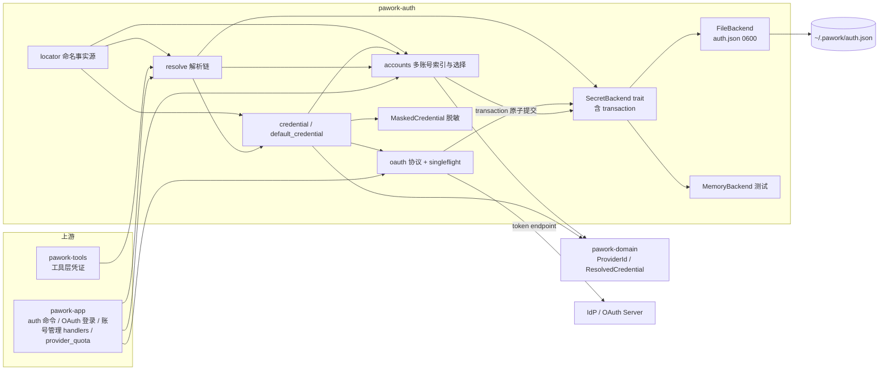

# pawork-auth Review

> Provider 凭证与 Secret 底座：`SecretBackend` 抽象与文件后端（`~/.pawork/auth.json`，0600 原子写 + 事务）、API Key / OAuth（PKCE、Device Flow、singleflight 刷新）、多账号索引与选择（S11：清单 / 重命名 / 手动选中 / opencode-go 额度耗尽自动切换）、脱敏展示与凭证定位规则单一事实源。共 13 个 `.rs` 文件、6,001 行；最大模块为 oauth.rs（1,913 行）与 accounts.rs（1,074 行）。

## 1. 职责与边界

- 定义 Secret 存储抽象 `SecretBackend`（`(service, account)` 二元组 keyspace + 原子 `transaction`），提供正式实现 `FileBackend` 与测试用 `MemoryBackend`；OS Keychain 后端已按用户决策移除，secret 统一走文件后端。
- 元数据与明文严格分离：`StoredCredential` / `ApiKeyCredential` / `MaskedCredential` 只含可持久化元数据与脱敏态；明文只存在于 SecretBackend 与 `ResolvedCredential`（Debug 脱敏）的短暂生命周期中。
- 多账号层（accounts.rs）：每 Provider 一份账号清单（API Key 与 OAuth 混排），含展示名、创建时间、选中项与选择模式；索引与 secret 经 `SecretBackend::transaction` 同次原子提交；旧 default 条目读取时懒合成索引、不立即写回。自动切换（`WhenExhausted`）仅支持 opencode-go 且选中条目必须是存储型 API Key，切换以索引 revision 做 CAS 提交，过期观测直接放弃。
- Provider 凭证解析链（账号索引选中条目 → 旧 default 主条目 → `PAWORK_API_KEY_*` env fallback → `None`，后端损坏 fail-closed 不降级）。
- OAuth 条目按账号槽位泛化：每个 OAuth 账号占 `<slot>.access` / `<slot>.refresh` / `<slot>.meta` 三账户（default 账号是 legacy 形态）；meta 为非机密 JSON，可离线重建 `StoredCredential`。
- OAuth 协议面：PKCE（S256）、Device Flow（RFC 8628）、token refresh（进程内 singleflight gate + 跨进程文件锁）、一次性本地回调服务器。
- 边界：不承载 Provider HTTP 协议细节（由 adapter 消费 `ResolvedCredential`）；不落数据库（元数据持久化由上层负责）；MCP 凭证不在本包读写，本包只通过 locator 提供 `pawork.mcp.*` 命名空间与 `mcp-auth.json` 文件名规则（域隔离：MCP 命名空间禁止解析 Provider / OAuth 凭证）。

## 2. 依赖关系

| 方向 | 包 / crate | 用途 |
|---|---|---|
| 依赖（pawork-*） | pawork-domain | `ProviderId` / `CredentialId` / `Timestamp` / `ResolvedCredential` / `CredentialKind` 领域类型 |
| 被依赖 | pawork-tools | 工具层凭证解析与写入 |
| 被依赖 | pawork-app | CLI 宿主：`pawork auth` 命令、OAuth 登录、账号管理 GUI handlers、provider_quota 自动切换、provider_assembly 凭证装配 |
| 外部 | reqwest | OAuth token / device endpoint HTTP；`http_client()` 禁跟随 redirect（F06） |
| 外部 | tokio（net/rt/sync/io-util/time） | 回调服务器、刷新编排、锁重试 sleep |
| 外部 | serde / serde_json | 元数据、auth 文件、meta / 账号索引 JSON 序列化 |
| 外部 | sha2 | PKCE S256 challenge 与 access token SHA-256 指纹 |
| 外部 | getrandom | code_verifier（48B）与 state（32B）熵源 |
| 外部 | url | 授权 URL 构造与 redirect_uri 校验 |
| 外部 | directories | 默认 home 目录定位（auth 文件默认路径） |
| 外部 | thiserror | `AuthError` 派生 |
| 备注 | async-trait | Cargo.toml 声明但源码未使用（trait 全部为同步方法）；dev 依赖 wiremock 用于 token endpoint mock（形状集中在 testsupport.rs） |

## 3. 文件清单

| 相对路径 | 行数 | 职责 |
|---|---:|---|
| src/lib.rs | 55 | 包入口；模块声明与公共 API re-export（含 `accounts::*`） |
| src/error.rs | 122 | `AuthError` 枚举与 HTTP 错误 Display 脱敏 |
| src/backend.rs | 274 | `SecretBackend` trait（含 `transaction`）；`MemoryBackend` 测试后端 |
| src/base64url.rs | 236 | 无填充 base64url 编解码（严格 canonical 解码） |
| src/credential.rs | 387 | `StoredCredential` / `ApiKeyCredential` / `CredentialId` 生成 |
| src/accounts.rs | 1,074 | 多账号索引与选择：清单 / 增删改 / 选中 / 自动切换 CAS / legacy 迁移 |
| src/resolve.rs | 239 | Provider 凭证解析链与 API Key 主条目写入/删除 |
| src/default_credential.rs | 865 | OAuth 槽位化三账户条目、meta 读写、刷新接入 |
| src/file_backend.rs | 616 | 文件 Secret 后端：跨进程锁、原子写、事务、损坏 fail-closed |
| src/locator.rs | 69 | service / env 命名规则的单一事实源 |
| src/masked.rs | 106 | `MaskedCredential` 脱敏（Unicode 标量三档规则） |
| src/oauth.rs | 1,913 | OAuth 协议全套、刷新 singleflight、本地回调服务器、登录邮箱提取 |
| src/testsupport.rs | 45 | 仅 `#[cfg(test)]` 编译：wiremock token 端点成功/错误 JSON 与 Mock 形状单一来源 |

（无独立 tests/ 目录，全部测试内联在各文件 `#[cfg(test)]`；dev 依赖 wiremock 覆盖 token endpoint。）

## 4. 类型与方法功能列表

### 4.1 error

| 名称 | 种类 | 功能 / 语义 |
|---|---|---|
| `AuthError` | enum | 变体：`Storage(String)`、`NotFound`、`InvalidSecret(String)`、`MalformedMetadata(String)`、`OAuth(String)`、`TokenEndpoint { error, description }`、`ExpiredToken`、`Callback(String)`、`Http(reqwest::Error)`、`Io(std::io::Error)`、`Url(url::ParseError)`。全部 `Send + Sync`；任何变体 Display 不携带明文 secret（账号索引解析失败也不回显 serde 原始输入） |
| `redact_http_error` / `http_error_kind` / `redact_url_origin` | 私有 fn | `Http` 变体 Display 只保留错误类别（timeout / connect / body / decode / request / builder / error）加 `scheme://host[:port]`；path、query、userinfo 全部丢弃（有定向回归钉死） |

### 4.2 backend

| 名称 | 种类 | 功能 / 语义 |
|---|---|---|
| `SecretBackend` | trait | 主要方法：`fn store(&self, service, account, secret)`；`fn store_batch(&self, entries)`（默认逐条 `store`，第三方后端兼容语义）；`fn replace_batch(&self, entries, deletions)`（默认实现返回 `Storage` 错误——无法原子替换的后端必须拒绝，不能部分提交）；`fn transaction(&self, operation: &mut dyn FnMut(&dyn SecretBackend) -> Result<(), AuthError>)`（默认同样拒绝；在单次原子读改写中执行回调，错误回滚，回调不得执行网络或调用外层后端——用于账号索引与 secret 同次提交、刷新提交前复核）；`fn get(&self, ...)`（缺失→`NotFound`）；`fn delete(&self, ...)`（缺失→`NotFound`）；`#[doc(hidden)] fn refresh_lock_path(&self) -> Option<PathBuf>`（默认 `None`，仅供 OAuth refresh 跨进程锁使用） |
| `MemoryBackend` | struct | 测试内存后端，`Mutex<HashMap<(String,String), String>>`；故意不 derive `Debug`，防日志/断言打印明文；`store_batch` 委托 `replace_batch`（同一锁临界区内先删后插）；`transaction` 在锁内克隆快照执行回调、成功后整体替换（失败即丢弃快照）；`from_entries` / `into_entries`（pub(crate)，BTreeMap 形态互转，供 FileBackend 事务复用）；另有 `len` / `is_empty` / `Clone` |

### 4.3 base64url

| 名称 | 种类 | 功能 / 语义 |
|---|---|---|
| `Base64UrlDecodeError` | enum | 变体：`Padding`（拒绝 `=`）、`InvalidCharacter { index }`、`InvalidLastSymbol { index }`（末符号非零余位）、`InvalidLength`（len % 4 == 1） |
| `encode` | fn | `&[u8]` → 无填充 URL 安全 base64（字母表 `A-Za-z0-9-_`） |
| `decode` | fn | 严格解码：拒绝填充、字母表外字符、非规范末符号与非法长度；与 `base64` crate `URL_SAFE_NO_PAD` 行为对拍（golden 向量） |

### 4.4 credential

| 名称 | 种类 | 功能 / 语义 |
|---|---|---|
| `generate_credential_id` | fn | `cred_{nanos:x}_{seq:x}`；纳秒时间戳 + 进程内 `AtomicU64` 序号，不引入 UUID 依赖；多账号 API Key 直接以该 id 作为存储 account |
| `StoredCredential` | struct | 字段：`id` / `provider` / `display_name` / `masked` / `secret_service`（serde alias `keychain_service`，一个版本期兼容读）/ `secret_account`（alias `keychain_account`）/ `created_at` / `expires_at` / `scopes`。可安全序列化、入库、记日志 |
| `StoredCredential::new` | fn | 以脱敏态构造元数据（不接触明文） |
| `StoredCredential::with_expires_at` | fn | 链式设置过期时间 |
| `StoredCredential::secret_backend_ref` | fn | 返回定位明文所需的 `(&service, &account)` |
| `ApiKeyCredential` | struct | 包装 `StoredCredential` 的 API Key 认证方式 |
| `ApiKeyCredential::store` / `store_with_scopes` | fn | 明文写入后端（service=`pawork.<provider>`，account=credential id），返回仅含元数据/脱敏态的 `StoredCredential`；空 secret → `InvalidSecret` |
| `ApiKeyCredential::from_stored` | fn | 校验 service/account 引用非空后由元数据构造 |
| `ApiKeyCredential::resolve` | fn | 从后端读明文，包装为 `ResolvedCredential`（Debug 脱敏，仅供 adapter 构造认证请求） |
| `ApiKeyCredential::delete` | fn | 删除后端明文；删除后不可再 resolve |
| `stored` / `into_stored` | fn | 访问 / 消费内部元数据 |

### 4.5 accounts

多账号索引层（S11）：索引本身是 `pawork.<provider>` service 下 account 为 `accounts.meta` 的一条 JSON（非明文），与 secret 同居 auth 文件。

| 名称 | 种类 | 功能 / 语义 |
|---|---|---|
| `LEGACY_API_KEY_ID` / `LEGACY_OAUTH_ID` | const | `"default-api-key"` / `"default-oauth"`：旧 default 条目在索引中的固定 id；私有 `slot()` 把这两个 id 映射回存储 account `"default"`，其余条目以 credential id 为存储 account |
| `INDEX_ACCOUNT`（私有） | const | `"accounts.meta"`：索引在 Provider 主 service 下的账户名 |
| `ProviderAccountKind` | enum | `ApiKey` / `OAuth`（serde snake_case，OAuth 显式 rename `"oauth"`）；`as_str()` 返回 `"api_key"` / `"oauth"` |
| `ProviderAccountSelectionMode` | enum | `Manual`（默认）/ `WhenExhausted`（额度耗尽自动切换；仅 opencode-go 允许开启） |
| `ProviderAccount` | struct | `credential_id` / `kind` / `display_name` / `created_at_ms` + `stored: StoredCredential`（索引 display_name 覆盖 stored 内同名） |
| `ProviderAccounts` | struct | `selection_mode` / `revision` / `accounts` / `selected_credential_id`；`selected()` 按选中 id 在清单内查找 |
| `list_provider_accounts` | fn | 事务内读索引并逐条 `load_account`：API Key 读明文重建 masked 并校验非空，OAuth 读 meta 重建并校验 access 非空；任何条目损坏原样上抛 |
| `provider_accounts_revision` | fn | 索引不存在 → `None`；存在 → 当前 revision（自动切换 CAS 的观测值） |
| `validate_account_name` | fn | trim 后非空即合法，否则 `InvalidSecret` |
| `default_account_label` | fn | 默认展示名：邮箱形态且 ≤32 字符原文保留；超长邮箱 local 打码（`a***z@domain`）；其余按 secret 头尾打码（`head***tail`，≤4 全 `••••`） |
| `default_api_key_account_name` / `default_oauth_account_name` | fn | API Key 按 secret 打码；OAuth 优先 `id_token` 的 OIDC email（`oauth_login_email`），缺失回退 access token 打码 |
| `add_api_key_account` / `add_oauth_account` | fn | 事务内写 secret（API Key 存 `pawork.<provider>` / account=cred id；OAuth 走 `store_oauth_at` 槽位三账户）+ 追加索引条目；`activate_if_empty` 仅当清单为空才自动选中；空名走默认展示名，空 secret 拒绝 |
| `rename_provider_account` | fn | 改索引 display_name（trim 非空校验），返回更新后的账号视图 |
| `select_provider_account` | fn | 事务内校验条目可加载后置选中，并把选择模式回 `Manual` |
| `set_provider_account_selection_mode` | fn | 开启 `WhenExhausted` 需 provider 为 opencode-go 且当前选中条目为存储型 API Key（事务内验证可加载）；`Manual` 无条件 |
| `select_provider_account_if_revision` | fn | 自动切换 CAS：仅当 revision、模式（须 `WhenExhausted`）、当前选中 id 与观测一致，且源/目标都是存储型 API Key 时切到 target 并落盘；任何不一致返回 `false` 且不写索引（防覆盖手工选择） |
| `remove_provider_account` | fn | 删除索引条目 + 对应 secret；活跃选中（索引选中或 Host 传入 `effective_id`）且清单还有其他账号时拒绝（`InvalidSecret`，需先切换）；删后清选中，无选中回 `Manual` |
| `remove_all_provider_accounts` | fn | 清空全部条目与 secret，并额外清理 legacy `default` OAuth 孤儿槽（与旧 logout 语义一致）；回 `Manual` / 无选中 |
| `remove_legacy` / `store_legacy_api_key` / `store_legacy_oauth` | pub(crate) fn | 旧 default API 的索引维护版：写 / 删 legacy 条目同时保持索引一致；resolve.rs 与 default_credential.rs 的公共 default 入口委托至此 |
| `refresh_account_tokens` | pub(crate) fn | 刷新回写前在事务内复核该账号仍在索引且为 OAuth，再走 `update_oauth_at`——防止刷新复活已删除账号或覆盖重新登录的新令牌 |
| `read_index` / `write_index` / `edit`（私有） | fn | `read_index`：索引缺失时由 legacy default 条目懒合成（不写回）；索引校验 version=1、id 形态与种类匹配（legacy id 定种类；其余须 `cred_` 前缀且 `[A-Za-z0-9_]`）、display_name 非空、无重复 id、selected 必须在清单内，违规一律 `MalformedMetadata`。`write_index`：revision `checked_add(1)` 后落盘。`edit`：事务包裹「读索引 → 操作 → 写索引」 |
| `load_account` / `stored_key` / `new_entry`（私有） | fn | 按种类重建 `ProviderAccount`；`stored_key` 读明文重建 API Key 元数据（空值 `InvalidSecret`）；`new_entry` 生成新 credential id + 时间戳条目 |

### 4.6 resolve

| 名称 | 种类 | 功能 / 语义 |
|---|---|---|
| `PROVIDER_DEFAULT_ACCOUNT` | const | `"default"`，legacy Provider 主条目固定 account |
| `store_default_api_key` | fn | 委托 `accounts::store_legacy_api_key`：写主条目同时维护账号索引（auth set-key 落点），返回元数据 |
| `delete_default_api_key` | fn | 委托 `accounts::remove_legacy`：删主条目并同步索引，幂等；不影响 env fallback |
| `CredentialSource` | enum | 变体：`AuthFile(StoredCredential)`（持久化条目命中，元数据 + 定位信息）；`EnvFallback(ResolvedCredential)`（headless/CI fallback，Debug 脱敏）；`None`（调用方必须 fail-closed） |
| `resolve_provider_credential` | fn | 解析链：先 `list_provider_accounts`——选中 API Key → `AuthFile`；选中 OAuth → `None`（上层装配改走 OAuth 路径，如 provider_assembly 按 stored 读 meta / 刷新）；无索引选中再读 legacy 主条目；仅 `AuthError::NotFound` 降级读 env（`read_api_key_from_env`）；其余错误（含 auth 文件损坏、索引损坏）原样上抛，绝不降级（定向回归 `corrupt_auth_file_never_falls_back_to_env`） |

### 4.7 default_credential

| 名称 | 种类 | 功能 / 语义 |
|---|---|---|
| `OAUTH_DEFAULT_ACCOUNT` | const | `"default"`；三账户 `<account>.access` / `<account>.refresh` / `<account>.meta` 由私有 `access_account` / `refresh_account` / `meta_account` 生成，account 参数化为任意账号槽位 |
| `DefaultOAuthMeta` | struct | 非机密元数据：`masked` / `created_at_ms` / `expires_at_ms`（`None`=上游未给到期时间，每次请求前仍尽量刷新）/ `scopes` / `account_id`（ChatGPT JWT claim，仅路由头）。序列化为 JSON 存 meta 账户 |
| `store_oauth_at`（pub(crate)） | fn | 槽位化三账户整批写入；**refresh 为 `None` 时走 `replace_batch` 删除旧 refresh**（新登录无刷新令牌不得继承旧账号令牌）；`Some("")` 视为 `InvalidSecret` 且不写任何账户；有非空 refresh 走 `store_batch` |
| `load_oauth_at` / `load_oauth_meta_at`（pub(crate)） | fn | 读槽位 meta 重建 `StoredCredential` / 读 meta 展示（无网络、不触明文）；meta 缺失返回 `None`，损坏 → `MalformedMetadata` |
| `delete_oauth_at`（pub(crate)） | fn | 删槽位三账户，幂等 |
| `update_oauth_at`（pub(crate)） | fn | 刷新回写 access/refresh/meta 三者一致；校验传入确为该槽位条目（service / `<slot>.access` 匹配）；**刷新响应 `refresh_token = None` 时保留后端旧值**（与重新登录的 `None` 删除语义不同）；`Some("")` 同样 `InvalidSecret` 且不覆盖；不带 id_token 时保留旧 meta 的 `account_id` |
| `store_default_oauth_token` / `delete_default_oauth_token` | fn | 委托 `accounts::store_legacy_oauth` / `remove_legacy`：default 槽位写 / 删的同时维护账号索引 |
| `update_default_oauth_token` | fn | 委托 `accounts::refresh_account_tokens`：事务内复核账号仍在索引后走 `update_oauth_at` |
| `load_default_oauth_credential` / `load_default_oauth_meta` | fn | default 槽位读取包装 |
| `load_account_oauth_meta` | fn | 由任意 OAuth `StoredCredential` 读其槽位 meta（`oauth_prefix` 推导） |
| `oauth_prefix`（pub(crate)） | fn | `secret_account` 去 `.access` 后缀得槽位，非法定位 → `MalformedMetadata` |
| `default_oauth_needs_refresh` | fn | `expires_at` 为 None 视为需要刷新；固定 30s（`REFRESH_GRACE_MILLIS`）grace |
| `refresh_default_oauth_credential_if_needed` | async fn | 复用 oauth 的 `refresh_oauth_credential_with` singleflight 核心，注入 default 专用谓词 / 持久化 / reload 闭包 |

私有实现要点：`chatgpt_account_id` 从 `id_token` JWT payload 的 `https://api.openai.com/auth`.`chatgpt_account_id` claim 提取，**不验签**——该值只作路由头、不作信任边界；`stored_from_meta` 把 meta 还原为 `StoredCredential`（`secret_account` 固定指向槽位 access 账户）。

### 4.8 file_backend

| 名称 | 种类 | 功能 / 语义 |
|---|---|---|
| `FileBackend` | struct | 单 JSON 文件后端；`new()` 取默认路径，`with_path()` 显式路径（测试），`path()` 诊断 |
| `AuthFile`（私有） | struct | 落盘格式 `{version: 1, entries: {service: {account: secret}}}`，BTreeMap 保证稳定序列化 |
| `SecretBackend for FileBackend` | impl | `store` → `store_batch` → `replace_batch` 逐层复用；写路径 = write 锁 → load → 先按 deletions 删（空 service map 剔除）再插入 → save；`transaction` = write 锁 → load → 以 `MemoryBackend` 快照执行回调 → 有变化才 save（回调出错直接返回，磁盘字节不变）；`get` 无锁读；`delete` 持锁读改写（删空 service）；`refresh_lock_path` 返回 `<auth.json>.refresh.lock` |
| `acquire_file_lock` / `try_acquire_file_lock` | pub(crate) fn | 跨进程独占锁：unix 用 `flock(LOCK_EX\|LOCK_NB)` FFI（文件 0600）、Windows 用 `share_mode(0)`（错误码 32/33 视为占用）、其他平台 `create_new` + Drop 删文件；忙等重试 10ms、write 锁超时 30s（refresh 锁 120s 由调用方传入） |
| `load` / `save`（私有） | fn | `load`：文件不存在或空 → 空表；解析失败或版本非 1 → `Storage` 错误 fail-closed，绝不静默清空。`save`：每次写入生成唯一临时文件（`.auth.json.<pid>.<seq>.tmp`，`create_new` + 0600）→ `fsync` → 同目录 `rename` 原子替换；失败清理临时文件 |
| `default_auth_file_path` / `resolve_auth_file_path`（私有） | fn | `$PAWORK_HOME/auth.json`；`resolve_auth_file_path` 非空 `PAWORK_HOME` 优先，缺失 / 空串回退 base home（directories 定位），有路径解析定向测试 |

### 4.9 locator

| 名称 | 种类 | 功能 / 语义 |
|---|---|---|
| `PROVIDER_SERVICE_PREFIX` | const | `"pawork"` |
| `MCP_SERVICE_PREFIX` | const | `"pawork.mcp."`（独立命名空间） |
| `MCP_AUTH_FILE_NAME` | const | `"mcp-auth.json"`（MCP 独立 secret 文件，不与 Provider 共用） |
| `secret_service_for` | fn | `pawork.<provider>`（Provider 主条目与账号索引同 service） |
| `oauth_secret_service` | fn | `pawork.<provider>.oauth` |
| `is_mcp_secret_service` | fn | 是否落在 MCP 命名空间（`pawork.mcp.*`，注意裸 `"pawork.mcp"` 不算） |
| `api_key_env_name` | fn | `PAWORK_API_KEY_<大写、'-'→'_'>`，如 `glm-coding` → `PAWORK_API_KEY_GLM_CODING` |
| `read_api_key_from_env` | fn | 未设置或空字符串均视为缺失 |

改动注意：本模块是命名的单一事实源，所有字符串值与既有 auth.json 落盘形状逐字节绑定，改前先确认兼容性。

### 4.10 masked

| 名称 | 种类 | 功能 / 语义 |
|---|---|---|
| `MaskedCredential` | struct | 只持有预计算脱敏字符串；`Display` / `Debug` / `Serialize` 永不含明文 |
| `MaskedCredential::mask` | fn | 三档规则（按 Unicode 标量计数，不截断多字节字符）：长度 ≤4 → `••••`；5–8 → `…xy`（尾 2 字符）；>8 → `pre…wxyz`（前 3 + 尾 4） |
| `from_masked` / `as_str` | fn | 由已知脱敏串构造（调用方保证非明文）/ 读取展示串 |

### 4.11 oauth

| 名称 | 种类 | 功能 / 语义 |
|---|---|---|
| `TokenSet` | struct | 一次交换结果（明文，短存）：`access_token` / `refresh_token` / `id_token` / `expires_in` / `token_type` / `scope`；手写 `Debug` 把三个 token 字段全部 `[REDACTED]` |
| `OAuthRefreshConfig` | struct | `token_url` / `client_id` / `refresh_skew`（到期前提前刷新余量） |
| `Pkce` | struct | `verifier`（Debug 脱敏）/ `challenge` / `method`（固定 `"S256"`）；`generate()` 用 48B `getrandom` → 64 字符 verifier，challenge = base64url(sha256(verifier))（RFC 7636 向量测试） |
| `random_state` | fn | 32B 熵的 base64url，CSRF state |
| `http_client` | fn | `reqwest::Client` 且 `redirect(Policy::none())`——token endpoint 与 MCP OAuth 禁跟随 3xx，防 Authorization / form 体被带去新 origin（F06） |
| `PkceFlowConfig` / `PkceSession` | struct | 授权流配置（client_id / auth_url / token_url / redirect_uri / scopes / provider / extra_auth_params）与待交换会话（pkce + state + auth_url；state 与 auth_url Debug 脱敏） |
| `start_pkce_flow` | fn | 生成 PKCE pair + state，构造授权 URL（`build_auth_url` 私有：response_type=code、code_challenge_method=S256） |
| `exchange_pkce_code` | async fn | 校验 returned_state 与会话 state 一致（CSRF）后 POST token endpoint |
| `DeviceFlowConfig` / `DeviceAuthorization` / `DeviceUserPrompt` | struct | RFC 8628 配置、设备授权响应（device_code / user_code Debug 脱敏）、用户引导信息 |
| `request_device_authorization` | async fn | POST device authorization endpoint |
| `poll_device_token` | async fn | 单轮轮询：`authorization_pending` 继续、`slow_down` 把 interval +5s、`expired_token` → `AuthError::ExpiredToken` |
| `refresh_access_token` | async fn | refresh_token grant 换新 TokenSet；失败上抛，调用方应重新授权 |
| `exchange_token`（私有） | async fn | token endpoint 通用交互：标准错误 → `TokenEndpoint`，成功解析 `TokenSet`；token 绝不进错误 |
| `store_oauth_token` | fn | 明文 token 写入后端（account=`<cred_id>.access` / `.refresh`），返回仅含元数据的 `StoredCredential`；空 token → `InvalidSecret` |
| `update_oauth_token` | fn | 通用 OAuth 条目原地回写：先 refresh 后 access 的顺序整批提交；`expires_in` 缺失时**保留原到期时间**（None 不误解释为永不过期）；更新 masked / scopes |
| `resolve_oauth_credential` / `read_refresh_token` | fn | 从后端解析 bearer / 读 `<cred_id>.refresh` |
| `needs_refresh` | fn | `expires_at <= now + skew`；无 `expires_at` 返回 false（default 条目在自身谓词中把 None 视为需要刷新） |
| `RefreshedMetadata` / `RefreshGate`（私有） | struct | singleflight 状态：gate = `AsyncMutex<()>` + `StdMutex<Option<RefreshedMetadata>>`；`RefreshedMetadata` 含脱敏元数据 + access token 的 SHA-256 指纹（`secret_fingerprint`，不持久化、无 Debug）；`apply_latest` 等待方复用条件 = 元数据不同 && 后端当前 access 指纹与已发布指纹一致；`publish` 在持久化成功后发布 |
| `REFRESH_GATES`（私有） | static | 进程内 `(service, account)` → `Arc<RefreshGate>` 全局表（`OnceLock`） |
| `refresh_oauth_credential_with` | pub(crate) async fn | **刷新编排核心**：should_refresh 预检 → gate 互斥 → `apply_latest` 复用（不重复消费一次性 refresh token）→ 二次预检 → 若后端提供 `refresh_lock_path`：锁外快照 token → 120s 文件锁 → reload meta + 重读 token，任一变化即采用他进程结果并返回 → 调 `refresh_access_token` → `persist` → `publish`。谓词 / 持久化 / reload 以函数指针注入，default 条目与通用条目共用唯一实现 |
| `refresh_oauth_credential_if_needed` | async fn | 通用 OAuth 条目入口（persist=`update_oauth_token`，无 reload） |
| `resolve_oauth_credential_for_request` | async fn | 请求前置编排：先 auto-refresh 再解析 bearer，保证轮换 refresh token 已写回后才返回 |
| `CallbackServer` | struct | 一次性本地回调服务器：`start(port)` 绑定 `127.0.0.1`，后台任务 accept 单连接（5 分钟上限）；`local_addr`；`bind_redirect_uri` 强制 http + loopback host（127.0.0.1 / localhost / ::1），**host 原样保留**（OAuth allow-list 精确匹配，localhost 与 127.0.0.1 不可互换），只回填实际端口且校验已配端口一致；`wait_for_code(timeout)` 消费 self 等待 `(code, state)` |
| `handle_callback_connection`（私有） | async fn | 增量读请求头（上限 64KiB `MAX_CALLBACK_HEADER_BYTES`，非 UTF-8 / 提前关闭报错）；解析 query；回固定纯文本 200（`nosniff` + `no-store`，不回显 query / token）；`error` 参数 → 授权失败错误；缺 `code` / `state` 报错 |
| `parse_query` / `percent_decode` / `hex_val`（私有） | fn | 手写 query 解析与 percent-decoding（`+`→空格） |
| `start_pkce_flow_with_callback` | fn | 绑定回调服务器并把实际端口回填 redirect_uri 后再生成授权 URL |
| `oauth_login_email` | fn | 从 `id_token` 提取 OIDC `email` claim（**不验签**）；只接受形态合理邮箱（`is_plausible_email`：非空 local/domain、domain 含点且不以点起止、总长 ≤254、无空白/控制字符），缺 token / 畸形 / 非邮箱一律 `None`，调用方回退脱敏 access token 作账号名 |
| `decode_jwt_payload` | pub(crate) fn | base64url 解码 JWT payload 段并解析 JSON；**不验签**，仅供提取非机密 claim（ChatGPT account id、登录邮箱） |
| `build_auth_url` / `extract_error`（私有） | fn | 授权 URL 构造；从 JSON 错误响应提取 `error` / `error_description` |

## 5. 关键行为与契约

- **明文红线**：明文 secret 只存在于 SecretBackend（内存 / auth 文件）与 `ResolvedCredential` / `TokenSet` 的短暂生命周期；`StoredCredential`、`MaskedCredential`、`TokenSet`、`Pkce`、`PkceSession`、`DeviceAuthorization`、`DeviceUserPrompt` 的 Debug / Display / Serialize 输出均脱敏；`AuthError::Http` 的 Display 只含类别 + origin，索引解析错误不回显原始 JSON。改动任何错误构造时严禁把 secret 拼进 message。
- **fail-closed**：auth 文件损坏、版本不符、meta 损坏、账号索引损坏（版本 / id 形态 / 重复 / 悬空 selected）均返回错误，绝不静默清空或降级 env（`corrupt_auth_file_never_falls_back_to_env` 定向回归）；凭证皆缺返回 `CredentialSource::None`，由调用方拒绝构造伪凭证。
- **原子性与跨进程协调**：写路径为 write 锁（30s 超时）→ load → 变更 → 唯一临时文件（0600 `create_new`）→ 同目录 rename；锁实现按平台分 unix flock / Windows share_mode(0) / 其他 create_new。`replace_batch` 默认拒绝而非部分提交；`transaction` 把「索引读改写 + secret 写删」合并为一次提交（FileBackend 快照执行、出错磁盘字节不变；MemoryBackend 锁内快照）。OAuth refresh 额外有 `.refresh.lock`（120s）：先锁外快照再锁内 reload + 指纹比较，他进程已完成轮换则直接采用，绝不重复消费一次性 refresh token。
- **singleflight**：进程内同 `(service, account)` 共享 `RefreshGate`；等待方在 gate 内用 `apply_latest`（脱敏元数据 + access SHA-256 指纹匹配）复用已完成刷新（有并发回归 `concurrent_refreshes_share_one_singleflight_exchange`）。
- **账号索引不变量（S11 已落地）**：索引是 `pawork.<provider>` service 下 `accounts.meta` 的 JSON（非明文：展示名 / 种类 / 模式 / revision / selected）；索引与 secret 只在 transaction 内同批提交；legacy default 条目懒合成索引、不主动写回；每次成功 edit revision +1；自动切换（`WhenExhausted`）仅 opencode-go + 存储型 API Key，且必须 revision CAS 匹配才提交，手工选择 / 删除 / 过期观测都会使在途切换失效；删除活跃账号需先切换；`remove_all` 额外清 legacy OAuth 孤儿槽；刷新回写前复核账号仍在索引（不能复活已删账号或覆盖重新登录）。
- **OAuth 槽位不变量**：service 固定 `pawork.<provider>.oauth`，每账号三账户 `<slot>.access/.refresh/.meta`（default 槽位即 legacy 形态）；重新登录缺 refresh 必须删旧 refresh；刷新缺 refresh 保留旧值；`account_id` 在刷新后保留。
- **回调服务器安全面**：仅 loopback + http；单连接、5 分钟 accept 超时、64KiB 头上限；响应固定纯文本 + nosniff + no-store，不回显 query；state 强制 CSRF 校验。
- **redirect 禁跟随**（F06）：`http_client()` 是 OAuth / MCP 共用入口，改 redirect 策略前必须重新评估 token 泄漏面。
- **平台差异**：锁的三套实现（unix / windows / 其他）；auth 文件 0600 仅 unix 显式设置（非 unix `create_new` 无 mode）；MCP 命名空间与 Provider 命名空间互不可解析（`is_mcp_secret_service`）。
- **冻结面**：auth.json 落盘形状（version=1、BTreeMap 嵌套）、`pawork.<provider>` / `.oauth` / `pawork.mcp.*` 命名、`accounts.meta` 索引形状与 legacy id（`default-api-key` / `default-oauth`）、`<slot>.access/.refresh/.meta` 账户命名、`PAWORK_API_KEY_*` env 名、`cred_{nanos:x}_{seq:x}` id 格式、base64url 严格解码行为（golden 向量）。修改任何一项都需要迁移兼容。

## 6. 测试资产

| 文件（内联 tests） | 验证点 |
|---|---|
| error.rs（1） | HTTP 错误 Display 脱敏（不含 userinfo / path / query，仅保留 host） |
| backend.rs（5） | MemoryBackend 读写 / 覆盖 / 缺失 / 批量；`Send + Sync` 断言 |
| base64url.rs（4） | golden 向量；拒绝填充 / 非法字符 / 非法长度 / 非规范末符号 |
| credential.rs（8） | id 生成、脱敏不泄漏、store/resolve/delete 往返、多凭证同 provider 不同 account、legacy keychain 字段名迁移 |
| accounts.rs（6） | legacy 选择保留 + 清单原子性（含 4 个独立 FileBackend 并发写、事务失败后磁盘字节不变）；自动切换持久化 + 过期 / 手工选择 / 删除后的 CAS 拒绝；模式验证不改索引；刷新不能复活已删账号或覆盖重新登录；默认展示名打码（邮箱 / secret）；空名自动生成 + 重命名别名 |
| resolve.rs（6） | env 名推导；账号索引选中优先；文件命中优先于 env；未命中降级 env；空 env 视为缺；两级皆缺 None；**损坏文件 fail-closed 不降级** |
| default_credential.rs（10） | 槽位三账户写入与重建；`refresh=None` 删旧值；空字符串 refresh 拒绝且不写；刷新省略 refresh 保留旧令牌；刷新保 account_id / expires；30s grace；刷新编排（含 wiremock、跨进程单次交换） |
| file_backend.rs（11） | 并发写（12 writers）；原子写；损坏 fail-closed；锁行为；权限；`PAWORK_HOME` 路径解析（非空优先 / 缺空回退） |
| locator.rs（3） | service 命名、MCP 命名空间隔离、env 名推导、文件名钉死 |
| masked.rs（3） | 三档脱敏规则；Debug / Display / Serialize 不泄漏 |
| oauth.rs（25） | PKCE S256 RFC 7636 向量与 verifier 分布；state 校验；token endpoint 错误归一；Device Flow 轮询（pending / slow_down / expired）；刷新 singleflight 并发复用（wiremock）；回调头上限 / 分片头 / 固定响应 / redirect_uri 校验；JWT payload 拒绝畸形；percent-decoding |
| testsupport.rs | 测试装配共享件（非测试）：wiremock token 端点成功 / 错误 JSON 与 Mock 形状单一来源 |

## 7. 协作关系

