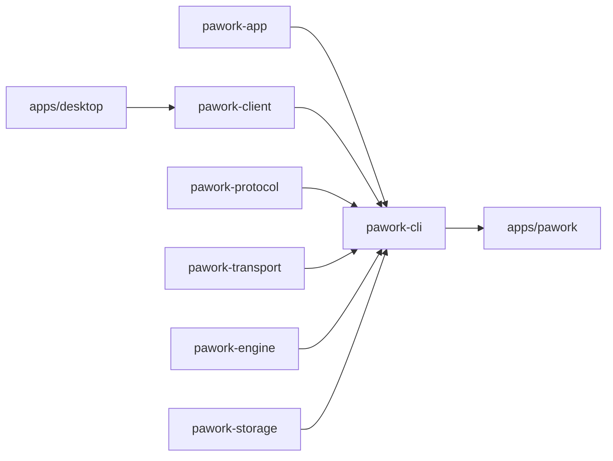

# pawork-cli Review

> CLI 命令面与外部通道：21 个顶层子命令 + ACP 四件套，把 `AppCore` 装配成终端 / headless / GUI serve / ACP stdio。27 个 src `.rs` + 3 个 tests `.rs`（含 `tests/common/mod.rs`），共 12,090 行；最大模块 `channels/acp/host.rs`（2,199）。只被 `apps/pawork` 消费。

## 1. 职责与边界

做什么：解析 clap、按命令决定是否加载 Core、选审批宿主、把 stdout 留给协议/JSON（日志与提示走 stderr）。六运行模式：chat / run / headless / acp / gui serve / service；其余是会话、凭证、运维与编排入口。

不做什么：不定义 wire 契约（在 `pawork-protocol`）；不实现 Provider / 工具 / SQLite；不嵌入 Core 到 Desktop。关闭 GUI/ACP **不取消**已进入 Core 的 Run。`channels/` 注释写「本 crate 不依赖 pawork-app」——那是 ACP 通道模块的目标边界；crate 级仍依赖 app，Core 执行经 `CliAcpCommandHost` 注入。

装配顺序（`run()` → `run_inner()`）：

1. Service / Status / Doctor / Watch / Shutdown **不加载 Core**。
2. 其余 `AppCore::load` 或 `load_for_catalog`（tolerant：Models/Sessions/Auth/Diff/Rollback/Mcp/Import/Headless/Acp/Gui/Usage/Tasks/Plan/Agents）。
3. `--json` 或非 TTY → `DenyAllApprovals`；Gui/Headless/Acp → `GuiApprovalHost`；默认审批档 `read-only`。
4. stdout：json/protocol only。

全局旗标：`--provider/-p`、`--model/-m`、`--instance`（默认 `default`）、`--json`、`--approval-mode`、`--trust-workspaces`（只覆盖本次进程，不写配置）。

## 2. 依赖关系

| 方向 | crate | 用途 |
| --- | --- | --- |
| 依赖 | pawork-app | `AppCore` / `AppLoadOptions` / 审批宿主 / `GuiHostAdapter` / `gui_server` / 领域门面 |
| 依赖 | pawork-client | `status`/`watch`/`doctor`/`shutdown` 连本机 GUI serve |
| 依赖 | pawork-domain | ID、事件、审批决策 |
| 依赖 | pawork-engine | chat 文本路径的 `AgentEventSink` / compact |
| 依赖 | pawork-protocol（feature `adapter`） | 命令信封、ACP ClientAdapter、headless 帧、GUI 能力表 |
| 依赖 | pawork-storage（`session`，关 default） | ACP `SqliteClientSessionRegistryStore` |
| 依赖 | pawork-transport | `gui serve` 本机 UDS / Named Pipe |
| 被依赖 | apps/pawork | 唯一正式宿主二进制 |

| 外部 crate | 用途 |
| --- | --- |
| clap | 21 子命令 |
| tokio | rt-multi-thread、signal、stdio、ACP actor |
| async-trait | ACP CommandHost / Adapter |
| serde / serde_json | JSON 输出与 JSON-RPC |
| thiserror / tracing | `CliError`、诊断 |
| tempfile（dev） | ACP / sessions 夹具 |

无 crate feature。Desktop **不**依赖本包。

## 3. 文件清单

| 相对路径 | 行数 | 职责 |
| --- | ---: | --- |
| src/lib.rs | 1092 | `Cli` / `Command` 21 变体、`run`/`run_inner` 装配、clap 矩阵测试 |
| src/chat.rs | 661 | REPL / 单次 / `--json` HeadlessResponse |
| src/sessions.rs | 689 | list/show/export/import/fork；jsonl 完整首行嗅探 |
| src/render.rs | 558 | `TextSink`：assistant→stdout，thinking/工具→stderr |
| src/headless.rs | 512 | `--json-stdio` Handler + capability gate |
| src/service.rs | 380 | install/start/stop；默认 dry-run |
| src/ops.rs | 372 | status/watch/shutdown/doctor；socket/token/pid 命名 |
| src/acp.rs | 278 | `acp serve` stdio 循环 + 事件泵 |
| src/channels/acp/host.rs | 2199 | `AcpHost` actor（独立 OS 线程 + current_thread runtime） |
| src/channels/acp/adapter.rs | 658 | ACP ↔ canonical ClientAdapter |
| src/channels/acp/wire.rs | 651 | JSON-RPC 类型，`PROTOCOL_VERSION=1` |
| src/channels/acp/map.rs | 286 | crate-private：错误码 / StopReason / 权限选项 |
| src/channels/acp/command_host.rs | 28 | `AcpCommandHost` 窄 port |
| src/channels/acp/mod.rs | 35 | ACP 模块导出 |
| src/channels/mod.rs | 13 | 外部通道入口（本波只激活 acp） |
| src/vcs.rs | 199 | diff / rollback（Blob 还原） |
| src/gui.rs | 151 | `gui serve` 单实例绑定 |
| src/approval.rs | 124 | TTY `InteractiveApprovals` |
| src/auth.rs | 123 | list/set-key/login/logout |
| src/adapter.rs | 114 | CLI→`GuiHostAdapter` 胶水、`CliAcpCommandHost` |
| src/plan.rs | 103 | Plan 审批子命令 |
| src/tasks.rs | 82 | 后台任务 |
| src/import.rs | 80 | 本机工具配置导入 |
| src/error.rs | 73 | `format_provider_error` |
| src/usage.rs | 48 | 用量与 LocalLedger 报表 |
| src/mcp.rs | 44 | MCP list/test |
| src/agents.rs | 34 | S11 多 Agent demo |
| tests/common/mod.rs | 650 | ACP TestHarness / MockScript |
| tests/fixtures.rs | 444 | ACP golden 16 |
| tests/floor.rs | 1409 | ACP 地板 27 |

## 4. 类型与方法功能列表

### 4.1 lib.rs — 入口与 21 子命令

| 名称 | 种类 | 功能 / 语义 |
| --- | --- | --- |
| `CliError` | enum | `App` / `Turn` / `Usage` / `Cancelled` / `Io`。失败走 stderr + `ExitCode::FAILURE` |
| `Cli` | struct | 全局旗标 + `command: Command` |
| `run` | async fn | 唯一对外入口，`apps/pawork` 调用 |
| `format_provider_error` | re-export | 见 error.rs |
| `channels` | pub mod | ACP 对外出口（`AcpHost` / Adapter / CommandHost / `PROTOCOL_VERSION` 等） |

`Command` 21 变体及入口：

| 变体 | 入口 | 语义 |
| --- | --- | --- |
| `Chat { prompt, resume, branch }` | `chat::run_chat` / `run_json` | REPL 或单次；`--json` 需 `--prompt` |
| `Sessions { List/Show/Export/Import/Fork }` | `sessions::run_sessions` | 落盘会话；Import 可 `--from claude\|codex`（与 path/format/source 互斥） |
| `Run { prompt }` | `chat::run_once` / `run_json` | 非交互单次 |
| `Models` | `run_models` | 目录排序后列出 |
| `Auth { List/SetKey/Login/Logout }` | `auth::run_auth` | 凭证；key 走 stdin；login 5min PKCE/device；logout 不清 env fallback |
| `Gui { Serve { socket } }` | `gui::run_gui` | 本机 GUI 协议服务 |
| `Diff { session, page }` | `vcs::run_diff` | 会话累计 hunk，每页 10 文件 |
| `Rollback { checkpoint, session, yes }` | `vcs::run_rollback` | **Blob 还原**，不是 `git reset --hard`。json/非 TTY 必须显式 checkpoint |
| `Mcp { List/Test }` | `mcp::run_mcp` | 已配置 server |
| `Import { tool, yes, dry_run }` | `import::run_import` | 只读源：claude/codex/grok/cursor/pi |
| `Headless { json_stdio }` | `headless::run_headless` | 必须 `--json-stdio` |
| `Acp { Serve }` | `acp::run_acp_serve` | ACP JSON-RPC stdio |
| `Service { Install/Start/Stop }` | `service::run_service` | 默认 dry-run，`--apply` 才改系统；模板硬编码 `gui serve` |
| `Status` | `ops::run_status` | 不加载 Core |
| `Watch` | `ops::run_watch` | 订阅事件直到 Ctrl-C |
| `Shutdown` | `ops::run_shutdown` | SIGTERM 本机 serve |
| `Doctor` | `ops::run_doctor` | 装配自检 + 握手探测 |
| `Usage { session }` | `usage::run_usage` | 用量 / LocalLedger |
| `Tasks { List/Status/Cancel/Register }` | `tasks::run_tasks` | 后台任务 |
| `Plan { Show/Create/Replace/Submit/Approve/Reject }` | `plan::run_plan` | Plan 闸门 |
| `Agents { Demo { cancel, budget_tokens } }` | `agents::run_agents_demo` | 多 Agent 演示 |

子枚举：`SessionsCommand` / `AuthCommand` / `GuiCommand` / `McpCommand` / `AcpCommand` / `ServiceCommand` / `TasksCommand` / `PlanCommand` / `AgentsCommand`。

`approval_host`：`--json` 或 stdin 非 TTY → `DenyAllApprovals`；否则 TTY `InteractiveApprovals`；Gui/Headless/Acp 覆盖为 `GuiApprovalHost`。

### 4.2 chat.rs / render.rs / approval.rs

| 名称 | 种类 | 功能 / 语义 |
| --- | --- | --- |
| `run_chat` | async fn | 有 `--prompt` 单次；非 TTY 读 stdin 一行；否则 REPL |
| `run_once` | async fn | `pawork run` |
| `run_json` | async fn | stdout 只打 `HeadlessResponse` JSONL（无 hello） |
| REPL 斜杠 | 约定 | `/exit` `/quit`；`/compact`（与自动压缩同一 engine 函数）；`/model` `/provider` `/plan`；`@file` 工作区引用。空闲连按两次 Ctrl-C 退出 |
| `TextSink` | struct | `AgentEventSink`：`AssistantTextDelta`→stdout，thinking/工具/失败→stderr。`--json` 不经本模块 |
| `InteractiveApprovals` | struct | stderr 提示，stdin `y` 一次 / `a` 本 run / `n` 拒绝；取消 → `Cancelled` |

### 4.3 sessions.rs / import.rs / vcs.rs

`sniff_jsonl_session`：**读完首个完整非空行**再 JSON 解析，禁止 8KiB 截断（真实 session_meta 可超 8KiB）。签名：`timestamp+type+payload` → Codex 信封；`sessionId+type` 且无 `payload` → Claude 本地行；否则 `None`。`detect_session_format` 对 `.jsonl` 在 sniff 为 None 时默认 Pi。测试钉死超 8K 首行不误判。

rollback 走 checkpoint Blob，json/非 TTY 无 id 则 Usage 错误（不能交互询问）。

### 4.4 headless.rs

| 名称 | 种类 | 功能 / 语义 |
| --- | --- | --- |
| `HOST_CAPABILITIES` | const | `Sessions` / `Runs` / `Streaming` / `CompatImport` / `CompatHistory`。测试钉死快照，且 registry headless 列 ⊆ 本表 |
| `run_headless` | async fn | 无 `--json-stdio` → Usage 错误。Lagged 停流 fail-closed |
| `HeadlessHandler` | struct | hello 用 `negotiate_api_version_with`；授予 = 请求 ∩ HOST_CAPABILITIES。`command_entry().headless == None` → `UnsupportedCapability`（含 `WorkspaceAdd` 定向回归） |

### 4.5 gui.rs / ops.rs / service.rs

| 名称 | 种类 | 功能 / 语义 |
| --- | --- | --- |
| `run_gui` | async fn | bind 前探测拒绝双实例；父目录 `0o700`；capabilities = `gui_supported_capabilities()`（不是本地列表）；`host_data_dir` 与 Core 同一 data_dir；token 缺失则 generate，空 token 失败无匿名回退 |
| `gui_socket_path` | fn | default：`pawork-gui.sock`；命名 instance：`pawork-gui-<i>.sock` |
| `gui_token_path` | fn | `gui.token` / `gui-<i>.token` |
| `service_name` | fn | `pawork` / `pawork.<i>` |
| `gui_pid_path` | fn | `<data_dir>/<instance>/gui-serve.pid` |
| `load_gui_client_authentication` | fn | token 缺失/空失败，不静默 `None` |
| `resolved_instance` | fn | 空串回落 `default`，不校验字符集 |
| `write_pid_file` / `remove_pid_file` | fn | `gui serve` 写/清 pid |
| `run_status` / `run_doctor` / `run_watch` / `run_shutdown` | async fn | 不加载 Core；doctor 在 listening 时做握手探测 |
| `run_service` | fn | 模板硬编码 `gui serve`；macOS launchd / Linux systemd / Windows sc |

关闭窗口/Ctrl-C 只关监听，不取消 in-Core Run。

### 4.6 adapter.rs / acp.rs — ACP 装配

| 名称 | 种类 | 功能 / 语义 |
| --- | --- | --- |
| `adapter_from_locked` / `adapter_with_gui_approvals` | fn | 包 `GuiHostAdapter` |
| `stamp_automation` / `stamp_query` | fn | 盖 `CommandSource` |
| `command_envelope` | fn | id 形如 `cli-{name}-{n}` |
| `wrap_response` | fn | 给 query/command 回包加 `request_id` 与时间戳 |
| `now_timestamp` | fn | Unix 毫秒 `Timestamp` |
| `CliAcpCommandHost` | struct | `AcpCommandHost`：dispatch/query/subscribe，Automation 名 `acp` |
| `run_acp_serve` | async fn | `SqliteClientSessionRegistryStore` + `AcpHost` + stdio 循环。Lagged → `fail_closed_all_prompts`。退出最多再 drain 30s |

### 4.7 ACP 四件套（`channels/acp/`）

**1. `AcpHost`（host.rs）**

独立 OS 线程 `pawork-acp-actor` + `current_thread` runtime（同步 drain 不能挂在调用方 ambient runtime 上，否则 current-thread 测试会冻死）。Mailbox API：`handle_request` / `handle_notification` / `handle_response` / `drain_and_pump` / `pump_events`。

- 同 session 同时只占一个 prompt occupancy。
- `handle_request` 对 `session/prompt` 经 `FlushBarrier` 等到 run 终态才返回。
- `fail_closed_all_prompts` 等 actor 回执，ack 超时 2s。
- cwd 必须在已登记 workspace root 内，**禁止静默 `WorkspaceAdd`**。
- `protocolVersion=1` 整数；实验 v2 → `-32602`。未知方法 `-32601`，未知参数 `-32602`。
- `ACP_SUPPORTED_CAPABILITIES = []`（客户端能力全记入 degraded，使用点再拒）。
- `ACP_AGENT_NAME="pawork-acp"`，`ACP_AGENT_VERSION="0.0.0"`。Mailbox 还产出 `OutboxItem`（含 `FlushBarrier`）与 `PromptResolution`。

**2. `AcpCommandHost`（command_host.rs）**

`dispatch` / `query` / `subscribe`。禁止依赖 `EventHub`；事件只经 subscribe 扇出。错误 `AcpHostError::Unavailable`。

**3. `AcpClientAdapter` + `AcpClientAdapterFactory`（adapter.rs）**

纯协议翻译：decode `session/new|prompt|cancel|permission`；admit 走 protocol registry acp 列（`session_create` / `run_start` / `run_cancel` / `tool_approve`）。`ACP_PROTOCOL="acp"`。`CwdResolver` / `SessionResolver` 由宿主注入。`AcpClientAdapterFactory::create_concrete` 得到 `NegotiatedAcpAdapter`。`decode_cancel` → `CancelTarget`；permission 响应 → `PermissionDecision`。能力白名单外 **显式降级** 而非拒握手。

**4. `wire.rs` + crate-private `map.rs`**

| 名称 | 种类 | 功能 / 语义 |
| --- | --- | --- |
| `PROTOCOL_VERSION` | const | `1` |
| JSON-RPC 错误码 | const | PARSE -32700 / INVALID_REQUEST -32600 / METHOD_NOT_FOUND -32601 / INVALID_PARAMS -32602 / INTERNAL -32603 / REQUEST_CANCELLED -32800 / AUTH_REQUIRED -32000 / RESOURCE_NOT_FOUND -32002 |
| `JsonRpcMessage` | enum | parse/to_value |
| `InitializeParams/Result` 等 | struct | ACP v1 方法形状 |
| `StopReason` | enum | map：`Completed`→`end_turn`；`Cancelled`/`Interrupted`→`cancelled`；`Failed`→internal |
| `PERMISSION_OPTION_ALLOW_ONCE` / `REJECT_ONCE` | const | 未知 option id 拒绝。客户端错误响应视为 Deny，`-32800` 视为 Cancel |

`channels/mod.rs` re-export：`AcpHost` / `AcpHostError` / `AcpCommandHost` / `AcpClientAdapter` / `AcpClientAdapterFactory` / `CwdResolver` / `SessionResolver` / `JsonRpcMessage` / `PROTOCOL_VERSION`。`OutboxItem` / `PromptResolution` 经 `channels::acp`。`codex` / `claude` / `remote-control` 不迁入。

### 4.8 其余命令模块

| 文件 | 入口 | 语义 |
| --- | --- | --- |
| auth.rs | `run_auth` | List 掩码；SetKey stdin；Login 5 分钟；Logout 只删 auth 文件 default |
| mcp.rs | `run_mcp` | List 已发现工具；Test ping/list_tools |
| usage.rs | `run_usage` | session 可选 |
| tasks.rs | `run_tasks` | list/status/cancel/register |
| plan.rs | `run_plan` | show/create/replace/submit/approve/reject |
| agents.rs | `run_agents_demo` | 可选 cancel 与 token 预算 |
| error.rs | `format_provider_error` | 把 `ProviderError` 打成可读中文/英文短句 |

## 5. 关键行为与契约

- stdout 只给协议/JSON；日志、审批、REPL 提示走 stderr。
- 默认审批 `read-only`；`--json` / 非 TTY fail-closed DenyAll。
- jsonl 嗅探读完整首行，禁止 8KiB 截断。
- headless 未映射命令 `UnsupportedCapability`，不得静默放行。
- GUI token 缺失/空失败，无匿名回退。socket 目录 0o700。
- 关闭 GUI/ACP 不取消 in-Core Run。
- ACP：protocolVersion=1；Lagged fail-closed；cwd 不自动 WorkspaceAdd。
- rollback 不是 `git reset --hard`。
- service 默认 dry-run。

## 6. 测试资产

| 文件 | 数量 | 验证点 |
| --- | ---: | --- |
| src/lib.rs | 12 | clap 矩阵（全局旗标、子命令、socket 命名） |
| src/approval.rs | 2 | 提示格式 |
| src/render.rs | 12 | TextSink 分流 |
| src/sessions.rs | 5 | jsonl 嗅探（含超 8K）、format_millis |
| src/service.rs | 4 | dry-run / 平台模板 |
| src/headless.rs | 5 | capability gate、HOST_CAPABILITIES 快照、WorkspaceAdd fail-closed |
| src/error.rs | 1 | provider 错误格式 |
| src/channels/acp/adapter.rs | 3 | decode/admit |
| tests/fixtures.rs | 16 | ACP golden |
| tests/floor.rs | 27 | ACP 地板（occupancy、Lagged、未知方法/参数、cwd） |
| tests/common/mod.rs | 装配 | TestHarness / MockScript，被 fixtures+floor 共用 |

默认验证：`cargo test -p pawork-cli --offline --lib --tests`（本任务未跑）。ACP 集成走 `acp_fixtures` / `acp_floor` 两个 test binary。

## 7. 协作关系

Desktop 只依赖 client，经 GUI Connection Protocol 连本 crate 拉起的 `gui serve`。ACP 编辑器经 stdio 连 `acp serve`，Core 仍是同一 `AppCore`。
