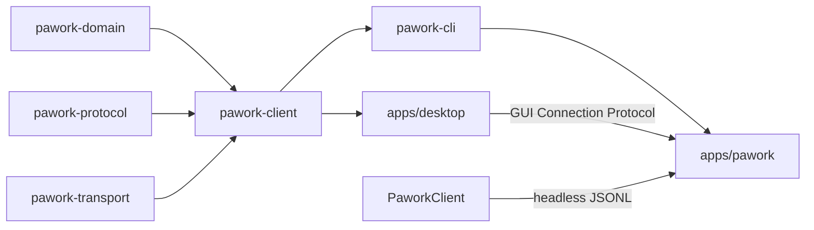

# pawork-client Review

> GUI Connection Protocol 的 typed 连接 SDK + headless JSONL SDK。8 个 src `.rs` 共 3,116 行（`lib.rs` 1,635 + headless 7 文件 1,481）+ tests/examples 3,410 行（contract 765 / client_tests 591 / probe 三件 1,127 / spawn_e2e 345 / example 582）。生产只依赖 domain/protocol/transport。被 `pawork-cli` 与 `apps/desktop` 消费——Desktop 的 **唯一业务依赖**。`SDK_API_VERSION` 跟随 `pawork_protocol::API_VERSION`（当前 **V1_19**）。

## 1. 职责与边界

做什么两块：

1. **`GuiClient`**（`src/lib.rs`）：包装 `GuiTransportClient`/`GuiConnection` 与 protocol 编解码。connect + 握手、Command/Query 往返（发送前按 registry `since` 做版本门）、Subscribe/事件（Heartbeat 屏障）、Snapshot/Resume、Ack/Heartbeat。错误一律 `ClientError`，不向调用方泄漏帧字节。
2. **headless SDK**（`src/headless/`）：spawn `pawork headless --json-stdio`，NDJSON 驱动 Host。不嵌入 Core、不实例化 Provider。

不做什么：不依赖 GUI 框架、不链接 `pawork-app`（仅 dev-dep 做契约测试）。`close`/`disconnect` **不取消**已进入 Core 的 Run。无公开 artifact-chunk 读取 API（`ServerFrame::ArtifactChunk` 只作为 UnexpectedFrame 标签出现，lib.rs:1048）。

### Spec 与源码差异（以源码为准）

- **版本口径**：protocol `API_VERSION = V1_19`、`SUPPORTED_API_VERSIONS` 至 V1_19（protocol/src/app/version.rs:107,113-115）。spec client.md §2 写 version.rs「现为 1.9」、§5 写「当前 1.10」，均过期约 9 个 minor。
- **源码内注释过期**：`headless/mod.rs` 模块文档与 `version.rs` 注释写「V2 `API_VERSION` = 1.2」，与常量 V1_19 不符（行为正确，仅注释腐化）。
- **GuiClient 文档注释**（lib.rs:227）宣称「分片读取 Artifact」，实际无该 API。
- spec §3 re-export 清单缺当前导出的 `ApprovalModeWire` / `AuthStartData` / `DefaultModelPair` / `GeneralSettingsData` / `PermissionsSettingsData` / `ProviderAuthState` / `ProviderAuthStatusData` / `ProviderAuthStatusEntry` / `ProviderCatalogState` / `ProviderCredentialStatus` / `ProviderUseProxyData` / `RoleDefaultsData` / `TerminalSettingsData` / `TimelineItemKind`（lib.rs:48-58）。
- spec §3 `SdkErrorKind` 清单缺 `Protocol(ProtocolErrorKind)` 变体（error.rs:33，`HostProtocol` / `Closed` 映射到此/Io）；`PaworkOptions` 字段清单缺 `working_dir` / `isolated` / `client_name` / `client_version`（transport.rs:38-57）。
- spec §2 行数：lib.rs ~1 280 → 实际 1,635；contract.rs ~650 → 765。spec §7 计数「41/41（lib 10）」→ 实际 lib 内联 13（新增 browser 版本门 ×2、握手错误映射、terminal/browser caps），默认死表 46。

## 2. 依赖关系

| 方向 | crate | 用途 |
| --- | --- | --- |
| 依赖 | pawork-domain | `CommandId` / `ConnectionId` / `GuiClientId` / `QueryId` / `Timestamp` |
| 依赖 | pawork-protocol | 帧编解码、握手、投影类型、headless JSONL、`TOKEN_SCHEME`、registry `since` 版本门 |
| 依赖 | pawork-transport | `LocalTransport` / `GuiConnection` / `ConnectOptions` |
| 被依赖 | pawork-cli | ops 连本机 gui serve |
| 被依赖 | apps/desktop | 唯一业务依赖：所有 GUI 命令经本 SDK |
| dev | pawork-app / storage / testkit / transport(local+memory) | 契约测试装配 Host |

| 外部 crate | 用途 |
| --- | --- |
| tokio | rt/process/io-util/sync/macros/time |
| async-trait | `Transport` |
| serde / serde_json | headless 帧 |
| thiserror | `ClientError` / `SdkError` |
| clap / tempfile（dev） | example `probe`、临时 socket |

**features**：`default = []`；`probe-self-test`、`spawn-e2e` 默认不进死表（`[[test]]` required-features 门控，Cargo.toml）。

## 3. 文件清单

| 相对路径 | 行数 | 职责 |
| --- | ---: | --- |
| src/lib.rs | 1847 | `GuiClient`、`ClientConfig`、`ClientError`、`FrameWant`、`snapshot_inflight` 串行锁、版本门、protocol/transport re-export、14 内联测试 |
| src/headless/mod.rs | 88 | SDK 门面、稳定面、`experimental` / `reexport` |
| src/headless/client.rs | 766 | `PaworkClient`、hello、高层 session/run API、`reader_loop` |
| src/headless/transport.rs | 183 | `Transport` / `PaworkOptions` / `StdioTransport` |
| src/headless/error.rs | 147 | `SdkError` / `SdkErrorKind`（`as_str` 冻结） |
| src/headless/mock.rs | 147 | `MockTransport` |
| src/headless/stream.rs | 111 | `EventSubscription` / `BackpressurePolicy` |
| src/headless/version.rs | 39 | `SDK_VERSION` / `SDK_API_VERSION` |
| tests/client_tests.rs | 591 | headless × MockTransport 22 |
| tests/contract.rs | 765 | GuiClient UDS 契约 9 |
| tests/probe.rs | 15 | feature 门：转发 scenarios（单测断言 13 场景全绿） |
| tests/probe/harness.rs | 256 | probe 装配 |
| tests/probe/scenarios.rs | 856 | 13 场景 |
| tests/spawn_e2e.rs | 345 | feature 门：真进程 3 |
| examples/probe.rs | 582 | 手工 probe 二进制（--connect / --live-two-gui / --live-pty / --token） |

fixtures：`tests/fixtures/` 5 个（`hello_ack.json`（1.9 fixture，握手回归断言协商 1.9）/ `session_response.json` / `error_frames.json` / `run_events.jsonl` / `compat_import_response.json`）。

## 4. 类型与方法功能列表

### 4.1 GuiClient（lib.rs）

| 名称 | 种类 | 功能 / 语义 |
| --- | --- | --- |
| `ClientConfig` | struct | `timeout` 默认 10s；`client_name` 默认 `gui-client`；`client_version` 默认 `CARGO_PKG_VERSION`；caps 默认 Events+Snapshots+Approvals；`supported_api_versions` = `SUPPORTED_API_VERSIONS` |
| `SessionInfo` | struct | handle / client_id / connection_id / capabilities / `host_data_dir`（握手原样透传）/ 初始 `ResumeDisposition` |
| `ResumeOutcome` | struct | disposition + replayed 事件 + 可选 snapshot |
| `ClientErrorKind` | enum | Transport / Codec / HandshakeRejected / Protocol / Version / Timeout / Disconnected / ProtocolViolation / Internal |
| `ClientError` | enum | Transport / Codec / HandshakeRejected / Protocol / Version / Timeout / Disconnected / `UnexpectedFrame { context, found }`（kind → ProtocolViolation）/ Internal。`kind` / `is_retryable`（Transport.retryable、Protocol.retryable、Timeout、Disconnected）/ `is_auth_failure` / `is_incompatible_version` / `is_request_not_found` / `is_replay_unavailable`。无原始帧 |
| `GuiClient` | struct | Clone；单连接 `io` 互斥，禁止事件泵与 command 并发 `receive` |

连接与握手：

- `connect` / `connect_with_config`：传输连接 + `request_id="handshake"`。获授 Snapshots ⇒ 等首帧 Snapshot；否则不等。连接级 Error 在握手阶段映射 `HandshakeRejected`、首帧 Snapshot 阶段映射 `Protocol`。
- `connect_with_resume` / `connect_with_resume_config`：按 `last_global_sequence` 补缺失事件，返回 `(client, Option<ResumeOutcome>)`。

自动 request_id = `gui-cmd-`/`gui-query-` + client_id + request_namespace + counter（lib.rs:488-492,530-534）。namespace = `{pid:x}-{nanos:x}-{seq:x}`（`new_request_namespace`，lib.rs:1066-1073：进程级 static `AtomicU64` + 纳秒 + pid）。Host 重启后 server-assigned client_id 会从 `client-0` 重计；没有 namespace 会把新进程请求误判为旧幂等重放。显式 `command_envelope` 的 id 不改写。

**发送前版本门**（`reject_if_newer_than_negotiated`，lib.rs:250-262）：`command_envelope` / `query_envelope` 查 registry `since`，命令所需 minor 高于协商值即 `ClientError::Version` 拒发（如 browser 命令在 minor 17 拒绝，内联回归 ×2）——新命令不会发到旧 Host 上。

请求面：`command` / `command_envelope` / `query` / `query_envelope` / `subscribe` / `subscribe_all` / `unsubscribe` / `next_event` / `next_event_timeout` / `snapshot` / `resume` / `ack` / `heartbeat` / `heartbeat_with_nonce` / `close` / `disconnect`（幂等）。读取器：`info` / `handle` / `client_id` / `connection_id` / `api_version` / `capabilities` / `initial_snapshot` / `connection_info` / `is_connected` / `last_acked_sequence`。

**`FrameWant`（私有，改动即协议泵语义）**

| 变体 | 匹配 |
| --- | --- |
| `Event` | `ServerFrame::Event` **或** `Error` 且 `request_id=None`（连接级错误）。带 request_id 的 Error **不得**被事件泵抢走 |
| `Response(id)` | 同 request_id 的 Response 或 Error |
| `Snapshot(id)` | Snapshot，或同 id Error。**Snapshot 帧载荷无 request_id**（线上三种来源形态一致），任意匹配会互取并发请求的快照；`snapshot()`/`resume()` 已共用 `snapshot_inflight` 锁串行化往返（2026-09-18），根治需 wire 补 request_id（登记 backlog） |
| `Resume(id)` | Resume 同 id；途中 Snapshot/Event 也匹配（补发；越界实时事件 stash 回 inbox） |
| `Pong(nonce)` | 对应 nonce |
| `SubscriptionBarrier { request_id, nonce }` | 同 nonce 的 Pong，或同 request_id Error。Subscribe/Unsubscribe 用 Heartbeat 作有序屏障：先订阅后回 Pong，request-scoped Error 先于 Pong 到达即订阅失败 |

不匹配帧进 inbox stash。自动回 Pong。Timeout **cancel-safe**（transport 半帧进度留在连接内），不毒化流。`recv_frame` 握手后校验信封 `api_version`（ADR-036），漂移 → `ClientError::Version`；对端关闭映射 `Disconnected`。

根 re-export：protocol 的 AppCommand/Query/Event/Snapshot/Timeline 家族、Settings/Auth/Quota/Provider 载荷（见 §1 差异清单）+ `LocalTransport` / `ConnectOptions` / `GuiTransportClient` / `TransportEndpoint` / `TOKEN_SCHEME` / `projection`。Desktop 应只经本 crate 碰这些类型。

### 4.2 headless 门面（mod.rs / version.rs）

| 名称 | 种类 | 功能 / 语义 |
| --- | --- | --- |
| 稳定面 | 约定 | `PaworkClient` / `PaworkOptions` / `EventSubscription` / `SdkError` / `Transport` / `MockTransport` |
| `experimental::CompatOutcome` | struct | compat 导入结果，可能不发 major 就改 |
| `reexport` | mod | 常用协议类型（AppCommand/AppEvent/RunState 等） |
| `SDK_VERSION` | const | `CARGO_PKG_VERSION` |
| `SDK_API_VERSION` | const | `pawork_protocol::API_VERSION`（当前 **V1_19**；模块文档里的 1.2 是过期注释） |
| `SDK_SUPPORTED_API_VERSIONS` | const | 跟随 protocol |
| `sdk_version_string` | fn | `pawork-sdk {SDK_VERSION} (protocol {SDK_API_VERSION:?})` |
| `spawn_pawork` | fn | `PaworkClient::spawn` 别名 |

### 4.3 PaworkClient（headless/client.rs）

| 名称 | 种类 | 功能 / 语义 |
| --- | --- | --- |
| `spawn` / `from_transport` | async fn | spawn 子进程或注入 `Transport`；hello/ack，major 不兼容 → `IncompatibleApiVersion` |
| `api_version` / `instance_id` / `capabilities` / `is_open` / `unmatched_error_count` | 访问器 | 握手后状态 |
| `send` / `command` / `query` | async fn | 往返；id 前缀 `cmd`/`qry` |
| `create_session` / `open_session` / `fork` / `fork_session` | async fn | 会话 |
| `run_start` / `run_status` / `cancel` / `run_retry` | async fn | Run |
| `list_workspaces` | async fn | raw query |
| `subscribe` / `unsubscribe` / `resume` | async fn | 事件流 |
| `import_compat` / `compat_history` | async fn | 实验面兼容导入 |
| `close` | async fn | 关传输；取消 in-flight SDK 请求（不取消 Host 内 Run） |
| `translate_request` | fn | `HeadlessRequest` → Host 命令 |
| `SessionView` / `RunView` / `CancelOutcome` / `CompatOutcome` / `CompatHistoryPage` | struct | 高层视图 |

**`reader_loop`（私有）**：按 request_id 路由响应。无 id 的 error **只**尝试 pending `"hello"`，否则 `unmatched_errors += 1`，**绝不**送给当时唯一的业务 pending（「事件泵抢命令错误帧」的 headless 对应修复）。

### 4.4 transport / mock / stream / error

| 名称 | 种类 | 功能 / 语义 |
| --- | --- | --- |
| `Transport` | trait | `write_line` / `read_line` / `flush` / `close` / `is_open`。`&self` 内部互斥，reader 与发送方不互相饿死 |
| `PaworkOptions` | struct | `binary`：`PAWORK_BIN` 或 `pawork`；默认 args `headless --json-stdio`；`working_dir`；`env`；`isolated`（不继承父进程环境，e2e 防本机 key 污染）；timeout 10s；`client_name`/`client_version`；caps 五项与 Host `HOST_CAPABILITIES` 对齐 |
| `StdioTransport` | struct | 子进程 stdin/stdout JSONL 管道 |
| `MockTransport` | struct | `push_response` / `push_responses` / `push_event` / `fail_next_read` / `sent_lines` / `sent_count` / `assert_sent_json` |
| `BackpressurePolicy` | enum | `Drop`（计数）/ `Error`（`SdkErrorKind::Backpressure`） |
| `EventSubscription` | struct | 有界通道；`next_event` / `try_next` / `dropped_events` / `stream_label` |
| `SdkErrorKind` | enum | Spawn / Io / MalformedFrame / UnknownResponseType / UnsupportedCapability / IncompatibleApiVersion / RequestFailed / Backpressure / Cancelled / Timeout / **`Protocol(ProtocolErrorKind)`**。`as_str` **冻结**。`is_retryable`：Spawn/Io/Timeout |
| `SdkError` | enum | 上述 + `HostProtocol { kind, message }`（`from_error_frame`）/ `Closed(String)`（kind() → Protocol/Io） |

## 5. 关键行为与契约

- 版本协商：major 相同取最高共同 minor；不兼容显式拒绝。后续帧信封漂移 → `ClientError::Version`；发送前 registry `since` 版本门拒发旧 minor 不支持的新命令。
- `FrameWant::Event` 只吃 `request_id=None` 的 Error，否则命令等待方超时误报 Disconnected。
- 自动 request_id 必须含 `request_namespace`（pid+纳秒+进程级序号），避免 Host 重启撞幂等账本。
- `close` 不取消 Core Run。
- 无公开 artifact-chunk API（lib.rs:227 doc 注释宣称「分片读取 Artifact」与实际不符）。
- headless 无 id error 只给 hello。
- `SdkErrorKind::as_str` 标签稳定，测试钉死。
- probe / spawn_e2e 默认不编译（required-features）。

## 6. 测试资产

| 文件 | 数量 | 验证点 |
| --- | ---: | --- |
| src/lib.rs | 13 | namespace 不重复、FrameWant 按 request_id 分流、版本漂移、timeout cancel-safe、握手拒绝、browser 命令旧 minor 拒发 ×2、terminal/browser caps、握手与首帧 Snapshot 的连接级 Error 映射 |
| src/headless/version.rs | 2 | 版本常量跟随 protocol |
| tests/client_tests.rs | 22 | hello 三态、往返 framing、无 id error 不误路由、背压 Drop/Error、fork+resume、compat、close 取消 in-flight、`as_str` |
| tests/contract.rs | 9 | 真 UDS：握手（`host_data_dir` 透传）、command、subscribe（未获 Events 报 PermissionDenied 不污染 Heartbeat）、resume、版本拒绝、断线不取消 Run、ack/heartbeat |
| tests/probe.rs + harness/scenarios | 13 场景 | feature `probe-self-test`；session-events、snapshot-reconnect、resume 降级、三 GUI 同步、command-idempotency、terminal-gate、artifact-chunks fail-closed、version-reject、disconnect-keeps-run、quota-alert roundtrip、diff-list/get、mcp-list |
| tests/spawn_e2e.rs | 3 | feature `spawn-e2e`，真 `pawork` 进程（无 headless 子命令 SKIP） |
| examples/probe.rs | 手工 | 本地 probe |
| tests/fixtures/* | 5 JSON/JSONL | hello_ack（1.9）/ session_response / error_frames / run_events / compat_import |

默认验证：`cargo test -p pawork-client --offline --lib --tests`（当前合计 46：lib 13 + version 2 + client_tests 22 + contract 9）。

## 7. 协作关系

Desktop 禁止依赖 app/cli/control-plane；所有 Host 访问经本 crate。headless SDK 与 GuiClient 共享「不取消 Run、错误结构化、不泄漏帧字节」约定，传输分别是 JSONL stdio 与分帧 UDS；线程模型不同（GuiClient 无后台读任务，headless 有 `reader_loop`），集成时勿混淆。
