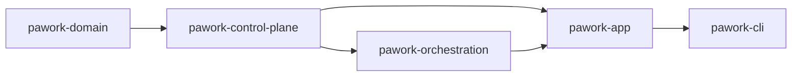

# pawork-control-plane Review

> 单机优先的控制面：tenant/identity、usage ledger、audit JSONL、quota 投影、credential lease/pool。16 个 `.rs` 文件、13,857 行 src；主模块 `usage`（2,832）/ `quota/service`（2,634）/ `credential/mod`（2,264）。无 `tests/` 目录，回归全部内联（205 个 `#[test]`/`#[tokio::test]`）；fixture `fixtures/audit/event-v1.jsonl`。

## 1. 职责与边界

做什么：把用量记账、审计事件、租户策略与 RBAC、配额读取、凭证租约做成只依赖 `pawork-domain` 的控制面内核。SQLite usage ledger **自开 rusqlite 连接**（feature `sqlite`，默认开），不经 `pawork-storage` DatabaseActor。

不做什么：不持有明文 Secret；不实现远端 Provider 配额适配器与 RefreshScheduler（冻结候审）；不走 GUI / `pawork-policy` 工具审批。`TenantPolicyDecision` 不是 `pawork_policy::PolicyDecision`（tenant.rs:68 定义、lib.rs:31 根导出；审计通道用 decision.rs:55 的 `PolicyDecisionKind`/`PolicyDecisionEvent`——spec §8 该表述仍准确）。V1 account-control-v1 九模块、binding/schema、OTel exporter 已归档，本 crate 没有对应 feature。

下游：`pawork-app` 默认开 sqlite 注入 UsageLedger / TenantPolicyEngine / AuditStore / CredentialPool / QuotaService；`pawork-orchestration` 关 default features，只用类型与 trait。

### Spec 与源码差异（以源码为准）

- Spec §3 credential 写 `LegacyCredentialPicker`「默认按账号同名派生」；源码 `pick` **恒返回** `CredentialId::new("default")`（credential/mod.rs:419-433，注释「始终返回合成 default 凭据（legacy 单凭据回退）」）。建议新表述：「`LegacyCredentialPicker`：legacy 单凭据回退，`pick` 恒返回合成 `default` 凭据，不按账号派生；接入 repository 后由真实选择器替换」。
- Spec §4 写引擎「按 TenantId 取策略（无则用构造时的默认策略）」；源码 `policy()` 未知租户返回 `TenantPolicy::default()`（全 `None` = 不限制，tenant.rs:279-285），构造默认策略只播种 `DEFAULT_TENANT`（tenant.rs:254-257）；`InMemoryTenantPolicyEngine::default()` 的 agents=8 / requests=16 只落在 `local/default`。建议新表述：「未知租户返回 `TenantPolicy::default()`（不限制）；构造时的默认策略仅播种 `DEFAULT_TENANT`」。
- Spec §3 quota domain 写「`QuotaUnit`：`Count` / `Token` / `Cost`」，漏 `Percent`；源码 quota/domain.rs:68-78 有 `Percent`（整数百分点，仅权威远端来源），spec §4 又在讨论 Percent 拒绝语义，前后不一致。建议 §3 改为：「`QuotaUnit`：`Count` / `Token` / `Percent`（整数百分点）/ `Cost { currency }`」。
- Spec §7 写「约 245 个内联测试」且 `credential/lease.rs`（9）；实际合计 **205**：`quota/ledger.rs` 实为 **29**（spec 写 28）、`credential/lease.rs` 实为 **8**（spec 的 9 把 lease.rs:778 注释里的 `#[tokio::test]` 字样也计入了；spec 自身分项加总也只有 205，与 245 的总数自相矛盾）。
- `quota::util` 多数函数是 `pub`，但 `mod util` 私有，crate 外不可见。`QuotaRead` / `QuotaOverview` / `WindowRead` / `ScopeMatch` / `QuotaFailure` 走 `quota::service::`，不在 `quota::` re-export（`quota::` 只 re-export `QuotaService`/`QuotaClock`/`CacheRead`/`CacheOverview`）。
- `merge_dual_failures` 是 `pub(crate)` 且 dead code（error.rs:173）：远端适配器冻结，生产无调用方，仅测试引用。

改动时保持：credential / quota 类型不进 crate 根 re-export；audit JSONL golden 字节级冻结；lease 状态机单向；usage 去重索引语义；secret 不进任何视图。

## 2. 依赖关系

| 方向 | crate | 用途 |
| --- | --- | --- |
| 依赖 | pawork-domain | 全部 opaque ID、`Timestamp`、`ResolvedCredential`、`CredentialId` |
| 被依赖 | pawork-app | 默认 sqlite：装配账本 / 策略 / 审计 / 租约池 / QuotaService |
| 被依赖 | pawork-orchestration | `default-features=false`：租约 / 策略 / 用量类型，不拉 rusqlite |

| 外部 crate | 用途 |
| --- | --- |
| async-trait | UsageLedger / CredentialPool / QuotaAdapter / TenantPolicyEngine 等异步 trait |
| serde / serde_json | 记录、事件、策略、配额快照 |
| thiserror | 各 `*Error` |
| tracing | 租约 Drop/释放、策略更新、用量补 ID 等调试与错误日志 |
| tokio（sync/rt/macros/time） | 租约 Drop 释放、quota singleflight、测试 runtime |
| url | endpoint 清洗 |
| rusqlite（optional） | `SqliteUsageLedger` |
| futures | 异步组合 |
| tempfile / proptest（dev） | 临时库、lease 属性测试 |

**features**：`default = ["sqlite"]`；`sqlite = ["dep:rusqlite"]`。无其它 feature。

## 3. 文件清单

| 相对路径 | 行数 | 职责 |
| --- | ---: | --- |
| src/lib.rs | 43 | 8 个 pub mod；根 re-export audit/decision/identity/rbac/tenant/usage；sqlite 门控 `SqliteUsageLedger`+`SCHEMA_VERSION` |
| src/identity.rs | 219 | 哨兵 ID、`IdentityContext`、fail-closed 解析器 |
| src/decision.rs | 276 | `PolicyGate` / `PolicyDecisionEvent` / `sanitize_reason` |
| src/rbac.rs | 292 | 角色、权限、deny-first 合并、导出策略 |
| src/tenant.rs | 936 | `TenantPolicy`、引擎、9 个 `decide_*` |
| src/audit.rs | 466 | `AuditEventV1` JSONL 存储（golden 测试 :440） |
| src/usage.rs | 2,832 | 用量账本（内存 + SQLite，dedup 索引 :812-814） |
| src/credential/mod.rs | 2,264 | 池 / 租约公开 API、`InMemoryCredentialPool` |
| src/credential/lease.rs | 842 | 冻结状态机、投影 sink |
| src/quota/mod.rs | 34 | re-export；`util` 私有 |
| src/quota/adapter.rs | 121 | `QuotaAdapter` / `AdapterKind` |
| src/quota/domain.rs | 371 | canonical 配额类型（含 `QuotaUnit::Percent` :68-78） |
| src/quota/error.rs | 543 | `QuotaError` + `merge_dual_failures`（pub(crate) dead code） |
| src/quota/ledger.rs | 1,365 | LocalLedger 派生与远端增量对账（Percent 全路径拒绝） |
| src/quota/service.rs | 2,634 | 缓存 / singleflight / overview |
| src/quota/util.rs | 619 | UTC 日历 + 脱敏（crate 内，`#![allow(dead_code)]` :4） |
| fixtures/audit/event-v1.jsonl | 1 | audit JSONL golden |

## 4. 类型与方法功能列表

### 4.1 lib.rs

根导出 identity / decision / rbac / tenant / usage / audit。**不**根导出 credential、quota。sqlite 时额外导出 `SqliteUsageLedger`、`SCHEMA_VERSION`。同时 re-export domain 的 ID 类型，调用方可只依赖本 crate。

### 4.2 identity.rs

| 名称 | 种类 | 功能 / 语义 |
| --- | --- | --- |
| `DEFAULT_TENANT` | const | `"local/default"`。禁止改成 quota 哨兵 `"local"` |
| `DEFAULT_PRINCIPAL` | const | `"local/user"` |
| `default_tenant` / `default_principal` | fn | 哨兵值的 `TenantId` / `PrincipalId` |
| `IdentityContext` | struct | `tenant_id` + `principal_id`。`local` / `new` / `try_new` / `validate` / `is_local_default`。`Default` = `local()`，生产请求路径禁止用 Default 冒充身份 |
| `IdentityError` | enum | `MissingIdentity` / `EmptyPrincipal` / `EmptyTenant`。一律 fail-closed |
| `IdentityResolver` | trait | `resolve(Option<&str>)`。`None` 必须报错 |
| `LocalIdentityResolver` | struct | tenant 恒为 default；principal 保留协议层值（`automation:scheduler` 不折叠）。空 / None 拒绝 |

### 4.3 rbac.rs

| 名称 | 种类 | 功能 / 语义 |
| --- | --- | --- |
| `PrincipalRole` | enum | `Admin`(4) / `User`(3) / `Service`(2) / `Viewer`(1，Default)。`as_str` 冻结；`permissions` / `allows` / `merge_deny_first`（取更低 rank） |
| `Permission` | enum | `AgentSpawn` / `RouteCandidate` / `LeaseAcquire` / `SessionRead` / `UsageRead` / `AuditRead` / `AuditExport` / `PolicyManage`。`as_str` 冻结 snake_case |
| 角色权限表 | 约定 | Admin=全部 8；User=无 Export/Manage；Service=spawn/route/lease/usage；Viewer=session+usage |
| `PermissionProfile` | struct | `effective_role`：两边都有则 deny-first 合并；none+none → `None`（调用方按最受限处理） |
| `AuditExportPolicy` | struct | `enabled` 默认 false；空 destinations = 无目标可导出 |

未知非 local 租户无 profile → Viewer；`local/default` 无 profile → **Admin**（tenant.rs:467）。

### 4.4 tenant.rs

| 名称 | 种类 | 功能 / 语义 |
| --- | --- | --- |
| `TenantPolicy` | struct | 全 `Option`：并发上限、三类 daily budget、白名单、permission_profile、retention_days、audit_export。`None`=不限制；`Some([])` = 全拒 |
| `TenantPolicyDecision` | enum | `Allow` / `Deny` / `Limit` / `Fallback`。与 `pawork_policy::PolicyDecision` 不同名 |
| `ConcurrencyKind` / `BudgetDimension` | enum | Agents/Requests；Tokens/Cost |
| `TenantPolicyError` | enum | ConcurrencyExceeded / BudgetExceeded / ModelNotAllowed / ProviderNotAllowed / AccountNotAllowed / PermissionDenied / AuditExportDenied |
| `TenantPolicyEngine` | trait | `policy` / 9 个 `check_*` / `set_policy` / `policy_version` / `principal_role` / `record_decision` / `decisions`。锁不跨 await |
| `InMemoryTenantPolicyEngine` | struct | `new(default)` 只播种 `DEFAULT_TENANT` version=1；`Default` agents=8、requests=16；**`policy()` 未知租户 → `TenantPolicy::default()`（不限制）**（:279-285）；决策环 1024 |
| `decide_*`（9 个纯函数） | fn | 并发 `current >= max` → Deny；白名单 None 不限制；retention 超龄 → **Limit**；权限按角色表；budget 三维各自判定 |

### 4.5 decision.rs

| 名称 | 种类 | 功能 / 语义 |
| --- | --- | --- |
| `PolicyGate` | enum | 9 点：RouteCandidate / LeaseAcquire / AgentSpawn / RequestAdmission / SessionQuery / UsageQuery / AuditQuery / AuditExport / Retention。`as_str` 冻结 |
| `PolicyDecisionKind` | enum | Allow / Deny / Limit / Fallback |
| `PolicyDecisionEvent` | struct | `new` 强制 `sanitize_reason`；`kind_of(&TenantPolicyDecision)` |
| `sanitize_reason` | fn | 控制字符→空格；连续 `[A-Za-z0-9_-]{>=20}` → `***`；折叠空白；超 512 截断加 `…`。确定性 |

### 4.6 audit.rs

| 名称 | 种类 | 功能 / 语义 |
| --- | --- | --- |
| `AUDIT_SCHEMA_VERSION` | const | `1` |
| `AuditAction` | enum | 14 变体（IdentityResolved … AuditExported） |
| `AuditDecision` | enum | Allow / Deny / Limit / Fallback / Observe / Error |
| `AuditTargetKind` | enum | 11 变体 |
| `AuditDimensions` | struct | 可选 session/agent/provider/account/client_id/trace_id |
| `AuditEventV1` | struct | `new` / `with_dimensions` / `validate`（`safe_label`：alnum/_-.:/ ≤256）。无 prompt/secret/tool_output 字段 |
| `AuditSink` / `AuditStore` | trait | append 唯一写入口；query_tenant / replay |
| `InMemoryAuditStore` / `FileAuditStore` | struct | 内存重复 event_id 拒绝；JSONL 一行一条 `\n` 结尾，create+append+sync_data 之后才接受写入；golden 字节级比对（:440-443 include_str fixture） |
| `AuditError` | enum | UnsupportedSchema / UnsafeLabel / DuplicateEvent / Io / Json / CorruptLine |

改 `AuditEventV1` 字段或 serde 形状必须先改 `fixtures/audit/event-v1.jsonl`。

### 4.7 usage.rs

| 名称 | 种类 | 功能 / 语义 |
| --- | --- | --- |
| `RECORD_VERSION` | const | `2`；旧 JSON 缺 `version` 解码为 1 |
| `AUTO_RECORD_ID_PREFIX` | const | `"auto-rec-"`；显式 ID 不得占用 |
| `UsageRecord` | struct | 身份 + run 归属 + 计量（四类 token + cost_micros + currency）+ v2 trace（request_id/event_id/upstream_attempt/trace_id）+ 定价快照 |
| `UsageQuery` / `UsageTotals` | struct | 九类过滤构造器（半开区间）；`add` **饱和**累加；跨币种未过滤 → MixedCurrencies |
| `UsageLedger` | trait | `record`（幂等）/ `query` / `aggregate`。Storage 错误 fail-closed 不降空集 |
| `InMemoryUsageLedger` | struct | 空 `record_id` 自动补 `auto-rec-*`（legacy 测试便利）；sqlite 拒绝空 ID |
| `SqliteUsageLedger` | struct | `Mutex<Connection>`；WAL + synchronous=NORMAL + busy_timeout 5s；`SCHEMA_VERSION = 3`（:689） |
| 去重契约 | 冻结 | PK `(tenant_id, account_id, record_id)` + 部分唯一索引 `idx_usage_dedup ON (tenant, account, request_id, COALESCE(upstream_attempt,'0')) WHERE request_id IS NOT NULL`（:812-814）；登记断言测试 :2816-2823；约束冲突后事务内重读判重放/Conflict/Storage |

token/cost 列 TEXT 存避免溢出；v2→v3 迁移保历史。与 storage DatabaseActor 两条独立连接。

### 4.8 credential/lease.rs

| 名称 | 种类 | 功能 / 语义 |
| --- | --- | --- |
| `LEASE_SCHEMA_VERSION` | const | = `CONTROL_PLANE_SCHEMA_VERSION`（2），对齐 app-database |
| `LeaseState` | enum | Requested → Acquired → Released \| Expired → Reclaimed。`holds_slot` 仅 Acquired；`is_terminal` 仅 Reclaimed；`as_db_str`/`from_db_str` 冻结 |
| `LeaseRecord` | struct | 版本化、无 secret；`open`（Acquired v2 + 两事件）/`release`/`expire`/`reclaim`/`to_public_lease`；非法迁移 `LeaseTransitionError` |
| `LeaseEvent` | enum | Requested/Acquired/Released/Expired/Reclaimed，带 lease_id + version |
| `LeaseClock` | trait | `SystemLeaseClock` / `FixedLeaseClock`（:393-415） |
| `LeaseProjection` | trait | apply / settle / load_outstanding；Null / InMemory 实现 |
| `ReclaimReport` | struct | 回收扫描计数 |

纯领域、无 I/O 无 await。

### 4.9 credential/mod.rs

| 名称 | 种类 | 功能 / 语义 |
| --- | --- | --- |
| `LeaseOutcome` | enum | Completed / Cancelled（不惩罚健康）/ Failed（连续失败 +1）/ Released |
| `AcquireRequest` | struct | tenant/principal/session/agent + 可选 provider/account/trace。account 缺省 `local/default` |
| `CredentialLease` | struct | **无 secret**；credential_id 仅定位符 + TTL 窗口 + version |
| `PoolError` | enum | NoCandidate / ConcurrencyExhausted / TenantConcurrencyExhausted / TenantDenied / Projection。无等待队列 |
| `CredentialPool` | trait | acquire / acquire_guard / release（幂等）/ active_count（legacy）/ account_health / active_count_for / account_health_for / reclaim_expired / lease_state / restore |
| `LeaseGuard` | struct | RAII。Drop：poll 同步；Pending → detached tokio（无 runtime 则 current_thread 线程）。durable-first：投影失败仍保持 Acquired |
| `CredentialPicker` | trait | 从 (tenant, account, provider) 选 CredentialId |
| `LegacyCredentialPicker` | struct | **恒 `"default"`**，不是按账号同名派生（:419-433） |
| `PoolConfig` | struct | per-account 上限 + 可选 tenant cap + TTL + account override；`max_for`：override > 默认 |
| `LeaseIdGenerator` | struct | system() = boot-seq + wall-ns + pid + counter |
| `InMemoryCredentialPool` | struct | new / with_config / with_clock / with_projection / build(_with_generator) / recover_records。崩溃恢复：过期 Acquired → Expired 再 Reclaimed |

### 4.10 quota/

**adapter.rs**：`AdapterKind` = ApiKeyApi / OAuthApi / WebScrape / LocalLedger。`QuotaAdapter`：kind / supports / fetch（cancel-safe）。Secret 只在 fetch 边界以 `ResolvedCredential` 注入（Debug 脱敏、无 Serialize）。

**domain.rs**

| 名称 | 种类 | 功能 / 语义 |
| --- | --- | --- |
| `QuotaScope` | struct | tenant + account + provider + 可选 model/credential_id |
| `QuotaWindow` | enum | Overall（默认）/ Rolling5h / Weekly / Monthly |
| `QuotaUnit` | enum | Count / Token / **Percent（整数百分点，仅权威远端来源，:72-73）** / Cost { currency } |
| `QuotaMeasure` | enum | Exact(u64) / Infinite / Unknown（默认） |
| `QuotaValues` / `Confidence` | — | used/limit/remaining 三态；Exact(3) > Derived(2) > Scraped(1，默认最低可信) |
| `QuotaReset` / `QuotaProvenance` | — | 绝对/相对/Unknown；endpoint 清洗 query/fragment，异常输入拒绝且不泄漏 |

**error.rs**：十变体；`retryable` 仅 Timeout/Transient/RateLimited；`detail` 必须已脱敏。`merge_dual_failures`（:173，pub(crate)）优先级 Cancelled > Unauthorized > ReauthorizationRequired > Forbidden > RateLimited > Timeout > Transient > Parse > Unsupported > Other；retry_after 取 max。生产无调用（远端适配器冻结）。

**ledger.rs**：`LedgerQuotaAdapter` 直接消费 `UsageLedger`（new / with_budget）。窗口起点 UTC。`reconcile` 用本地 delta overlay 远端 used（Percent 显式拒绝 :143）。`supports`/`fetch`/`predict_exhaustion` 对 Percent 全路径拒绝（:222/286/319，UI-6b G2：Go 权威读数在 app 按需读取，不经本地快照发布）。无 budget 时 limit/remaining = Unknown。

**service.rs**

| 名称 | 种类 | 功能 / 语义 |
| --- | --- | --- |
| `QuotaClock` | trait | SystemQuotaClock / MutableQuotaClock（测试拨表）（:45-…） |
| `ScopeMatch` | struct | any / for_provider / matches |
| `QuotaFailure` / `QuotaRead` / `WindowRead` / `QuotaOverview` | — | 部分失败不掩盖成功；`served_stale` 标记 |
| `CacheRead` / `CacheOverview` | — | cache-only 判读；走 `quota::` re-export |
| `QuotaService` | struct | new（TTL 30s）/ with_ttl（0 = 永不 fresh）/ register / invalidate / cache_size / set_ledger_reconciler / publish_local_snapshot（仅 LocalLedger/Derived，:790-804）/ cached_snapshots_for_scope / read(_with_credential) / overview(_with_credential) / read_cache_only / overview_cache_only |

读路径：cache hit → 返回；否则 singleflight leader fetch。leader drop 时 `LeaderGuard` 标记 leaderless，follower 晋升（`SINGLEFLIGHT_MAX_PROMOTIONS=8` 上界）。stale 只在 fresh 失败且有旧缓存时返回。overview 按 Confidence 择优。

**util.rs**（私有）：`now_millis`、UTC 民用历换算、`redact_endpoint` / `redact_secrets`、`canonical_endpoint`。模块 `#![allow(dead_code)]`（:4），给冻结远端适配器预留。

## 5. 关键行为与契约

- **单机哨兵**：`local/default` + `local/user`（ADR-038 D1）。池默认账号同为 `local/default`。
- **fail-closed**：身份缺失、账本 Storage、跨币种聚合、audit 校验失败、投影失败——显式错误，不静默降级。
- **usage 去重冻结**：PK + `idx_usage_dedup`（含 COALESCE 折叠与部分索引条件）；append-only；并发竞态事务内重读兜底。
- **audit JSONL golden 冻结**：与 fixture 逐字节一致；禁止 prompt/secret/tool_output。
- **lease 状态机冻结**：单向；`holds_slot` 只 Acquired；版本单调 + 事件可回放。
- **无 secret**：Lease/Record/audit/quota 视图均无明文；endpoint 去 query/fragment；`ResolvedCredential` 不可序列化（结构性保证）。
- **quota**：stale 必须带 `served_stale`；singleflight abort-safe；Percent 不进本地派生/对账/预测；时间全 UTC。
- **质量观察**：`QuotaClock` 与 `LeaseClock` 两套平行时钟 trait（service.rs:45 / lease.rs:393，各 ~25 行，System/Mutable 与 System/Fixed）——spec §3 已声明有意独立（宿主可 cross-wiring），量小可接受；若出现第三套再提炼公共时钟抽象。credential pool / quota service 无平行实现（前者并发准入、后者缓存聚合，职责不同）。`SqliteUsageLedger` 的 `Mutex<Connection>` 同步互斥是已知限制（spec §8 已载）。

## 6. 测试资产

无 `tests/`。内联 `#[test]`/`#[tokio::test]` **205**：

| 文件 | 数量 | 验证点 |
| --- | ---: | --- |
| identity.rs | 5 | 哨兵、JSON roundtrip、principal 保留、fail-closed |
| decision.rs | 6 | sanitize 掩码/截断、gate/kind 标签 |
| rbac.rs | 6 | deny-first、权限表 |
| tenant.rs | 11 | 各 `decide_*` 分支 |
| audit.rs | 5 | **golden 字节比对**（:440）、validate 拒绝、重复 id |
| usage.rs | 36 | 幂等/冲突、sqlite dedup 索引登记（:2816）、双实现语义、v2→v3 迁移、跨币种、Send+Sync |
| credential/mod.rs | 27 | 并发 cap、幂等释放、Guard Drop、TTL reclaim、投影失败、recover、proptest |
| credential/lease.rs | 8 | 状态机合法/非法、open 两事件、TTL、投影 upsert（第 778 行注释含 `#[tokio::test]` 字样，勿按文本搜索计数） |
| quota/adapter.rs | 2 | serde 标签、trait 对象安全 |
| quota/domain.rs | 8 | scope 隔离、confidence、endpoint 清洗、无 secret 序列化 |
| quota/error.rs | 11 | retryable、merge 优先级/retry_after |
| quota/ledger.rs | 29 | 窗口派生、BudgetCap、reconcile、耗尽预测、Percent 拒绝 |
| quota/service.rs | 34 | TTL、singleflight、leader 中止晋升、stale、部分失败、confidence |
| quota/util.rs | 17 | UTC 闰月、脱敏 |

默认验证：`cargo test -p pawork-control-plane --offline --lib --tests`（本任务未跑）。

## 7. 协作关系

app 注入本 crate 的账本/策略/审计/租约/配额；orchestration 只消费 trait 与值类型。GUI / Desktop 不得依赖本包。
