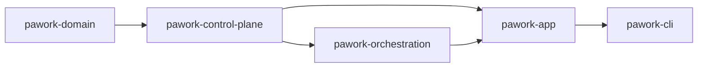

# pawork-control-plane Review

> 单机优先的控制面：tenant/identity、usage ledger、audit JSONL、quota 投影、credential lease/pool。16 个 `.rs` 文件、13,813 行 src；主模块 `usage`（2,832）/ `quota/service`（2,634）/ `credential/mod`（2,264）。无 `tests/` 目录，回归全部内联；fixture `fixtures/audit/event-v1.jsonl`。

## 1. 职责与边界

做什么：把用量记账、审计事件、租户策略与 RBAC、配额读取、凭证租约做成只依赖 `pawork-domain` 的控制面内核。SQLite usage ledger **自开 rusqlite 连接**（feature `sqlite`，默认开），不经 `pawork-storage` DatabaseActor。

不做什么：不持有明文 Secret；不实现远端 Provider 配额适配器与 RefreshScheduler（冻结候审）；不走 GUI / `pawork-policy` 工具审批。`TenantPolicyDecision` 不是 `pawork_policy::PolicyDecision`。V1 account-control-v1 九模块、binding/schema、OTel exporter 已归档，本 crate 没有对应 feature。

下游：`pawork-app` 默认开 sqlite 注入 UsageLedger / TenantPolicyEngine / AuditStore / CredentialPool / QuotaService；`pawork-orchestration` 关 default features，只用类型与 trait。

### Spec 与源码差异（以源码为准）

- Spec 写 `LegacyCredentialPicker`「按账号同名派生」；源码 `pick` **恒返回** `CredentialId::new("default")`。
- Spec 写未知租户用构造时的默认策略；源码 `TenantPolicyEngine::policy` 未知租户返回 `TenantPolicy::default()`（全 `None` = 不限制）。只有 `DEFAULT_TENANT` 被 `new` 播种；`InMemoryTenantPolicyEngine::default()` 的 agents=8 / requests=16 只落在 `local/default`。
- Spec 测计数偏旧：内联测试合计 **205**，Spec 写约 245。`usage.rs` 36、`credential/mod.rs` 27、`lease.rs` 9、`quota/service.rs` 34。
- `quota::util` 多数函数是 `pub`，但 `mod util` 私有，crate 外不可见。`QuotaRead` / `QuotaOverview` / `WindowRead` / `ScopeMatch` / `QuotaFailure` 走 `quota::service::`，不在 `quota::` re-export。
- `merge_dual_failures` 是 `pub(crate)` 且 `dead_code`：远端适配器冻结，生产无调用方。

改动时保持：credential / quota 类型不进 crate 根 re-export；audit JSONL golden 字节级冻结；lease 状态机单向；usage 去重索引语义；secret 不进任何视图。

## 2. 依赖关系

| 方向 | crate | 用途 |
| --- | --- | --- |
| 依赖 | pawork-domain | 全部 opaque ID、`Timestamp`、`ResolvedCredential`、`CredentialId` |
| 被依赖 | pawork-app | 默认 sqlite：装配账本 / 策略 / 审计 / 租约池 / QuotaService |
| 被依赖 | pawork-orchestration | `default-features=false`：租约 / 策略 / 用量类型，不拉 rusqlite |

| 外部 crate | 用途 |
| --- | --- |
| async-trait | UsageLedger / CredentialPool / QuotaAdapter / TenantPolicyEngine 等异步 trait |
| serde / serde_json | 记录、事件、策略、配额快照 |
| thiserror | 各 `*Error` |
| tracing | 租约 Drop/释放、策略更新、用量补 ID 等调试与错误日志 |
| tokio（sync/rt/macros/time） | 租约 Drop 释放、quota singleflight、测试 runtime |
| url | endpoint 清洗 |
| rusqlite（optional） | `SqliteUsageLedger` |
| futures | 异步组合 |
| tempfile / proptest（dev） | 临时库、lease 属性测试 |

**features**：`default = ["sqlite"]`；`sqlite = ["dep:rusqlite"]`。无其它 feature。

## 3. 文件清单

| 相对路径 | 行数 | 职责 |
| --- | ---: | --- |
| src/lib.rs | 43 | 8 个 pub mod；根 re-export audit/decision/identity/rbac/tenant/usage；sqlite 门控 `SqliteUsageLedger`+`SCHEMA_VERSION` |
| src/identity.rs | 219 | 哨兵 ID、`IdentityContext`、fail-closed 解析器 |
| src/decision.rs | 276 | `PolicyGate` / `PolicyDecisionEvent` / `sanitize_reason` |
| src/rbac.rs | 292 | 角色、权限、deny-first 合并、导出策略 |
| src/tenant.rs | 936 | `TenantPolicy`、引擎、9 个 `decide_*` |
| src/audit.rs | 466 | `AuditEventV1` JSONL 存储 |
| src/usage.rs | 2832 | 用量账本（内存 + SQLite） |
| src/credential/mod.rs | 2264 | 池 / 租约公开 API、`InMemoryCredentialPool` |
| src/credential/lease.rs | 842 | 冻结状态机、投影 sink |
| src/quota/mod.rs | 34 | re-export；`util` 私有 |
| src/quota/adapter.rs | 121 | `QuotaAdapter` / `AdapterKind` |
| src/quota/domain.rs | 369 | canonical 配额类型 |
| src/quota/error.rs | 543 | `QuotaError` + `merge_dual_failures` |
| src/quota/ledger.rs | 1323 | LocalLedger 派生与远端增量对账 |
| src/quota/service.rs | 2634 | 缓存 / singleflight / overview |
| src/quota/util.rs | 619 | UTC 日历 + 脱敏（crate 内） |
| fixtures/audit/event-v1.jsonl | 1 | audit JSONL golden |

## 4. 类型与方法功能列表

### 4.1 lib.rs

根导出 identity / decision / rbac / tenant / usage / audit。**不**根导出 credential、quota。sqlite 时额外导出 `SqliteUsageLedger`、`SCHEMA_VERSION`。同时 re-export domain 的 ID 类型，调用方可只依赖本 crate。

### 4.2 identity.rs

| 名称 | 种类 | 功能 / 语义 |
| --- | --- | --- |
| `DEFAULT_TENANT` | const | `"local/default"`。禁止改成 quota 哨兵 `"local"` |
| `DEFAULT_PRINCIPAL` | const | `"local/user"` |
| `default_tenant` / `default_principal` | fn | 哨兵值的 `TenantId` / `PrincipalId` |
| `IdentityContext` | struct | `tenant_id` + `principal_id`。`local` / `new` / `try_new` / `validate` / `is_local_default`。`Default` = `local()`，生产请求路径禁止用 Default 冒充身份 |
| `IdentityError` | enum | `MissingIdentity(String)` / `EmptyPrincipal` / `EmptyTenant`。一律 fail-closed |
| `IdentityResolver` | trait | `resolve(Option<&str>) -> Result<IdentityContext, IdentityError>`。`None` 必须报错 |
| `LocalIdentityResolver` | struct | tenant 恒为 default；principal 保留协议层值（`automation:scheduler` 不折叠成 `local/user`）。空 / None 拒绝 |

Session / Agent / Usage / Audit 创建查询都必须带 `IdentityContext`；不得用 API key hash 代替 tenant/principal。

### 4.3 rbac.rs

| 名称 | 种类 | 功能 / 语义 |
| --- | --- | --- |
| `PrincipalRole` | enum | `Admin`(rank 4) / `User`(3) / `Service`(2) / `Viewer`(1，Default)。`as_str` 冻结：admin/user/service/viewer。`permissions` / `allows` / `merge_deny_first`（取更低 rank） |
| `Permission` | enum | `AgentSpawn` / `RouteCandidate` / `LeaseAcquire` / `SessionRead` / `UsageRead` / `AuditRead` / `AuditExport` / `PolicyManage`。`as_str` 冻结 snake_case |
| 角色权限表 | 约定 | Admin=全部 8；User=无 Export/Manage；Service=spawn/route/lease/usage（无 session/audit）；Viewer=session+usage |
| `PermissionProfile` | struct | `default_role: Option` + `principal_roles: BTreeMap`。`effective_role`：两边都有则 deny-first 合并；none+none → `None`（调用方按最受限处理） |
| `AuditExportPolicy` | struct | `enabled` 默认 false；`allowed_destinations` 空 = 无目标可导出 |

未知非 local 租户无 profile → Viewer；`local/default` 无 profile → **Admin**（`tenant.rs` 的 `principal_role`）。

### 4.4 tenant.rs

| 名称 | 种类 | 功能 / 语义 |
| --- | --- | --- |
| `TenantPolicy` | struct | 全 `Option`：`max_concurrent_agents/requests`、三类 daily budget、`allowed_models/providers/accounts`、`permission_profile`、`retention_days`、`audit_export`。`None`=不限制；`Some([])` 白名单空 = 全拒 |
| `TenantPolicyDecision` | enum | `Allow` / `Deny { reason }` / `Limit { reason }` / `Fallback { reason }`。与 `pawork_policy::PolicyDecision` 不同名 |
| `ConcurrencyKind` | enum | `Agents` / `Requests` |
| `BudgetDimension` | enum | `Tokens` / `Cost`（输入输出 token 共用 Tokens） |
| `TenantPolicyError` | enum | `ConcurrencyExceeded` / `BudgetExceeded` / `ModelNotAllowed` / `ProviderNotAllowed` / `AccountNotAllowed` / `PermissionDenied` / `AuditExportDenied` |
| `TenantPolicyEngine` | trait | `policy` / `check_agent_concurrency` / `check_request_concurrency` / `check_model` / `check_provider` / `check_account` / `check_permission` / `check_audit_export` / `check_budget` / `set_policy` / `policy_version` / `principal_role` / `record_decision` / `decisions`。`check_*` 异步闸口；`used >= limit` 拒绝 |
| `InMemoryTenantPolicyEngine` | struct | `new(default_policy)` 只播种 `DEFAULT_TENANT` version=1；`Default` 策略 agents=8、requests=16。`policy()` 未知租户 → `TenantPolicy::default()`。决策环 `MAX_DECISIONS_PER_TENANT=1024`。锁不跨 await |
| `decide_agent_concurrency` / `decide_request_concurrency` | fn | `current >= max` → Deny；`None` 上限 → Allow |
| `decide_model` / `decide_provider` / `decide_account` | fn | 白名单 `None` 不限制；未命中 Deny |
| `decide_permission` | fn | `role.allows(permission)` 否则 Deny |
| `decide_retention` | fn | `age_days > retention_days` → **Limit**（不是 Deny） |
| `decide_audit_export` | fn | 角色缺 `AuditExport`、策略 None/disabled、目标不在白名单 → Deny |
| `decide_budget` | fn | 三维各自 `used >= limit` → Deny |

引擎 `check_*` 把 `decide_*` 映射为 `TenantPolicyError`；决策可包成 `PolicyDecisionEvent` 进审计。`policy_version` 未知租户为 0，每次 `set_policy` 递增。

### 4.5 decision.rs

| 名称 | 种类 | 功能 / 语义 |
| --- | --- | --- |
| `PolicyGate` | enum | 9 点：`RouteCandidate` / `LeaseAcquire` / `AgentSpawn` / `RequestAdmission` / `SessionQuery` / `UsageQuery` / `AuditQuery` / `AuditExport` / `Retention`。`as_str` 冻结 |
| `PolicyDecisionKind` | enum | `Allow` / `Deny` / `Limit` / `Fallback` |
| `PolicyDecisionEvent` | struct | `policy_version` / principal / tenant / gate / decision / **已脱敏** reason / `at_ms`。`new` 强制走 `sanitize_reason`；`kind_of(&TenantPolicyDecision)` |
| `sanitize_reason` | fn | 控制字符→空格；连续 `[A-Za-z0-9_-]{>=20}` → `***`；折叠空白；超 512 字截断加 `…`。确定性 |

调用方不得绕过 `new` 自己写 reason。

### 4.6 audit.rs

| 名称 | 种类 | 功能 / 语义 |
| --- | --- | --- |
| `AUDIT_SCHEMA_VERSION` | const | `1`，写入每条事件 |
| `AuditAction` | enum | 14：`IdentityResolved` / `PolicyEvaluated` / `RouteEvaluated` / `LeaseAcquired` / `LeaseReleased` / `LeaseRebound` / `AgentLifecycle` / `ApprovalEvaluated` / `ToolLifecycle` / `ClientLifecycle` / `ConfigurationChanged` / `QuotaRefreshed` / `QuotaAlerted` / `AuditExported` |
| `AuditDecision` | enum | `Allow` / `Deny` / `Limit` / `Fallback` / `Observe` / `Error` |
| `AuditTargetKind` | enum | 11：Identity / Policy / Route / Lease / Agent / Approval / Tool / Client / Configuration / Quota / Audit |
| `AuditDimensions` | struct | 可选 session/agent/provider/account/client_id/trace_id |
| `AuditEventV1` | struct | schema/event_id/occurred_at/tenant/principal/action/target/decision/reason_code + 维度 + `decision_version`。`new` / `with_dimensions` / `validate`。无 prompt/secret/tool_output 字段 |
| `validate` | method | schema 版本；`reason_code` / `client_id` / `trace_id` 走 `safe_label`（alnum/_-.:/ ≤256） |
| `AuditSink` | trait | `append(AuditEventV1)` 唯一写入口 |
| `AuditStore` | trait | `query_tenant` / `replay` |
| `InMemoryAuditStore` | struct | 测试用；重复 event_id 拒绝 |
| `FileAuditStore` | struct | `open` 先校验历史、拒重复 id，create+append+`sync_data` **之后**才接受新写入；append 同样 `writeln` + `sync_data`。JSONL 一行一条、`\n` 结尾。golden 字节级比对 |
| `AuditError` | enum | `UnsupportedSchema` / `UnsafeLabel` / `DuplicateEvent` / `Io` / `Json` / `CorruptLine` |

改动 `AuditEventV1` 字段或 serde 形状必须先改 `fixtures/audit/event-v1.jsonl`。

### 4.7 usage.rs

| 名称 | 种类 | 功能 / 语义 |
| --- | --- | --- |
| `RECORD_VERSION` | const | `2`；旧 JSON 缺 `version` 解码为 1 |
| `AUTO_RECORD_ID_PREFIX` | const | `"auto-rec-"`；显式 ID 不得占用 |
| `CostConfidence` | enum | `Estimated` / `Actual` / `Unknown` |
| `UsageAttribution` | struct | 宿主注入的 tenant/principal/account/credential/trace；账本不猜默认账号 |
| `UsageRecord` | struct | 身份（tenant/principal/account/`credential_id` opaque）+ run（session/agent/run）+ 计量（四类 token + cost_micros + currency + occurred_at_ms）+ v2 trace（request_id/event_id/upstream_attempt/trace_id）+ 定价快照（rate_card/rate_version/cost_confidence/cost_provenance） |
| `UsageTotals` | struct | 四类 token + cost_micros；`add` **饱和**累加 |
| `UsageFilterField` | enum | 查询叠加字段 |
| `UsageQuery` | struct | 构造器 `by_tenant/session/agent/credential/run/provider/model/currency/occurred_between`（半开区间），可叠加 |
| `UsageLedgerError` | enum | `InvalidRecord` / `Conflict`（幂等冲突）/ `MixedCurrencies` / `Storage`。存储错误 **fail-closed**，不降空集 |
| `UsageLedger` | trait | `record`（幂等）/ `query` / `aggregate` |
| `InMemoryUsageLedger` | struct | 空 `record_id` 自动补 `auto-rec-*`（legacy 测试便利）；sqlite **拒绝**空 ID |
| `SqliteUsageLedger` | struct | `open(path)`；`Mutex<Connection>` 整体 Send+Sync，连接本身非 Send。WAL + `synchronous=NORMAL`，`busy_timeout` 5s。`SCHEMA_VERSION = 3` |
| 去重契约 | 冻结 | PK `(tenant_id, account_id, record_id)` + 部分唯一索引 `idx_usage_dedup ON (tenant, account, request_id, COALESCE(upstream_attempt,'0')) WHERE request_id IS NOT NULL`。同 request 不同 record_id 仍冲突 |

token/cost 列以 TEXT 存，避免整数溢出。v2→v3 迁移补 `trace_id` 与 dedup 索引、保历史。与 storage DatabaseActor **两条独立连接**。

### 4.8 credential/lease.rs

| 名称 | 种类 | 功能 / 语义 |
| --- | --- | --- |
| `LEASE_SCHEMA_VERSION` | const | = `CONTROL_PLANE_SCHEMA_VERSION`（2），对齐 app-database `credential_leases` |
| `LeaseState` | enum | `Requested` → `Acquired` → `Released` \| `Expired` → `Reclaimed`。`holds_slot` 仅 Acquired；`is_settled` Released/Expired/Reclaimed；`is_terminal` 仅 Reclaimed。`as_db_str`/`from_db_str` 冻结 |
| `LeaseRecord` | struct | 版本化、无 secret。`open` 产出 Acquired v2 + Requested+Acquired 两事件。`release` / `expire` / `reclaim` / `is_past_ttl` / `to_public_lease`。非法迁移 `LeaseTransitionError` |
| `LeaseEvent` | enum | `Requested` / `Acquired` / `Released` / `Expired` / `Reclaimed`，均带 lease_id + version |
| `LeaseClock` | trait | `now_ms()`；`SystemLeaseClock` / `FixedLeaseClock` |
| `LeaseProjection` | trait | `apply(record, events)` / `settle(lease_id)` / `load_outstanding`。`NullLeaseProjection` / `InMemoryLeaseProjection` |
| `ReclaimReport` | struct | 回收扫描计数 |
| `LeaseProjectionError` | enum | 投影失败 |

纯领域、无 I/O 无 await。改状态机必须先改测试路径。

### 4.9 credential/mod.rs

| 名称 | 种类 | 功能 / 语义 |
| --- | --- | --- |
| `CONTROL_PLANE_SCHEMA_VERSION` | const | `2` |
| `LeaseId` | newtype | opaque 字符串 |
| `LeaseOutcome` | enum | `Completed` / `Cancelled`（不惩罚健康）/ `Failed`（连续失败 +1）/ `Released` |
| `AcquireRequest` | struct | tenant/principal/session/agent + 可选 provider/account/trace。account 缺省 `local/default` |
| `CredentialLease` | struct | **无 secret**；credential_id 仅定位符 + TTL 窗口 + version |
| `PoolError` | enum | `NoCandidate` / `ConcurrencyExhausted` / `TenantConcurrencyExhausted` / `TenantDenied` / `Projection`。无等待队列，额度尽立即失败 |
| `AccountHealth` | struct | active_leases / consecutive_failures / cancelled_count |
| `ReleaseReceipt` | struct | lease_id / already_released / outcome。释放幂等 |
| `CredentialPool` | trait | `acquire` / `acquire_guard` / `release` / `active_count`（legacy 聚合）/ `account_health` / `active_count_for(tenant,account)` / `account_health_for` / `reclaim_expired` / `lease_state` / `restore` |
| `LeaseGuard` | struct | RAII。`lease` / `outcome_mut` / `into_lease`（取走则 Drop 无副作用）。Drop：poll 同步；Pending → detached tokio（无 runtime 则 current_thread 线程）。**durable-first**：投影失败仍保持 Acquired |
| `DEFAULT_LEASE_TTL_MS` | const | 3_600_000（1h） |
| `CredentialPicker` | trait | 从请求选 `CredentialId` |
| `LegacyCredentialPicker` | struct | **恒** `"default"`，不是按账号同名派生 |
| `PoolConfig` | struct | per-account 默认上限、可选 tenant cap、TTL、`with_account_override`。`max_for`：account override > 默认 |
| `LeaseIdGenerator` | struct | `system()` = boot-seq + wall-ns + pid + counter；`with_prefix` / `next` |
| `InMemoryCredentialPool` | struct | `new` / `with_config` / `with_clock` / `with_projection` / `build` / `build_with_generator` / `recover_records`。崩溃恢复：过期 Acquired → Expired 再 Reclaimed |

`recover_records` / `restore` 在启动路径调用，不在 Drop 路径 await。

### 4.10 quota/

**adapter.rs**：`AdapterKind` = `ApiKeyApi` / `OAuthApi` / `WebScrape` / `LocalLedger`。`QuotaAdapter`：`kind()` / `supports(&QuotaRequest)` / `fetch(&QuotaRequest, Option<&ResolvedCredential>, &CancellationToken)`。`fetch` 必须 cancel-safe；`supports==false` 等价 Unsupported，聚合器可跳过鉴权与网络。Secret 只在 fetch 边界以 `ResolvedCredential` 注入（Debug 已脱敏、无 Serialize）。

**domain.rs**

| 名称 | 种类 | 功能 / 语义 |
| --- | --- | --- |
| `QuotaScope` | struct | tenant + account + provider + 可选 model/credential_id。隔离键 |
| `QuotaWindow` | enum | `Overall`（默认）/ `Rolling5h` / `Weekly` / `Monthly` |
| `QuotaUnit` | enum | `Count` / `Token` / `Cost { currency }` |
| `QuotaMeasure` | enum | `Exact(u64)` / `Infinite` / `Unknown`（默认） |
| `QuotaValues` | struct | used / limit / remaining |
| `Confidence` | enum | `Exact`(priority 3) > `Derived`(2) > `Scraped`(1，**默认最低可信**) |
| `QuotaReset` | enum | 绝对 / 相对 / Unknown |
| `QuotaProvenance` | struct | adapter_kind / source / endpoint（清洗 query/fragment）/ fetched_at / observed_at / selector_version / stale。`with_endpoint` / `canonical_endpoint` 异常输入拒绝且不泄漏 |
| `QuotaRequest` / `QuotaSnapshot` | struct | 读请求与聚合结果 |

**error.rs**：十变体 `Unsupported` / `Unauthorized` / `Forbidden` / `RateLimited` / `ReauthorizationRequired` / `Timeout` / `Transient` / `Parse` / `Cancelled` / `Other`。`retryable` 仅 Timeout/Transient/RateLimited。`detail` 必须已脱敏。`merge_dual_failures` 优先级 Cancelled > Unauthorized > ReauthorizationRequired > Forbidden > RateLimited > Timeout > Transient > Parse > Unsupported > Other；retry_after 取 max。生产无调用。

**ledger.rs**：`LedgerQuotaAdapter` 直接消费 `UsageLedger`（`new` / `with_budget`）。`BudgetCap::none/with_limit`。窗口起点 UTC（`month_start_unix_seconds` / `next_month_start_timestamp`）。无 budget 时 limit/remaining = Unknown。`reconcile` 用本地 delta overlay 远端 used。`ExhaustionPrediction { seconds_until_exhausted }`；`predict_exhaustion` 线性外推，limit/used 非 Exact、速率为 0 或已耗尽时返回 None。

**service.rs**

| 名称 | 种类 | 功能 / 语义 |
| --- | --- | --- |
| `QuotaClock` | trait | `SystemQuotaClock` / `MutableQuotaClock`（测试拨表） |
| `ScopeMatch` | struct | `any` / `for_provider` / `matches` |
| `QuotaFailure` | struct | adapter_kind + QuotaError |
| `QuotaRead` | struct | snapshot + `served_stale` |
| `WindowRead` | enum | `Ok(QuotaRead)` / `Failed { failures }` |
| `QuotaOverview` | struct | 多窗口；`ok_count` / `all_failures`。部分失败不掩盖成功 |
| `CacheRead` | enum | `Hit { snapshot }` / `Stale { snapshot }` / `NoData`；`is_hit()`。走 `quota::` re-export |
| `CacheOverview` | struct | 多窗口 cache-only 视图；`hit_count()` |
| `QuotaService` | struct | `new` / `with_ttl`（默认 30s；TTL=0 永不 fresh）/ `register` / `clock` / `invalidate` / `cache_size` / `set_ledger_reconciler` / `publish_local_snapshot`（仅 LocalLedger/Derived）/ `cached_snapshots_for_scope` / `read` / `read_with_credential` / `overview` / `overview_with_credential` / `read_cache_only` / `overview_cache_only` |

读路径：cache hit → 返回；否则 singleflight leader `fetch`。leader drop 时 `LeaderGuard` 标记 leaderless，follower 晋升（`SINGLEFLIGHT_MAX_PROMOTIONS=8`）。stale **只在** fresh 失败且有旧缓存时返回，并置 `served_stale`。overview 按 Confidence 择优。

**util.rs**（私有）：`now_millis`、UTC 民用历换算、`redact_endpoint` / `redact_secrets`、`canonical_endpoint`。模块 `#![allow(dead_code)]`，给冻结远端适配器预留。

## 5. 关键行为与契约

- **单机哨兵**：`local/default` + `local/user`（ADR-038 D1）。池默认账号同为 `local/default`。
- **fail-closed**：身份缺失、账本 Storage、跨币种聚合、audit 校验失败、投影失败——显式错误，不静默降级。
- **usage 去重冻结**：PK + `idx_usage_dedup`；append-only。
- **audit JSONL golden 冻结**：与 fixture 逐字节一致；禁止 prompt/secret/tool_output。
- **lease 状态机冻结**：单向；`holds_slot` 只 Acquired。
- **无 secret**：Lease/Record/audit/quota 视图均无明文；endpoint 去 query/fragment。
- **quota**：stale 必须带 `served_stale`；singleflight abort-safe。时间全 UTC。
- **feature `sqlite`**：关则无 `SqliteUsageLedger`；orchestration 生产路径关。

## 6. 测试资产

无 `tests/`。内联 `#[test]`/`#[tokio::test]` **205**：

| 文件 | 数量 | 验证点 |
| --- | ---: | --- |
| identity.rs | 5 | 哨兵、JSON roundtrip、principal 保留、fail-closed |
| decision.rs | 6 | sanitize 掩码/截断、gate/kind 标签 |
| rbac.rs | 6 | deny-first、权限表 |
| tenant.rs | 11 | 各 `decide_*` 分支 |
| audit.rs | 5 | **golden 字节比对**、validate 拒绝、重复 id |
| usage.rs | 36 | 幂等/冲突、sqlite dedup 索引、双实现语义、v2→v3 迁移、跨币种、Send+Sync |
| credential/mod.rs | 27 | 并发 cap、幂等释放、Guard Drop、TTL reclaim、投影失败、recover、proptest |
| credential/lease.rs | 9 | 状态机合法/非法、open 两事件、TTL、投影 upsert |
| quota/adapter.rs | 2 | serde 标签、trait 对象安全 |
| quota/domain.rs | 8 | scope 隔离、confidence、endpoint 清洗、无 secret 序列化 |
| quota/error.rs | 11 | retryable、merge 优先级/retry_after |
| quota/ledger.rs | 28 | 窗口派生、BudgetCap、reconcile、耗尽预测 |
| quota/service.rs | 34 | TTL、singleflight、leader 中止晋升、stale、部分失败、confidence |
| quota/util.rs | 17 | UTC 闰月、脱敏 |

默认验证：`cargo test -p pawork-control-plane --offline --lib --tests`（本任务未跑）。

## 7. 协作关系

app 注入本 crate 的账本/策略/审计/租约/配额；orchestration 只消费 trait 与值类型。GUI / Desktop 不得依赖本包。
