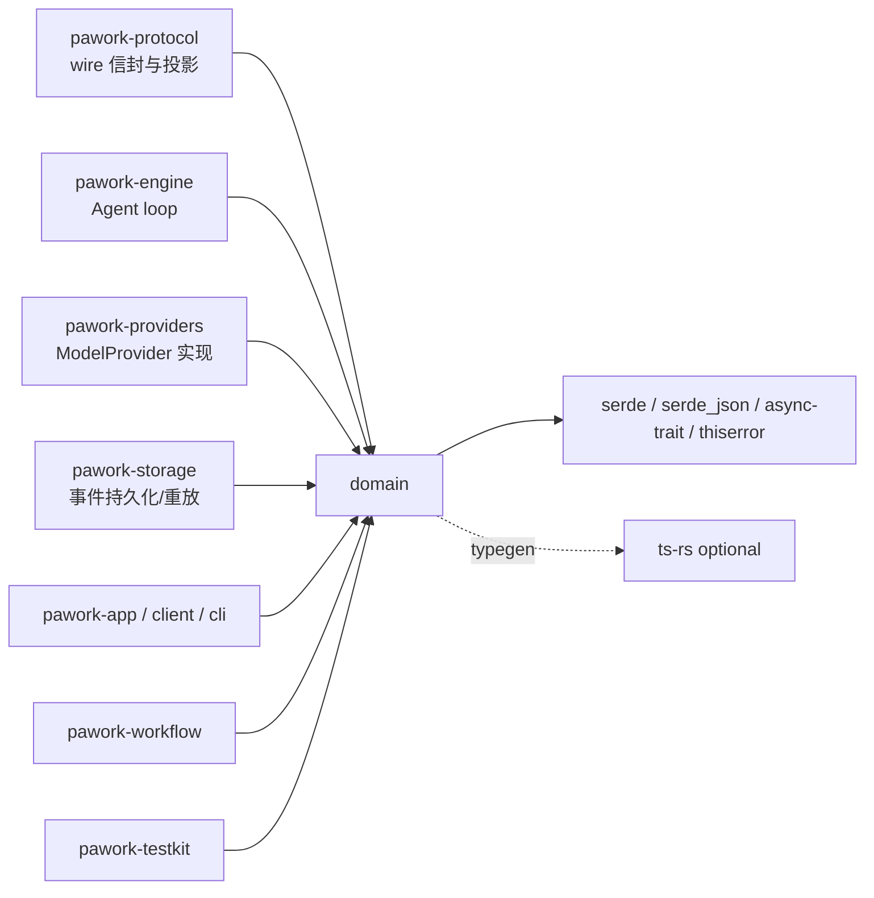

# pawork-domain Review

> 依赖图根部的 canonical 纯净领域包：定义全部实体 ID、Agent 事件信封（32 变体）、消息/内容模型、Provider 与 Tool 契约面、Agent Profile、降级事件、协作取消、client session 注册表词汇与 Phase 16 workflow 事件。18 个 .rs 文件（src 16 + tests 2），共 5 249 行（src 4 644 / tests 605），16 个模块自 lib.rs 扁平 re-export。

## 1. 职责与边界

pawork-domain 是整个 Pawork workspace 的依赖图根：只含纯数据结构与基于标准库的协作式取消语义，是所有上层包（protocol、engine、providers、storage、app、client、cli 等）共享的唯一 canonical 词汇表。R1 起（ADR-039）原 `pawork-api` 的 Provider 契约与工具执行契约并入本包的 `provider_api` / `tool_api` 模块，纯净红线不变。

架构红线（见 `docs/architecture.md` §1/§2，由 lib.rs doc comment 明文重申）：不执行 IO，不依赖数据库、HTTP Client、OS Keychain、Git、任何 GUI framework（含 GPUI/Tauri）或任何具体 Provider。Engine 不得按 Provider 名称走特例逻辑，全部经本包 canonical 类型表达。改本包即改全仓契约：任何 serde 形状变化都是 wire 冻结契约变化，须 golden 先行。

## 2. 依赖关系

| 方向 | 包 | 用途 |
|---|---|---|
| 本包依赖（pawork-*） | 无 | 依赖图根，零 pawork 依赖 |
| 被依赖（生产） | pawork-protocol / engine / providers / storage(optional) / app / client / cli / orchestration / workspace / tools / policy / auth / git / control-plane / workflow / testkit | 全部上层包以本包为 canonical 词汇来源；storage 仅 optional feature；testkit 是测试 crate，但对 domain 的依赖写在生产 dependencies |
| 被依赖（dev） | 各包测试 | tests fixture 直接构造 domain 事件 |

| 外部 crate | 用途 |
|---|---|
| serde / serde_json | 全部 wire 类型的 Serialize/Deserialize；serde_json::Value 用于 metadata/工具入参等开放负载 |
| async-trait | `ModelProvider` / `ProviderEventSink` / `AgentTool` / `ToolEventSink` / `SessionRegistryStore` 的 async trait |
| thiserror | `ProviderError` / `ToolError` / `ServerToolMappingError` / `ReasoningMappingError` 等的 Error 派生；`EventOrderError` / `SessionRegistryError` 手写 Display + `std::error::Error`，不用 thiserror |
| ts-rs（optional，feature `typegen`） | 全部 wire 类型派生 `ts_rs::TS`，供 protocol typegen 生成 TS schema |
| tokio（dev） | 内联单元测试的异步运行时 |

feature：`typegen`（引入 ts-rs）、`plugin = []`（空 feature，F41 归档后保留的复活锚）。默认无 feature。

## 3. 文件清单

| 相对路径 | 行数 | 职责 |
|---|---:|---|
| src/lib.rs | 38 | 模块声明与扁平 re-export；doc comment 重申纯净红线 |
| src/ids.rs | 112 | `string_id!` 宏、37 个类型安全字符串 ID、`Timestamp` |
| src/error.rs | 37 | `ErrorCategory`（14 类）与 `ErrorContext` |
| src/cancel.rs | 164 | `CancellationToken` / `CancellationFuture` 协作式取消 |
| src/message.rs | 305 | 消息与内容模型：Message/ContentPart/TokenUsage/Cost/StopReason 等 |
| src/events.rs | 508 | 持久化事件信封 `AgentEventEnvelope` 与 `AgentEvent` 32 变体 |
| src/provider_api.rs | 938 | Provider 契约面：CanonicalModelRequest、ProviderStreamEvent 13 变体、ModelProvider trait、能力解析 |
| src/provider_hints.rs | 174 | `provider_hints.*` 保留键规则与 legacy 键映射 |
| src/reasoning.rs | 90 | `ReasoningEffort` 6 档与 `ReasoningItem`（ProtectedBlobRef + 元数据地图） |
| src/server_tool.rs | 399 | 服务端工具词汇：ServerToolEvent 11 变体、Citation/Source/Transcript |
| src/tool.rs | 384 | 工具分类学：ToolKind/Hosting/Capability/CapabilityTag 14 项 |
| src/tool_api.rs | 254 | 工具执行契约：AgentTool trait、ToolResult、ToolErrorKind 9 类 |
| src/profile.rs | 289 | AgentProfileV2（13 维度）、工具规则 deny 优先、记忆可用性 fail-closed |
| src/degrade.rs | 262 | DegradeEvent 与 `degrade.<suffix>` 冻结编码、默认投递路由 |
| src/client_session.rs | 155 | client adapter session 注册表词汇：状态机、CAS 写入结果、Store trait |
| src/workflow.rs | 535 | Phase 16 workflow 事件：Plan/Goal/Task/Automation/Monitor/Memory/Review |
| tests/contract_golden.rs | 250 | Provider 契约 wire golden（请求/流事件/错误/工具结果） |
| tests/events_golden.rs | 355 | AgentEventEnvelope 32 变体与 parent 链 golden |
| tests/fixtures/*.json(l) | — | 6 个 golden fixture（见 §6） |

## 4. 类型与方法功能列表

### ids.rs — 实体 ID 与时间戳

`string_id!` 宏批量生成透明 newtype `struct X(String)`：derive Clone/Debug/Default/PartialEq/Eq/PartialOrd/Ord/Hash/Serialize/Deserialize（`typegen` 下再 derive `ts_rs::TS`），统一提供 `new / as_str / into_inner`、`From<String>/From<&str>`、`AsRef<str>`、`Display`。共 37 个：基础 27 个——ActorId、AgentId、ArtifactId、AccountId、CheckpointId、CredentialId、CommandId、ConnectionId、CoreInstanceId、EventId、GuiClientId、MessageId、ModelId、PluginId、PrincipalId、ProtectedBlobRef、ProviderId、QueryId、ReasoningItemId、RequestId、RunId、SessionId、TenantId、TerminalSessionId、ToolCallId、ToolExecutionId、WorkspaceId；Phase 16 新增 10 个——PlanId、PlanStepId、PlanVersionId、GoalId、BackgroundTaskId、AutomationId、MonitorId、MemoryId、ReviewSessionId、ReviewFindingId。改动注意：ID 是全仓 wire 与 DB 主键词汇，新增 ID 不破坏旧数据，改名/删除则破坏一切。

| 名称 | 种类 | 功能/语义 |
|---|---|---|
| `Timestamp(u64)` | struct | Unix epoch 毫秒；整数保证跨语言无损序列化；`from_unix_millis` / `as_unix_millis`（均 const fn） |

### error.rs — 错误分类

| 名称 | 种类 | 变体/功能 |
|---|---|---|
| `ErrorCategory` | enum（14） | Provider、Tool、Internal、Cancelled、RateLimit、Timeout、Authentication、Authorization、InvalidRequest、NotFound、Conflict、ResourceExhausted、Unavailable、MalformedData；跨层稳定分类，Provider/Tool 错误均映射到此 |
| `ErrorContext` | struct | `category, message, retryable, retry_after_ms: Option<u64>, diagnostics: BTreeMap<String, String>`，供 ToolResult::failure 与事件携带 |

### cancel.rs — 协作式取消

| 名称 | 种类 | 方法签名 / 功能 |
|---|---|---|
| `CancellationToken` | struct | `new()`；`cancel()` 幂等触发并唤醒全部等待者；`is_cancelled() -> bool`；`cancelled() -> CancellationFuture`。Clone 共享同一 Arc 内部状态 |
| `CancellationFuture` | struct | await 到取消即完成；poll 时注册 waker，Drop 自动注销 |

私有实现：`Arc<Inner>` 持 `AtomicBool` 与 `BTreeMap<u64, Waker>`；cancel 时换 guard、遍历全部 waker wake。跨 await 传播全靠它，engine/provider/tool 三层契约的 `cancel: CancellationToken` 参数即此类型。改动注意：唤醒全部而非单个，依赖方语义是广播取消。

### message.rs — 消息与内容模型

| 名称 | 种类 | 变体/字段/功能 |
|---|---|---|
| `MessageRole` | enum（4） | System / User / Assistant / Tool |
| `Message` | struct | `id: MessageId, role, content: Vec<ContentPart>, metadata: MessageMetadata` |
| `ContentPart` | enum（7） | Text / Image / Thinking / Reasoning / ToolCall / ToolResult / ArtifactRef；对话内容的 canonical 分型，serde 冻结 |
| `TextContent` | struct | `text: String` |
| `ImageContent` | struct | 图像内容 + `source: ImageSource` |
| `ImageSource` | enum（3） | Artifact（引用工件）/ Url / Base64 |
| `ThinkingContent` | struct | thinking 文本（模型推理流展示） |
| `ToolCallContent` | struct | 模型发起的工具调用：`id: ToolCallId, name, arguments, raw_arguments: Option<String>, complete` |
| `ToolResultContent` | struct | 工具执行结果：`tool_call_id, tool_name: Option<String>, content, is_error, metadata, artifacts`；projection 的 `_pawork_tool_call_id` 身份即源于此 |
| `ArtifactReference` | struct | 内容对工件的引用 |
| `MessageMetadata` | struct | 结构化附加数据：`model/provider/usage/cost/timestamp/artifacts/stop_reason/incomplete/trace_id` + `provider_metadata: BTreeMap<String, Value>` |
| `TokenUsage` | struct | 输入/输出 token 计数；`total_tokens()`（const）、`is_zero()`（const） |
| `Cost` | struct | 微单位（micro-units）成本，避免浮点 |
| `StopReason` | enum（8） | Completed / StopSequence / MaxTokens / ToolUse / ContentFiltered / Cancelled / Error / Other |

### events.rs — 持久化事件信封

`CURRENT_SCHEMA_VERSION: u32 = 1`——信封 schema 版本，storage 持久化与重放以此门控。

| 名称 | 种类 | 字段/方法/功能 |
|---|---|---|
| `EventSequence(u64)` | struct | 会话内单调序号；`new` / `value`（const）/ `is_immediately_after(previous)`（严格 +1 判定） |
| `AgentEventEnvelope` | struct | 字段：`schema_version, event_id, session_id, run_id, sequence: EventSequence, timestamp, parent_event_id: Option<EventId>, payload: AgentEvent`。`new()` 自动填 CURRENT_SCHEMA_VERSION 且 parent 为 None；`with_parent(parent_event_id)` builder；`validate_after(&previous)` 校验同 session 且 sequence 严格 +1，否则 `EventOrderError` |
| `AgentEvent` | enum（32） | RunStarted、ContextPrepared、ProviderRequestStarted、UsageUpdated、AssistantTextDelta、AssistantThinkingDelta、ToolCallStarted、ToolCallArgumentsDelta、ToolApprovalRequested、ToolApprovalResponded、ToolExecutionStarted、ToolOutputDelta、ToolExecutionCompleted、MessageCommitted、ProviderTranscriptContinued、ServerTool、TranscriptEnvelope、CompactionStarted、CompactionCompleted、CheckpointCreated、CheckpointRolledBack、RunCompleted、RunCancelled、RunFailed、Plan、Goal、Task、Automation、Monitor、Memory、Review、Diagnostic。serde `tag="type" content="data"` + snake_case（wire 冻结） |
| `ProviderTranscriptContinuation` | struct | run 结束时携带 provider transcript 延续句柄，供下一轮请求续传 |
| `ApprovalDecision` | enum（4） | ApprovedOnce / ApprovedForRun / Denied / Cancelled（`rename_all = "snake_case"`，wire 为 `approved_once` 等；protocol 侧是 `approve_once` 另一套 wire，见 protocol 文档） |
| `ToolOutputStream` | enum（3） | Stdout / Stderr / Structured（ToolOutputDelta 的流归属） |
| `EventOrderError` | enum（2） | DifferentSession / NonContiguousSequence { previous, next } |

改动注意：`AgentEvent` 是「所有 Agent 事件必须可持久化、可重放」红线的载体——新增变体必须同批加 events_golden fixture 并评估 storage schema；32 变体计数是 Spec/golden 双向钉死的。

### provider_api.rs — Provider 契约面

请求侧：

| 名称 | 种类 | 字段/功能 |
|---|---|---|
| `CanonicalModelRequest` | struct | `request_id, model, messages, tools: Vec<ToolDefinition>, hosted_tools: Vec<HostedToolRequest>, extensions: Vec<ExtensionToolRequest>, tool_choice, thinking: Option<ThinkingConfig>, reasoning: Option<ReasoningConfig>, temperature, max_output_tokens, stop_sequences, response_format, prompt_cache, budget: RequestBudget, provider_options: BTreeMap<String,Value>, trace_id`。三类工具分列是刻意设计：client 本地 / provider hosted / provider extension 各走各的通道；`provider_options` 是开放 map，adapters 合并非保留键，但 canonical/认证键及会破坏 wire 不变量的字段必须忽略 |
| `ToolDefinition` | struct | client 本地工具的 canonical 描述（名称/schema 等），由 ToolDescriptor 投影而来 |
| `HostedToolRequest` | struct | provider 侧 hosted 工具（如 web_search）请求形态 |
| `ExtensionToolRequest` | struct | provider extension 工具请求形态 |
| `ToolChoice` | enum（4） | None / Auto / Required / Named |
| `ThinkingConfig` | struct | interleaved thinking 配置：`level: ThinkingLevel` + `budget_tokens: Option<u64>` |
| `ThinkingLevel` | enum（4） | Off / Low / Medium / High |
| `ResponseFormat` | enum（3） | Text / Json / JsonSchema { name, schema } |
| `PromptCachePreference` | enum（3） | Automatic / Disabled / Required |
| `RequestBudget` | struct | 请求预算（token/时间等上限） |

流事件与响应：

| 名称 | 种类 | 变体/字段/功能 |
|---|---|---|
| `ProviderStreamEvent` | enum（13） | ResponseStarted { response_id: Option<String> }、TextDelta、ThinkingDelta、ReasoningItem、ToolCallStarted { id, name }、ToolCallArgumentsDelta { id, json }、ToolCallCompleted { id }、UsageUpdated、ResponseCompleted(StopReason)、ProviderMetadata(Value)、ServerTool(ServerToolEvent)、TranscriptEnvelope(ProviderTranscriptEnvelope)、Error(ProviderError)。同一形状同时喂 engine 事件流与 testkit 断言，13 变体由 contract_golden 钉死 |
| `ModelResponseSummary` | struct | `stop_reason, usage, response_id, provider_metadata`——stream() 正常返回的终态汇总 |
| `ModelDefinition` | struct | 模型目录条目（id、能力、上下文窗口等） |
| `ServerToolMappingError(pub String)` | struct | 服务端工具映射失败；`unsupported(detail)` 构造 |
| `ReasoningMappingError(pub String)` | struct | reasoning 映射失败；`unsupported(detail)` 构造 |

模型能力与降级解析：

| 名称 | 种类 | 字段/功能 |
|---|---|---|
| `ModelCapabilities` | struct | v1 布尔能力集 + v2 扩展（transport、hosted_tool_tags、citations、reasoning） |
| `ModelTransport` | enum（3） | Responses / Messages / ChatCompletions；`is_modern()`——Responses 与 Messages 为 modern 通道 |
| `clamp_effort_to_thinking_level(effort) -> ThinkingLevel` | fn | reasoning effort 投到 thinking level 的降档映射（如 Max→High） |
| `ReasoningStateDescriptor` | struct | reasoning 状态描述 |
| `ReasoningStateCapability` | struct | reasoning 能力声明 |
| `ReasoningConfig` | struct | `new(effort: ReasoningEffort)`；`requires_reasoning_support()` 判定是否需要 provider 显式支持 |
| `CapabilityRequirements` | struct | 请求声明的全部能力需求（transport/thinking/reasoning/hosted tags 等） |
| `CapabilityFallback` | enum（4） | ClientTool / LegacyTransport / ClampedEffort / Reject(String)——每项未满足能力的降级动作；Reject 携带可读原因 |
| `ResolvedCapabilities` | struct | 解析结果：`requested == supported ∪ unsupported`（每个需求要么被支持要么显式进 unsupported，不允许静默丢弃） |

契约 trait 与凭证：

| 名称 | 种类 | 方法签名 |
|---|---|---|
| `ProviderEventSink` | trait | `async fn emit(&self, event: ProviderStreamEvent) -> Result<(), ProviderError>` |
| `ModelProvider` | trait | `fn id(&self) -> ProviderId`；`async fn list_models(&self, credential: Option<&ResolvedCredential>) -> Result<Vec<ModelDefinition>, ProviderError>`；`async fn stream(&self, request: CanonicalModelRequest, sink: &dyn ProviderEventSink, cancel: CancellationToken) -> Result<ModelResponseSummary, ProviderError>` |
| `ResolvedCredential` | struct | 私有字段持明文 secret；`new(kind, secret)`、`kind()`（const）、`expose_secret()`。Debug 输出脱敏、无 Serialize——明文 token 不落日志不落库的red line 在类型层强制 |
| `CredentialKind` | enum（3） | ApiKey / OAuthBearer / SessionToken |
| `ProviderErrorKind` | enum（15） | Authentication、Authorization、RateLimited、QuotaExceeded、InvalidRequest、ModelNotFound、ContextTooLarge、ContentFiltered、Network、Timeout、ProviderUnavailable、StreamInterrupted、MalformedResponse、Cancelled、Unknown |
| `ProviderError` | struct | `new(kind, message)`、`cancelled(message)`、`category() -> ErrorCategory`。默认 retryable 集合：RateLimited / Network / Timeout / ProviderUnavailable / StreamInterrupted |

### provider_hints.rs — `provider_hints.*` 命名空间

| 名称 | 种类 | 功能 |
|---|---|---|
| `PROVIDER_HINTS_PREFIX` | const | `"provider_hints."`——所有保留键前缀 |
| `MAX_HINT_KEY_BYTES` / `MAX_HINT_VALUE_BYTES` | const | 128 B / 64 KiB 键值上限 |
| `OPENAI_RESPONSES_SUMMARY_ENTRIES_HINT` | const | OpenAI Responses summary entries 保留键 |
| `ANTHROPIC_BLOCK_KIND_HINT` | const | Anthropic block kind 保留键 |
| `LEGACY_HINT_KEY_MAP` | const | 3 行冻结的 legacy→canonical 键映射表 |
| `is_provider_hint_key(key) -> bool` | fn | 前缀 + 长度判定 |
| `canonical_hint_key(key) -> Option<&'static str>` | fn | legacy 键归一到 canonical 键 |

改动注意：映射表是线上兼容冻结项，改一行即破坏旧会话重放。

### reasoning.rs — 推理档位

| 名称 | 种类 | 变体/功能 |
|---|---|---|
| `ReasoningEffort` | enum（6） | None / Low / Medium（默认）/ High / XHigh / Max；`rename_all = "snake_case"`（`XHigh` → `x_high`）；`requires_reasoning_support()`——仅 `None` 不需要 provider 显式支持，Low 及以上都需要 |
| `ReasoningItem` | struct | `id, summary: Option<String>, protected_blob_ref: ProtectedBlobRef, opaque_metadata, continuation_metadata`——原文只以 ProtectedBlobRef 出边界，两份 metadata 仅允许非敏感翻译 hints |

### server_tool.rs — 服务端工具词汇

| 名称 | 种类 | 变体/功能 |
|---|---|---|
| `CitationSourceKind` | enum（5） | Url / WebSearch / Document / File / Unknown（未知来源归 Unknown，不丢事件） |
| `Citation` | struct | 引用；`empty()` 构造空引用（serde 兼容旧数据） |
| `Source` | struct | 引用来源文档 |
| `ProgramStream` | enum（2） | Stdout / Stderr |
| `ServerToolEvent` | enum（11） | Started、ArgumentsDelta、Progress、Completed、Failed、CitationAdded、SourceAdded、ComputerActionRequested、ComputerScreenshot、ProgramStarted、ProgramOutput。`tool_call_id()`（const）与 `type_name()`（const）跨全部变体取身份与类型名 |
| `TranscriptItem` | enum（2） | ServerTool / Text |
| `ProviderTranscriptEnvelope` | struct | `items: Vec<TranscriptItem>, cursor, continuation_reference`——provider transcript 的回传/续传信封 |

### tool.rs — 工具分类学

| 名称 | 种类 | 变体/方法 |
|---|---|---|
| `ToolKind` | enum（3） | ClientFunction / ProviderHosted / ProviderExtension；`continuation_mode()`（const）——ClientFunction→CoreSuppliedResult，另两类→ProviderTranscript |
| `ContinuationMode` | enum（2) | CoreSuppliedResult / ProviderTranscript：工具结果回传给 provider 的两条通道 |
| `ToolCapabilityTag` | enum（14） | WebSearch、WebFetch、FileOrCollectionSearch、XSearch、CodeExecution、HostedShell、ProviderApplyPatch、ComputerUse、ImageGeneration、ServerSideMcp、ToolSearch、Memory、ProgrammaticToolCalling、ServerSideMultiAgent；`capability_key()`（const）返回 `"tool:<PascalCase>"`，穷举守卫保证新 tag 必须补 key |
| `ToolHosting` | enum（3） | Local / ProviderHosted { hosted_name, kind: ToolCapabilityTag } / ProviderExtension { reference }；`tool_kind()`（const）反向映射 |
| `ToolCapability` | enum（7） | ReadOnly / WorkspaceWrite / GitWrite / Process / Network / UserInteraction / ExternalPlugin；`permits_concurrent_execution()`（const）——仅 ReadOnly 允许并发执行 |
| `ToolDescriptor` | struct | 工具完整描述（name/description/input_schema/capability/kind/hosting/capabilities/requires_approval/read_only/supports_concurrency/default_timeout_ms/max_output_bytes/allowed_in_untrusted_workspace）；`continuation_mode()`（const）委托 kind；`has_consistent_hosting()` 校验 kind 与 hosting 一致 |

### tool_api.rs — 工具执行契约

| 名称 | 种类 | 签名/变体 |
|---|---|---|
| `AgentTool` | trait | `fn descriptor(&self) -> ToolDescriptor`；`async fn execute(&self, request: ToolRequest, context: ToolExecutionContext, sink: &dyn ToolEventSink, cancel: CancellationToken) -> Result<ToolResult, ToolError>` |
| `ToolEventSink` | trait | `async fn emit(&self, event: ToolStreamEvent) -> Result<(), ToolError>` |
| `ToolRequest` | struct | `tool_call_id, input: Value` |
| `ToolExecutionContext` | struct | `workspace_id, run_id, working_directory: Option<相对路径>`——文件操作输入必须基于 workspace_id + relative_path，禁止任意绝对路径（红线在契约类型上收口） |
| `ToolResult` | struct | 仅 ClientFunction 工具的执行结果；`success(content)` / `failure(ErrorContext)` / `is_error()`（const） |
| `ToolStreamEvent` | enum（3） | OutputDelta { channel, delta } / Progress { completed, total, message } / ArtifactAvailable |
| `ToolOutputChannel` | enum（3） | Stdout / Stderr / Structured |
| `ToolErrorKind` | enum（9） | Cancelled、Timeout、InvalidInput、NotLocallyExecutable、PermissionDenied、NotFound、Conflict、ExecutionFailed、Internal |
| `ToolError` | struct | `cancelled(message)`、`not_locally_executable(name, site)`、`category() -> ErrorCategory` |

### profile.rs — Agent Profile

| 名称 | 种类 | 字段/功能 |
|---|---|---|
| `ToolPolicyDecision` | enum（3） | Denied / Allowed / Unrestricted |
| `ProfileToolRules` | struct | `is_denied(name)` / `is_allowed(name)` / `policy(name)`——deny 列表优先于 allow 判定 |
| `ProfileRef` | struct | `new(id)`；`pins_version()`——`None` 与 `*` 视为不钉版本、`latest` 也为 false |
| `ProfilePrompt` | struct | 系统提示词维度 |
| `ProfileModel` | struct | 模型偏好维度 |
| `ProfileMemory` | struct | `availability() -> ProfileMemoryAvailability`——fail-closed：unavailable 时无条件 Unavailable，不因配置尝试回退 |
| `ProfileMemoryAvailability` | enum（3） | Enabled / Disabled / Unavailable |
| `ProfileIsolation` | enum（3） | None / Restricted / Container |
| `AgentProfileV2` | struct | 13 个维度的聚合 profile（prompt/model/tool rules/memory/isolation/审批策略等） |

### degrade.rs — 降级事件

| 名称 | 种类 | 变体/功能 |
|---|---|---|
| `DegradeKind` | enum（6） | HomeDirFallback、MissingCredential、EventStreamLagged、TasksFinishFailed、IdempotencyConflict、AcpState；`code_suffix()`（const）给每个 kind 一个冻结短名 |
| `DegradeSeverity` | enum（3） | Info / Warning / Error；`as_str()`（const） |
| `DegradeSink` | enum（2） | EventStream / FrameStderr——降级要投递到的通道 |
| `DegradeEvent` | struct | `new(...)`；`code()` 返回 `"degrade.<suffix>"`（冻结编码）；`default_sink()`——仅 TasksFinishFailed→EventStream，其余→FrameStderr；`to_agent_event()` 折成 AgentEvent::Diagnostic，details 合并 kind/severity/message 三键，非 object 负载包一层 `"context"` |

改动注意：`degrade.*` code 与 default_sink 表都是 CLI stderr / 事件流消费方依赖的冻结语义。

### client_session.rs — client adapter session 注册表

`CLIENT_ADAPTER_SCHEMA_VERSION: u32 = 1`。

| 名称 | 种类 | 变体/功能 |
|---|---|---|
| `ClientSessionId(pub String)` / `ClientProtocol(pub String)` / `ClientCapability(pub String)` | struct | 透明 newtype，`new()` 构造 |
| `CapabilitySnapshot` | struct | `supports(&ClientCapability) -> bool`；`validate()` 校验记录自洽 |
| `ClientSessionState` | enum（4） | Loaded / Subscribed / Executing / Disconnected |
| `ClientSessionRecord` | struct | 注册表记录（schema_version + 会话/能力/状态） |
| `RegistryWriteOutcome` | enum（2) | Applied / Conflict(Box<Option<record>>)——CAS 冲突时带回当前权威记录 |
| `SessionRegistryError` | enum（3） | Unavailable(String) / InvalidRecord(String) / UnsupportedSchema { found, supported } |
| `SessionRegistryStore` | trait | `load_all()` / `insert()` / `compare_and_swap()` / `remove_if_owner()`——owner 比对 + CAS 是协议层 adapter SessionRegistry 的持久化后端契约 |

### workflow.rs — Phase 16 workflow 事件

| 名称 | 种类 | 变体 |
|---|---|---|
| `PlanStepStatus` | enum（4） | Pending / InProgress / Completed / Blocked |
| `PlanReviewStatus` | enum（5） | Draft / InReview / ChangesRequested / Approved / Rejected |
| `PlanStepSnapshot` / `PlanCommentAnchor` | struct | plan 步骤快照；评论锚点 |
| `PlanEvent` | enum（8） | Created / StepUpdated / Replaced / ReviewRequested / Revised / Approved / Rejected / CommentAdded |
| `GoalStatus` | enum（4） | Active / Paused / Achieved / Abandoned |
| `CriterionKind` | enum（2） | Auto / Human |
| `SuccessCriterionSnapshot` | struct | 成功判据快照 |
| `GoalEvent` | enum（8） | Created / ProgressUpdated / CriterionSatisfied / Paused / Resumed / Steered / Achieved / Abandoned |
| `TaskKind` | enum（4） | Process / Agent / Monitor / Automation |
| `TaskStatus` | enum（6） | Queued / Running / Suspended / Completed / Failed / Canceled |
| `TaskEvent` | enum（4） | Started / Suspended / Resumed / Finished |
| `AutomationTriggerKind` | enum（4） | Cron / Interval / Once / Event |
| `AutomationEvent` | enum（4） | Registered / Triggered / ResultArchived / Suspended |
| `MonitorSourceKind` | enum（4） | FileChange / ProcessExit / RegexMatch / PortState |
| `MonitorEvent` | enum（4） | Started / Triggered / Stopped / Unregistered |
| `MemoryPrivacy` | enum（2） | WorkspaceLocal / Shareable |
| `MemoryEvent` | enum（2） | Recorded（embedding/confidence 附加式、默认缺省）/ Invalidated |
| `ReviewSeverity` | enum（4） | Info / Minor / Major / Critical |
| `ReviewResolution` | enum（4） | Open / Addressed / Resolved / Wontfix |
| `ReviewAnchor` / `SuggestedPatch` | struct | finding 锚点；建议补丁 |
| `ReviewEvent` | enum（4） | SessionCreated / FindingOpened（evidence/fingerprint 附加式默认）/ FindingResolved / CommentPublished |

附加式默认（serde default）意味着新增字段不破坏旧事件重放——改动时保持这一模式。

## 5. 关键行为与契约

- **纯净红线**：无 IO、无 DB/HTTP/Keychain/Git/GUI/具体 Provider 依赖；违反即架构红线（AGENTS.md §2）。
- **事件可持久化可重放**：AgentEventEnvelope 的 `schema_version=1` + `validate_after`（同 session、sequence 严格 +1）是重放正确性的类型级前提；`with_parent` 保留事件树（parent 链）。
- **serde wire 冻结**：AgentEvent `tag="type" content="data"`、snake_case、ReasoningEffort 的 `x_high`、ApprovalDecision 的 `approved_once` 等——全部由 tests/events_golden 与 contract_golden 的 fixture 钉死；任何形状漂移先改 golden 并走冻结契约确认流程。
- **Secret 红线**：ResolvedCredential 私有字段 + Debug 脱敏 + 无 Serialize，明文 token 在类型层就进不了日志与 DB；ProfileMemory availability fail-closed。
- **工具分类不变量**：ToolKind↔ToolHosting 一致性（`has_consistent_hosting`）、continuation_mode 由 kind 推导不单独配置、仅 ReadOnly 可并发；ToolExecutionContext 只给 workspace 相对路径，越权绝对路径无构造入口。
- **能力解析不变量**：`ResolvedCapabilities` 满足 `requested == supported ∪ unsupported`，无静默丢弃；`clamp_effort_to_thinking_level` 是唯一的 effort→thinking 降档路径。
- **provider_hints 纪律**：`ReasoningItem` 的 metadata 地图使用 `provider_hints.*` 命名空间（键≤128B、值≤64KiB），legacy 三键经 LEGACY_HINT_KEY_MAP 只读归一，写路径不产出旧拼写。`CanonicalModelRequest.provider_options` 是开放 map，adapters 合并非保留键。
- **降级编码冻结**：`degrade.<suffix>` code、default_sink 表（仅 TasksFinishFailed 走 EventStream）、to_agent_event 的三键合并语义均不可静默更改。
- **注册表并发契约**：SessionRegistryStore 的 compare_and_swap / remove_if_owner 语义由 protocol adapter 层依赖（epoch+1、revision+1、StaleOwner 回写），实现须保证 CAS 原子性。
- **feature 门**：`typegen` 打开 ts-rs derive；`plugin` 为空锚。两者均不影响默认 wire 行为。

## 6. 测试资产

| 文件 | 验证点 |
|---|---|
| tests/contract_golden.rs（250 行） | Provider 契约 wire golden：CanonicalModelRequest 全字段序列化、ProviderStreamEvent 13 变体逐一编码、ProviderError 全量形态、ToolResult 配对形状 |
| tests/events_golden.rs（355 行） | AgentEventEnvelope 32 变体逐一 golden、parent_event_id 链、schema_version=1、validate_after 严格 +1 拒绝 |
| fixtures/canonical_model_request_full.json | 请求全字段快照 |
| fixtures/provider_stream_event_13.jsonl | 13 个流事件逐行 |
| fixtures/provider_error_full.json | 错误全形态 |
| fixtures/tool_result_pair.jsonl | 工具结果成对形状 |
| fixtures/agent_event_envelope_variants.jsonl | 32 变体信封快照 |
| fixtures/agent_event_envelope_parent.json | parent 链快照 |

另各 src 文件带内联 `#[cfg(test)]` 单测（如 cancel 的唤醒/幂等、profile 规则、hints 边界等），与 integration golden 互补。

## 7. 协作关系

