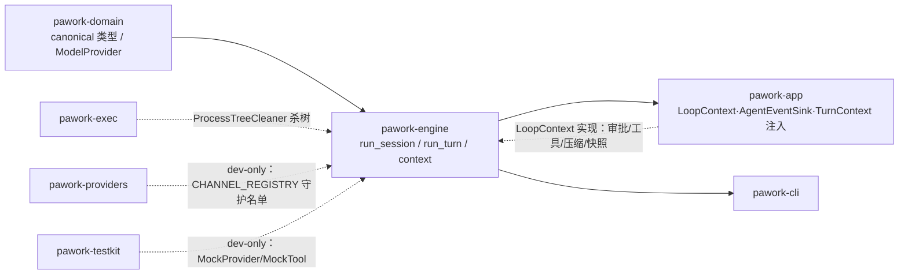

# pawork-engine Review

> Agent Engine 执行核：把 canonical 消息与工具定义装配成 `CanonicalModelRequest`，驱动多轮工具循环并把全过程事件化。共 18 个 .rs 文件 / 6,477 行（src 6,268 + tests 209）；主要模块：`tool_loop`（多轮循环）、`session_turn`（单轮事件化）、`appender`（流折叠）、`context`（预算/压缩/估算/裁剪）、`cancel`（run 级取消）、`event`（事件出口）。

## 1. 职责与边界

- **做什么**：请求装配（`assemble_request(_with_tools)` 冻结默认值）；内部单轮原语 `run_turn`（`pub(crate)`，预取消检查 + `provider.stream` 直通）；多轮工具循环 `run_session`；单轮会话事件化 `run_session_turn`；手动压缩 `run_manual_compaction`；上下文预算/软限压缩/硬限截断/token 估算/tool result 分级裁剪（`context` 子模块）；run 级取消（`CancelHandle` + `ProcessTreeCleaner` 注入）；流式事件折叠（`AssembledTurn`）。
- **不做什么**：不重试、不落库（persist-first 由调用方在 `AgentEventSink` 里完成）、不选通道、不读 Secret、不执行工具（经 `LoopContext` 回调宿主）、不杀进程树（经 `ProcessTreeCleaner` 注入，默认 Noop）、不按 Provider 名称分支（守护测试强制）。
- **宿主注入点**：`ModelProvider`（模型流）、`AgentEventSink`（事件出口）、`LoopContext`（工具执行/审批/压缩/快照回调）、`ProcessTreeCleaner`（取消时杀树）、`TokenEstimator` 与 `ContextLimits`（经 `TurnContext`）。
- **红线**：生产依赖仅 `pawork-domain`（`tests/domain_only.rs` 解析 Cargo.toml 断言）；`src/` 不得出现任何 provider 名串（`tests/no_provider_branch.rs`，名单从 `CHANNEL_REGISTRY` 派生 + 14 个固化基线别名，dev-only 依赖 `pawork-providers`）。

## 2. 依赖关系

| 方向 | 包 | 用途 |
| --- | --- | --- |
| 上游（生产） | pawork-domain | canonical 类型、`ModelProvider`/`ProviderEventSink` trait、`CancellationToken`、`AgentEvent`/信封、`ProviderError` |
| 上游（dev） | pawork-testkit | `MockProvider`/`MockScript`/`MockTool`（tool_loop 测试） |
| 上游（dev） | pawork-providers | 仅取 `CHANNEL_REGISTRY` 派生守护名单（no_provider_branch 测试） |
| 上游（dev） | tokio（macros/rt-multi-thread/sync）、futures | 异步单测与 oneshot |
| 下游 | pawork-app（生产）、pawork-cli（生产） | 装配 `LoopContext` 实现、消费 `run_session`/`run_manual_compaction` |

| 外部 crate（全部生产） | 用途 |
| --- | --- |
| async-trait | `AgentEventSink`/`LoopContext`/`ProviderEventSink` impl 的 async trait |
| serde / serde_json | `ContextBudget`/`CompactionTrigger` 冻结 serde 形状；工具参数与 metadata JSON |
| thiserror | `EngineError` 错误定义 |

## 3. 文件清单

| 相对路径 | 行数 | 职责 |
| --- | --- | --- |
| src/lib.rs | 408 | crate 门面与 re-export；`assemble_request(_with_tools)`；`pub(crate) run_turn`；内联单测 |
| src/event.rs | 250 | `EngineError`、`AgentEventSink`、`EventEmitter`/`LoopEventEmitter`/`LoopSink`、`map_provider_event` |
| src/cancel.rs | 187 | `CancelHandle` 原子幂等取消 + `ProcessTreeCleaner` trait |
| src/appender.rs | 328 | `AssembledTurn` 流折叠、`PendingToolCall`、`ToolCallResult`、`tool_results_message` |
| src/session_turn.rs | 640 | `SessionTurn`、`run_session_turn` 单轮事件化、`now_timestamp` |
| src/tool_loop/mod.rs | 356 | `run_session` 编排、`LoopContext` trait、闸门/快照/压缩回调数据类型 |
| src/tool_loop/round.rs | 107 | 单轮流收集 `collect_stream_round`、助手消息装配、usage 饱和加法 |
| src/tool_loop/approval.rs | 113 | `wait_and_apply` 审批等待与闸门应用、gate 数不匹配 fail-closed |
| src/tool_loop/exec.rs | 210 | 快照→执行→结果对齐→`ToolExecutionCompleted`→Tool 消息提交 |
| src/tool_loop/compaction.rs | 473 | 资源层注入、输入估算、软限压缩链、硬限截断、`run_manual_compaction` |
| src/tool_loop/tests.rs | 2,179 | `run_session`/`run_manual_compaction` 全量定向测试（`#[cfg(test)]`） |
| src/context/mod.rs | 64 | context 门面；`ContextLimits`/`InjectedLayer`/`TurnContext` |
| src/context/budget.rs | 90 | `ContextBudget`/`ContextBudgetBreakdown`（serde 形状与 V1 冻结一致） |
| src/context/compaction.rs | 148 | `compute_compaction` 触发判定纯函数与原因枚举 |
| src/context/token.rs | 293 | `TokenEstimator` trait、`HeuristicEstimator`（CJK 感知）、`ToolSchema` |
| src/context/tool_result_trim.rs | 422 | tool result 四级裁剪、`byte_len_of_tool_result`、占位 ArtifactRef |
| tests/domain_only.rs | 91 | 红线：生产 pawork-* 依赖恰为 {pawork-domain}（覆盖 alias/target 表） |
| tests/no_provider_branch.rs | 118 | 红线：src/ 全部 .rs 禁止出现 provider 名串 |

## 4. 类型与方法功能列表

### lib.rs（crate 门面）

| 名称 | 种类 | 功能/语义 |
| --- | --- | --- |
| `assemble_request` | pub fn | 用冻结契约默认值填满 `CanonicalModelRequest`：tools/hosted/extensions/stop_sequences 空、`ToolChoice::Auto`、`ResponseFormat::Text`、`PromptCachePreference::Automatic`、`RequestBudget::default()`、thinking/reasoning/temperature/max_output_tokens/trace_id 全 None、provider_options 空 BTreeMap |
| `assemble_request_with_tools` | pub fn | 同上但 tools 取入参 |
| `run_turn` | pub(crate) async fn | 内部单轮原语：cancel 已取消则不调 provider 直接返回 `ProviderError::cancelled`；否则 request/sink/cancel 原样交给 `provider.stream`。不重试、不滤事件、不改写成 AgentEvent；13 个 `ProviderStreamEvent` 变体全部透传 |

### event.rs（事件出口）

`EngineError`（thiserror）三变体：`Provider(ProviderError)`（transparent 透传）、`Sink(String)`（事件出口/前置校验失败）、`MaxToolRounds(u64)`；`EngineError::sink()` 构造器与 `is_cancelled()`（判定 Provider 变体内的 Cancelled kind）。

| 名称 | 种类 | 功能/语义 |
| --- | --- | --- |
| `AgentEventSink` | pub trait | `async fn emit(&self, AgentEventEnvelope) -> Result<(), EngineError>`；唯一事件出口，调用方 persist-first 再渲染 |
| `EventEmitter` | pub(crate) struct | sequence 分配器 + 信封封装：`emit` 以 `AtomicU64::fetch_add` 从 start_sequence 起分配，`event_id = "evt-{run_id}-{sequence}"`，timestamp 取 `SessionTurn.timestamp`（整个 run 恒定） |
| `LoopEventEmitter` | pub struct（Clone） | 复制 sequence 分配器与 sink 引用；`emit(payload)` 直发；`emit_tool_event(tool_call_id, ToolStreamEvent)` 把 `OutputDelta` 映射为 `ToolOutputDelta`（Stdout/Stderr/Structured 三通道），`Progress`/`ArtifactAvailable` 静默忽略 |
| `LoopSink` | pub(crate) struct | 实现 `ProviderEventSink` 的双写 sink：每个 provider 事件先经 `map_provider_event` 实时转发 AgentEvent，再原样缓冲进 `Mutex<Vec>` 供 `AssembledTurn` 折叠；emitter 失败时记入 `persist_error` 并向 provider 返回 Unknown 错误中止流——persist 失败优先于一切终态事件 |
| `map_provider_event` | pub fn | 单轮映射：TextDelta→AssistantTextDelta、ThinkingDelta→AssistantThinkingDelta、ToolCallStarted、ToolCallArgumentsDelta、UsageUpdated、ServerTool、TranscriptEnvelope；其余变体（ReasoningItem/ToolCallCompleted/ResponseStarted/ResponseCompleted/ProviderMetadata/Error）返回 None 只缓冲 |

### cancel.rs（run 级取消）

| 名称 | 种类 | 功能/语义 |
| --- | --- | --- |
| `ProcessTreeCleaner` | pub trait | `fn cleanup(&self, run_id: &RunId) -> usize`；返回被终止进程数（审计用），由宿主（pawork-exec 桥）注入，engine 不依赖 exec |
| `NoopProcessTreeCleaner` | pub struct | 默认无操作清理器，返回 0 |
| `CancelHandle` | pub struct（Clone） | `new(run_id, cleaner)`；`token()`/`child_token()` 返回同一根 `CancellationToken`（传 provider stream 与 tool execute）；`cancel(reason)` 用 `AtomicBool::compare_exchange` 原子门控：首次先 `token.cancel()` 再 `cleaner.cleanup` 并记录 `processes_killed`，重复调用返回 `already_cancelled=true` 且不再清理；`reason` 参数被忽略（仅供调用方写事件/日志，不进 RunCancelled 信封） |
| `CancelReason` | pub enum | `User`/`Budget`/`System`/`Shutdown` 四变体，运行时枚举不进信封 |
| `CancelReceipt` | pub struct | `already_cancelled` + `processes_killed`；`cleaned_up() = !already_cancelled` |

### appender.rs（流折叠）

| 名称 | 种类 | 功能/语义 |
| --- | --- | --- |
| `PendingToolCall` | pub struct | `id`/`name`/`raw_arguments`/`completed`；`arguments()` 解析 raw JSON（空串或非法 → `Value::Null`）；`into_content()` 转 `ToolCallContent`（保留 raw_arguments 与 complete 标记） |
| `AssembledTurn` | pub struct | 一轮流式调用的累积态：text/thinking 缓冲、reasoning_items 列表、`tool_calls: BTreeMap` + `tool_call_order` 保序、`summary: Option<ModelResponseSummary>`；`has_tool_calls()` 是 run_session 是否继续下一轮的唯一判据（不看 StopReason） |
| `AssembledTurn::apply` | pub fn | 折叠规则：TextDelta/ThinkingDelta 追加缓冲；ReasoningItem 入列表；ToolCallStarted 建 PendingToolCall（重复 id 忽略）；ToolCallArgumentsDelta 追加 raw JSON（早于 Started 到达则容错补建空名调用）；ToolCallCompleted 置位；UsageUpdated/ResponseStarted/ResponseCompleted/ProviderMetadata 增量合并进 summary（首次出现用 get_or_insert 建默认）；ServerTool/TranscriptEnvelope/Error 不参与折叠 |
| `AssembledTurn::into_message` | pub fn | 产出顺序固定：Thinking（`reasoning_item_id` 取最后一个 reasoning item）→ Reasoning items → Text → ToolCall（按出现顺序）；空内容消息仍产出（content 为空 vec） |
| `ToolCallResult` | pub struct | `tool_call_id`/`tool_name`/`arguments`/`result: ToolResult`；一次工具调用的最终结果 |
| `tool_results_message` | pub fn | 把一组结果构建为一条 `Tool` 角色 `Message`，每个结果一个 `ToolResultContent` part（is_error 取自 `ToolResult::is_error()`，metadata/artifacts 透传） |

### session_turn.rs（单轮事件化）

| 名称 | 种类 | 功能/语义 |
| --- | --- | --- |
| `SessionTurn` | pub struct | 会话轮次标识：`session_id`/`run_id`/`provider_id`/`model`/`start_sequence`/`trigger_message`/`timestamp`；`new` 以 `now_timestamp()` 取当前时间 |
| `now_timestamp` | pub fn | SystemTime → unix millis → `Timestamp::from_unix_millis`（失败回 0） |
| `run_session_turn` | pub async fn | 单轮事件化（无工具循环、无 TurnContext）：校验 start_sequence ≥ 1 → `RunStarted` → `MessageCommitted(user)` → `ContextPrepared(estimated=0)` → 预取消检查（RunCancelled）→ `ProviderRequestStarted` → `run_turn`（LoopSink 实时转发，assistant_id 固定 `asst-{run_id}`）→ persist 错误优先返回 → 成功折叠提交 `MessageCommitted(assistant)`（metadata 带 usage/stop_reason/provider/model）+ `RunCompleted`；Cancelled 取流内最后一条 UsageUpdated 发 `RunCancelled`；其它错误经 `ErrorContext::from` 发 `RunFailed`。半轮取消/失败不提交未完成助手消息；persist 失败不再补终态 |

私有 helper：`optional_usage`（全零 → None）、`last_stream_usage`（逆序找最后一条 UsageUpdated）。

### tool_loop/mod.rs（循环编排与宿主回调）

| 名称 | 种类 | 功能/语义 |
| --- | --- | --- |
| `DEFAULT_MAX_TOOL_ROUNDS` | pub const | 20；达上限发 `RunFailed(ResourceExhausted)` 并返回 `EngineError::MaxToolRounds`，不再开下一轮 stream |
| `PendingToolInvocation` | pub struct | `tool_call_id`/`name`/`arguments`（已解析 Value）；解析自本轮 tool call 的待执行调用 |
| `ApprovalGate` | pub enum | `NotRequired`（策略已放行，不发审批事件）/ `Asked(ApprovalDecision)`（用户可见审批，engine 补发 Responded） |
| `WriteCheckpoint` | pub struct | `checkpoint_id` + `artifacts`；写工具执行前宿主快照标识，engine 只发 `CheckpointCreated` 不依赖 blob/git |
| `CompactionOutcome` | pub struct | `source_event_count` + `compacted_through: EventSequence`；host 完成 session fork/snapshot 后回传的持久化水位 |
| `LoopContext` | pub trait | 宿主回调集（见下表方法） |
| `run_session` | pub async fn | 多轮事件化主循环（行为详见 §5.1） |

`LoopContext` 方法签名与语义：

| 方法 | 语义 |
| --- | --- |
| `async execute_tools(calls: Vec<PendingToolInvocation>, events: LoopEventEmitter, cancel) -> Vec<ToolCallResult>` | 执行已放行调用；执行期间可经 `events.emit_tool_event` 转发工具输出流；返回结果不要求与 calls 等长同序——engine 用 `align_tool_results` 按 invocation 顺序对齐，缺失回填 `NotFound("missing tool result")` |
| `async request_approval(calls: &[PendingToolInvocation], already_approved_for_run: bool, events, cancel) -> Result<Vec<ApprovalGate>, EngineError>` | 对整批调用逐个给出闸门，返回向量必须与 calls 等长；实现契约：每次阻塞等待决策前必须 emit `ToolApprovalRequested`（reason 逐字 `tool \`{name}\` requires approval`，含 batch 已批准短路路径）；`already_approved_for_run=true` 时不应再询问 |
| `fn next_message_id() -> MessageId` / `fn next_request_id() -> RequestId` | 为助手/工具/摘要消息与每轮新请求分配 id（内部摘要请求也从此取） |
| `async compact_history(reason, summary_text, cancel) -> Result<Option<CompactionOutcome>, EngineError>`（默认 `Ok(None)`） | host 负责 session 侧 fork/snapshot；失败必须返回 Err（engine 终止 run，不静默吞）；默认 None 表示无持久化宿主，engine 仍完成消息层压缩 |
| `async snapshot_write_tools(calls, events, cancel) -> Vec<WriteCheckpoint>`（默认空） | 写工具执行前拍快照；失败可经 events 发 `Diagnostic("checkpoint.snapshot_failed")`，写入继续 |

### tool_loop/round.rs（单轮收集，pub(super)）

`StreamRound` 三态枚举：`Succeeded{assembled, summary}` / `Cancelled{message, stream_usage}` / `Failed{error, stream_usage}`。`collect_stream_round` = LoopSink + run_turn + persist 错误优先 + 折叠缓冲（Cancelled/Failed 时逆序取流内最后 usage）。`assistant_message` 以 summary 填充 MessageMetadata（usage/stop_reason/provider/model）。`saturating_add_usage` 对四类 token 字段逐一 saturating_add。

### tool_loop/approval.rs（审批闸门，pub(super)）

`ApprovalPlan{to_run, decided: BTreeMap<ToolCallId, ApprovalDecision>}`、`ApprovalWait{Cancelled, Ready(plan)}`。`wait_and_apply`：await `request_approval` → 返回后查取消（取消时 Requested 无 Responded 是合法事件序）→ gate 数与调用数不匹配即协议违约 fail-closed：全部按 Denied、不执行任何调用，且由 engine 补发每个调用的 `ToolApprovalRequested`（同 K-02 文案）+ `ToolApprovalResponded(Denied)`；正常路径对每个 Asked 决策补发 Responded。私有 `apply_approval_gates`：`NotRequired` 直接放行；`Asked` 决策中 `ApprovedOnce`/`ApprovedForRun` 放行；run 级记忆开启后（`run_approved=true`）非 Denied/Cancelled 的决策自动升级为 `ApprovedForRun` 并跨轮生效。

### tool_loop/exec.rs（执行与回填，pub(super)）

`ToolRound{Cancelled, Committed(Message)}`；`pending_invocations` 按 tool_call_order 从 AssembledTurn 提取。`snapshot_execute_commit` 次序：`snapshot_write_tools` → 每快照 `CheckpointCreated` → 每放行调用 `ToolExecutionStarted` → `execute_tools`（空集跳过）→ 执行后查取消（取消不提交工具结果，由上层发 RunCancelled）→ 已返回结果从 decided 移除，Denied/Cancelled 且未执行的回填拒绝结果 → `align_tool_results` 对齐补缺 → 逐个 `ToolExecutionCompleted`（结果 metadata 带 `sandbox.fallback=true` 时追加 `Diagnostic("sandbox.fallback")`，details 含 isolation/backend/note）→ `tool_results_message` + `MessageCommitted(tool)`。私有：`denied_tool_result`（`ErrorCategory::Authorization`，文本 "tool call denied by user"）、`align_tool_results`（按 invocation 顺序，缺失 → NotFound）、`sandbox_fallback_details`（中文诊断文案）。

### tool_loop/compaction.rs（上下文收敛，pub(super)/pub）

| 名称 | 种类 | 功能/语义 |
| --- | --- | --- |
| `InputEstimate` | pub(super) struct | system/tool schema/history 分项 + `estimated_input_tokens` 总量（含 reply primer 3） |
| `apply_injected_layers` | pub(super) fn | 资源层拼成一条 System 消息（固定 id `msg-resources`，格式 `[kind] resource_id\ncontent` 以空行连接）插到最前；幂等：先移除同 id 旧条目再 insert(0) |
| `injected_layers_details` | pub(super) fn | `resources.injected` Diagnostic 的 details JSON（每层 kind/resource_id/byte_len + 总 byte_len） |
| `estimate_input` | pub(super) fn | estimator 未配置时返回全零（保持 S5 前现状 estimated=0）；配置时按 system(role==System)/history 分项 + tool schema + reply_primer 汇总 |
| `apply_context_limits` | pub(super) async fn | 需同时配置 limits 与 estimator 否则 no-op；`compute_compaction` 判定后：软限命中先走压缩链并重建消息 + 重注入资源层 + 重估算；压缩后仍超硬限或纯硬限（软限未命中）时 `truncate_for_budget` 丢最旧非 System 消息（永不丢最后 retained 条），发 `Diagnostic("context_hard_truncated")` 并重发 `ContextPrepared` |
| `compact_messages` | 私有 async fn | 共用压缩链（自动/手动）：消息数 ≤ retained 返回 None；切分前段（被压缩）+ 尾段（retained）；`summarize_history` 内部摘要请求 → `compact_history` 回调（Err 终止 run）→ 事件三连 `CompactionStarted`（source_event_count 取 host 回传或被压缩消息数）→ `MessageCommitted(summary User 消息)` → `CompactionCompleted`（无 outcome 时 compacted_through=0，fail-safe 不折叠任何已投影消息）；返回 `[summary] + retained tail` |
| `truncate_for_budget` | 私有 fn | 从最旧非 System 消息逐条丢弃直到估算 ≤ max_input 或只剩 floor 条；返回（丢弃条数, 截断后估算） |
| `run_manual_compaction` | pub async fn | REPL `/compact` 入口：不是 run，不发 RunStarted/RunCancelled；校验 start_sequence 与「nothing to compact」；reason 固定 `AutoCompactionReason::Manual`；返回重建后的消息列表 |

私有细节：摘要请求经 `crate::run_turn` 发给 provider（`assemble_request` 无 tools、User 指令前缀固定「请把以下对话历史压缩成一段摘要…」、消息 id `engine:compaction-prompt`）；`SummaryTextSink` 只累计 TextDelta，usage 不计入 run_usage、事件不进 AgentEventSink；失败或空摘要降级结构性摘要（首条 User ≤2000 chars + … + 最后一条 ≤500 chars）。

### context/mod.rs

| 名称 | 种类 | 功能/语义 |
| --- | --- | --- |
| `ContextLimits` | pub struct | `budget: ContextBudget`（输入硬预算）+ `history_soft_limit_tokens: Option<u64>`（历史软限） |
| `InjectedLayer` | pub struct | `kind`/`resource_id`/`content` 纯文本层（AGENTS.md/Skills/profiles），engine 只消费文本不依赖 resources crate |
| `TurnContext` | pub struct | `limits`/`estimator: Option<Arc<dyn TokenEstimator>>`/`retained_messages`（默认 4）/`injected_layers`；`Default` 全禁用——行为与未接线时完全一致（估算 0、不压缩、不截断、不注入） |

### context/budget.rs

`ContextBudget`：`context_window_tokens`/`output_reserve_tokens`/`thinking_reserve_tokens`/`max_input_tokens`；`from_context_window(window, output, thinking)` 饱和推导 `max_input = window - reserves`（下限 0）；`reserved_tokens()`；`Default` = 128k 窗口 / 4k 输出 / 0 thinking。serde 形状与 V1 冻结一致。`ContextBudgetBreakdown`：system/tool/attachment/history 分项 + estimated_input_tokens + 预留与上限镜像（诊断与压缩决策输入）。

### context/compaction.rs

`CompactionReason`（serde snake_case）：`HistorySoftLimit`（软阈值）/ `InputBudgetExceeded`（硬上限）。`CompactionTrigger{reason, estimated_over}`。`AutoCompactionReason`：`Manual`/`HistorySoftLimit`/`InputBudgetExceeded`（engine → host 传递，含 `From<CompactionReason>`）。`compute_compaction(breakdown, soft) -> Option<CompactionTrigger>` 纯函数：硬限优先（`estimated > max_input` → InputBudgetExceeded + 超出量），否则软限（`history > soft` → HistorySoftLimit），否则 None。

### context/token.rs

常量：`MESSAGE_FRAMING_TOKENS=4`、`REPLY_PRIMER_TOKENS=3`、`TOOL_FRAMING_TOKENS=8`、`IMAGE_PLACEHOLDER_TOKENS=85`（业界 cl100k/o200k 约定）。

| 名称 | 种类 | 功能/语义 |
| --- | --- | --- |
| `ToolSchema` | pub struct | 镜像 `ToolDefinition` JSON 形状的独立可计数类型（name/description/input_schema），保持 context 模块仅依赖 domain |
| `TokenEstimator` | pub trait | `count_text` 唯一必须实现 + `estimator_kind`（诊断标识）；`count_content_part`（Text/Thinking 数文本；Reasoning 只数 summary——protected 字节不可得；Image 85 + alt_text；ToolCall 名+参数+raw；ToolResult 递归嵌套 + metadata JSON；ArtifactRef id+media_type+label）、`count_content_parts`、`count_message`（+4 framing + role 标签）、`count_tool_schemas`（JSON 序列化计数 + 每工具 +8）均为默认实现，可在 `&dyn` 上调用 |
| `HeuristicEstimator` | pub struct | `new(chars_per_token)`（最小 1，默认 4）；`count_text` 把 CJK 类字符（Hangul/CJK 统一表意/假名/注音/兼容表意等十余个区间，`is_cjk_like`）按 1 字符/token，其余按 chars/token 向上取整——避免统一 chars/4 低估东亚文本 |
| `reply_primer_tokens` | pub(crate) fn | 返回 3；输入估算的固定附加项 |

### context/tool_result_trim.rs

`TrimThresholds`：`small=2KiB`/`medium=16KiB`/`large=256KiB`（闭区间边界）。`ResultSize`：`Small`（完整保留）/ `Medium`（头尾各 2KiB chars + 截断说明）/ `Large`（摘要 + ArtifactRef 占位）/ `Huge`（仅 ArtifactRef）；`classify(byte_len, thresholds)`。`TrimmedToolResult`：裁剪后 content + `size`/`original_byte_len`/`retained_full`（Large/Huge 暂存原文；含非文本 part 时存 content parts 的 JSON，写 Blob 由调用方负责）。`TrimStrategy` 目前仅 `Placeholder`（占位 id `artifact:trimmed-tool-result`）。`byte_len_of_tool_result`：文本按 UTF-8 字节；图片按固定 64KiB + base64 解码近似（3/4）；ArtifactRef 用声明 byte_length；嵌套 ToolResult 递归。`trim_tool_result(_with)`：确定性裁剪；Medium 窗口为 `min(2KiB, full.len())` 取头尾 chars。

### tests/（守护测试）

`domain_only.rs`：内嵌 Cargo.toml 解析器 `production_pawork_dependencies`（识别 alias、`[dependencies.x]`、target 表），断言生产 pawork-* 依赖恰为 {`pawork-domain`}；解析器自身有别名/target 表覆盖测试。`no_provider_branch.rs`：`forbidden_provider_names` = `CHANNEL_REGISTRY` 通道 id + 14 个固化基线别名（openai/anthropic/claude/grok/glm/opencode/qwen/google/gemini/bedrock/mistral/azure/ollama/vllm），递归扫描 `src/` 全部 .rs 小写包含匹配。

## 5. 关键行为与契约

### 5.1 run_session 主循环

1. 校验 start_sequence ≥ 1（否则 `EngineError::Sink`）；建 EventEmitter（原子 sequence 从 start_sequence 起）。
2. `RunStarted{trigger_message_id}` → `MessageCommitted(user)`；已取消发 `RunCancelled` 返回。
3. 注入资源层（injected_layers 非空时拼 System 前缀 + `Diagnostic("resources.injected")`）。
4. 每轮：轮首取消检查 → `estimate_input` → `ContextPrepared{message_count, estimated}` → `apply_context_limits`（软限压缩/硬限截断，见 §4 compaction）→ `ProviderRequestStarted` → `collect_stream_round`。
5. 成功：折叠助手消息 → `MessageCommitted(assistant)` → usage 饱和累加进 run_usage。无 tool call → `RunCompleted`（usage 为 run 累计）并返回；有 tool call → `wait_and_apply` → `snapshot_execute_commit` → `MessageCommitted(tool)` → assistant+tool 消息追加进请求、换取新 request_id、tool_rounds+=1；达 max_tool_rounds → `RunFailed(ResourceExhausted)` + Err。
6. 流内 Cancelled → 合并 stream_usage 后 `RunCancelled`；其它 ProviderError → `ErrorContext::from` → `RunFailed`。
7. 是否继续下一轮以 `AssembledTurn::has_tool_calls` 为准，不看 StopReason；persist 失败（LoopSink 记录）优先返回，不再补终态事件。

事件发射总表（按出现顺序）：RunStarted、MessageCommitted（user/assistant/tool/summary）、Diagnostic(resources.injected)、ContextPrepared（每轮 + 硬限截断后重发）、CompactionStarted/Completed、Diagnostic(context_hard_truncated)、ProviderRequestStarted、流式转发七类（AssistantTextDelta/AssistantThinkingDelta/ToolCallStarted/ToolCallArgumentsDelta/UsageUpdated/ServerTool/TranscriptEnvelope）、ToolApprovalRequested（实现方发或违约时 engine 补发）、ToolApprovalResponded（engine 补发）、CheckpointCreated、ToolExecutionStarted/ToolOutputDelta/ToolExecutionCompleted、Diagnostic(sandbox.fallback)、RunCompleted/RunCancelled/RunFailed（终态三选一）。

### 5.2 审批 ApprovalResolver await 语义（K-02，冻结契约）

- `ToolApprovalRequested` 由 `LoopContext::request_approval` 实现方在**每次阻塞等待决策前** emit（含 batch 已批准的短路路径），reason 逐字 `tool \`{name}\` requires approval`；engine 只补发 `ToolApprovalResponded`。
- 取消发生在 request_approval 返回之后、补发 Responded 之前时，引擎返回 `ApprovalWait::Cancelled`——「有 Requested 无 Responded」是合法事件序。
- gate 数 ≠ 调用数 = 协议违约，fail-closed：全部 Denied、不执行，engine 补发每个调用的 Requested + Responded(Denied)。
- `ApprovedForRun` 跨轮记忆：置位后同 run 内非拒绝决策自动升级为 ApprovedForRun。

### 5.3 CancelHandle 与取消传播

`CancelHandle::cancel` 原子门控幂等：首次 ① 取消根令牌 ② `cleaner.cleanup(run_id)` 杀树并记录数；重复调用直接返回 already_cancelled。`run_session` 在轮首、审批返回后、工具执行后三处检查；`run_turn` 在调 provider 前做预取消检查（已取消不建连）。工具与 provider 流共用同一把根 token。`CancelReason` 只供调用方写日志/事件，不进 `RunCancelled` 信封。

### 5.4 上下文与压缩契约

- `compute_compaction` 硬限优先于软限；纯硬限（软限未命中）时压缩无收益，直接截断。
- 压缩链事件三连的 `compacted_through` 无 host outcome 时为 0——fail-safe：无持久化水位不折叠任何已投影消息。
- 内部摘要请求不进 AgentEventSink、usage 不计入 run_usage；失败/空摘要降级结构性摘要而非失败。
- 截断永不丢最后 `retained_messages` 条（默认 4）与 System 消息。

### 5.5 引擎不得按 Provider 名称特例

`map_provider_event` 与全循环只消费 canonical `ProviderStreamEvent`/`ModelProvider`；`no_provider_branch` 测试扫描 src/ 全部 .rs 禁止通道 id 与基线别名出现。新增通道自动进入守护名单（从 providers CHANNEL_REGISTRY 派生），无需改 engine。

### 5.6 与 Spec 的一致性

`docs/spec/crates/engine.md` 与源码逐条核对无实质差异（行数量级、API 面、事件序、默认值均一致）；唯一口径差是 Spec「行数量级」为约数（如 tool_loop/tests.rs ~2180 vs 实际 2179），不构成行为差异。

## 6. 测试资产

| 文件 | 验证点 |
| --- | --- |
| src/lib.rs 内联 | assemble 默认值×2、run_turn 事件透传（含未消费变体）、预取消不调 provider、流中取消 |
| src/event.rs 内联 | map_provider_event 七类映射与 ResponseCompleted 不映射 |
| src/cancel.rs 内联 | cancel 触发 token+cleaner、幂等、child_token 随根取消 |
| src/appender.rs 内联 | 文本+工具调用按序折叠、空/非法参数 → Null、reasoning item 安全折叠、tool_results_message |
| src/session_turn.rs 内联 | 单轮事件序、预取消、流中取消不提交助手、ProviderError → RunFailed、persist 失败停发终态且 resume 续 sequence |
| src/context/budget.rs 内联 | 预留扣减、饱和、serde round-trip |
| src/context/compaction.rs 内联 | serde snake_case、硬限优先、软限触发、无触发路径 |
| src/context/token.rs 内联 | chars/token 向上取整、CJK 分开计数、framing 常量、消息/schema/嵌套 ToolResult/reasoning summary 计数 |
| src/context/tool_result_trim.rs 内联 | 四级分类边界（闭区间）、Medium 头尾+说明、Large 摘要+ArtifactRef、Huge 仅引用、空结果、纯图片不误判 Small |
| src/tool_loop/tests.rs（24 个 tokio 测试） | 多轮工具循环、并行只读工具、工具失败回填继续、max rounds 不开额外流、审批事件对后执行、短 gate fail-closed、artifacts 到达事件与消息、sandbox fallback 诊断、错误后 usage 保留、写前快照 CheckpointCreated、Denied 回填不执行、ApprovedForRun 跨轮、长工具取消、审批等待取消（Requested 无 Responded）、默认 TurnContext 保持 S5 前行为、注入层前缀+诊断、软限压缩重建、硬限截断+诊断+刷新估算、压缩 outcome 元数据流入事件、compact_history Err 终止 run、手动压缩×2、长会话永不超硬限 |
| tests/domain_only.rs | 生产依赖 domain-only 红线 + 解析器 alias/target 覆盖 |
| tests/no_provider_branch.rs | 守护名单派生自 CHANNEL_REGISTRY + src/ 无 provider 名串 |

## 7. 协作关系

