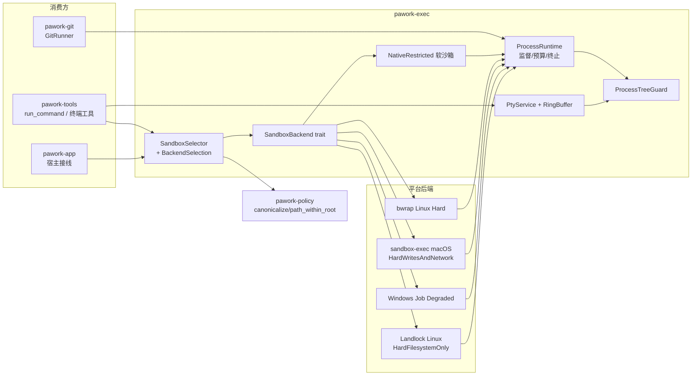

# pawork-exec Review

> 进程树 / 沙箱 / PTY 执行底座：跨平台 `ProcessRuntime`（进程组 + Job Object + 资源限额）、`SandboxSelector`（NativeRestricted / bwrap / Landlock / sandbox-exec / Windows Job）、可重连 `PtyService`。共 11 个 `.rs` 文件、7,047 行；主要模块 process.rs（1,064）、sandbox.rs（1,207）、pty/mod.rs（1,535）与 os/{linux,macos,windows} 平台层。

## 1. 职责与边界

- **进程运行时**：缓冲与流式两种执行入口；stdout/stderr 无死锁并发读取；timeout / cancel / kill 任一触发终止整棵进程树；输出预算（默认 8 MiB）跨双流共享；kill 幂等且 5s 有界。
- **沙箱**：声明式 `SandboxPolicy` → 平台后端。第一层软限制（spawn 许可、cwd 锁定、env 清洗、资源上限）所有后端共用；平台层按探测结果选择最强硬隔离（macOS sandbox-exec / Linux bwrap→Landlock / Windows Job），不可用可观测回退 NativeRestricted，绝不把软限制伪装成硬隔离。
- **PTY**：portable-pty 封装，输出留进程内有界环形缓冲（不写 Agent Event Store），支持游标续读、重连快照、实时广播（容量满丢弃可观测）、owner 隔离与显式清理。
- **自含性**：不依赖 `pawork-domain`，取消令牌用本 crate `cancel`（与 domain 令牌隔离，W1）；路径判定复用 `pawork-policy`（ADR-052）。
- 边界：不做策略裁决（policy 负责）、不落地事件持久化；PTY 输出缓冲是进程内存态，重启即失。

## 2. 依赖关系

| 方向 | 包 / crate | 用途 |
|---|---|---|
| 依赖（pawork-*） | pawork-policy | `canonicalize_platform` / `path_within_root`（cwd / root / deny 判定） |
| 被依赖 | pawork-tools | run_command / PTY 工具经沙箱执行 |
| 被依赖 | pawork-git | `GitRunner` 复用 ProcessRuntime 与 CancellationToken |
| 被依赖 | pawork-app | 宿主进程 / 沙箱 / 终端接线 |
| 外部 | tokio（io-util/macros/process/rt/sync/time） | 异步进程与监督任务 |
| 外部 | portable-pty 0.9 | PTY 跨平台抽象（openpty / ConPTY） |
| 外部 | async-trait | `SandboxBackend` 异步 trait |
| 外部 | libc | setpgid / setrlimit / prctl / kill / flock 语义 / proc_listpids |
| 外部 | serde / serde_json / thiserror / tracing | 决策结构序列化、错误、可观测降级日志 |
| 平台 | landlock（仅 Linux） | Landlock ruleset API |
| 平台 | windows（仅 Windows，Win32_Foundation/Security/JobObjects/Threading/ToolHelp） | Job Object、CREATE_SUSPENDED、NtResumeProcess |
| dev | tempfile / tokio（rt-multi-thread 等） | 集成测试 |

## 3. 文件清单

| 相对路径 | 行数 | 职责 |
|---|---|---|
| src/lib.rs | 49 | 入口；模块声明与 re-export（含平台函数 crate 内导出） |
| src/cancel.rs | 166 | 自含 CancellationToken（waker 注册表） |
| src/process.rs | 1,064 | ProcessRuntime：spawn / 监督 / 输出预算 / Unix pre_exec / 流式入口 |
| src/sandbox.rs | 1,207 | 沙箱模型、软限制层、后端 trait 与选择器、secret/env 权威清单 |
| src/tree.rs | 184 | ProcessTreeGuard 跨平台进程树守卫 |
| src/os/mod.rs | 8 | 平台模块开关（linux / macos / windows） |
| src/os/linux.rs | 1,153 | bwrap argv 生成、Landlock 编译与后端、/proc 进程树终止 |
| src/os/macos.rs | 993 | Seatbelt profile 生成、sandbox-exec 后端、libproc 进程树终止 |
| src/os/windows.rs | 546 | AppContainer 配置（frozen）、Job Object、WindowsJobBackend |
| src/pty/mod.rs | 1,535 | PtyService：会话生命周期、事件广播、重连 |
| src/pty/buffer.rs | 142 | RingBuffer 与游标读取 |

（无独立 tests/ 目录，测试内联。）

## 4. 类型与方法功能列表

### 4.1 cancel

| 名称 | 种类 | 功能 / 语义 |
|---|---|---|
| `CancellationToken` | struct | `Arc<CancellationState>`（`AtomicBool` + waker 的 `BTreeMap`）；`new` / `cancel`（首个取消者唤醒全部 waiter）/ `is_cancelled` / `cancelled() -> CancellationFuture`。与 domain 令牌同形但不依赖 domain |
| `CancellationFuture` | struct | 手写 Future：先查标志再注册 waker（双重检查防丢失唤醒）；Drop 移除 waker；`#[must_use]` |

### 4.2 process

| 名称 | 种类 | 功能 / 语义 |
|---|---|---|
| `ProcessLimits` | struct | `cpu_time: Option<Duration>` / `memory_bytes` / `open_files` / `max_processes`（OS 级 rlimit / Job 限额） |
| `LinuxLandlockPolicy` | struct（仅 Linux；crate 根 pub(crate) re-export） | Linux 专用：`read_paths` / `write_paths`；父进程预编译为 ruleset FD，`pre_exec` 只做 restrict |
| `CommandSpec` | struct | `program` / `args` / `cwd` / `env_clear` / `env` / `timeout` / `max_output_bytes`（默认 8 MiB）/ `limits` / Linux `landlock`；builder `new` / `arg` / `args` |
| `ProcessOutput` | struct | `stdout` / `stderr` / `exit_code: Option<i32>` / `truncated` / `timed_out` / `killed` |
| `ProcessEvent` | enum | 变体：`Stdout(Vec<u8>)`、`Stderr(Vec<u8>)`、`Exit { code: Option<i32>, truncated: bool }` |
| `ProcessInput` | struct | 受控 stdin 写端（`Arc<Mutex<Option<ChildStdin>>>`）；`write_all`（写 + flush，防帧滞留）/ `close`（shutdown，幂等）。clone 只共享串行化写端，不绕过生命周期 |
| `ProcessError` | enum | 变体：`Spawn { program, source }`、`ProcessTree { program, source }`、`Isolation { program, source }`、`KillTimeout { process_id }`、`Io(std::io::Error)` |
| `ProcessHandle` | struct | `kill()`（幂等，watch done + 5s 超时→`KillTimeout`）/ `id()`；**Drop 自动 cancel kill token**——句柄泄漏即杀树 |
| `ProcessRuntime` | struct | `run(spec, cancel) -> ProcessOutput`（缓冲执行）；`spawn_stream(spec, cancel) -> (Receiver<ProcessEvent>, ProcessHandle)`；`spawn_interactive(...) -> (rx, ProcessInput, ProcessHandle)`（LSP/MCP 长驻协议进程入口）；无 Clone 状态（`Copy` unit 结构） |

关键私有实现（`spawn_child` / `configure_unix_child` / `stream_chunks` / `collect_to_vec` / `reserve_output_bytes`）：

- **Unix `pre_exec` 顺序**：`setpgid(0,0)` → `setrlimit`（CPU / AS（macOS 上 EINVAL 被容忍——Darwin 不可降地址空间上限）/ NOFILE / NPROC（**macOS 跳过**：RLIMIT_NPROC 按 uid 计数会误伤整个用户；Linux 交给 bwrap PID namespace））→ Linux `PR_SET_PDEATHSIG(SIGKILL)` + `getppid()==1` 竞态检查 → Landlock restrict（FD 由父进程编译，fork 后不开文件）。
- **Windows**：`CREATE_SUSPENDED` 创建 → `ProcessTreeGuard::attach`（Job Object）→ `NtResumeProcess`；resume 失败立即杀子，堵住绑定前派生后代的窗口。
- **监督状态机**（`spawn_stream_inner` 的监督任务，select 全部 `biased`）：cancel / kill token / timeout 任一先到 → `kill_child_tree`；`child.wait()` 先到 → 记录退出码并 `tree.terminate()`。`done_tx.send(true)` 先于输出任务收尾——句柄等待的是进程树退出，**不被未消费的输出通道背压阻塞**；`Exit` 事件最后发送（带 `truncated` 快照）。
- **输出预算**：双流共享 `Arc<AtomicU64>`（默认 8 MiB），8 KiB 块读取，`reserve_output_bytes` CAS 预扣；预算耗尽截断并置 `truncated`，读端继续排空防止子进程写管道阻塞。

### 4.3 sandbox

| 名称 | 种类 | 功能 / 语义 |
|---|---|---|
| `NetworkMode` | enum | 变体：`Off`、`Hint`（仅记录意图）、`Enforce`（默认；需硬隔离后端保证） |
| `FilesystemPolicy` | struct | `read_roots` / `write_roots` / `deny`（优先级最高） |
| `ResourceLimits` | struct | `cpu_seconds` / `memory_mb` / `open_fds` / `wall_time_ms` / `max_output_bytes` |
| `SandboxPolicy` | struct | 上述三块 + `allow_spawn`（**默认 false，spawn 拒绝**）/ `max_procs` / `env_clear` / `env_allowlist` / `env_denylist` |
| `SandboxPolicy::untrusted_default` | fn | 未信任工作区最小权限：workspace 只读、deny=`default_secret_paths()`、网络 Enforce、`allow_spawn=false`、env_clear + `default_env_allowlist()` |
| `SandboxProcessSpec` | struct | `command: CommandSpec` + `workspace_roots` |
| `SandboxProcess` | struct | `events` + 私有 `_handle`（**字段保留不可移除**：handle Drop 即杀树，必须与事件流同生命周期） |
| `SandboxInteractiveProcess` | struct | `events` + `input` + `handle`；`into_parts` 拆分 |
| `SandboxError` | enum | `Denied(String)` / `PathEscape(String)` / `BackendUnavailable(&'static str)` / `Process(ProcessError)` |
| `SandboxBackend` | trait | `fn id(&self) -> &'static str`；`fn available(&self) -> bool`（探测结果，不在 spawn 热路径重算）；`async fn spawn(spec, policy, cancel) -> Result<SandboxProcess, SandboxError>`；`async fn spawn_interactive(...)`（**默认显式拒绝**，防第三方后端静默降级为裸进程） |
| `NativeRestricted` | struct | 纯 Rust 软沙箱，永远可用（`available() == true`）：软限制层 + 网络 Enforce 时显式 warn 降级 Hint（target `pawork.sandbox`），再委托 ProcessRuntime。**不是对抗性边界**（挡不住已授权命令内部越权） |
| `SandboxSelector` | struct | `pick() -> (Box<dyn SandboxBackend>, BackendSelection)`：候选序 macOS sandbox_exec → Linux bwrap → landlock → Windows（appcontainer 探测冻结 false → windows_job 无条件 Degraded）→ 其他/全败 NativeRestricted（Soft，fallback=true） |
| `BackendSelection` | struct | `id` / `fallback` / `note` / `isolation` / `attempted: Vec<ProbeOutcome>`（Serialize，进工具 metadata，降级必须可观测） |
| `IsolationLevel` | enum | 变体（serde snake_case，**五词冻结**）：`Soft`、`Hard`（Linux bwrap）、`HardWritesAndNetwork`（macOS Seatbelt）、`HardFilesystemOnly`（Landlock，网络未强制）、`Degraded`（探测到能力但 spawn 路径不可用/软沙箱）；`as_str()` 对应五字符串 |
| `ProbeOutcome` | struct | `backend` / `available` / `reason`（Serialize） |
| `apply_soft_restrictions` | pub(crate) fn | 所有后端共用的第一层：`allow_spawn=false` → `Denied`；cwd 校验（见下）；env 清洗；输出上限 / 墙钟超时 / rlimit 从 policy 映射到 CommandSpec |
| `default_secret_paths` | pub fn | **secret deny 权威单一来源**（untrusted_default 与 builtin-tools run_command 共用，S13-F02）：`~/.ssh` `~/.aws` `~/.azure` `~/.kube`、整个 `~/.pawork` 及 `auth.json` / `mcp-auth.json`、`~/.gnupg`、`~/.config`、`~/.netrc`、`~/.git-credentials`、`~/.docker`、`~/.npmrc`、`~/.pypirc`、`~/.cargo/credentials.toml`；`PAWORK_HOME` 同样覆盖；`PAWORK_DATA_DIR`（整个 data root 含 protected/master.key 与加密 blob）；Windows 追加 `APPDATA/gcloud`、无 PAWORK_DATA_DIR 时 `LOCALAPPDATA/pawork` |
| `default_env_allowlist` | pub fn | 12 项白名单：PATH/HOME/LANG/LC_ALL/TERM/TMPDIR/SYSTEMROOT/TEMP/TMP/USERPROFILE/COMSPEC/PATHEXT（unix/Windows 并集，多余项自然不生效） |

`ensure_within`（cwd 校验，三重）：canonicalize 失败 → `PathEscape`；命中 deny（canonical 化）→ `Denied`；不在 workspace roots 内 → `PathEscape`；不在 read_roots ∪ write_roots 内 → `Denied`。`apply_env`：只要启用任一 env 过滤即强制 `env_clear`（否则 denylist 删不掉继承变量）；denylist 优先于 allowlist；`env_matches` 支持 `*core*`（包含）/ `*suffix` / `prefix*` / 精确，大小写不敏感。

### 4.4 tree

| 名称 | 种类 | 功能 / 语义 |
|---|---|---|
| `PROCESS_TREE_KILL_TIMEOUT` | pub(crate) const | 5s，kill 有界等待上限 |
| `ProcessTreeGuard` | struct | 跨平台进程树守卫；`attach_external(process_id, limits)`（PTY 等外部启动器复用：**Unix 要求目标是自身 process-group leader（pgid==pid），否则 InvalidInput**；Windows `attach_pid` 创建 Job 并收养既有后代）与 `attach(child, limits)`（runtime 子进程）；`terminate()` 幂等。`limits` 仅 Windows 生效（Unix 忽略） |

Unix terminate（linux/macos 委托 os 模块，其他 unix 仅 `killpg`）：先杀树见 §os；`Drop` 不做清理（由 ProcessHandle / 会话显式触发）。

### 4.5 os/linux

| 名称 | 种类 | 功能 / 语义 |
|---|---|---|
| `SYSTEM_READ_PATHS` | const | 系统只读路径单一来源（bwrap ro-bind 与 Landlock read_paths 共用）：`/usr /lib /lib64 /bin /sbin /nix /proc`、`/etc/ld.so.*`、`/etc/ssl`、`/etc/ca-certificates`、`/etc/resolv.conf`、`/etc/hosts`、`/etc/nsswitch.conf`、`/etc/passwd`、`/etc/group`、`/dev/urandom /dev/random /dev/null /dev/zero` |
| `linux_landlock_supported` | pub(crate) fn | 专用探测线程内真实创建 + restrict 一个 ruleset（Landlock 默认只限制调用线程，线程随即退出不影响调用方）；不依赖可能不可读的 `/sys` 状态文件 |
| `restrict_linux_landlock` | pub(crate) fn | `PR_SET_NO_NEW_PRIVS` + `landlock_restrict_self(2)`（pre_exec 内调用） |
| `prepare_linux_landlock` | pub(crate) fn | 父进程编译 ruleset：ABI V9 + BestEffort（旧内核剔除新访问位；完全不支持则 create 无 FD → 硬失败不静默降级）；read_paths 授 `AccessFs::from_read`，write_paths 授 from_all；目录/文件分别授权 |
| `linux_process_tree`（模块） | pub(crate) | `/proc/<pid>/stat` 解析（comm 含括号安全处理）；`start_time` 防 PID 复用；`terminate(root_pid, pgid, root_start_time)`：校验根未复用 → `killpg(SIGSTOP)` 冻结原组 → ≤16 轮 snapshot 收敛冻结已 `setsid` 逃逸的后代（每轮 yield）→ 按深度倒序 `SIGKILL` 后代 → `killpg(SIGKILL)` 兜底；ESRCH 视为成功 |
| `LandlockSupport` / `probe_landlock_support` | struct / fn | 探测结果（supported + reason），`OnceLock` 进程内缓存 |
| `generate_bwrap_argv` | pub fn | policy → bwrap argv（跨平台编译供单测）：系统读路径仅绑定存在者（跳过 /proc、/dev，由 `--proc` / `--dev` 挂载）；`--dev /dev` `--proc /proc`；read_roots + workspace_roots `--ro-bind`；write_roots `--bind`；**deny 位于已绑定根内 → `--tmpfs` 覆盖**（上层 bind 不暴露 Secret 子目录）；Enforce → `--unshare-net`；恒定 `--unshare-pid --unshare-ipc --unshare-uts --unshare-cgroup-try --die-with-parent --new-session` |
| `BwrapBackend`（Linux） | struct | 探测 = 真实跑 `bwrap --die-with-parent --ro-bind / / -- true`（`OnceLock` 缓存）；spawn：软限制 → bwrap argv + `--` + 内部命令 → ProcessRuntime |
| `LandlockBackend`（Linux） | struct | 探测复用 `probe_landlock_support`；spawn：软限制 → 网络 Enforce 时 warn（文件系统 only）→ `compile_policy` 注入 CommandSpec.landlock → spawn_stream/interactive |
| `compile_policy`（私有） | fn | read = read_roots + workspace_roots + cwd + **已解析 executable 单文件**（PATH 搜索、只授权文件不授权目录）+ 系统读路径（存在且不在 deny）；write = write_roots + `/dev/null` + `/dev/zero`；**deny 与任一 allow 根双向重叠（overlaps）→ `Denied` 拒绝执行**（Landlock 无法做减法） |

### 4.6 os/macos

| 名称 | 种类 | 功能 / 语义 |
|---|---|---|
| `SANDBOX_EXEC_PATH` | pub const | `/usr/bin/sandbox-exec` |
| `escape_seatbelt_string` | pub fn | Seatbelt 字符串转义（`\\` 与 `"`） |
| `path_forms`（私有） | fn | raw + canonicalize 双形态（canonicalize 失败仅保留 raw）——Seatbelt 按 canonical 路径匹配，单一 raw 形态会被 symlink 绕过 |
| `generate_seatbelt_profile` | pub fn | policy → version 1 s-expression：`deny default` 起底；allow process-exec/fork/signal(self)/sysctl-read/mach-lookup/ipc-posix-shm/file-read-metadata；**读 = 整盘 `file-read* (subpath "/")` allow + secret deny 挖洞**（Darwin 25+ firmlink/cryptex 使目录枚举不可行，ADR-041 D1；deny 必须用 `file-read*` 才盖得住整盘 allow）；写 = write_roots + `/tmp` + `/private/tmp` + `$TMPDIR`（双形态）+ `/dev`；**每个 write_root ∪ workspace_root 永久禁写 `.git`（subpath）与 `.env`（literal），双形态**；deny 路径读写全拒（双形态）；Enforce → `deny network*`，Hint/Off → `allow network*`；`max_procs` 仅注释标注（Seatbelt 无可靠原语，实际靠 RLIMIT_NPROC，诚实降级） |
| `SandboxExecBackend`（macOS） | struct | 探测 = 真实 sandbox-exec 跑 `/usr/bin/true`（OnceLock）；spawn：软限制 → `sandbox-exec -p <profile> -- <命令>` → ProcessRuntime；IsolationLevel = HardWritesAndNetwork |
| `macos_process_tree`（模块） | pub(crate) | 与 Linux 同语义：`proc_listpids`（PROC_ALL_PIDS=1，libc 未导出常量）+ `proc_pidinfo`（PROC_PIDTBSDINFO）取 ppid/pgrp/start_time；冻树 → 收敛 → 深度倒序 SIGKILL → killpg 兜底；start_time 防 PID 复用 |

### 4.7 os/windows

| 名称 | 种类 | 功能 / 语义 |
|---|---|---|
| `AppContainerCapability` | enum | 变体：InternetClient / InternetClientServer / PrivateNetworkClientServer / DocumentsLibrary / PicturesLibrary / VideosLibrary / MusicLibrary。**frozen**：受限令牌 spawn 需要 EXTENDED_STARTUPINFO，保留供诊断与单测 |
| `AppContainerConfig` | struct | capabilities / internet_granted / read_paths / write_paths / denied_paths（frozen 纯数据） |
| `policy_to_appcontainer_config` | pub fn | Enforce → 不授予 Internet；Off/Hint → 授予（frozen 生成器） |
| `probe_appcontainer_job` | pub fn | Windows 经 kernel32 `IsProcessInJob` 记录父 Job 状态；**`available: false` 冻结**（受限令牌 spawn 不可用，回退 Job-only）；非 Windows stub |
| `Job`（windows 模块） | pub(crate) struct | `create(limits)`：KILL_ON_JOB_CLOSE + ACTIVE_PROCESS / JOB_MEMORY / JOB_TIME 限额映射；`attach(child)`（挂起子进程直接绑定）；`attach_pid(pid)`：OpenProcess → AssignProcessToJobObject → **不可绑定且仍存活的进程立即 TerminateProcess(1)**（否则守卫覆盖面失真）；`adopt_existing_descendants`：Toolhelp32 快照 + PPID 链 + **creation time 防 PID 复用**，≤16 轮收敛收养绑定窗口内已派生的后代；`terminate` = TerminateJobObject；Drop CloseHandle 触发 KILL_ON_JOB_CLOSE |
| `resume`（windows 模块） | pub(crate) fn | `NtResumeProcess`（ntdll）；失败即错误（调用方杀子） |
| `WindowsJobBackend` | struct | 无条件可用（Degraded）：Job 施加进程/资源限额与整树生命周期，**文件/网络隔离为软限制**（Enforce 时 warn） |

### 4.8 pty（mod + buffer）

| 名称 | 种类 | 功能 / 语义 |
|---|---|---|
| `OwnerSessionId` / `TerminalId` | struct | newtype（`String`）；`pty-<n>` 自增 id |
| `OutputCursor` | type alias（`u64`） | 环形缓冲绝对字节偏移；crate 根 re-export |
| `DEFAULT_BUFFER_CAPACITY` | pub const | 256 KiB 输出环形缓冲默认容量 |
| `DEFAULT_EVENT_CAPACITY`（私有） | const | 256（broadcast 容量） |
| `CLEANUP_GRACE`（私有） | const | 5s（cleanup/shutdown 等待 child reap） |
| `PTY_SPAWN_LOCK`（私有） | static | std Mutex，openpty+spawn 短临界区（musl 上并发 openpty 有 UB 风险）；会话 I/O 与生命周期仍完全并发 |
| `PtyCreateSpec` | struct | `owner_session` / `shell`（None=平台默认：Windows cmd.exe，Unix $SHELL→/bin/sh）/ `args` / `cwd` / `env` / `size` / `buffer_capacity` |
| `PtyWindowSize` | struct | rows / cols（u16） |
| `PtySessionState` | enum | 变体：`Running` / `Exited` / `Killed` |
| `PtyEvent` | enum | 变体：`Output { data, cursor_end }`（写入后的绝对游标）；`Exit { code, signal, state }`——**state 为 waiter 写入退出事实后的权威终态**，即使会话已被 cleanup 从 map 移除，订阅者仍可无竞态区分自然退出与 kill |
| `PtySnapshot` | struct | 终端 id / owner / state / size / buffer_start / buffer_end / buffered / exit_code / exit_signal / **dropped_events**（实时流因容量满被覆写的数量，重连消费者可感知缺失） |
| `PtyOutputChunk` | struct | `from` / `to` / `data`（增量读取结果） |
| `PtyError` | enum | 变体：`NotFound(TerminalId)` / `Ownership(TerminalId, OwnerSessionId)` / `Closed(TerminalId)` / `StaleCursor { requested, available_from }` / `FutureCursor { requested, end }` / `Create(String)` / `Spawn(String)` / `ProcessTree(String)` / `Io(String)` / `ShuttingDown` |
| `PtyService` | struct | 会话表 + 自增 id + shutting_down 标志；方法见下 |
| `PtyService::create` | async fn | shutdown 竞态双检（创建中途关停 → 立即 force_kill + 报 ShuttingDown）；`spawn_blocking` 内 `open_and_spawn`（持 PTY_SPAWN_LOCK：openpty → build_command → spawn → drop slave → **必须拿到 process_id 否则拒绝无守卫会话** → `ProcessTreeGuard::attach_external` 失败即杀）；随后起两个**专用 OS 线程**：reader（8 KiB 读 → RingBuffer.push → broadcast Output）与 waiter（child.wait → 写入权威终态 + 发 Exit 事件 → cleanup_handles + closed.notify_waiters）。线程起失败即 force_kill + 移除会话 |
| `resize` / `write` | async fn | owner 校验 + ensure_running；blocking 操作放 spawn_blocking |
| `subscribe` | fn | 订阅实时 broadcast |
| `snapshot` / `read_output` / `state` | fn | 重连快照 / 游标续读（Stale/Future → 对应错误）/ 当前状态 |
| `list_for_owner` | fn | owner 名下全部终端 |
| `kill` / `wait_exit` | async fn | kill 幂等（已退出仅清理 handle；Running→Killed → 树终止 + killer + 丢弃 writer 发 EOF）；wait_exit 等待 waiter 完成（先建 notified future 再查谓词，防丢通知） |
| `cleanup` / `cleanup_owner` / `shutdown` | async fn | kill + CLEANUP_GRACE 内等待 reap（超时仅 warn）后**移除会话条目**；owner 批量；shutdown 全量并置 shutting_down。**退出后会话条目默认保留**（供重连读缓冲 / exit 态），仅显式 cleanup / shutdown / owner detach 移除 |
| `session_count` | fn | 含已退出未清理会话 |
| `RingBuffer` | struct | `new(capacity)`（max(1)）/ `capacity` / `start` / `end` / `len` / `is_empty` / `push`（超容丢最旧并推进 start）/ `snapshot` / `read_since(cursor)`（`cursor==end` 空增量；`<start` → Stale；`>end` → Future） |
| `RingReadError` | enum | `Stale { requested, available_from }` / `Future { requested, end }` |
| `send_event`（私有） | fn | broadcast 发送前检测队列已满：本次发送必然覆写一个慢消费者未读事件，递增 `dropped_events`（tokio 满时静默覆写，无错误信号——计数使事实可观测）；无订阅者直接返回 |
| `cleanup_handles`（私有） | fn | 幂等（`cleaned` 标志）：terminate 树、置空 writer/master/killer |
| `force_kill_blocking` / `kill_async`（私有） | fn | 创建失败路径的同步强杀 / 正常 kill（状态先转 Killed 再 spawn_blocking 内杀树 + killer + 丢 writer） |

## 5. 关键行为与契约

- **进程树生命周期**：Unix `setpgid(0,0)` + Linux PDEATHSIG(SIGKILL)（含 getppid 竞态检查）；Windows CREATE_SUSPENDED → Job attach → NtResumeProcess（失败即杀）。`ProcessHandle` Drop 自动 kill；kill 幂等且 5s 有界（`KillTimeout`）。监督 select 全部 `biased`，done 通知先于输出任务收尾，句柄不被事件通道背压阻塞。
- **输出预算契约**：`max_output_bytes` 是 stdout+stderr **合计**共享预算（默认 8 MiB），8 KiB 块 + 原子 CAS 预扣；截断事实进 `ProcessOutput.truncated` / `ProcessEvent::Exit.truncated`；预算耗尽后继续排空读端防子进程管道阻塞。
- **fail-closed 沙箱语义**：`allow_spawn` 默认 false（Default 与 untrusted_default 均拒）；cwd 三重校验（roots 内 / deny 洞外 / 读写根内）；env 过滤一旦启用即强制 env_clear，denylist 优先。软限制层挡“配置错误”，不挡已授权命令内部越权——这由硬隔离后端承担。
- **可观测回退（ADR-031）**：所有探测与回退记录在 `BackendSelection.attempted`（Serialize 进工具 metadata）；NativeRestricted 在 Enforce 下显式 warn 降级 Hint；Landlock 网络 Enforce 显式 warn；Windows Job 恒 Degraded。绝不静默声称硬隔离。
- **IsolationLevel 五词冻结**：soft / hard / hard_writes_and_network / hard_filesystem_only / degraded（golden 钉死）。语义不可互换：macOS Seatbelt 是 HardWritesAndNetwork 而非 HardFilesystemOnly（网络已强制）或 Degraded（spawn 可用）。
- **Seatbelt 模型（ADR-041 D1）**：读整盘 allow + secret deny 挖洞（`file-read*` 才能盖住整盘 allow；deny-default + 枚举系统目录在 Darwin 25+ 因 firmlink/cryptex 不可行）；写白名单 + `.git`/`.env` 每根永久禁写；deny 与写根 raw + canonical 双形态进 profile；`profile_full_output_golden` 全文钉死。max_procs 仅注释（诚实降级，靠 RLIMIT_NPROC）。
- **Landlock 模型**：ruleset FD 父进程编译、pre_exec 只 restrict（fork 后不开文件）；deny 与 allow 根双向重叠直接 `Denied`（Landlock 无减法语义）；executable 只授权已解析单文件（PATH 搜索）不授权目录树；探测 = 真实 ruleset 创建（OnceLock），不依赖 `/sys` 可读性。
- **bwrap 模型**：deny 在已绑定根内用 `--tmpfs` 覆盖；系统读路径只绑存在者；Enforce `--unshare-net`；恒定 unshare pid/ipc/uts/cgroup-try + die-with-parent + new-session；探测 = 真实 namespace smoke。
- **进程树终止算法**（Linux/macOS 同语义）：冻原组（SIGSTOP）→ ≤16 轮快照收敛冻结 setsid 逃逸者 → 深度倒序 SIGKILL → killpg 兜底；start_time / creation time 一致才发信号，**PID 复用时绝不误杀新树**（复用即静默成功）。Windows attach_pid 对不可绑定且存活的进程直接 TerminateProcess，防止守卫覆盖面失真。
- **PTY 契约**：输出只进进程内 RingBuffer（不写 Agent Event Store）；容量满丢最旧（Stale 游标告知消费者）；实时 broadcast 256 事件、满覆写前递增 `dropped_events`；Exit 事件携带权威 state；退出后条目保留供重连，显式 cleanup/cleanup_owner/shutdown（5s grace）移除；owner 不匹配返回 `Ownership`；spawn 全程持 PTY_SPAWN_LOCK 短临界区，无 process_id 拒绝建会话。
- **平台差异**：macOS 跳过 RLIMIT_NPROC、容忍 RLIMIT_AS EINVAL；Windows 限额走 Job Object（ACTIVE_PROCESS/JOB_MEMORY/JOB_TIME）；非 Linux/macOS unix 的树终止退化为 killpg；AppContainer 类型保留但探测冻结 `available:false`。
- **LinuxLandlockPolicy 可见性**：R0 D21 降为 crate 内（`pub(crate)`），R7 沙箱演进将重新消费（lib.rs 注释标注，勿随手删除）。

## 6. 测试资产

| 文件（内联 tests） | 验证点 |
|---|---|
| cancel.rs | 共享取消唤醒全部 waiter；drop 的 waiter 不再被唤醒 |
| process.rs | 缓冲 run 的 stdout/stderr/退出码；timeout / cancel 终树；输出截断与预算共享；spawn_interactive stdin 写入与关闭；监督顺序（退出事件在输出之后）；平台分支（部分用真实进程） |
| sandbox.rs | untrusted_default 形状；apply_soft_restrictions 的 cwd 三重校验与 env 清洗（含 `*` 模式）；default_secret_paths / default_env_allowlist 内容（HOME/PAWORK_HOME/PAWORK_DATA_DIR 各形态）；IsolationLevel 序列化五词；选择器回退可观测 |
| os/linux.rs | /proc stat 解析（comm 含括号）；generate_bwrap_argv 纯函数断言（ro-bind/bind/tmpfs/unshare 序）；compile_policy deny 重叠拒绝、executable 单文件授权；探测函数跨平台编译 |
| os/macos.rs | Seatbelt profile 纯函数与 **profile_full_output_golden**（全文钉死）；escape 函数；进程树模块单测（可跨平台部分） |
| os/windows.rs | AppContainer 配置生成（frozen）；探测 stub；Job 逻辑（Windows CI） |
| pty/buffer.rs | push 丢最旧推进 start；snapshot / read_since 的空 / Stale / Future 三态 |
| pty/mod.rs | create→write→read_output→snapshot→kill 全链路；owner 隔离与 Ownership 错误；容量满 dropped_events 可观测；退出后条目保留、显式 cleanup 移除；Exit 权威 state；ConPTY/真实 PTY 集成（平台相关） |

## 7. 协作关系

