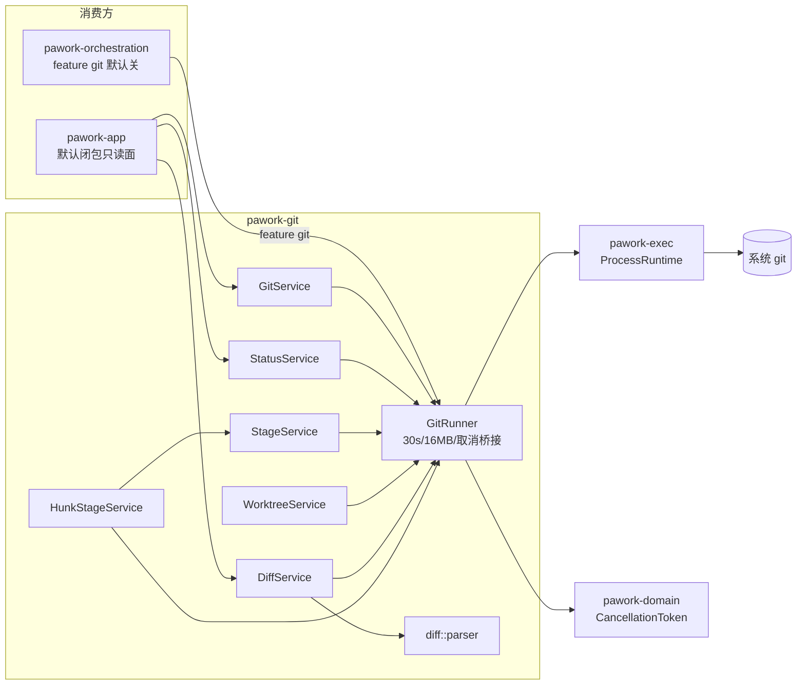

# pawork-git Review

> 系统 git 封装与结构化 Diff：`GitRunner` 统一进程执行（30s / 16MB / 取消桥接）、repo/status/stage/worktree 服务与 unified diff 解析（含 hunk/line 级暂存）。共 13 个 `.rs` 文件、3,730 行；主要模块 diff/service.rs（677）、diff/hunk_stage.rs（716）、stage.rs（452）。

## 1. 职责与边界

- 以系统 `git` 二进制为唯一后端（不内嵌 libgit2），所有命令经 `pawork_exec::ProcessRuntime` 执行并归一错误；stdout/stderr 以 lossy UTF-8 返回。
- 仓库元信息（work tree / git dir / bare / HEAD 三态）、porcelain v1 status 解析、stage/unstage/discard、worktree list/add/remove/prune。
- 结构化 diff：`--raw`/`--numstat`/单文件 unified patch 三路输出合成 `DiffFile`/`DiffHunk`/`DiffLine`（HunkId 全局自增），支持 rename/binary/untracked/submodule/CRLF/无末尾换行/Unicode 文件名与分页。
- hunk / line 级暂存：由结构化 diff 构造最小 unified patch，经 `git apply --cached [--reverse]` 只动 index 不触碰工作区。
- 边界：不做策略裁决（危险操作分类只提供 `StageRisk` 供上层审批）；不落事件持久化；branch/stash/conflict/history/cache/commit 六个零消费服务已按 R0/ADR-038 D16 归档删除（tag `v2-final` 可找回，复活条件见 docs/spec/backlog.md）。

## 2. 依赖关系

| 方向 | 包 / crate | 用途 |
|---|---|---|
| 依赖（pawork-*） | pawork-domain | `CancellationToken`（对外 API 口径） |
| 依赖（pawork-*） | pawork-exec | `ProcessRuntime` / `CommandSpec` / exec 侧 `CancellationToken` |
| 被依赖 | pawork-app | 默认闭包内的只读面（status / diff 等） |
| 被依赖 | pawork-orchestration | feature `git`（默认关，optional dep） |
| 外部 | tokio（sync/macros/rt/time/fs） | 异步服务与取消桥接 |
| 外部 | serde / serde_json | FileStatus / FileChange / Diff 模型序列化 |
| 外部 | thiserror / tracing | GitError；patch 临时文件清理日志 |
| 外部 | dunce | Windows verbatim cwd 简化；worktree 路径 canonicalize |
| 外部 | tempfile | **正式依赖**：hunk-stage patch 独占临时文件（非仅测试） |
| dev | proptest / tempfile / tokio | parser 契约与集成测试 |

## 3. 文件清单

| 相对路径 | 行数 | 职责 |
|---|---|---|
| src/lib.rs | 39 | 入口；模块声明与 re-export；归档说明 |
| src/error.rs | 70 | GitError 统一错误与 ProcessError 归一 |
| src/process.rs | 204 | GitRunner 统一调用入口与取消桥接 |
| src/repo.rs | 411 | GitService：仓库检测与 HEAD/元信息 |
| src/status.rs | 369 | StatusService：porcelain v1 -z 解析 |
| src/stage.rs | 452 | StageService：stage/unstage/discard/apply patch |
| src/worktree.rs | 363 | WorktreeService：list/add/remove/prune |
| src/diff/mod.rs | 22 | diff 模块入口与 re-export |
| src/diff/model.rs | 71 | DiffFile/DiffHunk/DiffLine/HunkId/LineKind 数据模型 |
| src/diff/parser.rs | 271 | unified diff 纯字符串状态机解析 |
| src/diff/service.rs | 677 | DiffService：git 调用 + 解析 + 分页 |
| src/diff/hunk_stage.rs | 716 | HunkStageService 与 patch 构造 |
| tests/parser_contract.rs | 65 | parser golden + proptest 不 panic 契约 |

## 4. 类型与方法功能列表

### 4.1 error

| 名称 | 种类 | 功能 / 语义 |
|---|---|---|
| `GitError` | enum | 变体：`GitNotFound(String)`、`NotARepository(String)`、`DetachedHead`、`GitFailed { code: Option<i32>, stderr: String }`、`NothingToCommit`、`BranchAlreadyExists`、`BranchNotFound`、`BranchNotMerged`、`ReferenceNotFound`、`InvalidPositionArgument { name: &'static str, value: String }`、`LocalChangesWouldBeOverwritten(Vec<String>)`、`PatchDoesNotApply`、`Conflict(String)`、`Timeout`、`Cancelled`、`Io(std::io::Error)`、`Other(String)` |
| `From<ProcessError>` | impl | 归一表：`Spawn` + `ErrorKind::NotFound` → `GitNotFound`（否则 Other）；`ProcessTree` / `Isolation` → Other（带程序名）；`KillTimeout` → `Timeout`；`Io` → `Io` |

（`Branch*` / `NothingToCommit` / `Conflict` / `LocalChangesWouldBeOverwritten` 等变体主要服务已归档的 branch/commit 面，保留供复活。）

### 4.2 process

| 名称 | 种类 | 功能 / 语义 |
|---|---|---|
| `validate_position_arg` | pub fn | 拒绝以 `-` 开头的 revision / range / branch / 路径值（`InvalidPositionArgument`），防上层（含模型输出）被 git 重新解释为选项；路径参数走 `--` 分隔不经此校验 |
| `GitRunner` | struct | 持有 `ProcessRuntime` + git 路径 + 默认超时；`new()`（`git`、30s）、`with_runtime(...)`（测试注入）、测试钩子 `with_call_count` |
| `GitRunner::run` | async fn | `(cwd, args, cancel) -> Result<String>`：stdout（lossy UTF-8） |
| `GitRunner::run_with_stderr` | async fn | 同上但返回 `(stdout, stderr)`；语义归一：`timed_out` → `Timeout`；`killed && exit_code.is_none()` → `Cancelled`；退出码 0 → Ok，否则 `GitFailed { code, stderr }` |
| `bridge_exec_cancel`（私有） | fn | domain 令牌 → exec 令牌桥接（已取消立即 cancel，否则 spawn 后台等待任务；**调用返回后 abort 桥接任务**），与 pawork-tools 的 run_command 桥接同形 |
| `simplified_cwd`（私有） | fn | `dunce::simplified` 去除 Windows `\\?\` verbatim 前缀（部分 git 版本不能稳定处理） |
| `DEFAULT_TIMEOUT` / `MAX_OUTPUT_BYTES`（私有） | const | 30s 超时；单次输出 16 MiB 上限（防巨量 diff/log 打爆内存） |

注意：`env_clear` 保持 false 是**契约而非疏漏**——git 需要读取用户配置与 credential helper。

### 4.3 repo

| 名称 | 种类 | 功能 / 语义 |
|---|---|---|
| `Head` | enum | 变体：`Branch(String)`（短名）、`Detached(String)`（当前 commit SHA）、`Unborn`（尚无 commit） |
| `RepoInfo` | struct | `work_dir` / `git_dir` / `head` / `bare` |
| `GitService` | struct | 单仓库访问句柄；`open(path, cancel)` 沿父目录 `rev-parse --show-toplevel` 探测（失败 → `NotARepository`）；`work_dir()` / `runner()` |
| `GitService::git_dir` | async fn | `--absolute-git-dir`（linked worktree 指向主仓库 `.git/worktrees/<name>`） |
| `GitService::is_bare` | async fn | `--is-bare-repository` |
| `GitService::current_branch` | async fn | 基于 `current_head`，detached/unborn 返回 `None` |
| `GitService::current_head` | async fn | 三态判定：`symbolic-ref --short HEAD` 成功 → Branch（空输出 → Unborn）；失败且 stderr 含 `detached` → `rev-parse HEAD` → Detached；其他失败（unborn）→ Unborn |
| `GitService::repo_info` | async fn | **固定两次 spawn**：合并 rev-parse（toplevel/git-dir/bare/HEAD）+ symbolic-ref 区分 Branch/Detached；unborn 使合并查询整体非零时回退不含 HEAD 的三字段查询（仍两次）。`call_count` 测试钩子断言次数 |
| `parse_repo_metadata`（私有） | fn | 严格解析 3/4 字段（数量或空值不符 → Other；bare 只认 true/false） |

### 4.4 status

| 名称 | 种类 | 功能 / 语义 |
|---|---|---|
| `FileStatus` | enum | 变体（serde snake_case，**唯一文件状态类型**）：`Unmodified`（默认，' '）、`Added`（A）、`Modified`（M）、`Deleted`（D）、`Renamed`（R）、`Copied`（C）、`Unmerged`（U）、`TypeChanged`（T）、`Untracked`（?） |
| `FileChange` | struct | `path` / `previous_path`（R/C 原路径）/ `index_status`（X 列）/ `worktree_status`（Y 列）/ `untracked`（整条为 `??`） |
| `StatusSnapshot` | struct | `changes: Vec<FileChange>` |
| `StatusService` | struct | `status(cancel)`：`git status --porcelain=v1 -z --untracked-files=all`；`changed_files(cancel)`：剔除未跟踪与双 Unmodified |
| `read_status` | async fn | 免构造服务的便捷入口 |
| `parse_porcelain`（私有） | fn | NUL 分隔解析：每条 `XY PATH\0`，X 为 R/C 时后跟 `ORIG\0`；条目短于 `"XY "` 或格式异常即停止（保守） |
| `status_from_code`（私有） | fn | 单字符映射；**未知字符（含 `--ignored` 的 `!`）保守映射为 Unmodified** |

### 4.5 stage

| 名称 | 种类 | 功能 / 语义 |
|---|---|---|
| `StageRisk` | enum | `Safe`（默认）/ `Dangerous`；供 UI 决定是否审批 |
| `StageRequest` | struct | 相对 work_dir 的路径列表；`new(paths)` |
| `StageOp` | enum | `Stage` / `Unstage` / `Discard` / `StageAll` |
| `StageService` | struct | 见方法行 |
| `StageService::stage` | async fn | `git add -- <paths>`；空列表无操作 |
| `StageService::unstage` | async fn | `git reset -q -- <paths>` |
| `StageService::discard` | async fn | `git checkout -- <paths>`（高风险：丢未提交改动）；**`--` 分隔使形如 `--force` 的文件名可安全 stage/discard**（有回归） |
| `StageService::stage_all` | async fn | `git add -A` |
| `StageService::classify` | fn | 仅 `Discard` → Dangerous，其余 Safe（不改状态） |
| `StageService::apply_patch_to_index` | async fn | `git apply --cached [--reverse] <tempfile>`；空 patch 无操作；patch 与 index 不匹配（stderr 含 `does not apply` / `patch failed`）归一 `PatchDoesNotApply`；临时文件清理失败仅在 git 成功时上抛，否则 warn 保留原错误 |
| `create_patch_file[_in]`（私有） | fn | `tempfile::Builder` 随机前缀 + `.patch` 后缀，独占创建（0600/Unix）；句柄保留到 git 返回（消除可预测路径与 write/apply 间替换窗口，防 symlink 攻击，有回归） |
| `run_path_op`（私有） | fn | 统一执行 `git <prefix...> -- <paths>` |

### 4.6 worktree

| 名称 | 种类 | 功能 / 语义 |
|---|---|---|
| `Worktree` | struct | `path`（canonical）/ `branch`（短名，detached 为 None）/ `bare`；Serialize/Deserialize |
| `WorktreeService` | struct | 持 runner 引用 + 主工作目录；`list`（`worktree list --porcelain -z`，路径经 `dunce::canonicalize` 归一以便比较 macOS `/var`→`/private/var` 类 symlink）；`add(new_path, branch_ref, start_point)`：三值均过 `validate_position_arg`，目标已存在且非空报错，成功后从 list 回找返回 Worktree；`remove(path, force)`：**先 `list()` 校验为受管 worktree，否则直接报错；文件清理只交给 `git worktree remove`，绝不 std::fs 删目录**（ADR-007）；`prune`（只清元数据不动文件） |
| `parse_worktree_list`（私有） | fn | `-z` porcelain 解析：NUL 切 token，`worktree ` 前缀开新条目，`bare` / `branch ` 字段填充；HEAD/detached 忽略 |
| `strip_branch_prefix` / `path_is_non_empty`（私有） | fn | `refs/heads/` → 短名；目录非空判定（仅 add 前置检查） |

### 4.7 diff::model

| 名称 | 种类 | 功能 / 语义 |
|---|---|---|
| `LineKind` | enum | 变体（snake_case，默认 Addition）：`Context` / `Addition` / `Deletion` |
| `HunkId` | struct | `pub u64` tuple；crate 内自增分配 |
| `DiffLine` | struct | `kind` / `text`（不含 `+`/`-`/` ` 前缀）/ `old_no_newline`（旧文件侧无末尾换行，作用于 Deletion/Context）/ `new_no_newline`（新侧，Addition/Context） |
| `DiffHunk` | struct | `id` / `old_start` / `old_lines` / `new_start` / `new_lines` / `header`（原文如 `@@ -1,3 +1,4 @@`）/ `lines` |
| `DiffFile` | struct | `path` / `previous_path`（rename/copy）/ `status: FileStatus` / `staged`（true=对比 index）/ `binary` / `additions` / `deletions` / `hunks`；`changed_lines()` = add+del |

### 4.8 diff::parser

| 名称 | 种类 | 功能 / 语义 |
|---|---|---|
| `parse_unified` | pub fn | patch → `Vec<DiffHunk>`，HunkId 从 0 自增 |
| `parse_unified_with_start` | pub fn | `(patch, start) -> (hunks, next_id)`，供多文件全局连续编号 |
| `apply_no_newline_marker`（私有） | fn | `\\ No newline at end of file` 作用到**上一行**：Deletion→仅旧侧、Addition→仅新侧、Context→两侧一致 |
| `parse_hunk_header` / `parse_signed_range` / `parse_range`（私有） | fn | 手写解析 `@@ -o,ol +n,nl @@ ...`（无正则）；`parse_signed_range` 只匹配「符号+数字且前一字符非数字」位置防误命中；缺省 lines 视为 1 |

解析规则：`@@` 开新 hunk；未进 hunk 前的文件头行跳过；前缀 ` `/`-`/`+` 为内容行；其他无前缀行忽略（防误判）。100k 行单线程 < 500ms（性能测试钉死）。

### 4.9 diff::service

| 名称 | 种类 | 功能 / 语义 |
|---|---|---|
| `DiffOptions` | struct | `staged`（--cached）/ `context`（-U<n>，默认 3）/ `detect_renames`（-M，默认 true）/ `commit_range`（如 `HEAD~1..HEAD`，过 `validate_position_arg`） |
| `DiffPage` | struct | `files` / `total_files` / `page` / `page_size` |
| `paginate` | pub fn | page 从 1 起；`page_size == 0` 返回全部；越界页返回空切片 |
| `DiffService` | struct | `new(git, work_dir)`；`diff_summary`：`--raw -z` + `--numstat -z` 两路 + 非 staged 时 `ls-files --others --exclude-standard -z` 补未跟踪（status=Untracked，不解析文本 hunk）；`diff`：summary 基础上逐非 binary 文件 `git diff [<opts>] -U<n> --no-color -- <path>` 解析 hunks（**binary / gitlink / untracked 跳过**，防把 submodule 工作树当文件内容解析），HunkId 跨文件连续自增 |
| `base_args` / `run_raw` / `run_numstat` / `run_file_patch` / `append_untracked`（私有） | fn | 公共参数前缀（diff、--cached、range、-M）与三路命令 |
| `parse_raw`（私有） | fn | `--raw -z` 解析：header 取末字段首字母映射状态（A/D/R/C/T/U，其余→Modified）；R/C 后跟原路径段（previous_path）；old/new mode 任一 `160000` → gitlink（binary 标记） |
| `merge_numstat`（私有） | fn | `--numstat -z` 填充 additions/deletions；`-\t-` → binary；rename/copy 记录 path 留空时跨两个 NUL 字段取 new path |
| `raw_status` / `is_gitlink`（私有） | fn | 状态提取与 submodule 判定 |

### 4.10 diff::hunk_stage

| 名称 | 种类 | 功能 / 语义 |
|---|---|---|
| `HunkStageService` | struct | `new(git, work_dir)`；`stage_hunks(file, hunk_ids, cancel)`（worktree→index；空/无匹配无操作）；`unstage_hunks`（`--reverse`，file 应来自 staged diff）；`stage_lines(file, hunk_id, selection, cancel)`（按行；选择后无内容无操作）；`unstage_lines`；全部经 `StageService::apply_patch_to_index`，**只动 index 不触碰工作区** |
| `check_supported`（私有） | fn | binary / Renamed / Copied / TypeChanged / Unmerged / Untracked → `Other`（上层回退整文件 stage）；Modified/Added/Deleted 支持 |
| `build_hunk_patch` | pub fn | hunk 级 patch：原样复用 hunk 头与行内容（含无末尾换行标记）；文件头 Added→`--- /dev/null`、Deleted→`+++ /dev/null` |
| `build_line_patch` | pub fn | 行级 patch：Context 恒保留；未选 Addition 丢弃（留在工作区）；未选 Deletion **转为 context**（不暂存该删除）；重算 hunk 头计数；无任何选中增删行 → `None` |
| `push_line`（私有） | fn | 按输出前缀选无末尾换行标志侧：`-` 看旧侧、`+` 看新侧、context 看两侧（任一即标）。修复此前所有前缀都看 `new_no_newline` 导致删除行/转 context 旧行漏标旧侧 `\\ No newline`、patch 非法的缺陷（P7-9 V9 回归） |
| `emit_line` / `file_header`（私有） | fn | 按原行类型输出；`---`/`+++` 路径头 |

语义约定（模块文档钉死）：stage_* 的 file 来自 worktree vs index diff（`DiffOptions::default()`）；unstage_* 来自 staged diff；selection 与 hunk.lines 逐行对齐。

### 4.11 tests/parser_contract

| 名称 | 种类 | 功能 / 语义 |
|---|---|---|
| golden_basic_hunk_is_stable 等 3 个 `#[test]` | test | 三个 golden 文件（basic_hunk / no_newline / context_no_newline）钉死解析输出 |
| parse_unified_never_panics（proptest） | test | 任意 Unicode 字符串（≤512）不 panic |
| parse_unified_never_panics_on_bytes | test | 任意字节经 lossy 转字符串不 panic |

## 5. 关键行为与契约

- **调用契约**：所有 git 命令 30s 超时、16 MiB 输出上限、进程树终止与取消由 exec runtime 承担；env 不清空（git 需用户配置与 credential）；非零退出归一 `GitFailed`，超时 `Timeout`，取消 `Cancelled`。
- **参数注入防线**：position 参数（branch / start_point / worktree path / commit_range）以 `-` 开头一律拒绝（`InvalidPositionArgument`，四个入口都有回归）；文件路径参数走 `--` 分隔，`--force` 这类文件名可安全操作。
- **worktree 安全红线（ADR-007）**：`remove` 必须先 `list()` 校验目标是 git 管理的 worktree，校验失败直接报错；文件清理只交给 `git worktree remove`，**绝不 std::fs 递归删除**；dirty worktree 无 `--force` 时 git 自身拒绝且用户数据保留（回归钉死）。
- **discard 高风险**：`classify` 仅 Discard=Dangerous；上层必须审批后才可执行。
- **patch 临时文件安全**：NamedTempFile 随机名 + 独占创建，句柄保留到 git 返回，消除可预测路径与替换窗口（symlink 攻击回归）；清理失败不掩盖 git 原始错误。
- **过期 diff 语义**：index 在 diff 与 apply 之间变化 → `PatchDoesNotApply`（stderr 关键词归一，有回归）；上层应提示用户刷新 diff。
- **HEAD 三态契约**：Branch / Detached / Unborn；unborn 使合并 rev-parse 失败时回退三字段查询，`repo_info` 固定两次 spawn（call_count 钩子断言）。
- **解析健壮性**：porcelain 未知状态码保守 Unmodified；unified parser 对任意字符串/字节不 panic（proptest）；文件头残留行不进 hunks。
- **无末尾换行双标记**：old/new 两侧独立标记，Context 两侧一致；重建 patch 时按输出前缀选侧（P7-9 V9 修复，回归覆盖「未选 deletion 转 context 且旧侧无换行」场景）。
- **平台差异**：Windows cwd 经 dunce 简化（verbatim 前缀）；worktree 路径 canonicalize 归一（macOS `/var`→`/private/var`）；其余无平台分支。
- **归档边界**：branch/stash/conflict/history/cache/commit 服务已删除（tag `v2-final`）；新增能力前先查 docs/spec/backlog.md 复活条件，勿从归档复制。

## 6. 测试资产

| 文件 | 验证点 |
|---|---|
| src/error.rs（内联） | ProcessError → GitError 归一（NotFound/KillTimeout/Io） |
| src/process.rs（内联） | run 成功/失败/超时/取消归一；`--` 分隔下 `--force` 文件名安全；call_count（Windows verbatim 相关） |
| src/repo.rs（内联） | open 探测与非仓库错误；HEAD 三态（branch/detached/unborn）；repo_info 字段与固定两次 spawn |
| src/status.rs（内联） | porcelain 解析（XY/双列/未跟踪/R 原路径/未知码保守）；changed_files 过滤 |
| src/stage.rs（内联） | stage/unstage/discard/stage_all；`--force` 文件名注入防御回归；patch 临时文件独占性回归；PatchDoesNotApply 归一；classify |
| src/worktree.rs（内联） | add→list→remove 全链路；dirty 无 force 失败且数据保留；非受管路径拒绝且目录保留；option-like branch/start/path 四处拒绝 |
| src/diff/parser.rs（内联） | 基本 hunk；无末尾换行（新旧侧/context 双侧）；HunkId 起点递增；100k 行 <500ms |
| src/diff/service.rs（内联） | 多文件 hunks 与计数；summary 增删；rename previous_path；binary 无 hunks；无末尾换行；分页；option-like range 拒绝；untracked 补齐；submodule gitlink 不展开文本 hunk；CRLF；中文文件名 |
| src/diff/hunk_stage.rs（内联） | 只暂存选中 hunk / 行；unstage 反向；rename 不支持；过期 diff → PatchDoesNotApply；patch 构造纯函数（头复用 / 计数重算 / 未选 deletion 转 context / 无选择 None / 无换行标记保留 / 文件头 add-delete）；P7-9 V9 无换行回归（端到端 + 纯函数） |
| tests/parser_contract.rs | 三个 golden 稳定性 + proptest 不 panic（Unicode / 任意字节） |
| tests/golden/（数据） | basic_hunk.diff / no_newline.diff / context_no_newline.diff |

## 7. 协作关系

