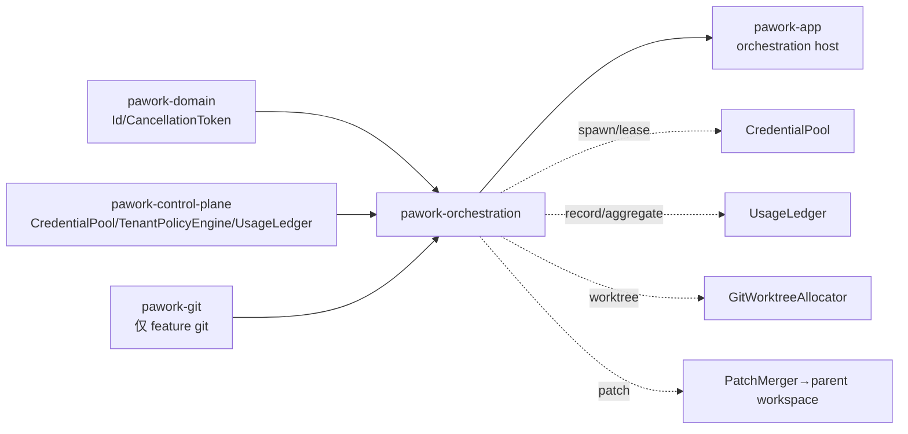

# pawork-orchestration Review

> 多 Agent 编排:在控制面(租约/用量/租户策略)之上运行 `AgentSupervisor`——spawn worker、预算闸门、取消整棵子树、任务依赖 DAG、可选 git worktree 隔离与 patch merge。13 个 .rs 文件、共 7 314 行(非测试逻辑约 3 100 行,`supervisor/mod.rs` 内嵌约 2 190 行测试);依赖 `pawork-domain` + `pawork-control-plane`(关 default features)+ optional `pawork-git`(feature `git`),禁止依赖 `pawork-workflow`。

## 1. 职责与边界

- **做什么**:worker 生命周期状态机与事件溯源(`lifecycle`);Supervisor 集中拥有 spawn / start / complete / fail / cancel_tree / 恢复诊断(`supervisor/`);worker 级 token/cost 预算度量与 ledger flush(`budget`);任务依赖 DAG(`task_graph`);worker 身份(`identity`);worktree 分配抽象与 RAII 守卫(`worktree`);patch 收集/冲突检测/Parent 审批合并(`merge`)。
- **不做什么**:不写 SQLite(预算超限走注入的控制面 `UsageLedger`);不自动合并冲突(Parent 审批门);不自动重试任务(`retry` 仅显式调用);不依赖 `pawork-workflow`;`OrchestrationEvent` 独立于 `pawork-domain::AgentEvent`(本包私有事件模型,内存 event_log),持久化与对外投影由宿主负责。
- **注入面**:`CredentialPool`(租约)、`TenantPolicyEngine`(策略闸门)、`UsageLedger`(用量账本)来自 `pawork-control-plane`;`WorktreeAllocator` / `PatchMerger` / `TaskGraph` / parent workspace 经 builder 方法可选注入。
- **取消令牌绑定边界**:每个 worker 的 `CancellationToken` 由 spawn 注册、可查询可触发,但令牌与实际执行体的绑定由宿主完成,本包只提供取消信号。

## 2. 依赖关系

**本包依赖的 pawork-* 包**

| 包 | 用途 |
| --- | --- |
| `pawork-domain` | `AgentId`/`TenantId`/`PrincipalId`/`SessionId`/`ModelId`/`ProviderId`/`CancellationToken` 等值类型 |
| `pawork-control-plane`(default-features=false,不拉 rusqlite) | `CredentialPool`/`LeaseGuard`/`LeaseOutcome`/`AcquireRequest`、`TenantPolicyEngine`/`Permission`/`PolicyGate`/`PolicyDecisionEvent`、`UsageLedger`/`UsageRecord`/`UsageQuery` |
| `pawork-git`(仅 feature `git`) | `GitRunner`/`WorktreeService`(GitWorktreeAllocator)、`DiffService`/`DiffOptions`(GitDiffProvider) |

**被哪些包依赖**:仅 `pawork-app`(orchestration host);workspace 当前无成员打开 `git` feature。

**关键外部 crate**:`async-trait`(trait 异步方法)、`serde`/`serde_json`(事件与配置序列化)、`thiserror`、`tokio`(sync/rt/macros;AsyncMutex 序列化 flush)、`tracing`(告警)、`blake3`(冲突检测哈希)。dev:`tempfile`、`tokio`(macros/rt-multi-thread/time)、`serde_json`。

**features**:`default = []`;`git = ["dep:pawork-git"]` 启用 `GitWorktreeAllocator` 与 `GitDiffProvider`。

## 3. 文件清单

| 路径 | 行数 | 职责 |
| --- | --- | --- |
| src/lib.rs | 21 | 7 个私有模块全部 glob re-export 到 crate 根(无 pub mod 子命名空间) |
| src/identity.rs | 156 | `WorkerRole` 与 `AgentInstance` 不可变身份记录 |
| src/lifecycle.rs | 632 | `WorkerState` 九态状态机、`OrchestrationEvent` 21 变体、`replay_workers` 容错重放 |
| src/budget.rs | 899 | `WorkerBudgetLimits`/`UsageAccumulator`/`WorkerBudgetController`(check/diff/flush 幂等游标)、`LedgerContext` |
| src/task_graph.rs | 540 | `TaskGraph` 线程安全 DAG(拒环/拒跨租户/前向引用)、`TaskId`/`TaskState`/`AgentTask` |
| src/worktree.rs | 362 | `WorktreeAllocator` trait、`WorktreeGuard`(显式 release)、`GitWorktreeAllocator`(feature git) |
| src/merge.rs | 620 | `DiffProvider` trait、`PatchMerger`(collect/detect_conflicts/merge)、`resolve_relative` 越界防护 |
| src/supervisor/mod.rs | 2728 | `AgentSupervisor` 结构与 `SupervisorConfig`/`SupervisorError`;complete/fail/retry_task/propose_patch/approve_patch;内嵌约 40 个测试 |
| src/supervisor/spawn.rs | 713 | `SpawnRequest`、spawn 全流程(准入→原子并发预约→策略闸门→worktree→lease→注册)、`ConcurrencyReservation` RAII、`validate_lease_scope` |
| src/supervisor/cancel_tree.rs | 171 | `cancel_tree` BFS 取消整棵子树、`CancelTreeReceipt` |
| src/supervisor/budget_gate.rs | 253 | `record_usage`(预算检查+去重)、`flush_usage`(显式重试)、`flush_terminal_usage`、`FlushTicket` 在途标记 |
| src/supervisor/recovery.rs | 48 | `recover_report`(report-only 崩溃诊断)、`RecoveryReport` |
| src/supervisor/registry.rs | 171 | `WorkerEntry`、`start_worker`、查询与 emit、`apply_terminal_and_take`(终态锁内取守卫) |

## 4. 类型与方法功能列表

### 4.1 identity.rs

| 名称 | 种类 | 功能/语义 |
| --- | --- | --- |
| `WorkerRole` | enum(serde snake_case) | `Parent`(根,无 parent) / `Worker`(父代理派生) |
| `AgentInstance` | struct | 不可变身份:`{agent_id, tenant_id, principal_id, parent_id, role, session_id, worktree_path, created_at_ms}`;`new_worker`(parent 必填、role=Worker)/`new_parent`(parent=None、role=Parent) |

Agent 与账号状态机隔离:身份只携带归属,不含凭证或运行时句柄。

### 4.2 lifecycle.rs

| 名称 | 种类 | 功能/语义 |
| --- | --- | --- |
| `WorkerState` | enum(9 变体,serde snake_case) | `Created → Admitted → Starting → Running ↔ Waiting`;活动态可 → `Cancelling → Cancelled` 或 → `Failed`;`Starting|Running|Waiting → Completed`;`is_terminal()`/`is_active()` |
| `WorkerTransition` | enum | `Admit`/`Start`/`BeginRunning`/`BeginWaiting`/`Resume`/`Complete`/`BeginCancel`/`Cancel`/`Fail` |
| `transition(from, t)` | fn(纯函数) | 状态转换表;终态拒绝一切(`FromTerminal`),非法组合 `IllegalTransition{from, transition}` |
| `LifecycleError` | enum | `IllegalTransition{from, transition}` / `FromTerminal` |
| `EventHint` | enum | 转换 → 事件映射:`Admit→WorkerAdmitted`、`Start→WorkerStarted`、`BeginRunning→WorkerRunning`、`BeginWaiting→WorkerWaiting`、`Complete→WorkerCompleted`、`Cancel→WorkerCancelled`、`Fail→WorkerFailed`;`BeginCancel`/`Resume` 无事件 |
| `WorkerStateMachine` | struct | `from_state`(恢复用)/`state()`/`apply(t) -> (新状态, EventHint)` |
| `OrchestrationEvent` | enum(21 变体,serde tag="type" content="data" snake_case) | Worker 九件套(Created/Admitted/Started/Running/Waiting/Completed/Cancelling/Cancelled/Failed,Failed 带 reason)+ Task 七件套(Created{task,agent,tenant}/Ready/Assigned{agent}/Completed/Failed{reason}/Retried{attempt 从 1 起}/Cancelled)+ `BudgetExceeded{agent, dimension, used, limit}` + `ConcurrencyDenied{kind, current, limit}` + Patch 三件套(Proposed/Merged/Conflict,各带 files) |
| `replay_workers(events)` | fn | 事件溯源重建 `BTreeMap<AgentId, WorkerState>`;**容错**:终态事件直接落终态不要求中间事件完整(崩溃截断的日志),非终态走严格状态机、非法静默跳过,终态后迟到事件忽略;任务/预算/patch 事件与 worker 状态无关被忽略 |

### 4.3 budget.rs

| 名称 | 种类 | 功能/语义 |
| --- | --- | --- |
| `WorkerBudgetLimits` | struct | `{max_input_tokens, max_output_tokens, max_cost_micros, max_concurrency}`,全 Option,None=不限;serde 全 default(可从 JSON 增量构造) |
| `UsageAccumulator` | struct | 无锁原子三维累加器(input/output/cost);`add_tokens`/`add_cost`/三个读方法;Clone 快照语义 |
| `BudgetReport` | struct | `soft_warnings: BTreeSet<String>` / `hard_exceeded: BTreeSet<String>` |
| `DIM_INPUT_TOKENS`/`DIM_OUTPUT_TOKENS`/`DIM_COST_MICROS`/`DEFAULT_SOFT_RATIO` | const | 维度名与事件 dimension 一致;软比例默认 0.8 |
| `WorkerBudgetController` | struct | `new(limits)`/`with_soft_ratio(0.0..=1.0)`/`record_tokens`/`record_cost`/`usage()`/`limits()`/`check()`/`diff_hard_exceeded(&report)`/`flush_to_ledger(ledger, ctx)`;**Clone = 同一逻辑控制器的共享句柄**(累加器/提交游标/去重记忆全共享,controller_id 不变) |
| `LedgerContext` | struct | flush 归属:{credential_id?, tenant, principal, account, session, agent, run?, provider, model} |

关键私有语义:

- `check()`:硬超限判定是 **`used >= limit)**(相等即超限,测试 `hard_limit_is_ge_boundary` 钉死);软告警 `used >= ratio×limit` 用 ppm 整数比较(`u128` 中间量,`used×1e6 >= limit×soft_ratio_ppm`),全程无 f64 精度误差。
- `diff_hard_exceeded(report)`:只读传入报告不重算;「已告警」记忆集合跨 Clone 共享——同一维度持续超限只返回一次,用量回落(不再硬超限)后从记忆移除、可再告警。
- `flush_to_ledger`:async mutex 序列化;每条 record = `目标快照 - last_committed` 增量,`record_id = usage-budget-{controller_id}-{target 三维 totals}`(幂等键,重试重放同 record 不重复计账);pending 在 await 前保存,ledger Ok(含幂等重放)才推进游标;失败/取消保留完全相同 pending;无增量空操作;cost-only 增量单独成条;循环处理「旧 pending + 新增长」聚合提交。cache_read/cache_write 恒写 0(注释 P14-7:cache 通路未贯通,明确不写误导值)。

### 4.4 task_graph.rs

| 名称 | 种类 | 功能/语义 |
| --- | --- | --- |
| `TaskId(String)` | struct | `new`/`as_str`;Ord/Hash/serde |
| `TaskState` | enum(8 变体,snake_case) | `Created`(retry 复位态)/`Ready`/`Assigned`/`Running`/`Blocked`/`Completed`/`Failed`/`Cancelled`;`is_terminal()` = Completed/Failed/Cancelled |
| `AgentTask` | struct | `{task_id, tenant_id, owner, description, depends_on, retry_count, max_retries, state}` |
| `TaskGraphError` | enum | `DuplicateTask`/`UnknownTask`/`CycleDetected`/`CrossTenantDependency{task_tenant, dep_tenant}`/`UnknownDependency`/`IllegalState{from}` |
| `TaskGraph` | struct(Clone 共享同一 `Arc<Mutex<BTreeMap>>`) | `add_task`(拒重复 id、已知依赖跨租户、成环;**允许前向引用**;初始态按依赖完成度 Ready/Blocked)/`mark_ready`(Created|Blocked→Ready)/`assign`(Ready→Assigned)/`start`(Assigned→Running)/`complete`(Running→Completed,**幂等**:已完成再 complete Ok)/`fail`(Running→Failed)/`cancel`(任意非终态→Cancelled)/`ready_tasks()`(Blocked 且依赖全 Completed)/`retry`(仅 Failed 且 retry_count<max_retries;Failed→Created 并递增计数,返回尝试序号)/`tenant_of`/`state_of`/`detect_cycle(deps)`(公开 DFS 环检测辅助) |

`UnknownDependency` 变体当前在 `add_task` 中不触发(前向引用被允许),保留给未来调用方。

### 4.5 worktree.rs

| 名称 | 种类 | 功能/语义 |
| --- | --- | --- |
| `WorkerWorktree` | struct | `{path, branch, managed}`;释放后 managed=false |
| `WorktreeError` | enum | `Allocate(String)`/`Release(String)`/`Io` |
| `WorktreeAllocator` | trait(async) | `allocate(parent_path, branch, start_point)` / `release(path)`;释放绝不递归删除用户数据 |
| `GitWorktreeAllocator` | struct(仅 feature git) | 委托 `WorktreeService`:allocate=`worktree add`(target=parent/branch);release=`worktree remove`(先校验受管,非受管路径报错不触碰数据);`with_cancel` 注入取消令牌 |
| `WorktreeGuard` | struct(RAII) | `new`/`path()`/`worktree()`/`release(mut self)`(消费;managed 时调 allocator.release,**无论成败置 managed=false**,幂等)/`into_inner()`(转移所有权不释放);**Drop 只告警不释放**(无 runtime 上下文防 panic),长驻进程须显式 release |

### 4.6 merge.rs

| 名称 | 种类 | 功能/语义 |
| --- | --- | --- |
| `WorkerPatch` | struct | 输入:`{agent_id, session_id, worktree_path, changed_files}` |
| `MergeDecision` | enum | `Merge`(冲突未解决则拒绝而非自动合)/ `Reject{reason}`(不写文件)/ `NeedsConflictResolution{files}` |
| `MergeError` | enum | `Io{context, source}` / `Diff(String)` / `ConflictUnresolved{files}` |
| `DiffProvider` | trait(async) | `changed_files(worktree_path)` / `file_content(worktree, rel)` / `base_content(parent, rel)`(默认退化为父侧当前内容) |
| `GitDiffProvider` | struct(仅 feature git) | changed 走 `DiffService`(commit_range=HEAD);file 走 `std::fs` + `resolve_relative`;base 走 `git show HEAD:<rel>`,失败退化为父侧当前内容 |
| `PatchProposal` | struct | `{agent_id, files, contents: BTreeMap<String, Vec<u8>>}`(每文件最终内容) |
| `ConflictReport` | struct | `{conflicting_files, clean_files}`;`has_conflicts()` |
| `MergeOutcome` | struct | `{merged_files, skipped_files, conflicts}` |
| `PatchMerger` | struct | `new(Arc<dyn DiffProvider>)`;`collect`(变更清单+逐文件最终内容)/`detect_conflicts`/`merge` |
| `resolve_relative(root, rel)` | fn(cfg(any(test, feature="git"))) | 拒绝空路径、绝对分量(Prefix/RootDir)与 `..` 穿越 |
| `atomic_write` | fn(私有) | 同目录 `.merge-tmp-{pid}-{counter}` + rename,失败清理临时文件 |

冲突检测规则:文件父侧不存在 → 干净(无父侧版本可被覆盖);父侧当前内容 blake3 == 基准 → 干净;不一致(父侧已 fork 后变动)→ 冲突。merge:Reject/NeedsConflictResolution 零写入;Merge 先重新检测冲突,有冲突返回 `ConflictUnresolved`,干净文件逐个 `atomic_write` 合入 parent。

### 4.7 supervisor/ — AgentSupervisor

| 名称 | 种类 | 功能/语义 |
| --- | --- | --- |
| `SupervisorConfig` | struct | `max_agent_concurrency`(默认 16,本地全局闸门)/`default_pool_concurrency`(默认 4,建池建议值,本包不建池)/`budget`(spawn 未携带预算时的默认 `WorkerBudgetLimits`)/`max_worker_depth`(None=不限) |
| `SupervisorError` | enum(11 变体) | `UnknownAgent(AgentId)`/`IllegalLifecycle(LifecycleError)`/`PolicyDenied(String)`/`PoolAcquire(String)`/`LeaseError(String)`/`Merge(String)`/`WorkerTerminal(AgentId)`/`UsageFlushPending(AgentId)`/`FlushNotTerminal(AgentId)`/`FlushContextMissing(AgentId)`/`CancelTreeFlushPending{receipt, pending}`(取消已完成但 flush 待重试,不吞 pending) |
| `AgentSupervisor` | struct | 内部状态:workers / cancel_tokens / children / reservations(在途并发预约)/ pool / policy / ledger / event_log / next_agent_id / budget(controllers)/ parent_workspace? / worktree_allocator? / task_graph? / patch_merger? / pending_patches / flush_ctx(终态失败归属缓存)/ flush_in_flight |
| `SpawnRequest` | struct | `{tenant_id, principal_id, parent_id?, session_id, worktree_path?, budget?, model?, acquire?, task_deps, task_description?, task_max_retries?}` |
| `CancelTreeReceipt` | struct | `{cancelled_ids, leases_released}` |
| `RecoveryReport` | struct | `{orphaned: Vec<AgentId>, recovered_states: BTreeMap<AgentId, WorkerState>}`(全终态口径) |
| `WorkerEntry` | struct | `{instance, state: WorkerStateMachine, lease: Option<LeaseGuard>, worktree: Option<WorktreeGuard>, model: Option<ModelId>}` |

公共方法:

- `new(pool, policy, ledger, config)` + builder `with_parent_workspace`/`with_worktree_allocator`/`with_task_graph`/`with_patch_merger`。
- `spawn(SpawnRequest) -> AgentId`(见 §5 流程)。
- `start_worker(&AgentId)`(registry.rs):Starting→Running,发 `WorkerRunning`。
- `complete(&AgentId)`:锁内终态转换取守卫(`apply_terminal_and_take`)→ 显式释放 worktree(best-effort)→ TaskGraph complete+`TaskCompleted` → 归属取真实值(account/provider 取 lease,model 取 spawn 请求;无 lease 回退 `local/default`/`local`,无 model 回退 `unknown`)→ lease 标记 `Completed` 后 Drop(同步幂等释放)→ `flush_terminal_usage` → `WorkerCompleted` → 移出父 children;flush 失败返回 `UsageFlushPending` 但终态已成立。
- `fail(&AgentId, reason)`:同 complete,但 lease 标记 `Failed`(计入连续失败)、TaskGraph fail+`TaskFailed{reason}`、事件 `WorkerFailed{reason}`。
- `cancel_tree(&AgentId) -> CancelTreeReceipt`(cancel_tree.rs):先确认 agent 存在;沿 children BFS 收集全部节点;每节点:取消令牌 → 锁内 `BeginCancel`+`Cancel`(终态跳过;已 Cancelling 的会再次走 BeginCancel→apply 失败被忽略,仍继续 Cancel)→ 发 `WorkerCancelling`+`WorkerCancelled` → 释放 worktree → TaskGraph cancel+`TaskCancelled` → lease 标记 `Cancelled`(幂等释放,**不惩罚账号健康**,只累加取消计数)→ flush。幂等:重复调用对终态节点全部跳过。任一 flush 失败 → `Err(CancelTreeFlushPending{receipt, pending})`(取消本身完成)。
- `record_usage(&AgentId, input, output, cost_micros)`(budget_gate.rs):终态拒绝(`WorkerTerminal`);累加进表内 controller(注意直接 `get_mut`,不经 Clone);`check` + `diff_hard_exceeded` 对新进入硬超限维度逐个发 `BudgetExceeded{dimension, used, limit}`。
- `flush_usage(&AgentId)`:显式重试终态 flush;活动 worker `FlushNotTerminal`;在途 `UsageFlushPending`;controller 在而 ctx 缺失 → `FlushContextMissing`(controller 放回保留);认领(移除 controller+ctx+登记 FlushTicket)在单一临界区原子完成;成功丢弃、失败原样放回(放回先于票据清除)可重试;无 controller 空操作。
- `retry_task(&AgentId) -> u32`:未配置 TaskGraph → `PolicyDenied`;仅复位任务图(Failed→Created、attempt+1)并发 `TaskRetried`;worker 生命周期仍是 Failed 终态,重跑需新 spawn。
- `propose_patch(&AgentId, WorkerPatch) -> ConflictReport`:要求 patch_merger 与 parent workspace(缺一 `PolicyDenied`);`collect` → `detect_conflicts` → 存 pending_patches → 发 `PatchProposed`(冲突另发 `PatchConflict`)。
- `approve_patch(&AgentId, MergeDecision) -> MergeOutcome`:取出提案(无提案 `UnknownAgent`)→ `merge` → 非空 merged/conflicts 分别发 `PatchMerged`/`PatchConflict`。
- 查询:`state(&AgentId) -> Option<WorkerState>`、`cancel_token(&AgentId)`、`events() -> Vec<OrchestrationEvent>`(快照,重放输入)。
- `recover_report(&[OrchestrationEvent]) -> RecoveryReport`(recovery.rs):report-only——`replay_workers` 后活动态孤儿在**报告中**推演为 Failed;不重建 WorkerEntry/children/cancel token,不 emit 事件,不可作为继续操作的恢复态。

### 4.8 supervisor/spawn.rs — spawn 全流程私有实现

| 名称 | 种类 | 功能/语义 |
| --- | --- | --- |
| `ConcurrencyReservation` | struct(RAII, pub(crate)) | Drop 从 reservations 移除 agent_id(幂等);成功兑现路径已移除,drop 再移除 no-op |
| `ConcurrencyReservationError` | enum(pub(crate)) | `Global{current, limit}`(本地闸门)/ `Tenant{current, max}`(策略闸门),区分便于审计 |
| `validate_parent(req)` | fn(私有) | parent 必须存在、同 tenant、同 session、活动且非 Cancelling;失败 `PolicyDenied` 且**不写任何注册表** |
| `reserve_concurrency(agent_id, tenant)` | fn(私有) | 单一临界区(先 reservations 后 workers 锁序)合并计数「活动 worker + 在途预约」,校验全局 `max_agent_concurrency` 与租户策略 `max_concurrent_agents`(同步 `policy()` 取,不跨 await);通过插入预约 |
| `worker_depth(parent_id)` | fn(私有) | 沿 parent 链计深度(根 0),BTreeSet 防环 |
| `record_policy_denial`/`record_policy_allow` | fn(私有) | versioned 策略决策事件(PolicyGate::AgentSpawn / LeaseAcquire)写审计 |
| `validate_lease_scope(lease, req, agent_id, acquire)` | fn(自由) | 不信任 pool 返回的 lease:tenant/principal/session/agent 必须与 canonical 请求一致,显式指定的 provider/account 必须一致;错配返回原因串 |
| `MS_PER_DAY` | const | 86_400_000,日预算窗口按 **UTC 日**对齐 |

spawn 步骤(顺序即代码序):0 parent 准入 → 1 生成 canonical `agent-N` id + 深度闸门(超限发 `ConcurrencyDenied{kind:"depth"}`+审计拒绝)→ 原子并发预约(全局拒绝发 `ConcurrencyDenied{kind:"agents"}`;租户拒绝只审计不发事件)→ 2 策略闸门链(deny-first):主体角色 `Permission::AgentSpawn` → 模型白名单 `check_model`(仅 req.model 有值)→ acquire 存在时校验 AcquireRequest 外层一致性(tenant/principal/session 错配拒绝)+ `Permission::LeaseAcquire` + provider/account 白名单 → 日 token/cost 预算(租户配置任一预算维度才查账本;`ledger.aggregate` 失败 **fail-closed** 拒绝)→ 记录 allow 决策 → 3 建 AgentInstance(worktree_path 先取请求值)→ 4 Admit(折叠进 spawn)→ 5 worktree 分配(仅配置了 allocator+parent_workspace 且请求未自带路径;分支名 = agent_id;失败 → Failed 标记+注册+`WorkerFailed`+归还预约,返回 `PoolAcquire`)→ 6 发 `WorkerCreated`(worktree 用分配后真实路径)+`WorkerAdmitted` → 7 lease 申请(canonical 覆写 agent_id 与外层三标识;成功后 **validate_lease_scope** 校验,错配 → `into_lease` 取走守卫 + 显式 `release(Released)`(不惩罚账号健康)+ 释放 worktree + Failed 注册 + `PolicyDenied`;acquire 失败 → 释放 worktree + Failed 注册 + `PoolAcquire`)→ 8 Start+`WorkerStarted` → 9 注册 children 与 cancel token → 10 TaskGraph 注册(发 `TaskCreated`;Ready 即 `TaskAssigned`+`start`;Blocked 等待依赖完成,由外部 ready_tasks+mark_ready 推进)→ 11 原子兑现预约(reservations 移除与 workers 插入同一临界区,先 reservations 后 workers 与预约一致)+ 注册预算 controller。

## 5. 关键行为与契约

- **禁止依赖 `pawork-workflow`**(依赖方向红线;plan/task 与编排的装配在 app)。
- **取消覆盖整棵 worker 树**:BFS 收集全部后代无孤儿;`LeaseOutcome::Cancelled` 释放只累加取消计数,不惩罚账号健康;幂等重复调用。
- **预算超限走控制面 ledger**:本包不写 SQLite;`BudgetExceeded` 同维度持续超限只发一次,回落可再告警;硬超限边界是 `>=`(相等即超)。
- **flush 不吞 pending**:终态 flush 失败必显式返回(`UsageFlushPending`/`CancelTreeFlushPending{receipt,pending}`),controller 与归属 ctx 成对保留;提交游标 + 幂等 record_id 保证重试不重复计账;FlushTicket 在途标记防并发假成功;cache 维度恒 0(未贯通,不写误导值)。
- **spawn 原子并发**:预约与兑现都在「先 reservations 后 workers」单一锁序临界区,无 check-then-act 窗口;RAII 保证任一失败路径归还槽位。
- **不信任外部输入**:AcquireRequest 由 supervisor 覆写 canonical 身份(agent_id 生成后才预约);pool 返回的 lease 作用域必须校验,错配 fail-closed 并以 Released 归还(不惩罚账号)。
- **事件流一致**:spawn 中途失败(worktree/lease/TaskGraph)也把 worker 标记 Failed 并注册(`WorkerFailed` 落日志),恢复重放不留悬挂 worker。
- **deny-first 策略链**:任何一层拒绝不可被上层覆盖;日预算查询失败即拒绝(账本不可用绝不静默放行)。
- **recover_report 是 report-only**:不重建可操作状态、不 emit 事件;崩溃后要继续操作需重新 spawn。
- **worktree 释放安全**:只经 allocator(git 侧校验受管 worktree),绝不递归删除用户数据;Guard Drop 不隐式释放(避免无 runtime panic),须显式 `release`;complete/fail/cancel_tree 及 spawn 失败路径均已覆盖显式释放。
- **merge 路径安全**:相对路径拒绝绝对分量与 `..` 穿越(仅 git/test 编译);写入原子(tmp+rename);冲突绝不自动合并。
- **锁纪律**:`std::sync::Mutex` 不跨 await(flush 靠先取值后释放);TaskGraph 锁不跨 await(模块无 IO)。
- **状态机冻结**:`WorkerState`/`TaskState` 转换表与 `OrchestrationEvent` serde 形状(tag/content snake_case)是重放兼容面。

## 6. 测试资产

无 tests/ 目录,全部内联 `#[cfg(test)]`:

| 位置 | 覆盖点 |
| --- | --- |
| supervisor/mod.rs(45 个 tokio 测试) | spawn 生命周期事件序;lease 持有到 complete/fail 的 outcome;cancel_tree 递归/幂等/lease Cancelled 不惩罚健康/深树;recover_report 只读;parent 准入矩阵(缺失/跨租户/跨 session/终态);租户并发/本地并发(ConcurrencyDenied);未知 agent;事件快照重放 round-trip;worktree 分配;TaskGraph 联动(Ready 直启/Blocked 等待/retry);complete 真实归属 flush;patch propose→approve;provider/account/model 白名单、角色 deny-first、每租户并发;并发 spawn 不超全局/池上限;日预算 fail-closed;AcquireRequest 错配拒绝;恶意 pool lease 校验释放;canonical agent_id;深度闸门(兄弟放行孙代拒);终态 flush 失败保留可重试;BudgetExceeded 去重/恢复再告警/>= 边界;cancel_tree flush pending 透传;flush_usage 活动拒绝/ctx 配对/并发无假成功无双计/与终态 flush 并发;fail+cancel flush 与 complete 一致 |
| lifecycle.rs | 合法转换全表;Complete 三源态;任意活动态 cancel/fail;终态拒绝一切;EventHint;重放重建与未知事件忽略;终态后迟到事件忽略;事件 serde snake_case tagged |
| budget.rs | 维度上限;flush 归属/cost-only/同快照幂等/累计增量(10→20 聚合到 20)/失败重试同 record/失败后增长聚合两次 delta/中途取消重放不双计/并发 flush 共享游标 |
| task_graph.rs | DAG 顺序;拒环;跨租户依赖拒绝;依赖完成转 Ready;retry 计数;幂等 complete;重复 id 拒绝 |
| worktree.rs | 分配隔离(worker 写不动 parent 文件);guard release;Drop 不派发任务;into_inner 转移;非受管释放记录但保留数据 |
| merge.rs | collect;冲突检测(父侧漂移才冲突);干净文件原子合入;冲突绝不自动合并;Reject/NeedsConflictResolution 零写入;相对路径穿越拒绝 |
| identity.rs | worker/parent 构造;serde snake_case |

## 7. 协作关系

