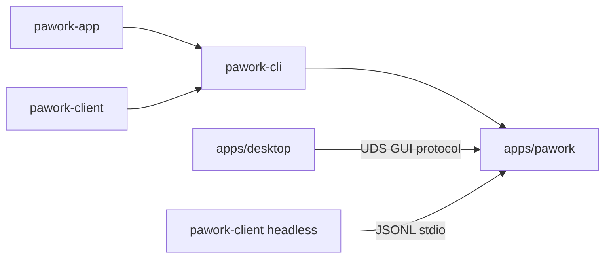

# pawork (bin) Review

> Core 的唯一正式宿主二进制：先装全局脱敏日志，再把进程交给 `pawork-cli::run`。2 个 `.rs` 文件、326 行（`main.rs` 31 + `redact.rs` 295）。无 pub API、无独立测试目录（2 个内联测试在 `redact.rs`）。

## 1. 职责与边界

做什么：composition root。装配顺序固定：

1. `#[tokio::main]` 多线程 runtime。
2. `install_logging()`：`EnvFilter`（`RUST_LOG`，默认 `warn`）+ `RedactingFmtLayer` → **stderr**。
3. `pawork_cli::run().await`，退出码原样返回。

不做什么：不实现命令、不加载 `AppCore`、不碰 Provider/DB。CLI 才是命令面；本包只保证「日志先于任何业务、Secret 不进 stdout/stderr 日志」。stdout 留给协议/JSON。

`RedactingFmtLayer` 从已删除的 `pawork-diagnostics` 迁入（ADR-039 / ADR-038 D8）。V1 缺口是 StructuredLogLayer 只进内存 buffer、fmt 输出无脱敏；本层把脱敏焊进全局 fmt。

## 2. 依赖关系

| 方向 | crate | 用途 |
| --- | --- | --- |
| 依赖 | pawork-cli | 唯一业务依赖：`run()` |
| 被依赖 | 无（workspace 二进制） | `pawork` 是 CLI 与 Core 的同进程宿主 |

| 外部 crate | 用途 |
| --- | --- | --- |
| tokio（macros, rt-multi-thread） | 进程 runtime |
| tracing / tracing-subscriber | 全局 subscriber + Layer |
| regex | `Redactor` 字段名/值模式 |

不直接依赖 domain/app/protocol。Desktop 是另一二进制，经 GUI 协议连本进程的 `gui serve`。

## 3. 文件清单

| 相对路径 | 行数 | 职责 |
| --- | ---: | --- |
| src/main.rs | 31 | `install_logging` + `pawork_cli::run` |
| src/redact.rs | 295 | `Redactor` / `RedactingFmtLayer` / `FieldVisitor` + 2 测试 |
| Cargo.toml | 15 | 包名 `pawork`，描述「Pawork CLI 唯一正式宿主」 |

## 4. 类型与方法功能列表

### 4.1 main.rs

| 名称 | 种类 | 功能 / 语义 |
| --- | --- | --- |
| `install_logging` | 私有 fn | `EnvFilter::try_from_default_env`，失败则 `warn`。Layer writer 是 `Arc<Mutex<dyn Write + Send>>` 包着 `io::stderr()`。`registry().with(filter).with(layer).init()` |
| `main` | async fn | 先日志后 `pawork_cli::run().await` → `ExitCode` |

改动注意：不得把 tracing 打到 stdout；不得在 `run()` 之后才装 Layer（早期错误会漏密）。

### 4.2 redact.rs — Redactor

| 名称 | 种类 | 功能 / 语义 |
| --- | --- | --- |
| `REDACTED` | const | `"[REDACTED]"` |
| `Redactor` | struct | `sensitive_key: Regex` + `replacements: Vec<Regex>` |
| `Redactor::default` | impl | `new([])`，内建模式 `expect`（编译期应合法） |
| `Redactor::new(custom_patterns)` | fn | `Result<Self, regex::Error>`：先编译字段名正则，再编译值替换表，最后追加自定义 |
| `redact_field(name, value)` | method | **字段名通道优先**：name 命中敏感键 → 整值 `[REDACTED]`；否则走 `redact(value)` |
| `redact(value)` | method | 值通道：按 replacements 依次 `replace_all` |

字段名正则（大小写不敏感、整键锚定）：

```text
^(authorization|proxy[_-]?authorization|cookie|set[_-]?cookie|api[_-]?key|(?:[a-z0-9]+[_-])*(?:token|secret|password)|oauth(?:[_-]?code)?)$
```

因此 `api_key` / `authorization` 整值抹掉，但 `context_tokens` **不**命中（测试钉死），指标仍可观测。

值通道内建模式：

1. `Authorization` / `proxy-authorization` 头整行。
2. `Cookie` / `set-cookie` 头整行。
3. `Bearer <token>` → 保留 `Bearer ` 前缀，只抹 token。
4. JWT `eyJ…` 三段。
5. `(?:sk|rk|pk|api)[-_]` 后 ≥12 字符（连字符或下划线都算前缀分隔）——**不要单词边界**（`_` 是 word char，`load_failed_sk-...` 会绕过 `\b`）。
6. URL query：保留 `?`/`&` 与 key，只抹 value。
7. `key=value` / `key:value`，含转义 JSON（`\"token\"`）与 `X-Custom-Token` 头。

### 4.3 RedactingFmtLayer

| 名称 | 种类 | 功能 / 语义 |
| --- | --- | --- |
| `RedactingFmtLayer` | struct | `redactor` + `writer`。`new(redactor, writer)` |
| `write_line` | 私有 | 写失败静默（与 tracing fmt 惯例一致）；poisoned lock `into_inner` |
| `Layer::on_event` | impl | `FieldVisitor` 收集全部字段 → `redact_field` → 单行 `<level> <target> k=v …`。无时间戳、无 span 树 |
| `FieldVisitor` | 私有 struct | `BTreeMap<String, String>`，实现 `Visit`：str/u64/i64/bool/debug |

输出形态示例：`info pawork::fmt_layer component=provider authorization=[REDACTED] retries=2`。

## 5. 关键行为与契约

- 日志 **永不** stdout。
- 字段名通道先于值通道：敏感字段名即使值看起来像普通数字也整段抹掉；非敏感名里嵌 token 仍靠值通道。
- `sk`/`rk`/`pk`/`api` 后接 `-` 或 `_` 的模式无 `\b`，防止嵌在 `source_key` / `error_code` 里漏出。
- Layer 写失败不中断业务。
- 内建 regex 非法直接 panic（`Default::expect`）——改正则必须同步改测试用例。
- 本二进制是 Core 唯一正式宿主：不引入 Node/V8；GUI 另进程连接。

## 6. 测试资产

| 文件 | 数量 | 验证点 |
| --- | ---: | --- |
| src/redact.rs `redacts_headers_tokens_cookies_oauth_jwt_and_custom_patterns` | 1 | Authorization/Cookie/oauth/JWT/`sk-` 嵌套、`load_failed_sk-`、URL query、转义 JSON、自定义 pattern、`api_key` 整字段抹掉、`context_tokens` 保留 |
| src/redact.rs `redacting_fmt_layer_masks_secrets_and_keeps_plain_fields` | 1 | 真 subscriber：authorization/api_key/message 内 token/`sk-` 不出现在捕获的 stderr 行；`component`/`retries` 仍可见 |

`main.rs` 无测试。默认验证：`cargo test -p pawork --offline --lib --tests`（本任务未跑；bin 测试随该包）。

## 7. 协作关系



本包是依赖图顶端的进程入口：先脱敏，再把控制权交给 cli；cli 再按子命令决定是否 `AppCore::load`。Desktop 与 headless SDK 都连这个二进制，而不是另起 Core。
