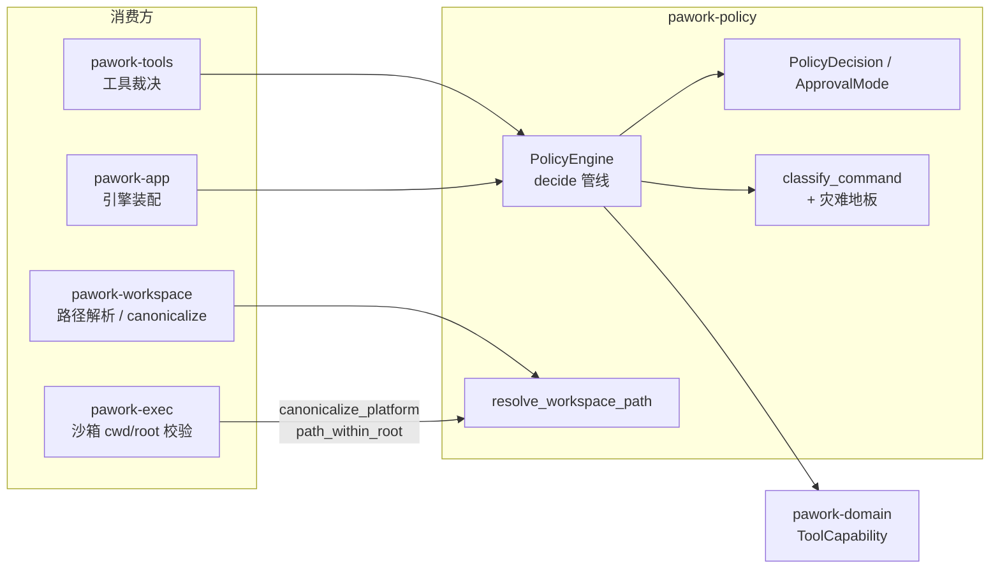

# pawork-policy Review

> 安全策略内核：审批决策（`PolicyDecision` / `ApprovalMode` / `PolicyEngine`）、工作区路径安全解析（`resolve_workspace_path`，防穿越 / symlink / `.git` / TOCTOU）与 shell 命令风险分类（手写 tokenizer + 灾难命令地板）。共 6 个 `.rs` 文件、2,588 行；最大模块 shell.rs（1,335 行）。

## 1. 职责与边界

- 纯决策与纯函数内核：给定能力 / 输入 / 信任态 / 审批模式，产出结构化裁决（Allow / Deny / AskUser / AllowWithConstraints），不执行任何 I/O 副作用（路径解析只做只读 FS 访问用于 canonicalize 与类型检查）。
- `resolve_workspace_path` 是所有文件工具解析模型传入路径的唯一安全入口：拒绝绝对路径、`..` 穿越、symlink 跳出 root、`.git` 内部、device/fifo/socket，并在解析后用 canonical 路径复核仍在 root 内（缓解 TOCTOU）。
- `classify_command` 把 argv 或 shell 片段解析为结构化命令并做风险升档；`hits_danger_floor`（crate 内）定义无论审批模式多宽松都不得静默执行的灾难命令集合。
- 边界：不负责执行、审批 UI 或持久化；`ToolCapability` 等领域类型来自 pawork-domain；不含任何 provider 特例逻辑。

## 2. 依赖关系

| 方向 | 包 / crate | 用途 |
|---|---|---|
| 依赖（pawork-*） | pawork-domain | 仅 `ToolCapability`（能力枚举） |
| 被依赖 | pawork-workspace | 工作区路径安全：文件工具走 `resolve_workspace_path`；资源 IO / agents 复用 `canonicalize_platform` / `path_within_root` / `relative_to_root` |
| 被依赖 | pawork-tools | 工具层裁决与路径安全 |
| 被依赖 | pawork-exec | `canonicalize_platform` / `path_within_root`（沙箱 cwd/root 校验，ADR-052） |
| 被依赖 | pawork-app | 宿主装配策略引擎 |
| 外部 | serde / serde_json | 决策与模式的 wire 形状（冻结） |
| 外部 | thiserror | `PathSafetyError` |
| 外部 | dunce | Windows 友好的 canonicalize（去 `\\?\` verbatim 前缀） |
| 外部 | regex | **Cargo.toml 声明但源码未使用**（tokenizer 为手写实现；Spec 已注明，可择期移除） |
| dev | tempfile | 路径安全测试 |

## 3. 文件清单

| 相对路径 | 行数 | 职责 |
|---|---|---|
| src/lib.rs | 25 | 入口；re-export 公共 API |
| src/decision.rs | 106 | 裁决结果类型与 serde 形状 |
| src/mode.rs | 63 | `ApprovalMode` 审批档位 |
| src/engine.rs | 548 | `PolicyEngine` 裁决管线与输入提取 |
| src/path.rs | 511 | 工作区路径安全解析内核 |
| src/shell.rs | 1,335 | shell tokenizer、风险分类词表、灾难地板 |

（无独立 tests/ 目录，测试内联。）

## 4. 类型与方法功能列表

### 4.1 decision

| 名称 | 种类 | 功能 / 语义 |
|---|---|---|
| `CommandRisk` | enum | 变体：`Safe`（默认）、`Dangerous`。来自 `classify_command` 的静态分类 |
| `RiskLevel` | enum | 变体：`Safe`（默认）、`Moderate`、`Dangerous`。提交用户审批时的等级 |
| `ExecutionConstraints` | struct | `timeout_ms` / `max_output_bytes`（均 `Option<u64>`），随 `AllowWithConstraints` 下发 |
| `ApprovalPrompt` | struct | `message` + `risk` |
| `PolicyDecision` | enum | 变体：`Allow`；`Deny { reason }`；`AskUser { prompt: ApprovalPrompt }`；`AllowWithConstraints { constraints }`。serde `tag="kind"` + snake_case：`Allow` 恰好序列化为 `{"kind":"allow"}`（无 payload，测试钉死） |

### 4.2 mode

| 名称 | 种类 | 功能 / 语义 |
|---|---|---|
| `ApprovalMode` | enum | 变体（serde snake_case，全部可 roundtrip）：`AlwaysAsk`、`AskForWrites`、`AskForDangerous`、`NeverAsk`（反序列化 alias `"on_failure"`——历史值只进不出）、`ReadOnly`（**默认**）。严格程度大致 `NeverAsk < AskForDangerous < AskForWrites < AlwaysAsk < ReadOnly` |

### 4.3 engine

| 名称 | 种类 | 功能 / 语义 |
|---|---|---|
| `PolicyInput` | struct | `capability: ToolCapability`、`input: serde_json::Value`、`trusted: bool`、`allowed_in_untrusted_workspace: bool`、`approval_mode: ApprovalMode`（按调用覆盖引擎默认） |
| `PolicyEngine` | struct | `new(mode)` / `mode()`；核心 `decide(&PolicyInput) -> PolicyDecision` |
| `is_side_effecting`（私有） | fn | 除 `ReadOnly` / `UserInteraction` 外均视为副作用 |
| `allow_or_constrained`（私有） | fn | 放行；`Process` 能力附加默认约束 60s timeout + 1 MiB 输出（`DEFAULT_PROCESS_TIMEOUT_MS` / `DEFAULT_PROCESS_MAX_OUTPUT_BYTES`） |
| `effective_risk`（私有） | fn | ReadOnly/UserInteraction→Safe；Process→`classify_command`（Safe→Moderate、Dangerous→Dangerous）；其余副作用能力→Moderate |
| `ask` / `ask_message`（私有） | fn | 构造 AskUser 提示；消息按能力分类（Process 展开命令） |
| `extract_command` / `read_args`（私有） | fn | 从工具入参提取命令：**优先非空 `argv`**（argv[0] 为程序，与 run_command 实际执行形状一致），其次 `program`，再次 `command` / `cmd` + `args` |

`decide` 的固定顺序（改动时必须保持）：

1. 信任硬门：`!trusted && !allowed_in_untrusted_workspace` → Deny（descriptor 未声明可用，一律拒绝）。
2. 灾难地板：`Process` 且 `hits_danger_floor` → `NeverAsk`/`ReadOnly` 直接 Deny；三个 Ask 档转 `AskUser(Dangerous)`。即使 trusted + NeverAsk 也不得静默执行。
3. `ReadOnly` 能力通过信任检查后恒 Allow。
4. 档位分派：`ReadOnly`→Deny（非只读能力）；`NeverAsk`→`allow_or_constrained`；`AlwaysAsk`→全问；`AskForWrites`→副作用能力询问、其余放行；`AskForDangerous`→仅 `effective_risk == Dangerous` 询问，否则 `allow_or_constrained`。

### 4.4 path

| 名称 | 种类 | 功能 / 语义 |
|---|---|---|
| `ResolvedPath` | struct | `absolute`（canonical 绝对路径，已复核在 root 内）/ `root`（命中的 canonical root）/ `relative`（相对 root 的规范化字符串） |
| `PathSafetyError` | enum | 变体：`Empty`、`AbsolutePath`、`Traversal(String)`、`SymlinkEscape`、`GitInternals`、`NonRegular`、`NoRoot`、`Io(std::io::Error)` |
| `resolve_workspace_path` | fn | `(roots: &[PathBuf], relative: &str) -> Result<ResolvedPath, PathSafetyError>`；全部安全检查见 §5 |
| `canonicalize_platform` | fn | `dunce::canonicalize`：Windows 去 verbatim 前缀，Unix 与 std 等价。被 pawork-exec 复用 |
| `path_within_root` | fn | canonical 路径是否位于 canonical root 内 |
| `relative_to_root` | fn | Unix 用 `strip_prefix`（字节级）；Windows 逐组件 `eq_ignore_ascii_case`（盘符与组件大小写不敏感） |
| `resolve_against_root`（私有） | fn | 对单个 root 解析：词法拼接 → 父目录 canonicalize → 复核在任一 root 内 → 已存在目标再 canonicalize + `symlink_metadata` 类型检查 |
| `canonicalize_deepest_existing`（私有） | fn | 支持尚不存在的嵌套路径（新建 `a/b/c.txt`）：向上找最深已存在祖先 canonicalize，缺失组件由调用方拼回；缺失组件不可能是 symlink，故安全 |
| `normalize_components`（私有） | fn | 词法规范化：`.` 丢弃；`..` 弹栈，栈空或遇 `RootDir`/`Prefix` → `Traversal` |
| `is_git_component`（私有） | fn | `.git` 组件判定；Windows 大小写不敏感 |
| `is_forbidden_file_type` / `is_special_file_type`（私有） | fn | unix 拒 block/char device、fifo、socket；非 unix 对非 file/dir 保守拒绝 |

### 4.5 shell

公开面只有两个函数；其余为私有 tokenizer 管线与词表。

| 名称 | 种类 | 功能 / 语义 |
|---|---|---|
| `classify_command` | pub fn | `(program, args) -> CommandRisk`。三步：① POSIX shell 加载 rcfile/init-file → 直接 Dangerous；② `extract_shell_script` 提取 `sh -c` / `cmd /c` / `powershell -Command` 的脚本递归分类；③ 程序名 + 参数整体当脚本（覆盖程序名含空白/分隔符与 argv 形态） |
| `hits_danger_floor` | pub(crate) fn | 灾难地板判定（引擎专用）：同样先提脚本再对整体文本跑 `snippet_hits_danger_floor` |

**私有 tokenizer**（`MAX_SCRIPT_DEPTH = 12` 递归保险）：

- `Word { text, dynamic, substitutions }`：`text` 为引号剥离、转义解后的字面拼接（`$VAR` / `$(...)` 保留原文供字面匹配）；`dynamic` 标记含不可静态解析的变量 / 命令替换；`substitutions` 收集 `$(...)` 与反引号的内层脚本原文。
- `Tok`：`Word(Word)`、`Redirect(Option<Word>)`（`>` / `>>` / `2>` / `&>` / `>&N`，只保留目标词）、`Pipe`、`And`、`Or`、`Semi`、`Amp`、`Newline`。
- `Cmd { program, args, redirect_targets }`；`parse_commands` 把 token 流解释为「语句 → 管道 → 命令」。
- `Lexer` 认知：单 / 双引号（双引号内仅 `\\"` `\\\\` `\\$` `\\`` 转义 + 行续接）、反斜杠、`$VAR` / `${VAR}` / `$?` `$#` `$*` `$-` `$!` `$@`（置 dynamic）、`$(...)`（括号深度 + 引号感知的原文收集）与反引号、`&&` / `||` / `|` / `;` / 换行、`#` 注释、纯数字词后接 `>` 的 fd 重定向。未闭合引号容错不 panic（proptest 级健壮性由内联测试覆盖）。

**升档管线**（`script_dangerous` / `command_dangerous`，depth 递归）：

- 重定向目标命中危险集合（见下）→ Dangerous。
- 命令替换内层脚本递归分类（程序位 / 参数位 / 重定向目标都算）。
- **程序位 dynamic（`$X` / `$(...)` 拼程序名）→ 保守升档 Dangerous，但绝不进地板**（NeverAsk 误拒是事故）。
- `posix_shell_loads_rc_or_init_file` → Dangerous。
- `extract_shell_script` 提取内层脚本递归。
- `classify_single` 词表匹配。

`pipeline_remote_pipe`：同一管道内 `curl` / `wget` 之后接 sh 族（sh/bash/zsh/dash/ksh/ash）或 python/perl → 远程脚本执行，Dangerous。

**危险程序词表**（`is_dangerous_program`，basename + lowercase + 去 `.exe`）：`sudo`、`su`、`dd`、`shutdown`、`reboot`、`halt`、`poweroff`、`format`、`reg`、`mkfs` / `mkfs.*`、`remove-item`、`del`、`erase`、`osascript`、`diskpart`、`schtasks`、`launchctl`。另：python 族 + `-c`、perl + `-e`。

**形态规则**：`rm` → 递归（`-r`/`-R`/`--recursive`/组合簇含 r/R）**或**宽目标（`/` `~` `$HOME` `*` `.` `..` `/etc` `/usr` `/var` `/home` `/boot`）即 Dangerous（单个普通文件安全，`rmdir` 不算 rm）；`chmod`/`chown` 递归即 Dangerous；`git push --force`/`-f`（`--force-with-lease` 不算）；`git branch -D`/`-d`/`--delete`。危险重定向目标：`/`、`/etc` 精确 + `/dev/` `/etc/` `/usr/` `/proc/` `/sys/` `/boot/` `/var/` 前缀。

**`extract_shell_script` 细节**：POSIX shell 识别单 dash 组合簇含 `c`（`-lc`/`-cl`，簇后第一个非选项参数为脚本，`c` 后字母按 bash 语义忽略，宁可升档）；`--rcfile`/`-rcfile`/`--init-file`/`-init-file`（含 `=` 形式）视为危险并跳过其取值，不遮蔽后续 `-c`；cmd `/c`（大小写不敏感）、powershell `-Command`/`/Command`/`-c`/`/c` 精确匹配，不识别组合簇。

**灾难地板**（`script_floor` / `catastrophic_single`，集合不变：mkfs / dd of=/dev / rm -rf /）：`mkfs` 与 `mkfs.*` 恒命中；`dd` 的 `of=/dev` 或 `of=/dev/...`（引号剥离后匹配，`'dd' "of=/dev/sda"` 仍命中）；`rm` 同时满足递归 + force（`-f`/`--force`/簇含 f）+ 目标 `/`（引号剥离后精确匹配，历史反引号灾难 `'r'm -rf '/'` 类变体经引号归一化仍命中）。dynamic / 未知形态绝不进地板。

## 5. 关键行为与契约

- **serde 冻结形状**：`PolicyDecision` `tag="kind"` + snake_case（`allow` / `deny` / `ask_user` / `allow_with_constraints`）；`ApprovalMode` snake_case 五词 + `NeverAsk` 反序列化 alias `"on_failure"`（只进不出，序列化永远输出 `never_ask`）。这是 wire 契约，改动需 golden 先行并用户确认。
- **默认 fail-closed**：`ApprovalMode` 默认 `ReadOnly`；未信任工作区中 descriptor 未声明可用的工具一律 Deny。
- **灾难地板优先于一切放行**：顺序固定为信任门 → 地板 → ReadOnly 放行 → 档位分派。地板集合是白名单式小集合，宁缺勿滥（误拒 NeverAsk 是事故）；新增地板条目必须可证明「不可恢复」。
- **路径内核不变量**：绝对路径拒绝；任何 `.git` 组件（Windows 大小写不敏感）在一切 FS 访问之前拒绝；词法 `..` 越栈 / RootDir / Prefix → Traversal；roots 全部 canonicalize 失败 → NoRoot；父目录 canonical 后必须在某 canon root 内（防中间 symlink 跳出，`SymlinkEscape`）；已存在目标二次 canonicalize + `symlink_metadata` 类型检查（TOCTOU 缓解；unix device/fifo/socket → `NonRegular`，非 unix 非 file/dir 保守拒）；多 root 逐个尝试取首个成功，全败返回最后一个错误。
- **平台差异**：`relative_to_root` Windows 组件大小写不敏感、Unix 字节级；`is_git_component` Windows 大小写不敏感；`canonicalize_platform` 用 dunce 消除 Windows verbatim 前缀差异；非 unix 平台特殊文件类型保守拒绝。
- **分类语义**：只升不降的静态分析——dynamic 程序位升档但不进地板；命令替换 / `shell -c` 递归（深度上限 12）；管道按段独立分类 + remote-pipe 组合规则；basename + `.exe` 剥离 + 大小写折叠匹配。
- **无 feature 门**：全平台统一编译，无 cfg 分支除上述平台差异点。

## 6. 测试资产

| 文件（内联 tests） | 验证点 |
|---|---|
| decision.rs | kind tag roundtrip；`Allow` 无 payload；risk 默认 Safe |
| mode.rs | 默认 ReadOnly；五变体 snake_case 序列化；`on_failure` alias 反序列化 |
| engine.rs | 信任门；灾难地板在各档位行为（NeverAsk 拒、Ask 档转问）；ReadOnly 恒放行只读；各档位分派；Process 默认约束；argv 提取优先 |
| path.rs | 绝对路径 / `..` 穿越 / `.git`（大小写）/ symlink 跳出 / fifo（unix 非普通文件）/ 不存在嵌套路径 / 多 root / Windows 语义（部分用 tempfile 真实 FS）；device/socket 与 fifo 同走类型检查，无独立测试 |
| shell.rs | rm 递归与宽目标、单文件安全、rmdir 不算 rm；sudo/dd/mkfs/shutdown 族；地板只命中灾难形态；git push --force（force-with-lease 不算）；shell -c 分隔与嵌套捕获；`-lc` 组合簇解包；rcfile 不遮蔽 -c；引号程序名拼接归一化；命令替换递归；dynamic 程序升档不进地板；remote pipe；管道独立分类；重定向目标提取；转义解包；未知变量形态不进地板；tokenizer 引号 / 注释 / 健壮性；posix 名称折叠匹配 |

## 7. 协作关系

