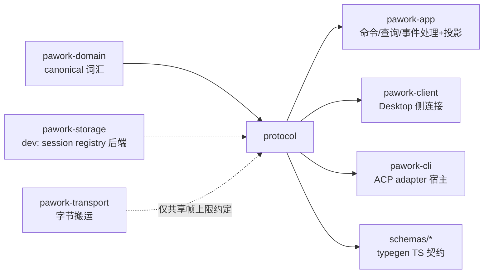

# pawork-protocol Review

> GUI Connection Protocol 的 wire 层：帧/编解码、版本协商与握手、resume 三态、snapshot、client token 认证、App 命令/查询/事件三通道（含 34 命令 + 15 查询 + 23 事件与静态 registry）、外部 client adapter 会话注册表、headless SDK JSON 协议、时间线投影与 TS typegen。37 个 .rs 文件（src 26 + tests 11），共 14 032 行（src 9 318 / tests 4 714），主要模块：codec/handshake/resume/snapshot/client_auth、app/（9 文件）、adapter/、headless/、projection/、typegen。

## 1. 职责与边界

pawork-protocol 定义 GUI（Desktop）与本机 CLI Host 之间的全部线上契约，以及 ACP/外部 client 接入的 adapter 与 headless（SDK CLI JSON over stdio）两个旁路通道。它只做词汇、编解码、协商、投影与测试基础设施，不含业务决策：命令分发、policy、存储都在 app/engine 侧；Transport 字节搬运在 pawork-transport（本包不依赖它，二者仅共享 1 MiB 帧上限数值约定）。事件广播信封 AppEventEnvelope 与 domain 持久化信封 AgentEventEnvelope 是两套冻结 wire：前者面向 GUI 广播，后者面向持久化/重放，projection 模块负责两臂收敛。

与 Spec（docs/spec/crates/protocol.md）的差异（以源码为准）：① Spec §1/§7 写 31 个 AppCommand，源码 enum 与 registry 均为 **34**；② Spec §8 写 AppEvent 22 变体，源码为 **23**（含 SessionMetaChanged）；③ Spec 写 `CONTROL_PLANE_SCHEMA_VERSION = 1`、默认 tenant/principal 为 `local-*` 泛称，源码为 **2**、`DEFAULT_CONTROL_PLANE_TENANT="local/default"`、`DEFAULT_CONTROL_PLANE_PRINCIPAL="local/user"`；④ Spec §3.1 的 RunStart 漏了源码新增 `profile: Option<String>`（P17-5，registry 注释确认）；⑤ Spec §7 写 70 个 golden fixture，实际 `tests/golden/` 为 **76** 个文件（与 Spec §5 的 76 一致）。

## 2. 依赖关系

| 方向 | 包 | 用途 |
|---|---|---|
| 本包依赖（生产） | pawork-domain | ID/Timestamp/AgentEventEnvelope（投影历史臂）、client_session 词汇（adapter registry）、DegradeEvent 映射 Diagnostic |
| 被依赖（生产） | pawork-app（命令/查询/事件处理与投影）、pawork-client（Desktop 侧连接）、pawork-cli（features=["adapter"]，ACP 接入） |
| 被依赖（dev） | pawork-storage（features=["adapter"]，session registry 持久化后端测试） |

| 外部 crate | 用途 |
|---|---|
| serde / serde_json | 全部 wire 类型与 JSON-LD 帧编解码 |
| thiserror | 错误类型 Error 派生 |
| tokio（io-util/sync/macros/rt/time） | async 读写与并发原语（headless run_loop、adapter registry 锁） |
| async-trait（optional，feature `adapter`+`headless`） | trait 的 async 方法 |
| getrandom（optional，feature `client-auth`） | token 生成 |
| ts-rs（optional，feature `typegen`，连带 domain/typegen） | TS schema 导出 |
| tempfile（dev） | token/握手测试临时目录 |

feature：`default=["adapter","client-auth","headless"]`；`local` 不存在（传输在 transport 包）。bin target `pawork-protocol-typegen` 带 `required-features=["typegen"]`，默认死表不编译。

## 3. 文件清单

| 相对路径 | 行数 | 职责 |
|---|---:|---|
| src/lib.rs | 329 | 帧上限常量、ClientFrame/ServerFrame、握手/订阅/resume/snapshot/artifact/错误词汇与 re-export |
| src/codec.rs | 220 | u32 LE 长度前缀分帧、类型化帧编码、同步 read/write 与 `write_frame_async` / `read_frame_async` |
| src/error.rs | 67 | ProtocolError 便捷构造（incompatible_version 等） |
| src/handshake.rs | 272 | 版本协商、HandshakeService/Session、认证钩子、信封版本校验 |
| src/resume.rs | 55 | ResumeContext 与 compute_resume_disposition 三态计算 |
| src/snapshot.rs | 35 | Snapshot/SnapshotSection::validate（data/artifact 互斥、上限） |
| src/client_auth.rs | 397 | pawork-token 方案、TokenStore 文件凭证、TokenAuthenticator |
| src/app/mod.rs | 18 | app 模块声明与 re-export |
| src/app/version.rs | 321 | 14 个版本常量（V1_0..=V1_13）、ApiVersion 兼容/bump、control plane scope 常量 |
| src/app/command.rs | 928 | AppCommandEnvelope/AppCommand 34 变体、ActorIdentity、ClientContextSnapshot 校验、WorkspaceRelativePath |
| src/app/query.rs | 167 | AppQueryEnvelope/AppQuery 15 变体、TimelinePage/Item、AppResponse |
| src/app/event.rs | 661 | AppEventEnvelope 双序号校验、AppEvent 23 变体、Team 词汇镜像 |
| src/app/quota.rs | 537 | 配额视图词汇、默认租户常量、mask_credential_hint |
| src/app/settings.rs | 644 | 设置类命令/查询的 Data 形状（General/Terminal/Permissions/Auth/模型启用） |
| src/app/limits.rs | 148 | PrincipalRole/PolicyGate/PolicyDecisionKind 与租户策略视图 |
| src/app/registry.rs | 754 | 三通道静态登记表（COMMANDS 34 + QUERIES 15）、wire 名映射、GUI 能力派生 |
| src/adapter/mod.rs | 980 | AdapterWireFrame、ClientAdapter trait、MockClientAdapter、SessionRegistry（epoch/revision/CAS） |
| src/adapter/identity.rs | 249 | ExternalAgentIdentity、TrustedTenantContext、bind_tenant |
| src/headless/mod.rs | 48 | headless 模块声明 |
| src/headless/wire.rs | 317 | HeadlessRequest/Response、SdkCapability、HeadlessError、Compat 词汇 |
| src/headless/translate.rs | 165 | 请求行解析/翻译、响应/事件编码、error_frame 构造 |
| src/headless/stdio.rs | 319 | Handler trait、run_loop select、StdioWriter 批/流模式与背压（仅 `feature = "headless"`） |
| src/headless/json_mapping.rs | 343 | AgentEvent JSON type → AppEvent tag 的 32 行静态映射表（11 行有镜像） |
| src/projection/mod.rs | 1005 | project_event 历史臂映射 + TimelineProjection reducer（两臂收敛） |
| src/typegen.rs | 324 | TS schema 生成/校验（core-api/gui-protocol/headless-json 三组） |
| src/bin/typegen.rs | 15 | typegen CLI 入口（--check） |
| tests/codec_framing.rs | 153 | 分帧编码与上限拒绝 |
| tests/frames.rs | 311 | 全帧型 round trip 与 chunk/snapshot 校验 |
| tests/golden.rs | 1098 | wire serde golden（76 fixture 全量对拍） |
| tests/handshake.rs | 421 | 版本协商、握手服务端逻辑、认证钩子、信封版本校验 |
| tests/headless_protocol.rs | 620 | headless 翻译往返、错误帧、run_loop 与 StdioWriter 背压 |
| tests/projection_golden.rs | 430 | 投影两臂对拍 golden（分页交错/Lagged/fork/沙箱详情） |
| tests/projection_semantics.rs | 691 | 投影 reducer 语义单测（去重合并、resume 三态、fork 边界） |
| tests/registry.rs | 798 | registry 双射、完整性、fail-closed、逐条目断言 |
| tests/resume.rs | 87 | resume 三态计算边界 |
| tests/snapshot.rs | 96 | snapshot section 校验 |
| tests/typegen.rs | 9 | schemas/ 与生成输出一致 |
| tests/golden/（76 个 .json）、tests/fixtures/headless/（4 个）、tests/fixtures/projection/（3 对 .jsonl+.expected.json） | — | golden fixture（见 §6） |

## 4. 类型与方法功能列表

### lib.rs — 传输帧词汇

常量：`MAX_PROTOCOL_FRAME_BYTES = 1 MiB`、`MAX_ARTIFACT_CHUNK_BYTES = 64 KiB`、`MAX_SNAPSHOT_SECTION_DATA_BYTES = 256 KiB`（三者是 DoS 边界，codec 在编解码两侧都强制）。

| 名称 | 种类 | 变体/字段/功能 |
|---|---|---|
| `ClientFrame` | enum（11） | Handshake / Command / Query / Subscribe / Unsubscribe / Resume / SnapshotRequest / Ack / ArtifactRead / Heartbeat / Pong |
| `ServerFrame` | enum（10） | Handshake / CommandAccepted / Response / Event / Snapshot / Resume / ArtifactChunk / Error / Heartbeat / Pong |
| `HandshakeRequest` | struct | request_id、client_name/version、supported_api_versions、capabilities、authentication |
| `HandshakeResponse` | enum（2） | Accepted { request_id, selected_api_version, handle, client_id, connection_id, resume, capabilities, host_data_dir: Option }（host_data_dir 自 1.9 可选，旧帧缺字段可解码）/ Rejected { request_id, error } |
| `GuiCapability` | enum（5） | Events / Snapshots / ArtifactStreaming（冻结保留、当前不再宣告）/ TerminalStreaming / Approvals |
| `ClientAuthentication` | struct | scheme + proof；Debug 脱敏不泄 proof |
| `SubscribeRequest` / `ResumeRequest` / `ResumeResponse` | struct | 订阅（subscription_id + streams）；按 last_global_sequence 恢复；返回 disposition |
| `ResumeDisposition` | enum（3） | Replay { from_sequence, through_sequence } / SnapshotRequired { earliest_available_sequence } / UpToDate { current_sequence } |
| `Snapshot` / `SnapshotSection` / `SnapshotSectionKind` | struct/enum | kind（6）：Workspaces / SessionTree / ActiveRuns / PendingToolApprovals / TerminalSessions / ProviderStatus；section 带 revision 与 data/artifact 二选一 |
| `ArtifactReadRequest` / `ArtifactChunk` | struct | 工件按 offset/limit 读取与分块回传；`ArtifactChunk::validate()` 强制 data≤64 KiB |
| `ProtocolErrorEnvelope` / `ProtocolError` / `ProtocolErrorCode` | struct/enum | code（10）：IncompatibleVersion、InvalidFrame、AuthenticationFailed、PermissionDenied、RequestNotFound、ReplayUnavailable、FrameTooLarge、Busy、ValidationFailed、Internal；envelope 带 request_id（无则为连接级错误） |

### codec.rs — 分帧与编解码

| 名称 | 种类 | 签名/功能 |
|---|---|---|
| `FRAME_LENGTH_PREFIX_BYTES` | const | 4（u32 LE），与 transport 层分帧约定一致 |
| `encode_client_frame` / `decode_client_frame` | fn | 类型化帧 ↔ JSON 字节（含上限与结构校验） |
| `encode_server_frame` / `decode_server_frame` | fn | 同上，服务端方向 |
| `encode_length_prefixed<T>` / `decode_length_prefixed<T>` | fn | 任意 Serialize/Deserialize 的 `[u32 LE len][payload]` 封装（headless 复用） |
| `write_frame` / `read_frame` | fn | 同步 IO 的裸分帧；**读侧在分配缓冲前拒绝超限声明**，写侧拒绝超限 payload |
| `write_client_frame` / `read_client_frame` / `write_server_frame` / `read_server_frame` | fn | 同步 IO 类型化组合（内部调 `write_frame` / `read_frame`） |
| `write_frame_async` / `read_frame_async` | async fn | 裸分帧的 AsyncWrite/AsyncRead 变体；没有 `write_client_frame_async` 一类封装 |
| `ProtocolCodecError` | enum（9） | InvalidJson、FrameTooLarge、ArtifactChunkTooLarge、SnapshotSectionDataTooLarge、AmbiguousSnapshotSection、EmptySnapshotSection、TruncatedFrame、FrameLengthMismatch { declared, actual }、Io |

### error.rs / handshake.rs / resume.rs / snapshot.rs — 握手与恢复

| 名称 | 种类 | 签名/功能 |
|---|---|---|
| `ProtocolError::incompatible_version / authentication_failed / invalid_frame / frame_too_large` | fn | 便捷构造（error.rs） |
| `negotiate_api_version(client, server) -> Option<ApiVersion>` | fn | 客户端支持集中挑服务端也支持的最高 minor；major 不等即 None |
| `negotiate_api_version_with(client, supported)` | fn | 双列表版本协商 |
| `ClientAuthenticator` | trait | `fn authenticate(&self, &ClientAuthentication) -> Result<(), ProtocolError>`——握手认证钩子 |
| `HandshakeSession` | struct | `new(client_id, connection_id)`；`with_resume_context`；`with_last_global_sequence`——服务端接受的上下文 |
| `HandshakeService` | struct | `new(instance_id, supported_versions, supported_capabilities)`；`with_authenticator`；`with_host_data_dir`；`supported_api_versions()`；`supported_capabilities()`；`accept(&HandshakeRequest, HandshakeSession) -> HandshakeResponse`（同步）——协商版本、过滤能力交集、认证、算 resume；无 `resume_context` 时一律 `SnapshotRequired { earliest: 0 }` |
| `ensure_compatible_api_version(envelope, negotiated)` | fn | 信封版本 vs 协商版本（major 必等、minor 不得超前） |
| `validate_client_frame_api_version` / `validate_server_frame_api_version` | fn | 帧级版本校验（覆盖 Command/Query/Event 信封） |
| `decode_client_frame_checked` / `decode_server_frame_checked` | fn | 解码 + 版本校验一步完成 |
| `ResumeContext` | struct | `new(earliest_available, current)`（history 窗口） |
| `compute_resume_disposition(earliest, current, last) -> ResumeDisposition` | fn | last==current→UpToDate；`last < current && last + 1 >= earliest`→Replay(last+1..current)（允许 `last == earliest-1`，即恰好窗口前一条）；其余（落后 retention、客户端超前、空 history 等）→SnapshotRequired |
| `Snapshot::validate` / `SnapshotSection::validate` | fn | section 必须恰好 data 或 artifact 之一；data 序列化后≤256 KiB |

### client_auth.rs — token 认证（feature `client-auth`）

| 名称 | 种类 | 签名/功能 |
|---|---|---|
| `TOKEN_SCHEME` | const | `"pawork-token"` |
| `Token(String)` | struct | 32 字节随机数的 hex64；`constant_time_eq(candidate)` 防时序侧信道；`as_str()`；Debug 脱敏 |
| `TokenStore` | struct | `new(path)`；`generate()`——**create_new 不覆盖既有文件**，unix 下文件 0600、父目录 0700；`load()`；`delete()`；`path()` |
| `TokenAuthenticator` | struct | `new(store)`；实现 ClientAuthenticator：scheme 必须是 pawork-token 且 constant_time_eq 通过 |
| `ClientAuthError` | enum（8） | AlreadyExists / NotFound / Malformed / CreateDir / Write / Read / Remove / Permissions |

### app/version.rs — 版本与 control plane scope

| 名称 | 种类 | 功能 |
|---|---|---|
| `V1_0`..`V1_13` | const | 14 个版本锚点（V1_0..=V1_13）；`API_VERSION = V1_13`（1.13） |
| `SUPPORTED_API_VERSIONS` | const | 服务端可接受的全部版本表（协商输入） |
| `ApiVersion` | struct | `major/minor: u16`；`new`（const）、`bump_minor`（const）、`is_compatible_with`（major 相等即兼容） |
| `ApiHandle` | struct | instance_id + api_version——CoreReady 事件与握手回执共用的实例句柄 |
| `ProtocolCrateCompatibility` / `PROTOCOL_CRATE_COMPATIBILITY` | struct/const | 每版本与 crate 发布的对应关系（文档性常量） |
| `CONTROL_PLANE_SCHEMA_VERSION = 2` | const | control plane 记录 schema 版本 |
| `DEFAULT_CONTROL_PLANE_TENANT="local/default"` / `..._ACCOUNT="local/default"` / `..._PRINCIPAL="local/user"` | const | 单机默认 scope（源码值；Spec 记为 1 与 local-* 泛称，以源码为准） |
| `ControlPlaneScope` | struct | `legacy_default()` 构造默认 scope；`is_legacy_default()` 判定是否默认 scope |

### app/command.rs — 命令通道

常量：`MAX_CLIENT_CONTEXT_BYTES=1 MiB`、`MAX_CLIENT_CONTEXT_DOCUMENTS=128`、`MAX_CLIENT_CONTEXT_DIAGNOSTICS=1024`、`MAX_CLIENT_CONTEXT_URI_BYTES=4 KiB`、`MAX_CLIENT_CONTEXT_MESSAGE_BYTES=4 KiB`。

| 名称 | 种类 | 字段/变体 |
|---|---|---|
| `ApiKeySecret(String)` | struct | 透明 newtype，`new` / `as_str`；Debug 脱敏 |
| `AppCommandEnvelope` | struct | api_version、command_id、source、identity、expected_revision: Option、idempotency_key: Option、issued_at、command |
| `CommandSource` | enum（6） | LocalCli / LocalGui / RemoteGui / Automation / Plugin / Mcp |
| `ActorIdentity` | enum（6） | LocalUser / AuthenticatedClient / Automation / Plugin / McpServer / System；`canonical_principal()` 归一主体串 |
| `ClientTextPosition` / `ClientTextRange` / `ClientDiagnosticSeverity`（4）/ `ClientDocumentContext` / `ClientDiagnostic` | struct/enum | IDE 上下文快照的组成词汇 |
| `ClientContextSnapshot` | struct | `validate()`——1 MiB 总量、128 文档、1024 诊断、URI≤4 KiB 且 scheme 白名单（拒绝 javascript/data/vbscript）、单条消息≤4 KiB |
| `AppCommand` | enum（34） | CoreInitialize、WorkspaceAdd、WorkspaceTrust、SessionCreate、SessionRename、SessionArchive、SessionOpen、SessionFork、SessionCompact、SessionClientContextReplace、RunStart（含 `profile: Option<String>`，P17-5）、RunCancel、RunRetry、RunTool、AuthStart、AuthRemove、AuthSetApiKey、AuthCancel、SetDefaultModel、SetProxyUrl、SetProviderUseProxy、SetModelEnabled、SetProviderModelsEnabled、SetDefaultRoleModel、SetApprovalMode、SetTerminalSettings、ToolApprove、GitStage、TerminalCreate、TerminalWrite、TerminalResize、TerminalClose、McpTest、McpServerRemove。SetProxyUrl/SetTerminalSettings/SetDefaultRoleModel 用 deserialize_required_nullable_string/_option：字段必填但值可空（显式清除帧） |
| `ApprovalDecision` | enum（4） | ApproveOnce / ApproveForRun / Deny / Cancel——**protocol 侧动词拼写**（wire：approve_once/approve_for_run/deny/cancel），与 domain 侧 approved_once 等是两套各自冻结的 wire |
| `WorkspaceRelativePath(String)` | struct | `new() -> Result`——构造、FromStr、serde 全路径校验：拒绝对路径、`..`、Windows 盘符、UNC、反斜杠、控制字符；`as_str()`；失败为 `RelativePathError` |

### app/query.rs — 查询通道与响应

| 名称 | 种类 | 字段/变体 |
|---|---|---|
| `AppQueryEnvelope` | struct | api_version、request_id、source、identity、issued_at、query（无 expected_revision / idempotency_key——查询非幂等写） |
| `AppQuery` | enum（15） | WorkspaceList、SessionGet、RunStatus、ModelList（`include_disabled` serde 缺省 false 且 false 时字段整个不上 wire）、DiffListFiles、DiffGet、ArtifactRead、QuotaOverview、SnapshotFetch、PluginList、McpList、ProviderAuthStatus、GeneralSettings、PermissionsSettings、TerminalSettings |
| `TimelinePage` | struct | items、next_sequence、head_sequence、complete——历史分页 |
| `TimelineItem` | struct | sequence、event_id、kind、run_id、text、tool_name、status、detail、timestamp |
| `TimelineItemKind` | enum（14） | UserMessage、AssistantDelta、AssistantMessage、ToolStarted、ToolOutput、ToolCompleted、ApprovalRequested、ApprovalResponded、RunStarted、RunCompleted、RunCancelled、RunFailed、Diagnostic、Other |
| `AppResponseEnvelope` | struct | api_version、request_id、responded_at、response |
| `AppResponse` | enum（4） | Accepted { command_id, run_id: Option } / Data(Value) / Artifact / Error |

### app/event.rs — 事件通道

| 名称 | 种类 | 字段/变体 |
|---|---|---|
| `AppEventEnvelope` | struct | api_version、instance_id、event_id、global_sequence、stream、stream_sequence、timestamp、source、payload；`validate_after(previous)`——同实例、global_sequence 严格 +1、同流 stream_sequence +1（`AppEventOrderError` 3 变体） |
| `GlobalSequence(u64)` | struct | 实例级全局序号；`is_immediately_after` |
| `EventStream` | enum（6） | Global / Workspace / Session / Run / Terminal / GuiClient |
| `EventSource` | enum（6） | Core / Command / Provider / Tool / Plugin / Mcp |
| `AppEvent` | enum（23） | CoreReady、WorkspaceChanged、SessionChanged、SessionMetaChanged（1.11）、RunChanged、AssistantDelta、ThinkingDelta、ToolStarted、ToolOutput、ToolApprovalRequired、ToolCompleted、DiffChanged、TerminalOutput、TerminalExited、AuthChanged、ProviderStatus、PluginError、Diagnostic、GuiClientConnected、GuiClientDisconnected、QuotaChanged、QuotaAlert、TeamEvent |
| `AuthChangeState` | enum（6） | Pending / Succeeded / Failed / Cancelled / Expired / Removed |
| `TerminalExitReason` | enum（3） | Exited / Killed / Failed |
| `RunState` | enum（12） | Created、PreparingContext、WaitingForProvider、StreamingResponse、CollectingToolCalls、WaitingForApproval、ExecutingTools、AppendingToolResults、Completed、Cancelled、Failed、Interrupted |
| `ProviderStatus` | enum（4） | Ready / Degraded / Unavailable / AuthenticationRequired |
| `DiagnosticLevel` | enum（3） | Info / Warning / Error；`from_degrade_severity_str`——未知字符串回 Info 不丢事件；`From<&DegradeEvent>` 把 domain 降级折成 Diagnostic |
| Team 镜像词汇 | 多个 | TeamEvent（18 变体：TeamCreated…PlanCommented，`team_id()`/`kind()`）、TeamMemberRole（2）、TeamTaskState（8）、TeamPlanStepStatus（4）、TeamPlanStepSnapshot、TeamPlanCommentAnchor、TeamPresence（4）、TeamRecipients（2）、TeamBoardTask——teams crate 已归档，此处是唯一定义，消费方为 cli 的 ACP 映射 |

### app/quota.rs — 配额视图

常量：`DEFAULT_QUOTA_TENANT="local"`、`DEFAULT_QUOTA_ACCOUNT="local/default"`、`DEFAULT_QUOTA_TENANT_CANONICAL="local/default"`（`"local"` 是 `"local/default"` 的历史简写，两种写法同 scope）。

| 名称 | 种类 | 变体/功能 |
|---|---|---|
| `QuotaWindow` | enum（4） | Overall / Rolling5h / Weekly / Monthly |
| `QuotaUnit` | enum（3） | Count / Token / Cost |
| `QuotaMeasure` | enum（3） | Exact / Infinite / Unknown |
| `QuotaValues` | struct | 各 unit 的量值 |
| `QuotaConfidence` | enum（3） | Exact / Derived / Scraped |
| `QuotaAdapterKind` | enum（4） | ApiKeyApi / OAuthApi / WebScrape / LocalLedger |
| `QuotaProvenanceView` / `QuotaReset` | struct/enum | 数据来源视图；Absolute / Relative / Unknown |
| `QuotaOverviewQuery` | struct | `default_local()`；`is_default_scope()`——接受 `local` 与 `local/default` 两种 tenant 写法 |
| `QuotaScopeView` / `QuotaSnapshotView` / `QuotaFailureView` / `WindowReadView`（Ok/Failed/NoData） / `WindowReadEntry` / `QuotaOverviewView` | struct | 查询与回执的视图层词汇 |
| `QuotaAlertKind` | enum（5） | Threshold / Recovered / Stale / ReauthorizationRequired / PartialFailure |
| `QuotaAlertSeverity` | enum（3） | Info / Warning / Critical |
| `QuotaAlert` | struct | 告警事件负载 |
| `mask_credential_hint(id) -> Option<String>` | fn | 凭证提示脱敏：保留首尾各 2 字符 |

### app/settings.rs — 设置形状

| 名称 | 种类 | 功能 |
|---|---|---|
| `ApprovalModeWire` | enum（5） | always_ask / ask_for_writes / ask_for_dangerous / never_ask / read_only；`as_str()`；未知串入 `UnknownApprovalModeError` |
| `GeneralSettingsData` / `TerminalSettingsData` / `PermissionsSettingsData` | struct | 三个设置查询的 Data 回执形状（proxy_url；shell/columns/rows；approval_mode/trust 三元组） |
| `DefaultModelPair` | struct | provider_id + model_id（角色默认模型值，None 显式清除） |
| `ProviderAuthState` | enum（4） | Connecting / Connected / None / Error |
| `ProviderCatalogState` | enum（3) | Remote / FixedFallback / Unavailable |
| `ProviderCredentialStatus` / `ProviderAuthStatusEntry` / `ProviderAuthStatusData` | struct | 认证状态查询的条目与回执（masked_credential、catalog、use_proxy） |
| `ProviderUseProxyData` / `SetModelEnabledData` / `SetProviderModelsEnabledData` / `SetDefaultRoleModelData` / `RoleDefaultsData` / `AuthStartData` | struct | 各 set 命令的参数/回执形状 |

### app/limits.rs — 策略视图

| 名称 | 种类 | 变体 |
|---|---|---|
| `PrincipalRole` | enum（4） | Admin / User / Service / Viewer |
| `PolicyGate` | enum（9） | RouteCandidate / LeaseAcquire / AgentSpawn / RequestAdmission / SessionQuery / UsageQuery / AuditQuery / AuditExport / Retention |
| `PolicyDecisionKind` | enum（4） | Allow / Deny / Limit / Fallback |
| `AuditExportPolicyView` / `PrincipalRoleBinding` / `PermissionProfileView` / `TenantPolicyView` / `PolicyDecisionEventView` | struct | 策略查询与决策事件的视图。TenantPolicyView 为 deny-first 白名单语义：`Some(vec![])` = 拒绝全部 |

### app/registry.rs — 三通道静态登记表

| 名称 | 种类 | 功能 |
|---|---|---|
| `GuiChannelAccess` | struct | { available, required_capability }——GUI 通道可用性与所需能力 |
| `RegistryEntry` | struct | { wire_name, gui: GuiChannelAccess, headless: Option<SdkCapability>, acp, idempotent, since }——单个命令/查询的完整通道元数据 |
| `GUI_INTRINSIC_CAPABILITIES` | const | [Events, Snapshots]——GUI 固有能力 |
| `COMMANDS` / `QUERIES` | crate-private static | 34 + 15 条静态登记表（与 enum 变体一一对应）；经 `command_entries()` / `query_entries()` 暴露 |
| `command_wire_name` / `query_wire_name` | fn | enum→wire 名的**无通配穷举 match**：新增变体不补表 = 编译失败（fail-fast） |
| `command_by_wire_name` / `query_by_wire_name` | fn | wire 名→entry；未登记返回 None（fail-closed） |
| `command_entry` / `query_entry` / `command_entries` / `query_entries` | fn | enum→entry（表缺条目即 panic）/ 全表 |
| `gui_supported_capabilities() -> Vec<GuiCapability>` | fn | 由登记表派生 GUI 宣告集 = {Events, Snapshots, TerminalStreaming, Approvals}（无条目 require ArtifactStreaming，故不宣告） |

### adapter/ — 外部 client 接入（feature `adapter`）

adapter/mod.rs：

| 名称 | 种类 | 签名/功能 |
|---|---|---|
| `AdapterWireFrame` | struct | `schema_version, request_id, method, payload, extensions`（flatten）；`validate()` 拒绝 schema 不符、空 request_id/method、以及 extensions 遮蔽保留字段 |
| `CanonicalClientRequest` | enum（5） | Command / Query / Attach / Reattach / Disconnect |
| `CanonicalCoreFrame` | enum（4） | Response / Event / SessionState / Error |
| `AdapterErrorFrame` | struct | `{ code, message, capability: Option<ClientCapability> }`——adapter 错误的 wire 形状 |
| `AdapterError` | enum（11） | ProtocolUnsupported、CapabilityUnsupported、InvalidFrame、UnsupportedSchema、UnknownSession、SessionNotAttached、CoreSessionNotFound、SessionConflict、RevisionExhausted、StaleOwner、HostUnavailable；`frame()` 折成 AdapterErrorFrame 的 wire code |
| `ClientAdapter` | trait | `protocol()` / `capabilities()` / `require(cap)`（默认实现按 snapshot 判定）；`async decode_payload(AdapterWireFrame) -> CanonicalClientRequest`；`async encode_payload(CanonicalCoreFrame) -> AdapterWireFrame`；默认 `decode`/`encode` 额外执行 frame.validate |
| `ClientAdapterFactory` | trait | `protocol()`；`create(negotiated: CapabilitySnapshot) -> Result<Arc<dyn ClientAdapter>, AdapterError>` |
| `AdapterSessionContext` | struct | { adapter, client_session_id, connection_id, ownership_epoch, revision }——Host 只信任 factory 协商产物与 authoritative registry 记录，客户端自报 protocol/capability 不采信 |
| `MockClientAdapter` | struct | contract 测试用最小实现：只翻译 canonical JSON（仅认 method="canonical.request"），未知扩展字段显式失败 |
| `MockClientAdapterFactory` | struct | `new(protocol, supported_capabilities)`；`create` 校验 snapshot 的 protocol 与 capability allowlist，失败返回 ProtocolUnsupported / CapabilityUnsupported |
| `InMemorySessionRegistryStore` | struct | domain SessionRegistryStore 的内存实现 |
| `SessionRegistry` | struct | `async fn new(store) -> Result<Self, AdapterError>`（`load_all` + 去重）；`register(record)`；`get(id)`；`claim(...)`——接管会话（epoch+1、revision+1，CAS 失败走 reconcile_conflict 回写权威记录并返 StaleOwner）；`transition(...)` 状态机推进；`remove(...)`。模块内再 re-export domain client_session 词汇 |

adapter/identity.rs：

| 名称 | 种类 | 功能 |
|---|---|---|
| `ExternalAgentIdentity` | struct | `validate()`——session 必填、parent 存在时须为 agent、agent≠parent；`is_subagent()` |
| `TrustedTenantContext` | struct | `try_new(tenant_id, principal_id)`——**仅宿主进程注入**，空白 tenant/principal fail-closed |
| `TenantBinding` / `bind_tenant(...)` | struct/fn | 租户绑定只能由可信上下文构造——租户身份永不来自客户端自报字段 |
| `IdentityError` | enum（3） | MissingSession / InvalidAgentTree / MissingTenantContext |

### headless/ — SDK CLI JSON over stdio

`wire` / `translate` / `json_mapping` 始终编译；`stdio.rs` 仅 `feature = "headless"`。

wire.rs（`MAX_FRAME_BYTES = 4 MiB`）：

| 名称 | 种类 | 变体 |
|---|---|---|
| `SdkCapability` | enum（5） | Sessions / Runs / Streaming / CompatImport / CompatHistory |
| `HeadlessRequest` | enum（5） | Hello / Command / Query / CompatImport / CompatHistory；`as_hello()` / `request_id()` 便捷取值 |
| `HelloRequest` | struct | client_name/version、supported_api_versions、capabilities |
| `HeadlessResponse` | enum（6） | HelloAck / Response / Event / CompatImportResult / CompatHistoryResult / Error |
| `ProtocolErrorKind` | enum（9） | UnknownRequestType / UnsupportedCapability / IncompatibleApiVersion / NotHandshaked / MalformedFrame / TooLarge / CompatRejected / Backpressure / Internal |
| `HeadlessError` | struct | `new` / `malformed` / `too_large` / `unsupported` / `unknown_request` 构造 |
| `CompatSource` | enum（4） | Claude / Codex / Grok / Cursor；`as_str()`（const）标签稳定 |
| `CompatImportOptions` / `CompatImportReport` / `CompatHistoryEntry` / `CompatImportRequest` / `CompatHistoryQuery` / `TranslatedRequest`（Command/Query/CompatImport/CompatHistory） | struct/enum | 兼容导入与历史查询词汇 |

translate.rs：`translate_request_line(line)`——解析+翻译单行请求；`parse_request_line()` **先验 type 字段**（未知 type → UnknownRequestType 而非 malformed）；`translate_request()` 拒绝 hello 进入分发（握手只走一次）；`encode_response_line` / `encode_event_line` / `encode_protocol_response` / `encode_request` 输出单行 JSON；`error_frame(request_id, kind, message)`——已知 request_id 必须保留（客户端按 id 关联错误）；`canonical_json(value)` 确定性序列化。

stdio.rs：`Handler` trait（`async handshake(HelloRequest) -> HeadlessResponse`、`async handle(TranslatedRequest) -> Vec<HeadlessResponse>`、`async poll_event() -> Option<HeadlessResponse>`——三个方法都必须快速返回）；`LoopConfig`（batch_mode、max_frame_bytes 等）；`run_loop(reader, writer, config, handler)`——select 读行与 poll_event，EOF 先排空事件；握手前非 hello → NotHandshaked 错误帧；`StdioWriter`（`write_frame` / `flush` / `pending_bytes` / `max_pending_bytes`）——批模式 pending 超上限先写 backpressure 错误帧再终止（fail-closed），流模式逐帧 flush；`backpressure_kind()` 返回对应错误类型。

json_mapping.rs：公开类型 `JsonToHeadlessEventMap { agent_event_type, app_event_tag, note }`；`JSON_TO_HEADLESS_EVENT_MAP`——32 行静态映射表（domain AgentEvent JSON type → AppEvent tag），11 行 `Some`（run_started / assistant_text_delta / assistant_thinking_delta / tool_call_started / tool_approval_requested / tool_output_delta / tool_execution_completed / run_completed / run_cancelled / run_failed / diagnostic），其余 None 不转发；`app_event_tag_for_json_type()` 查表。

### projection/ — 时间线投影

| 名称 | 种类 | 签名/功能 |
|---|---|---|
| `project_event(&AgentEventEnvelope) -> Option<TimelineItem>` | fn | **历史臂**：把持久化事件降维成 TimelineItem（含 Diagnostic 与 CheckpointCreated/RolledBack）；非 UI 事件返回 None。Diagnostic 两个 code 的展示过滤在 reducer（`apply_item` / `apply_event`），不在本函数 |
| `TimelineEntryKind` | enum（5） | UserMessage{text} / AssistantMessage{text} / ToolCall{name,status,detail} / RunState(text) / Error(text)——渲染态，非 wire |
| `ForkBoundary` | enum（3） | Completed / Cancelled / Failed——仅 run 三终态可作 fork 边界（live 的 Interrupted 不算） |
| `TimelineEntry` | struct | { sequence, event_id, kind, fork_boundary, timestamp, run_id }；`is_fork_boundary()` |
| `TimelineProjection` | struct | `apply_item(&TimelineItem)`——历史臂入口（sequence 去重）；`apply_event(&AppEventEnvelope) -> bool`——live 臂入口（重复返回 false）；`apply_resume_disposition(&ResumeDisposition)`——Replay/UpToDate 不动基线、SnapshotRequired 清基线；`reset_baseline()`——fork 切支重建 |

私有 reducer 语义（由 projection_semantics/projection_golden 双向钉死）：assistant delta 按 run+message 锚点合并，committed（AssistantMessage）权威替换并留 tombstone 吞掉迟到的同 message delta；tool 条目按 run+tool_call_id 回填（detail 字段内编码 `_pawork_tool_call_id` JSON 身份——wire 冻结不能加字段），缺身份时退化为唯一 name 候选；Diagnostic 只显示 `sandbox.fallback` 与 `checkpoint.snapshot_failed` 两个 code，其余不进时间线；RunState 文案 Created→"started" 等两臂统一（CR08-08）。

### typegen.rs / bin/typegen.rs — TS schema（feature `typegen`）

| 名称 | 种类 | 功能 |
|---|---|---|
| `TypegenError(String)` | struct | 生成/校验失败（缺文件、多文件、漂移） |
| `find_workspace_root(start)` | fn | 从起点向上找 workspace 根 |
| `generate()` / `check()` / `run(check_only)` | fn | 生成三组 schema：`schemas/core-api`、`schemas/gui-protocol`、`schemas/headless-json` + versions.ts（→versions.d.ts）+ index.d.ts barrel；check 逐文件 diff，缺/多/漂移均报错 |
| bin/typegen.rs | bin | `pawork-protocol-typegen` 入口，`--check` 只校验不写 |

## 5. 关键行为与契约

- **冻结契约（golden 先行）**：ClientFrame/ServerFrame serde 形状、AppCommand/AppQuery/AppEvent 的 tag/content 与 wire 名、握手/resume/snapshot/artifact 帧、headless JSON——全部由 tests/golden 的 76 个 fixture + typegen check 钉死；schema/wire 演进须用户确认并同批更新 golden。
- **版本协商契约**：major 相等即兼容，minor 只升不降；服务端只宣告 SUPPORTED_API_VERSIONS 中的版本；信封 api_version 不得超前协商版本（decode_*_checked 强制）。新增命令必须标 since 并进 registry，否则 `command_wire_name` 的穷举 match 编译失败。
- **三通道 registry 不变量**：enum ↔ COMMANDS/QUERIES 表一一对应（无通配穷举）；`*_by_wire_name` 未登记返回 None（fail-closed），`*_entry` 表缺条目 panic（fail-fast）；GUI 宣告集由表派生，ArtifactStreaming 冻结保留但无条目 require、不宣告。
- **事件双序号不变量**：AppEventEnvelope.validate_after 要求同 instance、global_sequence 严格 +1、同流 stream_sequence +1；恢复路径 Replay 去重、SnapshotRequired 重置基线、UpToDate 保留基线（projection 与 resume 计算一致）。
- **有界帧 DoS 边界**：1 MiB 帧 / 64 KiB chunk / 256 KiB snapshot data，编解码两侧与长度前缀声明（分配前）都校验；headless 放宽到 4 MiB 但同样声明先验。
- **安全红线**：ClientAuthentication/ApiKeySecret/Token Debug 全脱敏；token constant_time_eq + create_new 不覆盖 + 0600/0700 权限；WorkspaceRelativePath 全路径校验拒穿越；ClientContextSnapshot URI scheme 白名单拒 javascript/data/vbscript；租户身份只能来自宿主注入的 TrustedTenantContext。
- **adapter 会话并发契约**：claim/transition 走 epoch+1/revision+1，CAS 冲突回写权威记录返 StaleOwner（对应全局工程经验「InFlight 同键不同 command_id」防线）；Host 只信 factory 协商上下文 + registry 权威记录。
- **headless 顺序契约**：必须先 hello（NotHandshaked fail-closed）；未知 type 显式 UnknownRequestType；错误帧保留 request_id；批模式背压先写错误帧再终止。
- **投影两臂收敛（CR08-08）**：同一事件序列 live 臂与历史臂终态一致；tool 身份经 detail 内 `_pawork_tool_call_id` 编码（wire 不能加字段）；fork 只许切在 run 终态边界。
- **feature 门**：default 全开 adapter/client-auth/headless；生产 GUI 路径不需要 adapter/headless 时可 default-features=false 收窄；typegen bin 仅显式 feature 下编译。

## 6. 测试资产

| 文件/目录 | 验证点 |
|---|---|
| tests/codec_framing.rs | u32 LE 前缀、读写 round trip、声明超限分配前拒绝、截断/长度不匹配错误 |
| tests/frames.rs | 全部 11 ClientFrame + 10 ServerFrame 变体 round trip、超限帧/chunk/snapshot 编解码双侧拒绝、认证 Debug 脱敏 |
| tests/golden.rs + tests/golden/（76 fixture） | 全量 wire golden：握手双向、命令（terminal/session/auth/settings/mcp/model 各切片）、事件、snapshot、resume 三态、timeline、设置回执；GUI_PROTOCOL_UPDATE_GOLDEN=1 再生成 |
| tests/handshake.rs | 版本协商（空表/major 不匹配/最高共同 minor）、能力过滤、resume 计算、认证钩子（AlwaysAccept/Reject + 真实 TokenAuthenticator）、信封/帧级版本校验 |
| tests/resume.rs | 三态边界（恰好最早、落后 retention、客户端超前、空 history、history 从 0 起） |
| tests/snapshot.rs | section data/artifact 互斥、空 section 拒绝、256 KiB 上限、artifact-backed 合法 |
| tests/headless_protocol.rs | 4 个 fixture 驱动翻译往返与错误 kind、事件/兼容回执 round trip、run_loop（握手、事件交错、EOF、未握手拒绝、错误帧保 request_id、坏行容错）、StdioWriter 批/流背压 |
| tests/fixtures/headless/（translate_cases/event_cases/error_cases/compat_response_cases .json） | headless 翻译与编码的对拍数据 |
| tests/projection_golden.rs + tests/fixtures/projection/（3 组 .jsonl + .expected.json） | 两臂对拍 golden：分页交错去重、Lagged→Snapshot 重建、fork 切支、sandbox_timeline_detail 两分支、sandbox_fallback_label 三分支、checkpoint.snapshot_failed 两臂一致 |
| tests/projection_semantics.rs | reducer 单测：assistant delta 合并、committed 替换/迟到 delta 吞并、并发 tool 按 call_id 回填、live 早于历史页不分裂、resume 三态、run 态文案两臂一致、fork 边界、5 万条借用迭代性能 |
| tests/registry.rs | wire 名与 serde tag 双射、表完整唯一（34+15）、样本表与登记表精确相等、未知 wire 名 fail-closed、GUI 宣告向量 V2 快照、逐条目（gui/headless/acp/idempotent/since）无通配断言 |
| tests/typegen.rs | schemas/ 与生成输出一致（feature typegen 门控） |

## 7. 协作关系

