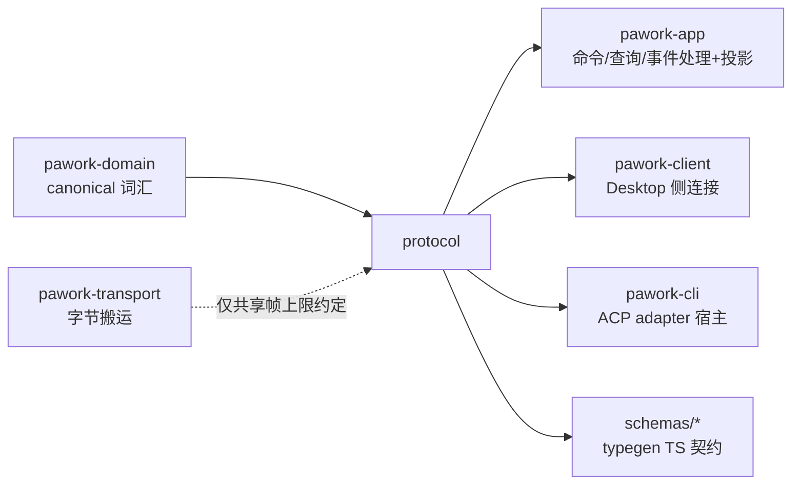

# pawork-protocol Review

> GUI Connection Protocol 的 wire 层：帧/编解码、版本协商与握手、resume 三态、snapshot、client token 认证、App 命令/查询/事件三通道（含 42 命令 + 18 查询 + 23 事件与静态 registry）、外部 client adapter 会话注册表、headless SDK JSON 协议、时间线投影与 TS typegen。38 个 .rs 文件（src 26 + tests 12），共 15 589 行（src 10 180 / tests 5 409），主要模块：codec/handshake/resume/snapshot/client_auth、app/（9 文件）、adapter/、headless/、projection/、typegen。API 版本 1.19。

## 1. 职责与边界

pawork-protocol 定义 GUI（Desktop）与本机 CLI Host 之间的全部线上契约，以及 ACP/外部 client 接入的 adapter 与 headless（SDK CLI JSON over stdio）两个旁路通道。它只做词汇、编解码、协商、投影与测试基础设施，不含业务决策：命令分发、policy、存储都在 app/engine 侧；Transport 字节搬运在 pawork-transport（本包不依赖它，二者仅共享 1 MiB 帧上限数值约定）。事件广播信封 AppEventEnvelope 与 domain 持久化信封 AgentEventEnvelope 是两套冻结 wire：前者面向 GUI 广播，后者面向持久化/重放，projection 模块负责两臂收敛。

与 Spec（docs/spec/crates/protocol.md）的差异（以源码为准）：① Spec §1 写 40 个 AppCommand / 15 个 AppQuery，源码 enum 与 registry 均为 **42 / 18**（§3.1 自身已写 42/18，§1 未同步）；② Spec §2 registry 行写 COMMANDS 34 行 / QUERIES 15 行，源码 42 / 18；③ Spec §2 lib.rs 行写 GuiCapability 5 变体，源码 **6**（1.18 增 BrowserControl）；④ Spec §3.1 称 GUI 宣告集冻结为 {Events, Snapshots, TerminalStreaming, Approvals}，源码派生集为 {…, **BrowserControl**}（registry.rs V2 快照注释）；⑤ Spec §2 version.rs 行写 CONTROL_PLANE_SCHEMA_VERSION = 1，源码为 **2**，默认 scope 为具体常量 local/default、local/user；⑥ Spec §2 quota 行写 QuotaUnit 3 变体，源码 4 形态（Percent 随 ADR-060 加入，spec §4 已载）；⑦ Spec §5/§7 golden 数量 76/70 fixture，实际 tests/golden/ 为 **93** 个；⑧ Spec §5 projection golden 三组，实际四组（thinking 新增）；⑨ Spec §2 json_mapping 32 行 / §7 11 行 Some，实际 **33 行 / 12 Some**（thinking_delta 新增）；⑩ Spec §6 称 pawork-storage 为 dev-dep，Cargo.toml dev-dependencies 仅 tempfile；⑪ Spec §2 行数量级多处过时（settings 550→720、version 230→411、command 870→1008、query 160→204、registry 520→888、stdio 230→319、projection 960→1444）；⑫ 源码公开 `project_server_tool_event`（Provider 服务端工具事件 → AppEvent）spec 类型表未载。

## 2. 依赖关系

| 方向 | 包 | 用途 |
|---|---|---|
| 本包依赖（生产） | pawork-domain | ID/Timestamp/AgentEventEnvelope（投影历史臂）、client_session 词汇（adapter registry）、DegradeEvent 映射 Diagnostic、ServerToolEvent（服务端工具投影） |
| 被依赖（生产） | pawork-app（命令/查询/事件处理与投影）、pawork-client（Desktop 侧连接）、pawork-cli（features=["adapter"]，ACP 接入） |
| 被依赖（dev） | 无 pawork-* dev-dep（仅 tempfile；storage dev-dep 已移除，源码无引用） |

| 外部 crate | 用途 |
|---|---|
| serde / serde_json | 全部 wire 类型与 JSON 帧编解码 |
| thiserror | 错误类型 Error 派生 |
| tokio（io-util/sync/macros/rt/time） | async 读写与并发原语（headless run_loop、adapter registry 锁） |
| async-trait（optional，feature `adapter`+`headless`） | trait 的 async 方法 |
| getrandom（optional，feature `client-auth`） | token 生成 |
| ts-rs（optional，feature `typegen`，连带 domain/typegen） | TS schema 导出 |
| tempfile（dev） | token/握手测试临时目录 |

feature：`default=["adapter","client-auth","headless"]`；`typegen` 非默认。bin target `pawork-protocol-typegen` 带 `required-features=["typegen"]`，默认死表不编译。

## 3. 文件清单

| 相对路径 | 行数 | 职责 |
|---|---:|---|
| src/lib.rs | 331 | 帧上限常量、ClientFrame/ServerFrame、握手/订阅/resume/snapshot/artifact/错误词汇与 re-export |
| src/codec.rs | 220 | u32 LE 长度前缀分帧、类型化帧编码、同步 read/write 与异步变体 |
| src/error.rs | 67 | ProtocolError 便捷构造（incompatible_version 等） |
| src/handshake.rs | 272 | 版本协商、HandshakeService/Session、认证钩子、信封版本校验 |
| src/resume.rs | 55 | ResumeContext 与 compute_resume_disposition 三态计算 |
| src/snapshot.rs | 35 | Snapshot/SnapshotSection::validate（data/artifact 互斥、上限） |
| src/client_auth.rs | 399 | pawork-token 方案、TokenStore 文件凭证、TokenAuthenticator |
| src/app/mod.rs | 18 | app 模块声明与 re-export（registry 不上 glob） |
| src/app/version.rs | 411 | 20 个版本常量（V1_0..=V1_19）、ApiVersion 兼容/bump、control plane 常量（schema 2） |
| src/app/command.rs | 1008 | AppCommandEnvelope/AppCommand 42 变体、ActorIdentity、ClientContextSnapshot 校验、WorkspaceRelativePath |
| src/app/query.rs | 204 | AppQueryEnvelope/AppQuery 18 变体、TimelinePage/Item、AppResponse |
| src/app/event.rs | 661 | AppEventEnvelope 双序号校验、AppEvent 23 变体、Team 词汇镜像 |
| src/app/quota.rs | 539 | 配额视图词汇、默认租户常量、mask_credential_hint |
| src/app/settings.rs | 720 | 设置类命令/查询的 Data 形状（General/Terminal/Permissions/Auth/模型启用/逐账号凭证） |
| src/app/limits.rs | 148 | PrincipalRole/PolicyGate/PolicyDecisionKind 与租户策略视图 |
| src/app/registry.rs | 888 | 三通道静态登记表（COMMANDS 42 + QUERIES 18）、wire 名映射、GUI 能力派生 |
| src/adapter/mod.rs | 980 | AdapterWireFrame、ClientAdapter trait、MockClientAdapter、SessionRegistry（epoch/revision/CAS） |
| src/adapter/identity.rs | 249 | ExternalAgentIdentity、TrustedTenantContext、bind_tenant |
| src/headless/mod.rs | 48 | headless 模块声明 |
| src/headless/wire.rs | 317 | HeadlessRequest/Response、SdkCapability、HeadlessError、Compat 词汇 |
| src/headless/translate.rs | 165 | 请求行解析/翻译、响应/事件编码、error_frame 构造 |
| src/headless/stdio.rs | 319 | Handler trait、run_loop select、StdioWriter 批/流模式与背压（仅 `feature = "headless"`） |
| src/headless/json_mapping.rs | 343 | AgentEvent JSON type → AppEvent tag 的 33 行静态映射表（12 行有镜像） |
| src/projection/mod.rs | 1444 | project_event/project_server_tool_event + TimelineProjection reducer（两臂收敛、思考、工具参数、用量） |
| src/typegen.rs | 324 | TS schema 生成/校验（core-api/gui-protocol/headless-json 三组） |
| src/bin/typegen.rs | 15 | typegen CLI 入口（--check） |
| tests/codec_framing.rs | 153 | 分帧编码与上限拒绝 |
| tests/frames.rs | 311 | 全帧型 round trip 与 chunk/snapshot 校验 |
| tests/golden.rs | 1337 | wire serde golden（93 fixture 全量对拍） |
| tests/handshake.rs | 421 | 版本协商、握手服务端逻辑、认证钩子、信封版本校验 |
| tests/headless_protocol.rs | 620 | headless 翻译往返、错误帧、run_loop 与 StdioWriter 背压 |
| tests/projection_golden.rs | 715 | 投影两臂对拍 golden（分页交错/Lagged/fork/沙箱详情/思考） |
| tests/projection_semantics.rs | 694 | 投影 reducer 语义单测（去重合并、resume 三态、fork 边界） |
| tests/registry.rs | 943 | registry 双射、完整性（42+18）、fail-closed、逐条目断言 |
| tests/resume.rs | 87 | resume 三态计算边界 |
| tests/snapshot.rs | 96 | snapshot section 校验 |
| tests/typegen.rs | 9 | schemas/ 与生成输出一致（feature typegen） |
| tests/workspace_files.rs | 23 | GUI 1.19 文件命令/查询 wire 往返与 registry 通道/minor 断言 |
| tests/golden/（93 个 .json）、tests/fixtures/headless/（4 个）、tests/fixtures/projection/（4 对 .jsonl+.expected.json） | — | golden fixture（见 §6） |

## 4. 类型与方法功能列表

### lib.rs — 传输帧词汇

常量：`MAX_PROTOCOL_FRAME_BYTES = 1 MiB`、`MAX_ARTIFACT_CHUNK_BYTES = 64 KiB`、`MAX_SNAPSHOT_SECTION_DATA_BYTES = 256 KiB`（三者是 DoS 边界，codec 在编解码两侧都强制）。

| 名称 | 种类 | 变体/字段/功能 |
|---|---|---|
| `ClientFrame` | enum（11） | Handshake / Command / Query / Subscribe / Unsubscribe / Resume / SnapshotRequest / Ack / ArtifactRead / Heartbeat / Pong |
| `ServerFrame` | enum（10） | Handshake / CommandAccepted / Response / Event / Snapshot / Resume / ArtifactChunk / Error / Heartbeat / Pong |
| `HandshakeRequest` | struct | request_id、client_name/version、supported_api_versions、capabilities、authentication |
| `HandshakeResponse` | enum（2） | Accepted { request_id, selected_api_version, handle, client_id, connection_id, resume, capabilities, host_data_dir: Option }（host_data_dir 自 1.9 可选）/ Rejected { request_id, error } |
| `GuiCapability` | enum（**6**） | Events / Snapshots / ArtifactStreaming（冻结保留、当前不再宣告）/ TerminalStreaming / Approvals / **BrowserControl**（1.18） |
| `ClientAuthentication` | struct | scheme + proof；Debug 脱敏不泄 proof |
| `SubscribeRequest` / `ResumeRequest` / `ResumeResponse` | struct | 订阅（subscription_id + streams）；按 last_global_sequence 恢复；返回 disposition |
| `ResumeDisposition` | enum（3） | Replay { from_sequence, through_sequence } / SnapshotRequired { earliest_available_sequence } / UpToDate { current_sequence } |
| `Snapshot` / `SnapshotSection` / `SnapshotSectionKind` | struct/enum | kind（6）：Workspaces / SessionTree / ActiveRuns / PendingToolApprovals / TerminalSessions / ProviderStatus；section 带 revision 与 data/artifact 二选一 |
| `ArtifactReadRequest` / `ArtifactChunk` | struct | 工件按 offset/limit 读取与分块回传；`ArtifactChunk::validate()` 强制 data≤64 KiB |
| `ProtocolErrorEnvelope` / `ProtocolError` / `ProtocolErrorCode` | struct/enum | code（10）：IncompatibleVersion、InvalidFrame、AuthenticationFailed、PermissionDenied、RequestNotFound、ReplayUnavailable、FrameTooLarge、Busy、ValidationFailed、Internal；envelope 带 request_id（无则为连接级错误） |

### codec.rs — 分帧与编解码

| 名称 | 种类 | 签名/功能 |
|---|---|---|
| `FRAME_LENGTH_PREFIX_BYTES` | const | 4（u32 LE），与 transport 层分帧约定一致 |
| `encode_client_frame` / `decode_client_frame` | fn | 类型化帧 ↔ JSON 字节（含上限与结构校验） |
| `encode_server_frame` / `decode_server_frame` | fn | 同上，服务端方向 |
| `encode_length_prefixed<T>` / `decode_length_prefixed<T>` | fn | 任意 Serialize/Deserialize 的 `[u32 LE len][payload]` 封装（headless 复用） |
| `write_frame` / `read_frame` | fn | 同步 IO 的裸分帧；**读侧在分配缓冲前拒绝超限声明** |
| `write_client_frame` / `read_client_frame` / `write_server_frame` / `read_server_frame` | fn | 同步 IO 类型化组合 |
| `write_frame_async` / `read_frame_async` | async fn | 裸分帧的 AsyncWrite/AsyncRead 变体 |
| `ProtocolCodecError` | enum（9） | InvalidJson、FrameTooLarge、ArtifactChunkTooLarge、SnapshotSectionDataTooLarge、AmbiguousSnapshotSection、EmptySnapshotSection、TruncatedFrame、FrameLengthMismatch、Io |

### error.rs / handshake.rs / resume.rs / snapshot.rs — 握手与恢复

| 名称 | 种类 | 签名/功能 |
|---|---|---|
| `ProtocolError::incompatible_version` 等便捷构造 | fn | error.rs |
| `negotiate_api_version(client, server)` / `negotiate_api_version_with` | fn | 客户端支持集中挑服务端也支持的最高 minor；major 不等即 None |
| `ClientAuthenticator` | trait | 握手认证钩子 |
| `HandshakeSession` | struct | client_id / connection_id / resume_context / last_global_sequence（服务端接受的上下文） |
| `HandshakeService` | struct | `new` / `with_authenticator` / `with_host_data_dir` / `accept`（协商 → 认证 → 能力交集 → resume disposition）；无 resume_context 时一律 SnapshotRequired |
| `ensure_compatible_api_version` / `validate_{client,server}_frame_api_version` / `decode_{client,server}_frame_checked` | fn | 信封/帧级版本闸（major 必等、minor 不得超前） |
| `ResumeContext` + `compute_resume_disposition` | struct/fn | UpToDate / Replay(last+1..current) / SnapshotRequired（越界与空 history 一律 snapshot，fail-closed） |
| `Snapshot::validate` / `SnapshotSection::validate` | fn | data 与 artifact_id 恰一存在；data ≤256 KiB |

### client_auth.rs — token 认证（feature `client-auth`）

| 名称 | 种类 | 签名/功能 |
|---|---|---|
| `TOKEN_SCHEME` | const | `"pawork-token"` |
| `Token(String)` | struct | 32 字节随机数 hex64；`constant_time_eq`；Debug 脱敏 |
| `TokenStore` | struct | `generate()`——create_new 不覆盖、文件 0600、父目录 0700；`load()` / `delete()` |
| `TokenAuthenticator` | struct | 实现 ClientAuthenticator：先核 scheme、再常数时间比对 |

### app/ — 三通道共用词汇

app/version.rs：`ApiVersion`（major 相等即兼容、bump_minor）、`V1_0..=V1_19`、`API_VERSION = 1.19`、`SUPPORTED_API_VERSIONS` 20 项；`ApiHandle{instance_id, api_version}`；文档性 `PROTOCOL_CRATE_COMPATIBILITY`；Control Plane：`CONTROL_PLANE_SCHEMA_VERSION = 2`、`DEFAULT_CONTROL_PLANE_TENANT = "local/default"`、`DEFAULT_CONTROL_PLANE_ACCOUNT = "local/default"`、`DEFAULT_CONTROL_PLANE_PRINCIPAL = "local/user"`、`ControlPlaneScope`（serde 缺省即默认 scope）。

app/command.rs（42 变体）：CoreInitialize；WorkspaceFileWrite（1.19）；BrowserRespond（1.18）；WorkspaceAdd / WorkspaceTrust；SessionCreate / SessionOpen / SessionRename / SessionArchive / SessionFork / SessionCompact / SessionClientContextReplace；RunStart / RunCancel / RunRetry / RunTool；AuthStart / AuthRemove / AuthSetApiKey / AuthCancel / SetDefaultModel；AuthAccountAddApiKey / AuthAccountStart / AuthAccountSelect / AuthAccountSetSelectionMode / AuthAccountRemove / AuthAccountRename；SetProxyUrl / SetProviderUseProxy / SetModelEnabled / SetProviderModelsEnabled / SetDefaultRoleModel / SetApprovalMode / SetTerminalSettings；ToolApprove；GitStage；TerminalCreate / TerminalWrite / TerminalResize / TerminalClose；McpTest / McpServerRemove。配套：`CommandSource` 6 变体、`ActorIdentity` 6 变体（canonical_principal 供审计）、`ApiKeySecret`（Debug 恒 [REDACTED]）、`ApprovalDecision`（approve_once / approve_for_run / deny / cancel）、`WorkspaceRelativePath`（构造即校验：拒绝绝对路径、`..`、Windows 盘符/UNC、反斜杠、控制字符；FromStr/serde 同路径校验）、`ClientContextSnapshot`（≤1 MiB / ≤128 文档 / ≤1024 诊断 / URI ≤4 KiB 且拒 `..` / 消息 ≤4 KiB）。

app/query.rs（18 变体）：WorkspaceFiles / WorkspaceFileRead（1.19）/ BrowserNext（1.18）/ WorkspaceList / SessionGet（timeline 分页）/ RunStatus / ModelList（1.12 起可选 include_disabled）/ DiffListFiles / DiffGet / ArtifactRead / QuotaOverview / SnapshotFetch / PluginList / McpList / ProviderAuthStatus / GeneralSettings / PermissionsSettings / TerminalSettings。配套 `TimelinePage{items, next_sequence?, head_sequence, complete}`（`for_api_version` 对 <1.14 过滤新 kind/字段）、`TimelineItem`（sequence/event_id/kind/run_id?/text?/message_id?/thinking_text?/tool_name?/status?/detail?/timestamp）、`TimelineItemKind` 15 变体、`AppResponse` 4 变体。

app/event.rs：`AppEventEnvelope` 双序号（global_sequence 全序 + stream/stream_sequence 子流，`validate_after` 强校验）；`EventStream` 6、`EventSource` 6、`AppEvent` 23 变体（CoreReady、WorkspaceChanged、SessionChanged、SessionMetaChanged、RunChanged、AssistantDelta、ThinkingDelta、ToolStarted、ToolOutput、ToolApprovalRequired、ToolCompleted、DiffChanged、TerminalOutput、TerminalExited、AuthChanged、ProviderStatus、PluginError、Diagnostic、GuiClientConnected、GuiClientDisconnected、QuotaChanged、QuotaAlert、TeamEvent）；`RunState` 12 态；`AuthChangeState` 6；`TerminalExitReason` 3；`ProviderStatus` 4；`DiagnosticLevel` 3 + `from_degrade_severity_str` + `From<&DegradeEvent>`；Team 镜像词汇（TeamEvent 18 变体、TeamBoardTask、TeamPresence、TeamRecipients、TeamMemberRole、TeamTaskState、TeamPlanStepSnapshot 等——teams crate 已归档，此处是仓内唯一定义，消费方为 cli 的 ACP 映射）。

app/quota.rs：`QuotaWindow` 4（Overall/Rolling5h/Weekly/Monthly）、`QuotaUnit` **4 形态**（Count/Token/**Percent**{ADR-060}/Cost{currency}）、`QuotaMeasure` 3、`QuotaValues`、`QuotaConfidence` 3、`QuotaAdapterKind` 4、`QuotaProvenanceView`/`QuotaReset`、`QuotaOverviewQuery`（`default_local()`、`is_default_scope()`）、`QuotaScopeView`/`QuotaSnapshotView`/`QuotaFailureView`/`WindowReadView`/`WindowReadEntry`/`QuotaOverviewView`、`QuotaAlertKind` 5、`QuotaAlertSeverity` 3、`QuotaAlert`、`mask_credential_hint`（保留首尾各 2 字符）；常量 DEFAULT_QUOTA_TENANT="local"、DEFAULT_QUOTA_ACCOUNT="local/default"、DEFAULT_QUOTA_TENANT_CANONICAL="local/default"。

app/settings.rs：`ApprovalModeWire` 5（always_ask/ask_for_writes/ask_for_dangerous/never_ask/read_only）；`GeneralSettingsData` / `TerminalSettingsData` / `PermissionsSettingsData`；`DefaultModelPair`；`ProviderAuthState` 4；`ProviderCatalogState` 3；`ProviderCredentialStatus` / `ProviderAuthStatusEntry`（ADR-056 起 credentials 列表、ADR-059 起 credential_id/display_name/selected）/ `ProviderAuthStatusData`（role_defaults 三键 required-nullable）；`ProviderUseProxyData` / `SetModelEnabledData` / `SetProviderModelsEnabledData` / `SetDefaultRoleModelData` / `RoleDefaultsData` / `AuthStartData`；可空字段挂 `deserialize_required_option`。

app/limits.rs：`PrincipalRole` 4、`PolicyGate` 9、`PolicyDecisionKind` 4、`TenantPolicyView`（deny-first：Some(vec![])=拒全部）/ `PermissionProfileView` / `PrincipalRoleBinding` / `AuditExportPolicyView` / `PolicyDecisionEventView`。

app/registry.rs：`GuiChannelAccess{available, required_capability}`、`RegistryEntry{wire_name, gui, headless, acp, idempotent, since}`；静态表 COMMANDS（42）/ QUERIES（18）；穷尽 match `command_wire_name` / `query_wire_name` + 反查 `*_by_wire_name`（fail-closed None）+ `*_entry`（表缺 panic fail-fast）+ `*_entries`；`GUI_INTRINSIC_CAPABILITIES = [Events, Snapshots]`；`gui_supported_capabilities()` 派生宣告集 = **{Events, Snapshots, TerminalStreaming, Approvals, BrowserControl}**（ArtifactStreaming 冻结保留但不宣告）。

### adapter/ — 外部 client 接入（feature `adapter`）

adapter/mod.rs：`AdapterWireFrame`（schema_version/request_id/method/payload/extensions；validate 拒 extensions 遮蔽保留字段）、`CanonicalClientRequest` 5（Command/Query/Attach/Reattach/Disconnect）、`CanonicalCoreFrame` 4（Response/Event/SessionState/Error）、`AdapterErrorFrame`、`AdapterError` 11；trait `ClientAdapter`（decode/encode/capabilities）+ `ClientAdapterFactory`；`AdapterSessionContext`；`SessionRegistry` + `InMemorySessionRegistryStore`（attach/reattach/disconnect 的 epoch+1/revision+1 CAS 所有权状态机，冲突回写权威记录返 StaleOwner）；`MockClientAdapter(Factory)` 测试替身。

adapter/identity.rs：`ExternalAgentIdentity`（session/agent/parent-agent id，validate 长度与字符集闸、is_subagent）、`TrustedTenantContext`（仅宿主注入）、`bind_tenant()` → `TenantBinding`（fail-closed）、`IdentityError` 3。

### headless/ — SDK CLI JSON over stdio

`wire` / `translate` / `json_mapping` 始终编译；`stdio.rs` 仅 `feature = "headless"`。

wire.rs（`MAX_FRAME_BYTES = 4 MiB`）：`SdkCapability` 5（sessions/runs/streaming/compat_import/compat_history）、`HeadlessRequest` 5 + `HelloRequest`、`HeadlessResponse` 6、`ProtocolErrorKind` 9、`HeadlessError{kind, message}`；compat 词汇 `CompatSource` 4（claude/codex/grok/cursor）+ `CompatImportOptions`/`CompatImportReport`/`CompatHistoryEntry`/`CompatImportRequest`/`CompatHistoryQuery`；内部分发形状 `TranslatedRequest`。

translate.rs：`parse_request_line`（先验 type 字段：未知 → UnknownRequestType 而非 malformed）、`translate_request(_line)`（信封版本兼容闸；hello 不得进入分发）、`encode_response_line` / `encode_event_line` / `encode_protocol_response` / `encode_request`、`error_frame`（保留 request_id）、`canonical_json`。

stdio.rs：`Handler` trait（handshake/handle/poll_event 三个方法都必须快速返回）；`LoopConfig`（批模式/帧上限）；`run_loop`（select 读行与 poll_event，EOF 先排空事件；握手前非 hello → NotHandshaked）；`StdioWriter`（批模式 pending 超上限先写 backpressure 错误帧再终止，流模式逐帧 flush）。

json_mapping.rs：`JSON_TO_HEADLESS_EVENT_MAP`——**33 行**静态映射（domain AgentEvent JSON type → headless AppEvent tag），**12 行 Some**（run_started/run_completed/run_cancelled/run_failed → run_changed、assistant_text_delta → assistant_delta、assistant_thinking_delta → thinking_delta、tool_call_started → tool_started、tool_approval_requested → tool_approval_required、tool_output_delta → tool_output、tool_execution_completed → tool_completed、diagnostic → diagnostic），其余 None 不转发；`app_event_tag_for_json_type()` 查表。

### projection/ — 时间线投影

| 名称 | 种类 | 签名/功能 |
|---|---|---|
| `project_event(&AgentEventEnvelope) -> Option<TimelineItem>` | fn | **历史臂**：持久化事件降维成 TimelineItem（含 Diagnostic 与 CheckpointCreated/RolledBack）；非 UI 事件 None；单个 committed 至多一条 wire 条目（正文与思考共享） |
| `project_server_tool_event(&RunId, &ServerToolEvent) -> Option<AppEvent>` | fn | **Provider 服务端工具事件 → AppEvent 实时帧**（Started→ToolStarted、CitationAdded→ToolOutput、Completed/Failed→ToolCompleted；其余 None）。Host 实时广播与持久化历史共用；不进本地工具执行或审批链 |
| `TimelineEntryKind` | enum（6） | UserMessage{text} / AssistantMessage{text} / **Thinking{text}** / ToolCall{name,status,detail,**arguments**} / RunState(text) / Error(text)——渲染态，非 wire |
| `ForkBoundary` | enum（3） | Completed / Cancelled / Failed——仅 run 三终态可作 fork 边界 |
| `TimelineEntry` | struct | { sequence, event_id, kind, fork_boundary, timestamp, run_id }；`is_fork_boundary()` |
| `TimelineProjection` | struct | `apply_item`（历史臂，sequence 去重）/ `apply_event`（live 臂，重复 false）/ `apply_resume_disposition`（Replay/UpToDate 不动基线、SnapshotRequired 清基线）/ `reset_baseline`（同时清参数与用量）/ `run_usage(run_id)`（持久化终态累计 TokenUsage，缺失即未知） |

私有 reducer 语义（projection_semantics/projection_golden 双向钉死）：assistant delta 按 run+message 锚点合并，committed（AssistantMessage）权威替换并留 tombstone 吞掉迟到 delta；思考保留首次增量位置、redacted/signature/encrypted 不进 GUI；tool 条目按 run+tool_call_id 回填（detail 内编码 `_pawork_tool_call_id` JSON 身份——wire 冻结不能加字段），参数按序去重后挂 `arguments`，终态 text 替换流式输出；`refresh_tool_arguments` 增量刷新；Diagnostic 只显示 `sandbox.fallback` 与 `checkpoint.snapshot_failed`；RunState 文案两臂统一（CR08-08）。desktop（apps/desktop/projection）与 CLI（crates/cli/render.rs）共用本 reducer。

### typegen.rs / bin/typegen.rs — TS schema（feature `typegen`）

`TypegenError`、`find_workspace_root`、`generate()/check()/run(check_only)`——三组 schema（`schemas/core-api` 85 文件、`schemas/gui-protocol` 102、`schemas/headless-json` 92）+ versions + index barrel；check 逐文件 diff，缺/多/漂移均报错。bin `pawork-protocol-typegen`，`--check` 只校验。

## 5. 关键行为与契约

- **冻结契约（golden 先行）**：ClientFrame/ServerFrame serde 形状、AppCommand/AppQuery/AppEvent 的 tag/content 与 wire 名、握手/resume/snapshot/artifact 帧、headless JSON——全部由 tests/golden 的 **93** 个 fixture + typegen check 钉死；schema/wire 演进须用户确认并同批更新 golden。
- **版本协商契约**：major 相等即兼容，minor 只升不降；服务端只宣告 SUPPORTED_API_VERSIONS 中的版本（1.0..1.19 共 20 项）；信封 api_version 不得超前协商版本。新增命令必须标 since 并进 registry，否则穷举 match 编译失败。
- **三通道 registry 不变量**：enum ↔ COMMANDS/QUERIES 表一一对应（42+18，无通配穷举）；`*_by_wire_name` 未登记返回 None（fail-closed），`*_entry` 表缺条目 panic（fail-fast）；GUI 宣告集由表派生并含 BrowserControl；ArtifactStreaming 冻结保留但无条目 require、不宣告。
- **事件双序号不变量**：AppEventEnvelope.validate_after 要求同 instance、global_sequence 严格 +1、同流 stream_sequence +1；恢复路径 Replay 去重、SnapshotRequired 重置基线、UpToDate 保留基线。
- **有界帧 DoS 边界**：1 MiB 帧 / 64 KiB chunk / 256 KiB snapshot data，编解码两侧与长度前缀声明（分配前）都校验；headless 放宽到 4 MiB 但同样声明先验。
- **安全红线**：ClientAuthentication/ApiKeySecret/Token Debug 全脱敏；token constant_time_eq + create_new 不覆盖 + 0600/0700 权限；WorkspaceRelativePath 全路径校验拒穿越；ClientContextSnapshot URI scheme 白名单拒 javascript/data/vbscript；租户身份只能来自宿主注入的 TrustedTenantContext。
- **adapter 会话并发契约**：claim/transition 走 epoch+1/revision+1，CAS 冲突回写权威记录返 StaleOwner；Host 只信 factory 协商上下文 + registry 权威记录。
- **headless 顺序契约**：必须先 hello（NotHandshaked fail-closed）；未知 type 显式 UnknownRequestType；错误帧保留 request_id；批模式背压先写错误帧再终止。
- **投影两臂收敛（CR08-08）**：同一事件序列 live 臂与历史臂终态一致；tool 身份经 detail 内 `_pawork_tool_call_id` 编码（wire 不能加字段）；fork 只许切在 run 终态边界；参数与用量随基线重置清理。
- **feature 门**：default 全开 adapter/client-auth/headless；typegen bin 仅显式 feature 下编译。

## 6. 测试资产

| 文件/目录 | 验证点 |
|---|---|
| tests/codec_framing.rs | u32 LE 前缀、读写 round trip、声明超限分配前拒绝、截断/长度不匹配错误 |
| tests/frames.rs | 全部 11 ClientFrame + 10 ServerFrame 变体 round trip、超限帧/chunk/snapshot 编解码双侧拒绝、认证 Debug 脱敏 |
| tests/golden.rs + tests/golden/（**93** fixture：44 client_* + 34 server_* + 15 其它） | 全量 wire golden：握手双向、命令（terminal/session/auth/settings/mcp/model/browser/workspace-file 各切片）、事件、snapshot、resume 三态、timeline、设置回执、quota percent、旧 minor 降级样；GUI_PROTOCOL_UPDATE_GOLDEN=1 再生成 |
| tests/handshake.rs | 版本协商（空表/major 不匹配/最高共同 minor）、能力过滤、resume 计算、认证钩子（AlwaysAccept/Reject + 真实 TokenAuthenticator）、信封/帧级版本校验 |
| tests/resume.rs | 三态边界（恰好最早、落后 retention、客户端超前、空 history、history 从 0 起） |
| tests/snapshot.rs | section data/artifact 互斥、空 section 拒绝、256 KiB 上限、artifact-backed 合法 |
| tests/headless_protocol.rs | 4 个 fixture 驱动翻译往返与错误 kind、事件/兼容回执 round trip、run_loop（握手、事件交错、EOF、未握手拒绝、错误帧保 request_id、坏行容错）、StdioWriter 批/流背压 |
| tests/fixtures/headless/（translate/event/error/compat_response .json） | headless 翻译与编码的对拍数据 |
| tests/projection_golden.rs + tests/fixtures/projection/（**4 组** .jsonl + .expected.json：paged_interleave / lagged_to_snapshot / fork_branch_switch / thinking） | 两臂对拍 golden：分页交错去重、Lagged→Snapshot 重建、fork 切支、思考逆序/重叠分页与 redacted 排除 |
| tests/projection_semantics.rs | reducer 单测：assistant delta 合并、committed 替换/迟到 delta 吞并、并发 tool 按 call_id 回填、resume 三态、run 态文案两臂一致、fork 边界、性能 |
| tests/registry.rs | wire 名与 serde tag 双射、表完整唯一（**42+18**，断言 len）、样本表与登记表精确相等、未知 wire 名 fail-closed、GUI 宣告向量 V2 快照、逐条目无通配断言 |
| tests/workspace_files.rs | GUI 1.19 workspace_files / workspace_file_read / workspace_file_write golden 往返、registry 通道与 since 1.19 断言 |
| tests/typegen.rs | schemas/ 与生成输出一致（feature typegen 门控） |

## 7. 协作关系

