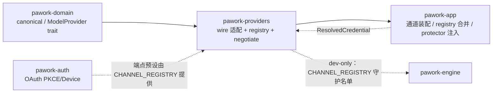

# pawork-providers Review

> 首发模型渠道适配层：OpenAI-compatible / Responses / Anthropic Messages 三套 wire transport、八通道静态注册表、三源能力证据与协商、token 计量与计价。共 34 个 .rs 文件 / 13,049 行（src 11,149 / 28 文件 + tests 1,900 / 6 文件）；主要模块：`net`（http/sse/retry）、`channels`（八通道与 CHANNEL_REGISTRY）、`registry`/`negotiate`（能力证据与协商）、`responses`/`request`/`stream`（wire 翻译与流组装）、`pricing`/`usage`（计量）。

## 1. 职责与边界

- **做什么**：canonical `CanonicalModelRequest` → 三种厂商 wire（Chat Completions / Responses / Anthropic Messages）；SSE 字节流 → `ProviderStreamEvent`；凭证校验与认证头注入（`ResolvedCredential` 唯一入口，构造期拒绝固定凭证头）；模型目录三源证据（静态/probe/override）+ `CapabilityNegotiator` 协商；通道 preset 单点登记（`CHANNEL_REGISTRY` 八行 + `is_enabled` 唯一 cfg 求值点）；reasoning continuation 保护边界（trait + 内存实现）；usage 归一/聚合与 micros 整数计价；HTTP 状态与厂商错误正文归一。
- **不做什么**：不做重试编排（`retry` 只分类与解析 Retry-After，策略归上层）；OAuth 流程本身（PKCE/Device/refresh）在 `pawork-auth`，本包只提供端点预设数据；不持久化 Secret（明文只在构造 header 与 protector 调用边界短暂存在）；不按 Provider 名称做能力分支——一切差异经 registry 证据 + negotiate 表达。
- **模块纪律**：core 模块（registry/pricing/usage/negotiate/reasoning/error）零 `net` 引用（`lib.rs` 内 `module_discipline` 测试强制）；`responses_reasoning` 为 crate 私有模块，行为只能经 `responses` 观察。
- **feature 门**：9 个空 feature（anthropic 默认开）；Chat Completions 基线始终编译；各通道适配器按 feature 编译；`CHANNEL_REGISTRY` 与 `channels::registry` 不受任何 feature 门控（八行数据恒定）。

## 2. 依赖关系

| 方向 | 包 | 用途 |
| --- | --- | --- |
| 上游（生产） | pawork-domain | canonical 类型、`ModelProvider`/`ProviderEventSink` trait、`ProviderError`、`CancellationToken`、`ProtectedBlobRef`/`ReasoningItem`、`ServerToolEvent`/`Citation` |
| 下游 | pawork-app（生产，开全部 9 个 feature） | 通道装配、registry 合并、transport 选择 |
| 下游 | pawork-engine（仅 dev-dependency） | 守护测试名单从 `CHANNEL_REGISTRY` 派生 |
| 协作 | pawork-auth | OAuth 授权流本体（本包 registry 只提供端点预设数据） |

| 外部 crate（生产） | 用途 |
| --- | --- |
| reqwest | HTTP 客户端（重定向 Policy::none、逐 chunk 读超时） |
| tokio / futures | 异步运行时与 Stream 消费、`tokio::select` 取消竞争；生产 tokio features 为 `sync` / `rt` / `time` / `macros` |
| serde / serde_json | wire body 构造与流式 JSON 解析、`ModelPricing` 冻结形状 |
| thiserror | `RegistryError`/`ReasoningProtectError`/`SseParseError` |
| tracing | 保留键忽略告警、reasoning continuation 降级 debug 日志 |
| bytes / async-trait | 字节流类型（`ByteStream`）与 async trait |

**dev**：`wiremock`（HTTP mock）、`proptest`（SSE 随机字节）、`tokio`（macros / rt-multi-thread / time）。

## 3. 文件清单

| 相对路径 | 行数 | 职责 |
| --- | --- | --- |
| src/lib.rs | 134 | crate 门面、`is_credential_header`（五头）、re-export、module_discipline 测试 |
| src/error.rs | 19 | `RegistryError`（NotFound/DuplicateAlias/DuplicateModelId） |
| src/error_table.rs | 165 | 厂商错误细化表 `VENDOR_ERROR_RULES` + `normalize_vendor_error` |
| src/provider.rs | 325 | `OpenAiCompatibleProvider`：Chat Completions 基线适配器 |
| src/request.rs | 474 | canonical → Chat Completions body（`to_chat_completions_body`） |
| src/stream.rs | 234 | Chat chunk → 事件（`chunk_to_events`/`is_done`/`ChunkState`） |
| src/responses.rs | 873 | 共享 Responses transport + wire 构造 + `ResponsesStreamAssembler` |
| src/responses_reasoning.rs | 247 | Responses reasoning item 与 canonical 安全映射（crate 私有） |
| src/registry.rs | 1,938 | `ModelRegistry` 三源证据、probe 状态机、别名解析、内置目录 |
| src/negotiate.rs | 503 | `CapabilityNegotiator` 纯函数协商 + `clamp_reasoning_to_thinking` |
| src/pricing.rs | 199 | `ModelPricing` micros 定点计价、`BUILTIN_RATE_CARD` |
| src/usage.rs | 299 | usage/stop reason 归一、`UsageAccumulator` 会话聚合 |
| src/reasoning.rs | 98 | `ReasoningProtector` trait 与错误类型 |
| src/memory_protector.rs | 106 | `InMemoryReasoningProtector` 进程内实现 |
| src/net/mod.rs | 9 | net 门面（http/retry/sse） |
| src/net/http.rs | 451 | `HttpClient`：超时/代理/trace/取消、脱敏 Debug |
| src/net/retry.rs | 284 | `classify_status`/`classify_request_error`/`parse_retry_after` |
| src/net/sse.rs | 449 | 增量 SSE 解析器（1 MiB 有界缓冲、跨 chunk UTF-8 安全） |
| src/channels/mod.rs | 59 | channels 门面与 re-export（保持合并前对外路径形状） |
| src/channels/registry.rs | 378 | `CHANNEL_REGISTRY` 八行 + `is_enabled` 唯一 cfg 求值点 |
| src/channels/api_key.rs | 229 | 五条 API-key 通道共用适配器 + `verify_api_key` |
| src/channels/chatgpt.rs | 282 | ChatGPT OAuth Responses 适配器（/models 目录解析） |
| src/channels/xai.rs | 453 | xAI 双认证适配器（Chat/Responses 按模型选）+ 静态目录 |
| src/channels/kimi.rs | 327 | Kimi Code OAuth 适配器（固定 Chat Completions） |
| src/channels/anthropic/mod.rs | 18 | Anthropic 门面、`ANTHROPIC_VERSION` |
| src/channels/anthropic/provider.rs | 1,095 | AnthropicProvider：协商收口、thinking 保护、流泵 |
| src/channels/anthropic/request.rs | 793 | canonical → Messages body（`MessagesWirePlan`） |
| src/channels/anthropic/stream.rs | 708 | Anthropic SSE → 事件（`parse_event`/`StreamOutput`） |
| tests/contract.rs | 720 | OpenAI-compatible 契约全集（wiremock） |
| tests/anthropic.rs | 567 | Anthropic Messages 契约（wiremock） |
| tests/api_key_channels.rs | 246 | 五条 API-key 通道默认值与 fail-closed |
| tests/xai.rs | 159 | xAI 模型能力选 transport + OAuth Responses 往返 |
| tests/chatgpt.rs | 144 | ChatGPT 头/models/Responses 接线 + malformed 立即报错 |
| tests/responses.rs | 64 | `to_responses_body` 保留 canonical tools、拦截保留键 |

## 4. 类型与方法功能列表

### lib.rs（门面）

`is_credential_header(name)`（pub(crate)）：五头名单 `authorization`/`proxy-authorization`/`api-key`/`x-api-key`/`x-goog-api-key`，大小写不敏感——所有适配器构造期据此拒绝固定凭证头。其余为模块声明与按 feature 的 re-export；`module_discipline` 内联测试扫描 core 六模块源码禁止出现 `net` 标识符。

### provider.rs（Chat Completions 基线）

| 名称 | 种类 | 功能/语义 |
| --- | --- | --- |
| `OpenAiCompatibleConfig` | pub struct | `base_url`/`provider_id`（默认 openai-compatible）/`http`/`request_timeout`（便捷字段，设置时覆盖 http.timeout）；`chat_url()`/`models_url()` 拼接并去尾部斜杠 |
| `OpenAiCompatibleProvider` | pub struct | `new(config, credential)`：credential 存在且 extra_headers 含凭证头 → 构造失败（InvalidRequest）；`drive_stream`：to_body → POST（Bearer 头）→ `ResponseStarted` → SseParser + ChunkState 循环（逐事件 emit；usage/finish 追踪进 summary）→ `sse.finish()` 冲刷尾事件 → `[DONE]` 无 finish_reason 按 Completed；未见任何完成信号 → `StreamInterrupted`；`list_models`：GET /models，data[] 保守映射（128k 窗口/16k 输出/text+tool_calls）；预取消在 HttpClient 层竞争（不发请求） |

### request.rs（Chat wire 翻译）

`to_chat_completions_body`：model/stream=true/`stream_options.include_usage`；messages 经 `message_to_openai`（ToolResult 展开为独立 role=tool 消息；文本 join；图片 → `image_url` 数组（Url 透传、Base64 拼 data: URI、Artifact 跳过）；ToolCall → `tool_calls[]`（arguments 优先 parsed，null 时用 raw）；Thinking/Reasoning 不回传；空内容补空 content）；tools → function 形态 + tool_choice 映射（none/auto/required/named）；temperature/max_tokens/stop；response_format（json_object/json_schema）；thinking.level → `reasoning_effort`（Off→不写）；provider_options 白名单透传（`is_reserved_provider_option` 十四键拦截并 tracing 告警：含 `authorization` / `proxy-authorization` / `api-key` / `x-api-key` 与下划线变体 `api_key`，不含 `x-goog-api-key`）。

### stream.rs（Chat 流解析）

`chunk_to_events(data, &mut ChunkState)`：usage 键存在 → `normalize_usage` → UsageUpdated（非零才发）；choices[0].delta.content → TextDelta；delta.reasoning_content|reasoning → ThinkingDelta（兼容 OpenAI o 系与兼容服务字段名）；delta.tool_calls 按 index 组装（首次带 id/name → ToolCallStarted + 首段参数，后续仅 index+arguments → ArgumentsDelta；无 id 时合成 `call-{index}`）；finish_reason → 对所有已开始调用发 ToolCallCompleted + `map_stop_reason` → ResponseCompleted。`ChunkState{tool_ids: HashMap<usize,String>, has_tool_calls}`。`is_done`：trim 后 == `[DONE]`。

### usage.rs（计量归一与聚合）

| 名称 | 种类 | 功能/语义 |
| --- | --- | --- |
| `normalize_usage` | pub fn | 兼容 OpenAI（prompt/completion_tokens、嵌套 prompt_tokens_details.cached_tokens）与 Anthropic（input/output、cache_read_input/cache_creation_input）命名；usage 容器优先、顶层回退；缺字段按 0，绝不 panic |
| `map_stop_reason` | pub fn | has_tool_calls 优先 ToolUse；stop/end_turn/ended → Completed；length/max_tokens/max_output_tokens → MaxTokens；tool_calls/function_call/tool_use 等 → ToolUse；content_filter/safety → ContentFiltered；cancelled/canceled → Cancelled；None → Completed；未知 → Other |
| `UsageAccumulator` | pub struct | 请求内「最新快照覆盖」、跨请求「累加」：`record(request, usage)`（换请求先结算）、`total()`（已结算 + 进行中最新）、`current()`、`finish_request()`（幂等结算）；saturating 加法。假设会话内请求顺序发起，交错回放不在支持范围 |

### pricing.rs（计价）

`BUILTIN_RATE_CARD="builtin"`、`BUILTIN_RATE_VERSION="2026-08-15"`（费率卡版本口径，调价更新数据表）。`ModelPricing`：四类 per-mtoken micros + currency；自定义 Serialize/Deserialize 保持 V1 磁盘形状（缺字段按 0/USD）。`estimate_cost(usage, pricing)`：`tokens * per_million_micros / 1_000_000`（u128 中间防溢出，截断取整），四分量 saturating 相加。`MILLION=1_000_000` 常量导出。计价单轨：usage 模块不含任何定价逻辑。

### error_table.rs（厂商错误细化）

`VendorErrorRule{vendor, needles, kind, retryable, detail, diagnostic_key}`；`VENDOR_ERROR_RULES` 12 条：chatgpt（usage+limit → QuotaExceeded；account+deactivated → Authorization）、xai（live_search+quota → RateLimited；collection+not_ready → ProviderUnavailable；insufficient_quota → QuotaExceeded）、qwen-token-plan（datainspectionfailed/data_inspection_failed → ContentFiltered；throttling → RateLimited；quota_exhausted → QuotaExceeded）、glm-coding（1113 → QuotaExceeded；1301/敏感 → ContentFiltered）。`normalize_vendor_error(vendor, error)`：消息小写后须命中该厂商规则**全部** needles 才改判 kind/retryable 并写 diagnostics；未命中原样返回（回退通用分类）。

### registry.rs（目录与三源证据）

| 名称 | 种类 | 功能/语义 |
| --- | --- | --- |
| `CatalogEntry` | pub struct | id/provider/display_name/窗口/输出/capabilities/pricing?/aliases；`to_definition()` 丢弃 provider/定价/别名转协议定义 |
| `CapabilitySource` | pub enum | `Static`/`Probe`/`Override`（优先级仅溯源展示；合并是交集） |
| `CapabilityEvidence` | pub struct | 单模型三源快照；`source()` 按来源取原始声明；`merged()` = present 来源逐字段交集 |
| `ProviderProbe` | pub struct | 一次 list_models 结果；`capabilities_for(model)`（ASCII 大小写不敏感）/ `contains` |
| `ProbeError` | pub struct | 探测失败也进缓存（避免反复探测） |
| `ProviderCapabilitySource` | pub trait | `provider_catalogs() -> Vec<(ProviderId, Vec<ModelDefinition>)>`；Vec 元组有默认 impl；Core 不做名称匹配 |
| `merge_capabilities` | pub fn | serde Value 层字段级合并：bool 取 AND、数组取元素交集、其它字段全源相等才保留（冲突移除键取默认，fail-closed）；hosted_tool_tags 空集合显式再交集（防 serde skip 误判）；空证据 → 全默认（全不支持）；单源直接 clone |
| `ModelRegistry` | pub struct | entries BTreeMap + alias_to_id + overrides Mutex + probes 共享缓存（Clone 时探测缓存整体 Arc 共享）；方法见下 |
| `caps` | pub fn | 七参布尔便捷构造（v2 字段走 Default 兼容） |

`ModelRegistry` 主要方法：`empty`/`builtin`（五条内置：glm-5.2 无定价、deepseek-v4-pro 带公开费率、qwen3.8-max、deepseek-chat/reasoner）；`register`/`try_register`（别名/真实 id 命名空间冲突预检，替换同 id 时旧别名失效）；`extend_with`（动态覆盖语义：同 id 替换、与真实 id 冲突的别名忽略防劫持）；`merge_provider_source`/`merge_provider_models`（factory builtin_models 并入静态证据：同 provider 更新字段，跨 provider 冲突跳过，新模型无定价/别名）；`resolve`（真实 id 优先于别名，防别名遮蔽导致错误定价）；`list`/`filter`（caps_satisfied）/ `validate_context`/`estimate_cost`（无定价返回 None 不编造）；`set_override`/`remove_override`/`override_for`/`overrides`（别名先解析为真实 id；未知 id 允许 override-only 证据）；`record_probe`（强制固定 last-write-wins，任何状态可直接 Done）；`clear_probe`；`probe_provider`（Idle→InFlight→Done 状态机，同 provider 只探测一次，并发共享槽位、不持锁跨 await，失败缓存）；`capability_evidence(model)`（别名解析后按真实 id 查 probe/override，无静态条目时按 provider 扫描 probe；三源全无 → None）；`capability_snapshot()`（静态 ∪ probe ∪ override 键并集全量快照）。

私有实现要点：`ProbeSlot` 状态机两种提交路径——`complete`（record_probe 强制固定）与 `complete_claimed`（claim owner 仅在仍是自己的 InFlight 时提交，迟到结果不覆盖已固定值）；`WaitForProbe` 手写 Future（poll 内持锁登记 waker，`will_wake` 去重）；`caps_satisfied` 覆盖 v1 布尔 + citations + transport 等值 + hosted_tool_tags 子集。

### negotiate.rs（协商）

`CapabilityNegotiator::negotiate(evidence, requirements) -> ResolvedCapabilities` 纯函数（不触网、不读 Provider 名、不读时钟）：

- 证据层先 `evidence.merged()`（交集）；
- `choose_transport`：请求偏好 ∩ 模型声明 → 采用；否则模型自身非基线 transport；模型只有基线 ChatCompletions 而偏好现代 transport → 降级并记 `LegacyTransport` fallback；
- hosted tools 逐 tag 判定（key 为稳定 `tool:PascalCase`，经 `capability_key()` 构造，禁止 Debug 反解）；未声明 → `Reject`；
- citations 未声明 → `Reject`；
- reasoning：模型无任何 reasoning 能力且请求要求 → 整项 `Reject`；XHigh/Max 但不支持细粒度 effort → clamp High + `ClampedEffort`；signature/encrypted/interleaved 三个 state 维度各自独立判定，未声明即 `Reject`；
- 不变式：`requested == supported ∪ unsupported`，不支持能力绝不静默丢弃。

`clamp_reasoning_to_thinking(reasoning, thinking) -> ThinkingConfig`：adapter 复用入口，XHigh/Max 显式 clamp 为 High（effort 优先，budget 沿用旧 thinking，都无 → Off）。

### reasoning.rs / memory_protector.rs（reasoning 保护）

`ReasoningProtectError`：`Unavailable`（引用不存在/跨 scope/密钥不可用，fail-closed）/ `Corrupted`（密文摘要/AEAD 失败）+ 两个谓词。`ReasoningProtector` trait：`async protect(&[u8]) -> ProtectedBlobRef` / `async resolve(&ProtectedBlobRef) -> Vec<u8>`——opaque payload 与稳定逻辑引用的统一互转边界，不解释明文。`InMemoryReasoningProtector`：namespace 由全局计数器 + RandomState 哈希派生（两实例 ref 不串），`RwLock<HashMap>` 存储，ref 形如 `memory-reasoning-{namespace:016x}-{id}`；Debug 只输出 entry_count。生产实现在 pawork-app protected 模块，本包类型用于测试与默认装配。

### responses.rs（共享 Responses transport）

| 名称 | 种类 | 功能/语义 |
| --- | --- | --- |
| `ResponsesWireOptions` | pub struct | `store: Option<bool>`（ChatGPT 默认 Some(false)，xAI/API-key 不设）+ `include_encrypted_reasoning`（请求返回加密 continuation） |
| `ResponsesTransportConfig` | pub struct | base_url/provider_id/http/request_timeout/request_headers/wire；认证头禁止出现在固定头（构造期查 request_headers 与 http.extra_headers 两处） |
| `ResponsesTransport` | pub struct | `new` fail-closed + 默认 InMemory protector（`with_reasoning_protector` 注入生产实现）；`request_headers()` 追加 Bearer；`list_standard_models`（data[] → 保守 text+tools、窗口 0）；`get_json`（错误经 normalize_vendor_error）；`stream`：hosted_tools/extensions 非空先拒绝 → `resolve_reasoning_inputs`（历史 ReasoningItem 经 protector recover 还原；失败 debug 日志跳过）→ `to_responses_body` → POST → SSE 循环喂 `ResponsesStreamAssembler` → finish 合并终态；无完成事件 → `StreamInterrupted` |
| `to_responses_body` | pub fn | System 消息 → instructions；其余 → input 数组（message/function_call/function_call_output/input_image）；tools → function + strict:false + parallel_tool_calls:true；reasoning effort（显式 ReasoningConfig 优先，否则 clamped thinking 映射，XHigh/Max 压 High）；include reasoning.encrypted_content；store；text format；`previous_response_id` 白名单透传 + 其余 provider_options（`is_reserved_option` 十七键拦截） |
| `ResponsesAssemblyEvent` | pub enum | `Canonical(ProviderStreamEvent)` / `ReasoningOutputItem{wire}`（待 protect） |
| `ResponsesStreamAssembler` | pub struct | 流组装状态机：function_calls item_id→call_id 映射、started/arguments_seen/completed_calls 去重集合、response_id/usage/stop_reason/completed 终态；`feed(data)` 按 type 分派（created/in_progress → ResponseStarted；output_text.delta → TextDelta；reasoning_summary_text/reasoning_text.delta → ThinkingDelta；output_item.added(function_call) → ToolCallStarted；function_call_arguments.delta → ArgumentsDelta；output_item.done：reasoning → ReasoningOutputItem、function_call → 补缺失整段参数 + Completed；response.completed → UsageUpdated + ResponseCompleted（status=completed 且无工具 → Completed）；response.incomplete → incomplete_details.reason 映射；response.failed/error → Error 事件 + ResponseCompleted(Error)；非法 JSON → 立即 Error(MalformedResponse)——即使后随完成事件也不救回）；`finish()` → `ResponsesFinalState{response_id, usage, stop_reason, completed}` |

### responses_reasoning.rs（crate 私有）

`EncryptedContent`：Debug 只输出 byte_len（防泄漏）。`extract_encrypted_content`（None/Null → None；空串/非字符串 → unsupported 错误）。`to_canonical(item, blob_ref)`：type 必须 reasoning、id 必填、必须已有 encrypted_content；summary entries → summary 文本 join + `opaque_metadata[OPENAI_RESPONSES_SUMMARY_ENTRIES_HINT]`。`to_input(item, decrypted)`：空 continuation 拒绝；summary 从规范键读，兼容 R5 前旧拼写（`LEGACY_HINT_KEY_MAP` 派生，生产只写规范键）；重建 `{type, id, summary, encrypted_content}`。`validate_summary_entries`：entry 仅允许 type/text 两键、type 必须 summary_text、text 必填——多出的字段按 unsupported 拒绝而非静默丢弃。

### net/http.rs（HTTP 运行时）

`HttpClientConfig`：timeout（connect+read，逐 chunk 读超时重置）/proxy/user_agent（默认 pawork）/extra_headers/system_proxy；Debug 对 header 值与 proxy URL 脱敏（RedactedHeaders + redact_proxy_url 剥 userinfo/path/query）。`HttpClient::new`：`redirect::Policy::none()`（跨源重定向 fail-closed，reqwest 默认只剥 Authorization/Cookie 不剥 x-api-key）；`loopback_aware_proxy`（远端走 proxy、localhost/.local/.localhost 直连）。`post_stream(_with_headers)`：extra + per-request 头合并、x-trace-id 注入、`tokio::select! biased` 在发送与取消间竞争（预取消不发请求）；非 2xx → `classify_status`（body 截 512 字节仅作 snippet，不入 message）。`get_json(_with_headers)` 同构。`HttpClientConfig::builder()` 返回 `HttpClientConfigBuilder`；`ByteStream` 为 `post_stream` 返回类型。`loopback_aware_proxy` 与 `is_local_target` 为 pub helper；`truncate`（UTF-8 边界安全）为私有 helper。

### net/retry.rs（错误归一）

`classify_status`：401→Authentication、403→Authorization、404→ModelNotFound、408→Timeout、413→ContextTooLarge、429→RateLimited、400→InvalidRequest、451→ContentFiltered、402→QuotaExceeded、500/502/503/504→ProviderUnavailable、其余 client→InvalidRequest / server→ProviderUnavailable / Unknown；message 固定 `HTTP {code}`（正文可能回显 token，绝不入 message）；`http_status` 记录；Retry-After 仅 retryable 类采纳。`classify_request_error`：timeout→Timeout、connect→Network、body/decode→StreamInterrupted、request→InvalidRequest、其余→Network；消息为 `http {kind} error from {scheme://host[:port]}`，无 URL 时省略 from（URL 脱敏到 origin）。`parse_retry_after`：整数秒或 IMF-fixdate GMT（内置最小解析器 + Hinnant civil_to_days，过期 → 0，非法 → None）。

### net/sse.rs（增量 SSE 解析）

`MAX_BUFFER_BYTES` 1 MiB；`SseParseError::BufferLimitExceeded` → MalformedResponse。`SseEvent{event, data, id, retry}`（event 默认 message；data 多行 `\n` 连接去尾换行；含 U+0000 的 id 忽略）。`SseParser`：`feed(bytes)` 跨 chunk 增量——首次剥 BOM、`remove_invalid_utf8` 批量清非法字节但保留尾部未收齐多字节序列、按 `\n`/`\r\n`/`\r` 切行、空行派发、注释行忽略；超缓冲发错误后 `discard_until_boundary` 丢弃到下一空行再恢复。`finish()` 处理无终止空行的尾事件——流结束必须调用，否则尾事件丢失。proptest 随机字节不 panic。

### channels/registry.rs（通道单点登记）

`ChannelKind`：`ApiKey`/`ChatGptOAuth`/`XaiOAuth`/`KimiOAuth`。`OAuthFlow`：`Pkce{auth_url, redirect_uri, extra_auth_params}`/`Device{device_auth_url}`。`OAuthPreset{client_id, token_url, scopes, flow}`（运行期 String 形态）；`OAuthFlowData`/`OAuthPresetData` 为 const 友好镜像 + `to_preset()`。`ChannelPreset{id, kind, default_base_url, display_name, feature, oauth, auth_methods}` + `oauth_preset()`。`CHANNEL_REGISTRY` 八行（顺序即产品展示序）：chatgpt（PKCE，redirect URI 固定 localhost:1455 精确匹配 Hydra allow-list，scopes 含 connectors 权限）、xai（Device Flow + 双认证 oauth/api_key）、glm-coding、opencode-go、qwen-token-plan、deepseek、kimi-platform（五条 API-key）、kimi-code（Device Flow OAuth）。`channel_preset(id)` 查找；`is_enabled` 是**唯一** cfg! 求值点（行不带 cfg 保八行数据语义恒定，未知 feature fail-closed 返回 false）。新增通道 = 加一行 + is_enabled 加一分支。

### channels/api_key.rs（五通道共用）

`ApiKeyChannelConfig`：preset 必须声明 api_key 认证方法且 feature 已启用（双 fail-closed）；`model_transports: BTreeMap<ModelId, ModelTransport>` 逐模型声明（未登记退回 Chat，不得按渠道名猜）。`ApiKeyChannelProvider`：持 chat（OpenAiCompatible）+ responses（ResponsesTransport，store=None + include_encrypted_reasoning=true）双 transport；`new` 要求 `CredentialKind::ApiKey` 非空；`stream` 按模型声明路由：Chat → hosted tools 非空先拒绝 → chat + normalize_vendor_error；Responses → responses；Messages → InvalidRequest。`list_models` 复用 chat 并按声明覆写 transport。`verify_api_key`：SET-2 verify-then-replace 验证入口（候选 key 构造一次性 adapter 发 GET /models，Ok 才写入 SecretBackend）。

### channels/chatgpt.rs

`ChatGptConfig`：base_url（chatgpt.com/backend-api/codex）、account_id（必填非空）、client_version（默认 0.147.0，字符集校验——过旧版本 /models 返回空目录、退役模型 400）、http、timeout。`ChatGptProvider`：仅接受 OAuthBearer；固定头 `ChatGPT-Account-Id` + `originator: codex_cli_rs`（对齐上游 first-party 校验，否则 /responses 报 entitlement 400）；UA `codex_cli_rs/{version}`；wire store=Some(false) + include_encrypted_reasoning。`list_models`：`/models?client_version=` → `chatgpt_models`（models[]，slug/id；visibility≠list 的隐藏模型剔除；context_window|max_context_window；supported_reasoning_levels → thinking；input_modalities image；parallel 默认 true；transport 恒 Responses）。`stream` 全走 ResponsesTransport。

### channels/xai.rs

`XaiConfig`：`base_url` / `http` / `request_timeout`（默认 `https://api.x.ai/v1`）。`XaiProvider`：双认证（OAuthBearer | ApiKey，Bearer 用法相同，互斥替换由宿主保证）；chat + responses（store=None）双 transport + 独立 models 客户端（GET {base}/language-models）。`transport_for` 按静态 builtin：grok-4/grok-4-fast → Responses（256k/128k、image、thinking），grok-3/grok-2 → Chat。`list_models`：远端 models[] 只保留 output_modalities 含 text 的（缺失视为未证明不入目录）；已知 id 沿用 builtin 元数据、未知给保守默认（仅 text、窗口 0、Chat 基线）。`stream` 同 api_key 三分支。`builtin_models` 四条静态声明。

### channels/kimi.rs

`KimiCodeConfig`：`base_url` / `http` / `request_timeout`（默认 `https://api.kimi.com/coding/v1`）。`KimiCodeProvider`：仅 OAuthBearer、固定 Chat Completions（api.kimi.com/coding/v1）；models 客户端 GET /models（官方 kimi-cli 同端点）；data[] 形状不符 → InvalidRequest（app 层落 fixed_fallback）；已知 id 沿用 builtin（kimi-for-coding/-highspeed、k3、k3-256k，窗口 0 不推断）、未知给保守默认。`stream` = chat + normalize_vendor_error。

### channels/anthropic/*（Messages 基线）

**mod.rs**：`ANTHROPIC_VERSION = "2023-06-01"`（请求头非端点）；re-export。

**request.rs**：`MessagesWirePlan{write_cache, thinking_budget, resolved_thinking_blocks}`（协商后、写 wire 前落地）。`to_messages_body(_with_plan)`：max_tokens 推导（thinking budget 时 max(budget+1)；否则 max ≥2；默认 4096）；System 文本抽成 system blocks（structured_output_instruction 追加为指令文本——Json/JsonSchema 无原生格式支持）；连续 Tool 角色消息合并为一条 user 且 tool_result 块排最前；thinking 块只回放 resolved 签名块（未签名 Thinking 与占位 Null 跳过）；tool_use input 从 arguments 或 raw 解析（失败 {}）；图片 base64/url 双形态；tool_choice 映射 any/tool；write_cache → 最后 system 块/最后 tool/最后消息兜底三段式 `cache_control: ephemeral`；provider_options 保留键（二十一键，含 thinking/cache_control/output_config）告警忽略；`has_prompt_cache_breakpoint` 递归检测 body 内 cache_control。

**stream.rs**：`StreamOutput` 四变体：`Event(ProviderStreamEvent)`、`PendingSignature{id, summary, payload, redacted}`（thinking 块完成待 adapter protect）、`ReasoningError(String)`（缺 signature/data）、`MappingError(ServerToolMappingError)`。`parse_event(data, &mut AnthropicStreamState)` 状态机处理：message_start（ResponseStarted + 输入 usage）、content_block_start（tool_use → Started；thinking/redacted_thinking 入缓冲；server_tool_use → ServerTool Started（缺名 MappingError）；*_tool_result 注册 id）、content_block_delta（text_delta、input_json_delta（按 index 分流工具/服务端工具）、thinking_delta（缓冲 + 发 ThinkingDelta）、signature_delta（仅缓冲）、citations → CitationAdded）、content_block_stop（工具 Completed、服务端工具 Completed 一次、thinking → PendingSignature：thinking 缺 signature / redacted 缺 data → ReasoningError，payload 为 wire JSON）、message_delta（stop_reason + usage 各字段取最大合并）、message_stop（map_stop_reason + finished）、ping、error（type → kind 映射）。`event_to_events` 为兼容入口（滤除非 Event）。`AnthropicStreamState` 跨事件保持 tool/server id 映射、thinking 缓冲、usage 累计。

**provider.rs**：`AnthropicConfig`（base_url 必填不内置官方端点、messages_url = {base}/v1/messages）。`AnthropicProvider`：构造期凭证头检查；默认 InMemory protector + 可注入 registry。`prepare_request` 能力收口（写 wire / 发 HTTP 前拒绝）：①`capability_evidence`（注入 registry → builtin_models 静态 → messages_capabilities 基线兜底，证据永远存在）②negotiate 后 `first_reject` → InvalidRequest 不发 HTTP ③prompt cache 三态（Disabled 不写 / Automatic 依能力 / Required 未声明即拒）④thinking 预检（reasoning 经 clamp；budget ≥ 1024、temperature 必须 1.0、max_output > budget）⑤`resolve_thinking_blocks`（model hint 匹配当前模型才回放，否则 Null 占位对齐位置；protector resolve + `validate_thinking_block`：thinking 需 thinking+signature、redacted 需 data 且剥离历史遗留 signature）⑥Required 但 body 无 cache_control 断点 → 拒绝。`pump_messages`：x-api-key + anthropic-version 头、SSE 循环 `process_chunk`（Error 事件先 emit 再返回 Err；Mapping/ReasoningError → MalformedResponse；PendingSignature → protect → `ReasoningItem`，opaque_metadata 记 item_type、continuation_metadata 记 anthropic model hint）；无 message_stop → `StreamInterrupted`。`builtin_models`：claude-3-5-sonnet/haiku 两条（200k/8192，Messages 基线能力）。`requirements_from_request`：hosted tools 逐 tag、extensions 空 capabilities → ServerSideMcp、reasoning 从配置或 thinking level 反推（要求时补 signature）、citations 随 hosted tools。

## 5. 关键行为与契约

### 5.1 net/（http/sse/retry）

- HTTP：预取消竞争（biased select，不发请求）；非 2xx 经 classify_status 归一，message 只有 `HTTP {code}`；重定向 Policy::none 跨源 fail-closed；逐 chunk 读超时重置（长流不误杀）；Debug/错误消息对 header 值、proxy userinfo、URL path/query 全脱敏。
- SSE：单事件 1 MiB 有界缓冲防内存耗尽；超限报错后丢弃到边界再恢复；`finish()` 必须调用否则尾事件丢失；跨 chunk 多字节 UTF-8 安全。
- retry：只分类 + Retry-After 解析（秒/IMF-fixdate），不做重试编排；Retry-After 仅 retryable 错误采纳。

### 5.2 registry / pricing / usage / negotiate / reasoning（core，零 net 引用）

- 证据合并 fail-closed：present 来源逐字段交集，override 只能收窄；probe/probe 失败都按 provider 缓存一次；`record_probe` last-write-wins 与 claim owner 提交通过 `complete_claimed` 仲裁（迟到探测不覆盖已固定结果）。
- 协商不变式 `requested == supported ∪ unsupported`；transport 选择纯数据驱动；reasoning state 三维度独立 fail-closed。
- 计价单轨 micros 整数（u128 中间）；usage 请求内快照覆盖、跨请求累加。
- reasoning 载荷不明文外泄：`encrypted_content` / thinking signature 只经 protector 换 `protected_blob_ref` 进事件流；Debug 一律脱敏。

### 5.3 channels/ 六通道与 CHANNEL_REGISTRY 登记单点

- 注册表是纯数据：八行不带 cfg，`pawork models` 数据语义恒定；`is_enabled` 唯一 cfg! 求值点，未知 feature fail-closed；新增通道 = 加一行。
- 各适配器构造期凭证契约：API-key 通道仅 ApiKey；ChatGPT/Kimi 仅 OAuthBearer；xAI 双接受（互斥替换由宿主保证）；固定头出现凭证头一律构造失败。
- transport 路由按数据：ApiKeyChannel 按 `model_transports` 声明；xAI 按静态 builtin；ChatGPT 恒 Responses——不按通道名猜协议。
- 远端目录解析只信声明的形状（xAI language-models、Kimi /models data[]），未知 id 给保守默认（不推断窗口与能力），形状不符报 Err。

### 5.4 Responses / Anthropic 流收尾

- Responses：malformed 事件立即 Error（即便后随 completed 也不救回）；无完成事件 → StreamInterrupted；`[DONE]` 与空 data 忽略后按自身完成事件收尾。
- Chat：`[DONE]` 容忍首尾空白；无 finish_reason 按 Completed（协议允许）；未见任何完成信号 → StreamInterrupted。
- Anthropic：无 message_stop → StreamInterrupted；thinking signature/redacted data 缺失 → MalformedResponse，不伪造成功。

### 5.5 凭证与 Secret 契约

凭证只经 `ResolvedCredential` 注入；`is_credential_header` 五头不得出现在任何通道固定头（构造期 fail-closed）；明文只在 per-request header 构造与 protector 边界短暂存在；`classify_status` 不把响应正文写入 message（上游可能回显 token）。

### 5.6 与 Spec 的一致性

`docs/spec/crates/providers.md` 与源码逐条核对基本一致（模块、契约、测试资产均对得上）。源码注释仍有几处未跟上八通道：①`channels/mod.rs` 顶部仍写「首发六通道适配器内聚入口」；②`lib.rs` crate 注释只列到六通道、未提 Kimi 两条；③`channels/registry.rs` 仍写「六行语义」；④`ChannelKind::ApiKey` 注释仍写「四条 API-key 通道」（实为 glm-coding / opencode-go / qwen-token-plan / deepseek / kimi-platform 五条）；⑤`error_table.rs` 仍写「本期六个渠道」。均为注释层差异，不影响行为，源码为准。

## 6. 测试资产

| 文件 | required-features | 验证点 |
| --- | --- | --- |
| src/** 内联（168 个，含 tokio::test） | — | module_discipline（core 不引用 net）、注册表八行顺序与 fail-closed、kimi-code 端点、xAI 双认证与远端目录（wiremock）、SSE 边界与随机字节 proptest、保留键忽略、协商 clamp 与 partition 不变式、全 ToolCapabilityTag key 守护、pricing 定点与饱和、错误分类脱敏、chatgpt 模型解析、anthropic URL/头/静态目录、registry probe 并发与缓存、merge 交集语义等 |
| tests/contract.rs | — | 文本流、单工具、并行工具、usage+stop、流中取消、预取消不发请求、超时归一、长流逐 chunk 重置读超时、429+Retry-After、413 归一、malformed 中断与重连、[DONE] 无 finish、跨 chunk 部分 JSON 工具参数、list_models、无凭证不发 Authorization |
| tests/anthropic.rs | anthropic | 文本/单工具/并行工具流、流中/预取消、429、缺 message_stop 判中断、list_models 静态不触网、prompt cache 与 thinking 按 plan 写 wire、hosted tools HTTP 前拒绝、thinking signature 走 protect 不明文出现在事件流 |
| tests/chatgpt.rs | chatgpt-oauth | OAuth 头/models/Responses 接线、malformed Responses 事件即使后随完成也报错 |
| tests/xai.rs | xai-oauth | 模型能力选 Responses/Chat、grok Responses 带 OAuth Bearer 全链路往返 |
| tests/responses.rs | chatgpt-oauth | to_responses_body 保留 canonical tools、拦截保留键覆盖 |
| tests/api_key_channels.rs | 五个 API-key feature | 五通道默认 id/endpoint 覆盖、未声明 api_key 的 preset fail-closed、Bearer Chat 路径、模型声明 transport 选 Responses 且不按通道分支 |

## 7. 协作关系

