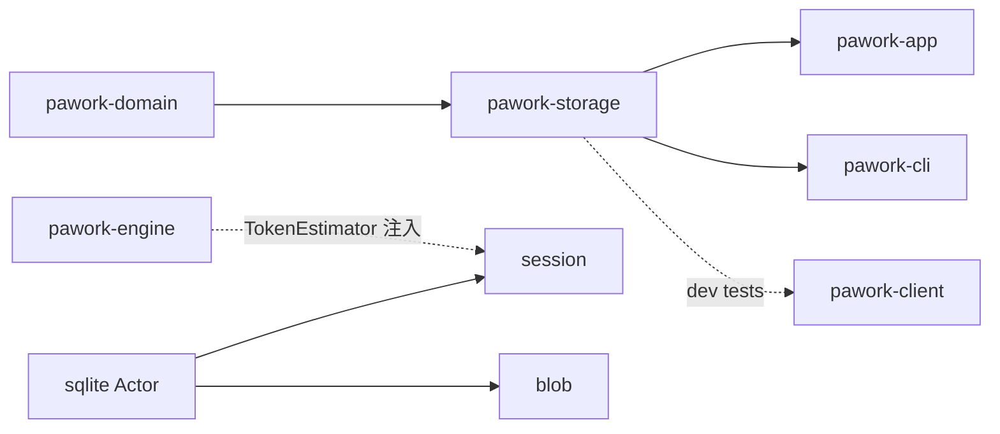

# pawork-storage Review
> 存储层：串行 SQLite Actor、Session Event Store（append-only 账本 + 分支 + 投影 + 幂等账本 + 导入导出 + compaction）与内容寻址 Blob 三区。31 个 `.rs` 文件 / 约 20,005 行（src 19,605 + tests 400）；主模块 `sqlite/`、`session/`、`blob/`。根层无 re-export，调用方必须写全路径（如 `pawork_storage::session::SessionStore`）。

## 1. 职责与边界

三个子系统同 crate 共存，对外是持久化事实层，不是 Agent 循环、Policy 或 Provider：

1. **sqlite/**（常开）：把一个 `rusqlite::Connection` 关进名为 `pawork-sqlite-actor` 的专用 OS 线程，经有界 `tokio::sync::mpsc`（默认容量 128）串行执行所有读写。附带通用命名空间化 migration 框架（独立账本表，不用 `PRAGMA user_version`；升级前 online backup）。
2. **session/**（feature `session`，默认开）：Agent 会话的持久化事实源。`session_events` 是唯一账本；messages / runs / tool_calls / server_tool_events / transcript_envelopes 均为可重建投影。原生支持分支树、export v3 / Pi JSONL / Claude·Codex·Grok·Cursor compat、`CommandLedger` 与 opt-in compaction。
3. **blob/**（feature `blob`，默认开）：BLAKE3 内容寻址 Artifact Store；opt-in `protected`（PWB1 AEAD）与 `checkpoint`（写前快照 / 回滚，不走 git）。

不做的事：不发起网络、不认识具体 Provider、不做 Policy 判断；Secret 脱敏是落盘最后一道防线而非唯一防线。不把裸 `Connection` 交给调用方。compaction 引擎只产出决策与快照，并向 `session_branches` 插入 recovery 行；不向事件流追加 `CompactionStarted` / `CompactionCompleted`，也不删除账本行（物化折叠只发生在投影层）。

磁盘布局是三套互不相干的持久化根：session 是调用方指定的单个 SQLite 文件（迁移备份 `<db>.pre-migration-v<N>.bak` 同目录）；artifact 是 `<root>/blobs/ab/cd/<blake3-hex>` + `artifacts.sqlite3`（checkpoint 的 `checkpoint-state-v1.json` 也落在同一 root）；protected 是 `<root>/protected/ab/cd/<密文 digest>` + `protected.sqlite3`（与 artifact 同样两级分片）。

改动时保持：`session_events` append-only 与 `UNIQUE(session_id, sequence)` 冻结；resume / Timeline / compact 读 lineage 而不是 `events_by_branch`；明文 Token 不得进 DB 与日志。

### Spec 与源码差异（以源码为准）

- Spec 写 Actor 用 `sync_channel(128)`；源码是 `tokio::sync::mpsc::channel`，背压靠 `send().await`，不是 `std::sync::mpsc::sync_channel`。
- Spec 的 `ProjectionSnapshot` 列出 `program_outputs` / `screenshots` / `compacted_through` 顶层字段；源码结构体只有 `messages` / `runs` / `tool_calls` / `server_tool_events` / `transcript_envelopes`。program output 与 screenshot 嵌在 `ProjectedServerToolEvent`；compaction 水位只在读路径内部用于过滤 messages，不暴露给调用方。
- `get_session_identity` Spec 写成必得 `(tenant, principal)`；源码返回 `Option<(TenantId, PrincipalId)>`。
- `SessionStoreError` 仍有 `LeaseHeld` / `LeaseNotHeld` / `SessionHasEvents`，v3 也建了 `session_leases` 表；源码没有 acquire/release/delete session 的公开方法，这三变体是休眠 API。
- Spec 若干行数偏旧（如 `catalog.rs` ~290 vs 实为 544；`projection.rs` ~1590 vs 1643；`persist_pi.rs` ~450 vs 534）。

## 2. 依赖关系

| 方向 | crate | 用途 |
| --- | --- | --- |
| 依赖（session / protected） | pawork-domain | 信封、`SessionId` / `WorkspaceId` / `TenantId`、`Message`、`SessionRegistryStore`、`ProtectedBlobRef`、hint 命名空间 |
| 被依赖 | pawork-app | 宿主装配：`SessionStore`、`ArtifactStore`、`CheckpointService`、`ProtectedBlobStore`、`TokenEstimator` 桥、导入导出 |
| 被依赖 | pawork-cli | `default-features = false, features = ["session"]`：compat 导入、ACP `SqliteClientSessionRegistryStore`、headless |
| 被依赖（dev） | pawork-client | 同样只开 `session`：`tests/contract.rs` / probe harness 的 `SessionStore` 夹具；生产 GUI 连接不依赖本包 |
| 依赖（dev） | pawork-protocol | 仅测试 `adapter` feature |
| 不依赖 | engine / providers / policy / GUI / HTTP | 架构红线：storage 在 domain 之上、engine/app 之下 |

| 外部 crate | 用途 |
| --- | --- |
| rusqlite | 唯一 SQL 引擎；Actor 持有 `Connection`；online backup API |
| tokio（生产 `sync`；session 再开 fs/io-util/macros；checkpoint 再开 fs/io-util/macros/rt） | Actor 命令通道、`oneshot` 回传、导入读文件、checkpoint `spawn_blocking` |
| thiserror | `DatabaseError` / `SessionStoreError` / blob 错误 |
| serde（session / blob）；serde_json（session / checkpoint） | 信封、导出 JSON、checkpoint 状态、retention 策略 |
| blake3（session / blob） | artifact 内容寻址、compat fingerprint、PWB1 物理 digest |
| async-trait（session） | `SqliteClientSessionRegistryStore` 实现 domain trait |
| chacha20poly1305 / getrandom / zeroize（protected） | PWB1 XChaCha20-Poly1305、随机 logical ref、明文清零 |
| tracing（checkpoint） | 重复 snapshot 的 debug 日志 |
| tempfile / proptest / tokio rt-multi-thread（dev） | 夹具与属性测试 |

feature 门：`default = ["session", "blob"]`；`compaction` 依赖 session；`checkpoint` / `protected` 依赖 blob。根 `lib.rs` 按 feature 声明模块，不做类型 re-export。engine 不依赖本包：compaction 的 `TokenEstimator` 由 app 注入。

## 3. 文件清单

| 相对路径 | 行数 | 职责 |
|---|---:|---|
| src/lib.rs | 12 | crate 根：按 feature 声明 sqlite / session / blob；无 re-export |
| src/sqlite/mod.rs | 402 | DatabaseActor、DatabaseOptions、DatabaseError、backup/restore |
| src/sqlite/migration.rs | 654 | 通用命名空间化 migration 框架 |
| src/session/mod.rs | 239 | SessionStore 生命周期、SessionStoreError、子模块 re-export |
| src/session/migration.rs | 1,322 | CURRENT_SCHEMA_VERSION=14 与 v1–v14 DDL；升级 golden |
| src/session/event_store.rs | 2,251 | 建会话/分支、append、replay/tail/events_by_branch、写前脱敏 |
| src/session/projection.rs | 1,643 | apply_projection、ProjectionSnapshot、rebuild、lineage 折叠 |
| src/session/session_tree.rs | 564 | fork_from_event、session_tree、events_on_lineage、祖先链 |
| src/session/catalog.rs | 544 | SessionRecord / WorkspaceRecord 与目录、改名、归档、注册表 |
| src/session/command_ledger.rs | 764 | CommandLedger check/record/release/reclaim；waiting_tool_call |
| src/session/client_adapter.rs | 532 | SqliteClientSessionRegistryStore 实现 domain SessionRegistryStore |
| src/session/test_support.rs | 337 | cfg(test) v12 golden 种子：fork_tree / interleaved / compaction |
| src/session/compaction/mod.rs | 64 | feature 门面：TokenEstimator、CompactionError、re-export |
| src/session/compaction/engine.rs | 756 | CompactionEngine::compact：lineage 到 recovery 分支到快照 |
| src/session/compaction/retention.rs | 719 | RetentionPolicy / apply 纯函数 |
| src/session/compaction/snapshot.rs | 152 | CompactionSnapshot v1 serde 冻结 |
| src/session/import/mod.rs | 15 | 导入门面 re-export formats；声明 persist 层 |
| src/session/import/formats/mod.rs | 14 | formats 门面：compat / export / pi |
| src/session/import/formats/export.rs | 293 | SessionExport v3 JSON 形状与 validate |
| src/session/import/formats/pi.rs | 268 | parse_pi_line 纯函数 |
| src/session/import/formats/compat.rs | 1,967 | Claude/Codex/Grok/Cursor 解析、Secret 扫描、指纹、结构校验 |
| src/session/import/persist_export.rs | 921 | export_session / import_session / add_tags / get_session_identity |
| src/session/import/persist_compat.rs | 900 | import_compat（含 from_file / dry_run）与历史分页 |
| src/session/import/persist_pi.rs | 534 | import_pi_jsonl（含 lines）；Branch marker 折叠为 Diagnostic |
| src/blob/mod.rs | 32 | artifact 常开 re-export；protected / checkpoint 随 feature |
| src/blob/atomic.rs | 47 | crate 私有 atomic_write_bytes（.tmp-pid-counter） |
| src/blob/artifact.rs | 1,223 | ArtifactStore：内容寻址 put/get/read_range/gc/integrity |
| src/blob/protected.rs | 1,429 | ProtectedBlobStore：PWB1 AEAD、三态、reconcile |
| src/blob/checkpoint.rs | 1,007 | CheckpointService：写前快照 / 回滚 / conflict_check |
| tests/pwb1_golden.rs | 166 | PWB1 已知向量（required-features protected） |
| tests/read_range.rs | 234 | read_range 边界（required-features blob） |

非 `.rs`：`src/session/fixtures/v12_*.jsonl` 7 份；`tests/golden/pwb1_valid.hex`。约 171 个 `#[test]` / `#[tokio::test]`。

## 4. 类型与方法功能列表

### 4.1 lib.rs

根层只声明模块：`sqlite` 常开；`session` / `blob` 按 feature。调用方必须写全路径，例如 `pawork_storage::session::SessionStore`。改 re-export 会牵动 app/cli/client 全部 import。

### 4.2 sqlite/

| 名称 | 种类 | 功能 / 语义 |
|---|---|---|
| `DatabaseOptions` | struct | `path` / `read_only` / `create_if_missing` / `queue_capacity`（默认 128）/ `busy_timeout`（默认 5s）。`read_write(path)` 写开并建父目录；`read_only(path)` 不建目录、不改 journal |
| `DatabaseActor` | struct | `Clone` 共享 `mpsc::Sender`。`open` / `open_read_only` / `open_with_options`；`call<T,F>` 唯一执行入口；`path` / `is_read_only`；`backup_to` / `restore_from`；`shutdown` 发 Shutdown 并 join 工作线程 |
| `DatabaseError` | enum | `Sqlite` / `ActorClosed` / `OperationPanicked` / `ResponseTypeMismatch` / `InvalidQueueCapacity` / `BackupTargetsSource` / `ReadOnly` / `Io` |
| `Migration` | struct | `version: u32` / `name: &'static str` / `sql: &'static str`（静态 SQL 批） |
| `MigrationReport` | struct | `from_version` / `to_version` / `applied_versions` / `backup_path: Option<PathBuf>` |
| `MigrationError` | enum | `Database` / `Sqlite` / `UnsupportedSchema { found: u64, supported: u32 }` / `MigrationFailed` / `InvalidSchemaVersion` / `InvalidTableName` / `DuplicateMigrationVersion` / `NonContiguousMigrationVersion` / `MigrationPlanVersionMismatch` |
| `schema_version(actor, table)` | async fn | 账本表不存在返回 0；否则 `MAX(version)` |
| `migrate(actor, table, migrations, current_version, path, existed)` | async fn | 校验计划 → 拒绝降级 → 已存在库 backup → 单事务整批 SQL + 记账 |

私有实现要点：

- 线程名 `pawork-sqlite-actor`；打开 flags 含 `SQLITE_OPEN_NO_MUTEX`（连接只在该线程用）。写模式 `journal_mode=WAL` + `synchronous=NORMAL`；两种模式都 `foreign_keys=ON`、`busy_timeout=5s`。只读不改 journal。
- 命令通道是 `tokio::sync::mpsc::channel`（**不是** Spec 写的 `sync_channel`）。队列满时 `send().await` 背压。`queue_capacity==0` → `InvalidQueueCapacity`。
- `call` 把闭包包进 `catch_unwind`；panic → `OperationPanicked`，Actor 继续活。返回值 `Box<dyn Any>` downcast，类型不对 → `ResponseTypeMismatch`。
- `backup_to` / `restore_from` 走 rusqlite `Backup::run_to_completion(64, 5ms, None)`。目标路径等于源 → `BackupTargetsSource`；只读 restore → `ReadOnly`。
- 无 `Drop` join：最后一次 Clone 丢掉会让 Sender 关闭、工作循环 `blocking_recv` 结束并释放连接，但 `JoinHandle` 不 join。正式路径应 `shutdown()`。
- 账本表白名单：首字符 ASCII 字母或 `_`，其余字母数字或 `_`。计划必须从 version 1 连续、无重复，且末版 **等于** 传入的 `current_version`（0 表示空计划）。备份文件名 `<db文件名>.pre-migration-v<from>.bak`。session 账本表名是 **`schema_migrations`**，不是 Spec 举例的 `session_schema_migrations`。
- Artifact / Protected **不走** 这套框架，各自 `CREATE TABLE IF NOT EXISTS`。

改动注意：通道类型、backup page size、账本表名、计划连续性都是 session migrate 的契约。长事务会堵住同一 Actor 上所有 `call`（含读）。

### 4.3 session 门面（mod.rs）

| 名称 | 种类 | 功能 / 语义 |
|---|---|---|
| `SessionStore` | struct | 持有 `DatabaseActor` + 路径。`open`：写开 → migrate 到 v14 → **`reclaim_inflight`**，返回 `(Self, MigrationReport)`。`open_read_only`：版本必须 **恰好等于** 14，否则 `UnsupportedSchema`；不 reclaim。`database` / `path` / `schema_version` / `shutdown` |
| `SessionStoreError` | enum | `Database` / `Sqlite` / `Ledger` / `UnsupportedSchema` / `ExportSchemaVersion` / `ExportIdentityMissing` / `ExportIdentityMismatch` / `EventSessionMismatch` / `InvalidSchemaVersion` / `MigrationFailed` / `Serialization` / `Io` / `SessionNotFound` / `WorkspaceRegistryInvariant` / `BranchNotFound` / `BranchAlreadyExists` / `ForkPointNotTurnBoundary` / `BranchNotActive` / `SessionHasEvents` / `LeaseHeld` / `LeaseNotHeld` / `NonContiguousSequence` / `SequenceOverflow` / `ParentEventNotFound` / `ProjectionInvariant` / `CompatUnparseable` / `CompatSecretDetected` / `CompatValidationFailed` / `CompatImportConflict` / `InvalidHistoryCursor` / `InvalidHistorySource` |
| `CURRENT_SCHEMA_VERSION` | const | `14`，re-export 自 migration |
| `DEFAULT_BRANCH_ID` | const | `"main"` |
| `MigrationReport` | re-export | sqlite 迁移报告 |

`LeaseHeld` / `LeaseNotHeld` / `SessionHasEvents` **没有**公开 acquire/release/delete 触发路径，是休眠 API。`From<MigrationError>` 把框架错误映射进本枚举。
### 4.4 session/migration.rs

| 名称 | 种类 | 功能 / 语义 |
|---|---|---|
| `CURRENT_SCHEMA_VERSION` | const | 14 |
| `MIGRATIONS` | pub(crate) const | 14 条 `Migration` 数组，append-only |
| `migrate(actor, path, existed)` | pub(crate) async fn | 调 sqlite 框架，账本表 `"schema_migrations"` |
| `schema_version(actor)` | pub(crate) async fn | 读 session 账本 |

迁移链（DDL 文本 v1–v12 冻结，演进只追加）：

| v | name | 做什么 |
|---|---|---|
| 1 | `core_session_schema` | sessions / session_branches / session_events（`UNIQUE(session_id, sequence)`、`CHECK(sequence>0)`）+ messages / runs / tool_calls |
| 2 | `event_store_immutability` | 触发器 `session_events_no_update` / `session_events_no_delete`，`RAISE(ABORT)` |
| 3 | `branch_active_and_session_leases` | `sessions.active_branch` + 分支序索引 + **休眠** `session_leases` |
| 4 | `session_tags_and_search` | `session_tags` |
| 5 | `server_tool_events_and_transcript_envelopes` | server_tool + transcript 投影表 |
| 6 | `compat_import_identity` | `(source, original_id)` 主键 + fingerprint + session_id |
| 7 | `client_adapter_session_registry` | `client_adapter_sessions` |
| 8 | `session_identity_tenant_backfill` | tenant/principal 列，回填 `local/default` + `local/user` |
| 9 | `session_binding_affinity` | `session_bindings` / `session_binding_events` **归档留表无读写** |
| 10 | `messages_branch_projection` | messages 加 `branch_id DEFAULT 'main'` 并按事件回填 |
| 11 | `command_ledger` | PK `(tenant, scope, command_id)`；idempotency_key 部分唯一索引 |
| 12 | `messages_branch_projection_rebuild` | 整表重建去掉 DEFAULT；孤儿行 TEMP 触发器 fail-closed |
| 13 | `session_workspace_binding` | `sessions.workspace_id TEXT` 可空弱引用，不回填 |
| 14 | `persistent_workspace_registry` | `workspaces`，`root_path UNIQUE` |

v1 `session_events` 另有 `event_id` PK、`parent_event_id` 自引用、`FOREIGN KEY(session_id, branch_id)` ON DELETE RESTRICT。v12 用 TEMP 表 `v12_orphan_check` + BEFORE INSERT 触发器：投影行找不到对应 `session_events` 即整批 ABORT。改已落地 SQL 字符串会破坏升级 golden。

### 4.5 event_store.rs

| 名称 | 种类 | 功能 / 语义 |
|---|---|---|
| `AppendReceipt` | struct | `event_id` / `sequence` / `branch_id` |
| `set_session_workspace(session, workspace)` | async fn | ADR-043：UPDATE 归属列；弱引用不校验登记；0 行 → `SessionNotFound` |
| `create_session(id, title, ts)` | async fn | legacy：身份固定 `local/default` / `local/user` |
| `create_session_with_workspace(...)` | async fn | 同上身份 + 同事务写 workspace_id |
| `create_session_with_identity(..., tenant, principal)` | async fn | 生产入口；空身份 → `ProjectionInvariant` |
| `create_branch(session, branch, parent, forked_from)` | async fn | 同 (branch, parent, fork point) 幂等成功；参数不同 → `BranchAlreadyExists`；fork 点事件缺失 → `ParentEventNotFound`；无 fork 点时 `head_sequence=0` |
| `switch_branch(session, branch)` | async fn | 改 `sessions.active_branch`（全局写指针）；注释写「本波 UX 不暴露」 |
| `append_event(branch, envelope)` | async fn | 必须写 **active** 分支否则 `BranchNotActive`；sequence = 全 session `MAX+1` 否则 `NonContiguousSequence`；parent 必须同 session 已存在 |
| `replay_events(session, from, limit)` | async fn | 全 session、按全局 sequence 升序；`limit==0` 空集 |
| `tail_events(session, limit)` | async fn | 先 DESC 再 reverse 成升序 |
| `events_by_branch(session, branch, from, limit)` | async fn | **仅本支、不含祖先，不能当 resume**；不存在的 session/branch 返回空 |

私有 / crate 内：

- `persist_event_in_transaction`：脱敏 → INSERT `session_events` → `apply_projection` → 更新 `head_sequence` + `sessions.updated_at_ms`。导入路径复用。调用方负责事务与结构性校验。
- `redact_event_for_persistence`：先 `canonicalize_legacy_hint_keys`，再 `redact_sensitive_json`。占位符 `"[REDACTED]"`。reasoning 的 `opaque_metadata` / `continuation_metadata` 走 `sanitize_reasoning_metadata`（`provider_hints.<provider>.<key>` 白名单 + `MAX_HINT_VALUE_BYTES` + summary_entries / block_kind 形状）。敏感键按去掉非字母数字后的小写匹配 token/secret/authorization/encryptedcontent/signature/reasoningcontent/continuationbytes 等；`headers` / `requestheaders` / `responseheaders` 整容器保形脱敏。`tokenusage` / `tokencount` / `tokenbudget` 等计数键放行。
- `decode_persisted_event` / `decode_persisted_json`：快路径必须匹配带引号的完整旧键 `"responses.summary_entries"` / `"openai.responses.summary_entries"` / `"anthropic_block_kind"`，否则直接 `from_str`，避免规范键误伤。投影行也必须走这里。
- `event_type()` 把 `AgentEvent` 变成冻结字符串（`run_completed` 等）；fork 边界靠这些字面量，改名即破坏 `fork_from_event`。

sequence 是 **session 全局** 单调。切回旧分支 append 合法，分支内 sequence 可有洞。create_session 必须显式写 `active_branch='main'`，不再依赖 v3 DDL DEFAULT（v12 起写入路径不再靠默认值）。
### 4.6 projection.rs

| 名称 | 种类 | 功能 / 语义 |
|---|---|---|
| `ProjectedRun` | struct | `run_id` / `state` / `data: Value` |
| `ProjectedToolCall` | struct | `tool_call_id` / `run_id` / `name` / `state` / `arguments_json` / `result` |
| `ProjectedServerToolEvent` | struct | 上列 + `command` / `citations` / `sources` / **`screenshots`** / **`outputs`** / `result` / `error` |
| `ProjectedProgramOutput` | struct | `stream: ProgramStream` / `delta` / `artifact`（serde） |
| `ProjectedScreenshot` | struct | `artifact: ArtifactId` / 可选 `media_type` |
| `ProjectedTranscriptEnvelope` | struct | `run_id` / `sequence` / `envelope` |
| `ProjectionSnapshot` | struct | **只有** `messages` / `runs` / `tool_calls` / `server_tool_events` / `transcript_envelopes`。无顶层 `program_outputs` / `screenshots` / `compacted_through` |
| `projection_snapshot(session)` | async fn | 按 **active** 分支 lineage 滤 messages |
| `projection_snapshot_on_branch(session, branch)` | async fn | 指定分支 |
| `rebuild_projection(session)` | async fn | 单事务清空五张投影表后按账本重放 `apply_projection`，再 `load_snapshot`（active） |

`apply_projection`（pub(crate)）按 payload 维护物化表：`RunStarted` INSERT running；`MessageCommitted` INSERT messages（带 `branch_id`）；工具生命周期改 `tool_calls.state`（`collecting_arguments` / `waiting_for_approval` / `approval_*` / `executing` / `completed`，arguments 用 `||` 拼接 delta）；`CompactionCompleted` **仍** `DELETE FROM messages WHERE branch_id=本支 AND sequence<=through`（v12 冻结），但读路径不依赖该表。未知 tool/run 的 UPDATE 0 行 → `ProjectionInvariant`。其余事件类型（delta、diagnostic、plan 等）投影层忽略。

`load_snapshot`：messages 从 `session_events` 中 `event_type='message_committed'` 按 lineage + `sequence > compacted_through` 重建。`lineage_compacted_through` 取该 lineage **可见** 的最大 `CompactionCompleted.compacted_through`（不可见的父支/兄弟压缩不折叠本视图）。runs / tool_calls / server_tool_events / transcript_envelopes **全 session**，不按分支过滤。

### 4.7 session_tree.rs

| 名称 | 种类 | 功能 / 语义 |
|---|---|---|
| `BranchNode` | struct | `branch_id` / `parent_branch_id` / `forked_from_event_id` / `head_sequence` / `active` |
| `SessionTree` | struct | `branches: Vec<BranchNode>`（扁平；调用方按 parent 拼树） |
| `fork_from_event(session, new_branch, from_event)` | async fn | 反查事件所属 branch + `event_type`；仅 `run_completed` / `run_cancelled` / `run_failed` / `compaction_completed`；然后委托 `create_branch` |
| `session_tree(session)` | async fn | JOIN branches+sessions，按 `branch_id` 排序；空 → `SessionNotFound` |
| `events_on_lineage(session, branch, from, limit)` | async fn | **resume / Timeline / compact 唯一正确入口**；`limit==0` 空集 |

`load_ancestor_lineage`：本支 `max_sequence = i64::MAX`（`LINEAGE_UNBOUNDED`）；祖先含 fork 点 sequence。环 → `ProjectionInvariant("branch lineage cycle at ...")`。`visible_on_lineage` 判断事件是否落在某 bound 内。SQL 先按 session 全量取出再内存过滤。

### 4.8 catalog.rs

| 名称 | 种类 | 功能 / 语义 |
|---|---|---|
| `SessionRecord` | struct | `session_id` / `title` / `created_at_ms` / `updated_at_ms` / `archived` / `active_branch` / `workspace_id: Option<String>` |
| `WorkspaceRecord` | struct | `workspace_id: WorkspaceId` / `name` / `root_path` / 时间戳 |
| `register_workspace(id, name, root, now_ms)` | async fn | Immediate 事务；同 root 幂等返回原记录（name 不更新）；同 id 不同 root → `WorkspaceRegistryInvariant` |
| `list_workspaces()` | async fn | `ORDER BY created_at_ms, workspace_id` |
| `list_session_workspace_bindings()` | async fn | 全部非 NULL 归属（含 archived） |
| `list_sessions()` | async fn | `archived=0`，`updated_at_ms DESC` |
| `get_session(id)` | async fn | 含归档；缺失 → `SessionNotFound` |
| `rename_session(id, title, now_ms)` | async fn | 同时刷新 `updated_at_ms` |
| `rename_session_if_title(id, expected, title, now_ms) -> bool` | async fn | 条件 UPDATE；不匹配 false；行不存在才报错。自动命名防覆盖用户改名 |
| `archive_session(id, archived, now_ms)` | async fn | 只改标记，不删事件 |

无 `delete_session`。归档会话仍可用 `get_session` 读。

### 4.9 command_ledger.rs

| 名称 | 种类 | 功能 / 语义 |
|---|---|---|
| `DEFAULT_COMMAND_LEDGER_CAPACITY` | const | 4096 |
| `LedgerCheck` | enum | `New` / `Replay(String)` / `InFlight` |
| `LedgerStats` | struct | `entries` / `inflight` / `completed` |
| `LedgerError` | enum | `DuplicateCommand` / `KeyConflict { key, existing }` / `Database` / `Sqlite` |
| `CommandLedger` | struct | `new(actor)`；`check` / `record(..., capacity)` / `release` / `reclaim_inflight -> u64` / `stats` |
| `WaitingToolCall` | struct | `session_id` / `tool_call: ProjectedToolCall` |
| `SessionStore::command_ledger()` | fn | 共享同一 Actor 的轻量句柄 |
| `waiting_tool_call(id)` / `waiting_tool_calls()` | async fn | 查 `tool_calls.state='waiting_for_approval'` |

`check_and_reserve`：先按 command_id，再按 idempotency_key；都没有则 INSERT inflight。唯一冲突时重查分类。**同 key 绑到另一 command_id 时 `check` 返回对方的 Replay/InFlight，不报 `KeyConflict`**（`KeyConflict` 只在 `record`）。`record` 对已 completed → `DuplicateCommand`；inflight 行不存在时允许直接 INSERT completed。成功后 `evict_completed` **全局**（跨 tenant/scope）按 `completed_at_ms, created_at_ms` 升序删最老。`release` 只删 inflight。`reclaim_inflight` 无条件 `DELETE ... status='inflight'`，单宿主假设；只读 open 不跑。
### 4.10 client_adapter.rs

| 名称 | 种类 | 功能 / 语义 |
|---|---|---|
| `SqliteClientSessionRegistryStore` | struct | 包装 `SessionStore`；`new` / `session_store()` |
| `SessionRegistryStore` impl | trait impl | domain 乐观并发注册表 |

trait 方法：

- `load_all()`：读 `client_adapter_sessions` 全表，按 `client_session_id` 排序。
- `insert(record)`：`INSERT ... ON CONFLICT DO NOTHING`；1 行 → `Applied`，否则读回现有行 `Conflict(Some(record))`。
- `compare_and_swap(expected_epoch, expected_revision, record)`：WHERE 匹配 epoch+revision 才 UPDATE。
- `remove_if_owner(id, epoch, revision)`：条件 DELETE。

`state` / `capabilities` 以 JSON 文本存。整数越界（u64→i64）→ `SessionRegistryError::Unavailable`。Actor 关闭同样映射为 Unavailable。改列名会破坏 v7 迁移契约。

### 4.11 compaction/（feature `compaction`）

#### compaction/mod.rs

| 名称 | 种类 | 功能 / 语义 |
|---|---|---|
| `TokenEstimator` | trait | `count_text(&str) -> u64`；`count_message(&Message) -> u64`。必须 `Send+Sync`、无 IO、确定性。由 app/engine 注入，本 crate 无默认实现 |
| `CompactionError` | enum | `Store(SessionStoreError)` / `NothingToCompact { session_id, branch_id }` / `UnsupportedSnapshotVersion { found, supported }` |

#### compaction/engine.rs

| 名称 | 种类 | 功能 / 语义 |
|---|---|---|
| `CompactionReason` | enum | `Manual` / `HistorySoftLimit` / `InputBudgetExceeded`；Display 为 snake_case |
| `CompactionResult` | struct | `reason` / `snapshot` / `decision` / `total_events` |
| `CompactionEngine<'a>` | struct | 持有 `&SessionStore` + `RetentionPolicy` + `Arc<dyn TokenEstimator>`。`new` / `with_policy` / `policy()` / `compact(...)` |

`compact(session, branch, reason, summary_text, inputs)`：`events_on_lineage` 从 sequence 1 读到头；空流 → `NothingToCompact`。recovery 分支 id = `compaction-recovery-{branch}-{last_seq}`，`create_branch`（幂等，同 head 重试复用）。只把 lineage 上的 event_id 送进 retention（`filter_retention_inputs`）。token：消息若带 usage metadata 优先用实测，否则走注入估算器；after = 保留消息 + `count_text(summary)`。**不 append 任何事件、不删账本**。

#### compaction/retention.rs

| 名称 | 种类 | 功能 / 语义 |
|---|---|---|
| `DEFAULT_RETAINED_TURNS` | const | 6 |
| `DEFAULT_RETAINED_REASONING_ITEMS` | const | 8 |
| `RetentionMessage` | struct | `event_id` + `message` |
| `RetentionReasoning` | struct | `event_id` + `reasoning_item_id`（不带 ProtectedBlobRef） |
| `ToolCallRetentionState` | enum | `Pending` / `Completed` / `Failed`（serde snake_case） |
| `RetentionToolCall` | struct | `event_id` + `state` |
| `RetentionTask` | struct | `event_id` + `resolved` |
| `RetentionConstraint` | struct | `event_id` |
| `ModifiedFile` | struct | `event_id` + `path` |
| `RetentionInputs` | struct | 上述向量集合 |
| `RetentionPolicy` | struct | `retained_turns` / `retained_reasoning_items` / 五个 `keep_*` bool；`#[serde(default)]` 兼容缺字段 JSON |
| `RetentionDecision` | struct | `retained_event_ids`（去重、按 EventId 字典序）/ `dropped_count` / `reasons` |
| `apply(policy, inputs)` | fn | 纯函数，无 IO |

默认 keep 全部 true。turn 按用户消息切分，保留末 N 轮。reasoning 按输入顺序取末 N 条，即使该 turn 被丢掉也会保住 reasoning 事件。N=0 关闭对应保留。决策不碰 blob refcount。

#### compaction/snapshot.rs

| 名称 | 种类 | 功能 / 语义 |
|---|---|---|
| `CURRENT_SNAPSHOT_VERSION` | const | 1 |
| `SnapshotVersion` | newtype | transparent u32；`new` / `current` / `value` |
| `CompactionSnapshot` | struct | `version` / `summary` / `retained_event_ids` / `replaced_range: (EventSequence, EventSequence)` / `token_usage_before` / `token_usage_after` / `recovery_branch_id: Option<String>`（None 时 skip serialize） |
| `validate()` | method | 非 v1 → `UnsupportedSnapshotVersion` |

serde 形状冻结：`replaced_range` 是 `[1, 6]` 数组，`version` 是裸数字。
### 4.12 import/

`import/mod.rs` / `formats/mod.rs` 只做 re-export。解析纯函数在 formats，写入在 persist_*。

#### formats/export.rs

| 名称 | 种类 | 功能 / 语义 |
|---|---|---|
| `EXPORT_SCHEMA_VERSION` | const | 3 |
| `ExportedBranch` | struct | `branch_id` / `parent_branch_id` / `forked_from_event_id` / `head_sequence` |
| `ExportedEvent` | struct | `branch_id` + `event: AgentEventEnvelope`；v1 无 branch 时 Deserialize 降级 `main` |
| `SessionExport` | struct | `schema_version` / `session_id` / `tenant_id` / `principal_id` / `title` / 时间戳 / `archived` / `active_branch` / `branches` / `events` / `tags`。v1/v2 身份缺省回填 `local/default` + `local/user` |
| `to_json` / `from_json` / `validate` | method | 版本必须在 1..=3；身份空白 → `ExportIdentityMissing` |

写只出 v3。`command_ledger` / `compat_import_identity` 不进 export。

#### formats/pi.rs

| 名称 | 种类 | 功能 / 语义 |
|---|---|---|
| `PiEntryKind` | enum | `Header` / `Message` / `ToolCall` / `ModelSwitch` / `Compaction` / `Branch` / `Custom` / `Unknown` |
| `PiPayload` | enum | 对应结构化载荷；无法识别为 `Raw` |
| `PiParsedEntry` | struct | `kind` / `unknown_fields` / `payload` |
| `PiImportReport` | struct | 行数、header、各类 imported_* 计数、`unknown_entries`。`imported_branches` 是折叠为 Diagnostic 的 marker 数，不建 branch 行 |
| `parse_pi_line(raw)` | fn | 空行 None；宽松识别（含 session_id 当 header 等） |

#### formats/compat.rs

| 名称 | 种类 | 功能 / 语义 |
|---|---|---|
| `ExternalSource` | enum | `Claude` / `Codex` / `Grok` / `Cursor`；`as_str()` → claude/codex/grok/cursor |
| `ExternalRecord` | enum | `UserMessage` / `AssistantMessage` / `ToolCall` / `ToolResult` / `Usage` / `ReviewComment { file, line, severity, body }` / `Raw` |
| `ParsedExternalSession` | struct | `source` / `original_id` / `title` / `records` / `unknown_fields` |
| `find_secret(text)` | fn | 前缀表：`sk-ant-` / `sk-proj-` / `sk-` / `AKIA` / `ghp_` / `gho_` / `ghs_` / `github_pat_` / `xoxb-` / `xoxp-` / `xoxa-` / `xoxe-` / `AIza`，外加 `Bearer ` + ≥20 token。**无 PEM 私钥块扫描**（Spec 写了 PEM，源码没有） |
| `parse_external` / `parse_claude` / `parse_codex` / `parse_grok` / `parse_cursor` | fn | Claude：claude.ai JSON 数组 **或** Claude Code JSONL；Codex：flat JSONL **或** `{timestamp,type,payload}` envelope。失败 → `CompatUnparseable` |
| `derive_compat_session_id` / `effective_identity` / `content_fingerprint` | fn | 来源前缀 + 身份/BLAKE3 指纹 |
| `validate_structure(events)` | fn | 空批、id 重复、引用悬空 → `CompatValidationFailed` |
| `CompatImportReport` | struct | 来源、session_id、计数、`deduplicated`、unknown_fields |
| `CompatImportHistoryEntry` / `CompatImportHistoryPage` | struct | 历史行 + 可选 cursor |

#### persist_export.rs

| 名称 | 种类 | 功能 / 语义 |
|---|---|---|
| `add_tags(session, tags)` | async fn | trim+小写，`INSERT OR IGNORE` |
| `get_session_identity(session)` | async fn | 返回 `Option<(TenantId, PrincipalId)>`（**不是** Spec 的必得元组） |
| `export_session(session)` | async fn | 单次 Actor 调用读齐 session/分支/事件/标签，写死 schema_version=3 |
| `import_session(export, tenant, principal)` | async fn | validate → 身份必须匹配 → envelope.session_id 预检 → Immediate 事务重放 |

导入：建 session+main → 按全局 sequence 插入，途中遇到某分支首事件先建分支行 → 复用 `persist_event_in_transaction` → 尾部补零事件分支 → 校验 active_branch → 恢复 archived/tags。Pawork 往返**不**扫 Secret。workspace_id 不进 export。

#### persist_compat.rs

| 名称 | 种类 | 功能 / 语义 |
|---|---|---|
| `import_compat(source, content)` | async fn | Secret 预扫 → 解析 → Immediate 事务：identity 查重、建 session、写事件、登记 fingerprint |
| `import_compat_from_file(source, path)` | async fn | **不改原文件**。注释写「JSONL 流式」，实现仍是 `read_to_string` 一次性入内存 |
| `import_compat_dry_run(...)` | async fn | 同样扫描/解析/校验，零持久化，`deduplicated=false` |
| `compat_import_history(limit, cursor)` | async fn | 默认 50、上限 500；游标 `"{updated_at_ms}:{session_id}"`；未知 source label → `InvalidHistorySource` |

`(source, original_id)` 同指纹幂等返回原 session（`deduplicated=true`）；异指纹 → `CompatImportConflict`。无 original_id 时用 content fingerprint 当身份。导入身份固定 `local/default` / `local/user`，落 `main`。映射层合成 `RunStarted`/`RunCompleted` 边界。

#### persist_pi.rs

| 名称 | 种类 | 功能 / 语义 |
|---|---|---|
| `import_pi_jsonl(path)` | async fn | 读文件后转 `import_pi_jsonl_lines`；不改原文件 |
| `import_pi_jsonl_lines(content)` | async fn | Secret 预扫（复用 `find_secret`，错误类型也是 `CompatSecretDetected`）；缺 header → `ProjectionInvariant` |

落库身份 `local/default` / `local/user`。Branch marker → `pi.branch_collapsed` Diagnostic，不建分支行。ModelSwitch → `pi.model_switched`。Compaction 先插 summary `MessageCommitted` 再 `CompactionCompleted`。

### 4.13 test_support.rs（cfg(test)）

`SeedStep::{Append, Fork, Switch}` + `SeedScenario`。三个种子：`v12_fork_tree` / `v12_interleaved` / `v12_compaction`。经真实 `persist_event_in_transaction` 落库，禁止手写 payload 字节。供 migration golden 复现 v10/v11 库形态。
### 4.14 blob/mod.rs 与 atomic.rs

`blob/mod.rs` re-export artifact 常开类型；`protected` / `checkpoint` 随 feature。protected 同时 re-export domain 的 `ProtectedBlobRef` / `ProviderId` / `SessionId`。

| 名称 | 种类 | 功能 / 语义 |
|---|---|---|
| `atomic_write_bytes(path, content)` | pub(crate) fn | 确保父目录；同目录 `.tmp-{pid}-{counter}`、`create_new`、`write_all`+`sync_all`+`rename`；失败删临时。artifact / protected / checkpoint **唯一**落盘路径。`.tmp-` 前缀与 artifact GC 24h 孤儿约定对齐 |

### 4.15 artifact.rs

| 名称 | 种类 | 功能 / 语义 |
|---|---|---|
| `BlobId` | newtype | BLAKE3 64 位小写 hex；`from_hash` / `as_str` / `to_hash` / `FromStr` / serde 字符串 |
| `ArtifactStoreOptions` | struct | `root` / `disk_budget: Option<u64>` |
| `PutOutcome` | struct | `id` / `created` / `ref_count` |
| `BlobMetadata` | struct | `id` / `size` / `ref_count` / `created_at_ms` / `last_accessed_at_ms` |
| `GcReport` | struct | `deleted` / `reclaimed_bytes` / `deleted_tmp_orphans` / `deleted_final_orphans` |
| `IntegrityReport` | struct | `checked` / `missing` / `corrupted` / `orphans`；`is_ok()` |
| `ArtifactStore` | struct | `open` / `open_with_options`：建 `blobs/` + `artifacts.sqlite3`，`CREATE TABLE IF NOT EXISTS`（`SCHEMA_VERSION=1`，不走 migration 框架）。只读句柄 `root` / `disk_budget` / `database` / `blob_path` |
| `put(content)` | async fn | 去重：已有且哈希健康则 ref++；损坏则重写文件修复。新写入先预算检查再原子写 `<root>/blobs/ab/cd/<64hex>` |
| `get(id)` | async fn | 读全文件并重算 BLAKE3；缺失/损坏分类错误 |
| `read_range(id, offset, limit)` | async fn | `limit==0` → `EmptyRange`；`offset>size` 越界；`offset==size` 空 Vec（合法 EOF）；读前仍全文件校验哈希 |
| `byte_length` / `metadata` / `disk_usage` | async fn | 元数据 |
| `release(id)` | async fn | ref 已 0 → `RefCountUnderflow`，绝不减成负数 |
| `integrity_check()` | async fn | 对账 DB vs 磁盘 |
| `gc()` | async fn | 零引用删文件+行；mtime>24h 的 `.tmp-`；mtime>24h、哈希与文件名一致且无 DB 行的 final 孤儿 |
| `shutdown` | async fn | 关 Actor |
| `ArtifactStoreError` | enum | `Database` / `Sqlite` / `Io { source, path }` / `InvalidBlobId` / `UnknownBlob` / `RefCountUnderflow` / `BlobMissing` / `EmptyRange` / `RangeOffsetOutOfBounds` / `BlobCorrupted` / `DiskBudgetExceeded` / `InvalidStoredValue` |

引用只在 `put` 增、`release` 减，物理删除只发生在 `gc`。每个 root 假定单宿主。

### 4.16 protected.rs（feature `protected`）

| 名称 | 种类 | 功能 / 语义 |
|---|---|---|
| `PWB1_MAGIC` / `PWB1_VERSION` / `PWB1_ALGORITHM` / `PWB1_NONCE_LEN` / `PWB1_HEADER_LEN` | const | `b"PWB1"` / 1 / 1（XChaCha20-Poly1305）/ 24 / 34 |
| `KeyVersion` | type alias | `u32` |
| `BlobScope` | struct | `provider_id` + `session_id`；字段私有，`new` / getters |
| `AeadKey` | struct | 32 字节 `Zeroizing`；Debug 输出 `AeadKey([REDACTED])` |
| `KeyResolutionError` | struct | Display `protected key unavailable` |
| `ProtectedKeyResolver` | trait | `current_version(scope)` / `resolve(scope, version)` |
| `InMemoryKeyResolver` | struct | 测试用；`insert` / `set_current` / `remove`；Debug 红acted |
| `ProtectedBlob` | struct | 明文 `Zeroizing<Vec<u8>>`；`expose` / `AsRef`；Debug 红acted |
| `ProtectedBlobError` | enum | `Database` / `Sqlite` / `Io { path, kind }` / `ProtectedBlobUnavailable { blob_ref }` / `ProtectedBlobCorrupted { blob_ref }` / `RefCountUnderflow` / `DiskBudgetExceeded`。`is_unavailable` / `is_corrupted` |
| `ProtectedBlobStoreOptions` | struct | `root` / `retention` 默认 7 天 / `disk_budget` |
| `PutOutcome` | struct | `blob_ref` / `key_version` / `ref_count` / `plaintext_size`（与 artifact 的 PutOutcome **同名不同 crate 路径**） |
| `ProtectedBlobMetadata` | struct | ref / scope / physical_digest / key_version / 大小 / ref_count / `retain_until_ms` |
| `GcReport` | struct | `deleted` / `reclaimed_bytes`（无 tmp 字段） |
| `ProtectedBlobStore` | struct | `open(root, resolver)` / `open_with_options` 后立刻 `reconcile_incomplete_operations`；`root()` 只读 |
| `put(scope, plaintext)` | async fn | 随机 logical ref `pblob_{blake3}`；INSERT pending（预算含 pending/deleting）→ 原子写密文 → UPDATE ready。写文件失败删 pending 行 |
| `get(scope, ref)` | async fn | 只查该 scope 的 ready 行（跨 scope = Unavailable，防探测）→ digest 校验 → 信封 key_version 对齐 → AEAD open |
| `metadata` / `retain` / `release` / `gc` / `shutdown` | async fn | `retain` 清 `retain_until_ms` 并可救回延迟回收窗口；`release` 归零后写 `now+retention`；gc 先标 deleting 再删文件删行 |
| `parse_pwb1_envelope` / `open_pwb1_envelope` / `pwb1_aad` | fn | 纯函数；坏 magic/version/alg → Corrupted |

信封：`PWB1`(4) + ver(1) + alg(1) + key_version BE u32 + nonce 24B + ciphertext。AAD：`pawork.protected-blob.v1\0` + 长度前缀 provider/session/ref + key_version BE。物理路径 `<root>/protected/ab/cd/<密文digest>`（与 artifact 同样两级分片）。open 时 reconcile：pending/deleting 行 + 无主密文一律删除。缺密钥、跨 scope、缺文件统一 `ProtectedBlobUnavailable`。老表无 `state` 列时 `ensure_state_column` 升级。

### 4.17 checkpoint.rs（feature `checkpoint`）

| 名称 | 种类 | 功能 / 语义 |
|---|---|---|
| `FileSnapshot` | struct | `relative_path` / `existed` / `pre_blob: Option<BlobId>` / `pre_hash` / `unix_mode`。不存在的新文件 pre_* 为 None |
| `ChangeRecord` | struct | `tool_call_id` + `files` |
| `RunCheckpoint` | struct | `run_id` / `created_at_ms` / `head: Option<String>` / `changes` |
| `ConflictReport` | struct | `relative_path` / `user_modified` |
| `CheckpointError` | enum | `NotFound` / `Io { context, source }` / `Store` / `PathEscape` / `UnresolvedPath` / `InvalidRelativePath` / `InvalidState` / `Json` |
| `CheckpointService` | struct | `new`（空状态，测试用）/ `open` 读 `checkpoint-state-v1.json`（schema_version 必须=1，否则 fail-closed） |
| `snapshot_run(run_id)` | async fn | 幂等确保 run 条目，`head=None` |
| `snapshot_before_write(run, tool, roots, relative_path)` | async fn | 同 key 已有快照直接复用；否则读文件 `put` 进 ArtifactStore；并发重复则 `release` 多余引用 |
| `rollback_tool_call` / `rollback_run` | async fn | 逆序恢复：有 pre 则原子写回（unix mode），`existed=false` 则删新文件。run 按 tool_call 逆序 |
| `conflict_check` | async fn | 重算 BLAKE3 vs `pre_hash`；不阻止回滚 |
| `list_changes(run_id)` | fn | 同步克隆；锁是 `std::sync::Mutex`，从不跨 `.await` 持锁 |

路径：拒绝 `..` 与绝对路径；`roots` 逐个 join+canonicalize，必须落在某 root 内。状态经 `atomic_write_bytes`（`spawn_blocking`）原子持久化。`persist_lock` 是 tokio Mutex 串行写盘。**绝不 `git reset --hard`**。同 `tool_call_id` 在不同 run 下隔离。
## 5. 关键行为与契约

**版本互相独立**：domain 信封 `schema_version=1`、session SQLite `CURRENT_SCHEMA_VERSION=14`、export `schema_version=3`、artifact/protected/checkpoint 各自 schema=1、PWB1 version=1、CompactionSnapshot v1。升级互不牵连。

**`session_events` 冻结**：v1 DDL 的 `UNIQUE(session_id, sequence)` + `CHECK(sequence>0)` 不可改；v2 双触发器禁止 UPDATE/DELETE。compaction 只折叠投影，不删账本。sequence 是 session 全局单调连续，跨分支不复用编号。

**迁移史 append-only**：`MIGRATIONS` v1–v12 SQL 文本不可改写。v12 去掉 messages `DEFAULT 'main'` 并孤儿 fail-closed；v13 弱引用 `workspace_id` 不回填；v14 `workspaces.root_path UNIQUE` 空表不猜 root。账本表名 `schema_migrations`。已存在库升级前 `<db>.pre-migration-v<from>.bak`。

**append / 分支**：`append_event` 只允许 active 分支。fork 仅四类闭合事件。`create_branch` 同三元组幂等；同名换 fork 点仍 `BranchAlreadyExists`。`switch_branch` 是全局写指针。resume / Timeline / compact 必须 `events_on_lineage`，禁止把 `events_by_branch` 当恢复源。

**投影读路径**：messages 从事件账本按 lineage + compaction 水位重建；物化 messages 表在 `CompactionCompleted` 时仍按本支 DELETE（v12 冻结），但 snapshot 不读该表。runs/tool_calls/server_tool/transcript 全 session。`ProjectionSnapshot` 无顶层 `compacted_through`。

**脱敏**：落盘前 `redact_sensitive_json`；reasoning metadata 走 provider_hints 命名空间。legacy hint 键只读映射、写永不产出。明文 Token 不进 DB/日志。compat/Pi 导入另做 `find_secret` fail-closed（无 PEM）。export 往返不扫 Secret。

**CommandLedger**：键 `(tenant, client_scope, command_id)`；可选 idempotency_key 部分唯一。容量 4096 **全局**淘汰 completed。`open` 写模式 reclaim 全部 inflight（单宿主）。`check` 对 key 冲突不报 `KeyConflict`，只在 `record` 报。

**import/export v3**：写只出 v3；读兼容 v1/v2（身份回填 legacy，v1 事件归 main）。导入身份必须显式匹配，envelope.session_id 预检。Immediate 事务，失败无半导入。Pi/compat 固定 local 身份与 main；Pi Branch → `pi.branch_collapsed`。compat `(source, original_id)` 同指纹幂等、异指纹冲突。

**PWB1**：header 34 字节；AAD 绑定 scope/ref/key_version。三态 pending→ready；open reconcile 清非 ready 与孤儿密文。跨 scope/缺密钥统一 Unavailable。logical ref 稳定，物理文件按密文 digest 寻址。

**blob 原子写**：`atomic_write_bytes` 是三区唯一落盘路径。artifact 读路径重算 BLAKE3。checkpoint 拒绝 `..`/绝对路径，状态 `checkpoint-state-v1.json` 版本不符 fail-closed，不 git reset。

**feature 门**：`default=["session","blob"]`；`compaction`⇒session；`checkpoint`/`protected`⇒blob。根无 re-export。engine **不依赖**本包。

**休眠**：`session_leases`（v3）与 `session_bindings`（v9）无生产读写；对应错误变体无触发路径。无永久删除写口。

**单宿主**：同一 session 库 / blob root 只应一个写进程。`reclaim_inflight` 与 protected reconcile 都会清走「别人的」inflight/pending。

## 6. 测试资产

测试内嵌于各源文件 `#[cfg(test)]`（27 处）+ 2 个集成测试，合计 172 个用例。

| 资产 | 验证点 |
|---|---|
| `sqlite/mod.rs` | WAL+FK pragma、16 并发 call 串行累加、backup/restore 一致性、只读拒 restore |
| `sqlite/migration.rs` | 新建到当前版、既有库 backup、失败整批回滚（含业务数据）、降级拒绝、账本命名空间隔离、非法表名/非连续计划在 backup 前失败 |
| `session/migration.rs` | 新库到 v14、legacy 身份回填、v8 失败回滚、v10 branch_id 回填、v11 ledger 唯一约束、v12 三场景 lineage golden、孤儿 fail-closed 且保留 v11 bak、v12→v14 归属 NULL + 注册表空。golden writer `#[ignore]`，需 `PAWORK_WRITE_STORAGE_GOLDEN=1` |
| `event_store.rs` | 显式 active_branch、parent 缺失、脱敏矩阵、legacy 键读映射、decode 快路径不误伤规范键、`events_by_branch` 隔离与分页 |
| `projection.rs` | CompactionCompleted 折叠物化但仍保留账本、append-only 触发器、rebuild 等价、fork 后父支晚压缩不破坏旧 fork、兄弟压缩隔离 |
| `session_tree.rs` | 四类 fork 边界与拒绝、幂等、lineage 排除 fork 后父支追加 |
| `catalog.rs` | 列表排序/隐藏归档、改名触摸 updated_at、条件改名、workspace 幂等与同 id 异 root fail-closed |
| `command_ledger.rs` | New/Replay 重启存活、key 冲突/release/reclaim/容量、跨 tenant 全局淘汰、只读 open 不 reclaim |
| `client_adapter.rs` | 重开存活、v7 幂等、CAS 竞争只成功一次、remove 缺失 Conflict(None) |
| `compaction/*` | retention golden 保留集、缺字段 JSON 默认、engine 建 recovery 分支、lineage 过滤、usage metadata 优先于估算器、snapshot v1 serde 形状 |
| `import/formats/*` | v1/v2/v3 兼容读、Pi 行解析、Claude/Codex 双形态、Secret 前缀命中 |
| `persist_*` | Pi 不改原文件、Branch 折叠 Diagnostic、Secret 零残留；compat 幂等/并发冲突/dry_run/历史分页；export↔import 全量往返含多分支与 fork |
| `blob/artifact.rs` | 去重、refcount 重启、损坏检测、重复 put 修复、integrity 缺失/孤儿、gc 零引用与 24h tmp/final 孤儿、release 不下溢、预算拒绝 |
| `blob/protected.rs` | 往返与随机 addressing、scope 隔离 fail-closed、篡改/换行 Corrupted、gc 延迟、open reconcile pending 与 deleting、无 state 列升级、缺密钥 Unavailable、`seal_for_test` 对齐 golden hex |
| `blob/checkpoint.rs` | 回滚还原/删新文件/嵌套、conflict_check、run 逆序、同 tool_call 跨 run 隔离、状态重开、路径穿越拒绝、serde 往返 |
| `tests/read_range.rs` | 中点/跨界/越界/空段/EOF 空 Vec、分片拼回、BlobId hex serde（required-features `blob`） |
| `tests/pwb1_golden.rs` + `tests/golden/pwb1_valid.hex` | 布局/AAD/坏头 Corrupted/已知向量（key=0x11×32、nonce=0x00..0x17、key_version=1；required-features `protected`） |
| `src/session/fixtures/v12_*.jsonl` | 7 份 lineage 消息序列：fork_tree.{main,fork-a,fork-b}、interleaved.{main,side}、compaction.{main,side} |
| `test_support.rs` | 上述 fixture 的种子构造器 |

`proptest` 在 dev-dependencies 中声明但当前无用点。默认 `cargo test -p pawork-storage` 只覆盖 session+blob；pwb1_golden 因 required-features 跳过。

## 7. 协作关系

分层：domain 之上、engine/app 之下。`pawork-app` 开 `compaction,checkpoint,protected`；`pawork-cli` 为 `default-features=false, features=["session"]`，不拉 blob。`pawork-client` 仅在 dev-dependencies 以同样 feature 打开 `SessionStore` 测试夹具。engine 不依赖本包，compaction 估算器由宿主注入。GUI 不直连 storage。
