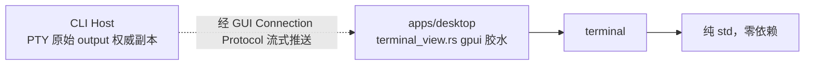

# pawork-terminal Review

> 终端显示核心纯库：行缓冲解析（CR 覆盖 / 退格 / EL / SGR 16 色）、按键到 PTY 字节映射、面板像素到列行估算。1 个 .rs 文件共 771 行（实现 + 9 个内联单元测试），零依赖（无 gpui / tokio / OS API / pawork-*），当前唯一消费者是 apps/desktop 的 Inspector Terminal 显示层。

## 1. 职责与边界

把 Host 保存的原始 PTY 输出（已按 UTF-8 解码）整理成可见行缓冲：CR 回列 0 覆盖同一行、退格只回移光标不擦字符、EL 擦行、SGR 进入 16 色属性分段；把平台无关按键事件映射成 PTY 字节；按面板像素估算列 × 行并钳制在 PTY 边界。明确不是完整 VT emulator：支持 shell 行编辑所需的光标定位、上下左右移动、清屏与自动折行，不支持 alt-screen / vim。不接触 PTY、协议、连接与 Host，不改原始 output；颜色 / 字体由调用方按主题 token 解析。2026-09-15 经用户确认从 apps/desktop 抽为本包，desktop 侧只留 gpui 胶水（主题色 runs、Keystroke 转换、resize 防抖）。

## 2. 依赖关系

| 方向 | 包 | 用途 |
|---|---|---|
| 本包依赖 | 无 | Cargo.toml [dependencies] 为空，纯 std 库 |
| 被依赖（生产） | apps/desktop | 唯一消费者（desktop 直接依赖白名单 `pawork-client, pawork-terminal` 之一，由 platform.rs deny-list 测试断言） |

无 feature、无 bin。桌面窗口字体测量由调用方以 `feed_with_width` 闭包注入（0/1/2 列宽），本包不依赖字体或 OS。

## 3. 文件清单

| 相对路径 | 行数 | 职责 |
|---|---:|---|
| src/lib.rs | 771 | 全部实现与单元测试：几何常量、Attrs/Cell/Line、Screen 行缓冲状态机、render_lines / plain_output、KeyEvent/Modifiers 与 key_to_pty_bytes、size_from_bounds(_scaled) |

## 4. 类型与方法功能列表

| 名称 | 种类 | 签名/功能 |
|---|---|---|
| `TERMINAL_LINE_HEIGHT` / `TERMINAL_CELL_WIDTH` | const | 16px 行高 / 7.2px cell 宽（Menlo 12px 估算） |
| `TERMINAL_OUTPUT_PAD_X` / `TERMINAL_OUTPUT_PAD_Y` | const | 8px / 4px 内边距（与 Inspector px_2 / py_1 同源），测量列行时扣除 |
| `Attrs` | struct | `{ fg, bg: Option<u8>, bold, dim, inverse }`——16 色索引 + 修饰位，色值映射在调用方 |
| `Screen` | struct | `new()`（列数不限、24 行视口）；`with_size(columns, rows)`；`feed(&str)`（默认 1 列宽）；`feed_with_width(&str, impl FnMut(char) -> usize)`；`cursor() -> (row, col)`；`cursor_byte_offset()`（光标前 UTF-8 字节数，供宽字符后插光标 / IME）；`display_lines()` 保留光标行及尾随空格；pub 字段 `cursor_visible` / `bracketed_paste` 跟踪 ?25 / ?2004 私有模式 |
| `Span` / `StyledLine` | struct | `Span { len, attrs }` 按 UTF-8 字节长度分段；空行以单空格占位保行高 |
| `render_lines(raw)` | fn | 一次性解析全量缓冲为 `Vec<StyledLine>`（裁尾随空白） |
| `plain_output(raw)` | fn | AX / 纯文本路径：保留 CR 覆盖与退格效果，剥离其余控制序列 |
| `Modifiers` / `KeyEvent` | struct | 平台无关修饰位（control/alt/shift/platform/function）与按键（key 名 + key_char）；`KeyEvent::new(key)` 构造器 |
| `key_to_pty_bytes(&KeyEvent)` | fn | Enter → CR；Ctrl+字母 → 控制字节；方向键 / Tab / Shift+Tab(ESC[Z) / Delete(ESC[3~) / Home(ESC[H) / End(ESC[F) / Escape / Backspace(0x7f) → 转义序列；可打印字符仅在无修饰时经 key_char 直通；platform / function / alt 组合一律 None |
| `size_from_bounds(width, height)` / `size_from_bounds_scaled(..., rem_scale)` | fn | 扣内边距后按 cell / line 尺寸估算，钳 20-500 列 × 6-200 行；内容区 < 40×24 像素返回 None；rem_scale 下限 0.5 |

## 5. 关键行为与契约

- 逐字符状态机：普通字符按 (row, col) 写格，宽字符占 2 格（第二格空 text 占位，覆盖 / 回移时清理半格残迹）；TAB 到下一 8 列填空格；DEL(0x7f) 与 BEL 忽略。
- CSI 处理：SGR(m，含 256 色 `38;5;n` 收敛 `min(n,15)`、truecolor `38;2;…` 跳过)、EL(K)、ED(J，2/3 清视口)、CUP(H/f)、CUU(A)/CUD(B)、CHA(G)、CUF(C)/CUB(D)；寻址钳在当前视口（top 滚动历史 + rows）；稀疏水平寻址最多填到 500 列，已有长行仍可回移。
- OSC / DCS / SOS / PM / APC（ESC ] P X ^ _）字符串整体跳过（BEL 或 ESC 终止）；带中间字节的 ESC（如 ESC ( B 字符集指定）整体跳过；畸形 / 私有 CSI 不当作擦行。
- SGR 不泄漏进纯文本：plain_output 与着色渲染共用同一解析结果。
- 键映射保守：platform / function 修饰留给 App 快捷键；alt 组合不映射；Ctrl 映射限单字符 @-_。
- 尺寸估算诚实：内容过小返回 None 不臆造；边界 20-500 列、6-200 行，界面不提供手动调节。

## 6. 测试资产

全部内联于 src/lib.rs（9 个单元测试）：

| 测试 | 验证点 |
|---|---|
| carriage_return_overwrites_the_same_line | CR 同行覆盖 |
| backspace_moves_the_cursor_back | 退格回移不擦字符；DEL 忽略 |
| vt_control_sequences_are_stripped | 字符集 / 私有模式序列剥离；bracketed paste 开关不残留 |
| sgr_color_does_not_leak_into_plain_text | SGR 不进纯文本 |
| sgr_marks_spans_with_color_indexes | SGR 属性分段（粗体 + 16 色索引） |
| erase_in_line_clears_from_cursor | EL 擦行 |
| cursor_tracks_shell_redraw_and_wrap | 光标移动 / 折行 / 清屏 / 稀疏寻址 500 列上限 / 宽字符回移 / CUP 重写 / CUU 上移 |
| size_from_bounds_clamps_to_existing_limits | 尺寸钳制与 rem 缩放 |
| keys_map_to_pty_bytes | Ctrl-C / 方向键 / Backspace / 可打印字符 / platform 修饰映射 |

默认验证命令：`cargo test -p pawork-terminal --offline --lib --tests`。

## 7. 协作关系

