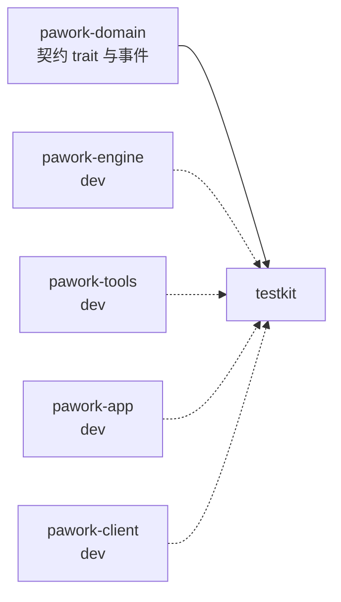

# pawork-testkit Review

> 测试专用 crate：可编程 Mock Provider（脚本回放/序列/取消）、Mock Tool（成功/失败/取消）、Recording Sink 与 Provider 流事件最小断言库。2 个 .rs 文件，共 895 行（lib 757 / contract 138），后半部分均为内联自测；仅依赖 pawork-domain，只作 dev-dependency 进各包测试闭包。

## 1. 职责与边界

pawork-testkit 为 engine / tools / app / client 等包的功能测试提供确定性的 Provider 与 Tool 替身：脚本逐事件回放 `ProviderStreamEvent`、按序列换脚本、精确模拟取消与失败，同时记录每次调用供事后断言。它实现的是 domain 的 `ModelProvider` / `AgentTool` 契约，因此能直接插入真实 engine loop；本 crate 不含任何生产路径逻辑，不进任何生产依赖闭包。

## 2. 依赖关系

| 方向 | 包 | 用途 |
|---|---|---|
| 本包依赖（生产） | pawork-domain | Provider/Tool 契约 trait 与全部事件词汇（CanonicalModelRequest、ProviderStreamEvent、ToolResult 等） |
| 被依赖（dev） | pawork-engine、pawork-tools、pawork-app、pawork-client | 各包定向测试注入 mock provider/tool |

| 外部 crate | 用途 |
|---|---|
| async-trait | trait 实现（ModelProvider / AgentTool / 两个 sink） |
| serde_json | 工具入参与 metadata 的 Value 操作 |
| tokio（dev） | 自测的 async runtime |

无 feature、无 bin。任何包把本 crate 列为生产依赖都是装配错误。

## 3. 文件清单

| 相对路径 | 行数 | 职责 |
|---|---:|---|
| src/lib.rs | 757 | MockScript builder、MockProvider（回放/序列）、MockTool、Recording Sink、请求序断言；后半为内联自测 |
| src/contract.rs | 138 | Provider 流事件最小断言：text 流形状、单/并行 tool call 闭合、变体计数；内联自测 |

## 4. 类型与方法功能列表

### lib.rs — Mock Provider / Mock Tool / Recording Sink

| 名称 | 种类 | 签名/功能 |
|---|---|---|
| `MockScript` | struct | 脚本 builder（Clone/Debug/Default）。`new()`；`response_started(response_id)`；`text(t)`；`thinking(t)`；`tool_call(name, arguments)`——自动生成 `mock-tool-call-N` id 并展开为 Started→ArgumentsDelta(单块 JSON)→Completed；`tool_call_chunks(id, name, chunks)`——显式 id 与多块 JSON delta（测部分参数流）；`usage(TokenUsage)`；`provider_metadata(Value)`；`complete_with(stop_reason)` / `complete()`（默认 Completed）；`fail(ProviderError)`——走到该步立即返回错误；`wait_for_cancellation()`——挂起等取消（测取消路径） |
| `MockProviderStep` | enum（私有） | Event(ProviderStreamEvent) / Fail(ProviderError) / WaitForCancellation |
| `MockProviderSource` | enum（私有） | Replay(MockScript)——同一脚本每次调用重放；Sequence { scripts, next }——逐次取脚本，取尽报 StreamInterrupted |
| `MockProvider` | struct | `new(script)`；`sequence(scripts)`；`with_id(ProviderId)`（默认 `"mock"`）；`with_models(Vec<ModelDefinition>)`（list_models 目录）；`calls() -> Vec<MockProviderCallRecord>`。实现 `ModelProvider`：`stream()` 每步先查取消（已取消则记 cancelled 并返回 ProviderError::cancelled），Event 逐步 emit 并累计 event_count、更新 summary（response_id/usage/stop_reason/provider_metadata），Fail 立即返回，WaitForCancellation await 后按取消返回；脚本走完但无 ResponseCompleted → StreamInterrupted（"mock script ended without ResponseCompleted"） |
| `MockProviderCallRecord` | struct | `request_id, model, event_count, cancelled, completed`——单次 stream 调用的事后断言数据 |
| `MockTool` | struct | `new(name, result)`；`failing(name, ToolError)`；`with_descriptor(ToolDescriptor)`（覆盖默认描述）；`calls()`；`assert_called_with(&[Value])` 断言入参序列。默认 descriptor：ReadOnly / ClientFunction / Local / 免审批 / 可并发 / default_timeout 1s / max_output 64KiB / 允许 untrusted workspace。实现 `AgentTool::execute`：先记录调用（tool_call_id/input/workspace_id/run_id/是否已取消），已取消返回 ToolError::cancelled，否则回放 outcome |
| `MockToolCallRecord` | struct | `tool_call_id, input, workspace_id, run_id, cancelled` |
| `RecordingProviderSink` | struct | `events() -> Vec<ProviderStreamEvent>`；实现 `ProviderEventSink::emit`（收集不失败） |
| `RecordingToolSink` | struct | `events() -> Vec<ToolStreamEvent>`；实现 `ToolEventSink::emit` |
| `assert_provider_request_order(provider, expected)` | fn | 断言 mock provider 收到的 request_id 顺序 |

### contract.rs — 流事件断言

| 名称 | 种类 | 签名/功能 |
|---|---|---|
| `assert_text_stream(events)` | fn | 至少一条非空 TextDelta，且以 ResponseCompleted 收尾 |
| `assert_single_tool_call(events)` | fn | 存在 ToolCallStarted 且同 id 被 ToolCallCompleted 闭合 |
| `assert_parallel_tool_calls(events)` | fn | 至少两个 Started，且每个 id 均被 Completed 闭合（并行交错形状） |
| `count_variant(events, predicate) -> usize` | fn | 按谓词统计变体数量 |

## 5. 关键行为与契约

- **脚本完整性门**：MockScript 不以 ResponseCompleted 收尾时 stream() 返回 StreamInterrupted——测试里忘了 `.complete()` 会显式失败而不是静默截断。
- **序列耗尽显式化**：Sequence 源取尽返回 `ProviderErrorKind::StreamInterrupted`（"mock script sequence exhausted"），且该次调用记录为未完成。
- **取消优先**：每步回放前检查 `cancel.is_cancelled()`；wait_for_cancellation 依赖 CancellationToken 的广播唤醒。cancelled 调用会写入 call record（`cancelled=true, completed=false`）。
- **summary 语义**：ModelResponseSummary 从脚本事件聚合——ResponseStarted 定 response_id、UsageUpdated 定 usage、ResponseCompleted 定 stop_reason、ProviderMetadata 定 metadata；其余事件不影响 summary。stop_reason 默认 Error（无 Completed 时反正会报错）。
- **MockTool 与真实工具契约一致**：先记录后执行、取消优先于 outcome 回放；调用记录含 workspace/run 上下文，可断言 context 传递正确性。
- **断言库不绑定具体 Provider**：contract.rs 只看 `&[ProviderStreamEvent]`，任何 provider 实现的输出都能套用；capability / server_tool / citation / reasoning 断言刻意未迁入（注释言明）。

## 6. 测试资产

无独立 tests/ 目录，全部内联自测：

| 位置 | 验证点 |
|---|---|
| lib.rs tests | 单脚本 text+tool_call+complete 事件序列形状（配合 contract 断言）与同脚本重放；两脚本序列播放与耗尽错误；tool_call_chunks 部分 JSON 保序与并行断言、count_variant；MockTool 成功/失败/取消与默认 descriptor 字段；provider 取消记录；fail 步立即返回脚本错误 |
| contract.rs tests | 三个断言函数在合法流上通过；count_variant 计数 |

## 7. 协作关系

