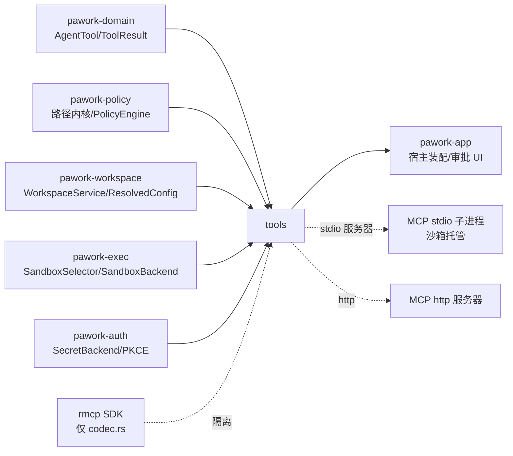

# pawork-tools Review

> 工具层:八个内置 Agent 工具(4 只读 + 3 写 + run_command)、最小调度器(ToolRegistry + ToolScheduler:Policy 闸门、审批解析、全局并发信号量、超时)与 MCP 客户端子系统(`mcp/`,rmcp SDK 被隔离在 codec.rs 单文件)。20 个 .rs 文件、共 10 035 行(11 个顶层模块 + 9 个 mcp 子模块),无独立 tests/ 目录,全部回归内联 `#[cfg(test)]`。

## 1. 职责与边界

- **内置工具**:八个 `pawork_domain::AgentTool` 实现;一切路径输入都是 `workspace_id + relative_path`,统一经 `pawork-policy` 的 `resolve_workspace_path` 解析,模型无法用绝对路径直达文件系统。
- **调度**:`ToolRegistry` 是唯一注册表(内置与 MCP 工具同表);`ToolScheduler::execute_named` 串起「查表 → Policy 裁决 → 审批解析 → 全局信号量 → 超时包裹 → 执行」。
- **MCP**:配置解析与校验、受管客户端(惰性连接/指数退避/请求超时/取消)、能力发现与 `{server}.{tool}` 命名空间注册、stdio 服务器强制经 Sandbox Runtime 托管、Secret 只存 locator(`SecretRef`)、PKCE OAuth。
- **不做**:不做风险分类与裁决(policy);不实现进程/沙箱原语(exec);不持久化事件(engine/store 侧);不接写锁/git 锁/文件锁(调度器头部注释明示)。

## 2. 依赖关系

**本包依赖的 pawork-* 包**

| 包 | 用途 |
| --- | --- |
| `pawork-domain` | `AgentTool`/`ToolDescriptor`/`ToolResult`/`ToolError`/`CancellationToken`/`ToolEventSink` 等 canonical 类型 |
| `pawork-policy` | `resolve_workspace_path` 路径安全内核、`PolicyEngine`/`PolicyInput`/`ApprovalMode`/`ExecutionConstraints`、`canonicalize_platform`/`relative_to_root` |
| `pawork-workspace` | `WorkspaceService`(工作区根解析)、`ResolvedConfig`(MCP 配置入口 `extra["mcp"]`) |
| `pawork-exec` | `ProcessRuntime`/`SandboxSelector`/`SandboxPolicy`/`SandboxBackend::spawn_interactive`(run_command 与 MCP stdio 托管) |
| `pawork-auth` | `SecretBackend`/`StoredCredential`/PKCE OAuth 原语、`http_client()` |

**被哪些包依赖**:`pawork-app`(crates/app;app_core.rs / approval.rs / extensions.rs / loop_ctx.rs 引用 `pawork_tools`)。engine 不直接依赖本包。

**关键外部 crate**

| crate | 用途 |
| --- | --- |
| `rmcp =3.1.3`(版本钉死) | MCP SDK,只出现在 codec.rs(crate 私有 mod);dev 侧另开 server feature 供 in-process 测试服务器 |
| `globset` / `ignore` | find_files 与 search_text 的 glob 匹配与目录遍历(尊重 .gitignore) |
| `regex` | search_text 正则匹配(regex crate 非 fancy-regex) |
| `chardetng` / `encoding_rs` | read_file 编码探测与解码(encoding_rs 为直接依赖,注释说明 chardetng 返回类型解析要求) |
| `reqwest` / `url` | MCP http transport 与 URL 校验(loopback 判定、userinfo/fragment 拒绝) |
| `tokio` | fs/io-util/macros/rt/sync/time；dev 另开 rt-multi-thread/test-util |
| `async-trait` | `ApprovalResolver` / `McpPeer` / `StdioSpawner` / `McpConnector` |
| `serde` / `serde_json` / `thiserror` / `tracing` | 工具输入 JSON、错误类型、MCP 日志 |
| `wiremock`(dev) | OAuth 刷新/PKCE 换码测试 |
| `tempfile` / `proptest` / `pawork-testkit`（dev） | 文件系统夹具、edit/apply_patch 不变量、测试装配 |

## 3. 文件清单

| 路径 | 行数 | 职责 |
| --- | --- | --- |
| src/lib.rs | 28 | 门面:11 个模块声明 + re-export(八工具、scheduler 全家、`pub mod mcp`) |
| src/common.rs | 183 | 公共层:`BuiltinToolError` → `ToolError` 集中映射;取参 helper;`workspace_roots`;`resolve_write_rel`;`atomic_write` |
| src/read_file.rs | 480 | `ReadFileTool`:行号视图、offset/limit、编码探测、二进制检测、读/输出上限 |
| src/list_directory.rs | 442 | `ListDirectoryTool`:目录优先字典序、BinaryHeap 单扫描分页、symlink 信息 |
| src/find_files.rs | 382 | `FindFilesTool`:逗号分隔 glob、ignore walker、类型/深度/结果上限、逃逸复核 |
| src/search_text.rs | 519 | `SearchTextTool`:固定串/regex、context 行、glob 过滤、输出预算、`spawn_blocking` |
| src/write_file.rs | 232 | `WriteFileTool`:整文件原子写、建父目录、覆盖保留 mode |
| src/edit_file.rs | 518 | `EditFileTool`:单段/多段替换、内存预演、fuzzy whitespace 匹配(KMP) |
| src/apply_patch.rs | 520 | `ApplyPatchTool`:多文件 create/update/delete/rename、dry_run、备份回滚 |
| src/run_command.rs | 919 | `RunCommandTool`:非 PTY 沙箱执行、流式输出、资源 clamp、取消桥 |
| src/scheduler.rs | 1140 | `ToolRegistry`/`ToolScheduler`/`ApprovalResolver` 闸门流水线(约 400 行逻辑 + 测试) |
| src/mcp/mod.rs | 247 | MCP 边界类型(`McpError`/`McpToolInfo`/`McpPeer`)+「公开源码不得出现 rmcp」守卫测试 |
| src/mcp/capabilities.rs | 720 | 能力桥:discover、`McpToolAdapter`(MCP→AgentTool)、注册与白名单闸 |
| src/mcp/codec.rs | 695 | **rmcp SDK 唯一隔离点**:握手、模型转换、输出预算、timed/should_retry、test_support |
| src/mcp/config.rs | 869 | `McpConfig`/`McpServerConfig`/`TransportSpec`/`RestartPolicy`/`McpPermissions`/`StdioSandboxRuntime` |
| src/mcp/manager.rs | 592 | `ManagedMcpClient`:惰性连接、退避重启、健康快照、shutdown |
| src/mcp/oauth.rs | 371 | PKCE 登录、`McpBearerProvider` 自动刷新、`OAuthHttpConnector` bearer 轮换检测 |
| src/mcp/sandbox.rs | 582 | stdio 托管:`StdioSpawner`/`SandboxedStdioSpawner`/`SpawnedStdio`、env 卫生、8 MiB stdout 预算 |
| src/mcp/security.rs | 204 | `SecretRef`(pawork.mcp.* 前缀强制)/`ResolvedSecret`(Debug/Display 恒 REDACTED) |
| src/mcp/transport.rs | 392 | 传输配置(私有 mod,携密 Debug 手写 redact)、`McpConnector` trait(pub(crate))、`DefaultConnector` |

## 4. 类型与方法功能列表

### 4.1 common.rs — 公共层

| 名称 | 种类 | 功能/语义 |
| --- | --- | --- |
| `BuiltinToolError` | enum | `MissingField(&'static str)` / `InvalidField{field, detail}` / `Path(WorkspacePathError)` / `PolicyPath(PathSafetyError)` / `Io` / `Workspace` / `Process(String)` / `Other(String)` |
| `impl From<BuiltinToolError> for ToolError` | impl | MissingField/InvalidField → InvalidInput;Empty/NoRoot → InvalidInput/NotFound;其余路径安全违规(AbsolutePath/Traversal/ReservedDeviceName/SymlinkEscape/GitInternals/NonRegular)→ **PermissionDenied**;Io NotFound → NotFound,其余 Io → ExecutionFailed(retryable=false);Workspace(NotFound) → NotFound |
| `require_str(input, key)` | fn | 取必填字符串,缺失 → `MissingField` |
| `opt_str` / `opt_u64` / `opt_bool` | fn | 取可选字段(类型不符视为 None) |
| `workspace_roots(service, id)` | fn | 未知 workspace → `WorkspaceError::NotFound` |
| `resolve_write_rel(roots, rel)` | fn | 全部八工具(含只读)解析路径的统一入口,返回绝对路径 |
| `atomic_write(path, content)` | fn | 同目录临时文件 `.pawork-tmp-{pid}-{counter}` + write_all + sync_all + rename;失败清理临时文件;Unix 覆盖时保留既有 mode |

私有细节:`TEMP_COUNTER` 全局原子计数保证并发写临时文件名唯一;rename 前强制 `sync_all`(崩溃一致性)。

### 4.2 八个内置工具(descriptor 语义与 execute 行为)

统一形状:实现 `AgentTool`(`descriptor()` + `execute(request, context, sink, cancel)`);构造函数均 `new(WorkspaceService)`;**全部 `requires_approval=false`**(是否询问完全由 scheduler 按 ApprovalMode + capability + trusted 裁决);四个只读工具 `allowed_in_untrusted_workspace=true`、`supports_concurrency=true`,四个副作用工具均为 false。

| 工具 | capability | untrusted | default_timeout / max_output(源码实际值) | 输入要点 |
| --- | --- | --- | --- | --- |
| `read_file` | ReadOnly | 是 | 10s / 256 KiB | `path`;`offset`(1 起行号)、`limit`(默认 2000 行,均 max(1)) |
| `list_directory` | ReadOnly | 是 | 10s / **128 KiB** | `path`(`"."`=root);`limit`(默认 500)、`offset`(默认 0) |
| `find_files` | ReadOnly | 是 | **10s** / 256 KiB | `pattern`(逗号分隔 glob);`file_type`(file 默认/dir/any)、`max_depth`、`max_results`(默认 200) |
| `search_text` | ReadOnly | 是 | **15s** / 256 KiB | `pattern`;`is_regex`(默认 false)、`glob`、`context_lines`(默认 2)、`max_results`(默认 100)、`case_sensitive`(默认 true) |
| `write_file` | WorkspaceWrite | 否 | 10s / 16 KiB | `path`、`content` |
| `edit_file` | WorkspaceWrite | 否 | 10s / 32 KiB | `path` + (`old_string`/`new_string`)或 `edits[]`;`allow_fuzzy`(默认 false) |
| `apply_patch` | WorkspaceWrite | 否 | 15s / 64 KiB | `ops[]`(`op`=create/update/delete/rename + `path`/`content`/`to`)、`dry_run` |
| `run_command` | Process | 否 | **30s(源码设置,见 §5 差异)** / 8 MiB | 见下方专列 |

各工具 execute 行为:

- **read_file**(私有 `read`):`tokio::fs` 异步读,`take(MAX_READ_BYTES+1)` 即 4 MiB 读上限,超出截断并 `read_truncated=true`;读前 select cancel。二进制检测 `is_binary`(NUL 命中即判;或前 1024 字节中非文本控制字节 >10% 于 textish)→ 只报 `binary file ({size} bytes); content omitted.` 不吐内容。编码探测 `chardetng` 猜测 + 损失式解码,解码错误在尾部追加 warning 行。`render_lines` 输出 `{行号:>6}\t行文本`,受 256 KiB 预算与 offset/limit 双重截断。metadata:bytes/bytes_read/lines_total/offset/limit/binary 等(测试断言不含宿主绝对路径)。
- **list_directory**(私有 `list_dir`,同步 IO):非目录 → `Other` 错误。单次 `read_dir` 扫描,BinaryHeap 只保留前 `offset+limit` 个最小项(大目录内存 O(offset+limit))仍得准确 total;排序 `entry_cmp`=目录优先→名字字典序→kind。symlink:`symlink_metadata` 判定,follow 成功=`symlink`(size 取目标),失败=`broken_symlink`(size 取 lmeta);`safe_symlink_target` 把目标 canonicalize 后相对化到某个 root,越 root 省略(canonicalize 失败且非绝对则原样相对返回)。行格式 `{size:>8}  {kind}  {name}[ -> target]`;metadata.entries 为结构化数组(name/kind/size/mtime_ms/is_symlink/symlink_target)。
- **find_files**(私有 `find`,`spawn_blocking` 执行):`WalkBuilder` follow_links(false) + ignore/git_ignore/git_exclude(true)(**默认跳过隐藏文件**);每 64 个 entry 查一次取消;命中 glob(rel 或完整 path 两形态)后逐项用 `resolve_write_rel` 复核,`.git` 与逃逸 symlink 静默跳过;结果字典序稳定排序;`max_results` 达到即 truncated。非 UTF-8 glob → Other 错误。
- **search_text**(私有 `search`,`spawn_blocking`):`hidden(false)`(**搜隐藏文件**但仍尊重 .gitignore);glob 过滤同样 rel/path 双形态;逐文件 `read_to_string`(非 UTF-8 跳过);`Matcher` = Regex(regex builder case_insensitive 取反)或 Fixed(大小写不敏感时 needle 与行同时 lowercase);非法 regex/glob → InvalidInput;`scan_file` 每行查取消(每 256 行)、命中输出 `{rel}:{line}:{marker}{text}` + context 行(`  > ` 前缀),256 KiB 全局预算耗尽即提前返回已累积部分。
- **write_file`(私有 `write`):require path+content → resolve → `atomic_write`;metadata `{path, bytes}`。
- **edit_file**(私有 `edit`):解析 segments(`edits[]` 优先,否则单段);`edits[]` 为空数组 → "no edits provided";任一 `old==new` → Conflict;全部段先在内存 `count_and_replace` 预演(0 命中 NotFound、>1 命中 Conflict 报命中数),任一段失败整体不落盘;净变化为零(`content==original`)→ NotFound;成功一次 `atomic_write`。fuzzy 匹配:`fuzzy_match_ranges` 行对齐 whitespace 归一化——`line_spans` 切行(CRLF 兼容)、全文一次性 whitespace token 化 + `token_offsets` 行界索引、`kmp_match_starts` 在 token 序列上 KMP 匹配,窗口内 token 数恰等于 pattern 数才算命中;命中区间是**行首到行 content_end**(保留行尾换行)。metadata = `EditReport{path, applied[], bytes}` 逐段报 occurrences。
- **apply_patch**(私有 `apply`):`parse_ops`(未知 op → InvalidField);先对全部 op 的 path 与 to resolve(任一非法整体失败);dry_run 只返回 `PlannedChange` 清单不落盘;执行前 `snapshot_involved_paths` 对涉及路径做字节备份(`PathBackup::Existing(Vec<u8>)` / `Absent`);逐 op 执行(`exec_op`:create/update 走 atomic_write(content 缺省空串)、delete 幂等、rename 要求 `to` 并建父目录);任一 op 失败 → `restore_backups` 恢复全部备份(改写还原、新建删除),恢复也失败则在错误信息中追加;失败以 `ApplyPatchError::Partial{failed_op, message, applied}` 报出已应用清单。
- **run_command**(私有 `run`):
  - 输入:`argv[]` 优先(非字符串元素被 filter_map 丢弃),否则 `command` 包装平台 shell(Unix `sh -c`、Windows `cmd /d /s /c`);`cwd` 相对 workspace 经 `resolve_write_rel`(缺省第一 root);`timeout_ms` clamp 100..600_000 默认 30s;`max_output_bytes` clamp 1..8 MiB 默认 8 MiB;资源四项 cpu_seconds(60/600)、memory_mb(2048/8192)、open_fds(1024/4096)、max_procs(64/256)。
  - env:`env_clear=true`;`default_env_allowlist()` + `with_extra_env_allowlist` 追加的宿主配置白名单 + 显式 `env{}` 全部进入 spec.env;允许名单合并排序去重后进 policy;`process_env_denylist()` 通配 deny(`*TOKEN*`/`*KEY*`/`*SECRET*`/`*PASS*`/`*AUTH*`/`*COOKIE*`/`*CREDENTIAL*`/`LD_PRELOAD`/`DYLD_*`/`NODE_OPTIONS`/`BASH_ENV`/`ENV`/`BASH_FUNC_*` 等,通配命中优先于 allowlist)。
  - 沙箱:手工构造 `SandboxPolicy`(filesystem read/write roots=workspace roots、deny=default_secret_paths()、network Enforce、allow_spawn、ResourceLimits 含 wall_time_ms=timeout_ms);运行时注入支持 `RunCommandTool::with_runtime`(测试用)。
  - 取消:`bridge_exec_cancel` 把 domain token 桥到 exec token(已取消立即;否则 spawn 后台等待任务)。
  - 执行:`SandboxSelector::with_runtime(runtime).pick()` 选后端(优先硬隔离),消费 ProcessEvent 流:`Stdout`/`Stderr` chunk 实时累计并通过 sink emit `OutputDelta`(真流式),`Exit{code, truncated}` 收口;成功 = exit 0。输出 stdout + 非空 `[stderr]` 段 + 非零 `[exit N]`;metadata 含 exit_code/字节数/truncated 与 **sandbox 块**(backend id、isolation、fallback、note、attempted、limits 全量)。

每个工具文件各带私有错误 enum(`ReadFileError`/`ListDirError`/`FindFilesError`/`SearchTextError`/`WriteFileError`/`EditFileError`/`ApplyPatchError`/`RunCommandError`),Cancelled 变体在 execute 顶层映射为 `ToolError::cancelled`,其余经 `BuiltinToolError` 集中映射;find_files/search_text 的 spawn_blocking JoinError → Internal。

### 4.3 scheduler.rs — 调度层

| 名称 | 种类 | 功能/语义 |
| --- | --- | --- |
| `ToolRegistry` | struct(Clone, Arc<HashMap> 写时复制) | `new`/`register`/`extend`/`get`/`descriptor`/`descriptors`(按名排序)/`len`/`is_empty`;register 校验 `has_consistent_hosting` 且 `kind==ClientFunction`,同名注册为覆盖语义(MCP 重连刷新用);extend 中途失败时已注册项保持生效 |
| `ToolRegistryError` | enum | `KindHostingMismatch{name,kind,hosting_kind}` / `ExecutorForNonClientFunction{name,kind}` |
| `ToolSchedulerConfig` | struct | `max_concurrent`(默认 8)、`approval_mode`(默认 ReadOnly)、`workspace_trusted`(默认 false)——**默认即最保守档** |
| `ToolScheduler` | struct | `new(registry, config)` / `tool_count` / `approval_mode` / `workspace_trusted` / `with_approval_snapshot(mode, trusted)`(克隆工具表建新实例,旧实例与进行中调用不受影响,宿主 Arc-swap 用)/ `execute_named(name, request, context, cancel, approval, sink)` |
| `ApprovalOutcome` | enum | `Approved` / `Denied` |
| `ApprovalResolver` | trait(async) | `resolve(&[ToolRequest]) -> Vec<ApprovalOutcome>`(顺序与输入一致);`can_resolve_policy_prompt() -> bool` 默认 true——代表真实可审计的用户审批通道 |
| `AutoApproveResolver` | struct | `can_resolve_policy_prompt()=false`(不能满足 policy AskUser);resolve 恒 Approved(对 S2 钩子有效,见 §5) |
| `NoopToolEventSink` | struct | 丢事件 sink,测试与最小宿主用 |
| `SchedulerError` | — | **不存在**:Spec 提及但源码无此类型,闸门直接产出 `ToolResult`/`ToolError` |

私有实现要点:

- `execute_with_tool` 主流程:取 executor → `check_gate`(Denied → `Ok(failure ToolResult, category=Authorization)`)→ S2 审批钩子（`check_gate` 已 AskUser 则跳过；仅当调用方传入 `approval` resolver） → cancel 预检 → `acquire` 全局 Semaphore 许可(`max_concurrent.max(1)`)→ descriptor 有 `default_timeout_ms` 则 `tokio::time::timeout` 包裹(超时 → `ToolErrorKind::Timeout`)→ 执行。
- `check_gate`:`PolicyEngine::decide(PolicyInput{capability, input, trusted, allowed_in_untrusted_workspace, approval_mode})`;若 descriptor `requires_approval=true` 且裁决非 Deny → **升级为 AskUser**;AskUser 分支要求 resolver `can_resolve_policy_prompt()==true` 否则 fail-closed 拒绝("automatic approval is forbidden");AllowWithConstraints → `apply_execution_constraints` 把 `timeout_ms`/`max_output_bytes` 注入 input(与已有值取更严者);Deny → 拒绝结果。
- `ToolHandle` RAII 持有 `OwnedSemaphorePermit`。
- `ProviderHosted`/`ProviderExtension` kind → `not_locally_executable` 错误。

**并发规则事实**:scheduler 执行层是**单一全局 Semaphore**,对所有 capability 一视同仁,不按 capability 限并发;"仅 ReadOnly 可并发"体现在 descriptor 层——`ToolCapability::permits_concurrent_execution()`(domain)只有 ReadOnly 为 true,MCP adapter 用它填 `supports_concurrency`,内置四只读 true、四副作用 false;但 `supports_concurrency` 在本包与 engine/app 中均无消费方,纯对外声明。测试用 probe 工具验证只读并发峰值与 max_concurrent=1 强制串行。

### 4.4 mcp/ 子系统

#### mcp/mod.rs — 边界类型

| 名称 | 种类 | 功能/语义 |
| --- | --- | --- |
| `McpError` | enum | `Config` / `Transport` / `Protocol` / `Disconnected` / `Timeout(Duration)` / `Cancelled` / `PermissionDenied` / `Secret` / `OAuth` / `Registry(ToolRegistryError)`;错误文案要求日志/持久化安全(不含明文 secret) |
| `McpServerCapabilities{tools, resources, prompts}` | struct | initialize 握手广播;Default 全 true **仅为测试便利**,生产 peer 以服务器实际结果覆写 |
| `McpToolInfo{name, description, input_schema, read_only}` | struct | 发现的工具元数据(SDK 模型留在 codec 后面) |
| `McpToolCall{name, arguments}` | struct | canonical 调用 |
| `McpPeer` | trait(async) | `server_capabilities()`(默认 Default)/ `list_tools()` / `call_tool(call, cancel) -> ToolResult`;manager 与 capabilities 之间的抽象缝 |

#### mcp/capabilities.rs — 能力桥

| 名称 | 种类 | 功能/语义 |
| --- | --- | --- |
| `namespaced_name(server, tool)` | fn | `{server}.{tool}`(服务器名禁 `.` 保证无歧义) |
| `McpCapabilities{tools}` | struct | `discover(peer)`:先取握手能力,广播 tools 才 list_tools,否则空 |
| `McpToolAdapter` | struct(AgentTool) | `new(server, tool_info, peer, permissions, trusted)` + `with_host_trusted(bool)`(默认 false fail-closed);descriptor:read_only_hint=true → ReadOnly + requires_approval=false,否则 ExternalPlugin + **requires_approval=true**;`allowed_in_untrusted_workspace = read_only || (trusted && host_trusted)`;`max_output_bytes = permissions.max_output_bytes`;`default_timeout_ms=None` |
| `register_server_tools` | fn | discover + 白名单过滤 + 注册,返回 descriptors |
| `register_discovered_tools` | fn | 同步变体(已有发现结果复用);注册期 `trusted &&= host_trusted`(MCP 配置 trusted 不得越过宿主信任地板) |

execute 行为:调用期双重校验——`allowed_workspaces` 非空时按 `context.workspace_id` 查,违规返回 Authorization 失败结果;`allowed_tools` 非空时按原始工具名查(与注册期过滤叠加);两次 cancel 检查;非 object input → InvalidInput 错误;`peer.call_tool` 的 McpError::Cancelled → `ToolError::cancelled`、Timeout → `ToolError`(Timeout, retryable=true)、其余 → `ToolResult::failure(category=Tool)`;最后 `apply_tool_result_budget` 限输出。

#### mcp/codec.rs — SDK 隔离点(crate 私有)

| 名称 | 种类 | 功能/语义 |
| --- | --- | --- |
| `RunningClient` | struct | 包 `RunningService<RoleClient,()>`;`peer()`/`is_dead()`/`close_with_timeout` |
| `ClientPeer` | struct(Clone) | `server_capabilities()`(peer_info 缺失 → Protocol 错)、`list_tools()`(list_all_tools → McpToolInfo,read_only 取 annotations.read_only_hint)、`ping()`、`call_tool(call, timeout, cancel)`(`send_cancellable_request` + biased select,cancel 时对端发 MCP cancel 通知) |
| `tool_to_info` / `call_to_params` / `call_result_to_tool_result` | fn | 模型转换:CallToolResult → ToolResult(text/image/resource-text 三类 ContentBlock;structured_content 进 `metadata.mcp.structured_content`;is_error → success=false + ErrorContext(category=Tool, message 取 text 拼接)) |
| `server_result_to_tool_result` | fn | InputRequiredResult → **fail-closed** Protocol 错误(不支持追加输入);其他意外响应同 |
| `apply_output_cap(parts, max)` / `apply_tool_result_budget(result, max)` | fn | 硬字节上限,文本在 UTF-8 char boundary 截断,超限丢弃后续 part 并置 truncated;structured_content 编码后放不进剩余预算则整体丢弃并置 truncated |
| `serve_stdio` / `serve_http` / `build_http_transport_config` / `validate_http_transport_config` | fn | 握手建立;http 配置校验(空 URL/空 token、auth_token 与 Authorization header 冲突、明文 http + 携密 + 非 loopback 拒绝、重复 header) |
| `map_service_error` / `should_retry` / `timed` | fn | ServiceError → McpError 映射;**只有 Disconnected 可重试**;请求级超时包装 |
| `test_support::InProcessConnector` | mod(cfg(test)) | echo/slow/failing/delayed 四种 in-process 服务器,供 manager 测试 |

#### mcp/config.rs — 配置

| 名称 | 种类 | 功能/语义 |
| --- | --- | --- |
| `McpConfig` | struct | `servers: BTreeMap<String, McpServerConfig>`;`from_resolved(&ResolvedConfig)` 读 `config.extra["mcp"]`(已按 global→workspace→session→run 合并);`from_value`;`validate`;`server(name)` |
| `McpServerConfig` | struct | `{transport, auto_start, timeout_ms, restart, permissions, trusted}`;`build_client(name, backend, Option<StdioSandboxRuntime>)`——stdio 缺 runtime 直接 Config 错(fail-closed);`runtime_options` 暴露请求超时(默认 30s)与 RestartPolicy |
| `TransportSpec` | enum(serde tag=kind, snake_case) | `Stdio{command, args, env: BTreeMap<String, SecretRef>}` / `Http{url, headers: BTreeMap<String, SecretRef>}`;validate:command 非空;http/https only、拒 URL userinfo 与 fragment、携密 header 明文 http 仅 loopback;`resolve_transport(backend)` 把 SecretRef 解析为传输配置 |
| `StdioSandboxRuntime` | struct | 显式生产依赖:`{backend: Arc<dyn SandboxBackend>, policy, workspace_roots}`;roots 为空拒绝;`into_spawner` 建唯一 spawner(初次连接与重连复用) |
| `SecretResolvingConnector` | struct(impl McpConnector) | 每次 connect 时解析 SecretRef → 按运行时形态分派 sandboxed_stdio 或 http;stdio 无 runtime fail-closed |
| `RestartPolicy` | struct | `max_attempts`(默认 1)/`base_delay_ms`(200)/`max_delay_ms`(10_000);校验 max≥1、base>0、max≥base |
| `McpPermissions` | struct | `allowed_tools`/`allowed_workspaces`(空集=不限制,非空=白名单)、`max_output_bytes`(默认 1 MiB,≥1) |
| `validate_server_name` / `is_loopback_url` | fn | 服务器名非空且禁 `.`(命名空间分隔符);loopback 判定(localhost/127.0.0.0-8/::1) |

#### mcp/manager.rs — 受管客户端

| 名称 | 种类 | 功能/语义 |
| --- | --- | --- |
| `ConnectionState` | enum | Disconnected / Connecting / Connected / Failed |
| `HealthSnapshot` | struct | state、transport、last_error、last_connected_at、restart_attempts、max_restart_attempts |
| `ManagedMcpClientOptions` | struct | name / request_timeout / restart |
| `ManagedMcpClient` | struct(impl McpPeer) | `options()`/`health()`/`ping()`/`shutdown()`(置 shutdown 标记 + 5s 优雅关闭,后续一切调用 → Disconnected);lifecycle Mutex 串行化连接路径 |

私有实现要点:惰性连接——首个请求才 connect;`peer_with_cancel` 先查 connector `should_reconnect_before_request()`(OAuth bearer 轮换用)决定是否丢弃在途连接;`reconnect` 循环:指数退避 `backoff = min(base×2^(n-1), max)`(指数 cap 30 防移位溢出),失败计数达 `max_attempts` 即返回 Disconnected,耗尽后冷却 `4×max_delay` 才复位计数允许重试;connect 本身被 request_timeout 约束;一切等待点(`interruptible`)同时 select shutdown 与调用方 cancel;`health()` 只取 state 锁快照,连接进行中也不阻塞。

#### mcp/oauth.rs

| 名称 | 种类 | 功能/语义 |
| --- | --- | --- |
| `begin_pkce_login(PkceFlowConfig)` | fn | 启动 PKCE 授权码流程 → PkceSession |
| `complete_pkce_login(session, code, state, http, backend, display_name)` | fn | 验 state、换码、`store_oauth_token` 持久化 → StoredCredential |
| `McpBearerProvider` | struct | `bearer()`:按 skew 自动 refresh 并回写轮换 token;`credential()` |
| `OAuthHttpConnector` | struct(impl McpConnector) | connect 前 `authorized_config`(拒绝已有 Authorization 配置,注入 Bearer);`should_reconnect_before_request` 比较新旧 bearer 检测 token 轮换 → 强制重建 transport |

#### mcp/sandbox.rs — stdio 托管

| 名称 | 种类 | 功能/语义 |
| --- | --- | --- |
| `StdioSpawner` | trait(async) | `spawn(&StdioTransportConfig) -> SpawnedStdio`;唯一允许启动/重启包内 MCP stdio 服务器的入口 |
| `SandboxedStdioSpawner` | struct | 生产实现:走 `SandboxBackend::spawn_interactive`;cwd = working_dir 或第一 root;`max_output_bytes = 8 MiB + 2×8192 slack` |
| `SpawnedStdio{read, write}` | struct | `SandboxStdoutReader`(AsyncRead:mpsc ProcessEvent → 字节流,stdout+stderr 共享 8 MiB 预算,超限/Exit truncated → **fail-closed IO 错误断连**)/ `SandboxStdinWriter`(AsyncWrite:write_all boxed future,pending 保续) |
| `apply_mcp_stdio_env_hygiene(&mut SandboxPolicy)` | fn | env_clear=true + `SandboxPolicy::untrusted_default` allowlist + deny 追加 `PAWORK_API_KEY_*`;**不改 network_mode** |

spawn 细节:cfg.env 的 key 追加进 allowlist;env 组装从 allowlist 读宿主值(跳过通配模式与 `PAWORK_API_KEY_*` 前缀),cfg.env 覆盖同名槽位(但仍拒绝 provider key);domain cancel 桥到 exec cancel。

#### mcp/security.rs / mcp/transport.rs

| 名称 | 种类 | 功能/语义 |
| --- | --- | --- |
| `SecretRef{service, account}` | struct | 只序列化 locator;`resolve(backend)`:service 必须 `pawork.mcp.*` 前缀(`pawork.mcp` 裸 stem 也拒),Provider/OAuth 域 fail-closed → McpError::Secret |
| `ResolvedSecret` | struct | `expose_secret()`;Debug/Display 恒 `[REDACTED]`;Drop 清零 String |
| `StdioTransportConfig` / `HttpTransportConfig` / `TransportConfig` | struct/enum(私有 mod) | 传输配置,携密字段 Debug 手写 redact(env 值、auth_token、header 值恒 `[REDACTED]`);`safe_url_for_debug` 打码 userinfo/query/fragment |
| `McpConnector` | trait(pub(crate)) | `transport_name()` / `should_reconnect_before_request()`(默认 false)/ `connect()` |
| `DefaultConnector` | struct | `http(config)` 公开;`sandboxed_stdio(config, spawner)` 仅 crate 内;connect 分别走 sandbox spawn+serve_stdio 或校验+serve_http |

## 5. 关键行为与契约

- **路径安全红线**:绝对路径、`..` 穿越、`.git` 内部、symlink 逃逸、非普通文件一律 PermissionDenied(policy 内核裁决);只读与写工具同一条 `resolve_write_rel` 入口。输出与 metadata 不泄漏宿主绝对路径(多文件测试断言)。
- **审批语义(源码为准,与 Spec §4.1 存在差异)**:实际流水线是 ① policy decide → ② `requires_approval=true` 且非 Deny 时**升级为 AskUser** → ③ AskUser 必须由 `can_resolve_policy_prompt()==true` 的真实通道放行(`approval=None` 时回退 AutoApproveResolver → 拒绝;**AutoApproveResolver 无法批准 requires_approval 工具**)→ ④ policy Allow/AllowWithConstraints 放行后,**只要调用方传了 resolver,S2 钩子对所有工具再问一次**(AutoApprove 恒过,DenyAll 则全部拒绝)——即"宿主注入 resolver = 每次调用都过 resolver"。Spec 所述"叠加闸仅在 requires_approval=true 时生效、AutoApproveResolver 在此闸有效"与当前源码不符。
- **拒绝不是 Err**:policy Deny 与审批拒绝返回 `Ok(ToolResult{success:false, category:Authorization})`,模型可见、Agent loop 可继续;超时/取消/未知工具才是 `Err`。
- **超时与约束**:scheduler 用 descriptor.default_timeout_ms 静态值包裹执行;AllowWithConstraints 注入的 timeout_ms/max_output_bytes 只收紧不放宽。注意 `run_command` descriptor 自带 30s scheduler 超时,**即使 input 请求 600s,整个调用仍会在 30s 被 scheduler 切断**(Spec 写"descriptor 不设",源码为 `Some(30_000)`,以源码为准)。
- **原子写**:全部落盘路径经同目录 tmp + sync + rename;apply_patch 失败自动恢复备份;edit_file 多段预演全成或全败。
- **Secret 红线**:配置只存 SecretRef locator;解析强制 `pawork.mcp.*` 域;全部 transport/ResolvedSecret 的 Debug/Display/URL 渲染手写 redact;错误文案不含明文(多测试断言)。
- **stdio 强制沙箱**:stdio transport 无 StdioSandboxRuntime 直接拒绝构建;env_clear + untrusted allowlist + PAWORK_API_KEY_* deny;stdout 预算 8 MiB fail-closed。
- **rmcp 隔离**:SDK 类型只允许出现在 codec.rs(`public_sources_do_not_mention_rmcp` 守卫测试扫描其余文件);transport mod 为 crate 私有,以其类型为参数的公开函数(`DefaultConnector::http` 等)实际只能 crate 内装配。
- **Spec 与源码差异汇总**(以源码为准):① find_files timeout 10s(Spec 表写 30s);② search_text timeout 15s(Spec 写 30s);③ list_directory max_output_bytes 128 KiB(Spec 表写 256 KiB);④ run_command descriptor 设 30s(Spec 写不设);⑤ 审批流水线语义(上文);⑥ Spec 提及的 `SchedulerError` 类型不存在。

## 6. 测试资产

无 tests/ 目录,全部内联 `#[cfg(test)]`(约 4300 行测试):

| 位置 | 验证点 |
| --- | --- |
| read_file.rs | 行号/offset/limit;二进制检测省略内容;绝对路径与穿越拒绝(PermissionDenied);缺文件 NotFound;4 MiB 读上限;symlink 逃逸与 .git 拒绝;输出不含宿主绝对路径 |
| list_directory.rs | 类型/大小/symlink 输出;分页;dangling symlink 不败;symlink 逃逸目录拒绝与目标宿主路径打码;非目录报错 |
| find_files.rs | glob 排序;max_results 截断;dir 过滤;预取消即停;逃逸与 .git 静默跳过 |
| search_text.rs | 固定串 + context;regex;glob 过滤;非法 regex InvalidInput;预取消;逃逸跳过 |
| write_file.rs | 原子创建/覆盖;建父目录;覆盖替换;绝对/穿越拒绝 |
| edit_file.rs | 单段替换;非唯一 Conflict;多段原子;多段部分失败不落盘;fuzzy whitespace 归一;fuzzy 保留行尾换行;fuzzy 唯一窗口计数;proptest(替换不变量) |
| apply_patch.rs | 多文件 create;dry_run 不写;delete+rename;部分失败回滚;create/update/delete 各自恢复;proptest;op 路径穿越拒绝 |
| run_command.rs | env denylist 覆盖注入与凭证模式;stdout/exit;非零失败;超时;输出先于退出流式到达;平台 allowlist;**descriptor 不提供网络绕过**;超限 clamp;metadata.sandbox golden;seatbelt isolation 上报;显式 secret env 剥离 |
| scheduler.rs | 只读并发峰值;全局并发上限强制串行;未知工具 NotFound;上下文透传;取消传播(前/执行中);超时映射;DenyAll 返回失败结果不执行;AutoApprove 不能过 policy prompt;registry kind/hosting 校验;snapshot 保旧改新;untrusted 写在 NeverAsk 下仍拒;AskForWrites 不能 AutoApprove 绕过;ReadOnly 模式 trusted 也拒写;NeverAsk+trusted 注入约束(timeout 60s/output 1MiB) |
| mcp/mod.rs | 内置与 MCP 同表;`public_sources_do_not_mention_rmcp` |
| mcp/capabilities.rs | 命名空间注册;只读透传;写工具 approval+untrusted 地板;trusted 需 host 双确认;预取消;输出截断;非 object 拒绝;structured_content 预算内保留;workspace 白名单;工具白名单注册期+调用期;is_error 转换;host 不信任钳制;未广播能力跳过 |
| mcp/codec.rs | http 配置校验矩阵;auth/header 应用;read_only_hint round-trip;UTF-8 截断;InputRequired fail-closed |
| mcp/config.rs | keyed map 解析;stdio 无沙箱 fail-closed;http 无需沙箱;spawner 复用;非法 transport/权限/重启策略矩阵;分层合并(workspace 不能自授 auto_start/trusted);transport kind 切换;缺省 section;SecretRef 解析与 inline 明文拒绝;userinfo/fragment 拒绝;解析注入无 Debug 泄漏;runtime_options 语义 |
| mcp/manager.rs | 握手/list/call/ping;请求超时;握手被 request_timeout 约束;调用可取消;握手中可取消;health 不阻塞;退避重连成功;预算耗尽隔离;shutdown 阻断;退避指数封顶 |
| mcp/oauth.rs | 未过期不刷新;自动刷新回写轮换 token( wiremock);PKCE 存储无明文;connector 注入/轮换检测/无 Debug 泄漏 |
| mcp/sandbox.rs | 沙箱 stdio round-trip;env 卫生保留最小集;PAWORK_API_KEY 剥离 |
| mcp/security.rs | 只序列化 locator;Debug 无明文;解析无泄漏;Provider/OAuth/裸 stem 域拒绝 |
| mcp/transport.rs | stdio/http Debug redact;URL 凭证/查询/fragment 打码;枚举 Debug;http 校验;connector 命名 |

## 7. 协作关系

