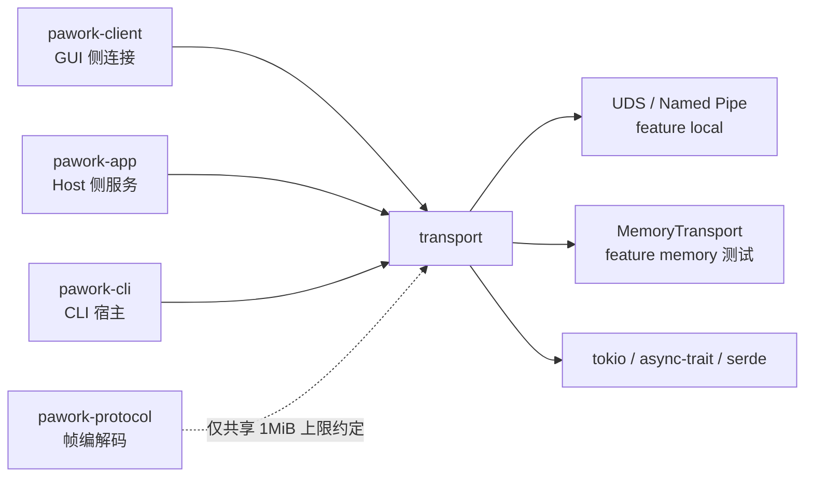

# pawork-transport Review

> GUI Transport 的业务无关抽象与本机实现：只搬运有界字节帧（`[u32 LE len][payload]`），提供 Unix Domain Socket / Windows Named Pipe（feature `local`）与进程内内存通道（feature `memory`），并保留可替换远程 Adapter 契约。6 个 .rs 文件，共 1 733 行，无独立 tests/ 目录（全部内联 `#[cfg(test)]`），模块：api / local（local_unix、local_windows） / memory。

## 1. 职责与边界

pawork-transport 是 GUI Connection Protocol 的字节搬运层：帧边界遵循 pawork-protocol codec 的线上分帧约定（u32 LE 长度前缀），但本 crate 不解析 JSON、不依赖任何 Agent 领域类型（与 pawork-protocol 零依赖，仅靠常量数值约定 `DEFAULT_MAX_FRAME_BYTES == MAX_PROTOCOL_FRAME_BYTES == 1 MiB` 对齐）。Remote 契约（trait / DTO）集中在本 crate 单一来源（P17-14 / S10）：生产 TLS 实现已归档，Mock / 测试支持与未来实现共用同一 trait，避免生产路径依赖 mock。

## 2. 依赖关系

| 方向 | 包 | 用途 |
|---|---|---|
| 本包依赖（pawork-*） | 无 | 业务无关；不依赖 protocol（编解码在上层） |
| 被依赖（生产） | pawork-client、pawork-app、pawork-cli | 默认 feature `local`：UDS / Named Pipe 连接 GUI ↔ CLI Host |
| 被依赖（dev） | pawork-app、pawork-client | feature `local,memory`：进程内回环测试 |

| 外部 crate | 用途 |
|---|---|
| tokio（net/io-util/sync/time/rt） | UnixListener/UnixStream、Named Pipe、duplex 与锁/超时 |
| async-trait | transport trait 的 async 方法 |
| serde | DTO（endpoint/options/info/error）可序列化 |
| thiserror | TransportError 派生 |
| tempfile / serde_json（dev） | 测试临时目录与 JSON 断言 |

feature：`default=["local"]`；`memory` 需显式开启（测试用）；不存在 `remote` feature（生产实现归档）。Windows 命名 pipe 代码仅 `#[cfg(windows)]` 编译，unix 同理。

## 3. 文件清单

| 相对路径 | 行数 | 职责 |
|---|---:|---|
| src/lib.rs | 22 | 模块声明与 feature 门控 re-export（LocalTransport / MemoryTransport 等） |
| src/api.rs | 215 | 业务无关抽象：TransportFrame/Endpoint/Options/Info、四个 transport trait、错误词汇、远程 Adapter 契约 |
| src/local.rs | 419 | LocalTransport（server+client 双角色）与 StreamConnection 有界分帧连接（可续读、取消安全） |
| src/local_unix.rs | 316 | Unix Domain Socket 端点：stale socket 清理、0600 权限、accept/close |
| src/local_windows.rs | 328 | Named Pipe 端点：路径校验、owner-only DACL、connect 重试循环、accept 时建实例 |
| src/memory/mod.rs | 433 | 进程内 Transport：channel 注册表 + 双向 mpsc 连接对（测试用） |

## 4. 类型与方法功能列表

### api.rs — 抽象契约

| 名称 | 种类 | 签名/功能 |
|---|---|---|
| `DEFAULT_MAX_FRAME_BYTES: u64` | const | 1 MiB，与 protocol 的 MAX_PROTOCOL_FRAME_BYTES 一致（类型为 u64） |
| `TransportFrame` | struct | `new(Vec<u8>)` / `as_bytes()` / `into_bytes()`——只拥有字节，无协议语义 |
| `TransportEndpoint` | enum（3） | Local { address } / Remote { address, adapter } / Memory { channel }；serde tag="kind" snake_case |
| `ConnectOptions` | struct | timeout_ms、client_label: Option、max_frame_bytes |
| `ConnectionInfo` | struct | connection_id、locality、peer_label: Option、encrypted、max_frame_bytes |
| `ConnectionLocality` | enum（3） | Local / Remote / InProcess |
| `GuiTransportServer` | trait | `async bind(TransportEndpoint) -> Box<dyn GuiListener>` |
| `GuiListener` | trait | `async accept() -> Box<dyn GuiConnection>`；`async close()` |
| `GuiConnection` | trait | `async send(TransportFrame)`；`async receive() -> TransportFrame`；`async close()`；`fn info() -> ConnectionInfo`（三个 async 方法均 `&self`，连接内部自同步） |
| `GuiTransportClient` | trait | `async connect(endpoint, ConnectOptions) -> Box<dyn GuiConnection>` |
| `TransportErrorKind` | enum（10） | InvalidEndpoint、BindFailed、ConnectionFailed、ConnectionClosed、Timeout、FrameTooLarge、ProtocolViolation、AuthenticationFailed、Unsupported、Internal |
| `TransportError` | struct | { kind, message, retryable }；可序列化、thiserror Display |
| `RemoteTransportDescription` | struct | { adapter, display_name }——provider 描述（CLI 输出与日志） |
| `RemotePublishRequest` | struct | { name }——发布输入 |
| `RemotePublishHandle` | struct | { id, endpoint }——id 供 unpublish/revoke，endpoint 供绑定/连接 |
| `RemoteGuiTransportProvider` | trait | `describe()`；`async publish(request) -> RemotePublishHandle`；`async unpublish(handle_id)`；`async revoke(handle_id)`——revoke 语义：关监听、销毁并即时失效凭证、断开已建连接，撤销后 connect 必须失败 |
| `RemoteGuiConnector` | trait | `async connect(&TransportEndpoint, ConnectOptions) -> Box<dyn GuiConnection>`——返回与本地同一抽象，GUI 协议流程与本地完全一致 |

### local.rs — 本地传输核心

| 名称 | 种类 | 功能 |
|---|---|---|
| `LocalTransport` | struct | `new(max_frame_bytes)`（服务端单帧上限）/ Default（1 MiB）。同一类型同时实现 GuiTransportServer 与 GuiTransportClient：bind/connect 均只接受 `TransportEndpoint::Local`，其余返回 InvalidEndpoint |
| `StreamConnection<R, W>` | struct（pub(crate)） | 基于 tokio split 读写半部的有界分帧连接：reader/writer 各持 tokio Mutex，`send`/`receive`/`close` 可 `&self` 并发安全；closed 为 AtomicBool |
| `ReadHalf<R>` / `ReadState` | struct | `ReadHalf` 为 `pub(crate)`，`ReadState` 私有：读半部 + **跨调用保留的分帧进度**：receive 被超时取消后进度留在连接里，下次从断点续读，不会把半帧残留当新长度前缀 |

私有函数：`is_peer_gone`（BrokenPipe/ConnectionReset/ConnectionAborted/NotConnected/UnexpectedEof → 折成 ConnectionClosed 并标记 closed）；`transport_error` / `connection_closed` / `frame_too_large` / `connection_info` 构造助手；`NEXT_CLIENT_CONNECTION_ID` 静态计数器生成客户端连接 id。

send 路径：先查 closed、再校验 payload ≤ max_frame_bytes、u32 try_from、锁 writer 后写长度前缀 + payload；peer gone 折 ConnectionClosed。receive 路径：逐段填 4 字节头（帧边界上的干净 EOF = 对端正常关闭；半截头 EOF = 流错位，标记关闭）；声明长度在**分配缓冲前**校验超限；payload 循环填满后 take 出帧并 reset；Interrupted 错误 continue。close 路径：swap closed、锁 writer shutdown。

### local_unix.rs — Unix Domain Socket（macOS/Linux）

| 名称 | 种类 | 功能 |
|---|---|---|
| `bind(address, max_frame_bytes)` | pub(super) fn | 检查路径：已是 socket 文件 → 删除 stale 残留；存在但非 socket → BindFailed；不存在 → 直接绑定。bind 后 `set_permissions(0o600)` 限制为 owner-only，失败即 BindFailed。返回 UnixSocketListener |
| `connect(address, options)` | pub(super) async fn | `tokio::time::timeout(timeout_ms, UnixStream::connect)`——超时 Timeout、失败 ConnectionFailed；连接 id 取 `client-N` 全局计数 |
| `UnixSocketListener` | struct | 持 path/listener(Mutex<Option>)/max_frame_bytes/next_connection_id/closed。accept：closed 即 ConnectionClosed，accept 成功后 split 成 StreamConnection（`connection-N`）；close：置 closed、take 掉 listener（停止接新连接）、**删除 socket 文件**（失败 Internal） |

### local_windows.rs — Named Pipe（Windows）

私有常量：`PIPE_PREFIX = r"\\.\pipe\"`、`MAX_PIPE_NAME_BYTES = 256`。

| 名称 | 种类 | 功能 |
|---|---|---|
| `pipe_path(address)` | 私有 fn | 拼接前缀；拒绝空名、>256 字节、含 NUL（防路径穿越），InvalidEndpoint |
| `bind(address, max_frame_bytes)` | pub(super) fn | 仅构造 NamedPipeListener（实例在 accept 时才创建） |
| `connect(address, options)` | pub(super) async fn | 循环 `ClientOptions::open`：ERROR_FILE_NOT_FOUND（服务端未建首实例）与 ERROR_PIPE_BUSY（全忙）为可重试，10ms 间隔至 timeout_ms 到期（超时 Timeout，其余 ConnectionFailed） |
| `create_owner_only_pipe(path, first)` | 私有 fn | SDDL `D:P(A;;GA;;;OW)`（Protected DACL，Generic All 仅创建 owner）经 `ConvertStringSecurityDescriptorToSecurityDescriptorW` + `create_with_security_attributes_raw`；first_pipe_instance 由 first 参数控制；descriptor 用后 LocalFree |
| `NamedPipeListener` | struct | accept：closed 检查 → `first_instance` 计数判定首实例 → create_owner_only_pipe → `connect().await`（客户端断开则 ConnectionFailed）→ split 成 StreamConnection。close：仅置 closed（不删文件系统对象，管道名随进程消失） |

### memory/mod.rs — 进程内 Transport（feature `memory`）

| 名称 | 种类 | 功能 |
|---|---|---|
| `Registry` | 私有 type | `Mutex<HashMap<String, UnboundedSender<Box<dyn GuiConnection>>>>`——channel 名 → 入站连接队列；poison lock 恢复（`into_inner`） |
| `MemoryTransport` | struct | 同一实例可 bind（server）可 connect（client）。`new()`；Clone **共享 registry 但重置 next_id 计数**（测试确定性）；bind：非 Memory 端点 InvalidEndpoint、channel 已占用 BindFailed；connect：查注册表（未绑定 ConnectionFailed），建双向 unbounded mpsc 对，server 侧经 tx 推给 listener，client 侧立即返回 |
| `MemoryListener` | struct | accept：closed 检查后 `rx.recv()`（关闭即 ConnectionClosed）；close：置 closed + 从 registry 摘除 channel |
| `MemoryConnection` | struct | tx: Mutex<Option<Sender>>（close 时 take）/ rx: tokio Mutex。send：closed/超限（FrameTooLarge）/对端关闭（ConnectionClosed）三态；receive：recv 到 None 标记 closed；close：swap + take tx。locality = InProcess，帧大小仍按 max_frame_bytes 校验（与线上行为一致） |

## 5. 关键行为与契约

- **只搬字节**：TransportFrame 不含任何协议/领域类型；JSON 编解码在 protocol。新增依赖即越界。
- **帧上限对齐**：DEFAULT_MAX_FRAME_BYTES（1 MiB）必须与 protocol 的 MAX_PROTOCOL_FRAME_BYTES 同步变化，否则传输层会截断协议层允许的帧（有内联测试钉住该等式）。
- **有界分配**：接收侧在读到 4 字节头后、分配 payload 缓冲**之前**拒绝超限声明——防声明长度 DoS；发送侧 payload 超限在写之前拒绝。
- **取消安全与流完整性**：ReadState 跨 receive 调用保留进度，超时取消后续读不 desync；半截头/半截 payload 的 EOF 视为流错位，立即标记 closed，防止把残留字节当新帧前缀。
- **owner-only 权限**：UDS bind 后强制 0600；Named Pipe 用 SDDL owner-only DACL。降权失败视为 bind 失败，不静默继续。
- **端点类型 fail-closed**：LocalTransport 只收 Local 端点、MemoryTransport 只收 Memory 端点，错配返回 InvalidEndpoint。
- **close 语义**：连接 close 幂等（swap 已关则 Ok）；UDS listener close 删除 socket 文件（重启不留 stale）；Windows listener close 只置标志（实例随 accept 生命周期）。
- **远程 Adapter 单一契约源**：RemoteGuiTransportProvider/RemoteGuiConnector 的 trait/DTO 在本 crate，publish 的端点交给普通 GUI Server 绑定；revoke 必须使后续 connect 失败。未来恢复远程实现时不得复制第二套契约。
- **feature 门**：`local` 默认开启；`memory` 仅测试闭包；两端 feature 不影响 api.rs 的抽象层编译。

## 6. 测试资产

无独立 tests/ 目录；各文件内联 `#[cfg(test)]`（Windows 管道测试仅在 Windows 目标编译）：

| 位置 | 验证点 |
|---|---|
| api.rs | endpoint serde round trip（不需要 protocol 类型）；TransportFrame 只拥有字节 |
| local.rs | DEFAULT_MAX_FRAME_BYTES==1 MiB；非 Local 端点 InvalidEndpoint；半截头/半截 payload 后连接关闭且不再复用；receive 在帧头/帧中间被超时取消后续读完整（不 desync） |
| local_unix.rs | bind 后 socket 权限 0600；双向帧 round trip；发送超限在写前拒绝；原始 socket 写超限声明长度在分配前拒绝；对端关闭→ConnectionClosed、listener close 后 accept 拒绝 |
| local_windows.rs | Named Pipe 双向 round trip（先 spawn accept 再 connect）；超限发送拒绝；listener close 停 accept |
| memory/mod.rs | 双向 round trip + InProcess/locality/peer_label；未绑定 channel connect 失败；重复 bind 失败；对端关闭与 listener 关闭语义；帧上限强制；非 Memory 端点拒绝 |

## 7. 协作关系

