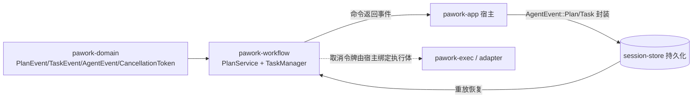

# pawork-workflow Review

> Plan Mode 与后台任务的纯 reducer 层：`plan` 模块提供单 Plan 聚合的步骤状态机、版本修订链、评审/审批 gate 与事件溯源折叠；`task` 模块提供 process/agent/monitor/automation 四类后台任务的注册、状态机、取消传播与 broadcast。两者都只消费 `pawork-domain` 的 canonical 事件，自身零 IO、零持久化。12 个 .rs 文件、共 2 618 行（src 10 文件 1 493 行 + tests 2 文件 1 125 行）；生产依赖仅 `pawork-domain`。

## 1. 职责与边界

- **plan（P16-1/P16-2 Plan Mode）**：进程内内存的单 Plan 聚合——有序步骤状态机（`Pending → InProgress → Completed | Blocked`，`Blocked → InProgress`）、版本整体替换与修订链、评审状态机（`Draft → InReview → ChangesRequested → Approved | Rejected`）、行锚点评审意见、审批 checkpoint 与执行 gate（`is_approved_for_execution`）。
- **task（P16-4 Background Task Manager）**：四类长生命周期任务统一抽象（共用 `BackgroundTaskId`、状态机与事件流句柄）；状态机 `Queued → Running → Suspended → Completed | Failed | Canceled`，全部转移发 canonical `TaskEvent`；按 `parent_task_id` 链取消传播（无孤儿）；任务表 + 事件日志常驻进程内，`snapshot()`/`replay()`/`events_since` 支撑断连续存。
- **不做什么**：canonical 事件（`PlanEvent`/`TaskEvent`）定义在 `pawork-domain`，本包只消费不重定义；不做持久化——命令方法返回事件，由宿主封装为 `AgentEvent::Plan/Task` 写 session-store；`PlanService` 无 spawn/exec/write/文件/网络 API（有源码扫描守护测试）；`TaskManager` 是纯状态机，不拉 `pawork-exec`，取消令牌与实际执行体的绑定由宿主完成，OS 级挂起与进程树清理由 adapter 落地。
- **聚合粒度**：一个 `PlanService` 实例只承载一个 Plan（二次 `create_plan` 报 `AlreadyExists`），多 Plan 场景开多实例；`TaskManager` 经 `Arc` 共享内部状态，`Clone` 即分发同一实例的句柄。

## 2. 依赖关系

**本包依赖的 pawork-* 包**

| 包 | 用途 |
| --- | --- |
| `pawork-domain` | `PlanEvent`/`PlanStepSnapshot`/`PlanStepStatus`/`PlanReviewStatus`/`PlanCommentAnchor`/`PlanId`/`PlanStepId`/`PlanVersionId`/`CheckpointId`；`TaskEvent`/`TaskKind`/`TaskStatus`/`BackgroundTaskId`/`CancellationToken`；`AgentEvent`（事件广播封装） |

**被哪些包依赖**：仅 `pawork-app`（宿主：调用命令面并把返回事件封装落盘）；`pawork-orchestration` 与本包无依赖边（其 Spec 明确禁止依赖 workflow）。

**关键外部 crate**：`serde`（`PlanComment`/`PlanSnapshot`/`PlanVersionInfo`/`TaskSnapshot`/`TaskManagerSnapshot` 序列化）、`thiserror`（两类错误）、`tokio`（`sync::broadcast`；features 声明 `rt`+`sync`，生产代码实际只用 broadcast）。dev：`async-trait`、`serde_json`、`tokio`(macros/rt-multi-thread/time)。

**features**：`default = []`，无具名 feature 门。

## 3. 文件清单

| 路径 | 行数 | 职责 |
| --- | --- | --- |
| src/lib.rs | 9 | 声明 `plan`/`task` 两模块；说明 canonical 事件在 domain |
| src/plan/mod.rs | 34 | Plan 模块文档（只读红线、event-sourcing 设计）与具名 re-export |
| src/plan/error.rs | 58 | `PlanError` 14 变体 |
| src/plan/state.rs | 236 | `PlanState` 聚合、`PlanComment`、`is_legal_step_transition`、`apply`/`replay` 纯折叠 |
| src/plan/service.rs | 486 | `PlanService` 命令面/查询面；ID 计数器分配与重放防碰撞 |
| src/plan/snapshot.rs | 29 | `PlanSnapshot`/`PlanVersionInfo` 查询 DTO（serde） |
| src/task/mod.rs | 39 | Task 模块文档（统一抽象/断连续存/执行所有权边界）与具名 re-export |
| src/task/error.rs | 27 | `TaskManagerError` 4 变体 |
| src/task/state.rs | 313 | `TaskManagerState`/`TaskRecord`/`TaskSnapshot`；`apply` 可失败折叠与查询 |
| src/task/manager.rs | 262 | `TaskManager` 命令面 + broadcast（容量 256）+ cancel 子树传播 |
| tests/plan_service.rs | 788 | 19 个测试：步骤/评审状态机、版本链、重放一致性、只读守护 |
| tests/state_and_replay.rs | 337 | 9 个测试：四类任务注册、生命周期、取消传播、重放与增量 |

## 4. 类型与方法功能列表

### 4.1 顶层模块（lib.rs / plan/mod.rs / task/mod.rs）

lib.rs 仅 `pub mod plan; pub mod task;`，无 glob re-export。两个 mod.rs 承载关键设计文档并做具名导出：plan 导出 `PlanError`、`PlanService`、`PlanSnapshot`/`PlanVersionInfo`、`apply`/`is_legal_step_transition`/`replay`、`PlanComment`/`PlanState`；task 导出 `TaskManagerError`、`TaskManager`、`is_active_status`/`is_terminal_status`、`TaskManagerSnapshot`/`TaskManagerState`/`TaskSnapshot`。

### 4.2 plan::error.rs — PlanError（14 变体）

| 变体 | 语义 |
| --- | --- |
| `AlreadyExists(PlanId)` | 单聚合内二次 `create_plan` |
| `NotCreated` | 尚未创建 Plan 就调用需聚合存在的命令 |
| `StepNotFound(PlanStepId)` | 步骤 id 不存在（update_step / 评论锚点） |
| `IllegalStepTransition { from, to }` | 步骤状态机拒绝的转移 |
| `EmptyPlan` | 创建/替换时步骤列表为空 |
| `EmptyStepText` | 步骤文本为空白 |
| `IllegalReviewTransition { from, to }` | 评审状态机拒绝的转移 |
| `NotChangesRequested { current }` | revise 只允许在 ChangesRequested |
| `VersionMismatch { expected, actual }` | 命令携带版本 ≠ 当前版本 |
| `PlanIdMismatch { expected, actual }` | 命令携带 plan_id ≠ 聚合 plan_id |
| `SameVersion(PlanVersionId)` | revise 新版本与 parent 相同 |
| `DuplicateVersion(PlanVersionId)` | revise 新版本与历史版本冲突 |
| `EmptyReason` | reject 理由为空白 |
| `EmptyComment` | 评论正文为空白 |

Spec 差异：[docs/spec/crates/workflow.md](../../spec/crates/workflow.md) 称「13 变体」，源码实为 14，以源码为准。

### 4.3 plan::state.rs — 聚合与纯折叠

| 名称 | 种类 | 功能/语义 |
| --- | --- | --- |
| `PlanComment` | struct(serde) | `{anchor: PlanCommentAnchor, body: String}`，一条行锚点评审意见 |
| `PlanState` | struct(私有字段) | Plan 聚合当前状态：plan_id/title/steps/current_version/parent_version/history/review_status/comments/approved_checkpoint_id；不执行任何 IO，可自由 Clone/比较 |
| `PlanState` getters | fn | `plan_id/title/current_version/parent_version/steps/review_status/history/approved_checkpoint_id` 只读访问；未创建时 Option 为 None、steps 为空切片 |
| `PlanState::snapshot()` | fn | 构造 `PlanSnapshot`；尚未 Created 返回 `None` |
| `PlanState::step_mut` | pub(crate) fn | 按 id 找可变步骤（StepUpdated 折叠用） |
| `is_legal_step_transition(from, to)` | fn | 合法转移仅 `Pending→InProgress`、`InProgress→Completed`、`InProgress→Blocked`、`Blocked→InProgress`；同态自环、终态跳出、回退 Pending 均非法 |
| `apply(state, event)` | fn | 纯函数折叠，**不可失败**：事件是已校验事实，不再重复状态机校验（校验由命令面完成） |
| `replay(events)` | fn | 从 `Default` 逐步 `apply`，重建聚合 |

`apply` 各变体折叠规则（重构时不能改变的确定性语义）：

- `Created`：覆盖式建立聚合——写入 plan_id/title/steps/current_version，parent 置 None；history **清空重建**（首版入链）；review 复位 Draft；comments 与 checkpoint 清空。
- `StepUpdated`：找到步骤就覆盖 status；未知 step_id 防御性静默忽略（apply 无错误通道）。
- `Replaced`：同一 plan 换新版本——覆盖 title/steps/current_version/parent；history 追加新版本；review 复位 Draft、comments 与 checkpoint 清空。
- `ReviewRequested`：仅当 version 匹配当前版本时推进「评审回合」——`Draft→InReview`、`InReview→ChangesRequested`、其他状态保持；版本不匹配整体忽略（同一事件变体承担两种命令，靠当前状态区分）。
- `Revised`：覆盖 title/steps/version/parent；review 回 Draft、checkpoint 清空；**不清空 comments**（与 Created/Replaced 不同）；history 按 version 去重后追加（重放重复事件不会双写）。
- `Approved` / `Rejected`：仅版本匹配时生效；`Approved` 记录 checkpoint_id（可为 None）、`Rejected` 清 checkpoint。
- `CommentAdded`：无条件追加评论。

### 4.4 plan::service.rs — 命令面

`PlanService { inner: Mutex<Inner> }`，`Inner { state, next_plan, next_version, next_step }`。全部命令方法在同一锁内完成「校验 → 构造事件 → `apply` → 返回事件」，事件由调用方持久化。毒锁策略 `unwrap_or_else(PoisonError::into_inner)`：panic 后继续取回内部数据，不吞错误状态。

| 方法 | 功能/语义 |
| --- | --- |
| `new()` | 空 service（无 Plan） |
| `from_events(events)` | 重放重建 state；`seed_counters` 扫全部事件 id 后缀取 max，计数器 = max+1，防重放后新 id 与历史碰撞 |
| `create_plan(title, step_texts)` | 首版创建：拒绝空 plan / 空白步骤文本 / 已存在；分配 `plan_N`/`planver_N`/`step_N`；返回 `Created` |
| `replace_plan(title, step_texts)` | 整体换版本（parent_version 指旧版）；同样校验非空；未创建报 `NotCreated`；返回 `Replaced` |
| `update_step(step_id, status, note)` | 单步转移：查当前状态并过 `is_legal_step_transition`；返回 `StepUpdated` |
| `plan_snapshot()` / `version_history()` | 查询面：当前快照（未创建 None）/ 版本修订链（含当前版本，按创建顺序） |
| `request_review(version)` | `Draft→InReview`，返回 `ReviewRequested` |
| `request_changes(version)` | `InReview→ChangesRequested`，同样发 `ReviewRequested`（apply 按当前状态折叠） |
| `revise(version, parent_version, title, steps)` | 仅 ChangesRequested：校验 parent == 当前版本、新版本 ≠ parent、不与 history 重复；返回 `Revised`（title/steps 全量写入，ADR-037） |
| `approve(plan_id, version, checkpoint_id?)` | `InReview|ChangesRequested→Approved`；可关联 CheckpointId 作批准点（可回滚）；审批只是 gate 放行，不扩权 |
| `reject(plan_id, version, reason)` | `InReview|ChangesRequested→Rejected`；reason 必填非空白 |
| `add_comment(plan_id, version, anchor, body)` | 行锚点评论：锚点 step_id 必须是当前版本既有步骤，body 非空白 |
| `is_approved_for_execution(plan_id, version)` | 执行 gate：plan_id 与 version 都匹配当前聚合**且** review 为 Approved 才 true；未创建 / 不匹配 / 任何未批准状态一律 false |

私有实现：`check_plan_version`/`check_current_version`（版本化命令共用前置校验）、`build_steps`（`step_N` 递增、初始 Pending）、`seed_counters`（扫 Created/Replaced/Revised 的 id 与步骤 id，以及各版本化事件里的 version 后缀）、`suffix`（解析尾部十进制，无数字返回 0，全程 saturating 算术）。

### 4.5 plan::snapshot.rs

| 名称 | 种类 | 功能/语义 |
| --- | --- | --- |
| `PlanSnapshot` | struct(serde) | `{plan_id, version, title, steps, review_status, comments, approved_checkpoint_id: Option}`——查询面快照，供 CLI/GUI 直接序列化 |
| `PlanVersionInfo` | struct(serde) | `{version, parent_version: Option, title, steps}`——修订链节点 |

### 4.6 task::error.rs — TaskManagerError（4 变体）

| 变体 | 语义 |
| --- | --- |
| `UnknownTask(BackgroundTaskId)` | 引用不存在的任务 |
| `UnknownParent(BackgroundTaskId)` | 注册子任务时父任务不存在 |
| `InvalidTransition { task_id, from, to }` | 状态机拒绝的转移 |
| `InvalidFinishedStatus(TaskStatus)` | finish 只接受 Completed/Failed；Canceled 必须走 cancel |

### 4.7 task::state.rs — 聚合与可失败折叠

| 名称 | 种类 | 功能/语义 |
| --- | --- | --- |
| `is_terminal_status(status)` | fn | Completed/Failed/Canceled 三终态 |
| `is_active_status(status)` | fn | Queued/Running/Suspended 三可转移态 |
| `TaskSnapshot` | struct(serde) | `{task_id, task_kind, parent_task_id?, status, detail?, output_seq, output_bytes}`；`output_seq`/`output_bytes` 注释写明默认档无输出缓冲、恒为 0 |
| `TaskManagerSnapshot` | struct(serde) | `{tasks, events}`——任务视图 + 完整事件日志（重放输入） |
| `TaskRecord` | pub(crate) struct | snapshot + `cancel_token: CancellationToken`（非序列化运行态）；进程类任务取消时触发进程树终止，其他 kind 由 adapter 消费 |
| `TaskManagerState` | struct | `{tasks: BTreeMap<BackgroundTaskId, TaskRecord>, log: Vec<TaskEvent>, next_task_seq}`；日志只追加 |
| `TaskManagerState::apply(event)` | fn | **可失败**折叠（与 plan 不同）：先 `note_allocated_id` 推进 allocator，再按变体转移，成功后追加日志 |
| `task/tasks/snapshot/event_log/events_since` | fn | 查询面；`events_since(seq)` 用日志下标切片（seq 与下标一一对应，越界返回空） |
| `insert_queued` | pub(crate) fn | 注册 Queued（父任务必须存在），**不发事件**——持久化前瞬态 |
| `remove_queued` | pub(crate) fn | 仅 Queued 可移除（spawn 失败清理 / 取消 queued） |
| `status` / `cancel_token` | pub(crate) fn | 命令辅助读取 |
| `subtree(root)` | pub(crate) fn | 按 parent_task_id 建邻接表后 BFS 收集 root 及全部后代（含 root） |
| `allocate_task_id` | 私有 fn | `task_N` 循环避让已占用 id |
| `note_allocated_id` | 私有 fn | 从事件 id 尾号推进 allocator（重放后新 id 不回退、不碰撞） |

`apply` 各变体规则：`Started` 幂等（entry or_insert Running；已存在则刷新 kind/parent/status=Running、detail 清空，重放重复 Started 不报错）；`Suspended` 前置必须 Running；`Resumed` 前置必须 Suspended；`Finished` 要求 status 是终态（否则 `InvalidFinishedStatus`）且任务存在、前置 Running|Suspended（否则 `UnknownTask`/`InvalidTransition`）。

### 4.8 task::manager.rs — 命令面与广播

`DEFAULT_BROADCAST_CAPACITY = 256`。`TaskManager { inner: Arc<TaskManagerInner> }`（Inner = Mutex<TaskManagerState> + broadcast::Sender<AgentEvent>），Clone 共享同一实例。

| 方法 | 功能/语义 |
| --- | --- |
| `new()` / `with_capacity(capacity)` | 构造；with_capacity 供测试调小广播容量制造 Lagged |
| `subscribe()` | 返回 `broadcast::Receiver<AgentEvent>`；收到 Lagged 表示错过事件，恢复协议是 `snapshot()` + `events_since` |
| `register(task_kind, parent_task_id?)` | 注册 Queued，不发事件；返回新 BackgroundTaskId |
| `start(task_id)` | Queued→Running，发 `Started`（前置非 Queued 报 InvalidTransition） |
| `suspend(task_id)` | Running→Suspended，发 `Suspended`；逻辑挂起，OS 级暂停由 adapter 落地 |
| `resume(task_id)` | Suspended→Running，发 `Resumed` |
| `finish(task_id, status, detail?)` | 只接受 Completed/Failed（Canceled 走 cancel）；前置 Running|Suspended；发 `Finished` |
| `cancel(task_id)` | 子树取消（见下），返回全部事件 |
| `task/tasks/snapshot/event_log/events_since` | 查询面透传 state |
| `replay(events)` | 逐事件 apply 重建状态与日志，**不重复广播**；返回折叠计数 |

`cancel` 语义（改动时注意顺序）：锁内 `subtree` 收集 → 逐个处理（Queued 静默移除不发事件；Running|Suspended 逐个 `apply(Finished{Canceled})`，root detail 为 "canceled by user"、后代为 "canceled via parent task"，同时收集取消令牌；终态跳过）→ 释放锁 → 先触发全部令牌 → 再逐个 broadcast。先落状态、后触发令牌、最后广播，保证订阅者看到的事件与状态一致且无孤儿。

私有实现：`transition`（apply 成功后锁外 broadcast 单事件）、`broadcast`（`let _ = live.send(event)`——无订阅者/溢出均忽略，best-effort）、`lock`（毒锁 `into_inner`）。

## 5. 关键行为与契约

- **三条冻结状态机**（改任何一条都会破坏已持久化事件的可重放性）：步骤 `Pending→InProgress→Completed|Blocked`、`Blocked→InProgress`；评审 `Draft→InReview→ChangesRequested`（revise 回 Draft 循环）→ `Approved|Rejected`；任务 `Queued→Running→Suspended⇄Running→Completed|Failed|Canceled`。
- **两种 apply 容错策略**：`plan::apply` 不可失败（事件即事实，未知 step 防御性忽略）；`task::apply` 可失败（校验前置态并返回 `TaskManagerError`）。重放中混入非法 TaskEvent 会让整段重放报错——持久化侧必须只写入命令面产出的事件。
- **Queued 瞬态契约**：注册不发事件、取消 Queued 静默移除；重放以 `Started` 为任务创建点，未 start 过的任务重放后不存在。
- **只读红线（plan）**：三个守护测试钉住——`source_has_no_io_or_spawn_api` 用 `include_str!` 扫 plan/ 五个源文件，断言不含 `std::process`/`std::fs`/`tokio::spawn`/`reqwest` 等 13 个禁用 token（只扫 plan/，不扫 task/）；`plan_with_write_action_descriptions_is_inert` 钉住危险步骤文本原样保留不执行；`review_surface_adds_no_write_or_exec_api` 钉住 service 方法面无 write/exec/spawn/run/apply 等前缀 API。
- **ID 分配与重放防碰撞**：`plan_N`/`planver_N`/`step_N`/`task_N`；Plan 侧 from_events 后计数器 = 历史 max+1；Task 侧每次 apply 都 `note_allocated_id` 推进 allocator。手工构造、不带 `task_` 前缀尾号的事件不推进 allocator，可能碰撞——id 应以命令面产出为准。
- **取消传播无孤儿**：cancel 沿 parent 链 BFS 全后代；Queued 移除、活动态发 Canceled、终态跳过；顺序为先状态、后令牌、再广播。
- **广播 best-effort，事实源是事件日志**：`send` 失败（无接收者 / 慢消费者 Lagged）静默忽略；客户端恢复路径固定为 snapshot + events_since。
- **版本链不变量**：revise 要求 parent == 当前版本、新版本 ≠ parent、不与 history 重复；`Created`/`Replaced` 后 review 复位 Draft、comments 与 checkpoint 清空；`Revised` 只复位 review 与 checkpoint，**不清空 comments**。
- **审批 gate 只读判定**：`is_approved_for_execution` 要求 plan_id + version 双匹配且 Approved；approve 可关联 CheckpointId 作回滚点，但不授予任何写/执行能力。
- **锁策略**：两处 Mutex 均毒锁 `into_inner`（panic 后继续用内部数据）；`TaskManager` 的锁只在状态转移期间持有，广播与令牌触发都在锁外，慢订阅者不阻塞命令面。
- **已知局限/差异**：`TaskSnapshot.output_seq`/`output_bytes` 恒 0，且 doc 注释提到的 `output_since` 续读 API 当前不存在；Cargo.toml description 仍写「plan/goal/task/automation/monitor 五合一 reducer」，实际仅 plan/task 两模块（Goal/Automation/Monitor 已随 V2 归档，tag v2-final）；Spec 称 `PlanError` 13 变体，源码为 14。

## 6. 测试资产

**tests/plan_service.rs（788 行，19 test）**

| 测试 | 验证点 |
| --- | --- |
| `legal_transitions_succeed` / `illegal_transitions_rejected` | 步骤状态机合法/非法转移 |
| `replay_matches_live_service_and_manual_apply` | from_events 重放 == 活实例 == 手工 apply |
| `version_history_forms_chain` | 修订链 parent 指针成链 |
| `command_errors` | create/replace/update 各错误分支 |
| `plan_with_write_action_descriptions_is_inert` | 危险步骤文本原样保留、无副作用（只读红线） |
| `source_has_no_io_or_spawn_api` | plan/ 源码扫描无 IO/spawn 入口（只读红线） |
| `plan_event_round_trips_through_agent_event` / `review_events_round_trip_through_agent_event` | PlanEvent 经 AgentEvent 封装往返无损 |
| `review_revise_approve_flow_with_checkpoint` | 评审→修订→审批全流程 + checkpoint |
| `approval_gate_closed_until_approved` | gate 在 Approved 前关闭 |
| `illegal_review_transitions_rejected` | 评审非法转移报错 |
| `approve_or_reject_directly_from_review` | InReview 可直接 approve/reject |
| `comments_carry_line_anchors` | 行锚点评论 |
| `revise_validates_version_chain` / `revise_replay_preserves_content_and_rejects_duplicate_version` | revise 版本校验与重放内容保持 |
| `review_command_errors` | 评审命令错误分支 |
| `review_flow_replays_identically` | 评审流程重放一致 |
| `review_surface_adds_no_write_or_exec_api` | service 方法面无写/执行 API（只读红线） |

**tests/state_and_replay.rs（337 行，9 test）**

| 测试 | 验证点 |
| --- | --- |
| `four_kinds_register_and_query` | 四类 TaskKind 注册与查询 |
| `legal_lifecycle_emits_events` | 合法生命周期逐步发事件 |
| `illegal_transitions_rejected` | 未知任务 / 非法转移 / finish Canceled 报错 |
| `snapshot_and_replay_rebuild_view` / `pure_state_apply_folds_events` | 快照与纯 state 折叠重建视图 |
| `cancel_propagates_to_descendants_without_orphans` | 取消传播全后代无孤儿 |
| `cancel_skips_terminal_and_removes_queued` | 终态跳过、Queued 静默移除 |
| `events_since_returns_increment` | 增量续读 |
| `replay_advances_id_allocator` | 重放推进 id 分配器（新 id 不碰撞） |

## 7. 协作关系

`pawork-orchestration` 与本包无依赖边（其边界明确禁止依赖 workflow）；GUI 侧也不直接触碰本包，Plan/Task 视图经宿主投影。

