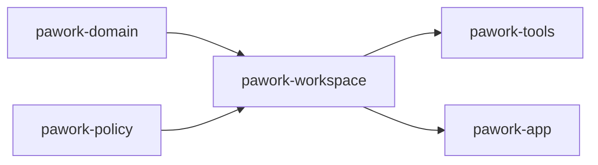

# pawork-workspace Review
> Workspace 根登记、相对路径安全解析、文件索引、六层配置、确定性资源加载与五来源兼容导入：位于 `pawork-domain` / `pawork-policy` 之上的工作区事实层。35 个 `.rs` 文件 / 15299 行；主模块 `lib`+`path`+`file_index`、`config/`、`resources/`、`import/`。

## 1. 职责与边界

四个子系统同 crate 共存，对外是工作区事实层，不是运行时执行层：

1. **根服务与路径**（`lib.rs` / `path.rs` / `file_index.rs`）：进程内登记 workspace（canonicalize + 去重）、`workspace 相对路径 → 绝对路径` 的安全解析、全量/增量文件索引与 `notify` 去抖看护。
2. **config**：`Builtin < Global < Profile < Workspace < Session < Run` 六层发现、安全剥离与合并，产出带 provenance 与告警的 `ResolvedConfig`；Global 层有独立 RMW 写盘入口。
3. **resources**：确定性加载 `AGENTS.md` 层级、Skills（manifest + 依赖闭包）与 Agent Profile（v1 自动迁 v2），汇总为按 `ResourceInstructionKind::priority()` 排序的注入指令。
4. **import**：只读探测 Claude / Codex / Grok / Cursor / Pi 五来源，映射为 canonical 计划；另附本机会话文件发现（`session_scan`，只列路径不读内容）。

路径安全内核（symlink 逃逸 / `.git` 段 / TOCTOU）**委托 `pawork-policy`**；本包只补 Windows 盘符、UNC、`//` 与保留设备名。import 是输入侧 Adapter：只读、不执行外部内容、不改写源文件；导入结果永远不是运行时事实源。不做 SQLite 持久化、不做网络、不存明文 Secret。

改动时保持 `workspace_id + root_index + relative_path` 输入契约；配置写盘只走 Global RMW，不要绕过 `strip_untrusted_layer` 把 privilege / egress / terminal 键写进非 Global 层。

## 2. 依赖关系

| 方向 | crate | 用途 |
| --- | --- | --- |
| 依赖 | `pawork-domain` | `WorkspaceId`；Profile v2 域类型（`AgentProfileV2` / `ProfileToolRules` / `ReasoningEffort` / `ProfileRef` / `MemoryPrivacy` 等） |
| 依赖 | `pawork-policy` | `resolve_workspace_path`、`canonicalize_platform` / `path_within_root` / `relative_to_root`、`PathSafetyError`、`ApprovalMode` |
| 被依赖 | `pawork-tools` | 文件系统工具经 `WorkspaceService` 解析路径；MCP 配置消费 `ResolvedConfig` |
| 被依赖 | `pawork-app` | 宿主装配 config / resources / import，与 tools 共享同一 `WorkspaceService` |
| 外部 | `directories` | 平台配置目录；`LocalSessionRoots::detect` 的 home |
| 外部 | `dunce` | 去掉 Windows `\\?\` verbatim 前缀 |
| 外部 | `ignore` + `notify` | 文件索引 WalkBuilder / gitignore 与 RecommendedWatcher |
| 外部 | `semver`（serde） | Skill 版本与 Profile 引用 semver |
| 外部 | `serde` / `serde_json` / `toml` | 配置与资源序列化；loader 经 TOML→JSON 往返再投影 schema |
| 外部 | `thiserror` | 各子系统错误枚举 |
| 外部 | `tokio`（macros/rt/sync/time） | `FileIndex` 阻塞扫描与去抖循环 |
| 外部 | `libc`（unix） | import 的 `openat` + `O_NOFOLLOW` 句柄链 |
| 外部 | `tempfile`（dev） | 集成测试夹具 |

无 feature 门。`import/hook.rs` 与 `import/mcp.rs` 是导入专用平行类型，刻意不依赖 hook / MCP runtime。

## 3. 文件清单

| 相对路径 | 行数 | 职责 |
| --- | ---: | --- |
| `src/lib.rs` | 215 | `Workspace` / `WorkspaceService` / `WorkspaceError`；子模块声明与 re-export |
| `src/path.rs` | 246 | `resolve_relative_path`：本层拦截绝对路径/设备名，其余委托 policy |
| `src/file_index.rs` | 1113 | 全量扫描、增量、模糊搜索、去抖看护、`notify` watcher |
| `src/config/mod.rs` | 92 | `ConfigTier` 与 config 公开 re-export |
| `src/config/schema.rs` | 515 | `PaworkConfig` 及 Provider/Profile/Terminal/Overrides schema |
| `src/config/paths.rs` | 143 | 平台配置目录与 workspace `.pawork/config.toml` 定位 |
| `src/config/merge.rs` | 159 | `ConfigValue` / `Merge` / `merge_json` / `merge_ordered` |
| `src/config/error.rs` | 68 | `ConfigParseError` / `ConfigError`（均带路径） |
| `src/config/loader.rs` | 1462 | 六层装配、剥离、合并、provenance |
| `src/config/writer.rs` | 792 | Global 层 RMW 写盘十一入口 |
| `src/resources/mod.rs` | 30 | resources 公开面与安全文档 |
| `src/resources/request.rs` | 180 | `WorkspaceRelativePath` / `ResourceRequest` / limits / options |
| `src/resources/error.rs` | 53 | `ResourceLoadError` + crate-private `ResourceFileError` |
| `src/resources/source.rs` | 212 | 溯源 `ResourceKind` / `ResourceOrigin` / 诊断 |
| `src/resources/io.rs` | 288 | canonical-within 读、标识符与相对引用校验 |
| `src/resources/agents.rs` | 497 | `AGENTS.md` 层级发现 |
| `src/resources/skills.rs` | 1555 | Skill 装载、依赖 BFS、冲突剔除 |
| `src/resources/profiles.rs` | 1965 | Profile v1/v2、明文 Secret 扫描、memory 标注 |
| `src/resources/loader.rs` | 631 | `ResourceLoader::load` 聚合与注入排序 |
| `src/import/mod.rs` | 41 | import 安全边界与 re-export |
| `src/import/source.rs` | 104 | `ExternalSource` 五源 + `SourceFileKind` + `GlobalSource` |
| `src/import/model.rs` | 280 | `CompatPlan` / `CompatItem` / payload / 状态 |
| `src/import/limits.rs` | 31 | `CompatLimits` 硬上限 |
| `src/import/error.rs` | 40 | `CompatError` 硬错误（与条目级 `CompatIssue` 分开） |
| `src/import/detect.rs` | 585 | 静态候选 + glob + AGENTS.md 层级探测 |
| `src/import/io.rs` | 379 | Unix `openat` no-follow 读、原子写、FNV-64 |
| `src/import/frontmatter.rs` | 138 | 极简 YAML 顶层标量解析 |
| `src/import/parse.rs` | 1385 | 八类文件 → canonical 条目 |
| `src/import/map.rs` | 72 | 同 `(category, id)` 冲突裁决 |
| `src/import/mcp.rs` | 141 | 导入版 MCP 配置（`SecretRef{service,account}`） |
| `src/import/hook.rs` | 245 | 导入版 Hook 配置（17 个 `TriggerPoint`） |
| `src/import/apply.rs` | 317 | `CompatLoader::scan/dry_run/export_plan` |
| `src/import/session_scan.rs` | 320 | Claude/Codex 本机会话只读发现（排除 sidecar） |
| `tests/loader_file.rs` | 462 | 真实文件系统上的六层合并与安全剥离 |
| `tests/smoke.rs` | 543 | 五源夹具上的 import 安全与幂等 |

`fixtures/` 不是源码：五来源目录 + `.mcp.json` + `AGENTS.md` / `CLAUDE.md`，供 `tests/smoke.rs` 使用。

## 4. 类型与方法功能列表

### 4.1 根服务（`src/lib.rs`）

| 名称 | 种类 | 功能 / 语义 |
| --- | --- | --- |
| `Workspace` | pub struct | `id: WorkspaceId` / `name` / `roots`。roots 已经 `fs::canonicalize` + `dunce::simplified`。可 serde，供上层快照。 |
| `WorkspaceService` | pub struct | 进程内 `Arc<RwLock<BTreeMap<WorkspaceId, Workspace>>>`，无持久化。 |
| `WorkspaceService::new` | pub fn | 空目录。 |
| `WorkspaceService::canonicalize_root` | pub fn | 与 `add` 同一规则规范化单个 root；ADR-044 持久登记前的去重键。 |
| `WorkspaceService::add` | pub fn | 规范化 roots → 去重 → 拒空集 / 非目录 / 重复 id / 锁毒化。返回已插入的 `Workspace`。 |
| `WorkspaceService::get` | pub fn | `Result<Option<Workspace>, WorkspaceError>`；找不到是 `Ok(None)`，不构造 `NotFound`。 |
| `WorkspaceError` | pub enum | `AlreadyExists(String)` / `NotFound(String)` / `NoRoots` / `RootIsNotDirectory(PathBuf)` / `InvalidRoot { path, source }` / `DuplicateWorkspaceId` / `Poisoned`。本 crate 只构造 `AlreadyExists` / `NoRoots` / `RootIsNotDirectory` / `InvalidRoot` / `Poisoned`；`NotFound` 与 `DuplicateWorkspaceId` 无构造点，留给上层快照/导入。 |

私有：`normalize_roots` 用 `path_key`（`\`→`/`，Windows 再 `to_ascii_lowercase`）去重；`canonicalize_simplified` 去 `\\?\`。改去重键会同时影响持久登记与 `FileIndex` 的 root 对齐。

### 4.2 路径（`src/path.rs`）

| 名称 | 种类 | 功能 / 语义 |
| --- | --- | --- |
| `ResolvedPath` | pub struct | `absolute` / `root` / `relative`（已规范化、无 `.` / `..`）。 |
| `WorkspacePathError` | pub enum | `Empty` / `AbsolutePath` / `Traversal(String)` / `ReservedDeviceName(String)` / `SymlinkEscape` / `GitInternals` / `NonRegular` / `NoRoot` / `Io`。由 `From<PathSafetyError>` 一一映射（本层多一个 `ReservedDeviceName`）。 |
| `resolve_relative_path` | pub fn | 空串→`Empty`；`Path::is_absolute` 或 `\\` / `//` 或 `X:` 盘符→`AbsolutePath`；任一 Normal 分量命中保留设备名（CON/PRN/AUX/NUL/COM1-9/LPT1-9，忽略尾随 `.` / 空格、大小写不敏感）→`ReservedDeviceName`；其余交 `pawork_policy::resolve_workspace_path`。按 roots **登记顺序**命中第一个 root，即使文件只存在于后续 root。 |

改签名会立刻打断本包 `resources/io.rs`（`join_under_root`）。`pawork-tools` 文件工具不走本函数，而是 `WorkspaceService` 取 roots 后经 `pawork_policy::resolve_workspace_path`（`common::resolve_write_rel`）。Windows 盘符检查必须留在本层：Unix 上 `Path::is_absolute` 不会把 `C:\...` 当绝对路径。

### 4.3 文件索引（`src/file_index.rs`）

| 名称 | 种类 | 功能 / 语义 |
| --- | --- | --- |
| `IndexOptions` | pub struct | `global_ignore_files` / `workspace_ignore_files`（宿主注入）、`excluded_directories` 默认十项（`.git` / `.hg` / `.svn` / `node_modules` / `target` / `.next` / `dist` / `build` / `.cache` / `vendor`）、`binary_probe_bytes=8KiB`。 |
| `FileKey` | pub struct | `{root_index, relative_path}`，正斜杠、可排序。不接受绝对路径。 |
| `IndexedFile` | pub struct | key + `size` / `modified_at_ms` / `language` / `binary`。语言按扩展名映射（rs→rust，toml，md→markdown，json，js/mjs/cjs→javascript，ts/tsx→typescript，py→python，go，java，c/h→c，cc/cpp/hpp→cpp，yml/yaml→yaml，sh→shell，ps1→powershell），未知为 `None`。 |
| `IndexSnapshot` | pub struct | `workspace_id` / `roots` / `generation` / `scan_duration_ms` / `files`。generation 从 1 起，全量或增量成功都 +1。 |
| `FileIndex` | pub struct | `Arc<RwLock<BTreeMap<WorkspaceId, WorkspaceIndex>>>`。 |
| `FileIndex::new` | pub fn | 接收 `IndexOptions`，建空索引。 |
| `scan_workspace` | pub async fn | `spawn_blocking` 全量扫描；写回前 generation CAS：扫描期间代次已变则丢弃本次结果，返回当前快照。成功则整体替换并 `generation+1`。 |
| `snapshot` | pub fn | 读当前代；未索引返回 `Ok(None)`。 |
| `search` | pub fn | 未索引→`WorkspaceNotIndexed`（不是空集）。ASCII 大小写不敏感：先 `find` 连续子串（靠前加分、文件名再 +5000），否则子序列模糊。`limit==0` 直接空。 |
| `apply_changes` | pub async fn | 空变更直接 snapshot；目录变更或「已删路径是某索引文件前缀」升级为全量 `scan_workspace`；否则 blocking 增量 upsert/remove，generation+1。 |
| `start_debounced_updates` | pub fn | 有界 mpsc(256) + 去抖循环，返回 `DebouncedUpdateHandle`。 |
| `watch_workspace` | pub fn | `notify::RecommendedWatcher` 递归看每个 root，事件进同一去抖通道。 |
| `ChangeKind` | pub enum | `Upsert` / `Remove`。 |
| `PathChange` | pub struct | `{path, kind}`。绝对路径由 watcher 给出，内部 `locate_root` 再映射到 `FileKey`。 |
| `DebouncedUpdateHandle` | pub struct | `submit` / `errors` / `errors_truncated` / `dropped_events` / `shutdown`。Drop 只发 stop，不等待 task。 |
| `WorkspaceWatcher` | pub struct | 持有 watcher + handle；观测面转调 handle。 |
| `FileIndexError` | pub enum | `WorkspaceNotIndexed` / `Poisoned` / `OutsideRoot` / `Io { path, source }` / `Ignore` / `Task` / `WatcherStopped` / `Notify`。 |

私有实现：`scan` 用 `WalkBuilder`（`follow_links(false)`，hidden=false，gitignore/exclude 开，`require_git(false)`）；排除目录只在 depth>0 的目录名上过滤。二进制判定：样本含 NUL，或控制字节占比 >10%。`watcher_changes` 把 `event.need_rescan()`（`Flag::Rescan`）转为每个 root 一条 Upsert，避免空路径丢事件。错误缓冲 1024，溢出丢最旧并插入截断标记；通道满 `try_send` 不阻塞，`dropped_events` 计数。全量扫描 CAS 防止慢扫描覆盖期间已应用的增量。

### 4.4 config

#### `config/mod.rs` — `ConfigTier`

| 名称 | 种类 | 功能 / 语义 |
| --- | --- | --- |
| `ConfigTier` | pub enum | `Builtin` / `Global` / `Profile` / `Workspace` / `Session` / `Run`（serde snake_case，Ord 即优先级）。 |
| `priority()` | const fn | 0..5。 |
| `source_key()` / `as_str()` | const fn | `builtin` / `global` / `profile` / `workspace` / `session` / `run`。同层多来源另用自定义 source_key 排序。 |

公开 writer 十一入口：`write_approval_mode` / `write_workspace_trust` / `write_default_model_pair` / `write_naming_model_pair` / `write_model_pair` / `write_provider_disabled_models` / `write_provider_model_preferences` / `write_proxy_url` / `write_provider_use_proxy` / `write_mcp_server_remove` / `write_terminal_settings`。`merge_json` 不在公开面（仅 `merge_ordered` / `ConfigValue` / `Merge`）。

#### `config/schema.rs`

| 名称 | 种类 | 功能 / 语义 |
| --- | --- | --- |
| `PaworkConfig` | pub struct | 全字段 Option/空集合可叠加。顶层：`profile`、`default_provider`/`default_model`、`naming_provider`/`naming_model`（ADR-054）、`vision_provider`/`vision_model`、`search_provider`/`search_model`（ADR-055，Global 独占）、`providers`、`models`、`profiles`、`trust_workspaces`、`approval_mode: Option<ApprovalMode>`、`workspace_trust: BTreeMap<String, bool>`、`proxy_url`、`terminal`、`extra`（flatten；反序列化剥 `api_key`）。**无 `api_key` 字段**。 |
| `PaworkConfig::builtin` | pub fn | 仅 `trust_workspaces = Some(false)`。 |
| `PaworkConfig::merge_with` | pub fn | 强类型 Option 取 higher 非空；`workspace_trust` 是 `extend`（按键叠加而非整表替换）；providers/models/profiles 非空则整表替换。**Spec 差异**：该函数不合并 `naming_provider` / `naming_model`。Loader 走 JSON `merge_json`，这两键仍会按对象键合并；只有调用 `merge_with` 的路径会丢 naming 对。 |
| `PaworkConfig::is_model_enabled` | pub fn | denylist：无该 provider 或键缺失 → 启用。 |
| `TerminalConfig` | pub struct | `shell` / `columns` / `rows` 均 Option。仅 Global 可写入。 |
| `ProviderConfig` | pub struct | `id` / `base_url` / `default` / `use_proxy` / `disabled_models`。未知键（含 `api_key`）被 serde 丢弃。 |
| `ModelConfig` | pub struct | `id` / `context_window` / `max_output`。 |
| `ProfileConfig` | pub struct | `name` + flatten `ProfileOverrides`。 |
| `ProfileOverrides` | pub struct | `default_provider` / `default_model` + extra。 |
| `SessionOverrides` | pub struct | 还可改 `profile`。 |
| `RunOverrides` | pub struct | default provider/model + extra。 |

#### `config/paths.rs`

| 名称 | 种类 | 功能 / 语义 |
| --- | --- | --- |
| `APP_QUALIFIER` / `APP_ORGANIZATION` / `APP_APPLICATION` | pub const | `dev` / `pawork` / `pawork`。macOS 目录 `~/Library/Application Support/dev.pawork.pawork/`。 |
| `GLOBAL_CONFIG_FILENAME` / `WORKSPACE_CONFIG_DIR` / `WORKSPACE_CONFIG_FILENAME` | pub const | `config.toml` / `.pawork` / `config.toml`。 |
| `config_dir_for_app` | pub fn | `directories::ProjectDirs`。 |
| `global_config_path` | pub fn | `<config_dir>/config.toml`。 |
| `workspace_config_path` | pub fn | `<root>/.pawork/config.toml`。 |
| `locate_workspace_config` | pub fn | 自 start canonicalize 后向上找最近 `.pawork/config.toml`。 |
| `default_search_roots` | pub fn | 全局路径 + 就近 workspace 路径；顺序不参与合并。 |

#### `config/merge.rs`

| 名称 | 种类 | 功能 / 语义 |
| --- | --- | --- |
| `ConfigValue` | pub struct | JSON 擦除包装；`as_value_mut` 供 loader 就地剥离。 |
| `Merge` | pub trait | `fn merge(&mut self, other: &Self)`，other 优先。 |
| `merge_json` | 模块内 pub | 对象按键递归；标量/数组整体替换。不对外 re-export。 |
| `merge_ordered` | pub fn | 低→高依序 merge；空迭代得空对象。 |

#### `config/error.rs`

| 名称 | 种类 | 功能 / 语义 |
| --- | --- | --- |
| `ConfigParseError` | pub enum | `Toml { path, source }` / `Schema { path, source }`；`path()` 访问器。 |
| `ConfigError` | pub enum | `Parse` / `Io { path, source }` / `Write { path, source }`；`path()` 可选。 |

#### `config/loader.rs`

| 名称 | 种类 | 功能 / 语义 |
| --- | --- | --- |
| `ConfigSource` | pub struct | `tier` / `source_key` / `path` / `value`。 |
| `LoadedSourceSpan` | pub struct | 精简 provenance。 |
| `LoadedSource` | pub struct | span + 剥离后的 value 快照。 |
| `ConfigWarning` | pub enum | 九变体：`PermissionsIgnored { key, tier, source_key, path }` / `TrustWorkspacesIgnored` / `ProxyUrlIgnored` / `ProviderBaseUrlIgnored`（含 `use_proxy`） / `ProviderDisabledModelsIgnored` / `GlobalRoleModelIgnored { key, ... }` / `McpTrustedIgnored` / `McpAutoStartIgnored` / `TerminalIgnored`。 |
| `ResolvedConfig` | pub struct | `config` / `sources`（优先级升序） / `active_profile` / `warnings`。 |
| `Loader` | pub struct | 构建器；`pending_error` 把文件解析失败延迟到 `resolve`。 |
| `with_builtin` / `with_value` / `with_file` / `with_session` / `with_run` | pub fn | Session/Run 永不由 `discover*` 自动加入。 |
| `discover` / `discover_from` | pub fn | Builtin + 存在的 Global 文件 + 存在的 Workspace 文件；缺失静默跳过。 |
| `resolve` | pub fn | 见 §5 六层流程。 |

私有：`strip_untrusted_layer` 对非 Builtin/Global **只剥字段不删段**：顶层 `approval_mode` / `workspace_trust` / `trust_workspaces` / `proxy_url` / `terminal`、vision/search 四键、`providers[].base_url|use_proxy|disabled_models`、`mcp.servers.*.trusted|auto_start`。`sanitize_secrets` 剥根级与 `providers[].api_key`（`parse_file` 后 + `resolve` 开头各一次）。文件层 schema 校验发生在剥离之后，因此非 Global 的非法 `approval_mode = 'yolo'` 可启动；Global 非法值仍带原路径报错。Profile 派生：从已合并 raw 取 `profile` 名，`profiles` 数组从后往前找同名，去掉 `name` 后插入 Global 与 Workspace 之间，source_key=`profile:{name}`。显式 `ConfigTier::Profile` 来源也会参与第二遍排序，不会被丢弃。

#### `config/writer.rs`

公开入口都只表达键语义，共用 `rmw_global_config`：进程内 `Mutex<()>` 包住 `read_table` → mutate → 可选 `atomic_write_table`。锁毒化 `into_inner` 继续。临时文件名 `{stem}.{pid}.{TEMP_SUFFIX}.tmp`。缺失文件当空表。

| 名称 | 种类 | 功能 / 语义 |
| --- | --- | --- |
| `write_approval_mode` | pub fn | 写顶层 `approval_mode`。 |
| `write_workspace_trust` | pub fn | 只改 `workspace_trust[root]`，不替换其它根。非 table 则 fail-closed。 |
| `write_default_model_pair` / `write_naming_model_pair` | pub fn | `write_model_pair` 薄包装。 |
| `write_model_pair` | pub fn | `Some` 写两键；`None` 移除存在的一半，两键都不在则不写盘。 |
| `write_proxy_url` | pub fn | `Some` 覆盖 / `None` 移除；清除时仍写盘（空表也写）。 |
| `write_provider_use_proxy` | pub fn | 命中 id 改 `use_proxy`，否则追加 `{id, use_proxy}`。`providers` 非数组 fail-closed。 |
| `write_provider_disabled_models` | pub fn | 转调 preferences，`clear_pairs=[]`。 |
| `write_provider_model_preferences` | pub fn | 同一次原子提交：清角色键对 + 写/清 denylist。空 denylist 且无条目且无清除 → 不写盘。 |
| `write_mcp_server_remove` | pub fn | 键缺失 `Ok(false)` 不写盘；成功 `Ok(true)`。 |
| `write_terminal_settings` | pub fn | 全态写 `[terminal]`：`shell=None` 删键，columns/rows 总是写入；非 table 旧值重建为空表。 |

改写盘路径不要引入第二套锁；跨进程只靠 rename 原子性，没有文件锁。

### 4.5 resources

调用方只能用 `workspace_id + root_index + relative_path`；单资源损坏隔离为 `ResourceIssue`，不拖垮整批。Prompt 模板字段已声明，本包不做发现与 `@file` 展开。`LanguageServer` / `UserHook` 已在 `ResourceKind` 声明，加载器当前只装 Instructions / AgentsFile / Skill / AgentProfile。

#### `resources/mod.rs`

公开面：`AgentsDocument` / `AgentsHierarchy`、`ResourceLoadError`、`ResourceBundle` / `ResourceInstruction*` / `ResourceLoader`、`AgentProfile` / `LoadedAgentProfileV2` / `ResolvedInstructions`、request 类型、skill 类型、source 诊断类型。模块文档强调来源不泄漏宿主绝对路径。

#### `resources/request.rs`

| 名称 | 种类 | 功能 / 语义 |
| --- | --- | --- |
| `WorkspaceRelativePath` | pub struct | 构造与 serde 反序列化都拒绝绝对路径 / `Prefix` / `RootDir` / `..`；丢掉 `.`。`validate()` 再走一遍 `new`。 |
| `CurrentPathKind` | pub enum | `Directory` / `File`（默认）。决定 AGENTS.md 链终点是当前路径还是父目录。 |
| `ResourceSelection` | pub struct | `active_skills` / `disabled_skills`、`prompt_template` + `prompt_arguments`、`profile`、`session_instructions` / `run_instructions`。 |
| `ResourceRequest` | pub struct | `workspace_id` / `root_index` / `current_path` / `current_path_kind` / `selection`。`new` 默认 File + 空 selection。 |
| `ResourceLimits` | pub struct | 默认 `max_file_bytes=1MiB`、`max_resources_per_kind=1024`、`max_template_file_refs=32`、`max_rendered_prompt_bytes=4MiB`。后两键本包无消费者。 |
| `ResourceLoaderOptions` | pub struct | `global_resource_dir`（宿主解析，非模型输入）、`workspace_resource_dir` 默认 `.pawork`、`limits`、`memory_available` 默认 false。 |

#### `resources/error.rs`

| 名称 | 种类 | 功能 / 语义 |
| --- | --- | --- |
| `ResourceLoadError` | pub enum | `Workspace` / `WorkspaceNotFound` / `RootIndexOutOfRange` / `InvalidRelativePath` / `PathEscapesWorkspace` / `Watcher` / `InitialLoad`。后两变体本包无构造点。 |
| `ResourceFileError` | pub(crate) enum | `NotFound` / `TooLarge` / `InvalidUtf8` / `NotRegularFile` / `OutsideRoot` / `Io`；`code()` 给诊断码。单文件失败走 issue，不升为 `ResourceLoadError`。 |

#### `resources/source.rs`

| 名称 | 种类 | 功能 / 语义 |
| --- | --- | --- |
| `ResourceKind` | pub enum | `Instructions` / `AgentsFile` / `Skill` / `PromptTemplate` / `AgentProfile` / `LanguageServer` / `UserHook`。 |
| `ResourceOrigin` | pub enum | `Global{relative_path}` / `Workspace{root_index, relative_path}` / `Session{name}` / `Run{name}`。禁止绝对路径。 |
| `ResourceProvenance` | pub struct | `tier` + `source_key` + `origin`。 |
| `ResourceDiagnosticStatus` | pub enum | `Loaded` / `Active` / `Overridden` / `Disabled` / `Rejected`。 |
| `ResourceDiagnosticEntry` | pub struct | 元数据视图，不含正文。 |
| `ResourceIssueSeverity` | pub enum | `Warning` / `Error`。 |
| `ResourceIssue` | pub struct | `warning` / `error` / `for_resource`。消息不得含正文或 Secret。 |
| `ResourceDiagnostics` | pub struct | `sort_deterministically`：entries 按 kind/id/tier/source_key/status；issues 按 severity/code/kind/id/source_key/message。 |

#### `resources/io.rs`（crate-private）

| 名称 | 种类 | 功能 / 语义 |
| --- | --- | --- |
| `join_under_root` | fn | 走 `resolve_relative_path`，失败 → `OutsideRoot`。 |
| `canonical_within` | fn | 两侧 `canonicalize_platform` 后再 `path_within_root`。 |
| `read_utf8_bounded` | fn | 常规文件 + 大小上限 + UTF-8；先 metadata 再 `take(limit+1)`。 |
| `read_utf8_bounded_within` | fn | canonical-within 后再读，挡 symlink 逃逸。 |
| `sorted_children` / `sorted_children_within` | fn | 按 `path_key` 排序后截断到 `maximum`；目录缺失当空。 |
| `workspace_relative_key` | fn | `relative_to_root`，失败退到文件名。 |
| `is_valid_identifier` | fn | 非空 ASCII 字母数字 + `-` / `_`，可选 `.`。 |
| `is_safe_relative_reference` | fn | 拒空/空白、盘符、绝对、`..`；须有 Normal 分量。 |
| `parse_toml_resource` | fn | TOML 失败返回固定 `ResourceIssue`，不回显正文。 |

改路径安全时继续委托 policy，不要在本文件再写 canonicalize。

#### `resources/agents.rs`

| 名称 | 种类 | 功能 / 语义 |
| --- | --- | --- |
| `AgentsDocument` | pub struct | `provenance` + `body`；`relative_path()` 只从 Workspace origin 取。 |
| `AgentsHierarchy` | pub struct | 根→近路径排序；`nearest()` = last。 |
| `load_agents_hierarchy` | pub(crate) fn | 从 root 到 current 目录链找 `AGENTS.md`。File 去掉最后分量，Directory 含自身。缺失静默跳过；根无法 canonicalize 或目标越界 → `agents_symlink_out_of_bounds`。source_key=`workspace:{root_index:08}:agents:{depth:08}:{rel}`。 |

#### `resources/skills.rs`

约定目录 `skills/<name>/{manifest.toml,SKILL.md}`。脚本/资产只声明不执行。Workspace 覆盖 Global。

| 名称 | 种类 | 功能 / 语义 |
| --- | --- | --- |
| `SkillParameter` | pub struct | `name` / `description` / `required` / `default`。 |
| `SkillScript` | pub struct | `name` / `path` / `description` / `arguments`。path 必须安全相对。 |
| `SkillDependency` | pub struct | `id` + `version`（默认 `*`）。 |
| `SkillManifest` | pub struct | `id` / `version: semver::Version` / description / parameters / dependencies / conflicts / scripts / assets / permissions。 |
| `LoadedSkill` | pub struct | manifest + SKILL.md 正文 + provenance。 |
| `SkillResolution` | pub struct | `skills` 仅最终激活集；diagnostics 含全部已发现状态。 |
| `load_skills` | pub(crate) fn | 扫描 Global `skills/` 与各 root `<workspace_resource_dir>/skills/`。 |

私有：`RawManifest.version` 先当字符串以便精确 semver 错误。id/参数/脚本/依赖/冲突须 identifier（允许 `.`）。同层重复按 `source_key` 升序，最大 key 留下并 `skill_duplicate`。激活：`disabled` 优先于 `active`；未知 id 只警告。单次 BFS 记 `DepEdge::{Valid,Disabled,Missing,VersionMismatch}`；`active_from` 反向剔除依赖链断裂者再从 seeds 沿完好边走。双向冲突（任一方声明）双方剔除后重收敛。status：Disabled / Active / Rejected（候选但未激活）/ Loaded。SKILL.md 可选 YAML frontmatter 只取 `name`/`description`，description 仅在 manifest 为空时回填。

#### `resources/profiles.rs`

v1：`name/instructions/default_provider/default_model`。v2：`AgentProfileV2` 全维度。`#[serde(deny_unknown_fields)]`。

| 名称 | 种类 | 功能 / 语义 |
| --- | --- | --- |
| `AgentProfile` | pub struct | v1 兼容视图。 |
| `LoadedAgentProfileV2` | pub struct | 领域类型 + provenance；`compat_view` 把 `prompt.system` + 可选 extra 拼成 instructions。 |
| `InstructionLayer` | pub struct | `tier` / `source_key` / `instructions` / `provenance`。 |
| `ResolvedInstructions` | pub struct | profile < session < run；`ordered_layers()`。 |
| `ProfileResolution` | pub(crate) struct | profiles / profiles_v2 / instructions / diagnostics / effective map。 |
| `load_profiles` | pub(crate) fn | Global `profiles/*.toml` + 各 root `<dir>/profiles/*.toml`；同 name 后写入覆盖（Workspace 后扫，覆盖 Global）。 |
| `resolve_profile_references` | pub(crate) fn | **只对照已激活 skill 集**（`SkillResolution.skills`）；失败剔除 profile。hooks 本波不解析；mcp/permissions 只做格式。 |

私有 schema：显式 `v1` 含 v2 字段、`v2` 含 v1 字段、无 schema 混用 → `agent_profile_schema_field_conflict`；无 schema 且仅 v2 字段按 v2。v1 迁移：instructions → `prompt.system`（空则失败），其余维度默认。明文 Secret 双扫（raw + canonical）：`sk-` / `ghp_` / `xoxb-` / `xoxp-` / `AKIA` / PEM / `eyJ` JWT / `Bearer `；诊断只报字段路径。tool 名 identifier + 去重。ref：id 合法、version 为 `*`/`latest`/semver、同类 id 不重复。`max_turns==0` 失败。`memory.enabled` 且宿主 `memory_available=false` 且文件未写 unavailable → 写入固定文案 + `agent_profile_memory_unavailable`。选中的 profile 不在 effective → `agent_profile_not_found`，session/run 指令仍保留。

#### `resources/loader.rs`

| 名称 | 种类 | 功能 / 语义 |
| --- | --- | --- |
| `ResourceInstructionKind` | pub enum | 九类；`priority()`：AgentProfile=2、UserGlobal=4、Workspace=5、RootAgents=6、PathAgents=7、ActiveSkill=8、PromptTemplate=9、Session=13、Run=14。缺 0/1/3/10–12，改数字会立刻改注入序。 |
| `ResourceInstruction` | pub struct | 中性 DTO：kind / resource_id / content / provenance；`byte_len()` = content 字节。 |
| `ResourceBundle` | pub struct | agents / skills / profiles / profiles_v2 / resolved_instructions / instructions / diagnostics。 |
| `ResourceLoader` | pub struct | 持 `WorkspaceService` + options。 |
| `load` | pub fn | 校验 resource_dir 相对且无 `..` → get workspace → root_index → agents/skills/profiles → resolve refs → 拼 instructions 后按 priority/tier/source_key/id 排序。 |

私有：`instructions.md` 空文件 warning、缺失静默。根 `AGENTS.md` → RootAgentsFile，其余 PathAgentsFile。skill 只把激活集推进 ActiveSkill。profile 层只从 ResolvedInstructions 取 Profile/Session/Run。

### 4.6 import

输入侧 Adapter：只读、不执行、不改源文件、明文 Secret 不进计划。`ImportStatus::Disabled` 已声明且 preview 映射 `disabled`，**源码无构造点**；hook 默认禁用靠 `HookConfig.enabled=false`。

#### `import/mod.rs` / `source.rs` / `limits.rs` / `error.rs`

| 名称 | 种类 | 功能 / 语义 |
| --- | --- | --- |
| `ExternalSource` | pub enum | `Claude` / `Codex` / `Grok` / `Cursor` / `Pi`；`rank()` 1..5，同 tier 冲突大者胜。 |
| `SourceFileKind` | pub(crate) enum | InstructionsDoc / ClaudeSettings / ConfigToml / McpJson / SkillMarkdown / AgentMarkdown / AgentsJson / PiSettings。 |
| `GlobalSource` | pub struct | 全局根默认不读，须显式传入。 |
| `CompatLimits` | pub struct | 1MiB / 256 per-kind / 2048 total / depth 32 / dir 4096。 |
| `CompatError` | pub enum | `Io{path,source}` / `OutOfBounds` / `Invalid` / `LimitExceeded` / `UnsafeTarget`。条目问题走 `CompatIssue`。 |

**Spec 差异**：任务/经验里的 `CompatImportConflict` 不在本 crate。sidecar 冲突在 storage 导入；本包用排除 `agent-*.jsonl` 预防。条目冲突是 `ImportStatus::Conflict` + `conflict_loser`。

#### `import/model.rs`

| 名称 | 种类 | 功能 / 语义 |
| --- | --- | --- |
| `ImportCategory` | pub enum | Instructions / Skill / McpServer / AgentProfile / UserHook / PermissionRule。 |
| `ImportStatus` | pub enum | Imported / Disabled / Unsupported / Conflict。 |
| `PermissionDecision` | pub enum | Allow / Ask / Deny；`precedence` Deny=2 > Ask=1 > Allow=0。 |
| `ImportSource` | pub struct | external + tier + relative_path。 |
| `PendingCredential` | pub struct | 只留 name + location。 |
| `CredentialReference` | pub struct | `service` / `account` / location + source。 |
| `CompatIssue` | pub struct | warning/error + `for_item` / `with_source`。 |
| `CompatPayload` | pub enum | Instructions{kind,body,depth} / Skill{manifest,body} / McpServer{name,server,pending} / AgentProfile / UserHook / PermissionRule{tool,decision,spec,approval_mode}。 |
| `CompatItem` | pub struct | Imported 必有 payload；其余清空。 |
| `IssueSeverity` | pub enum | `Warning` / `Error`（serde snake_case）；crate 根 re-export。 |
| `CompatPlan` | pub struct | manifest_version + `sources: BTreeSet<ExternalSource>` + items + issues + credential_references + fingerprint；`sort_deterministically`。 |
| `DetectedSourceSummary` | pub struct | `external` / `tier` / `relative_path` / `kind`；探测摘要，crate 根 re-export，不含宿主绝对路径与正文。 |

#### `import/detect.rs`

静态表（workspace）：`CLAUDE.md` / `.claude/settings*.json` / `.codex/config.toml|agents.json|mcp.json` / `.grok/config.toml` / `.cursor/mcp.json|instructions.md` / `.cursorrules` / `.pi/settings.json|SYSTEM.md|APPEND_SYSTEM.md`；共享 `.mcp.json`（Claude/Grok/Cursor）；workspace 另把 `AGENTS.md` 记给 Codex/Grok/Pi。Glob：rules/skills/agents/commands 等。`DetectedFile.primary()` = claimants 排序后最小（Claude 优先），只影响解析归因，不参与冲突胜负。限额即时截断并记 `scan_total_limit` / `scan_kind_limit` / `scan_dir_limit` / `scan_depth_limit`。AGENTS.md 层级 DFS：跳过 `.` 前缀与 symlink 目录。全局探测只扫对应来源候选，Codex/Grok/Pi 另注册根级 `AGENTS.md`。

#### `import/io.rs`

Unix：`openat` + `O_NOFOLLOW` 句柄链，中间 `O_DIRECTORY`，末级 `O_NONBLOCK` 拒 FIFO 阻塞；`ELOOP`/`ENOTDIR` → Invalid。Windows：`OPEN_REPARSE_POINT` 拒 reparse。`read_utf8_bounded(root, rel, max)` 按句柄 `take(max+1)`。`atomic_write`：create_new tmp → sync → rename 前再查目标非 symlink。`fnv64` 仅幂等指纹。

#### `import/frontmatter.rs`

`split_frontmatter`：`---` fence 内只取顶层标量；空值或嵌套/列表记 `complex_keys`（不复制值）；无闭合 fence 整文当 body。

#### `import/parse.rs`

`parse_content` 按 `SourceFileKind` 分派。id 经 `sanitize_id`（非 alnum/-/_ → `-`，小写）。工具清单 `!x`/`-x` 进 denied，denied 从 allowed 剔除。

- InstructionsDoc：Global→UserGlobalInstructions，否则 WorkspaceInstructions；depth=路径段数。
- SkillMarkdown：name/version/description/allowed-tools；缺 version → 0.1.0；complex_keys → `skill_key_unmapped`。
- AgentMarkdown / agents.json：`build_profile`，provider=来源名，effort=Medium；json `hooks` 不导入但 `requires_review`。
- McpJson / toml `mcp_servers` / Pi mcp：stdio(`command`) 或 http(`url`)；sse/streamable-http → Unsupported；`auto_start=false` `trusted=false` `requires_review`。环境插值 `${VAR}` / `$VAR` → `SecretRef{service=pawork.mcp.<server>, account=<server>:<key>}`；字面量丢弃 + `PendingCredential` + `plaintext_secret_rejected`。
- Codex/Grok config.toml：`approval_policy`：`on-request`→AlwaysAsk；`on-failure`→NeverAsk + `approval_on_failure_mapped`；`never` 不导入。`hooks` / model / sandbox 等只告警。
- Claude settings：`bypassPermissions` 永不导入；`acceptEdits`→NeverAsk + 同告警码；`default`/`plan`→AskForWrites。allow/ask/deny 列表抽 tool 名；Deny 不要审查，Allow/Ask 要。env 只报条数不复制值。
- Claude hooks：事件 snake_case 映射 17 个 TriggerPoint；prompt handler / 未知事件 Unsupported。command 空白切 program/args，`enabled=false` `lifecycle=Async` `requires_review`；matcher 不导入。
- Pi settings：`instructions` 字符串 + mcpServers/mcp。

#### `import/map.rs`

同 `(category, id)`：先 `ConfigTier.priority()`，再 `ExternalSource.rank()`，再相对路径字典序；胜者出栈。多来源竞争胜者 `requires_review=true`；败者 `Conflict`、payload 清空、`conflict_loser`。

#### `import/mcp.rs` / `hook.rs`

导入专用平行类型，不依赖 runtime。MCP：`TransportSpec::{Stdio,Http}`、`RestartPolicy` 默认 1/200ms/10s、`McpPermissions.max_output_bytes=1MiB`。Hook：`TriggerPoint` 17 变体；`HandlerConfig` 六变体（解析目前只产 Command）；`HookScope::covers`；`default_enabled()=true` 仅 serde 缺省，导入路径强制 false。两套 `SecretRef` 形状不同（hook 透明 String vs mcp service/account），改类型时不要混。

#### `import/apply.rs`

| 名称 | 种类 | 功能 / 语义 |
| --- | --- | --- |
| `PLAN_FILE_NAME` / `FINGERPRINT_FILE_NAME` | const | `compat-import.json` / `.compat-import-fingerprint`。 |
| `ExportOutcome` | pub enum | `Exported` / `Noop`。 |
| `ExportReport` | pub struct | outcome / items / bytes_written / plan_path。 |
| `CompatLoader::scan` | pub fn | 探测+解析+冲突裁决；fingerprint 混 `FINGERPRINT_FORMAT_VERSION=1`、manifest_version、内容链。无 workspace_id 时 hook scope=Global。 |
| `dry_run` | pub fn | `plan.preview()`，无正文/参数/Secret。 |
| `export_plan` | pub fn | 拒输出目录与目标 symlink；指纹命中且磁盘字节==当前序列化才 Noop，否则原子写两文件。 |
| `CompatPlan::select` | pub fn | 子集 + 过滤 credential；指纹再混入 length-prefixed ids，避免拼接歧义。 |
| `counts_by_status` | pub fn | 各状态计数。 |

#### `import/session_scan.rs`

| 名称 | 种类 | 功能 / 语义 |
| --- | --- | --- |
| `LocalSessionSource` | pub enum | Claude / Codex；`from_external` 其余 None。 |
| `LocalSessionRoots` | pub struct | `~/.claude/projects`、`~/.codex/sessions`。 |
| `LocalSessionFile` | pub struct | source / path / size_bytes，不读内容。 |
| `scan_local_sessions` | pub fn | 根不存在→空；非目录→Invalid；超限→`LimitExceeded`（不静默截断）；symlink 跳过。Claude：`*.jsonl` 且 **排除 `agent-*` sidecar**；Codex：仅 `rollout-*.jsonl`。结果按路径排序。 |

## 5. 关键行为与契约

**六层配置。** Builtin(0) < Global(1) < Profile(2) < Workspace(3) < Session(4) < Run(5)。`discover*` 只装配前三文件层（Builtin+存在的 Global/Workspace）；Session/Run 永不自动加入。resolve：sanitize_secrets → strip_untrusted_layer（非 Builtin/Global 只剥字段）→ schema（剥离之后，故非 Global 非法 `approval_mode='yolo'` 可启动）→ 按 profile 名从 `profiles` 数组**从后往前**派生一层插在 Global 与 Workspace 之间 → JSON `merge_json`（对象按键递归，数组整表替换）。Global 独占：`approval_mode` / `workspace_trust` / `trust_workspaces` / `proxy_url` / `terminal` / vision+search 四键 / `providers[].base_url|use_proxy|disabled_models` / `mcp.servers.*.trusted|auto_start`。`PaworkConfig::merge_with` **不合并** `naming_provider`/`naming_model`；Loader 不走该函数。

**路径委托 policy。** 本层只拦空串、绝对路径、UNC（`\\` / `//`）、盘符、保留设备名；symlink / `.git` / TOCTOU / 非常规文件由 `pawork_policy::resolve_workspace_path`。多 root 按登记顺序第一命中。resources IO 用 `canonicalize_platform` + `path_within_root`；import IO 自管 no-follow，两套上限与错误类型不要合并或复制。

**配置写盘 RMW。** 十一入口共用进程内 `Mutex<()>`（毒化 `into_inner` 继续）+ read_table + 可选 atomic rename。无文件锁。未知字段保留。`write_mcp_server_remove` 键缺失 `Ok(false)` 不写盘。

**文件索引。** 全量 `spawn_blocking` + generation CAS：扫描期间代次已变则丢弃。`Flag::Rescan` 且路径空 → 每个 root 一条 Upsert，避免丢事件。目录变更或删除前缀升级全量。search 未索引是错误不是空集。

**资源注入序。** 按 `ResourceInstructionKind::priority()`，同分再 tier/source_key/id。Skill 激活闭包与 Profile skill 引用都只看见**激活集**，改 `load_skills` 输出语义会连带让 profile 引用失败。memory 不可用时显式 `Unavailable`，禁止改成静默可用。

**import 冲突。** 同 `(category, id)`：tier → source rank → 相对路径。败者 Conflict + 空 payload + `conflict_loser`。危险权限（`bypassPermissions` / Codex `never`）Unsupported，不放宽为 Allow。`on-failure` / `acceptEdits` 映射 NeverAsk（决策面仍是 Ask）并告警。

**session_scan sidecar。** Claude `agent-*.jsonl` 复用父 sessionId；扫描层排除，否则上层全量导入会 identity 冲突。本包不出现 `CompatImportConflict` 符号。

## 6. 测试资产

| 文件 | 验证点 |
| --- | --- |
| `tests/loader_file.rs` | 真实 FS：六层合并、profile 插层、Session/Run、`api_key` 剥离且 Debug 无泄漏、路径带错、locate 就近、加入顺序无关、workspace 不能设 proxy/base_url/MCP 特权、macOS `dev.pawork.pawork`。 |
| `tests/smoke.rs` | fixtures 五源六类；明文 token 不进计划；同 tier rank / 跨 tier priority；export 幂等且不改源；select 独立指纹；symlink 不跟随；per-kind/total 硬截断；`on-failure`/`acceptEdits`→Ask；危险内容隔离。 |
| `src/lib.rs` | roots canonicalize 去重；Windows 大小写去重。 |
| `src/path.rs` | 空/绝对/逃逸/设备名/`.git`/symlink/第一 root。 |
| `src/file_index.rs` | gitignore 排除、增量去抖、通道满不阻塞、stale 全量 CAS、Rescan 每 root、错误缓冲 1024。 |
| `src/config/*` | merge 递归/数组替换；loader 九类剥离 golden；writer 原子写、未知字段、proxy/use_proxy/mcp remove/denylist/角色对。 |
| `src/resources/*` | 相对路径不变量；AGENTS 层级与越界隔离；skill 依赖/冲突/disabled 优先；profile v1 迁 v2、明文 Secret、memory unavailable、skill ref fail-closed；loader 损坏隔离、注入序、symlink 逃逸。 |
| `src/import/*` | frontmatter 标量；session_scan 排除 sidecar / 不跟随 symlink / 超深 LimitExceeded。 |

`fixtures/` 不是源码：`.claude` / `.codex` / `.cursor` / `.grok` / `.pi` + `.mcp.json` + `AGENTS.md` / `CLAUDE.md`。

## 7. 协作关系

上游：`WorkspaceId` 与 Profile v2 域类型来自 domain；路径内核与 `ApprovalMode` 来自 policy。下游：tools 经 `WorkspaceService` 取 roots，路径解析走 `pawork_policy::resolve_workspace_path`（`common::resolve_write_rel`），MCP 消费 `ResolvedConfig`；app 装配 config / resources / import，并与 tools 共享同一 `WorkspaceService`。import 的 hook/mcp 类型到运行时配置的落地在 app，不在本包。持久 workspace 登记在 storage（本包只提供 `canonicalize_root` 去重键）。
