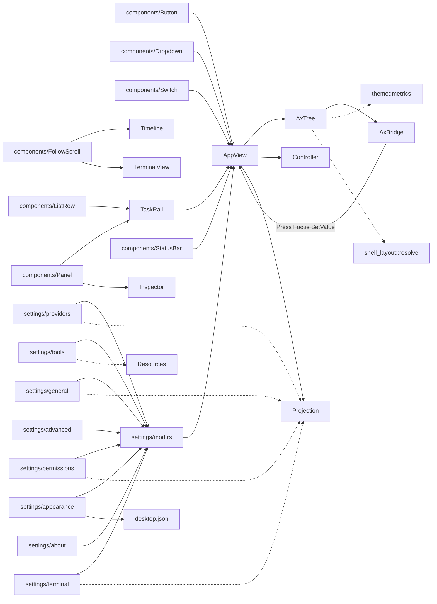

# Desktop 组件库 / Settings / 无障碍 Review

> 可复用 GPUI 控件、Settings 八页与显式 AX 语义树（含 macOS AppKit 桥）。范围内 32 个 `.rs` 文件 / 14 897 行（含测试；`ui/accessibility.rs` 为 facade，没有独立 `accessibility/mod.rs`）。事实源为当前工作区源码；与 Spec 冲突处以源码为准并标注。

## 1. 职责与边界

本篇覆盖 `ui/components/`、`ui/settings/`、`ui/accessibility.rs` + `ui/accessibility/`。它们仍是 **GPUI view 层**，不直连 Provider / DB / 工具；写操作经 `AppView` → `DesktopController`。

- **components/**：无业务状态的 `RenderOnce` 控件。菜单 Escape 由 `AppView` 根节点处理，组件无 Escape API。Button/Switch/ListRow 同时提供 `on_click` 与 `on_activate`（Enter/Space），disabled 不发动作。
- **settings/**：Settings 壳替换 TaskRail；返回恢复工作台，不取消 Run。无真实读写能力的页不显示。内容全宽 + 32px pad（无 820px 上限）。写路径三同源（可见/键盘/AX），回执即写后状态，不乐观更新。
- **accessibility/**：显式语义树，不读 GPUI 私有 frame、不做 OCR。`handle_accessibility_request` 先 `permits()` 再分发。macOS 用 AppKit 虚拟 AX 元素；坐标顶左 → 父空间底左。

Settings 路由下工作台快捷键旁路，见 [views.md](views.md)。Appearance / Advanced 离线可进；Network / Approvals / Tools / Terminal 依赖对应 Host 查询成功；About 依赖握手非空 `host_data_dir`。

**Spec / 注释与源码差异：**

| 位置 | Spec / 注释说法 | 源码事实 |
| --- | --- | --- |
| Settings Network | 产品名 Network | 枚举 `SettingsPage::General`、模块 `settings/general.rs`、AX `settings_general_page_ax` |
| `settings/appearance.rs` 模块注释 | 语言「不持久化」 | `AppView::set_language` 写入 `desktop.json`（与字号同口径） |
| Settings 内容宽 | 早期 820px 钳制 | OPT-4c：Rail 外全宽 + 两侧 32px，各页不再复制上限 |
| AX | 可能被当成读 GPUI 无障碍树 | 自建 `AxTree`，每帧 `sync_accessibility` 推桥 |

## 2. 文件清单

| 相对路径 | 行数 | 职责 |
| --- | ---: | --- |
| `apps/desktop/src/ui/components/mod.rs` | 14 | 组件族 `pub mod` |
| `apps/desktop/src/ui/components/button.rs` | 396 | Button 五变体 + 焦点/键盘激活 |
| `apps/desktop/src/ui/components/dropdown.rs` | 250 | Dropdown / MenuPanel / MenuRow 浮层 |
| `apps/desktop/src/ui/components/focus_ring.rs` | 28 | 零布局参与的焦点描边 |
| `apps/desktop/src/ui/components/follow_scroll.rs` | 94 | FollowScroll + BackToBottom |
| `apps/desktop/src/ui/components/label.rs` | 71 | Label / Badge |
| `apps/desktop/src/ui/components/list_row.rs` | 174 | task / project_header 行 |
| `apps/desktop/src/ui/components/panel.rs` | 78 | 左右侧栏 Panel |
| `apps/desktop/src/ui/components/status_bar.rs` | 70 | 24px StatusBar |
| `apps/desktop/src/ui/components/switch.rs` | 159 | 36×20 Switch |
| `apps/desktop/src/ui/settings/mod.rs` | 1386 | Settings 壳、导航、identifier 解析、写 gate |
| `apps/desktop/src/ui/settings/providers.rs` | 1996 | Models & providers 页 |
| `apps/desktop/src/ui/settings/general.rs` | 207 | Network 页（proxy） |
| `apps/desktop/src/ui/settings/permissions.rs` | 326 | 权限与审批页 |
| `apps/desktop/src/ui/settings/tools.rs` | 256 | 工具与 MCP 页 |
| `apps/desktop/src/ui/settings/terminal.rs` | 253 | 终端默认尺寸/shell 页 |
| `apps/desktop/src/ui/settings/appearance.rs` | 251 | 字号与语言（本地） |
| `apps/desktop/src/ui/settings/advanced.rs` | 172 | 连接诊断只读页 |
| `apps/desktop/src/ui/settings/about.rs` | 96 | 关于页 |
| `apps/desktop/src/ui/settings/approval_labels.rs` | 32 | 五档审批文案 |
| `apps/desktop/src/ui/accessibility.rs` | 417 | AxRole/AxNode/AxTree/AxBridge facade |
| `apps/desktop/src/ui/accessibility/app.rs` | 4733 | 工作台 AX 树与 Press 分发 |
| `apps/desktop/src/ui/accessibility/macos.rs` | 937 | AppKit 虚拟元素桥 |
| `apps/desktop/src/ui/accessibility/settings.rs` | 366 | Settings Rail / 内容壳 AX |
| `apps/desktop/src/ui/accessibility/settings_providers.rs` | 1005 | Providers 页 AX |
| `apps/desktop/src/ui/accessibility/settings_general.rs` | 173 | Network 页 AX |
| `apps/desktop/src/ui/accessibility/settings_permissions.rs` | 225 | 权限页 AX |
| `apps/desktop/src/ui/accessibility/settings_tools.rs` | 157 | Tools 页 AX |
| `apps/desktop/src/ui/accessibility/settings_terminal.rs` | 249 | Terminal 页 AX |
| `apps/desktop/src/ui/accessibility/settings_appearance.rs` | 187 | Appearance 页 AX |
| `apps/desktop/src/ui/accessibility/settings_advanced.rs` | 88 | Advanced 页 AX |
| `apps/desktop/src/ui/accessibility/settings_about.rs` | 51 | About 页 AX |


## 3. 通用组件库

`components/mod.rs` 只 re-export 子模块，无逻辑。控件全部 `RenderOnce`（无 Entity 状态），状态由调用方（几乎总是 `AppView`）持有。

### 3.1 Button（`button.rs`）

| 名称 | 种类 | 功能 / 语义 |
| --- | --- | --- |
| `ButtonVariant` | enum | Ghost / Raised / Primary / Success / Danger |
| `ButtonPadding` | enum | None / Compact / Horizontal(px) / Wide |
| `Button::new(id)` | 构造 | 稳定 element id（AX / 测试 / 键盘吞 click 用同一 id） |
| `variant/disabled/label/tooltip/track_focus/text_size/text_color/disabled_text_color/padding/width/height/max_width/bordered/radius/center/vcenter/icon_circle` | builder | 几何与色；`icon_circle` 做 36×36 圆钮（Composer Send/Cancel） |
| `on_click` / `on_activate` | 事件 | click 给鼠标；activate 给 Enter/Space。**disabled 两路都不挂** |
| `ButtonVariant::colors/text_color/disabled_bg/disabled_text_color` | 内部 | token 映射 |
| `RenderOnce` | 实现 | 持焦时叠 `focus_ring`；tooltip 走 AppView `tooltip_text` |

改动注意：调用方必须用 `consume_button_key_click` 吞 keyup 合成 click，否则 Enter 会触发两次。Composer Send/Cancel 必须共用 id `composer-action` 以免状态切换留下幽灵 tab stop。

### 3.2 Dropdown / MenuPanel / MenuRow（`dropdown.rs`）

| 名称 | 种类 | 功能 / 语义 |
| --- | --- | --- |
| `ANCHOR_GAP_Y` / `MENU_MAX_HEIGHT` 240 | const | 锚点间隙；长列表内部滚动 |
| `MenuRow` | RenderOnce | id / label / selected / highlighted / disabled / on_click |
| `MenuPanel` | RenderOnce | 容器；`child/children/max_height/dismiss_on_outside`；`occlude()` 吃外点 |
| `Dropdown` | RenderOnce | trigger + 可选 panel；`panel_anchor(Corner, Point)` |
| `RenderOnce for Dropdown` | 实现 | `deferred(anchored())` 浮层，不占布局 |

**无 Escape API**：Escape 由 `AppView::handle_root_key` 关菜单并回焦触发器。开新菜单必须经 `AppView::toggle_menu`（单一 `open_menu`）。Composer 模型菜单明确从触发器上方打开（BottomLeft + 负 gap），Settings 角色菜单同构。

### 3.3 focus_ring（`focus_ring.rs`）

| 名称 | 种类 | 功能 / 语义 |
| --- | --- | --- |
| `focus_ring(radius)` | fn | `absolute().inset_0` 的 2px accent 描边，**零布局参与**（OPT-4d：选中/焦点不得推移文字） |

gpui border 参与 Taffy，按需出现会挤内容。Settings 导航选中态用绝对定位左缘指示条 + 本 overlay，禁止改回 `border`。

### 3.4 FollowScroll / BackToBottom（`follow_scroll.rs`）

| 名称 | 种类 | 功能 / 语义 |
| --- | --- | --- |
| `FollowScroll` | 值对象 | 宿主持有；默认 following=true |
| `handle` / `is_following` / `is_scrolled_to_bottom` | API | 贴底：`max<=ε 或 y <= slack-max` |
| `on_scroll_wheel` | 方法 | **直读贴底，禁止 delta 投影**（gpui 0.2.2 Bubble 逆序双计） |
| `content_arriving` / `follow_new_content` / `jump_to_bottom` | 方法 | 新内容到达先判断脱钩，仍跟随才滚底 |
| `BackToBottom` | RenderOnce | 右下绝对定位容器，child 由调用方给 Button |

Timeline 虚拟化**不用**本组件（走 ListState + `timeline_following`）；Terminal 输出区用本组件。两套跟随语义不要混用。

### 3.5 Label / Badge（`label.rs`）

| 名称 | 种类 | 功能 / 语义 |
| --- | --- | --- |
| `Label::new/size/color` | RenderOnce | 默认 BODY + text.primary |
| `Badge::new` | RenderOnce | StatusBar 居中 Run 状态；raised 底 + 小字 |

### 3.6 ListRow（`list_row.rs`）

| 名称 | 种类 | 功能 / 语义 |
| --- | --- | --- |
| `ListRowKind` | enum | `Task { selected }` / `ProjectHeader` |
| `task` / `project_header` | 构造 | 任务行 44px；项目头 36px |
| `track_focus/height/child/on_click/on_activate` | builder | 与 Button 同构的键盘激活 |
| `RenderOnce` | 实现 | 选中 raised 底；持焦 focus_ring |

TaskRail 任务/项目头、Timeline tool group 头、Changes 文件行都用它。行 id 必须稳定（session_id / group_key / path）。

### 3.7 Panel（`panel.rs`）

| 名称 | 种类 | 功能 / 语义 |
| --- | --- | --- |
| `side_left(width)` | 构造 | 左描边（Inspector，窗口右侧栏） |
| `side_right(width)` | 构造 | 右描边（TaskRail / Settings Rail，窗口左侧栏） |
| `child` | builder | 纵向堆叠 |
| `RenderOnce` | 实现 | 固定宽、flex_col、surface 底 |

壳层宽度由 `shell_layout::resolve` 传入，组件本身不响应式。

### 3.8 StatusBar（`status_bar.rs`）

| 名称 | 种类 | 功能 / 语义 |
| --- | --- | --- |
| `new` / `centered` / `Default` | API | 高 24px；信息串居中 |
| 用法 | 场景 | **仅 Workspace 路由**渲染；Settings 壳不显示 RunStatusBar（render 与 AX 同源） |

Activity 触发器已迁至 Workspace Header，StatusBar 只留 Badge。

### 3.9 Switch（`switch.rs`）

| 名称 | 种类 | 功能 / 语义 |
| --- | --- | --- |
| `SWITCH_TRACK_WIDTH/HEIGHT` 36×20 / `DOT_SIZE` 16 | const | 轨道几何；AX 共用 |
| `checked/disabled/tooltip/track_focus/on_click/on_activate` | builder | 与 Button 同构 |
| `RenderOnce` | 实现 | 状态词**不内置**，由调用方并排渲染（Settings 权限信任、供应商 use_proxy） |

全局代理未配置时，供应商 `use_proxy` Switch 不渲染（不是 disabled）。


## 4. Settings 页面

Settings 左栏整体替换 TaskRail（同响应式宽度 288/240/320）。进入时 `on_open_settings` 刷新查询面；返回 `on_close_settings` 只切 `AppRoute::Workspace`，不取消 Run、不丢草稿。

导航选中零位移（OPT-4d）：选中/未选中同外壳几何，差异只在背景、字重与绝对定位 3px 左缘指示条；焦点用 `focus_ring` 而非 border。

### 4.1 `settings/mod.rs` — 壳、identifier、写 gate

| 名称 | 种类 | 功能 / 语义 |
| --- | --- | --- |
| `SETTINGS_CONTENT_PAD` 32 / 一串 ROLE/MODELS/PROVIDER 几何常量 | const | 内容 pad 与菜单/行高；AX 同源 |
| `settings_*_note` / `settings_proxy_unset` / `settings_trust_unset` 等 | fn | 生效边界与存储位置诚实文案 |
| `provider_catalog_overview_label` / `provider_credential_kind/status_label` | fn | 目录与凭证展示 |
| `SETTINGS_TEXT_SCALES` / `settings_text_scale_identifier` / `from_identifier` | 字号 | 100/125/150 稳定 id |
| `parse_terminal_dimension` / `parse_terminal_shell` / `terminal_save_enabled` | fn | cols/rows 合法才允许 Save；空 shell 可与合法尺寸一起 Save |
| `provider/general/permissions/terminal/tools_status_lines` | fn | stale/loading/error/空态独立行，不只靠颜色 |
| `SettingsAuthAction` | enum | Connect/Replace/Verify/Cancel/Remove 等 10 个；`identifier(provider_id)` |
| `SettingsControl` / `parse_settings_control` | 解析 | API key 输入、use_proxy、expand、auth 按钮 |
| `SettingsRoleControl` / `parse_settings_role_control` | 解析 | 四角色 trigger/clear/item |
| `SettingsModelsControl` / `parse_settings_models_control` | 解析 | Manage / enable-all / disable-all / refresh / 单模型 switch |
| `SettingsMcpAction` / `parse_settings_mcp_control` | 解析 | test / remove / confirm-remove |
| `settings_role_candidates` / `settings_role_menu_entries` | fn | 只保留已连接供应商的启用模型；清除行由调用方另计 |
| `settings_role_description_label` | fn | 角色用途说明；Vision / Search 标注只保存、路由未接线 |
| `settings_rail_element` | AppView | Back + 条件导航；能力不到位的当前页回退 Providers/Advanced |
| `settings_page_element` | AppView | 按页分发；外层全宽滚动脚手架 |
| `settings_nav_item` | fn | 选中不可再点（零位移）；未选中 click/Enter/Space 同 handler |
| `settings_writes_enabled` 及 general/permissions/terminal/tools 变体 | gate | 连接 + 非 stale（+ 查询成功，除供应商页 `available` 默认 true） |

identifier 一律 ASCII、不翻译，供 AX Press 反查。未知 id fail-closed。

### 4.2 Models & providers（`providers.rs`）

常在；持久化走 Host auth/catalog/defaults。

页面结构：Refresh → 状态行 → Default models 四角色 → Providers 卡片列表。

| 名称 | 种类 | 功能 / 语义 |
| --- | --- | --- |
| `settings_providers_page_element` | 页 | 装配 |
| `settings_provider_card` / `settings_provider_card_expanded` / `on_toggle_settings_provider_expanded` | 卡 | 64px 概览头默认折叠；流程态（编辑器/OAuth/Remove 确认/瞬态反馈）保持展开 |
| `settings_provider_expanded_region` | 区 | 顺序：Proxy → Manage models → Credentials → Usage |
| `settings_provider_proxy_row` / `on_settings_toggle_provider_use_proxy` | 写 | **仅当全局 proxy 已配置才渲染 Switch**；回执 `ProviderUseProxyConfirmed` 才改投影 |
| `settings_provider_manage_row` / `on_toggle_settings_models_menu` / `on_toggle_provider_model` / `on_toggle_provider_models_all` / `settings_models_menu_element` | 写 | 弹层 `MenuKind::SettingsProviderModels`；enable/disable 等回执再 `refresh_models_authority`；`cleared_roles` 诚实提示 |
| `settings_provider_credentials_block` / `settings_action_button` / `on_settings_action` | 写 | Connect OAuth / API key Verify / Replace / Remove 二次确认 |
| `on_settings_connect_oauth` | 写 | 只显示 URL/device code，完整 secret 不进 UI |
| `on_settings_verify_api_key` / `on_settings_cancel_api_key_input` / `ensure_settings_api_key_inputs` | 写 | `TextInput::secure()`；提交/取消/离页 `clear_settings_buffers`（含 undo） |
| `settings_api_key_editor_visible` / `settings_action_enabled` | gate | 断线/stale 三路径同禁 |
| `settings_default_roles_section` / `settings_role_row` / `settings_role_menu_element` / `on_toggle_settings_role_menu` / `on_select_settings_role` | 写 | Conversation / Naming / Vision / Search 四角色；空候选仍保留 Clear 并可派出清除；`settings_role_pending` 期间该角色下拉禁用 |
| `settings_role_menu_enabled` | gate | writes + 该角色非 pending；render / 键盘 / AX 三路径同源 |
| `settings_provider_id_for_escaped` 等 | 反查 | AX id 里的转义 provider/model/mcp 名还原 |

契约：**认证成功 ≠ 目录成功**（分开状态行）。API key 完整值不进 AX/日志（发布方向只给等长掩码）。不乐观更新。

### 4.3 Network（`general.rs`）

条件：`settings_general.query.available`。持久化：Host `set_proxy_url` → workspace 外 `config.toml` 的 global `proxy_url`。

| 字段 / 动作 | 交互 |
| --- | --- |
| 当前值 Label | Host 权威；未设置显示 unset 文案 |
| `settings_proxy_input` | 明文非 Secret |
| Save | trim 空禁用；`controller.set_proxy_url(Some)` |
| Clear | 已是 None 禁用；`set_proxy_url(None)` |
| 生效/存储 note | 只影响之后的供应商请求；不改已发出的连接 |

### 4.4 Approvals（`permissions.rs` + `approval_labels.rs`）

条件：`settings_permissions.query.available`。持久化：Host `set_approval_mode` + `workspace_trust`。

| 字段 / 动作 | 交互 |
| --- | --- |
| 五档 mode 按钮 | `approval_labels::ALL`：AlwaysAsk / AskForWrites / AskForDangerous / NeverAsk / ReadOnly；当前值高亮；切换等回执 |
| 会话信任 Switch | `workspace_id` 取当前 attached；回执 `WorkspaceTrustConfirmed` |
| `trust_workspaces_global` | 只读行 |
| 生效 note | 仅当前会话、不持久化（文案诚实） |

`approval_labels::{label,description}` render/AX 同源，不平行第二套枚举。

### 4.5 Tools & MCP（`tools.rs`）

条件：`resources.available`（至少成功 `mcp_list` 一次）。写：`mcp_test` / `mcp_server_remove`。

| 字段 / 动作 | 交互 |
| --- | --- |
| server 卡 | 与 Inspector Resources 同 `mcp_server_name_row` / meta |
| Test | `SettingsMcpAction::Test` |
| Remove | 二次确认（写盘 + 清凭证，不静默删）；失败可能写盘已成功仅清密失败 → 重查清单 |
| `action_error` | Settings 页可见；工作台仍走 `status_hint` |

无「已加载规则」分区（无 Host 出口）。

### 4.6 Terminal（`settings/terminal.rs`）

条件：`settings_terminal.query.available`。持久化：Host `[terminal]` shell/cols/rows，**只影响之后创建的终端**。

| 字段 / 动作 | 交互 |
| --- | --- |
| 当前 shell / size Label | Host 生效值 |
| shell / columns / rows 三个 TextInput | 明文；Loaded/Confirmed 时 `reset_text` 回填 |
| Save | 三字段全态回传；尺寸解析失败禁用 |
| Clear | 只清 shell；已是 unset 禁用 |

与 Inspector 内 stepper 草稿是两条路径：本页改 Host 默认，Inspector 改当前 PTY。

### 4.7 Appearance（`appearance.rs`）

常在，离线可进。持久化：本地 `desktop.json`（`persist_appearance`；测试构造不读盘）。

| 字段 / 动作 | 交互 |
| --- | --- |
| 三档字号按钮 | 当前档 Primary + AX selected；`on_settings_text_scale` → `set_text_scale` |
| 语言 English / 中文 | `on_settings_language` → `set_language`；identifier `settings-language-en/zh` |
| 状态/错误行 | load/save 失败可见 |

模块注释「语言不持久化」与 `mod.rs` 冲突，以落盘实现为准。不经 Host。

### 4.8 Advanced（`advanced.rs`）

常在，离线可进。只读握手摘要，**不展示 GUI token**。

| 行 | 来源 |
| --- | --- |
| `settings_advanced_diagnostic_rows` | 连接态、instance、endpoint、api version 等已有事实 |
| Reconnect | 断线态复用壳层按钮，无独立诊断历史 / CLI shell-out |

About 不可用时（断线或无 host_data_dir）导航隐藏 About 并可能把当前页退到本页。

### 4.9 About（`about.rs`）

条件：Connected 且握手 `host_data_dir` 非空。断线隐藏并退 Advanced。无写动作、无 updater。

| 行 id | 值 |
| --- | --- |
| `settings-about-desktop-build` | `CARGO_PKG_VERSION` |
| `settings-about-api` | handshake.api_version |
| `settings-about-data-dir` | handshake.host_data_dir |

`settings_about_rows() -> Option` 是 render/AX 共用 fail-closed gate，绝不从 endpoint 推断数据目录。


## 5. 无障碍

语义树显式来自 `AppView` 当前状态，不读 GPUI 私有 frame、不做 OCR / 像素反推（ADR-042）。identifier 是英文稳定键，**不随 i18n 翻译**；label / value / description 才走 `t()`。几何与 `render` 共用 `shell_layout::resolve`、`theme::metrics` 与各页公式；已知缺口是 Settings 内容区滚动后 AX 框仍按未滚动估值（SET-7 已登记，各页同口径）。

没有 `accessibility/mod.rs`：facade 是 [`apps/desktop/src/ui/accessibility.rs`](../../apps/desktop/src/ui/accessibility.rs)，子模块挂在 `ui/accessibility/`。

### 5.1 Facade（`accessibility.rs`）

| 名称 | 种类 | 功能 / 语义 |
| --- | --- | --- |
| `AxRect` | struct | GPUI content 顶左原点、逻辑像素。`is_valid` 要求有限且宽高 ≥ 0 |
| `AxRole` | enum | Group / Button / TextArea / StaticText / List / ListItem / TabGroup / Tab。macOS 映射：ListItem→`AXRow`，Tab→`AXRadioButton`，其余同名 |
| `AxAction` | enum | `Press` / `Focus` / `SetValue`。原生只带 kind，identifier 在 AppView 白名单映射 |
| `AxRequest` | struct | `identifier` + `action` + 可选 `value` |
| `AxNode` | struct | identifier / role / label / value / description / enabled / focused / selected / bounds / actions / children。builder 去重 action |
| `AxNode::validate_into` | 校验 | 空 id、重复 id、非法 bounds、NUL 文本一律失败 |
| `AxTree` | struct | viewport + 顶层 children。viewport 必须有限且非空 |
| `AxTree::permits` | 门 | 按**最新树**核对 identifier 存在、`enabled`、action 在节点白名单。外部客户端可能短暂持有旧 element，禁止信旧快照 |
| `AxTree::focused` / `find` / `hit_test` | 查询 | hit_test 优先最深、后声明的子节点（测试用） |
| `AxBridge` | 平台桥 | macOS 见 §5.3；非 macOS 是空 stub，`update` 只 `validate` 并返回 false |
| `dynamic_identifier` | 转义 | `prefix-raw`，非 `[A-Za-z0-9.-]` 字节写成 `_xx`，保证稳定且碰撞抵抗 |

改动注意：新增可见控件必须同批进树、同 identifier、同 gate；否则 AX 高亮框会漂，或 stale 按钮仍可 Press。

### 5.2 工作台投影与 action 回 AppView（`accessibility/app.rs`）

入口三件套：

| 名称 | 种类 | 功能 / 语义 |
| --- | --- | --- |
| `install_accessibility` | 安装 | `AxBridge::install(window, handler)`，清 `ax_error_reported` |
| `sync_accessibility` | 每帧推送 | 建 `accessibility_tree` → `bridge.update`。失败只 stderr 一次（`ax_error_reported`） |
| `handle_accessibility_request` | 回 AppView | **先** `accessibility_tree(...).permits(&request)`，再按 action 分发，最后 `cx.notify()` |
| `handle_accessibility_press` | Press 白名单 | 静态 id 走 `match`；动态 id 走 prefix 解析（settings / role / models / mcp / session / project / timeline / changes） |

`Focus` / `SetValue` 合法输入只覆盖：`composer-input`、`session-rename-input`、`terminal-input`、`settings-proxy-input`、终端 shell/columns/rows、以及 `parse_settings_control` 认出的 API key 输入。其余 identifier 直接 return。Send 在 IME composing 时 no-op（与 Enter 同源）。

`accessibility_tree` 与 `AppView::render` 同壳：`shell_layout::resolve(viewport, inspector_open, text_scale==150%)` 决定 rail / inspector 宽。Settings 路由与工作台**互斥**，且不发布 StatusBar（P2-1）。

```
Settings:  settings-rail | settings-page                 （全高，无 status-bar）
Workbench: task-rail | workspace[header+timeline+composer] | [inspector] | status-bar
```

#### 工作台各区 AX

| 构建函数 | 根 id | 要点 |
| --- | --- | --- |
| `sidebar_ax` | `task-rail` | grouping / project-scope / connection-status / add-task；`show_reconnect()` 才发 `reconnect`（rect 先 +8px 对齐 render `mt_2`）。会话列表结构与 TaskRail 同源：Timeline=日期组→项目块，Projects=项目块；折叠项目不投影子会话。Timeline 模式项目 id 带日期桶（`AxTree::validate` 拒重复）。页脚 `open-settings`。Scope 菜单开时发 `scope-menu`，焦点移交高亮项 |
| `project_ax_nodes` | `project-*` / `session-*` | 项目头 Press 折叠；`project-add` 直建会话。会话行 description=`session_status_description`（live 词 + Unread；无 live 不伪造终态）。改名/归档按钮与可见路径同 gate；改名编辑器是 `session-rename-input` TextArea |
| `workspace_ax` | `workspace` | header + timeline + composer。composer 高度按 visual_line_count 钳 `COMPOSER_INPUT_MIN`…`composer_input_ax_max` |
| `header_ax` | `workspace-header` | 标题 / branch / live 终态按可见条件诚实隐藏。折叠 Inspector：`inspector-toggle`（Activity）左一格、`inspector-expand` 最右槽；Activity popover 发 `activity-open-changes`。展开态最右槽变 `header-new-task`（空工作台不发，避免与 empty hint 重复 id） |
| `timeline_ax` | `timeline` | **虚拟化**：只发布当前可见/overdraw 项。优先读 `ListState::bounds_for_item`；无实测时跟随窗用 `timeline_following_window`，否则从 0。approval 是 list 末项，滚离底部不发审批按钮。未跟随发 `timeline-back-to-bottom`。空工作台发 title/hint + `header-new-task` |
| `timeline_row_ax` | 按行 | Message/Error：`timeline-entry-{event}` + `entry-menu` + 可选 `fork`。RunPhase 无菜单。ToolGroup：`tool-group-toggle`，展开才发 `tool-row`。RunSummary：组 + 卡 + 完成且 changes 可用才发 `run-review-changes` |
| `composer_ax` | `composer` | `composer-input` AXValue **恒为纯文本**（空=空串，placeholder 不进 value）。`model-picker` / workspace chip / 可选 file-tools hint / status hint。运行中动作槽是 `cancel`，否则 `send`（共用焦点句柄）。Model 菜单只发与首帧裁剪窗相交的行；全关空态一行 StaticText、无 Press |
| `inspector_ax` | inspector 组 | TabGroup：`inspector-tab-changes/terminal/resources`；`inspector-collapse`。body 按当前 tab 分发 |
| `terminal_ax` | `terminal` | 五按钮 stepper 几何走 `terminal_stepper_ax_rects`（与 Inspector 可见行同源）。output 截尾 8192 字符；空输出用 `terminal_empty_output()`。`terminal-input` Focus/SetValue。Start/Close/BackToBottom 与可见 gate 一致（running→Stop，已知 ended→Close） |
| `changes_ax` | `changes` | TabGroup Files/Summary + refresh。Files 发 `changes-file-{path}` 与 `changes-diff-view`（只报水平偏移，不把 diff 文本整页塞进 AX） |
| `resources_ax` | `resources` | MCP 列表只读：`mcp-server-{name}` value=`state · transport · N tools`，description=last_error |
| `status_ax` | `status-bar` | 仅居中 `run-status` 信息串；Activity 已迁 Header |

虚拟化卸载语义：滚出视口的 Timeline 行、approval 卡、model 菜单裁剪行**不在树里**，其 Press 自然 `permits` 失败。改行高公式必须同步 `timeline_row_height` 与 AX 布局，否则高亮框与像素错位。

### 5.3 macOS AppKit 桥（`accessibility/macos.rs`）

只在 `cfg(target_os = "macos")` 编译。把 GPUI NSView isa 换成 `PaworkAccessibleGPUIView`（`object_setClass`），根角色 `AXGroup` / identifier `pawork-root`。Drop 清空 children、还原原 class、release view。

| 原生类 | 职责 |
| --- | --- |
| `PaworkAXElement` | 虚拟 `NSAccessibilityElement`。override `setAccessibilityFocused:` / `setAccessibilityValue:` / selector 白名单 / attribute settable |
| `PaworkAXPressElement` | 子类，额外 `accessibilityPerformPress` |
| `PaworkAccessibleGPUIView` | hit-test（屏幕坐标、最深命中）+ focused element |

坐标：**语义树顶左** → **父空间底左**（`parent_space_frame`：`y' = parent.height - (y - parent.y) - height`），再经 `convertRect:toView:` + `convertRectToScreen:` 发屏幕 frame。测试钉住该变换。

双门拒绝：element 的 `enabled` 与 `actions` 在 IMP 内先挡一层（disabled 连 AppKit 缓存都不更新）；到达 AppView 后再 `permits()`。树同步写 value/focused **直调 super**，避免把内部 refresh 误报成外部 `SetValue` / `Focus`。

`AxBridge::update`：

1. `validate`；树全等则 no-op。
2. `same_skeleton`（identifier + role + press 能力 + 子树形状）为真 → **原位刷新**既有原生对象（流式文本每帧不整树重建，外部客户端持有的 element 不失效）。
3. 结构变或 refresh 对不上 → 整树 `build_node`，发 `NSAccessibilityLayoutChangedNotification`。
4. 焦点变化发 `FocusedUIElementChanged`；value 差分发 `ValueChanged`。
5. press 能力变化视为结构变化（构建期 class 已按 press 选定）。

AppKit 保证 AX 请求在主线程；`ElementState.handler` 是 `Rc`，debug 非测试构建断言主线程。

### 5.4 Settings AX 镜像

`settings.rs`：`settings_rail_ax` + `settings_page_ax` 分发。内容列宽必须走 `settings_content_ax_width`（Rail 外全宽 − 两侧 `SETTINGS_CONTENT_PAD`），否则高亮框系统性漂移。

导航两态**共用同一外壳几何**（OPT-4d）：选中 = `StaticText` + `settings.nav.state_selected`、无 Press；未选中 = `Button` + Press。可用项按 Host 查询累加 y，Appearance 始终在 Host 页之后，About 仅 `settings_about_rows().is_some()`。当前页若已不可用，AX 与 render 同样退到 Providers / Advanced。

| 页函数 | 关键节点 | 写 / 安全 |
| --- | --- | --- |
| `settings_providers_page_ax` | 角色默认触发器/菜单；provider 卡 expand、use-proxy、Manage models、凭证组、usage | API key TextArea `value` 恒为 `secure_mask()` 等长掩码（SET-010）；完整 secret 不进 AX/日志。OAuth 只发 code/expires 文案。stale 时按钮 `enabled=false` |
| `settings_role_menu_ax` | Clear 始终发布（空候选亦然）+ 候选行；空态说明 StaticText，不编造模型 Press | 与可见菜单同 identifier、同裁剪；Clear 在 writes 时带 Press |
| `settings_models_menu_ax` | Enable-Disable all / Refresh / 单模型 Switch | 与可见菜单同 identifier、同裁剪；空目录发说明 + Refresh（writes 时 Press），不编造模型 Switch |
| `settings_general_page_ax` | proxy 当前值、`settings-proxy-input` Focus/SetValue、Save/Clear、effect/storage | writes gate 同源；Save 在输入空时禁用 |
| `settings_permissions_page_ax` | 五档 `settings-approval-mode-*`（`AxRole::Tab`）、`settings-workspace-trust`、global 只读、effect | 信任按钮缺 `workspace_id` 禁用；mode 未知 wire 串 fail-closed |
| `settings_tools_page_ax` | MCP 行形状同 resources_ax；Test / Remove 两步确认 | confirming 才发 Confirm/Keep；stale 拒写 |
| `settings_terminal_page_ax` | shell/columns/rows TextArea + Save/Clear + effect | 尺寸解析同源 `parse_terminal_dimension`；Save 三字段全态 |
| `settings_appearance_page_ax` | 字号三档 + 语言按钮 `selected`；sample / effect / hint | 离线可进。`appearance_error` 覆盖 language hint |
| `settings_advanced_page_ax` | 诊断行 + 条件 `reconnect`（复用全局 id/焦点）+ target/doctor note | 不展示 GUI token |
| `settings_about_page_ax` | 三项 StaticText | 无动作；gate 失败回 Advanced |

Press 经 `handle_accessibility_press` 回到与鼠标/键盘同一 `on_*`（`on_settings_action` / `on_settings_approval_mode` / `on_settings_workspace_trust` 等）。identifier 解析失败 fail-closed。

### 5.5 Tab 链与键盘（不在 accessibility/ 内，但驱动 AX 焦点）

`ui/mod.rs::install_appkit_tab_monitor`：macOS 上 NSWindow 会在 sendEvent 层把裸 Tab 送进 key-view 循环。窗口首次 render 安装本地 monitor，截获 kVK_Tab / Shift-Tab，直接 `focus_next` / `focus_prev`。顺序由 `tab_index` 档位决定（rail 负档 → 主路径 0 → composer 1 档链尾）。菜单开着时 Tab 仍归菜单。AX `focused` 字段跟 GPUI FocusHandle，不另建一套焦点。

改动注意：新增可聚焦控件必须同时 (1) 挂 FocusHandle 与 tab_index、(2) 进对应 `*_ax`、(3) 在 `handle_accessibility_request` 白名单（若支持 AX action）。三缺一即键盘或 VoiceOver 静默失败。

## 6. 协作关系

组件库无业务边；Settings 八页与 AX 树都经 `AppView` 读 `projection` / 写 `controller`。AX 是 render 的只读镜像加白名单回写，不引入渲染面没有的状态。



实线是写/安装方向；虚线是只读投影。Appearance 是唯一不经 Host 的持久化页。改交互先改 AppView 入口谓词，再改 element，最后核对应 `*_ax` 是否同源。
