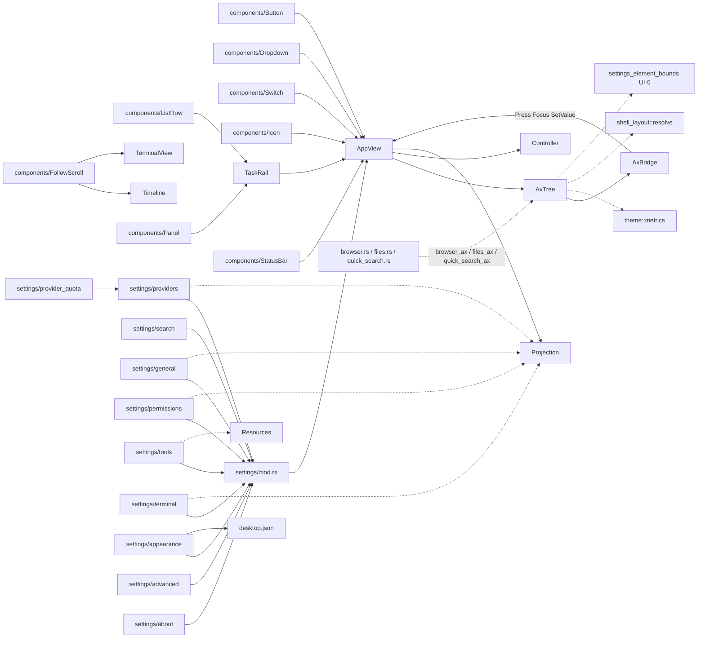

# Desktop 组件库 / Settings / 无障碍 Review

> 可复用 GPUI 控件、Settings 八页（含页内查找与逐账号额度）与显式 AX 语义树（含 macOS AppKit 桥）。范围内 37 个 `.rs` 文件 / 22 024 行（含内联测试；`ui/accessibility.rs` 为 facade，没有独立 `accessibility/mod.rs`）。事实源为当前工作区源码（HEAD e87b0487）；与 Spec 冲突处以源码为准并标注。Browser / Files / 快捷查找面板自身的交互见 [views.md](views.md)，本篇只覆盖它们的 AX 接线。

## 1. 职责与边界

本篇覆盖 `ui/components/`、`ui/settings/`、`ui/accessibility.rs` + `ui/accessibility/`。它们仍是 **GPUI view 层**，不直连 Provider / DB / 工具；写操作经 `AppView` → `DesktopController`。

- **components/**：无业务状态的 `RenderOnce` 控件 + 单色 SVG 图标 + 空态 / 骨架视觉容器。菜单 Escape 由 `AppView` 根节点处理，组件无 Escape API。Button/Switch/ListRow 同时提供 `on_click` 与 `on_activate`（Enter/Space），disabled 两路都不挂。
- **settings/**：Settings 壳替换 TaskRail；返回恢复工作台，不取消 Run。左栏内建页内查找（GUI2-05/06），分组导航带图标。无真实读写能力的页不显示。内容全宽 + 32px 水平 pad（无 820px 上限）。写路径三同源（可见/键盘/AX），回执即写后状态，不乐观更新。每个可定位行经 `settings_element(id)` 登记实际布局（UI-5），AX 与查找定位共用。
- **accessibility/**：显式语义树，不读 GPUI 私有 frame、不做 OCR。`handle_accessibility_request` 先 `permits()` 再分发。macOS 用 AppKit 虚拟 AX 元素，并保留系统 WKWebView 的原生可访问性子树；坐标顶左 → 父空间底左。

Settings 路由下工作台快捷键旁路，见 [views.md](views.md)。Appearance / Advanced 离线可进；Network / Approvals / Tools / Terminal 依赖对应 Host 查询成功；About 依赖握手非空 `host_data_dir`。

**Spec / 历史登记与源码差异：**

| 位置 | 旧说法 / 旧登记 | 源码事实 |
| --- | --- | --- |
| Settings Network | 产品名 Network | 枚举 `SettingsPage::General`、模块 `settings/general.rs`、AX `settings_general_page_ax` |
| Settings 内容宽 | 早期 820px 钳制 | OPT-4c：Rail 外全宽 + 两侧 32px，各页不再复制上限 |
| SET-7 旧登记 | Settings 内容区滚动后 AX 框仍按未滚动估值 | UI-5 起各页 AX 读 `settings_element_bounds`（实际元素框 ∩ 滚动视口），浮层读 `settings_menu_element_bounds`，缺口已消 |
| Terminal 页 | 五按钮 stepper / `terminal-input` 草稿 | 2026-09-15 起输入直通 PTY，无手动尺寸控件；AX 只有 `terminal-output`（Focus）等 |
| components Badge | 状态徽标组件 | 已删除；StatusBar 三槽直接用 `Label` |
| appearance 模块注释 | 「语言不持久化」 | 已改为「本地、即时、保存后重启恢复」，与 `desktop.json` 落盘一致，冲突消除 |

## 2. 文件清单

| 相对路径 | 行数 | 职责 |
| --- | ---: | --- |
| `apps/desktop/src/ui/components/mod.rs` | 19 | 组件族 `pub mod` + 图标 re-export |
| `apps/desktop/src/ui/components/button.rs` | 409 | Button 五变体 + 焦点/键盘激活 + 图标子节点 |
| `apps/desktop/src/ui/components/dropdown.rs` | 262 | Dropdown / MenuPanel / MenuRow 浮层 |
| `apps/desktop/src/ui/components/empty_state.rs` | 87 | GUI4 居中空态容器（不发布 AX） |
| `apps/desktop/src/ui/components/focus_ring.rs` | 133 | 输入方式感知的焦点描边（零布局参与） |
| `apps/desktop/src/ui/components/follow_scroll.rs` | 94 | FollowScroll + BackToBottom |
| `apps/desktop/src/ui/components/icon.rs` | 281 | GUI3-05 单色 SVG 图标枚举与资产加载 |
| `apps/desktop/src/ui/components/label.rs` | 48 | Label（Badge 已删） |
| `apps/desktop/src/ui/components/list_row.rs` | 188 | task / project_header 行 |
| `apps/desktop/src/ui/components/panel.rs` | 85 | 左右侧栏 Panel |
| `apps/desktop/src/ui/components/skeleton.rs` | 29 | GUI3-08 加载骨架条 |
| `apps/desktop/src/ui/components/status_bar.rs` | 101 | 30px 三槽状态行 |
| `apps/desktop/src/ui/components/switch.rs` | 194 | 36×20 Switch |
| `apps/desktop/src/ui/settings/mod.rs` | 1684 | Settings 壳、分组导航、查找输入、identifier 解析、写 gate、元素布局登记 |
| `apps/desktop/src/ui/settings/providers.rs` | 2872 | Models & providers 页（账号/额度/代理/模型管理） |
| `apps/desktop/src/ui/settings/provider_quota.rs` | 515 | Go 逐账号额度与耗尽切换（ADR-060/061） |
| `apps/desktop/src/ui/settings/search.rs` | 868 | 设置查找目录、匹配、定位与 rail 结果列表（GUI2-06） |
| `apps/desktop/src/ui/settings/general.rs` | 178 | Network 页（proxy） |
| `apps/desktop/src/ui/settings/permissions.rs` | 310 | 权限与审批页 |
| `apps/desktop/src/ui/settings/tools.rs` | 234 | 工具与 MCP 页 |
| `apps/desktop/src/ui/settings/terminal.rs` | 245 | 终端默认尺寸/shell 页 |
| `apps/desktop/src/ui/settings/appearance.rs` | 234 | 主题说明、字号与语言（本地） |
| `apps/desktop/src/ui/settings/advanced.rs` | 158 | 连接诊断只读页 |
| `apps/desktop/src/ui/settings/about.rs` | 72 | 关于页 |
| `apps/desktop/src/ui/settings/approval_labels.rs` | 32 | 五档审批文案 |
| `apps/desktop/src/ui/accessibility.rs` | 417 | AxRole/AxNode/AxTree/AxBridge facade |
| `apps/desktop/src/ui/accessibility/app.rs` | 8807 | 工作台/Settings AX 树与 action 分发 |
| `apps/desktop/src/ui/accessibility/macos.rs` | 1054 | AppKit 虚拟元素桥 + WKWebView 原生 AX 共存 |
| `apps/desktop/src/ui/accessibility/settings.rs` | 690 | Settings Rail / 内容壳 AX |
| `apps/desktop/src/ui/accessibility/settings_providers.rs` | 731 | Providers 页 AX |
| `apps/desktop/src/ui/accessibility/settings_general.rs` | 157 | Network 页 AX |
| `apps/desktop/src/ui/accessibility/settings_permissions.rs` | 193 | 权限页 AX |
| `apps/desktop/src/ui/accessibility/settings_tools.rs` | 135 | Tools 页 AX |
| `apps/desktop/src/ui/accessibility/settings_terminal.rs` | 218 | Terminal 页 AX |
| `apps/desktop/src/ui/accessibility/settings_appearance.rs` | 179 | Appearance 页 AX |
| `apps/desktop/src/ui/accessibility/settings_advanced.rs` | 72 | Advanced 页 AX |
| `apps/desktop/src/ui/accessibility/settings_about.rs` | 39 | About 页 AX |


## 3. 通用组件库

`components/mod.rs` 只 re-export 子模块，无逻辑。控件全部 `RenderOnce`（无 Entity 状态），状态由调用方（几乎总是 `AppView`）持有。

### 3.1 Button（`button.rs`）

| 名称 | 种类 | 功能 / 语义 |
| --- | --- | --- |
| `ButtonVariant` | enum | Ghost / Raised / Primary / Success / Danger |
| `ButtonPadding` | enum | None / Compact / Horizontal(px) / Wide |
| `Button::new(id)` | 构造 | 稳定 element id（AX / 测试 / 键盘吞 click 用同一 id） |
| `variant/disabled/label/child/tooltip/track_focus/text_size/text_color/padding/width/height/max_width/bordered/radius/center/vcenter/icon_circle` | builder | 几何与色；`child` 挂图标等任意子节点（供应商展开 chevron）；`icon_circle` 做 36×36 圆钮（Composer Send/Cancel） |
| `on_click` / `on_activate` | 事件 | click 给鼠标；activate 给 Enter/Space。**disabled 两路都不挂** |
| `ButtonVariant::colors/text_color/disabled_bg/disabled_text_color` | 内部 | token 映射 |
| `RenderOnce` | 实现 | 持焦且键盘导航时叠 `focus_ring`；tooltip 走 AppView `tooltip_text` |

改动注意：调用方必须用 `consume_button_key_click` 吞 keyup 合成 click，否则 Enter 会触发两次。Composer Send/Cancel 必须共用 id `composer-action` 以免状态切换留下幽灵 tab stop。

### 3.2 Dropdown / MenuPanel / MenuRow（`dropdown.rs`）

| 名称 | 种类 | 功能 / 语义 |
| --- | --- | --- |
| `ANCHOR_GAP_Y` / `MENU_MAX_HEIGHT` 240 | const | 锚点间隙；长列表内部滚动 |
| `MenuRow` | RenderOnce | id / label / selected / highlighted / disabled / on_click |
| `MenuPanel` | RenderOnce | 容器；`child/children/max_height/track_scroll/dismiss_on_outside`；`occlude()` 吃外点 |
| `Dropdown` | RenderOnce | trigger + 可选 panel；`panel_anchor(Corner, Point)` |
| `RenderOnce for Dropdown` | 实现 | `deferred(anchored())` 浮层，不占布局 |

**无 Escape API**：Escape 由 `AppView::handle_root_key` 关菜单并回焦触发器。开新菜单必须经 `AppView::toggle_menu`（单一 `open_menu`）。Composer 模型菜单明确从触发器上方打开（BottomLeft + 负 gap），Settings 角色 / Manage models 菜单同构；`track_scroll` 让打开的菜单在每帧重建时保留滚动偏移。

### 3.3 focus_ring（`focus_ring.rs`）

| 名称 | 种类 | 功能 / 语义 |
| --- | --- | --- |
| `KeyboardFocus` | Global | 单窗口输入方式标记：键盘导航可见 / 指针输入不可见 |
| `set_keyboard_focus` / `key_down` / `track_pointer_input` | fn | Tab / 方向键 / Home / End 置可见；窗口 capture 阶段任何鼠标按下立即清除（菜单 occlude 或子控件吞事件也不留旧描边） |
| `focus_ring(radius)` | fn | `absolute().inset_0` 的 2px 中性描边，**零布局参与**；仅键盘模式实际绘制 |

gpui border 参与 Taffy，按需出现会挤内容。Settings 导航选中态用绝对定位左缘指示条 + 本 overlay，禁止改回 `border`。鼠标用户看不到焦点框是刻意行为。

### 3.4 FollowScroll / BackToBottom（`follow_scroll.rs`）

| 名称 | 种类 | 功能 / 语义 |
| --- | --- | --- |
| `FollowScroll` | 值对象 | 宿主持有；默认 following=true |
| `handle` / `is_following` / `is_scrolled_to_bottom` | API | 贴底：`max<=ε 或 y <= slack-max` |
| `on_scroll_wheel` | 方法 | **直读贴底，禁止 delta 投影**（gpui 0.2.2 Bubble 逆序双计） |
| `content_arriving` / `follow_new_content` / `jump_to_bottom` | 方法 | 新内容到达先判断脱钩，仍跟随才滚底 |
| `BackToBottom` | RenderOnce | 右下绝对定位容器，child 由调用方给 Button |

Timeline 虚拟化**不用**本组件（走 ListState + `timeline_following`）；Terminal 输出区用本组件。两套跟随语义不要混用。

### 3.5 Label（`label.rs`）

`Label::new/size/color`：单行静态文本，默认 BODY + text.primary。**Badge 已删除**（状态语义别名无人使用）；StatusBar 左右槽、quota 百分比等直接用 `Label` + token。

### 3.6 ListRow（`list_row.rs`）

| 名称 | 种类 | 功能 / 语义 |
| --- | --- | --- |
| `ListRowKind` | enum | `Task { selected }` / `ProjectHeader` |
| `task` / `project_header` | 构造 | 任务行 44px；项目头 36px |
| `track_focus/height/child/on_click/on_activate` | builder | 与 Button 同构的键盘激活 |
| `RenderOnce` | 实现 | 选中 raised 底；持焦 focus_ring |

TaskRail 任务/项目头、Timeline tool group 头、Changes 文件行都用它。行 id 必须稳定（session_id / group_key / path）。

### 3.7 Panel（`panel.rs`）

| 名称 | 种类 | 功能 / 语义 |
| --- | --- | --- |
| `side_left(width)` | 构造 | 左描边（Inspector，窗口右侧栏） |
| `side_right(width)` | 构造 | 右描边（TaskRail / Settings Rail，窗口左侧栏） |
| `child` | builder | 纵向堆叠 |
| `RenderOnce` | 实现 | 固定宽、flex_col、surface 底 |

壳层宽度由 `shell_layout::resolve` 传入，组件本身不响应式。

### 3.8 StatusBar（`status_bar.rs`）

| 名称 | 种类 | 功能 / 语义 |
| --- | --- | --- |
| `new` / `Default` | API | 高 30px（UI-1） |
| `leading` / `centered` / `trailing` | builder | 左：项目/分支（无数据不占空洞）；中：Run 用量串（绝对居中，忽略左右栏宽）；右：连接/瞬态反馈 |
| 用法 | 场景 | **仅 Workspace 路由**渲染（`run_status_visible`）；Settings 壳不显示（render 与 AX 同源） |

左右槽 `occlude()` 且**不发布 AX**，避免与 TaskRail / Composer 同源节点重复；AX 只发居中 `run-status` 一串。

### 3.9 Switch（`switch.rs`）

| 名称 | 种类 | 功能 / 语义 |
| --- | --- | --- |
| `SWITCH_TRACK_WIDTH/HEIGHT` 36×20 / `DOT_SIZE` 16 | const | 轨道几何；AX 共用 |
| `checked/disabled/tooltip/track_focus/on_click/on_activate` | builder | 与 Button 同构 |
| `RenderOnce` | 实现 | 状态词**不内置**，由调用方并排渲染（Settings 权限信任、供应商 use_proxy、额度自动切换） |

全局代理未配置时，供应商 `use_proxy` Switch 不渲染（不是 disabled）。

### 3.10 Icon（`icon.rs`）

| 名称 | 种类 | 功能 / 语义 |
| --- | --- | --- |
| `Icon` | enum | 42 个动作/类型图标（Send…Project），与 `apps/desktop/assets/icons/*.svg` 一一对应 |
| `Icon::path` | const fn | 资产路径，`AssetSource::load` 与 `svg().path()` 共用 |
| `icon` / `icon_sized` | fn | alpha mask 渲染，颜色走 `text_color`；`Icon::all` 测试断言资产齐全 |
| `Assets` | struct | 测试用 asset source（`TestAppContext` 里只占位） |

Settings 导航、rail 图标按钮、供应商展开 chevron、空态图标共用本枚举；新增图标必须同批登记资产与枚举，否则 `Icon::all` 测试红。

### 3.11 EmptyState（`empty_state.rs`）

GUI4 居中空态容器：可选图标（默认 32px tertiary）+ 调用方子节点（标题/说明/动作/骨架），`gap/pad` 可调。**不发布 AX**：调用方保留原 identifier 与文案，视觉容器不引入新语义节点。

### 3.12 Skeleton（`skeleton.rs`）

GUI3-08 Changes / Resources 加载骨架：`loading_skeleton(id)` 渲染 4 条固定宽度（220/168/196/132）静态条，不循环闪动；调用方保留 loading 标题，骨架只替代说明段空场。

## 4. Settings 页面

Settings 左栏整体替换 TaskRail（同响应式宽度 288/240/320）。进入时 `on_open_settings` 刷新查询面；返回 `on_close_settings` 只切 `AppRoute::Workspace`，不取消 Run、不丢草稿。

左栏结构：标题 → Back → **查找输入**（GUI2-05/06）→ 查询激活时结果列表替换整个导航，否则三组分页导航（models / workspace / system，组头 + 图标行；组内全隐则组头也隐）。导航选中零位移（OPT-4d）：选中/未选中共用外壳几何，差异只在背景、字重与绝对定位 3px 左缘指示条；焦点用 `focus_ring` 而非 border。

### 4.1 `settings/mod.rs` — 壳、identifier、写 gate、布局登记

| 名称 | 种类 | 功能 / 语义 |
| --- | --- | --- |
| `SETTINGS_CONTENT_PAD` 32 / `SETTINGS_NAV_HEIGHT` 40 / ROLE/MODELS/PROVIDER 几何常量 | const | 内容 pad、导航行高与菜单/行高；AX 同源 |
| `settings_element(id)` | AppView | UI-5：给每个可定位行挂 `track_scroll` 布局句柄（`settings_element_layouts`），查找定位命中时叠高亮底 + 左缘 `settings_locate_mark()`（绝对定位不推移内容） |
| `settings_element_bounds` / `settings_menu_element_bounds` | AppView | 元素实际框 ∩ 页滚动视口 / ∩ 浮层菜单视口，供 AX 几何（修掉 SET-7 滚动漂移） |
| `settings_*_note` / `settings_proxy_unset` / `settings_trust_unset` 等 | fn | 生效边界与存储位置诚实文案 |
| `provider_catalog_overview_label` / `provider_credential_kind/status_label` | fn | 目录与凭证展示 |
| `SETTINGS_TEXT_SCALES` / `settings_text_scale_identifier` / `from_identifier` | 字号 | 100/125/150 稳定 id |
| `parse_terminal_dimension` / `parse_terminal_shell` / `terminal_save_enabled` | fn | cols/rows 合法才允许 Save；空 shell 可与合法尺寸一起 Save |
| `provider/general/permissions/terminal/tools_status_lines` | fn | stale/loading/error/空态独立行，不只靠颜色 |
| `SettingsAuthAction` | enum | 13 个动作（Connect/Replace/Verify/Cancel/Remove/Confirm/Keep/Open/Copy 等）；`identifier(provider_id)` 三用（render id / AX id / 派发键） |
| `SettingsControl` / `parse_settings_control` | 解析 | API key 输入、use_proxy、expand、auth 按钮 |
| `SettingsRoleControl` / `parse_settings_role_control` | 解析 | 四角色 trigger/clear/item |
| `SettingsModelsControl` / `parse_settings_models_control` | 解析 | Manage / enable-all / disable-all / refresh / 单模型 switch |
| `SettingsMcpAction` / `parse_settings_mcp_control` | 解析 | test / remove / confirm-remove |
| `SettingsNavSlot` / `settings_nav_slots` / `settings_page_icon` | 导航 | 分组头 + 可见页槽位；每页配 `Icon` |
| `settings_role_candidates` / `settings_role_menu_entries` | fn | 只保留已连接供应商的启用模型；清除行由调用方另计 |
| `settings_role_description_label` | fn | 角色用途说明；Vision / Search 标注只保存、路由未接线 |
| `settings_rail_element` | AppView | Back + 查找输入 + 条件导航；能力不到位的当前页回退 Providers/Advanced |
| `settings_page_element` | AppView | 按页分发；外层全宽滚动脚手架；每帧只保留打开菜单的布局句柄 |
| `settings_nav_item` | fn | 选中不可再点（零位移）；未选中 click/Enter/Space 同 handler |
| `settings_writes_enabled` 及 general/permissions/terminal/tools 变体 | gate | 连接 + 非 stale（+ 查询成功，除供应商页 `available` 默认 true） |
| `AccountRenameState` / `settings_account_*_identifier` | 状态 | 账号行内改名输入与 Use/Remove 按钮 id（provider+credential 双段转义） |

identifier 一律 ASCII、不翻译，供 AX Press 反查。未知 id fail-closed。

### 4.2 Models & providers（`providers.rs`）

常在；持久化走 Host auth/catalog/defaults。页面结构：Refresh → 状态行 → Default models 四角色 → Providers 卡片列表（`settings_ordered_providers`：已连接排前，同组保持 Host 目录序）。

| 名称 | 种类 | 功能 / 语义 |
| --- | --- | --- |
| `settings_api_minor` | gate | 从握手 `api_version` 解析 minor；账号多凭证 ≥15、逐账号额度 ≥16、行内改名 ≥17，旧 Host 自动退回旧文案/旧交互 |
| `settings_provider_card` / `settings_provider_card_expanded` / `on_toggle_settings_provider_expanded` | 卡 | 概览头默认折叠；流程态（编辑器/OAuth/Remove 确认/瞬态反馈）保持展开；折叠清空该 provider 的额度缓存，展开即刷新 |
| `settings_provider_expanded_region` | 区 | UX-06 顺序：**Accounts/Credentials → Proxy（仅全局 proxy 已配置才渲染）→ Manage models → Usage 兜底**（Go 且额度可用时不发 Usage 空态行） |
| `settings_provider_credentials_block` | 区 | ADR-056/061：标题随 minor 切 Accounts/Credentials；每条凭证一行（状态点 / 默认名或 kind / kind 徽标 / Selected），空列表诚实空态；API key 编辑器、OAuth 等待、Remove 二次确认均在本区 |
| `settings_account_*` / `begin_account_rename` / `commit/cancel_account_rename` | 写 | 紧凑账号卡：Use（select）/ Rename（行内输入，minor ≥17）/ Remove（确认 + Keep）；改名 Enter 提交 / Esc 取消 |
| `account_quota_element` / `account_mode_element`（见 §4.11） | 写 | Go 逐账号三窗额度条 + 自动切换 Switch，挂在凭证行 / 区尾 |
| `settings_provider_proxy_row` / `on_settings_toggle_provider_use_proxy` | 写 | 回执 `ProviderUseProxyConfirmed` 才改投影 |
| `settings_provider_manage_row` / `on_toggle_settings_models_menu` / `on_toggle_provider_model` / `on_toggle_provider_models_all` / `settings_models_menu_element` | 写 | 弹层 `MenuKind::SettingsProviderModels`：头行 Enable/Disable all（空目录禁用）+ 搜索过滤 + 单模型 Switch；方向键在真实 Switch 焦点间移动并 `scroll_to_item`，Enter 激活当前/首项；enable/disable 回执本地收敛弹层与 Composer，不重探全目录；`cleared_roles` 诚实提示 |
| `settings_filtered_models` / `handle_settings_models_key` | 键盘 | 复用 `model_search_input`（与 Composer 模型菜单同一输入实体）；IME composing 不劫持方向键 |
| `on_settings_connect_oauth` | 写 | 只显示 URL/device code，完整 secret 不进 UI；`oauth_url_can_open` 只放行 https（测试钉死 javascript:/file:/pawork: 等） |
| `on_settings_verify_api_key` / `on_settings_cancel_api_key_input` / `ensure_settings_api_key_inputs` | 写 | `TextInput::secure()`；提交/取消/离页 `clear_settings_buffers`（含 undo）；API key 账号缺省名只做头尾掩码（`fallback_api_key_account_name`） |
| `settings_api_key_editor_visible` / `settings_action_enabled` | gate | 断线/stale 三路径同禁 |
| `settings_default_roles_section` / `settings_role_row` / `settings_role_menu_element` / `on_toggle_settings_role_menu` / `on_select_settings_role` | 写 | Conversation / Naming / Vision / Search 四角色；空候选仍保留 Clear 并可派出清除；`settings_role_pending` 期间该角色下拉禁用；`scroll_settings_role_menu_to_item` 高亮滚入 |
| `settings_role_menu_enabled` | gate | writes + 该角色非 pending；render / 键盘 / AX 三路径同源 |
| `settings_provider_id_for_escaped` 等 | 反查 | AX id 里的转义 provider/model/mcp 名还原 |

契约：**认证成功 ≠ 目录成功**（分开状态行）。API key 完整值不进 AX/日志（发布方向只给等长掩码）。不乐观更新。

### 4.3 Network（`general.rs`）

条件：`settings_general.query.available`。持久化：Host `set_proxy_url` → workspace 外 `config.toml` 的 global `proxy_url`。

| 字段 / 动作 | 交互 |
| --- | --- |
| 当前值 Label | Host 权威；未设置显示 unset 文案 |
| `settings_proxy_input` | 明文非 Secret |
| Save | trim 空禁用；`controller.set_proxy_url(Some)` |
| Clear | 已是 None 禁用；`set_proxy_url(None)` |
| 生效/存储 note | 只影响之后的供应商请求；不改已发出的连接 |

### 4.4 Approvals（`permissions.rs` + `approval_labels.rs`）

条件：`settings_permissions.query.available`。持久化：Host `set_approval_mode` + `workspace_trust`。

| 字段 / 动作 | 交互 |
| --- | --- |
| 五档 mode 按钮 | `approval_labels::ALL`：AlwaysAsk / AskForWrites / AskForDangerous / NeverAsk / ReadOnly；当前值高亮；切换等回执 |
| 会话信任 Switch | `workspace_id` 取当前 attached；回执 `WorkspaceTrustConfirmed` |
| `trust_workspaces_global` | 只读行 |
| 生效 note | 仅当前会话、不持久化（文案诚实） |

`approval_labels::{label,description}` render/AX 同源，不平行第二套枚举。

### 4.5 Tools & MCP（`tools.rs`）

条件：`resources.available`（至少成功 `mcp_list` 一次）。写：`mcp_test` / `mcp_server_remove`。

| 字段 / 动作 | 交互 |
| --- | --- |
| server 卡 | 与 Inspector Resources 同 `mcp_server_name_row` / meta |
| Test | `SettingsMcpAction::Test` |
| Remove | 二次确认（写盘 + 清凭证，不静默删）；失败可能写盘已成功仅清密失败 → 重查清单 |
| `action_error` | Settings 页可见；工作台仍走 `status_hint` |

无「已加载规则」分区（无 Host 出口）。

### 4.6 Terminal（`settings/terminal.rs`）

条件：`settings_terminal.query.available`。持久化：Host `[terminal]` shell/cols/rows，**只影响之后创建的终端**。

| 字段 / 动作 | 交互 |
| --- | --- |
| 当前 shell / size Label | Host 生效值 |
| shell / columns / rows 三个 TextInput | 明文；Loaded/Confirmed 时 `reset_text` 回填 |
| Save | 三字段全态回传；尺寸解析失败禁用 |
| Clear | 只清 shell（cols/rows 原样回传）；已是 unset 禁用 |

与 Inspector 内显示层是两条路径：本页改 Host 默认，Inspector 的 PTY 输入直通且尺寸由输出面像素自动 fit（2026-09-15 起，见 [views.md](views.md)）。

### 4.7 Appearance（`appearance.rs`）

常在，离线可进。持久化：本地 `desktop.json`（`persist_appearance`；测试构造不读盘）。

| 字段 / 动作 | 交互 |
| --- | --- |
| Theme 只读行 | `settings-appearance-theme`：深色预览块 + 说明（当前无切换动作） |
| 三档字号按钮 | 当前档 Primary + AX selected；`on_settings_text_scale` → `set_text_scale` |
| 语言 English / 中文 | `on_settings_language` → `set_language`；identifier `settings-language-en/zh` |
| 状态/错误行 | load/save 失败可见 |

不经 Host。模块注释已与落盘行为一致（本地、即时、重启恢复）。

### 4.8 Advanced（`advanced.rs`）

常在，离线可进。只读握手摘要，**不展示 GUI token**。

| 行 | 来源 |
| --- | --- |
| `settings_advanced_diagnostic_rows` | 连接态、instance、endpoint、api version 等已有事实 |
| Reconnect | 断线态复用壳层按钮，无独立诊断历史 / CLI shell-out |

About 不可用时（断线或无 host_data_dir）导航隐藏 About 并可能把当前页退到本页。

### 4.9 About（`about.rs`）

条件：Connected 且握手 `host_data_dir` 非空。断线隐藏并退 Advanced。无写动作、无 updater。

| 行 id | 值 |
| --- | --- |
| `settings-about-desktop-build` | `CARGO_PKG_VERSION` |
| `settings-about-api` | handshake.api_version |
| `settings-about-data-dir` | handshake.host_data_dir |

`settings_about_rows() -> Option` 是 render/AX 共用 fail-closed gate，绝不从 endpoint 推断数据目录。

### 4.10 设置查找（`search.rs`，GUI2-05/06）

只导航，不改任何设置值。静态目录 `settings_search_entries()`：8 条页标题 + 12 条页内行（字号/语言/供应商/默认模型/代理/审批/信任/MCP/shell/尺寸/诊断/数据目录），每条带中英文标题、说明与别名；**不含凭证类条目**。匹配对 title/description/aliases 做大小写不敏感包含；`filter_settings_search_entries` 叠加页可用 gate（断线仅 Appearance / Advanced）。

| 名称 | 种类 | 功能 / 语义 |
| --- | --- | --- |
| `settings_search_results` | fn | 行条目在前、页条目在后；与可见导航同 gate（`settings_nav_page_available`） |
| `settings_search_input_element` / `settings_search_results_element` | render | rail 内输入 + 240px 上限独立滚动结果列表；空态一行文案；选中行高亮 |
| `handle_settings_search_key` | 键盘 | 输入聚焦时 Up/Down 移动选择并 `scroll_to_item`、Enter 定位、Esc 清空回焦；IME composing 全部 no-op |
| `locate_settings_entry` / `finish_settings_locate` / `try_scroll_settings_row` / `focus_settings_row` | 定位 | 切页 → 等元素布局出现（≤8 帧重试）→ 滚动入视 → 聚焦该行控件（输入框/当前档按钮/信任 Switch 等，无控件行回焦查找输入）；高亮 2s 后自动消退 |
| `reset/clear_settings_search` / `submit_settings_search` | 状态 | 清空同时清 locate 高亮与 pending；提交走选中条目 |
| `settings_search_rail_ax` | AX | 输入 TextArea（Focus/SetValue）+ 结果 ListItem（裁剪到滚动视口、selected 标记、Press 定位） |

### 4.11 逐账号额度（`provider_quota.rs`，ADR-060/061）

Go 专属：`opencode-go` + `api_key` + 非空 credential_id，且握手 minor ≥16。只消费 Host canonical 读数（`QuotaUnit::Percent` 才画条），刷新身份与显示共用稳定 id。

| 名称 | 种类 | 功能 / 语义 |
| --- | --- | --- |
| `quota_identifier` | fn | `settings-account-quota-{rolling|weekly|monthly|refresh|mode|scope}:{provider}:{credential}` |
| `account_quota_rows` | fn | 三窗（Rolling5h/Weekly/Monthly）行：used 百分比 + 进度条（≥70 警告色、≥90 危险色）+ 倒计时（分钟精度，分解天/时/分）+ remaining/来源/更新年龄 |
| stale 判定 | 规则 | projection stale、served_stale、provenance stale、fetch 时间在未来、年龄 >30s、已过 reset 点任一命中即标 stale；`reset_due` 单独文案 |
| `refresh_account_quota` / `refresh_expanded_account_quotas` | 写 | 仅 Providers 页 + 已展开卡；`begin_quota` epoch 单调递增，回执按 generation 拒旧（见 [state.md](state.md)） |
| `account_mode_element` / `on_settings_quota_action` | 写 | 「耗尽自动切换」Switch（WhenExhausted ↔ Manual），`account_mode_pending` 期间禁用，epoch 回执收敛；同函数处理 Refresh 按钮 |
| `settings_quota_clock_needed` | gate | Providers 页 + 已有额度数据时才需要 1s run clock tick |
| Usage 兜底 | render | 非 Go / 旧 minor / 无凭证时展开区仍发 `settings-provider-usage` 空态条 |


## 5. 无障碍

语义树显式来自 `AppView` 当前状态，不读 GPUI 私有 frame、不做 OCR / 像素反推（ADR-042）。identifier 是英文稳定键，**不随 i18n 翻译**；label / value / description 才走 `t()`。工作台几何与 `render` 共用 `shell_layout::resolve`、`theme::metrics` 与各页公式；Settings 页几何走 UI-5 实测元素框（`settings_element_bounds` ∩ 滚动视口，浮层 ∩ 菜单视口），rail 查找结果按自身滚动视口裁剪。

没有 `accessibility/mod.rs`：facade 是 [`apps/desktop/src/ui/accessibility.rs`](../../../apps/desktop/src/ui/accessibility.rs)，子模块挂在 `ui/accessibility/`。

### 5.1 Facade（`accessibility.rs`）

| 名称 | 种类 | 功能 / 语义 |
| --- | --- | --- |
| `AxRect` | struct | GPUI content 顶左原点、逻辑像素。`is_valid` 要求有限且宽高 ≥ 0 |
| `AxRole` | enum | Group / Button / TextArea / StaticText / List / ListItem / TabGroup / Tab。macOS 映射：ListItem→`AXRow`，Tab→`AXRadioButton`，其余同名 |
| `AxAction` | enum | `Press` / `Focus` / `SetValue`。原生只带 kind，identifier 在 AppView 白名单映射 |
| `AxRequest` | struct | `identifier` + `action` + 可选 `value` |
| `AxNode` | struct | identifier / role / label / value / description / enabled / focused / selected / bounds / actions / children。builder 去重 action |
| `AxNode::validate_into` | 校验 | 空 id、重复 id、非法 bounds、NUL 文本一律失败 |
| `AxTree` | struct | viewport + 顶层 children。viewport 必须有限且非空 |
| `AxTree::permits` / `find` / `hit_test` | 查询/门 | `permits` 按**最新树**核对 identifier 存在、`enabled`、action 在节点白名单；`find` 供 macos 桥与测试反查 |
| `AxBridge` | 平台桥 | macOS 见 §5.3；非 macOS 是空 stub，`update` 只 `validate` 并返回 false |
| `dynamic_identifier` | 转义 | `prefix-raw`，非 `[A-Za-z0-9.-]` 字节写成 `_xx`，保证稳定且碰撞抵抗 |

改动注意：新增可见控件必须同批进树、同 identifier、同 gate；否则 AX 高亮框会漂，或 stale 按钮仍可 Press。

### 5.2 工作台投影与 action 回 AppView（`accessibility/app.rs`）

入口三件套：

| 名称 | 种类 | 功能 / 语义 |
| --- | --- | --- |
| `install_accessibility` | 安装 | `AxBridge::install(window, handler)`，清 `ax_error_reported` |
| `sync_accessibility` | 每帧推送 | 建 `accessibility_tree` → `bridge.update`。失败只 stderr 一次（`ax_error_reported`） |
| `handle_accessibility_request` | 回 AppView | **先** `accessibility_tree(...).permits(&request)`，再按前缀/动作分发，最后 `cx.notify()` |

分发顺序（`handle_accessibility_request`）：`permits` → `files-*`（编辑器/筛选 Focus+SetValue，其余 Press）→ `browser-*`（`browser-address` Focus/SetValue，其余 Press）→ 快捷查找模态开时整树接管（Focus/SetValue/Press 全走 quick_search）→ `timeline-find-input` / `timeline-nav-*` → Settings 账号改名输入（Focus/SetValue）→ 通用 Focus/SetValue 白名单 → Press 白名单（`handle_accessibility_press`）。

Focus / SetValue 合法输入覆盖：`model-search-input`（Composer 与 Manage models 共用）、`workspace-bind-project`、`composer-input`、`session-rename-input`、`terminal-output`（仅 Focus，输入直通 PTY）、`settings-proxy-input`、`settings-search-input`、终端 shell/columns/rows、`parse_settings_control` 认出的 API key 输入、`settings-provider-details-*` 登录详情输入。其余 identifier 直接 return。Composer Send 在 IME composing 时 no-op（与 Enter 同源）。

`accessibility_tree` 与 `AppView::render` 同壳：`shell_layout::resolve`（宽窗 Side 并排；窄窗 / 150% 显式打开走中央，未打开 Hidden）决定 rail / inspector 宽与 `InspectorPlacement`。快捷查找开时**整树替换**为模态对话框。Settings 路由与工作台互斥，且不发布 StatusBar（`run_status_visible` = Workspace 路由）。Side 模式 inspector 独立发布并按窗口右缘 `clip_right`（完全不可见节点不发布动作）；中央模式 inspector 作为 workspace 子树发布（Timeline / Composer 隐藏，审批提示仍可达）。

```
Settings:  settings-rail | settings-page                     （全高，无 status-bar）
Workbench: task-rail | workspace[header+timeline+composer] | [inspector] | status-bar
Center:    task-rail | workspace[inspector(中央)]                        | status-bar
```

#### 工作台各区 AX

| 构建函数 | 根 id | 要点 |
| --- | --- | --- |
| `sidebar_ax` | `task-rail` | 快捷查找触发器（`quick-search`，rail Tab 首档）/ grouping / scope / 连接状态 / add-task；`show_reconnect()` 才发 `reconnect`。会话列表结构与 TaskRail 同源，折叠项目不投影子会话；页脚 `open-settings`。Scope 菜单开时发 `scope-menu`，焦点移交高亮项 |
| `project_ax_nodes` | `project-*` / `session-*` | 项目头 Press 折叠；`project-add` 直建会话。会话行 description=`session_status_description`（live 词 + Unread；无 live 不伪造终态）。改名/归档按钮与可见路径同 gate；改名编辑器是 `session-rename-input` TextArea |
| `workspace_ax` | `workspace` | header + timeline + composer；中央模式改为 header + inspector + 审批提示 |
| `navigation_header_ax` | `timeline-find` 等 | GUI2-04 查找/回合目录入口：`timeline-find-input`（Focus/SetValue）+ `timeline-find` / `timeline-turns` / `timeline-nav-*` Press |
| `header_ax` | `workspace-header` | 标题 / branch / live 终态按可见条件诚实隐藏。折叠 Inspector：`inspector-toggle`（Activity）左一格、`inspector-expand` 最右槽；Activity popover 发 `activity-open-changes`。展开态最右槽变 `header-new-task`（空工作台不发） |
| `timeline_ax` | `timeline` | **虚拟化**：只发布当前可见/overdraw 项，优先读 `ListState::bounds_for_item`。approval 是 list 末项，滚离底部不发审批按钮。未跟随且内容溢出才发 `timeline-back-to-bottom`。空工作台发 title/hint |
| `timeline_row_ax` / `timeline_entry_ax` | 按行 | Message/Error：`timeline-entry-{event}` + `entry-menu` + 可选 `fork` + `thinking-toggle-` / `tool-result-toggle-`。ToolGroup：`tool-group-toggle-`，展开才发 `tool-row`。RunSummary：组 + 卡 + 完成且 changes 可用才发 `run-review-changes` |
| `composer_ax` | `composer` | `composer-input` AXValue **恒为纯文本**（placeholder 不进 value）。`model-picker` / workspace chip / ContextMeter / status hint。运行中动作槽是 `cancel`，否则 `send`（共用焦点句柄）。`model_search_ax` 只发与菜单裁剪窗相交的行 + `model-search-input` / `model-search-clear` / `model-menu-settings`；全关空态一行 StaticText、无 Press |
| `inspector_ax` | inspector 组 | TabGroup 五工具：`inspector-tab-changes/terminal/resources/browser/files`；`inspector-collapse` / `inspector-back`；`inspector-panel`（+ 菜单）开新工具；`file-tab-*` / `panel-close-*` 标签页。body 按当前 tab 分发 |
| `terminal_ax` | `terminal` | `terminal-output` TextArea：value 为 `terminal_screen` 显示行拼接截尾 8192 字符（SGR 已解析），Focus 聚焦 PTY 输入焦点，description=`terminal_context_text`。恢复提示（`recovery_ax`）、`terminal-back-to-bottom`（脱钩才发）、`terminal-new-tab` / `terminal-tab-*` / `terminal-close` 与可见 gate 一致 |
| `changes_ax` | `changes` | TabGroup Files/Summary + refresh。Files 发 `changes-file-{path}` 与 `changes-diff-view`（只报水平偏移，不把 diff 文本整页塞进 AX） |
| `resources_ax` | `resources` | MCP 列表只读：`mcp-server-{name}` value=`state · transport · N tools`，description=last_error |
| `browser_ax`（定义在 `ui/browser.rs`） | `browser` | 地址栏 `browser-address`（Focus/SetValue）+ Go/Back/Forward/Reload；断线边界按钮 disabled。原生 WKWebView 内容不走 AxTree（见 §5.3） |
| `files_ax`（定义在 `ui/files.rs`） | `files` | 目录树 / 预览 / 编辑器：`files-editor`、`files-filter`（Focus/SetValue）与文件行 Press；`files_ax_edit` 是 AX 写入入口 |
| `status_ax` | `status-bar` | 仅居中 `run-status` 信息串（占整行框）；左右视觉槽不重复发布 |

虚拟化卸载语义：滚出视口的 Timeline 行、approval 卡、model 菜单裁剪行**不在树里**，其 Press 自然 `permits` 失败。改行高公式必须同步 `timeline_row_height` 与 AX 布局，否则高亮框与像素错位。

### 5.3 macOS AppKit 桥（`accessibility/macos.rs`）

只在 `cfg(target_os = "macos")` 编译。把 GPUI NSView isa 换成 `PaworkAccessibleGPUIView`（`object_setClass`），根角色 `AXGroup` / identifier `pawork-root`。Drop 清空 children、还原原 class、release view。

| 原生类 | 职责 |
| --- | --- |
| `PaworkAXElement` | 虚拟 `NSAccessibilityElement`。override `setAccessibilityFocused:` / `setAccessibilityValue:` / selector 白名单 / attribute settable |
| `PaworkAXPressElement` | 子类，额外 `accessibilityPerformPress` |
| `PaworkAccessibleGPUIView` | hit-test（屏幕坐标、最深命中）+ focused element + WKWebView 共存 |

**WKWebView 原生 AX 共存**（GUI 1.18 起）：`accessibilityChildren` 在 AxTree 合成子树之后追加视图里未隐藏的 `WKWebView`；`accessibilityHitTest:` 命中 webview 屏幕框时转发给原生元素；firstResponder 落在 webview 内时 `accessibilityFocusedUIElement` 与 `performKeyEquivalent:` 都转发原生（网页内 Cmd+A/C/X/V/Z/Shift+Z 经 responder chain 分发，避免被 GPUI 输入框吃掉）。网页内容不进 AxTree，也不做 OCR。

坐标：**语义树顶左** → **父空间底左**（`parent_space_frame`：`y' = parent.height - (y - parent.y) - height`），再经 `convertRect:toView:` + `convertRectToScreen:` 发屏幕 frame。测试钉住该变换。

双门拒绝：element 的 `enabled` 与 `actions` 在 IMP 内先挡一层（disabled 连 AppKit 缓存都不更新）；到达 AppView 后再 `permits()`。树同步写 value/focused **直调 super**，避免把内部 refresh 误报成外部 `SetValue` / `Focus`。

`AxBridge::update`：

1. `validate`；树全等则 no-op。
2. `same_skeleton`（identifier + role + press 能力 + 子树形状）为真 → **原位刷新**既有原生对象（流式文本每帧不整树重建，外部客户端持有的 element 不失效）。
3. 结构变或 refresh 对不上 → 整树 `build_node`，发 `NSAccessibilityLayoutChangedNotification`。
4. 焦点变化发 `FocusedUIElementChanged`；value 差分发 `ValueChanged`。
5. press 能力变化视为结构变化（构建期 class 已按 press 选定）。

AppKit 保证 AX 请求在主线程；`ElementState.handler` 是 `Rc`，debug 非测试构建断言主线程。

### 5.4 Settings AX 镜像

`settings.rs`：`settings_rail_ax` + `settings_page_ax` 分发，页节点经 `visible_settings_page` 剔除零尺寸子节点（未渲染 / 滚出页面的行不暴露 stale 坐标动作）。几何一律走 `settings_element_bounds` / `settings_menu_element_bounds`（UI-5 实测框）。

rail：标题 → Back → 查找输入（`settings-search-input` TextArea，Focus/SetValue；查询激活时结果 ListItem 裁剪到滚动视口、selected 标记、Press 定位，空态一行文案）→ 分组头 + 导航两态**共用同一外壳几何**（OPT-4d）：选中 = `StaticText` + `settings.nav.state_selected`、无 Press；未选中 = `Button` + Press。可用项按 Host 查询累加 y，About 仅 `settings_about_rows().is_some()`。当前页若已不可用，AX 与 render 同样退到 Providers / Advanced。

| 页函数 | 关键节点 | 写 / 安全 |
| --- | --- | --- |
| `settings_providers_page_ax` | 角色默认触发器（value=当前对，description=角色说明）/菜单；provider 卡 expand、use-proxy、Manage models、凭证组、额度行 | API key TextArea `value` 恒为 `secure_mask()` 等长掩码（SET-010）；完整 secret 不进 AX/日志。OAuth 只发 code/expires 文案；登录详情输入可 Focus/SetValue。stale 时按钮 `enabled=false` |
| 凭证组 | 每条凭证 StaticText（名称 · kind · masked · 状态 · Selected）+ 额度三窗 StaticText（value=多行读数）+ Refresh / Use / Rename / Remove 按钮；改名输入 TextArea | minor ≥15 才发账号动作；额度行 minor ≥16 且 Go api_key；按钮 gate 与 render 同源 |
| `settings_role_menu_ax` | Clear 始终发布（空候选亦然）+ 候选行；空态说明 StaticText | 与可见菜单同 identifier、同裁剪（菜单视口）；Clear 在 writes 时带 Press |
| `settings_models_menu_ax` | Enable/Disable all / Refresh / 搜索输入 / 单模型 Switch | 与可见菜单同 identifier、同裁剪；`settings_filtered_models` 同源过滤；空目录发说明 + Refresh，不编造模型 Switch |
| `settings_general_page_ax` | proxy 当前值、`settings-proxy-input` Focus/SetValue、Save/Clear、effect/storage | writes gate 同源；Save 在输入空时禁用 |
| `settings_permissions_page_ax` | 五档 `settings-approval-mode-*`（`AxRole::Tab`）、`settings-workspace-trust`、global 只读、effect | 信任按钮缺 `workspace_id` 禁用；mode 未知 wire 串 fail-closed |
| `settings_tools_page_ax` | MCP 行形状同 resources_ax；Test / Remove 两步确认 | confirming 才发 Confirm/Keep；stale 拒写 |
| `settings_terminal_page_ax` | shell/columns/rows TextArea + Save/Clear + effect | 尺寸解析同源 `parse_terminal_dimension`；Save 三字段全态 |
| `settings_appearance_page_ax` | theme 只读行 + 字号三档 + 语言按钮 `selected`；sample / effect / hint | 离线可进。`appearance_error` 覆盖 language hint |
| `settings_advanced_page_ax` | 诊断行 + 条件 `reconnect`（复用全局 id/焦点）+ target/doctor note | 不展示 GUI token |
| `settings_about_page_ax` | 三项 StaticText | 无动作；gate 失败回 Advanced |

Press 经 `handle_accessibility_press` 回到与鼠标/键盘同一 `on_*`（`on_settings_action` / `on_settings_account_action` / `on_settings_quota_action` / `on_settings_approval_mode` / `on_settings_workspace_trust` / `activate_settings_search_result_id` 等）。identifier 解析失败 fail-closed。

### 5.5 Tab 链与键盘（不在 accessibility/ 内，但驱动 AX 焦点）

`ui/mod.rs::install_appkit_tab_monitor`：macOS 上 NSWindow 会在 sendEvent 层把裸 Tab 送进 key-view 循环。窗口首次 render 安装本地 monitor，截获 kVK_Tab / Shift-Tab，直接 `focus_next` / `focus_prev`；浏览器场景另放行 Cmd+L / K / I 给原生 responder。顺序由 `tab_index` 档位决定：rail 前缀四档（`quick-search` -21 → `add-task` -20 → `project-scope` -19 → `task-rail-grouping` -18；断线 `reconnect` -17、行级 -16、页脚 Settings 链尾）→ 主路径 0 → composer 1 档链尾。菜单开着时 Tab 仍归菜单。AX `focused` 字段跟 GPUI FocusHandle，不另建一套焦点。

改动注意：新增可聚焦控件必须同时 (1) 挂 FocusHandle 与 tab_index、(2) 进对应 `*_ax`、(3) 在 `handle_accessibility_request` 白名单（若支持 AX action）。三缺一即键盘或 VoiceOver 静默失败。

## 6. 协作关系

组件库无业务边；Settings 八页与 AX 树都经 `AppView` 读 `projection` / 写 `controller`。AX 是 render 的只读镜像加白名单回写，不引入渲染面没有的状态。



实线是写/安装方向；虚线是只读投影。Appearance 是唯一不经 Host 的持久化页。改交互先改 AppView 入口谓词，再改 element，最后核对应 `*_ax` 是否同源。

## 7. 测试与验证

范围内 58 个内联测试：`accessibility/app.rs` 34（壳层 / 虚拟化 / 掩码 / 配额 AX / browser 边界 / 中央模式）、`accessibility/macos.rs` 6（坐标变换 / 桥行为）、`accessibility.rs` 3、`accessibility/settings.rs` 3（导航零位移等）、`settings/mod.rs` 5、`settings/search.rs` 2、`settings/providers.rs` 2（OAuth 链接目标 / 掩码）、`settings/provider_quota.rs` 1、`components/icon.rs` 1、`components/focus_ring.rs` 1。终端 / Network / Approvals / Tools / Appearance / Advanced / About 页无本文件内测试，由 `app.rs` AX 测试与 projection 层覆盖。

包级死表命令（见 [desktop Spec](../../spec/crates/desktop.md) §7）：`cargo test -p pawork-desktop --offline --bins --features gpui/runtime_shaders`。本篇为文档任务，未运行编译；验证方式为逐文件源码核对 + 行数统计 + 链接检查。
