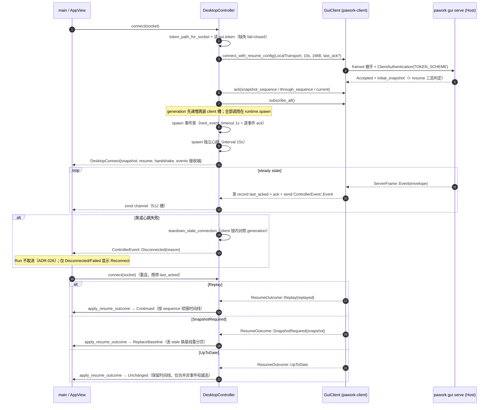

# Desktop 进程总览（Review）

> pawork-desktop 是一个独立的 GPUI 单窗口 Agent 壳进程，经 GUI Connection Protocol 连接 `pawork gui serve`（CLI Host），自身不加载任何 Core crate。本文覆盖进程模型、连接链路与四层依赖纪律；状态三层（platform / controller / projection）逐类型详解见 [state.md](state.md)。

统计（2026-09-07 源码口径）：`apps/desktop/src` 共 **60 个 .rs 文件、40,206 行**，全部在单一 `[[bin]] pawork-desktop` target 内（无 lib target）。生产 `pawork-*` 依赖恰好 `{pawork-client}`，由 `platform.rs` 内测试钉死。注：`docs/spec/crates/desktop.md` §2 记载「57 文件 / 约 34.7k 行」已过期；`projection/tests.rs` 实际 68 个测试（Spec 载 67）。

## 1. 进程模型与启动链（main.rs）

入口 [main.rs](../../../apps/desktop/src/main.rs) 手动解析 argv（非 clap），仅四个参数：`--socket <path>`（显式指定 socket）、`--instance <name>`（实例隔离）、`--probe`（无窗连接冒烟）、`--probe-smoke`（无窗全链路冒烟）。未知参数直接以 usage 报错退出（exit 2）。

启动顺序：

1. 读 `PAWORK_UI_BARRIER_DIR` env（空值视同未设置；None 时全程零开销，仅真实窗口路径发射，probe 模式不发射）。
2. socket 解析优先级：`--socket` 显式路径 > `platform::socket_path_for_instance(instance)`（`--instance foo` → `<data_dir>/pawork-gui-foo.sock`；缺省 / `default` / 空串 → `pawork-gui.sock`）。
3. probe 模式在此分叉退出：`run_probe` 走 `platform.block_on` 同步完成 connect + snapshot + model_list 并打印一行摘要；`run_probe_smoke` 用同一条 controller 路径跑流式回合、切模型、审批、取消、两次断线重连与 `disconnect_survive` 断言（run 不因断线取消）。
4. `run_app` 进入真实窗口路径：`Application::new().run` → `install_keybindings` → 打开 1440×1024 居中窗口（`WINDOW_MIN_SIZE` 钉 1080×720，窗口系统级限制，测试锁定）→ 透明 titlebar（macOS `NSFullSizeContentView`，traffic lights 悬浮于 TaskRail 顶部安全区）→ `AppView::new(Arc<Platform>, socket, barrier_dir)` → `restore_appearance`（首帧前从 `desktop.json` 恢复语言与字号）→ `install_accessibility`（AX 请求经 gpui foreground executor spawn 回到 `window.update` → `handle_accessibility_request`）→ 聚焦 Composer → `cx.activate(true)`。

**tokio runtime 与 gpui 前台执行器的关系**是本进程最关键的结构事实：`Platform` 持有唯一的 tokio multi_thread Runtime，`AppView` 保存 `Arc<Platform>` 保证其存活；所有 `GuiClient` 调用（握手 / ack / `subscribe_all` / 事件泵 / 心跳 / 各 Command·Query）必须跑在 `runtime.spawn` 上，GPUI 侧只经 `smol::channel`（512 槽）消费 `ControllerEvent` 结果。gpui 的前台执行器没有 tokio reactor——在 `cx.spawn` 上 await client 调用会在 `receive_frame` 内部的 `tokio::time` 直接 panic（真窗口启动 exit 134）。`--probe-smoke` 走 `platform.block_on` 自带 runtime，暴露不了这类回归，因此生产窗口启动仍是必需门禁。

## 2. 与 CLI Host 的连接链路

Desktop 不拉起、不发现进程，只做**路径发现 + 鉴权文件读取 + 主动连接**：Host 由 `pawork gui serve` 启动并写 `gui.token`；Desktop 按 socket 文件名推导同目录 token（`pawork-gui-dev.sock` → `gui-dev.token`），token 文件缺失 / 空 / 非 UTF-8 一律 fail-closed 拒连。能力宣告为 `Events / Snapshots / Approvals / TerminalStreaming` 四项（不宣告 `ArtifactStreaming`）；`ConnectOptions` 固定 10s 超时、1 MiB max frame、client_label `pawork-desktop`。

要点：

- **心跳配比不可静默改动**：Host 侧 `ConnectionManager` idle 30s 超时；Desktop 独立心跳任务按 15s interval 保活（`MissedTickBehavior::Delay`，首 tick 立即完成被消费掉以进入节奏）。泵不能兼任心跳——泵可能阻塞在向 UI channel 的 `send().await`（channel 满时不丢事件），而对 `next_event_timeout` 做 `select!` 抢展会破坏分帧读的取消安全性（半帧后流错位）。
- **SessionMetaChanged 再快照**：泵收到改名 / 归档 / 自动标题写回事件时，`tokio::spawn` 一次 `client.snapshot()` 刷新会话列表（ADR-054 D5）。
- **代次防拆**：每次成功连接 `generation` 递增且先于 client 槽安装；旧泵 / 旧心跳的迟到失败在 `teardown_stale_connection` 里对照 generation，拆不掉新连接；同一代次内泵与心跳同时失败时只有第一个清空者投递 `Disconnected`。
- **主动 disconnect**（关窗 / probe 重连前）只 `client.close()`，不发 `RunCancel`；断线不取消已进入 Core 的 Run（ADR-026）。

## 3. 四层职责与依赖纪律

`main.rs` 的模块声明即分层，越界 import 视为违规：

| 层 | 职责 | 关键约束 |
| --- | --- | --- |
| `ui/` | GPUI 渲染与交互（AppView + 各 Surface + AX 语义树） | 不直接调网络 / 文件 / 进程；用户动作全部转交 controller |
| `controller/` | 唯一业务出口 `pawork-client`；构造冻结 wire 形状的 Command / Query，解包回执为 `ControllerEvent` | 所有 client 调用跑 tokio runtime；结果经 smol channel 投回 UI 线程 |
| `projection/` | 纯状态机：snapshot / 事件 / 回执 → 可渲染状态 | 不 import gpui / tokio / OS API；时间线语义委托 `pawork_client::projection` 共享 reducer（host 与 desktop 同源） |
| `platform.rs` + `platform/` | socket / token 路径发现 + tokio Runtime 宿主；ADR-053 起另承载 `desktop.json` 外观偏好持久化 | 不触碰 GUI 与业务协议 |

依赖方向的实测细节：`projection/session.rs` import `crate::ui::i18n::{t, t2}`，`settings.rs` 与 `timeline.rs` 只 import `t`，做文案本地化。i18n 是纯静态目录（无 gpui / tokio），不违反「projection 无 gpui/tokio/OS API」红线，但相对「ui → controller → projection」的单向表述是一条反向 import——重构时若 i18n 引入 gpui 依赖将击穿投影层纯度，这是分层表述与源码之间需要留意的偏差点。

**deny-list 断言**：`platform.rs` 测试 `desktop_production_pawork_deps_stay_client_only` 用 `include_str!` 读本包 `Cargo.toml`，断言生产 `pawork-*` 依赖恰为 `{pawork-client}`。扫描器覆盖 `[dependencies]`、`[target.'cfg(...)'.dependencies]`、`[dependencies.<alias>]` 与 `package = "..."` 重命名形态；dev-dependencies（`tempfile`、gpui test-support）不计入，另有负例测试钉死扫描器语义。macOS target 的 `cocoa` / `objc` / `raw-window-handle` 仅为 ADR-042 原生 AX bridge 服务。

## 4. 已知工程陷阱索引

以下条目摘自 [AGENTS.md](../../../AGENTS.md) §11「工程经验」Desktop 相关部分，改连接 / 布局 / 发布脚本前先核对：

| 陷阱 | 一句话 | 指向 |
| --- | --- | --- |
| gpui 前台执行器无 tokio reactor | 在 `cx.spawn` 前台执行器上 await client 调用，`receive_frame` 内 `tokio::time` 直接 panic（真窗口启动 exit 134）；握手 / ack / `subscribe_all` / 泵必须全部 `runtime.spawn` | AGENTS.md §11「gpui 前台执行器无 tokio reactor」 |
| flex_col min_w_0 截断投毒 | flex_col 祖先链上显式 `min_w_0` 会让 nowrap 文本真窗口渲染成「…」但 AX 正常；文本列用 flex_row + flex_1 + min_w_0 同层 | AGENTS.md §11「gpui flex_col 链路 min_w_0 截断投毒」 |
| FollowScroll 滚轮双计 | Bubble 相监听逆序分发，delta 投影会把一次滚动计两次；放弃投影，直读 `is_scrolled_to_bottom()` | AGENTS.md §11「FollowScroll 滚轮双计」 |
| host 30s 心跳 × desktop 空闲 | `gui_server` 心跳超时 30s，Desktop 空闲约 30s 必断；独立心跳任务 15s interval 保活（泵不兼任），配比不可静默改动 | AGENTS.md §11「host 30s 心跳 × desktop 空闲」 |
| 运行中 bundle 覆盖即 SIGKILL | `cp -f` 覆盖运行中 `Pawork.app` 内二进制后，同路径新启动立即 exit 137；并行验收须复制平行 bundle | AGENTS.md §11「运行中 bundle 覆盖即 SIGKILL」 |
| exec 会话派生进程被静默回收 | 会话内 `nohup … &` 派生的进程会被回收且无日志；GUI 用 `open -na <bundle> --args --instance <name>` 启动，CLI Host 用常驻会话承载 | AGENTS.md §11「exec 会话派生进程被静默回收」 |
| Desktop 连接与诚实性 | 关窗不取消已进入 Core 的 Run；功能结论须同时有真实窗口状态与源码外事实；截图不入仓库 | AGENTS.md §11「Desktop 连接与诚实性」 |

## 5. 文档导航

- [state.md](state.md)：platform / controller / projection 三层逐类型、逐方法详解（本文姊妹篇）。
- [views.md](views.md)：`ui/` 层工作台视图与渲染（另一份 Review 文档）。
- [components-settings.md](components-settings.md)：基础组件库与 Settings 页（另一份 Review 文档）。

