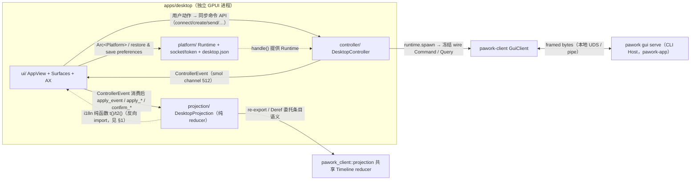

# Desktop 状态与连接层 Review

> 覆盖 `apps/desktop` 的 platform（路径发现 + tokio Runtime + desktop.json）、controller（唯一业务出口 `pawork-client`）与 projection（纯状态机）三层：它们共同把 Host 的 snapshot / 事件流 / 命令回执装配成 UI 可直接渲染的状态。入口 main.rs 与 Cargo.toml 一并纳入文件清单；`ui/` 层见 [views.md](views.md) 与 [components-settings.md](components-settings.md)。

## 1. 职责与边界

- **platform**（platform.rs + platform/preferences.rs）：GUI socket / token 路径发现、tokio multi_thread Runtime 宿主、Desktop 自有外观偏好持久化（`desktop.json`，ADR-053）。不触碰 GUI 与业务协议，不依赖 pawork-client。
- **controller**（mod.rs + session.rs + settings.rs + terminal.rs + files.rs + browser.rs）：全部业务 I/O 的唯一出口。以 `serde_json` 构造冻结 wire 形状（method/params）的 Command / Query → `GuiClient` → 解包回执 → `ControllerEvent`（smol channel，512 槽）→ UI 线程。命令构造器与解析器为 `pub(super)` 纯函数，集中钉在 mod.rs 并由测试冻结形状。files.rs 承载 GUI 1.19 的项目文件读写（List / Read / Save），browser.rs 承载 API ≥1.18 的 Browser 请求领取与回复（`BrowserNext` / `BrowserRespond`）。
- **projection**（mod.rs + session.rs + settings.rs + terminal.rs + timeline.rs）：纯 reducer。snapshot 段解析、live 事件应用、Resume 三态、Settings 四切片状态机、Terminal 生命周期、TaskRail 分组与 Timeline 行组装。不 import gpui / tokio / OS API；`now_ms` 由 UI 注入；时间线条目语义（去重 / 有序插入 / tool 双键锚点 / resume 基线）委托 `pawork_client::projection` 共享 reducer。
- **边界事实**：`projection/session.rs` import `crate::ui::i18n::{t, t2}`，`settings.rs` 与 `timeline.rs` 只 import `t`，取本地化文案。i18n 是纯静态目录，不违反「无 gpui/tokio/OS API」红线，但构成对「ui → controller → projection」单向分层的反向 import——若日后 i18n 引入 gpui 依赖将击穿投影层纯度，重构时须留意。`projection/tests.rs` 有唯一的 `std::fs` golden 读取（`fixtures/ui/expected/snapshot.json`），仅测试代码，生产路径零 IO。

## 2. 依赖关系

| 依赖 | 版本 / 形态 | 本三层中的用途 |
| --- | --- | --- |
| `pawork-client` | path 依赖 | 唯一业务入口；controller 直接调用，projection 消费其 re-export 的 protocol / transport 类型（Snapshot、AppEvent、ResumeOutcome、TimelinePage、Settings Data、QuotaOverviewView 等）与共享 TimelineProjection |
| `pawork-terminal` | path 依赖 | 终端显示核心；仅 ui 层使用，本三层零 import（计入生产 deny-list） |
| `pawork-browser` | path 依赖 | 系统网页视图；仅 ui 层使用，本三层零 import（计入生产 deny-list） |
| `tokio` | workspace（rt-multi-thread / macros / sync / time） | platform 持有 Runtime；controller 全部 client 调用 `runtime.spawn`；心跳 `tokio::time::interval`；probe 等待器 `tokio::time::timeout` |
| `smol` | 2 | `ControllerEvent` 跨线程 channel（bounded 512），tokio 任务与 GPUI UI 线程之间唯一桥 |
| `serde_json` | workspace | controller 构造冻结 wire 命令 / 解析回执；projection 解析 snapshot 段与 AuthChanged |
| `gpui` | `=0.2.2`（ADR-035） | 仅 ui / main 使用；本三层零 import（platform 不 import gpui） |
| `cocoa` / `objc` / `raw-window-handle` | macOS target only | ui/ AX bridge（ADR-042）与 WebKit；与本三层无关 |
| dev：`tempfile`、gpui test-support | dev-dependencies | preferences / barriers 测试临时目录与 GPUI TestAppContext；不计入生产 deny-list |

## 3. 文件清单

| 相对路径 | 行数 | 职责 |
| --- | --- | --- |
| `apps/desktop/Cargo.toml` | 37 | bin-only 包清单；生产 `pawork-*` 依赖恰为 client + terminal + browser（deny-list 测试对象） |
| `apps/desktop/src/main.rs` | 723 | 入口与 argv 解析、probe / probe-smoke 无窗冒烟、窗口与 AX 安装（详见 overview.md §1） |
| `apps/desktop/src/platform.rs` | 240 | `Platform`（tokio Runtime 宿主）+ socket / token 路径发现 + 依赖 deny-list 断言 |
| `apps/desktop/src/platform/preferences.rs` | 157 | `desktop.json` 读写：语言 / 字号恢复，原子替换与损坏保护 |
| `apps/desktop/src/controller/mod.rs` | 2330 | `DesktopController` 连接 / 事件泵 / 心跳；`ControllerEvent`；全部 wire 命令构造器与回执解析器 |
| `apps/desktop/src/controller/session.rs` | 600 | workspace / session / run / fork 命令与 Timeline 分页 |
| `apps/desktop/src/controller/settings.rs` | 963 | Settings 查询与写、模型目录与角色默认、认证（auth_*）、账号选择 / 改名 / 配额命令 |
| `apps/desktop/src/controller/terminal.rs` | 208 | terminal_create / write / resize / close 与回执 |
| `apps/desktop/src/controller/files.rs` | 85 | `workspace_files` / `workspace_file_read` / `workspace_file_write`（API ≥1.19 gate；epoch 回执） |
| `apps/desktop/src/controller/browser.rs` | 60 | `poll_browser`（BrowserNext，API ≥1.18 + BrowserControl 能力 + 单飞 AtomicBool）/ `browser_respond` |
| `apps/desktop/src/projection/mod.rs` | 564 | `DesktopProjection` 装配：snapshot 合并、live 事件应用、Resume 三态 |
| `apps/desktop/src/projection/session.rs` | 1026 | 连接 / 会话 / workspace / TaskRail / 模型选择投影类型与 snapshot 解析 |
| `apps/desktop/src/projection/settings.rs` | 831 | `SettingsQueryGate` 与四个 Settings 页状态机、AuthChanged 解析、账号配额缓存（ADR-060/061） |
| `apps/desktop/src/projection/terminal.rs` | 536 | `TerminalState` 多终端投影：输出缓冲、终态闸门、workspace 选择 |
| `apps/desktop/src/projection/timeline.rs` | 257 | `TimelineRow` 行组装与 Run 摘要 / 页脚文案、乐观回显 |
| `apps/desktop/src/projection/tests.rs` | 3691 | 79 个投影测试（snapshot / replay / Run / Terminal / Settings fail-closed / ui_fixture golden） |

## 4. 类型与方法功能列表

### 4.1 platform（platform.rs / preferences.rs）

| 名称 | 种类 | 功能 / 语义 |
| --- | --- | --- |
| `Platform` | pub struct | 桌面壳持有的 tokio multi_thread Runtime；GUI Connection Protocol 所有异步操作的宿主。`AppView` 保存 `Arc<Platform>` 保证存活 |
| `Platform::new` / `Default` | 关联函数 | `Builder::new_multi_thread().enable_all()` 构建，失败 expect 直接终止 |
| `Platform::handle` | 方法 | 克隆 `tokio::runtime::Handle` 交给 `DesktopController` |
| `Platform::block_on` | 方法 | 在 runtime 上驱动一个 future 至完成；仅 `--probe` / `--probe-smoke` 路径使用 |
| `default_socket_path` / `default_token_path` | pub fn | 缺省实例路径：`<data_dir>/pawork-gui.sock` 与 `<data_dir>/gui.token` |
| `socket_path_for_instance` / `token_path_for_instance` | pub fn | 按 `--instance` 派生 `pawork-gui-{name}.sock` / `gui-{name}.token`；trim 后空串或 `default` 视为缺省实例 |
| `token_path_for_socket` | pub fn | 按 socket 文件名反推同目录 token（`pawork-gui-{i}.sock → gui-{i}.token`；其它形态回落 `gui.token`）；connect 的 token 定位入口 |
| `default_data_dir`（私有） | fn | `PAWORK_DATA_DIR` → Windows `%LOCALAPPDATA%/pawork` → `$HOME/.pawork` → `temp/pawork`；语义镜像 host 但不依赖 pawork-app |
| `desktop_production_pawork_deps_stay_client_only` 等 4 测试 | test | 路径命名、token 推导、deny-list 恰为 `{pawork-client, pawork-terminal, pawork-browser}`、扫描器覆盖 alias / target 表（负例含 dev-dependencies 排除） |

| 名称（preferences.rs） | 种类 | 功能 / 语义 |
| --- | --- | --- |
| `DesktopPreferences` | pub struct | `{ language: String, text_scale: u16 }`；Default 为 `en` / 100 |
| `config_path`（私有） | fn | macOS `~/Library/Application Support/dev.pawork.pawork/desktop.json`；Windows `APPDATA`；其它 XDG `~/.config/pawork`；非绝对路径报错 |
| `read`（私有） | fn | 缺文件返回 Default；`language` 仅 `en` / `zh`、`text_scale` 仅 100/125/150，非法值报错；同时返回完整 JSON table |
| `write`（私有） | fn | `WRITE_LOCK` Mutex 串行 + `SEQUENCE` AtomicU64 命名临时文件；read-modify-write 只改用户操作的单字段（多窗口互不覆盖）、保留未知键；校验后 tmp+rename 原子替换；损坏文件不覆盖 |
| `load_preferences` / `save_preferences` | pub fn | 对外 API；`AppView::restore_appearance`（读）与 Appearance 页 / 字号快捷键（写）使用 |
| `preferences_restore_and_preserve_other_keys` 等 2 测试 | test | 双窗口先后改不同字段互不覆盖、未知键保留；损坏文件保旧不覆盖 |

platform.rs 模块头注释自述「只做这两件事（路径发现 + Runtime 宿主）」，但 ADR-053 后 `mod preferences` 已并入第三项职责；Spec（desktop.md）已在 ADR-053 段落记载该文件，模块注释略滞后。

### 4.2 controller（mod.rs / session.rs / settings.rs / terminal.rs / files.rs / browser.rs）

连接核心与共享状态：

| 名称 | 种类 | 功能 / 语义 |
| --- | --- | --- |
| `PAGE_LIMIT = 500` / `MAX_PAGES = 200` | 常量 | Timeline 分页页大小与页数上限（`open_session` 链式拉取的护栏） |
| `ControllerEvent` | pub enum（约 45 变体） | UI 消费的控制器事件全集，经 smol channel 跨线程投递；变体清单见下表 |
| `DesktopHandshakeInfo` | pub struct | 非 Secret 握手摘要：runtime_id / api_version（"major.minor"）/ capabilities（snake_case）/ `host_data_dir`（缺失时 About fail-closed 隐藏） |
| `DesktopConnect` | pub struct | connect 返回值：snapshot + resume（None = 首连）+ handshake + events 接收端 |
| `SharedState`（私有） | struct | `client: Mutex<Option<GuiClient>>`、`events: Mutex<Option<Sender>>`、`last_acked: Mutex<Option<u64>>`、`generation: AtomicU64`（连接代次）、`browser_polling: AtomicBool`（Browser 轮询单飞） |
| `DesktopController` | pub struct | `runtime: Handle` + `state: Arc<SharedState>`；全部命令 API 的宿主 |
| `teardown_stale_connection`（私有） | async fn | 连接级失败收尾：在 client 锁内对照 generation，仅当无更新连接接管时清槽并投递 `Disconnected`；同代次只允许第一个清空者投递，防双断线事件 |
| `record_shared_last_acked` / `advance_last_acked` | fn | last_ack 单调推进（max）；resume 与事件 ack 共用，测试钉死 |
| `desktop_client_config` / `desktop_capabilities` | fn | client_name `pawork-desktop`；能力 `Events / Snapshots / Approvals / TerminalStreaming / BrowserControl` 五项（不宣告 ArtifactStreaming） |
| `desktop_handshake_info` | fn | 从 `GuiClient` 提取握手摘要（api_version / capabilities / host_data_dir）；capability 映射为穷尽 match，client 新增变体时编译期报错 |
| `command_source` / `actor_identity` | fn | 信封占位：`Automation` / `System`；host 侧统一覆盖为 LocalGui + LocalUser，不伪造本地身份 |
| `load_desktop_authentication` | fn | 读 token 文件 → `ClientAuthentication{scheme: TOKEN_SCHEME, proof}`；缺失 / 空 / 非 UTF-8 fail-closed |
| `emit_reliable` / `try_emit` | fn | 可靠投递（runtime 上 `send().await`，防 512 槽背压吞掉关键回执 / 失败）与尽力投递（`try_send`，用于非关键 OperationFailed） |

`ControllerEvent` 变体（按语义分组）：

| 分组 | 变体 | 语义要点 |
| --- | --- | --- |
| 连接 / 基线 | `Disconnected`、`Snapshot`、`Event(envelope)` | 断线原因 / 权威快照（create、rename、archive、fork、SessionMetaChanged 刷新共用）/ live 事件 |
| 会话生命周期 | `SessionCreated`、`SessionForked`、`WorkspaceOpened`、`SessionOpenFailed` | 回执定位新会话 id（不按更新时间猜测）；open 失败携带 session_id，A→B 快切时 A 的迟到失败不影响 B |
| Run / 消息 | `MessageSent{session_id, run_id, text}`、`OperationFailed{action, reason}` | text 随行供乐观回显；断线不是静默成功 |
| Timeline | `TimelineLoaded{session_id, page}` | 分页逐页投递，projection 按 sequence 去重 |
| 模型 | `ModelsLoaded`、`ModelCatalogLoaded`、`ModelEnabledConfirmed`、`ProviderModelsEnabledConfirmed`、`DefaultRoleModelConfirmed` | 过滤目录 / 全量目录（include_disabled）/ 两类启用回执（携带 cleared_roles）/ 角色默认回执；均为「回执即写后状态」 |
| Settings 查询 | `ProviderStatusLoaded`、`GeneralSettingsLoaded`、`PermissionsSettingsLoaded`、`TerminalSettingsLoaded` | 各页 Host 权威数据 |
| Settings 写回执 | `ProxyUrlConfirmed`、`ProviderUseProxyConfirmed`、`ApprovalModeConfirmed`、`WorkspaceTrustConfirmed`、`TerminalSettingsConfirmed` | 回执即写后状态，不另重查 |
| 认证 / 账号 | `AuthStarted`、`AccountModeFinished{provider_id, epoch, data}`、`AccountQuotaLoaded{provider_id, credential_id, epoch, view}` | OAuth 等待信息（token 不经过 Desktop）；账号选择模式回执（成功后重查 provider 状态）；配额查询回执（epoch 防过期，view 为 None 表示不可用） |
| 终端 | `TerminalCreated`、`TerminalCreateFailed`、`TerminalWriteSucceeded/Failed`、`TerminalResizeSucceeded/Failed`、`TerminalCloseSucceeded/Failed` | 失败按 workspace（create 无 id）或 terminal id 归属；Close 成功仅回执，终态由 live `TerminalExited` 或 UI 本地清理收敛 |
| Changes / Resources / 文件 / 浏览器 | `DiffFilesLoaded/Failed`、`DiffContentLoaded/Failed`、`McpServersLoaded/Failed`、`McpServersReceipt`、`WorkspaceFileResult{workspace_id, path, epoch, operation, result}`、`BrowserRequest{session_id, run_id, request_id, action}` | epoch 由 UI 递增、响应原样带回防过期覆盖；文件操作回执按 workspace+path+epoch 三重定位；Browser 请求由 UI 经主线程操作后以 `browser_respond` 回复 |

`DesktopController` 方法（跨 6 个文件的 `impl` 块）：

| 方法 | 所在文件 | 功能 / 语义 |
| --- | --- | --- |
| `new` / `current_client` | mod.rs | 构造 / 克隆当前连接的 `GuiClient`（None = 断线，各命令据此发出失败回执） |
| `connect` | mod.rs | 全链路握手：token 读取 → `LocalTransport` + ConnectOptions(10s, 1MiB) → `connect_with_resume_config`（有 last_ack 时带 resume）→ initial_snapshot 必须存在 → 首连 ack 快照序列 / resume 三态分别 ack → `subscribe_all` → generation 先递增再装槽 → spawn 事件泵 + 心跳。所有 client await 都在 `runtime.spawn` 上（gpui 前台执行器无 reactor） |
| `last_acked_sequence` | mod.rs | 读共享 last_ack，供重连 resume |
| `diff_list_files` / `diff_get` / `mcp_list` / `mcp_test` / `mcp_server_remove` | mod.rs | Changes / Resources 查询与 MCP 写；epoch 由 UI 递增；mcp 写回执经 `McpServersReceipt`，失败 fail-closed 不动现有清单 |
| `event_sender` / `try_event_sender` | mod.rs | 取事件发送端（connect 后必在 / 可能为 None） |
| `open_session` | session.rs | 分页加载时间线：`SessionGet(timeline_after_sequence, timeline_limit=500)` 链式拉取直到 `complete` 或 `MAX_PAGES`；分页期间先到的 live 事件由 projection 去重 |
| `create_session` | session.rs | `session_create`（ADR-054：workspace_id=None 直建无归属会话）；回执 `session_id` 定位新会话，再取 snapshot 刷新列表 |
| `rename_session` / `archive_session` | session.rs | ADR-054 D2/D3；回执后重取 snapshot；Host 另广播 `SessionMetaChanged` 由泵再刷新 |
| `open_workspace` | session.rs | `workspace_add` 真实目录；成功后以 Host 回执的 canonical id/name 切换，不本地猜测 |
| `send_message` | session.rs | `run_start`（可选 provider/model 只影响下一轮）；`Accepted{run_id}` → `MessageSent`（含 text 乐观回显）；断线可靠报错 |
| `cancel_run` / `approve` | session.rs | `run_cancel` / `tool_approve`（decision: approve_once 等） |
| `disconnect` | session.rs | 主动断开：取走并 `client.close()`；不发 RunCancel（ADR-026） |
| `fetch_models` | session.rs | `--probe` 专用同步查询，不经 UI channel |
| `fork_session` | session.rs | `session_fork`（parent_event_id）；回执提示 id 或取 snapshot 首会话兜底 |
| `load_models` / `load_model_catalog` | settings.rs | model_list 过滤 / `include_disabled=true` 全量；返回 bool 表示是否已派出（断线保留 stale 不进 loading） |
| `set_model_enabled` / `set_provider_models_enabled` | settings.rs | 单模型 / provider 全量启用写；Data 回执 + cleared_roles 经 `*Confirmed` 落地 |
| `load_provider_status` / `set_default_role_model` | settings.rs | provider_auth_status 查询；角色默认 set / clear（回执即写后） |
| `load_general_settings` / `set_proxy_url` / `set_provider_use_proxy` | settings.rs | Network 页读写；回执即写后状态 |
| `load_permissions_settings` / `set_approval_mode` / `set_workspace_trust` | settings.rs | 权限页读写（ADR-048/053：Global 落盘 / workspace_id 由 Host 校验） |
| `load_terminal_settings` / `set_terminal_settings` | settings.rs | 终端页查询与全态写（shell Some/null 两态；ADR-050 D3） |
| `auth_start` / `auth_set_api_key` / `auth_cancel` / `auth_remove` | settings.rs | 认证命令；带 display_name 时走 account 变体（`auth_account_start` / `auth_account_add_api_key`，minor ≥15 gate）；API key 明文只在本次调用栈转成 wire 命令后即弃（不写日志 / 事件 / 状态） |
| `load_account_quota` | settings.rs | `QuotaOverview` 查询（minor ≥16 gate；`QuotaUnit::Percent`）；回执按 generation + is_connected 双检后 `try_emit`，失败保留旧读数 |
| `set_account_selection_mode` | settings.rs | `AuthAccountSetSelectionMode` 写（minor ≥16）+ 成功后重查 provider_auth_status；结果经 `AccountModeFinished`（epoch 防过期） |
| `auth_account_rename` / `auth_account_change` | settings.rs | `AuthAccountRename`（minor ≥17）/ `auth_account_select` / `auth_account_remove`（minor ≥15）；写后均重查 provider 状态 |
| `terminal_create` / `terminal_write` / `terminal_resize` / `terminal_close` | terminal.rs | 终端四命令；create 失败按 workspace 归属；close 的 `RequestNotFound`（条目已从 Host 消失）收敛为成功，让 UI 移除本地条目 |
| `workspace_file_operation` | files.rs | `FileOperation::{List, Read, Save{content, revision}}` → `workspace_files` / `workspace_file_read` / `workspace_file_write`；API minor <19 直接报错回执；Save 携带 `expected_revision` 乐观并发控制；回执按 workspace_id + path 匹配后原样带回 Data |
| `poll_browser` / `browser_respond` | browser.rs | `BrowserNext` 领取（需 BrowserControl 能力 + minor ≥18 + `browser_polling` 单飞）/ `BrowserRespond` 回复；查询失败静默复位单飞标志 |

wire 构造器（`pub(super) fn *_command / *_query`，除 account / browser 走 client 强类型枚举外全部 `serde_json::from_value(json!({method, params}))` 冻结形状 + `expect`）：`session_create`（workspace_id 缺省即无归属）、`session_rename`、`session_archive`、`workspace_add`、`session_fork`、`run_start`、`run_cancel`、`tool_approve`、`terminal_create`（cwd 先过 `is_workspace_relative_cwd`：拒绝空 / 绝对路径 / Windows 盘符 / `..` 分量）、`terminal_write`、`terminal_resize`、`terminal_close`、`auth_start` / `auth_set_api_key` / `auth_cancel` / `auth_remove` / `auth_account_start` / `auth_account_add_api_key` / `auth_account_select` / `auth_account_remove` / `auth_account_rename`、`set_default_role_model`、`set_proxy_url`、`set_provider_use_proxy`、`set_model_enabled`、`set_provider_models_enabled`、`set_approval_mode`、`workspace_trust`、`set_terminal_settings`、`mcp_test`、`mcp_server_remove`、`session_get`（timeline 分页参数）、`model_list` / `model_catalog`（include_disabled）、`provider_auth_status`、`general_settings`、`permissions_settings`、`terminal_settings`、`diff_list_files`、`diff_get`、`mcp_list`。

回执解析器（`pub(super) fn parse_*`，Error 信封一律取 Host 脱敏 message 原文、畸形形状 fail-closed）：`parse_models`（enabled 为 additive 字段，旧 Host 缺省视为启用）、`parse_model_enabled_confirmation` / `parse_provider_models_enabled_confirmation`（`ModelEnabledReceipt` / `ProviderModelsEnabledReceipt`，cleared_roles 原样保留、畸形条目剔除）、`parse_default_role_model_confirmation`（role 按 wire 名 fail-closed）、`parse_provider_status_response` / `parse_general_settings_response` / `parse_provider_use_proxy_response` / `parse_permissions_settings_response` / `parse_terminal_settings_response` / `parse_auth_started`（serde 到 client re-export 的 protocol Data 类型）、`parse_approval_mode_confirmation`、`parse_workspace_trust_confirmation`、`timeline_page`、`parse_diff_files` / `parse_diff_file` / `parse_mcp_servers` / `parse_mcp_receipt`（钉死形状的手工解包，产物为下述视图模型）。

视图模型（controller 定义、ui 消费）：`DiffFileSummary`（path/status/additions/deletions/binary，缺失记 unknown/0/false）、`GitDiffInfo`（branch/work_dir/dirty_files 全 Option）、`DiffLineKind`（context/addition/deletion）、`DiffLineDetail`、`DiffHunkDetail`、`DiffFileDetail`（含 previous_path）、`McpServerEntry`（tools 数组只留数量）、`FileOperation`（List / Read / Save，Save 含 content 与 revision，回执原样带回）。

### 4.3 projection（mod.rs / session.rs / settings.rs / terminal.rs / timeline.rs）

`DesktopProjection`（mod.rs，聚合根，`Default` 可空构造）字段：

| 字段 | 类型 | 语义 |
| --- | --- | --- |
| `connection` | `ConnectionState` | Connecting / Connected{instance_id} / Disconnected{reason} / Failed{reason} |
| `sessions` / `workspaces` / `workspace_id` | Vec / Option | snapshot session_tree / workspaces 段的投影；workspace_id 取 workspaces 首项 |
| `active_session_id` / `active_run_id` / `active_run_started_at_ms` | Option | 当前会话 / 其运行中 run（跨会话全集在 `active_runs`） |
| `timeline` | `TimelineProjection`（client 共享 reducer） | 条目语义（去重 / 有序插入 / tool 双键 / resume 基线）单一实现源；`Deref` 到 `[TimelineEntry]` |
| `pending_approval` / `snapshot_pendings` | Option / Vec（私有字段） | active 会话当前审批卡 / 全会话待审批账本（跨会话维护） |
| `models` / `models_loaded` | Vec / bool | 过滤口径模型目录 + 「本连接已成功查询」标记（区分加载中与已加载为空；断线复位） |
| `selected_model` / `pending_model` | Option<(String,String)> | 已确认模型 / 切换中模型（`Diagnostic(model.switched)` 确认） |
| `settings_providers` / `settings_general` / `settings_permissions` / `settings_terminal` | 四切片状态 | SET-3 / SET-6a / SET-6b / SET-6d 各页状态机（见 settings.rs 表） |
| `active_runs` | Vec<ActiveRun> | 快照 / live 维护的运行中 run 全集（跨会话） |
| `resume` | `ResumeState` | 重连三态 |
| `terminal` / `terminals` | TerminalState / Vec | 当前终端镜像（not started 占位可无 id）/ 全部终端条目 |
| `blocked_sessions` / `unread_sessions`（私有字段） | BTreeSet | R3 Wave B live 派生受阻集合 / 非 active 会话活动未读集合 |

装配与事件应用方法（mod.rs）：`from_snapshot`（首连全量重建）、`merge_snapshot`（替换 session/workspaces/pendings/active_runs/terminal 段；保留连接态与时间线；归档后会话消失时清 active 与基线防幽灵会话；消失会话的 unread/blocked 一并清除）、`apply_resume_outcome`（三态分派，见 §5）、`apply_fresh_snapshot`（blocked 清空——wire 无终态来源）、`apply_snapshot_required`（丢 stale 权威换基线，保留 active 供重分页）、`apply_replay`（按序应用返回是否变化）、`discard_stale_authority`、`apply_event`（单事件入口：TerminalOutput/Exited 与 AuthChanged 先行短路；RunChanged / ToolApprovalRequired / ToolCompleted 在 active-session 闸门**前**跨会话维护成员关系与 unread；active 会话再走共享 reducer `timeline.apply_event` 与 UI 态 match；返回 timeline_changed ∥ membership_changed）、`set_models`、`clear_pending_for_run` / `clear_pending_for_tool`。

session.rs 类型与方法（与旧版一致，新增注明）：`ConnectionState`（四态 + i18n `label()`）、`SessionSummary`（含 `unstarted`：Host `branches[].head_sequence` 全 0；缺 branches 视为已开始）、`ResumeState`（三态 + label + `replaces_baseline()`）、`ResumeApply`、`WorkspaceSummary`、`TaskRailProjectGroup`、`TaskRailDateGroup`（`skip_project_header`：单项目组且 Unassigned 或等于 scope 时省项目头）、`TaskRailGrouping`（`view_label` / `toggle_action_label` 分离）、`DateBucket`（稳定英文 label + i18n display_label）、`UNASSIGNED_PROJECT`、`PendingApproval`、`ModelEntry`（enabled additive）、`group_models_by_provider`、`ActiveRun`、`SessionLiveStatus`（NeedsInput > Running > Blocked）；解析器 `parse_sessions`（扁平数组 / sessions/nodes/branches 对象兼容，`cmp_rail_sessions` 未开始钉顶 + updated_at 降序）、`parse_workspaces`、`parse_provider_status`、`parse_pending_approvals`（reason 组装 `tool · path · message`）、`parse_active_runs`；投影方法 `active_workspace_id` / `select_session`（清 unread / run / 审批 / 基线后从快照恢复）、`set_connection`（断线全终端 stale + `models_loaded` 复位）、`workspace_name` / `scoped_sessions` / `timeline_groups` / `project_groups` / `project_scope_options`、`unstarted_session_id` / `touch_session_activity`（live 推进侧栏时间并清钉顶）、`set_pending_model` / `effective_model` / `context_meter_label`（0 哨兵视 unknown，UI-6a）、`status_run_id` / `run_usage_display`（终态权威 usage，运行中按已上屏正文 `estimate_visible_tokens` 预览——CJK 约 1 token、拉丁约 4 字符；时长由 `now_ms` 注入）/ `run_status_label` / `run_footer_display_label`、`show_reconnect`、`session_live_status` / `session_unread`、`workspace_empty_hint_visible` / `workspace_header_title` / `workspace_header_status`、`note_session_run`（MessageSent 乐观登记 Running）。

settings.rs 类型与方法：

| 名称 | 种类 | 功能 / 语义 |
| --- | --- | --- |
| `SettingsRole` | pub enum | Conversation / Naming / Vision / Search；`wire_name` / `from_wire_name`（未知 fail-closed）/ `label`（i18n）；conversation 复用顶层 default 键 |
| `SettingsQueryGate` | pub struct | 通用查询门闩：loading / stale_reason / error / available；`begin_loading`（弃旧 stale）、`mark_stale`、`apply_failed`（保旧值记原因）、`mark_ready`、`writes_enabled(connected)`（render / 键盘 / AX 三路同 gate） |
| `ProviderStatusLabels` | pub trait | `auth_methods_label` / `auth_label`（只返回连接态四词，不拼接 masked credential 或错误详情）/ `catalog_label` |
| `RoleDefaultsState` | pub struct | naming / vision / search 三键对 |
| `SettingsProvidersState` | pub struct | 供应商页全态：query（available 恒 true——首页写 gate 不绑首次查询）、providers、default_model、role_defaults、oauth_waits、auth_notes、pending_status_refresh、auth_replacing_connected（Replace 基线）、model_catalog（与 models 分列）、model_write_pending、model_cleared_note、expanded_providers（chevron 显式展开）、**`account_quotas: HashMap<(provider, credential), AccountQuota>`、`quota_epoch`、`account_mode_pending`**（ADR-060/061 UX-06 新增） |
| `AccountQuota` | pub struct | `{ epoch, loading, stale, view: Option<QuotaOverviewView> }`；请求身份保留在本地键，不以脱敏 credential_hint 反推账号 |
| `begin_quota` / `apply_quota` | 方法 | epoch 单调递增防过期覆盖；部分窗口成功展示当前读数、全窗失败保留旧读数并标 stale；首次失败保留 typed 空态 |
| `SettingsProvidersState` 其余方法 | 方法 | `apply_loaded`、`provider_expanded` / `toggle_provider_expanded`、`role_value` / `confirm_role_default`、`confirm_use_proxy`、`apply_model_catalog`、`confirm_model_enabled` / `confirm_provider_models_enabled`、`apply_auth_started` / `begin_auth_flow` / `take_pending_status_refresh` / `apply_auth_changed_value`（六态终态清等待、Succeeded/Removed 置再查位、Replace 失败保旧凭证走 note） |
| `ProviderModelWrite` | pub enum | Model{provider,model} / All{provider}；`targets` 供弹层按 provider 整体禁用 |
| `AuthChange` + `parse_auth_change` | pub enum + fn | AuthChanged wire 六态投影视图；type/data 手工解析（非 CLN-4 Data），畸形 fail-closed 报错不落地 |
| `SettingsGeneralState` / `SettingsPermissionsState` / `SettingsTerminalState` | pub struct | 三页状态（均 Deref 到各自 gate）：proxy_url；approval_mode / workspace_trusted / trust_workspaces_global / workspace_id；shell / columns / rows（`effective_size` 未查询回落 80×24，兼作新建终端初始尺寸源 ADR-050 D4）。各带 `apply_loaded` 与 `confirm_*` / `apply_confirmed` |
| `DesktopProjection::mark_settings_stale` | 方法 | 断线单点扇出：四切片同口径标 stale，保留最后只读结果 |
| `DesktopProjection::confirm_role_default_pair` / `apply_model_enabled` / `apply_provider_models_enabled` / `default_model_unavailable` | 方法 | 角色回执落地（conversation 同步 Composer）；启用回执收敛（条目缺失忽略）；默认失效判定（目录未加载不误报） |

terminal.rs 类型与方法：`TerminalState`（session_id / workspace_id / output / columns / rows / cwd（仅 workspace 相对）/ runtime_state（Host 原样）/ dropped_events / resize_confirmed / availability）、`TERMINAL_CWD_UNKNOWN`（快照缺 cwd 键的诚实占位；跨进程恢复仅 unknown 才沿用本地值）、`TERMINAL_OUTPUT_MAX_BYTES = 256 KiB`（UTF-8 字符边界裁最旧）、`TerminalAvailability`（Ready / Stale / Failed）、`from_snapshot` / `append_output`（终态闸门防复活）、`parse_terminal_sessions`（数组 / 单对象兼容）、`apply_terminal_output`（未知 id 先缓存不展示）、`apply_terminal_created`（清占位、复用缓存 output）、`apply_terminal_initial_size`（只写尺寸不置 confirmed）、`apply_terminal_exited`（ADR-045 live 终态）、`remove_terminal`（close 回执本地移除 + 回落）、`note_terminal_io_failed`（running 不降级）、`apply_terminal_cwd` / `mark_terminal_create_failed` / `mark_terminal_failed` / `mark_terminal_ready` / `apply_terminal_resize`、`workspace_terminals` / `select_terminal` / `select_terminal_for_workspace`（确定性选择：当前 → running 优先 + id 最小 → 占位）、`mark_terminals_stale` / `restore_terminal_availability`、`availability_label`（i18n）。

timeline.rs 类型与函数：`TimelineRow`（Message / Error / ToolGroup / RunPhase / RunSummary{group, terminal}；索引指向 `timeline.entries`，approval 卡由 UI 另附不占行）、`is_run_terminal`（`fork_boundary.is_some()` 是 run 终态唯一定义源，禁止字符串匹配）、`failed_run_reason`（从 `run failed · {reason}` 剥离前缀）、`run_summary_texts` / `run_footer_label`（render 与 AX 同源）、`apply_timeline_page`（分页走共享 reducer `apply_item`；历史 run 终态可证明无未决议审批，据此清 pending）、`timeline_rows`（纯组装，live / replay 共用）、`note_user_echo`（乐观回显：借用当前最大 sequence，不进 seen、不占号段）。

## 5. 关键行为与契约

**握手顺序**（`DesktopController::connect`，顺序不可调换）：

1. `token_path_for_socket` → `load_desktop_authentication` 读 token（缺失 / 空 / 非 UTF-8 fail-closed）。
2. `LocalTransport` + `ConnectOptions{timeout_ms: 10_000, client_label: pawork-desktop, max_frame_bytes: 1 MiB}`；有 `last_acked` 时携带走 `connect_with_resume_config`。
3. `initial_snapshot` 必须存在（缺失即错误）；首连（无 last_ack）`record + ack(snapshot_sequence)`。
4. resume 三态：`Replay` → record + ack(through_sequence)；`UpToDate` → record(current_sequence)；`SnapshotRequired` → 用 outcome 内新快照替换 + ack。
5. `subscribe_all()` 成功后：`generation` 先 `fetch_add` 递增，再装 client 槽与 events sender（teardown 在 client 锁内对照 generation，旧连接迟到失败拆不掉新连接）。
6. `runtime.spawn` 事件泵与心跳两个任务。全部 client await 必须在 runtime 上——gpui 前台执行器无 tokio reactor，在 `cx.spawn` 上 await 会在 `receive_frame` 内 panic。

**订阅与事件泵**：泵循环 `next_event_timeout(1s)`；`Timeout` 视为空闲 tick 继续；每事件先 `record_shared_last_acked`（max 单调）+ `ack` 再投 `ControllerEvent::Event`（channel 满时 `send().await` 背压，不丢事件）；`SessionMetaChanged` 触发 `tokio::spawn(client.snapshot())` 刷新（ADR-054 D5）；任何其它错误 → `teardown_stale_connection` 后退出。关键生命周期 / 回执事件经 `emit_reliable`（runtime 上 `send().await`）投递，防止 512 槽瞬时峰值吞掉；`try_emit` 仅用于非关键 `OperationFailed` 与账号配额回执。

**心跳节奏**：独立任务 `tokio::time::interval(15s)` + `MissedTickBehavior::Delay`；首 tick 立即完成被消费以进入节奏；每 tick 先查 generation 再 `heartbeat()`。Host idle 超时 30s，15s/30s 配比不可静默改动。泵与心跳为两个任务的原因：泵可能阻塞在 UI channel 背压上不能停跳；`select!` 抢占 `next_event_timeout` 会破坏分帧读取消安全性（半帧后流错位）——client io 为 `AsyncMutex`，泵内并发调用是支持路径。

**断线语义不取消 Run**：泵 / 心跳失败 → `teardown_stale_connection`（client 锁内对照 generation；同代次仅第一个清空者投递 `Disconnected`）→ UI 保留内存 projection 整体标 stale / 只读、显示 Reconnect；进行中的 Run 不取消（ADR-026），重连后以 `active_runs` 存续判定。主动 `disconnect()` 只 `close()` 不发 `RunCancel`。

**能力面**：握手宣告 `Events / Snapshots / Approvals / TerminalStreaming / BrowserControl` 五项，不宣告 `ArtifactStreaming`。BrowserControl（2026-09-16 浏览器批次）是 `poll_browser` 的双重 gate 之一（能力 + API minor ≥18）。

**projection 纯度纪律**：不 import gpui / tokio / OS API；`now_ms` 由 UI 注入（投影层不读系统时钟）；时间线条目语义委托 `pawork_client::projection` 共享 reducer（host 与 desktop 同源，禁止本地再造去重 / 锚点逻辑）；诚实口径——token / quota / tok/s 无权威来源一律 `—`，终态绿点、每会话终态字段 wire 缺失即不画。唯一例外是 `ui::i18n` 纯函数的反向 import（见 §1）。

**Resume 三态消费**（`apply_resume_outcome` → `ResumeApply`）：`Fresh` 快照建基线（blocked 清空——wire 无终态来源）；`Continued` Replay 按 sequence 续接不闪全量重载；`ReplaceBaseline` 丢 stale 权威换基线、保留 `active_session_id`，由 UI 重分页（`resume.replaces_baseline()` 是重分页唯一依据）；`Unchanged` 时间线不动但仍 `merge_snapshot` 合并非事件权威态（尤其 wire 无 live exit 的 terminal 终态，UpToDate 路径下 terminal exit 优先于 replay 输出）。`TimelinePage` 分页：`open_session` 以 `timeline_after_sequence` 链式拉取（页 500 / 上限 200 页），分页期间 live 事件由共享 reducer 去重。

**断线时的 Settings / 终端 / 模型目录**：`Disconnected` 经 `mark_settings_stale` 单点扇出四切片（保留最后只读结果、写 gate 关闭）；终端全标 stale、重连按 `runtime_state` 恢复；`models_loaded` 复位，防上一连接的空目录被误报为本连接「全部禁用」终态。

**Terminal 生命周期**（ADR-045/050）：`terminal_create` 的 cwd 只接受 workspace 相对路径（拒绝绝对路径 / Windows 盘符 / `..`，controller 侧校验 + 测试钉死）；`TerminalOutput` 可先于 create 回执到达（先按 id 缓存不展示）；exited/killed 终态闸门防 Replay 旧输出复活终端；`terminal_close` 收 `RequestNotFound`（条目已从 Host 消失）按成功收敛让 UI 移除本地条目；新建终端初始尺寸取 `terminal_settings` 生效值（未查询回落 80×24，`resize_confirmed` 只由 resize 回执置位）。

**模型切换确认链**：`set_pending_model` 本地 pending → Host `Diagnostic(model.switched)` 携带 `{"to":{provider,model}}` 确认 `selected_model` 并清 pending；ADR-055 起角色默认的 conversation 回执（`confirm_role_default_pair`）同样同步 Composer。Composer 只列已启用模型；全禁用显示诚实空态。

**文件与浏览器通道**：文件读写（files.rs）仅 API ≥1.19 派出，Save 携带 `expected_revision`，回执按 workspace+path+epoch 定位；未连接时静默放弃（UI 已按连接态 gate）。浏览器（browser.rs）以 `BrowserNext` 领取当前 Run 的请求，`browser_polling` AtomicBool 保证同一时刻至多一个在途轮询，查询失败静默复位；回复走 `BrowserRespond`，结果由 Host 转交工具。

## 6. 测试资产

本任务纯阅读未运行任何测试；以下为源码内 `#[test]` 清单（验证命令见 desktop.md §7：`cargo test -p pawork-desktop --offline --bins --features gpui/runtime_shaders`）：

| 文件 | 数量 | 覆盖点 |
| --- | --- | --- |
| `main.rs` | 1 | `WINDOW_MIN_SIZE` 钉 1080×720 响应式底线 |
| `platform.rs` | 4 | socket/token 路径与实例命名、socket→token 推导、生产依赖 deny-list 恰为 `{pawork-client, pawork-terminal, pawork-browser}`、扫描器覆盖 alias / target 表 |
| `platform/preferences.rs` | 2 | 双窗口字段互不覆盖且保留未知键；损坏文件保旧不覆盖 |
| `controller/mod.rs` | 18 | token fail-closed；run_start / fork / session 生命周期（ADR-054 缺省 workspace_id）/ terminal 命令 cwd 校验与 wire 形状；diff / mcp 查询形状；terminal_settings 全态写主路径；set_default_role_model 与模型启用的冻结 wire + 回执解析（set / clear / 未知 role / Error 信封 / cleared_roles 畸形剔除）；`parse_models` enabled additive；diff / mcp 响应解析含空会话与失败 fail-closed |
| `controller/session.rs` | 1 | `created_session_id` 用回执定位并拒绝无效响应（空 / 非串 / 空白 / Accepted / Error message 透传） |
| `projection/tests.rs` | 79 | 按域分组：Settings typed 解析 fail-closed（provider/general/permissions/terminal 各自 malformed → unavailable，stale 保留旧值并禁写）；AuthChanged 六态解析与 Replace 基线；snapshot 重建 / 事件重建时间线 / 审批卡终态清除；RunChanged 跨会话成员、blocked 派生与清除、unread 通道与 select 清除、断线 / SnapshotRequired 保留语义；TaskRail 日期→项目分组与 Unassigned、grouping 切换不变 active；session_tree 兼容分支节点；rename/archive 快照刷新；终端全链路（exited 闸门防复活、close 清理、output 先到缓存、workspace 确定性选择、cwd 恢复 / unknown、IO 失败不锁死 running、UpToDate 终态优先于 replay 输出）；tool 输出回填、历史审批留痕、翻页不清当前 pending；timeline 行组装与 Run 摘要 / 页脚文案；workspace header 谓词；模型目录与启用回执收敛；`ui_fixture_expected_snapshot_rebuilds_groups_and_status` 读取 `fixtures/ui/expected/snapshot.json` golden 断言分组与状态 |

## 7. 协作关系

数据流一句话：Host 事件 / 回执 → `GuiClient`（tokio runtime 上泵与命令任务）→ `ControllerEvent` channel → UI 线程消费 → `DesktopProjection` 纯 reducer 落地 → UI 下一帧渲染；用户动作走反向同一条链（UI → controller → wire 命令 → Host）。
