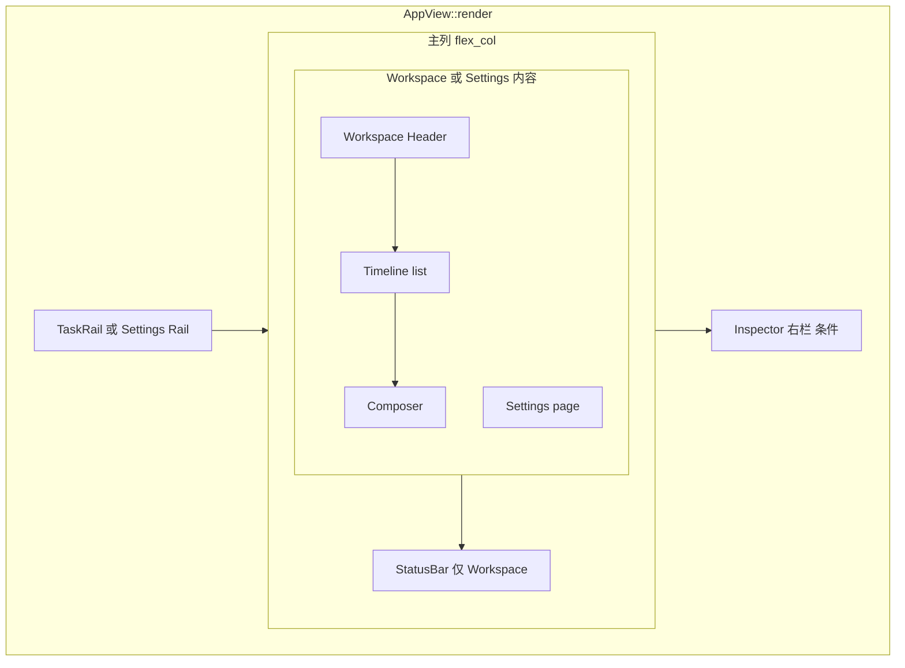
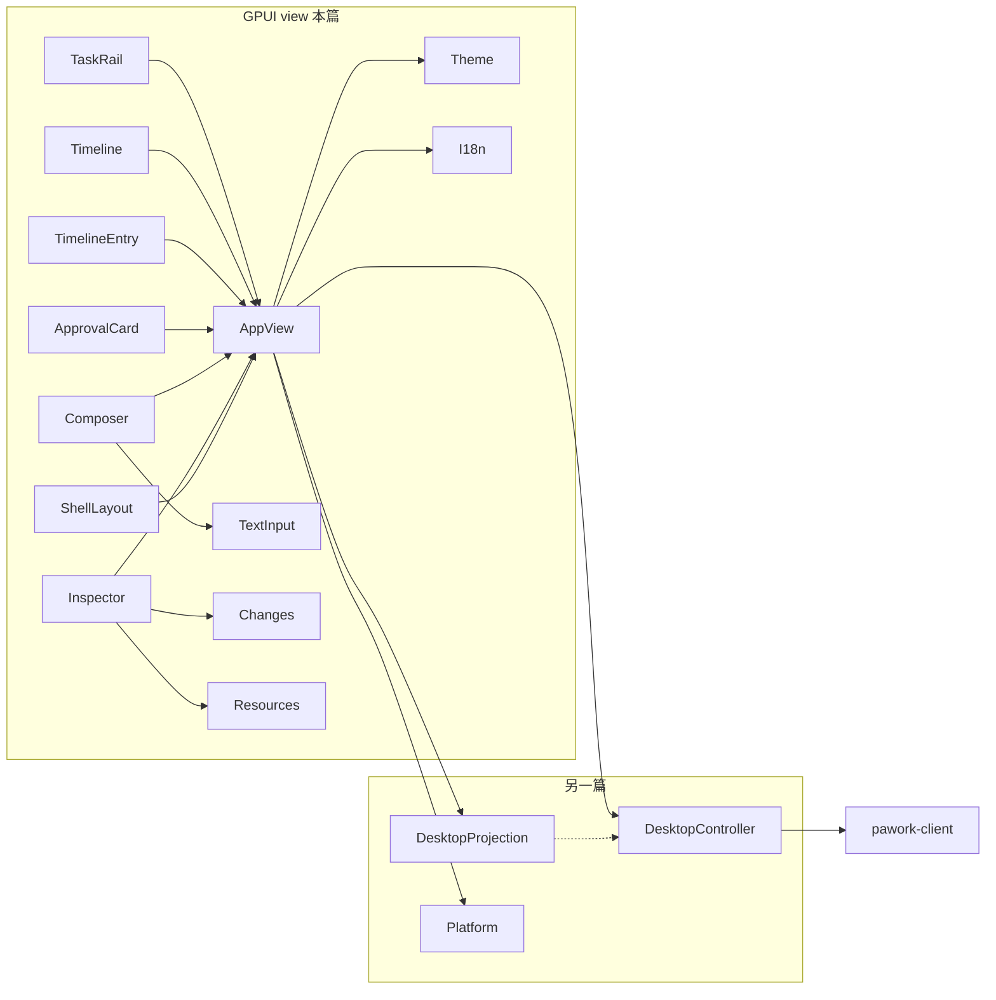

# Desktop 主界面视图层 Review

> GPUI `AppView` 宿主与工作台主界面装配：连接/事件接线、三栏壳、Timeline 虚拟化、Composer、Inspector、审批卡与主题/i18n。范围内 15 个 `.rs` 文件 / 14 328 行（含测试；不含 `components/`、`settings/`、`accessibility/`）。事实源为当前工作区源码；与 Spec 冲突处以源码为准并在文中标注。

## 1. 职责与边界

Desktop 四层里，本层是 **GPUI view**：只负责像素、焦点、键盘、菜单与无障碍投影入口。它不解析 wire、不持有 Host 会话状态机、不直连 Provider / SQLite / 工具。

纪律（源码与 [docs/spec/desktop.md](../../spec/desktop.md) 一致）：

- 业务副作用只经 `DesktopController`（`pawork-client`）发出；`AppView` 字段里的 `controller: Arc<DesktopController>` 是唯一出口。
- 展示状态读 `DesktopProjection`；timeline / session / run / settings 查询面的权威值来自 controller 回执经 projection reducer 收敛，**不乐观更新**。
- 关闭窗口不取消已进入 Core 的 Run；切到 Settings 路由只换渲染，工作台草稿 / Timeline / Inspector / Run 字段全部保留。
- `AppRoute::Settings` 下审批 / 取消 / 新建 / Inspector / 任务导航的全局键全部旁路（`workspace_action_active`）；字号缩放是应用级键，不受此守卫。
- 需要 live connection 的动作共用 `live_action_enabled(connection, target_present)`：render、键盘、快捷键、AX 最终 handler 入口再复核（fail-closed）。

`AppView` 自身（`ui/mod.rs`）是连接、事件消费、状态与动作接线的宿主；渲染块已外移：TaskRail → `task_rail.rs`，Timeline 虚拟化 → `timeline.rs`，条目 → `timeline_entry.rs`，审批卡 → `approval_card.rs`，Inspector → `inspector.rs`，Composer → `input_area.rs`，Changes → `changes.rs`，Resources → `resources.rs`。

**Spec / 注释与源码差异（以源码为准）：**

| 位置 | Spec / 注释说法 | 源码事实 |
| --- | --- | --- |
| `gui-design.md` ASCII | Workspace 画在左下 | Workspace Header 在主栏顶；rail 底是 Local + Settings gear |
| OPT-4b | 宽屏默认展开 Inspector | `inspector_open` 默认 `false`；宽屏同样折叠，Header 提供展开按钮 |
| `mod.rs` `timeline_list` 字段注释 | 「Bottom 对齐钉底」 | `timeline.rs` 已改为 Top 对齐 + `timeline_following` 显式跟随 |
| Settings Network | 产品名 Network | 枚举仍是 `SettingsPage::General`，字段 `settings_general` |
| Terminal | 易被当成 VT emulator | `plain_terminal_output` 过滤 ANSI/VT 的纯文本视图 |
| 主题 | 可能读系统外观 | 仅 `theme::dark()`，不读系统偏好 |
| `settings/appearance.rs` 模块注释 | 语言「不持久化」 | `AppView::set_language` 经 `save_appearance` 写入用户目录 `desktop.json` |

## 2. 文件清单

| 相对路径 | 行数 | 职责 |
| --- | ---: | --- |
| `apps/desktop/src/ui/mod.rs` | 4674 | `AppView` 宿主：路由、连接、事件分发、焦点/菜单/草稿、Render 装配 |
| `apps/desktop/src/ui/shell_layout.rs` | 295 | 壳层几何合同：rail 宽 / Inspector 是否参与布局 |
| `apps/desktop/src/ui/timeline.rs` | 681 | gpui `list()` 变高虚拟化、行高公式、跟随/脱钩、行组装 |
| `apps/desktop/src/ui/timeline_entry.rs` | 986 | 消息/错误/tool group/Run 摘要条目渲染与 Fork |
| `apps/desktop/src/ui/approval_card.rs` | 161 | pending approval 警示卡与 Allow once / Allow for run / Deny |
| `apps/desktop/src/ui/input_area.rs` | 708 | Composer 两行结构、模型菜单、发送/取消同槽 |
| `apps/desktop/src/ui/text_input.rs` | 1458 | 共用单行/多行输入（IME、undo、secure 掩码） |
| `apps/desktop/src/ui/inspector.rs` | 747 | Inspector 三页签壳、Terminal 纯文本页、Stop/Close |
| `apps/desktop/src/ui/changes.rs` | 1042 | Changes Files/Summary、DiffView、ActivityPopover 状态机 |
| `apps/desktop/src/ui/resources.rs` | 366 | Inspector Resources：MCP 只读清单 |
| `apps/desktop/src/ui/task_rail.rs` | 1041 | 左侧 TaskRail：scope/分组/项目块/任务行/改名归档 |
| `apps/desktop/src/ui/theme.rs` | 707 | 深色 token、字阶、几何 metrics |
| `apps/desktop/src/ui/i18n.rs` | 879 | English / 中文 `t()` 目录（render 与 AX 同源） |
| `apps/desktop/src/ui/barriers.rs` | 174 | 测试 fixture barrier 文件发射器 |
| `apps/desktop/src/ui/u1_probe.rs` | 409 | GPUI TestAppContext 探针（不挂 AppView） |

`ui/mod.rs` 还 `mod` 了 `components` / `settings` / `accessibility`，本篇不覆盖，见 [components-settings.md](components-settings.md)。


## 3. 界面结构总览

`Render for AppView` 每次帧：安装 AppKit Tab 监听 → 兑现 `pending_scope_focus` / `pending_inspector_focus` → `sync_accessibility` → `shell_layout::resolve` → 按 `AppRoute` 装配。

宽窗（>1279、非 150% 字号）几何：TaskRail 288 / Workspace 弹性（≥560）/ Inspector 440；StatusBar 仅 Workspace 路由、高 24。窄窗 ≤1279：rail 240 且强制折叠 Inspector。150% 字号 rail 320，需 ≥1320 才展开 Inspector。用户 `inspector_open` 偏好不在 resize 时改写。

`inspector_open` 默认 `false`（OPT-4b）：宽屏同样默认折叠，Workspace Header 右侧提供 Activity 触发器与展开按钮；折叠态 ActivityPopover 从 Header 弹出。

```
┌─ shell-rail (288/240/320) ─┬──────────── shell-workspace (flex) ─────────────┬─ shell-inspector (440, 可选) ─┐
│ traffic-light 36px 安全区   │ Workspace Header（标题/状态点/分支/Activity/展开） │  Changes | Terminal | Resources │
│ Pawork + grouping 二态按钮  │ Timeline list() 可读列 618px，Top+跟随            │  当前页签内容                   │
│ scope 下拉                  │ Composer（输入 + footer 动作槽）                  │                               │
│ 连接态 · New task           │──────────────────────────────────────────────────┤                               │
│ 日期桶 / 项目头 / 任务行    │ StatusBar 24px（Run 状态 Badge，仅 Workspace）     │                               │
│ Local · Settings gear       │                                                  │                               │
└─────────────────────────────┴──────────────────────────────────────────────────┴───────────────────────────────┘
```

Settings 路由：左栏换成 Settings Rail（返回 + 条件导航），右栏全宽内容 + 32px pad；无 StatusBar。返回工作台不取消 Run。



## 4. 组件与方法功能列表

### 4.1 `ui/mod.rs` — AppView 宿主

模块注释写明职责：连接 / 事件消费 / 状态与动作接线 / 整体渲染装配。公开 `install_keybindings`、`AppView`、再导出 `text_input::{SendMessage, TextInput}`。

#### 路由、动作与 Tab 合同

| 名称 | 种类 | 功能 / 语义 |
| --- | --- | --- |
| `AppRoute` | enum | `Workspace` / `Settings` 互斥渲染；切路由不碰工作台字段 |
| `SettingsPage` | enum | Providers（默认）、General（UI 名 Network）、Permissions、Tools、Terminal、Appearance、Advanced、About |
| `workspace_action_active` | fn | Settings 路由下旁路工作台专属 action |
| `APP_VIEW_KEYBINDINGS` | const | `cmd-.` CancelRun、`cmd-enter`/`cmd-1` ApproveOnce、`cmd-2` ApproveForRun、`cmd-3` Deny、`cmd-n` NewTask、`cmd-i` ToggleInspector、`cmd-alt-up/down` 任务循环、`cmd-alt-n` NextNeedsAttention、`cmd-=`/`+`/`-`/`0` 字号 |
| `RAIL_TAB_STOP_IDS` / `RAIL_TAB_INDEX_*` | const | rail Tab 前缀：scope −20、grouping −19、add-task −18、reconnect −17、行 −16、settings −15 |
| `COMPOSER_TAB_INDEX` | const | Composer 在链尾（1 档） |
| `INSPECTOR_TAB_INDEX` | const | Inspector 页签主路径档（0）；与 rail 负档、composer 1 档组成 Tab 链 |
| `MAIN_PATH_TAB_STOP_IDS` | const | 主路径可测 tab_stop 标记（审批三钮、composer-action、add-task 等） |
| `workspace_empty_title/hint` | fn | 空态文案，视觉与 AX 同源 `i18n::t` |
| `install_keybindings` | pub fn | 注册 AppView + TextInput 快捷键 |
| `install_appkit_tab_monitor` | fn | macOS：NSWindow 吞裸 Tab，本地 KeyDown 监听驱动 `focus_next/prev` |
| `TooltipText` / `tooltip_text` | View | 浮层 tooltip；`now_unix_ms` 给相对时间与 barrier |

#### 菜单与焦点衔接

| 名称 | 种类 | 功能 / 语义 |
| --- | --- | --- |
| `MenuKind` | enum | 单一打开位：Scope / Model / SettingsRole / SettingsProviderModels / Entry(event_id) / Activity。开新即关旧 |
| `pending_keyboard_menu_select` | 字段 | Enter 选菜单后吞同键 keyup 合成 click，防「选择即重开」 |
| `pending_row_key_activate` / `pending_button_key_activate` | 字段 | 行/按钮键盘激活后吞合成 click；Slice 5 起只要键盘 click + 有标记即吞，不要求 id 匹配 |
| `pending_outside_close` | 字段 | 外点关闭与触发器 click 同一次物理按下才视为收尾不再重开 |
| `should_swallow_keyboard_click` | fn | 键盘合成 click 且存在未消费标记 → 吞；鼠标有按下位置永不吞 |

#### `AppView` 关键字段（改动时要注意）

| 字段 | 语义 / 改动注意 |
| --- | --- |
| `_platform` | 持有 tokio Runtime，防 GUI 连接宿主提前 shutdown |
| `controller` / `socket` | 唯一 Host 出口；重连前必须替换 `event_task` 丢掉旧 receiver |
| `handshake_info` | 非 Secret 握手摘要；Connecting/断线清空，About 页依赖 `host_data_dir` |
| `projection` | 展示状态机；view 不直接改 wire |
| `text_input` / `terminal_input` | Composer 与 Terminal 各一 `TextInput` 实体 |
| `composer_drafts` / `no_session_draft` | per-session 草稿；无 active session 走独立槽 |
| `terminal_drafts` / `terminal_input_workspace` | Terminal 输入按 Inspector 所属 workspace 隔离 |
| `timeline_list` / `timeline_following` / `timeline_rev` | 虚拟化 ListState；跟随态；数据/宽度变化代次（reset 语义） |
| `terminal_pending_write/create/close/resize` | 单一在途槽；create 按 workspace 去重；close 捕获 Stop vs Close 意图（ADR-045） |
| `terminal_size_draft` | stepper 本地草稿，Apply 才 `terminal_resize`；迟到回执不得抹新草稿 |
| `persist_appearance` | 正式窗口才读盘；测试构造不访问用户配置 |
| `collapsed_tool_groups` | 本地折叠，不进 wire/replay；key = 首个 tool event_id |
| `inspector_open` / `inspector_tab` | 用户偏好默认折叠；窄窗由 `resolve` 强制不参与布局；顶层页签 Changes / Terminal / Resources |
| `changes` / `resources` | Inspector 两查询面状态（epoch 丢弃过期响应） |
| `open_menu` / `menu_highlight` / `settings_role_pending` | 至多一个浮层；角色默认写在途时仅该角色下拉禁用 |
| `timeline_*_focus` BTreeMap | 按 event_id 懒建；虚拟化卸载不丢键盘焦点 |
| `session_rename` | 同一时刻至多一行内改名 |
| `route` / `settings_page` | 顶层路由与 Settings 页；能力不到位时 render 回退 Providers/Advanced |
| `settings_api_key_inputs` | secure 输入明文只留实体内，提交/取消/离页清空含 undo |


#### 连接与事件

| 名称 | 种类 | 功能 / 语义 |
| --- | --- | --- |
| `AppView::new` | 构造 | 建输入实体、ListState（Top 对齐 + overdraw 200）、挂 `install_scroll_follow`、BarrierSink 读 `PAWORK_UI_BARRIER_DIR`、`start_connect` |
| `start_connect` | fn | 清 barrier/handshake；About 页退 Advanced；`Connecting`；`controller.connect`；失败写 Failed + retry hint |
| `on_connected` | fn | 存 handshake；Fresh / Resume 应用 snapshot；`refresh_all_settings`；`consume_events`；`arm_run_clock`；ReplaceBaseline/Fresh 可能 `open_session` 或 `pending_scope_focus` |
| `consume_events` | fn | 替换 `event_task`，逐条 `handle_controller_event` |
| `handle_controller_event` | fn | 置 `controller_event_pending`、清 settle barrier，再 match 分发（见 §5） |
| `arm_run_clock` | fn | 1s tick：刷新 Run 计时标签；静默窗口写 `timeline_stable` / `approval_visible` |
| `emit_settle_barriers` | fn | 无新事件、分页完成、有 session 时写 timeline_stable；有 pending 写 approval_visible |

#### 会话 / 任务 / 改名 / 归档

| 名称 | 种类 | 功能 / 语义 |
| --- | --- | --- |
| `open_session` | fn | 关菜单、退出改名、stash 草稿、`select_session`、`timeline_paging=true`、reset 跟随、`changes.reset_for_session`、`controller.open_session` |
| `on_session_clicked` | fn | 已是当前 session 则只关菜单并 focus Composer，否则 `open_session` |
| `on_new_session` | fn | ADR-054：All projects 下直建 Unassigned，不弹 WorkspaceConfirm；项目作用域定向新建 |
| `on_open_project` | fn | `prompt_for_paths` 选目录 → `controller.open_workspace` |
| `create_task` / `can_create_task` | fn | 仅 Connected 可建；`controller.create_session(workspace_id)` |
| `begin/commit/cancel/end_session_rename` | fn | 行内改名：Enter 提交、Esc 取消、空白不提交、未变化只退出 |
| `session_rename_decision` | fn | KeepEditing / Close / Submit |
| `on_session_archive` | fn | `controller.archive_session`；立即从列表隐藏（snapshot 收敛），不取消 Run |

#### 菜单、键盘、任务导航

| 名称 | 种类 | 功能 / 语义 |
| --- | --- | --- |
| `toggle_menu` / `dismiss_menu_on_outside` / `close_open_menu` | fn | 单一菜单；外点按按下位置衔接 |
| `handle_root_key` | fn | 菜单开且触发器聚焦：↑↓ 高亮、Enter 选择、Escape 关并回焦；否则 Escape 关菜单；Tab 走焦点链。**面板 deferred 不可聚焦，根节点是唯一键盘机制** |
| `handle_inspector_key` | fn | Inspector 页签 Left/Right；Changes 二级页签循环 |
| `menu_item_count` / `menu_selected_index` | fn | SettingsRole：Clear 恒占 index 0，空候选仍为 1（可键盘清除已保存默认）；Composer 模型菜单按启用目录计数 |
| `activate_menu_item` | fn | 按 `MenuKind` 派发 scope/model/role/models/entry/activity；SettingsRole 的 ix=0 为 Clear（空候选同样派出清除，回执前不乐观改投影） |
| `activity_header_visibility` | fn | Activity 触发器仅 Inspector 折叠态出现；浮层再叠加菜单打开。render 与 AX 同源 |
| `rail_stops` / `rail_focus_stops` / `RailStop` | 焦点链 | scope → grouping → add-task → 项目头 / 定向新建 / task 行 |
| `cycle_active_task` / `open_next_needs_attention` | fn | Cmd-Alt-Up/Down 循环可见任务；Cmd-Alt-N 按 NeedsInput > Blocked > Unread |
| `attention_for` / `next_attention_session` / `cycle_index` | fn | 优先级与循环下标纯函数 |
| `on_reconnect` | fn | 断线后再次 `start_connect` |
| `on_open_settings` / `on_close_settings` | fn | 切路由；进入 Settings 刷新查询面；返回恢复工作台焦点 |
| `refresh_all_settings` / `refresh_models_authority` / `refresh_provider_status` / `refresh_general/permissions/terminal_settings` | fn | 连接后或页级 Refresh 重查 Host |
| `apply_model_cleared_note` | fn | 禁用模型导致角色默认被清时诚实提示，不静默换绑 |
| `on_select_settings_page` / `on_refresh_settings` | fn | 导航与页级刷新 |

#### 发送 / 审批 / 取消 / Inspector

| 名称 | 种类 | 功能 / 语义 |
| --- | --- | --- |
| `on_send_message` | action | 改名聚焦 → 提交改名；Terminal 聚焦 → `send_terminal_input`；IME composing 不发；否则 `send_current_message` |
| `send_current_message` | fn | 需 can_send：Connected + active session + 无 run + 目录非空 + 非空文本；`controller.send_message` |
| `can_send` / `composer_has_sendable_text` | fn | 已连接且 models_loaded 且 models 空 → fail-closed 不发送 |
| `send_terminal_input` | fn | 无终端则 `ensure_terminal`；有在途 write 拒绝；成功回执且用户未续编才清空 |
| `on_approve` / `can_approve` / `on_approve_once` / `on_approve_for_run` / `on_deny` | fn | mouse / 键 / 快捷键 / AX 汇入；`controller.approve(run_id, tool_call_id, decision)`；关卡后 focus Composer。**关审批卡 ≠ Allow** |
| `on_cancel_clicked` / `can_cancel` / `on_cancel_run` | fn | 入口再复核；`controller.cancel_run` |
| `on_toggle_inspector` / `on_toggle_inspector_action` | fn | 翻转偏好、`timeline_changed`（宽度影响换行高度）、展开时刷新当前页签 |
| `select_inspector_tab` / `refresh_open_inspector_tab` | fn | 切 Changes/Resources 才拉取；Terminal 无查询面 |
| `on_select_changes_tab` / `on_select_diff_file` / `on_activity_open_changes` | fn | 二级页签、选文件拉 diff、Activity 摘要打开 Changes |
| `on_review_changes` | fn | 展开 Inspector → Changes；先快照可用性再 refresh，避免 Fetching 误报不可用 |
| `refresh_changes` / `fetch_diff` / `refresh_resources` | fn | epoch 拉取；无 workspace / 断线诚实失败或 stale |
| `inspector_workspace_id` | fn | active task 优先，否则 rail scope，再 snapshot 默认 workspace |
| `reconcile_terminal_workspace` | fn | 切 workspace 保存/恢复 terminal 草稿；清 size draft |
| `stash/restore_composer_draft` / `apply_message_sent_draft` / `message_sent_clears_visible_composer` | fn | 切 session 保草稿；MessageSent 只清对应 session，可见 Composer 仅当回执属于当前 active |
| `can_fork_entry` / `can_switch_model` / `can_open_model_menu` | fn | Fork：Connected + active + fork_boundary。模型菜单：无 run 且（有目录或已加载含空） |
| `timeline_changed` | fn | `timeline_rev += 1`，下次 render `reset` |
| `restore_appearance` / `save_appearance` / `set_text_scale` / `set_language` | fn | 用户目录 `desktop.json`；测试 `persist_appearance=false` 不写盘 |
| `on_increase/decrease/reset_text_size` | action | 应用级字号，Settings 路由仍生效 |
| `live_action_enabled` | fn | `Connected && target_present` |
| `header_status_visual` | fn | Header 状态点与 rail 同色映射，无终态绿 |
| `terminal_can_operate` / `terminal_known_ended` / `terminal_can_reopen` / `terminal_close_label` / `terminal_start_enabled` / `terminal_resize_receipt_clears_draft` | pub(crate) fn | Stop vs Close 与 Start 的三路径同源谓词（ADR-045）；resize 回执只清匹配草稿 |
| `inspector_tab_key_target` / `changes_tab_key_target` / `inspector_focus_after_toggle` | fn | 页签键盘循环；折叠回焦 Activity，展开回焦当前 tab |
| `workspace_header_element` / `header_branch` / `changes_available_for_active` | fn | Header 装配；分支只读 projection；CTA 门转发 `has_reviewable_files_for` |
| `timeline_entry_focus` / `timeline_review_focus` / `timeline_tool_group_focus` | fn | 按 event_id 懒建稳定焦点 |
| `open_entry_menu_from_keyboard` / `activate_review_changes_from_keyboard` | fn | 键盘打开 ···；Review 按 event_id 再核 |
| `focus_composer` | fn | 审批/Fork/切任务后回焦输入 |
| `click_down_position` / `note_row_key_activate` / `consume_row_key_click` / `note_button_key_activate` / `consume_button_key_click` | fn | 键盘合成 click 衔接 |
| `Render for AppView` | impl | 见 §3；Workspace 三栏或 Settings 壳；根节点挂全部 on_action |


### 4.2 `shell_layout.rs` — 壳层几何

| 名称 | 种类 | 功能 / 语义 |
| --- | --- | --- |
| `RAIL_NARROW_WIDTH` 240 / `RAIL_LARGE_TEXT_WIDTH` 320 / `NARROW_WIDTH_MAX` 1279 / `WORKSPACE_MIN_WIDTH` 560 / `TRAFFIC_LIGHT_SAFE_HEIGHT` 36 / `LARGE_TEXT_INSPECTOR_MIN_WIDTH` 1320 | const | 冻结合同 |
| `ShellLayout` | struct | `rail_width` + `inspector_open`（是否作为 440 右栏） |
| `resolve(width, inspector_preferred, large_text)` | fn | **render 与测试唯一计算入口**。窄窗强制折叠；150% 需 ≥1320 才展开。偏好不在 resize 改写 |
| `rail_safe_area` | fn | 36px 无交互占位，traffic-light 悬浮带 |
| `ShellProbeHost` | 测试 View | 复用生产 Panel/StatusBar，不挂 AppView |
| 测试 | `#[test]` + 3 个 `gpui::test` | `resolve` 钉 1280 切 rail 宽 / 1080 折叠 / 150% 需 ≥1320；探针覆盖 1440 合同、1080 折叠、resize 恢复偏好 |

改动注意：任何新断点必须改 `resolve` 一处，并同步 AX 几何（accessibility 用同一 rail 宽）。

### 4.3 `timeline.rs` — 虚拟化容器

四条滚动合同（机制已从 Bottom 钉底改为 Top + 显式跟随；短会话从 Header 下开始，不再沉底）：

1. Top 对齐 + `logical_scroll_top == None` 从首条渲染。
2. `timeline_following` 单一跟随态；reset 后显式 `scroll_to` 末项底。
3. 脱钩只用事件 `visible_range.end >= count`；**handler 内禁止借 ListState**（gpui 0.2.2 写借用内存活期会 BorrowMutError）。
4. projection 有替换语义，任何变化 `reset(new_count)`（splice 不安全）；脱钩读史恢复 offset。

| 名称 | 种类 | 功能 / 语义 |
| --- | --- | --- |
| `TIMELINE_OVERDRAW` | const | 视口外预渲染 200px |
| `install_scroll_follow` | fn | `new` 时设一次；WeakEntity 不构成环 |
| `sync_list` | fn | 行数 + 审批卡末项；rev 未变则跳过；reset 时关 Entry 菜单；跟随则滚末项，否则恢复旧 offset |
| `tool_status_label` | fn | `succeeded` → 「Completed」，其余 wire 原文，未知不伪造 |
| `row_top_gap` | fn | 消息/错误/相位 40；独立 tool 组 48；摘要带组 48 |
| `ENTRY_ACTIONS_SLOT_ESTIMATE` | const | 右侧 ··· 槽 32px，折算正文列宽 |
| `message_entry_height` / `run_summary_card_height` / `timeline_row_height` | fn | 与 render 同源的行高公式，AX 共用 |
| `timeline_visible_item_tops` / `timeline_following_window` | fn | 公式化可见窗口（AX 几何）；短内容回到 (0,0) |
| `tool_group_key` / `tool_group_is_collapsed` | fn | 首个 tool event_id；replay 与 live 同一 id，折叠不依赖行下标 |
| `timeline_area` | AppView 方法 | 空态：标题 + hint + Primary New task（无 session 且 0 条；断线保留旧条目不进空态）；否则 `list()`；脱钩时 `BackToBottom` |
| `timeline_row_element` | fn | 五行：Message/Error → entry builders；RunPhase 单行次级；ToolGroup；RunSummary（组 + 卡 + footer + ···） |
| `entry_menu_open` | fn | `MenuKind::Entry` 是否对应该 event_id |
| `tool_row_views` | fn | ToolCall → `ToolRowView` |
| `toggle_tool_group` | fn | 本地 HashSet 翻转 + `timeline_changed` |
| `run_summary_view` | fn | 仅 Completed **且** 当前 session 有可审阅文件才 `review_changes_enabled` |
| `entry_menu_dropdown` | fn | 「···」Fork 菜单；identifier 冻结 `entry-menu-{event_id}` / `fork-{event_id}` |
| `timeline_jump_to_bottom` | fn | `scroll_to` 末项并重挂跟随 |

可读列 `TIMELINE_READABLE_WIDTH` = 618。审批卡是 list 末项，不是独立 overlay。

### 4.4 `timeline_entry.rs` — 条目渲染

不引入 markdown 引擎：空行分段，段内 `- ` 连续行变 • 列表。wire 无 tool 耗时 / run 时长字段，对应列不画。

| 名称 | 种类 | 功能 / 语义 |
| --- | --- | --- |
| `display_time` | fn | epoch 毫秒串 → now/Nm/Nh/Nd；解析失败原样；render 与 AX 同源 |
| `ToolRowView` / `ToolRowStatus` | 类型 | wire status → Pending/Running/Succeeded/Failed/Cancelled/Other |
| `ToolRowView::from_parts` | 构造 | 空 detail 归一 None；status_label 走 `tool_status_label` |
| `RunSummaryView` / `RunSummaryTerminal` | 类型 | Completed ✓ / Failed ✕ / Cancelled —，禁止恒绿宣称成功 |
| `split_message_blocks` / `MessageBlock` | fn/enum | 两级切分 Paragraph/List |
| `message_block_line_counts` | fn | 列表项计入「• 」前缀；AX 行数估算共用 |
| `default_text_line_height` | fn | φ×font_px 四舍五入（gpui 默认行高） |
| `estimated_wrapped_lines` | fn | 0.6×字号估字符宽；有界近似，非精确回填 |
| `message_label_element` / `message_body_element` | fn | You/Pawork + 时间；段落间隙 28、行高 24 |
| `entry_actions_element` / `entry_shell_element` | fn | 右侧 ··· + 标签/正文 flex 行 |
| `tool_icon_element` / `tool_status_element` / `tool_row_element` | fn | 52px 行；状态色诚实映射 |
| `tool_group_summary` | fn | 头汇总真实状态 |
| `message_entry_element` | AppView | User→You，Assistant→Pawork；兜底 Tool/Run/Error 避免崩溃 |
| `tool_group_element` | AppView | 默认展开；›/⌄ 头；mouse/Enter/Space/AX 同一 `collapsed_tool_groups` |
| `run_summary_element` | AppView | Ø40 状态圆 + 标题 + 两行说明；有 CTA 才画 168×40 Review changes；无 Open in editor（无 Host capability） |
| `run_footer_element` | AppView | 终态词 + 时间，无伪造时长 |
| `error_entry_element` | AppView | danger_text；无假 retry 按钮 |
| `on_fork` | AppView | 入口再核 Connected + active session + fork_boundary；`controller.fork_session`；焦点回 Composer |

改动注意：行高公式与 AX `timeline_row_ax` 必须同步；折叠 key 不要改成行下标。

### 4.5 `approval_card.rs` — 审批卡

| 名称 | 种类 | 功能 / 语义 |
| --- | --- | --- |
| `APPROVAL_CARD_PAD_REMS` / `APPROVAL_BUTTON_ROW_GAP_REMS` / `APPROVAL_BUTTON_HEIGHT` 32 / `APPROVAL_BUTTON_SLOT_WIDTHS` [104,116,72] | const | render 与 AX 同源槽 |
| `approval_card_height` | fn | 标题 + reason 换行 + 可选 detail + 按钮行 |
| `approval_card_element` | AppView | 仅 pending 存在时作为 list 末项；三钮 id `approve-once` / `approve-for-run` / `approve-deny`，decision 字符串 `approve_once` / `approve_for_run` / `deny`；disabled 时 tooltip 说明原因 |
| `approve_disabled_reason` | fn | 无 pending / 需连接 |

关闭卡不是允许：必须点 Allow once / Allow for run / Deny（或对应快捷键/AX）。焦点句柄是 app 级，虚拟化卸载不丢。

### 4.6 `input_area.rs` — Composer

两行：输入区；footer（model / workspace chip / file-tools-unavailable / ContextMeter / status_hint / 36×36 动作槽）。Send 与 Cancel 同槽 `composer-action`，状态切换不丢焦点。

| 名称 | 种类 | 功能 / 语义 |
| --- | --- | --- |
| `MODEL_MENU_GROUP_HEADER_HEIGHT` 24 / `MODEL_MENU_EMPTY_STATE_HEIGHT` 56 | const | render 与 AX 共用 |
| `grouped_model_menu_entries` | fn | 按 provider 分组后扁平，鼠标/键盘/AX 同一顺序 |
| `model_catalog_empty_state` | fn | **唯一**允许「无已启用模型」空态：connected && models_loaded && empty。加载中/断线不得误报 |
| `composer_element` | AppView | 装配两行；IME composing 时 Send 直接 return；Cancel 为 ✕ Danger 圆钮，Send 为 ↑ Primary 圆钮 |
| `model_label` / `model_disabled_reason` / `model_menu_element` | fn | 菜单从触发器**上方**打开（`Corner::BottomLeft` + 负 gap）；全关空态仍可开说明行，无选项 |
| `composer_placeholder_hint` | fn | 只走状态机（无 session / 运行中 / 可发送等）；Forked / 发送失败等瞬态落 footer Label 而非 placeholder |
| `sync_composer_placeholder` | fn | 每帧把 hint 写进 TextInput |
| `composer_panel_height` | fn | 输入高度 → 面板高度钳制 88–220 |
| `composer_workspace_label` / `composer_workspace_no_project` / `composer_file_tools_unavailable_visible` | fn | 无项目：chip「No project」+「文件工具不可用」 |
| `on_toggle_model_menu` / `on_select_model` | fn | 选择只设 pending，等 Core 确认；不乐观改 Composer 标签 |
| `send_disabled_reason` / `cancel_disabled_reason` | fn | tooltip 诚实原因 |
| Enter / Shift+Enter | 键 | Enter 发送（IME 组合中不发）；Shift+Enter 换行（TextInput `NewLine`） |


### 4.7 `text_input.rs` — 共用输入

改编 gpui 0.2.2 `examples/input.rs`。Composer、Terminal、Settings（proxy/shell/cols/rows）、session rename、API key 共用。

| 名称 | 种类 | 功能 / 语义 |
| --- | --- | --- |
| `TextInput` | Entity + Render + Focusable | 内容、选区、marked、undo/redo 栈、scroll、secure |
| `new` / `with_placeholder` / `id` / `height_clamp` / `secure` | 构造 | secure 只暴露 grapheme `•` 掩码（API key）；`secure_mask` 给 AX |
| `sanitize_secure` | fn | secure 模式下剥离换行等 |
| `text` / `is_composing` / `clear` / `set_text` / `reset_text` / `set_placeholder` | API | `reset_text` 清空 undo（回填 Host 权威值）；`set_text` 入 undo（用户/AX 输入） |
| `EditSnapshot` / `push_undo` / `undo` / `redo` / `undo_len` | 撤销 | marked 不入栈；IME commit 单次入栈 |
| `replace_and_mark_text_in_range` | EntityInputHandler | **marked 不入 undo** |
| `replace_text_in_range` | EntityInputHandler | commit **单次** `push_undo`；清 marked |
| `text_for_range` / `selected_text_range` / `marked_text_range` / `unmark_text` / `bounds_for_range` / `character_index_for_point` | EntityInputHandler | IME 与辅助功能 |
| Left/Right/Home/End/Select*/Copy/Cut/Paste/Backspace/Delete/NewLine | actions | 标准编辑；`NewLine` = Shift+Enter |
| `on_mouse_down/up/move` / `index_for_mouse_position` / `scroll_caret_into_view` | fn | 点击定位；caret 滚入视图 |
| UTF-16 ↔ UTF-8 / display offset | fn | 平台用 UTF-16；内部 UTF-8；secure 显示偏移与 content 偏移分开 |
| `TextElement` / `PrepaintState` / `line_byte_ranges` / `runs_for_span` | Element | 布局/绘制；composer 有 max-height 钳制 |
| `SendMessage` | action | 由 AppView 根接收，输入框 Enter 触发 |
| `composer_input_max_height` | fn | Composer 输入区高度上限 |

改动注意：IME 组合中 AppView 不得发送；secure 路径完整值不进 AX/日志。

### 4.8 `inspector.rs` — 右栏与 Terminal

默认页签 Changes。Terminal **不是** VT emulator：`plain_terminal_output` 剥 CSI/OSC 等，`\\r` 当换行。滚动用 `FollowScroll`，不改 list()。

| 名称 | 种类 | 功能 / 语义 |
| --- | --- | --- |
| `InspectorTab` | enum | Changes / Terminal / Resources；`label` / `button_id` 冻结 |
| `TERMINAL_COLUMNS_STEP` 8 / `ROWS_STEP` 4；列 20–500、行 6–200 | const | stepper 边界 |
| `TERMINAL_STEPPER_*` / `terminal_header_height` / `terminal_stepper_ax_rects` | 几何 | 五按钮 AX 与 render 同源（cols-dec/inc、apply、rows-dec/inc） |
| `step_terminal_size` / `terminal_size_for_display` / `terminal_resize_status_label` | fn | 草稿只影响展示；与 Host 尺寸不同则「未应用」，一致才显示 confirmed |
| `plain_terminal_output` | fn | 过滤 ANSI/VT |
| `terminal_empty_output` | fn | 无输出占位，视觉与 AX 同源 |
| `terminal_stepper` | fn | Ghost 无 padding；disabled 由调用方；`adjust_terminal_size` 内再核 gate |
| `inspector_element` | AppView | `Panel::side_left(440)`；页签条 58px + accent 下划线；collapse |
| `terminal_page_element` | fn | 头：cwd / size stepper / Apply / Start 或 Stop/Close；体：纯文本 + FollowScroll；底：terminal_input |
| `on_start_terminal` / `ensure_terminal` / `begin_terminal_create` | fn | create pending 按 workspace 去重；cwd 由 UI 补（wire 回执不带 cwd） |
| `on_close_terminal` | fn | running→Stop 终止；exited/killed/failed→Close 清 tombstone；pending 记录 `remove_on_success` |
| `on_apply_terminal_size` / `adjust_terminal_size` | fn | stepper 改草稿；Apply 才 `terminal_resize`；在途时三路径同 gate 禁用 |

新终端 create 成功会**程序化展开 Inspector** 并关悬浮菜单。

### 4.9 `changes.rs` — Diff 视图

数据只来自 `diff_list_files` / `diff_get`。未拉取或失败显示 unavailable / 错误，不画演示数据。

| 名称 | 种类 | 功能 / 语义 |
| --- | --- | --- |
| `ChangesTab` | enum | Files（默认）/ Summary；二级条 56px |
| `ChangesFetch` / `DiffFetch` | enum | Idle / Fetching / Ready / Failed |
| `ChangesPanelState` | struct | epoch + diff_epoch；`stale_reason`；list_scroll 与 diff_scroll 独立 |
| `begin_refresh` / `apply_files` / `mark_failed` / `mark_failed_for_epoch` / `mark_stale` | 方法 | 过期 epoch 丢弃；断线标 stale **保留最后成功数据**；Fetching 中断线不丢已有 Ready |
| `begin_diff_fetch` / `apply_diff` / `mark_diff_failed*` | 方法 | 路径或 session 不匹配则丢弃/失败「diff scope changed」 |
| `reset_for_session` | 方法 | 切会话清空 |
| `totals` / `status_counts` / `has_reviewable_files_for` / `activity_summary` | 方法 | CTA 门：Ready + 非 stale + 非空 + session 匹配；未就绪摘要为 `unavailable` 不显示 0 |
| `changes_element` | AppView | 二级页签 + Refresh；Files：清单 + DiffView；Summary：计数与 git 信息 |
| `changes_session_mismatch` / `session_mismatch` | fn | 清单 session 与 active 不一致时提示 |
| `changes_files_element` / `changes_file_list_element` | fn | 状态字 + path + +A/−D；选中拉 diff |
| `diff_view_element` | fn | hunk 头 + 行；Add/Delete/Context 着色；gutter 24px |
| `changes_summary_element` / `summary_row` | fn | 文件数/新增/删除/status 分组/git |
| `activity_popover_element` | AppView | 折叠态 320×144；摘要行打开 Changes |
| `changes_placeholder*` | fn | 空/错/stale 占位 |

### 4.10 `resources.rs` — MCP 只读

| 名称 | 种类 | 功能 / 语义 |
| --- | --- | --- |
| `ResourcesFetch` / `ResourcesPanelState` | 类型 | epoch；`available` 至少成功一次（Settings Tools 导航 gate）；`action_error` 给 Settings 写失败 |
| `begin_refresh` / `mark_failed*` / `mark_stale` / `apply_servers` | 方法 | epoch 丢弃过期 |
| `apply_authoritative_servers` | 方法 | mcp_test/remove 回执：bump epoch 使在途 mcp_list 失效 |
| `mcp_server_name_row` / `mcp_server_meta_text` | fn | Inspector 与 Settings Tools **共用渲染形状** |
| `resources_element` | AppView | 只读列表 + Refresh；「已加载规则」无 Host 出口 **不画** |
| `resources_placeholder*` | fn | 空/错/stale 占位 |

### 4.11 `task_rail.rs` — 左侧会话栏

| 名称 | 种类 | 功能 / 语义 |
| --- | --- | --- |
| `RailView` | enum | Timeline(日期桶) / Projects(项目块) |
| `relative_activity` | fn | rail 行与 Timeline 时间共用 now/Nm/Nh/Nd |
| `status_dot` | fn | 实心语义色或空心灰（不声明语义）；**无终态绿点**（wire 无每会话终态） |
| `sidebar_element` | AppView | safe area + 标题行 + grouping 二态（图标表达**下一步动作**，不是当前模式）+ scope + 连接/New task + 列表 + 底栏 Local/Settings |
| `scope_menu_element` | fn | All projects + 各 workspace + Open project |
| `task_rail_list` / `project_block` | fn | Timeline：日期桶→项目头→任务；Projects：项目块。折叠只留头。Unassigned **无定向 +** |
| `toggle_grouping` / `on_toggle_scope_menu` / `on_select_scope` / `on_toggle_project` / `on_project_add_task` | fn | scope 与 grouping 正交 |
| `handle_rail_navigation_key` | fn | 行内方向键在 RailStop 链移动 |
| 任务行 | UI | 状态点优先级 Needs input 琥珀 > Running 蓝 > Blocked 红 > 空心灰；铅笔改名；归档立即隐藏 |
| `scope_label` / `connection_status_label` / `add_task_disabled_reason` | fn | 文案 |

grouping 按钮：`TaskRailGrouping::Timeline` 时 glyph 为 ▤，Projects 为 ◷。改图标语义时同时改 tooltip `toggle_action_label`。

### 4.12 `theme.rs` — 深色 token

| 名称 | 种类 | 功能 / 语义 |
| --- | --- | --- |
| `Theme` + `impl Global` | struct | `dark()` 唯一主题 |
| `BackgroundColors` / `SurfaceColors` / `BorderColors` / `TextColors` / `AccentColors` / `SemanticColors` | struct | token 分组 |
| `font::TextScale` | enum | 100 / 125 / 150；`rem_pixels` 16/20/24；increase/decrease |
| `font::BODY/TITLE/XS/SM/BASE/HEADER_TITLE/ICON/MONO` | Rems | 字阶冻结；BASE_REM_PIXELS=16 |
| `metrics::*` | const | rail/header/timeline/composer/inspector 几何（SIDEBAR_WIDTH 288、INSPECTOR_WIDTH 440、STATUS_BAR_HEIGHT 24、TIMELINE_READABLE_WIDTH 618、COMPOSER_SEND_SIZE 36 等） |

不读系统 Light/Dark。`window.set_rem_size` 由 `set_text_scale` 驱动。改视觉合同先改 metrics 并同步 AX 公式。

### 4.13 `i18n.rs` — 界面语言

| 名称 | 种类 | 功能 / 语义 |
| --- | --- | --- |
| `Language` | enum | English 默认（测试/AX 断言基于此）、Chinese；`display_name` / `identifier` |
| `LANGUAGES` / `language_from_identifier` | const/fn | 切换器顺序；未知 id fail-closed |
| `t` / `t2` / `catalog_overview_label` | fn | render 与 AX **必须**同源；未知 key **原样返回**（漏译可见，不空白） |
| `language` / `set_language` | fn | AtomicU8 全局；AppView 再镜像并落盘 |
| `localize` / `localize_t2` / `localize_catalog_overview` | fn | 纯函数，单测无全局副作用 |
| 不翻译 | 合同 | AX id 英文稳定；会话标题、provider/model id、路径、wire 错误详情不翻译 |

### 4.14 `barriers.rs` — 测试 barrier

仅 `PAWORK_UI_BARRIER_DIR` 设置时启用，否则零 IO。Desktop **唯一** barrier 写点；projection 保持纯状态机。

| 名称 | 种类 | 功能 / 语义 |
| --- | --- | --- |
| `BarrierSink::new` | 构造 | 惰性 `create_dir_all`；失败仍静默 |
| `is_active` | 方法 | 决定 1s tick 是否常驻 |
| `write_timeline_stable` | 方法 | 文件名即合同；JSON 含 settle_seq / session_id / entry_count / at_ms；tmp+rename |
| `remove_timeline_stable` | 方法 | 新连接/新 session 去掉陈旧信号 |
| `write/remove_approval_visible` | 方法 | pending 卡可见性 |
| `write_barrier` | fn | 同目录原子替换 |

IO 失败静默，不影响 UI。

### 4.15 `u1_probe.rs` — GPUI 探针

`#[cfg(test)]`。`ProbeHost` 挂 TextInput + Button + overflow 滚动，**不挂 AppView / Platform / socket**。覆盖：action paste、focus、keystroke、Shift+Enter 换行、鼠标 click、滚轮、resize debug bounds、clipboard、IME commit 单次 undo、Wave B keymap。壳层探针在 `shell_layout` 测试里另有 `ShellProbeHost`。

| 名称 | 种类 | 功能 / 语义 |
| --- | --- | --- |
| `ProbeHost` | 测试 View | 最小可聚焦宿主 |
| `mount_probe` / `focus_composer` / `composer_text` / `composer_focused` | 测试辅助 | 装窗与断言 |
| 十余个 `#[gpui::test]` | 测试 | 验证 GPUI 能力地板，不是产品回归全集 |


## 5. 关键行为与契约

### 5.1 事件订阅与更新路径

`start_connect` → `controller.connect` → `on_connected` 应用 snapshot/resume → `consume_events` 循环 `handle_controller_event`。任一事件先清 settle barrier，再：

| ControllerEvent | 视图层动作 |
| --- | --- |
| Disconnected | 清 handshake；About→Advanced；changes/resources/settings mark_stale；清全部 terminal pending；停分页 |
| Snapshot | 或有 active 则 stash 草稿；merge；active 落空则关菜单、reset changes、restore 草稿、pending_scope_focus |
| TimelineLoaded | 仅当 session 仍是 active 才 apply；complete 清 paging |
| Event | TerminalOutput 走 FollowScroll；其它 apply 后 `timeline_changed`；Run 终态刷新 Changes；auth 成功可能 refresh_provider_status |
| SessionCreated / SessionForked | `open_session` |
| WorkspaceOpened | 设 scope、reconcile terminal |
| TerminalCreated | 清 pending create、补 cwd、按 settings 初始尺寸再 `terminal_resize`、展开 Inspector |
| TerminalCreateFailed | 清 pending、mark failed |
| TerminalWriteSucceeded/Failed | 匹配 pending 才清输入；失败保留文本 |
| TerminalResizeSucceeded/Failed | 仅 id+尺寸匹配才清 pending/draft |
| TerminalCloseSucceeded/Failed | Close 成功仅当发出时是 Close 意图才 `remove_terminal`（Stop 保留 tombstone） |
| MessageSent | 清该 session 草稿；可见 Composer 仅匹配 active 时 clear |
| Settings 各类 Loaded/Confirmed | 回执即写后状态写入 projection；terminal 输入框 `reset_text` 权威值；use_proxy/model/role 不乐观 |
| AuthStarted | 登记 OAuth 等待，进度由后续 AuthChanged 收敛 |
| OperationFailed | 按 action 字符串分发到对应 settings/resources 错误行；角色/模型写失败保旧；auth 失败重查 status |
| SessionOpenFailed | 仅当仍是 active session 才清 paging（防快切误清） |
| DiffFiles/Content / McpServers * | epoch 匹配才落地；文件焦点句柄随清单增删；Receipt 走权威清单 |

1s `arm_run_clock`：有 Run 则刷新耗时标签；静默且分页完成写 barrier。

### 5.2 虚拟化卸载语义

- `list()` 视口外条目不挂 GPUI 元素；「···」菜单锚在条目内，**reset 必须先关 Entry 菜单**。
- 焦点句柄按 event_id 存在 AppView 的 BTreeMap，卸载/重挂不丢普通键盘焦点；删除后遗留项随窗口生命周期回收。
- 审批三钮、composer-action 是 app 级句柄，与 list 项无关。
- 高度缓存随 reset 失效；Inspector 展开改变列宽必须 `timeline_changed`。
- AX 树只发布公式化可见窗口内的行（`timeline_visible_item_tops`），与虚拟化一致。
- 菜单浮层 `deferred(anchored())` + `occlude()`，不进入 list 项焦点。

### 5.3 主题 / i18n

深色单主题。字号三档即时 `set_rem_size`，rail 宽随 150% 变 320。语言 English/中文，`t()` 同源。正式窗口 `restore_appearance` 读 `desktop.json`；测试构造不读盘。`appearance.rs` 注释写语言「不持久化」与 `set_language` → `save_appearance` 冲突，以 `mod.rs` 为准。

### 5.4 其它冻结行为

- **fail-closed**：目录空不发送；断线审批/取消/发送入口再核；Settings 写三路径（可见/键盘/AX）同 gate。
- **关闭审批卡 ≠ 允许**。
- **All projects + New task** → Unassigned（ADR-054），不弹确认框。
- **归档**立即隐藏，不删除磁盘会话、不取消 Run。
- **模型选择**只 pending，等 Core。
- **菜单**根节点键盘；组件无 Escape API。
- **FollowScroll**（Terminal）直读 `is_scrolled_to_bottom()`，禁止 delta 投影（gpui 0.2.2 双计）。
- **gpui flex_col + min_w_0**：nowrap 文本截断投毒（工程经验）；条目 truncate 自身不加 min_w_0。

## 6. 协作关系



渲染方法是 `impl AppView` 分散在各文件的 `pub(super)` 装配函数；状态仍集中在 `AppView` 字段。改交互先改 AppView 入口谓词，再改对应 element，最后核 AX 树（`ui/accessibility/`）是否同源。Settings / 组件库 / AX 见 [components-settings.md](components-settings.md)。
