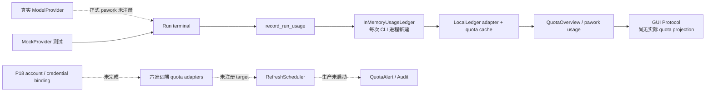

# Phase 14 Review — Usage / Quota

- 评审日期：2026-08-11
- 评审范围：当前工作区源码、[ROADMAP](../../ROADMAP.md)、`plan/P14-*.md`、[Usage / Quota](../features/usage-quota.md)、[ADR-033](../adr/ADR-033-control-plane-separation.md) 及相关架构文档
- 评审性质：只读 Review；未修改实现、计划状态或既有文档

## 0. 总结论

**结论：Phase 14 已形成测试充分的 quota library 与本地投影骨架，但尚未形成可在正式 `pawork` 主流程中持续工作的 Usage / Quota / Alerting 闭环。当前把 P14-1～P14-9 整体标记为 `TargetVerified`，会把“库内实现通过测试”误读为“生产链路已验证”。**

已完成且设计基本正确的部分包括：统一 `QuotaAdapter` 契约、六家供应商解析与错误分类、cache-only 查询、窗口聚合、Ledger 投影、singleflight / cancellation、刷新调度与告警状态机，以及 core-api / GUI Protocol 的类型和事件传输。

关键缺口不是再增加抽象，而是现有能力没有接入同一条真实生命周期：

1. 每次 CLI 启动都会新建 `InMemoryUsageLedger`，因此一次 `pawork run` 写入的用量不能被下一次 `pawork usage` 读取。
2. 正式宿主没有注册真实 Provider，六家远端 quota adapter 也没有注册为 refresh target；`RefreshScheduler`、审计 sink 与告警桥仅在库和测试中闭环。
3. 本地用量被固定归属到 `tenant=local`、`account=local/default`、`credential=None`，无法满足按真实绑定账号/凭据查询的目标。
4. `QuotaOverview` 在未指定 provider 时只选择一个已注册 provider，不能表达“所有绑定 provider/model”；GUI 目前只有协议类型和通用事件转发，没有实际 quota projection / 页面。
5. quota-service 内还保留了零生产消费者的 capability matrix、OAuth 通用层、重复时间算法、重复错误合并和三套脱敏规则，复杂度已经超过当前真实接入面。

最简单的收口方向是：**保留现有 `quota-service`、`usage-ledger`、`QuotaAdapter` 与 cache-only 边界，不新增 crate 或第二套控制面；通过 Phase 18 的账号绑定、Credential Lease、持久化 Ledger 和 Audit 把现有组件装配起来，同时删除无消费者或重复的概念。**

## 1. 设计符合度

| 任务 | 结论 | 主要证据与偏差 |
|---|---|---|
| [P14-1](../../plan/P14-1-quota-domain-adapter.md) Domain / Adapter | 基本符合 | `QuotaScope`、window/unit、snapshot/failure、`QuotaAdapter` 与 cache-only service 边界已建立；但计划中的“只依赖 provider-api”已与实际依赖和后续 Phase 18 分层不一致。 |
| [P14-2](../../plan/P14-2-quota-apikey-adapter.md) API Key | 库级符合 | 认证、错误映射、脱敏和 contract tests 完整；通用 `ApiKeyQuotaEndpoint` 目前只有 Moonshot 一个生产消费者，复用价值尚未成立。 |
| [P14-3](../../plan/P14-3-quota-oauth-adapter.md) OAuth | 部分符合 | refresh / reauth / singleflight 框架及测试存在，但六个首批 provider 均未消费该通用层，正式运行时也未装配 OAuth quota target。当前更接近预备框架。 |
| [P14-4](../../plan/P14-4-quota-webscrape-adapter.md) WebScrape | 库级符合 | opt-in、版本、TTL、并发节流、Credential rotation 和脱敏均有测试；其内置审计 Vec 与 scheduler `AuditSink` 职责重叠。 |
| [P14-5](../../plan/P14-5-quota-provider-implementations.md) 六供应商 | 库级符合，主流程未接入 | Moonshot、Zhipu、Qwen、OpenAI、Anthropic、xAI adapter/fixture 已存在；生产 composition root 没有调用这些 factory，也没有注册 refresh target。 |
| [P14-6](../../plan/P14-6-quota-window-aggregation.md) 窗口聚合 | 符合 | cache precedence、stale、partial failure、派生窗口与取消语义均已实现和测试；cache-only 查询避免 UI 请求触发外网，这一边界应保留。 |
| [P14-7](../../plan/P14-7-quota-local-usage-budget.md) 本地 Usage / Budget | 部分符合 | Run terminal 后会记录 authoritative usage、刷新 LocalLedger cache 并发出 `QuotaChanged`；但只在同一内存 runtime 内有效，身份字段为 synthetic 默认值，跨进程持久化与真实账号归属尚未交付。 |
| [P14-8](../../plan/P14-8-quota-query-api-display.md) Query / CLI / GUI | 部分符合 | `AppQuery::QuotaOverview`、CLI text/JSON、core-api 与 GUI Protocol 已接通；未实现所有绑定 provider/model 的聚合，GUI 也没有实际消费面。 |
| [P14-9](../../plan/P14-9-quota-refresh-alerting.md) Refresh / Alert | 库级实现，产品链路未完成 | scheduler、退避、阈值、去重、恢复与 alert sink 有测试；生产环境没有 scheduler 生命周期、target 注册或 audit sink，且 typed suggestions 在 app-service 事件映射时被丢弃。 |

建议将状态语义拆清：P14-1～P14-6 可以继续视为 library/contract verified；P14-7、P14-8 应标为部分接入；P14-9 应标为 implementation verified、production integration deferred。若仍统一使用 `TargetVerified`，则必须把 Phase 18 依赖接入和真实宿主验证纳入该状态的验收证据。

## 2. 关键能力是否进入主流程



### 2.1 P0：CLI 生命周期使本地 Usage 实际不可持续查询

[`apps/pawork/src/main.rs`](../../apps/pawork/src/main.rs) 每次命令构造新的 `CoreRuntime`；[`core-runtime`](../../crates/core-runtime/src/lib.rs) 随后创建 `AppService::with_quota_runtime`；[`app-service::QuotaRuntime::production`](../../crates/app-service/src/lib.rs) 使用新的 `InMemoryUsageLedger`。`RunSupervisor::record_run_usage` 的写入链本身完整，但进程退出后记录随之消失。

因此，测试证明的是“同一 runtime 内 Run → Ledger → Cache → Query 可工作”，不是正常的“本次 `pawork run` → 下次 `pawork usage` 可查询”。这与 [P18-8 Usage / Cost Ledger](../../plan/P18-8-usage-cost-ledger.md) 尚未完成直接相关。

**建议：** 不在 quota-service 新建持久化或第二套累计账本；让 `QuotaRuntime` 注入 P18-8 的持久化 `UsageLedger` 实现并在启动时 replay。在此之前，文档和状态应明确 local projection 是进程内、非持久的。

### 2.2 P0：Usage 归属未接入真实 tenant/account/credential

[`RunSupervisor::record_run_usage`](../../crates/app-service/src/supervisor.rs) 固定使用 `tenant=local`、`account=local/default`、`credential_id=None`，principal/agent 也使用默认身份。provider/model 来自 run，cost 由 builtin model registry 估算，但没有 Credential Lease 或 ProviderAccount binding 参与。

这使“按 tenant/account/credential/provider/model 查询”只在数据结构层成立，在正式写入路径并不成立。继续在 Phase 14 内补账号选择会违反 [ADR-033](../adr/ADR-033-control-plane-separation.md) 和 ROADMAP 的控制面分工。

**建议：** 由 [P18-2](../../plan/P18-2-tenant-principal.md)、[P18-3](../../plan/P18-3-provider-account.md) 与 [P18-4](../../plan/P18-4-credential-lease.md) 把绑定身份作为 run outcome/usage attribution 输入；quota-service 只消费已确定的 scope。

### 2.3 P0：远端刷新、审计和告警未进入生产生命周期

六家 provider adapter factory 在生产代码中没有调用点；`RefreshScheduler::new`、`register(RefreshTarget)` 和 `run` 只在 quota-service 自身测试中被构造。`QuotaRuntime::production` 仅注册 `LocalLedger` adapter，没有创建 scheduler、注册 target、启动后台任务或安装持久 audit sink。

[Usage / Quota](../features/usage-quota.md) 与 P14-9 一方面明确把远端 target 绑定延后给 Phase 18，另一方面又把自动刷新、告警和审计验收全部勾选完成。实现与延期说明可以同时成立，但 `TargetVerified` 的产品含义不能同时成立。

**建议：** 复用现有 `QuotaRuntime` 作为 composition/lifecycle owner，在 P18 binding 可用后装配 adapter、resolver、target、scheduler 与 shutdown；不要再新增 `QuotaManager`、独立 daemon 或第二条 refresh control plane。

### 2.4 P1：`QuotaOverview` 的默认 provider 语义与“展示所有绑定项”不一致

[`app-service::router`](../../crates/app-service/src/router.rs) 在 query 未指定 provider 时选择第一个已注册 provider；没有 provider 时使用默认 ID。返回值仍是单个 `QuotaOverviewView`。这不是 account 级“全部绑定 provider/model”聚合，多 provider 情况下也没有稳定的业务选择语义。

**建议：** 在 P18 binding enumeration 完成前，最简单且诚实的接口是要求调用者显式传 provider；待 binding 成为事实源后再由 app-service 批量查询。不要在 quota-service 内再造 provider registry 或用“第一个”暗示默认路由。

### 2.5 P1：GUI 交付是协议准备，不是实际展示

`core-api`、`gui-protocol` 已携带 `QuotaOverview`、`QuotaChanged`、`QuotaAlert`，通用 Event Hub 也会转发事件；但仓库中没有 quota projection/controller/page，`protocol-test-gui` 也没有 quota 场景。Phase 19 尚未落地时，这是合理的协议先行，但 P14-8 的“CLI/GUI 可查询与展示每个绑定模型”应降格为“GUI Protocol ready”。

### 2.6 P1：告警内部模型比跨边界交付更复杂

[`quota-service::refresh`](../../crates/quota-service/src/refresh.rs) 定义 `AlertKind` 和 typed `AlertSuggestion`，每个 `Alert.suggestions` 又恒等于 `kind.suggestions()`；[`app-service::supervisor`](../../crates/app-service/src/supervisor.rs) 映射到 `core_api::QuotaAlert` 时丢弃 source、kind 和 suggestions，只保留 severity 与自由文本 message。

**建议：** 首个真实 UI consumer 出现前，删除 `Alert.suggestions` 这个冗余存储字段；跨 core-api 只传稳定 `AlertKind` 与必要 scope/source，动作由消费端按 kind 派生。若短期不准备支持动作，直接把“可执行建议”标为 deferred，比维护一套最终被丢弃的 typed model 更简单。

## 3. 冗余、重复抽象与不必要复杂度

### 3.1 应删除：零生产消费者的 capability matrix

`crates/quota-service/src/providers/capability.rs`（修复前文件，现已删除）维护 `Capability`、`CredentialKindHint`、`capability_matrix` 和 `capability_for`，生产代码没有消费者；六家 adapter 的 `supports()` 和 [Usage / Quota](../features/usage-quota.md) 表格又分别维护同一能力信息，形成三套事实源。

**最简方案：** 删除运行时 capability matrix，只保留 adapter `supports()` 为可执行事实源、docs 表格为说明；未来 UI 若确需 capability discovery，应从已注册 adapter/binding 推导，而不是恢复手写静态矩阵。

### 3.2 应延后或内联：尚未证明复用价值的通用 adapter 层

- `OAuthQuotaAdapter` / endpoint / source 没有首批 provider 的生产消费者，当前仅由测试验证。
- `ApiKeyQuotaAdapter` / `ApiKeyQuotaEndpoint` 只有 Moonshot 一个生产消费者，其余 provider 都因多端点或签名差异直接实现 `QuotaAdapter`。

应保留真正稳定且被广泛使用的 `QuotaAdapter` 与 `AdapterKind`。OAuth 通用层可在首个真实 provider 接入时再恢复；API Key 层若 P18 接线后仍只有 Moonshot 使用，应内联到 Moonshot，删除第二层 endpoint trait。不要为了统一外形强迫差异明显的 provider 进入同一模板。

### 3.3 应合并：时间与日历算法复制四份

OpenAI、Anthropic、xAI 分别复制 `next_month_start_timestamp` / `epoch_to_utc_from_days` / `civil_to_days`；Qwen 又实现一套 epoch/ISO8601 转换。`SystemQuotaClock::now`、`http_util::now_millis` 与 capability 中的 `now()` 也重复。

这不是可接受的 provider-specific 差异：月初 reset 直接读取墙钟，测试只能断言“未来且少于 32 天”，无法固定边界时间。应把纯函数并入已有内部 helper（不增加 public trait），显式接收 `now`；删除零调用的 capability clock。

### 3.4 应合并：OpenAI 与 xAI 的双端点错误归并

OpenAI 的 `combine_endpoint_errors + FailureKind::rank` 与 xAI 的 `merge_dual_failures + failure_priority` 承担相同职责，却有不同优先级：例如 403 与 429 同时出现时，两者会选择不同主错误；Unauthorized 与 Reauth 的顺序也不同。这会改变 retry / reauth 行为，不只是代码风格问题。

应在现有 `error.rs` 或 `http_util.rs` 保留一套内部归并函数和一张优先级表。若 provider 确实存在差异，应把差异写成小参数和定向测试，而不是复制整台状态机。

### 3.5 应统一：三套 endpoint / secret 脱敏规则

`domain::canonical_endpoint`、`adapters::http_util::{redact_endpoint, redact_secrets}` 与 `refresh::redact_source` 各自维护 query/fragment/secret marker 规则；Qwen provenance 还记录固定 `ENDPOINT`，而请求实际使用可替换的 `self.base`。

鉴于 Secret 不得进入日志/事件，这是必须单一事实源的策略。应统一到一个现有内部 helper，由 domain、provider 和 refresh 共用；Qwen provenance 应基于实际 base。无需为此新增 crate 或 policy layer。

### 3.6 应压平：cache 读取形状和恒值字段

- `CacheRead::{Hit,Stale,NoData}` 已表达来源，却每个变体仍携带恒定 `from_cache`。
- `CacheWindowRead` 再包一层 `CacheRead`，迫使 app-service 做两层匹配。
- `Alert.suggestions` 可由 `AlertKind` 派生；`ExhaustionPrediction.uncertain` 当前唯一生产构造点恒为 `true`。
- `_measure_used` 以 `allow(dead_code)` 保留；`validate_scope` 对非 adapter 错误伪造 `AdapterKind::ApiKeyApi`。

建议删除恒值字段和死函数，压平 cache result；scope validation 返回不含 adapter 的 domain error。优先减少变体和字段数量，不再增加转换层。

### 3.7 应合并：两套审计所有权

WebScrape adapter 自带有界内存 audit Vec 和公开读取方法，RefreshScheduler 另有 `AuditSink`，二者都没有生产消费端。P18-13 已定义 canonical Audit / OTel 所有权。

建议生产路径只保留 scheduler/控制面的外部 audit sink；WebScrape 把审计事件交给该 sink。内部 Vec 若仅为测试断言，应限制在测试夹具，不应成为第二份运行时审计记录。

### 3.8 应简化：CLI 参数和渲染

`usage_query_from_args` 对无效 window/unit 静默忽略或回退默认值；文本输出又先把 typed view 序列化，再从 `serde_json::Value` 手工读取字段。前者掩盖输入错误，后者在 CLI 内复制 core-api schema。

建议使用 clap value enum 在边界拒绝无效值，并直接渲染 typed `QuotaOverviewView`。这不需要共享 presenter crate；保留在现有 cli-host/cli-renderer 即可。

## 4. 模块、crate 与职责调整建议

### 应保留

- **`quota-service` 独立 crate：** 它负责额度观测、归一化、cache、刷新与告警，不能并入 `provider-runtime`、`auth-service` 或 `usage-ledger`。
- **`usage-ledger` 独立且唯一：** 本地 Usage / Cost 累计、幂等和 replay 继续由它负责；远端 quota snapshot 不应回写成第二套累计账本。
- **`QuotaAdapter` + cache-only query：** 前者是必要 provider 边界，后者保证 GUI/CLI 查询不触发网络。
- **singleflight、cancellation、stale/partial failure：** 这些复杂度有真实并发与可用性需求，并有充分测试，不应为了减代码而删除。
- **core-api 与 quota-service 分层：** 不建议新增 `quota-domain` crate。两边的传输/内部模型可通过 exhaustive conversion 和 schema tests 防漂移。

### 应合并或删除

1. 删除静态 runtime capability matrix；以 adapter `supports()` 为事实源。
2. 删除无消费者的 OAuth 通用层；单消费者 API Key 层待真实接线后决定是否内联。
3. 将时间、双错误归并和脱敏分别收敛到现有内部 helper，不新增 public abstraction。
4. 压平 cache result，删除恒值字段、死函数和仅测试使用的生产公开面。
5. 合并 WebScrape 内存审计与 scheduler audit sink，最终接到 P18-13。
6. 用现有 `QuotaRuntime` 管理 adapter/target/scheduler 生命周期，不新增 manager/daemon。

### 不建议拆分

不要把六家 quota provider 再拆成六个 crate。它们共享同一个轻量 contract，当前主要问题是重复 helper 和未装配，不是 crate 过大或编译隔离不足。拆 crate 只会增加 manifest、feature、公开 API 和跨 crate 转换数量。

## 5. Pawork 整体架构符合性

### 符合项

- 仍为纯 Rust，同进程 CLI/Core 与独立 GUI Protocol 边界未被破坏。
- quota-service 没有把 Provider 名称特例写入 Agent Engine。
- Credential 获取复用 auth/provider contract，snapshot/provenance 采用脱敏表示，未发现明文 Secret 持久化或日志输出。
- Phase 14 没有复制账号选择、租约或路由状态机；将它们留给 Phase 18 符合 [ADR-033](../adr/ADR-033-control-plane-separation.md)。
- 本地 Ledger 与远端 quota snapshot 职责区分正确。

### 架构与文档偏差

1. [P14-1](../../plan/P14-1-quota-domain-adapter.md) 的依赖描述仍写“只依赖 provider-api”，实际 quota-service 直接使用 agent-domain、auth-service、provider-runtime 与 usage-ledger。实际依赖本身可接受，计划文字已失真。
2. [workspace-layout](../architecture/workspace-layout.md) 对 quota-service / usage-ledger 的依赖描述与当前 `Cargo.toml` 不一致，应以当前依赖图和 ADR-033 更新。
3. ROADMAP 把 Phase 14 记为完成，同时 P14 的完整业务目标依赖尚未开始的 P18-2/3/4/8/13/14。应明确“库级完成、控制面接入待 P18”，避免后续团队按错误前置条件开发 GUI 或 automation。
4. core-api 与 quota-service 有镜像类型和手工转换，当前分层合理，但应以 exhaustive conversion / serialization contract tests 防止字段或枚举 spelling 漂移，而不是再抽新 crate。

## 6. 改进优先级

| 优先级 | 动作 | 完成判据 |
|---|---|---|
| P0 | 纠正 Phase 状态语义 | 明确 P14-1～6 为 library verified，P14-7/8 为 partial，P14-9 为 integration deferred；或补齐真实宿主证据后再保留整体 TargetVerified。 |
| P0 | 接入持久化 Ledger 与真实 attribution | `pawork run` 后新进程执行 `pawork usage` 可读到幂等记录；tenant/account/credential 来自真实 binding/lease，而非硬编码。 |
| P0 | 接入正式 Provider 与 quota refresh 生命周期 | production composition root 注册 provider adapter/target，scheduler 可启动、取消和关闭，refresh/audit/alert 有真实 sink。 |
| P1 | 修正查询与 GUI 契约 | 未指定 provider 不再静默选择“第一个”；绑定枚举可用后返回完整 scope 集；GUI 状态只消费 core projection。 |
| P1 | 收敛错误归并、时间和脱敏 | 每类逻辑只有一个内部实现；固定时钟可测；OpenAI/xAI 错误优先级一致或差异被明确测试；所有 provenance 使用统一脱敏。 |
| P1 | 简化告警跨边界模型 | 不再存储可由 kind 派生且最终被丢弃的数据；core-api 能稳定表达实际需要的 kind/scope/source。 |
| P2 | 删除 capability matrix 与未使用通用层 | 生产无零消费者 capability/OAuth 抽象；Moonshot 单消费者层经真实接线后决定保留或内联。 |
| P2 | 压平 cache/audit/恒值字段 | app-service 不再双层匹配 cache result；WebScrape 不持有第二份生产审计；死函数和假 adapter 分类消失。 |
| P2 | CLI typed parsing/rendering | 无效 window/unit 明确报错；渲染不再经 `serde_json::Value` 复制 schema。 |
| P3 | 同步计划与架构文档 | ROADMAP、P14 plans、workspace-layout 与当前依赖、延期范围和验证层级一致。 |

## 7. 验证与证据边界

本次先用 CodeGraph 追踪 `pawork → CoreRuntime → AppService → RunSupervisor → UsageLedger → QuotaService → CLI/GUI Protocol`，再定向核对 P14/P18 计划、feature/ADR、生产构造点、adapter factory、scheduler 注册点和相关测试。

定向测试结果：

```text
Validation Level: L1
Affected crates: none（Review only）；检查 quota-service、usage-ledger、app-service、
                 cli-command、cli-host、cli-renderer、core-api、core-runtime、gui-protocol
Validated: cargo test -p quota-service -p usage-ledger -p app-service -p cli-command
           -p cli-host -p cli-renderer -p core-api -p core-runtime -p gui-protocol
Targeted regressions: 446 tests passed，0 failed
Full workspace gate: NOT RUN（只读评审，未命中 Workspace Full Gate 升级条件）
```

这 446 项测试足以支持“库内行为、协议和同进程集成质量较高”的结论；它们没有覆盖跨 CLI 进程持久化、真实 Provider 注册、生产 scheduler 生命周期、真实账号绑定或 GUI quota 页面，因此不能作为这些能力已闭环的证据。

## 8. 相关文档

- [ROADMAP Phase 14 / Phase 18](../../ROADMAP.md)
- [Usage / Quota](../features/usage-quota.md)
- [ADR-033：Provider、Account、Agent 与 Client Protocol 控制面分离](../adr/ADR-033-control-plane-separation.md)
- [ADR-016：Core Event 持久化与重放](../adr/ADR-016-core-event-persist-replay.md)
- [ADR-030：Core 单一事实源](../adr/ADR-030-core-sole-source-of-truth.md)
- [Workspace Layout](../architecture/workspace-layout.md)
- [P18-8 Usage / Cost Ledger](../../plan/P18-8-usage-cost-ledger.md)
- [P18-13 Canonical Audit / OTel](../../plan/P18-13-audit-otel.md)
- [P18-14 Provider Registry / Pool Reconciliation](../../plan/P18-14-pool-reconciliation.md)

---

## 7.5 修复记录（review-remediation）

**修复任务**：[P14-10](../../plan/P14-10-review-remediation.md) · 状态：🟢已完成 · TargetVerified · 修复日期：2026-08-11

按 §6 改进优先级收敛 Phase 14「库完整、产品链路未闭环」之外的复杂度与契约问题：删除零生产消费者的 capability matrix 与 OAuth 通用层，把复制多份的时间算法 / 双端点错误归并 / 三套脱敏规则收敛为单一事实源，压平 cache 读取形状并消灭伪造的失败归属（§3.6），简化告警跨边界模型（删 `Alert.suggestions`，补稳定 `AlertKind` + 脱敏 `source` 透传并重生成 schema），CLI 改为 typed 解析与 typed 渲染，`QuotaOverview` 改为显式 provider 必填；告警 `source` 透传按脱敏语义做映射后处理（supervisor 二次脱敏）；gui-server 生产修复仅在 `session.rs`：`spawn_forwarder` 在 spawn 前同步建立 Hub receiver（杜绝启动窗口事件丢失）并带回归测试；测试侧订阅落地屏障 `subscribe_all_landed` 位于 `protocol-test-gui`；结构性接线（持久化 Ledger、真实 tenant/account/credential 归属、生产 refresh/audit 生命周期、GUI 实际投影、§3.7 WebScrape 审计 Vec 合并）按评审结论显式延后至 Phase 18 / Phase 19 配套任务。无新增 crate 与抽象。

### 成立性勘误

1. **§3.3「时间与日历算法复制四份」成立**：OpenAI / Anthropic / xAI 各有 `next_month_start_timestamp` / `epoch_to_utc_from_days` / `civil_to_days` 三份复制，Qwen 另有私有 `epoch_to_utc`，共四处实现；review 指出的可测性局限（时间测试只能断言「未来且少于 32 天」）已消除——`util.rs` 时间函数显式接收 `now` 参数后，现可精确断言月初 / 下月 1 号边界。
2. **§3.1 / §3.2 / §3.4 / §3.5 定性全部成立**：capability matrix（454 行）与 OAuth 通用层（1142 行）确为零生产消费者；OpenAI / xAI 双套错误归并状态机、三套脱敏规则确为重复实现。修复后 `rg` 对已删符号 `capability_matrix` / `CredentialKindHint` / `OAuthQuotaAdapter` / `AlertSuggestion` / `CacheWindowRead` / `_measure_used` 在 crates/ apps/ 零生产命中（§3.1 原文所引 `providers/capability.rs` 随删除而不存在，属快照保留的预期结果）；`from_cache` / `uncertain` 不作全局零命中声明——`QuotaOverviewView.from_cache` 与 `QuotaReset.uncertain` 为合法保留字段，本次删除的是 `CacheRead` 每变体恒值字段与 `ExhaustionPrediction.uncertain`。
3. **§3.7「WebScrape 审计 Vec 与 scheduler AuditSink 职责重叠」定性成立**，但 remediation 保留该 Vec（当前仅测试断言使用）：生产路径审计所有权并入 P18-13，避免修复时制造第二份运行时审计记录。
4. **验证口径说明**：§7 的 446 passed 为评审当时只读复跑（含 usage-ledger、core-runtime，9 crate）；修复后为 9 crate 联合 452 passed（不含 usage-ledger / core-runtime，断言集合不同），两次计数不可直接比较，修复后验证以 452 为准。
5. **protocol-test-gui self-test 9/9 确认**：修复后连续 5 次复跑 9/9 PASS，最终再复跑 1 次仍 9/9（共 6 次，含新增 quota-alert-roundtrip 场景）。

### 已修复矩阵（§2/§3/§6）

| 章节 | 问题 | 处置 |
| --- | --- | --- |
| §3.1 | 零生产消费者 capability matrix（`capability.rs` 454 行） | 删除；能力事实源收敛为各 adapter `QuotaAdapter::supports` |
| §3.2 | 零消费者 OAuth 通用层（`oauth.rs` 1142 行）+ auth-service 依赖 | 删除（首批六家 provider 均未消费该层）；ApiKey 单消费者层内联决定延后 P18 真实接线后评估 |
| §3.3 | 时间与日历算法复制四份 | 收敛至 `util.rs` 单一事实源，显式接收 `now`，固定时钟边界断言 |
| §3.5 | 三套 endpoint / secret 脱敏规则 + Qwen provenance 固定常量 | 收敛至 `util.rs` `redact_endpoint` / `redact_secrets` / `redact_source`；Qwen provenance 基于实际 base |
| §3.4 | OpenAI / xAI 双端点错误归并状态机 | 收敛至 `error.rs::merge_dual_failures` 单一优先级表：错误分类与 `retry_after` 判定与参数顺序无关（确定性）；完全平局时 `status` 保留首参数；定向测试覆盖顺序交换与平局场景 |
| §3.6 | cache 读取形状（`CacheWindowRead` 包装 + `CacheRead` 每变体恒值 `from_cache`）+ `ExhaustionPrediction.uncertain` + `_measure_used` 死函数 + 失败归属伪造（`adapter_kind` 恒非空） | 压平 / 删除；`CacheOverview.windows` 直接 `HashMap<QuotaWindow, CacheRead>`；`QuotaFailure.adapter_kind` 改 `Option` + `domain()`；refresh 去重/恢复只接受真实归属失败 |
| §3.7 | WebScrape 审计 Vec 与 scheduler AuditSink 职责重叠 | 显式延后 P18-13：保留测试断言用 Vec，生产审计所有权并入 P18-13（不制造第二份运行时审计记录） |
| §2.6 | 告警内部模型比跨边界交付复杂（`Alert.suggestions` 可派生且最终被丢弃） | 删 suggestions；core-api 冻结 `QuotaAlertKind` + `source` 透传，supervisor 按脱敏语义做映射后处理（二次脱敏），旧 JSON 重放兼容，schema 重生成 |
| §2.5 | GUI 仅协议先行，gui-server 启动窗口存在订阅缺失导致事件丢失风险 | gui-server `session.rs` 在 spawn 前同步完成 Hub receiver 建立（订阅先于事件产生）+ 回归测试；测试侧 `subscribe_all_landed` 订阅落地屏障（`protocol-test-gui/scenarios.rs`）；实际 quota projection / 页面仍按协议先行延后 Phase 19 |
| §2.4 | `QuotaOverview` 缺省静默选「第一个」provider | provider_id 必填，缺失/为空返回 `InvalidRequest`（validation error） |
| §3.8 | CLI 无效 window/unit 静默回退 + 渲染复制 schema | clap `UsageWindow` ValueEnum + `UsageUnit` 严格 FromStr；typed `QuotaOverviewView` 渲染 |
| §6 P0 | Phase 状态语义与验证规则未同步 | Phase 14 标注「库级收口、生产接线待 P18」；TargetVerified 判定遵循既有 plan-README / testing.md 的 L0/L1 规则与 Full Gate 升级条件（用户既有 plan-README、testing.md、CI 改动不归为本轮产出） |
| §5 | P14-1 依赖描述与 workspace-layout 依赖文字失真 | P14-1 计划依赖描述与 workspace-layout 已按当前真实依赖图同步；core-api ↔ quota-service 镜像类型继续以 exhaustive conversion / schema tests 防漂移 |

### 显式延后（Phase 18 / Phase 19 配套任务）

- **§2.1 持久化 Ledger 与真实 attribution** → [P18-8 Usage / Cost Ledger](../../plan/P18-8-usage-cost-ledger.md)，归属输入由 [P18-2 Tenant / Principal](../../plan/P18-2-tenant-principal.md)、[P18-3 Provider Account](../../plan/P18-3-provider-account.md)、[P18-4 Credential Lease](../../plan/P18-4-credential-lease.md) 提供；quota-service 只消费已确定的 scope，不新建第二套账本。
- **§2.2 生产 refresh target 注册 / scheduler 生命周期 / audit sink** → [P18-13 Canonical Audit / OTel](../../plan/P18-13-audit-otel.md)、[P18-14 Provider Registry / Pool Reconciliation](../../plan/P18-14-pool-reconciliation.md)；复用 `QuotaRuntime` 作为 composition/lifecycle owner，不新增 manager / daemon / 第二条 refresh control plane。
- **§2.3 / §2.5 GUI 实际投影与页面** → [P19-2 Client State Projection](../../plan/P19-2-client-state-projection.md)、[P19-10 Provider Account Settings](../../plan/P19-10-provider-account-settings.md)（消费已交付的 Core 契约，协议先行保持）。
- **§3.7 WebScrape 内部审计 Vec 合并** → P18-13。

### 验证记录（2026-08-11）

- `cargo test -p quota-service -p app-service -p core-api -p cli-command -p cli-host -p cli-renderer -p gui-protocol -p protocol-test-gui -p gui-server`：**452 passed / 0 failed**（9 crate 联合，覆盖删重复、压平、kind 穷尽映射、旧 JSON 重放兼容、CLI 边界拒绝、provider 必填、错误归并顺序无关与平局首参数、source 脱敏后处理、gui-server spawn 前 Hub receiver 回归、protocol-test-gui `subscribe_all_landed` 订阅落地屏障、quota-alert roundtrip 等全部新增断言）。
- `cargo run -p protocol-test-gui -- --self-test`：**连续 5 次 9/9 PASS，最终再复跑 1 次仍 9/9**（修复后共 6 次，含新增 quota-alert-roundtrip 场景）。
- `cargo clippy`（9 成员：quota-service / core-api / app-service / cli-command / cli-host / gui-protocol / cli-renderer / protocol-test-gui / gui-server，`--all-targets -- -D warnings`）：**0 warning**。
- `cargo fmt --all -- --check`：PASS；`cargo run -p schema-typegen -- --check`：PASS（`QuotaAlertKind` + `QuotaAlert.kind/source` + `QuotaFailureView.adapter_kind` 可空已重生成）；diff 核验：PASS（写集合收敛，未触碰无关源码）。
- 残留与写集合核验：`rg` 对已删符号（capability matrix / OAuth 通用层 / `AlertSuggestion` / `CacheWindowRead` / `_measure_used`）零生产命中，`from_cache` / `uncertain` 剩余命中仅为合法保留的 `QuotaOverviewView.from_cache` / `QuotaReset.uncertain`；`quota-service` 净删约 1000 行，新增源码文件仅 `quota-service/src/util.rs`；gui-server 改动仅 `session.rs`；其它源码改动均在列明 P14 写集，无无关源码。
- **独立 reviewer（deepseek reviewer，模型复核）最终结论：VERDICT PASS**——4 类 findings 全部处理，每类均附确定性门禁 / rg / diff 证据，无遗留；补记关闭，本节与 [P14-10](../../plan/P14-10-review-remediation.md) 验证记录均为最终结论。

```text
Validation Level: L1
Affected crates: quota-service、app-service、core-api、cli-command、cli-host、cli-renderer、gui-protocol、protocol-test-gui、gui-server（changed + 关键直接消费者）
Validated: cargo test（9 crate，452 passed）/ protocol-test-gui --self-test（连续 5 次 9/9 + 最终再 1 次）/ cargo clippy（9 成员，0 warning）/ cargo fmt --all -- --check / cargo run -p schema-typegen -- --check / diff 与 rg 残留写集合核验
Targeted regressions: 固定时钟边界、脱敏契约与 source 后处理、错误归并顺序无关与平局首参数、kind 穷尽映射、旧 JSON 重放兼容、CLI 边界拒绝、provider 必填、cache 压平、失败归属可空、gui-server spawn 前 Hub receiver 回归、protocol-test-gui `subscribe_all_landed` 订阅落地屏障、quota-alert roundtrip 场景
Full workspace gate: NOT RUN（未命中升级条件）
```
