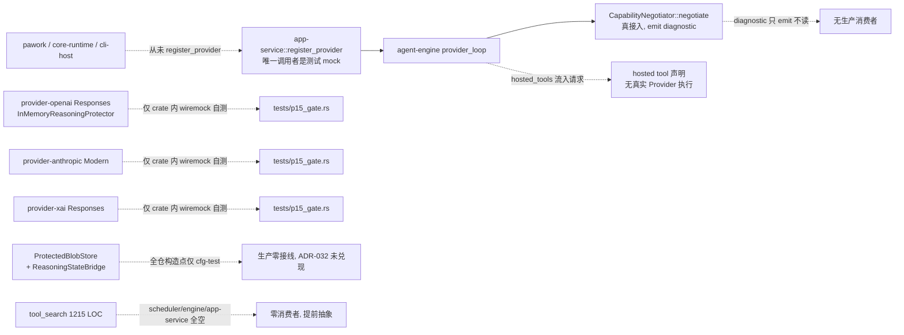

# Phase 15 Review — Provider Native Capabilities

- 评审日期：2026-08-12
- 评审范围：当前工作区源码、[ROADMAP](../../ROADMAP.md)、`plan/P15-*.md`、[ADR-002](../adr/ADR-002-agent-engine-provider-decoupled.md)、[ADR-015](../adr/ADR-015-provider-contract-tests.md)、[ADR-016](../adr/ADR-016-core-event-persist-replay.md)、[ADR-032](../adr/ADR-032-protected-blob-store.md) 及相关架构文档
- 评审性质：只读 Review；未修改实现、计划状态或既有文档
- 评审方式：Commander（GLM-5.2 主代理）统筹复核 + 结论，GLM/DeepSeek 子代理负责代码与文档调查；所有关键结论均以源码 `rg`/`sed` 与行号证据复核

## 0. 总结论

**结论：Phase 15 交付了一套设计正确、与 P6 基线并存、Core 不感知 Provider 名称的现代 Provider 能力层，但与 Phase 14 同样存在「领域 + adapter 已交付、主循环与宿主装配延后」的结构性问题。当前把 P15-1～P15-9 整体标记为 `TargetVerified`，会把「crate 内 Mock smoke 通过」误读为「生产链路已验证」。**

设计与红线正确、应保留的部分：canonical `ToolKind`/`ContinuationMode`/`ServerToolEvent`/`Citation`/`ReasoningItem` 领域类型干净且纯依赖 `serde`/`ts-rs`；`CapabilityNegotiator` 是纯函数、不读 Provider 名、`no_provider_branch` 守护到位、`clamp_reasoning_to_thinking` 让三家 adapter 与 P6 `ThinkingConfig` 共存而不双轨；P15-9 集中门禁脚本真实存在并实现独立 `target/gates` 隔离与清理；ADR-032 把 reasoning 凭证从 OS Keychain 移到专用 Protected Blob Store 的方向正确。

关键缺口不是再增加抽象，而是现有能力没有接入同一条真实生命周期，且新增的某些抽象明显超出当前实际接入面：

1. **正式宿主（`pawork`/`core-runtime`/`cli-host`）从未构造任何真实 Provider**——全仓 `rg` 在 host 代码中对 `provider-openai`/`provider-anthropic`/`provider-xai` 及其 `OpenAiProvider`/`AnthropicProvider`/`XaiProvider` 零命中；`app-service::register_provider` 的唯一调用者是测试 mock。因此 OpenAI Responses / Anthropic Modern Messages / xAI Responses 三条现代路径在生产中根本不会被执行；P15-8 协商与 P15-2/3/4 适配只在各 provider crate 的 wiremock 自测里闭环。
2. **ADR-032「加密落盘 / 跨进程保护」在生产路径未兑现**：`ReasoningStateBridge` 与 `ProtectedBlobStore` 的全仓构造点全部位于 `provider-runtime/reasoning.rs` 自身 `#[cfg(test)]`；agent-engine / app-service / host 对它们引用为 0。生产默认走每个 provider crate 自带的 `InMemoryReasoningProtector`，即明文续传只保证进程内不落事件，重启即丢——这与 ADR-032 的核心承诺直接冲突。
3. **P15-6 Tool Search（1215 LOC）完全无消费者**：`LazyToolIndex`/`ToolSearchIndex`/`search_tools`/`activate_tool` 在 `tool-runtime` 之外、`ToolScheduler` 与 agent-engine/app-service/providers 中 `rg` 全空，属提前抽象 / spec 实现。
4. **reasoning 保护侧存在三套近重复抽象**：`provider-openai::ReasoningProtector` 与 `provider-xai::ReasoningProtector` 逐字重复，`provider-anthropic::ReasoningContinuationStore` 是同一语义的第三种实现，`provider-runtime::ReasoningStateBridge` 又是第四层包装——做同一件事（protect/resolve 不透明 reasoning 字节），却有三个名字、两套引用类型（`String` vs `ProtectedBlobRef`）、三套错误类型。
5. **`ResponsesStreamAssembler` 在 openai/xai 两家近乎复制**（`handle_text_done`/`handle_function_arguments_delta`/`handle_item_added`/`handle_item_done`/`handle_function_call_done`/`handle_code_interpreter_done`/`handle_mcp_call_done`/`handle_completed` 同名同构），仅 hosted tool 子集不同。

最简单的收口方向是：**保留现有 canonical 领域、`CapabilityNegotiator`、`ServerToolEvent` 与三家 adapter 的现代路径，不新增 crate 或第二套 trait；优先做减法——合并三套 reasoning 保护抽象、删除 `ReasoningStateBridge` 当前无人调用的 ref-count 生命周期、把 tool_search 在接入主循环前 feature-gate 或删除、并在 Phase 16/18 把宿主真正装配起来。** 若不打算短期接线，则应把 ADR-032 与各 `TargetVerified` 降级标注为「domain + adapter delivered, host integration deferred」，避免文档误导。

## 1. 设计符合度

| 任务 | 结论 | 主要证据与偏差 |
|---|---|---|
| [P15-1](../../plan/P15-1-canonical-tool-v2.md) Canonical Tool v2 | 基本符合 | `ToolKind`/`ExecutionOwner`/`ContinuationMode`/`ToolDescriptor` v2/`ToolHosting`/`CanonicalModelRequest.hosted_tools` 已落地（[agent-domain/src/tool.rs](../../crates/agent-domain/src/tool.rs)）；ClientFunction 行为与 P4 一致。偏差：`ToolKind` 与 `ExecutionOwner` 是 1:1 映射、`ContinuationMode` 又由 `ToolKind` 推导（§3.1），三者表达高度冗余。 |
| [P15-2](../../plan/P15-2-openai-responses.md) OpenAI Responses | 库级符合，主流程未接入 | `responses.rs`(1422 LOC) + 传输选择 + `ResponsesStreamAssembler` 覆盖 reasoning/function/server tool，`no_provider_branch` 断言到位；但 host 不构造 `OpenAiProvider`（§2），`ReasoningProtector` 与 xAI 逐字重复（§3.2）。 |
| [P15-3](../../plan/P15-3-anthropic-modern-messages.md) Anthropic Modern Messages | 库级符合，主流程未接入 | `modern.rs`(1653 LOC) 实现现代请求/server tool/thinking signature/interleaved/降级，6 个 wiremock smoke 全过；但 `modern.rs` 与 `request.rs`/`stream.rs` 的边界偏散（§3.3），`ReasoningContinuationStore` 是第三套保护抽象（§3.2），host 未装配。 |
| [P15-4](../../plan/P15-4-xai-responses.md) xAI Responses | 库级符合，主流程未接入 | `responses.rs`(1256 LOC) 复用 P15-7 映射 + 双鉴权 + 降级；`ResponsesStreamAssembler` 与 openai 近复制（§3.4），host 未装配。 |
| [P15-5](../../plan/P15-5-server-tool-events.md) Server Tool Events | 符合 | `Citation`/`Source`/11 类 `ServerToolEvent`/`ProviderTranscriptEnvelope` 落 `agent-domain`（[server_tool.rs](../../crates/agent-domain/src/server_tool.rs)），经 `AgentEvent::ServerTool` 持久化、`session-store` 重放、脱敏测试齐全；11 变体中部分（`ProgramStarted`/`ProgramOutput`/`Computer*`）当前仅 fixture 触发，无真实 server tool 产出，属完整但未充分消费（§3.5）。 |
| [P15-6](../../plan/P15-6-tool-search.md) Tool Search | 库级实现，零生产消费者 | `tool_search.rs`(1215 LOC) 索引/搜索/激活/审批/预算联动测试齐全；但 `LazyToolIndex`/`search_tools`/`activate_tool` 在 `ToolScheduler`、agent-engine、app-service、providers 中 `rg` 全空（§2.2），属提前抽象。 |
| [P15-7](../../plan/P15-7-reasoning-state.md) Reasoning State | 部分符合 | `ReasoningItem` 安全引用模型正确；但 ADR-032 的「加密落盘 / 跨进程 / crash 恢复」在生产路径未兑现——`ReasoningStateBridge`/`ProtectedBlobStore` 全仓构造点仅在自身 `#[cfg(test)]`，生产用 `InMemoryReasoningProtector`（§2.1）。protected-blob-store 1603 LOC 相对当前实际仅 InMemory 的需求存在过度设计（§3.6）。 |
| [P15-8](../../plan/P15-8-capability-discovery.md) Capability Discovery | 协商层符合，配套脱节 | `CapabilityNegotiator::negotiate` 纯函数、`no_provider_branch` 守护、`clamp_reasoning_to_thinking` 三家复用，且在 `provider_loop.rs` 真实调用（§2.3）。偏差：`provider_capability_negotiated` Diagnostic 只 emit 无消费者；model-registry 内置目录 `caps()` 未填 v2 字段（两家 builtin_models 有 v2 声明但 host 不注册它们，§3.7）。 |
| [P15-9](../../plan/P15-9-provider-contract-v2.md) 集中门禁 | 符合 | [scripts/p15-gate.sh](../../scripts/p15-gate.sh) 真实存在：独立 `CARGO_TARGET_DIR=target/gates`、`trap clean_gate_dir EXIT/INT/TERM`、contract/golden/fuzz/compat 四类、`INSTA_UPDATE=no`；三家 `tests/p15_gate.rs` + golden 齐全。`target/gates` 当前不存在属设计内「门禁后清理」。本任务无问题。 |

建议状态语义拆清：P15-1/P15-5/P15-9 可维持 `TargetVerified`（领域 + 门禁真实闭环）；P15-2/P15-3/P15-4/P15-8 应标为「adapter/library verified, host composition deferred」；P15-6 应标为「implementation verified, no consumer」；P15-7 应把 ADR-032 持久化部分降级为 Proposed 或在 ROADMAP 显式标注「主循环接线延后」。若仍统一使用 `TargetVerified`，则必须把宿主装配与 `ProtectedKeyResolver` 生产实现纳入该状态的验收证据。

## 2. 关键能力是否进入主流程

### 2.1 P1：ADR-032 加密落盘在生产路径未兑现

ADR-032 明确要求 reasoning 凭证「encrypted-at-rest」「crash 后经 `protected_blob_ref` 可恢复 continuation」「不入 OS Keychain」。实际生产路径：

- `ReasoningStateBridge::new` / `ProtectedBlobStore` 构造点的全仓 `rg` 命中仅 [provider-runtime/src/reasoning.rs:139/176/347](../../crates/provider-runtime/src/reasoning.rs)，全部位于该文件 `#[cfg(test)]` 模块。
- agent-engine / app-service / cli-host / core-runtime / pawork 对 `protected_blob_store` / `ReasoningStateBridge` / `ProtectedBlobStore` / `ProtectedKeyResolver` 的引用为 **0**。
- 三家 provider 默认走各自 `InMemoryReasoningProtector::default()`（[provider-openai/src/provider.rs:176](../../crates/provider-openai/src/provider.rs)、xai 同）。
- `with_reasoning_protector`（openai/xai）与 `with_reasoning_continuation`（anthropic）注入点全仓调用者只有各自的 `tests/`。

结果：明文 reasoning 凭证只保证「进程内不进 Event payload」，重启即丢；ADR-032 的「跨进程 / crash 恢复 / 加密落盘」承诺在生产中不成立。要么补 `app-service`/`agent-engine` 的真实接线与 `ProtectedKeyResolver` 生产实现，要么把 ADR-032 状态降级为 Proposed 并在 ROADMAP 显式标注延后。

### 2.2 P1：Tool Search 零消费者

`rg LazyToolIndex|ToolSearchIndex|search_tools|activate_tool|tool_search::` 在 `tool-runtime` 之外（`ToolScheduler`、agent-engine、app-service、各 provider）全空。`ToolScheduler`（[scheduler.rs](../../crates/tool-runtime/src/scheduler.rs)）不引用 `tool_search` 任何符号。1215 LOC 的索引/搜索/激活/审批/预算联动是完整的库，但当前只是 spec 实现。建议接入主循环前 feature-gate 或挪入 `#[cfg(test)]`；若 Phase 16 不再需要则整体删除，避免长期作为公共 `pub use` 漂移。

### 2.3 已接入主循环的部分（保留）

`CapabilityNegotiator` 是 Phase 15 中唯一真正接入 `provider_loop` 的能力（[provider_loop.rs:726,738](../../crates/agent-engine/src/provider_loop.rs)），`provider_capability_negotiated` Diagnostic 真实发射、`hosted_tools` 真实流入 `CanonicalModelRequest`、三家 adapter 经 trait 方法 `stream` 被调用。问题只在：① Diagnostic 只 emit 无消费者；② host 不构造真实 Provider，使这条已接通的协商链在实际运行中永不触达现代传输。

### 2.4 宿主装配缺口（与 Phase 13/14 同构）

host 从未调用 `app-service::register_provider` 注册任何真实 `ModelProvider`，也没有把任一 provider crate 的 `builtin_models()` 接入 model-registry。这与 [P14-review §2.1](./p14-review.md) 指出的「正式宿主没有注册真实 Provider」是同一根缺口，应随 Phase 18 账号控制面 / Credential Lease 一起装配，而不是在 Phase 15 内各自补丁。

## 3. 冗余 / 过度设计 / 重复抽象

### 3.1 P1：ToolKind / ExecutionOwner / ContinuationMode 三重冗余

[agent-domain/src/tool.rs](../../crates/agent-domain/src/tool.rs)：`ToolKind`（3 变体）与 `ExecutionOwner`（3 变体）经 `execution_owner()` 严格 1:1 映射（[tool.rs:34-46](../../crates/agent-domain/src/tool.rs)），`ContinuationMode` 又由 `ToolKind::continuation_mode()` 完全推导（[tool.rs:51-59](../../crates/agent-domain/src/tool.rs)）。三个枚举表达的是同一份「执行位点」信息。`ExecutionOwner` 当前除 `ToolKind::execution_owner()` 外无消费者；`ContinuationMode` 除被 `kind.continuation_mode()` 推导外无独立判别用途。

建议：删除 `ExecutionOwner`（或保留为 `ToolKind` 的 `#[deprecated]` 别名）；`ContinuationMode` 收敛为 `ToolKind` 上的方法返回值而非独立可序列化枚举，除非有跨 crate 持久化 `ContinuationMode` 字面值的真实需求。

### 3.2 P1：三套 reasoning 保护抽象 + 第四层包装

同一「protect/resolve 不透明 reasoning 字节」语义存在四种实现：

| 抽象 | 位置 | 引用类型 | 备注 |
|---|---|---|---|
| `ReasoningProtector` trait + `InMemoryReasoningProtector` | [provider-openai/src/responses.rs:49-93](../../crates/provider-openai/src/responses.rs) | `String` | — |
| `ReasoningProtector` trait + `InMemoryReasoningProtector` | [provider-xai/src/responses.rs:53-100](../../crates/provider-xai/src/responses.rs) | `String` | 与 openai **逐字重复** |
| `ReasoningContinuationStore` | [provider-anthropic/src/modern.rs:104](../../crates/provider-anthropic/src/modern.rs) | `ProtectedBlobRef`（闭包） | 第三种形态 |
| `ReasoningStateBridge` | [provider-runtime/src/reasoning.rs:19](../../crates/provider-runtime/src/reasoning.rs) | `ProtectedBlobRef` | 第四层包装，生产零接线 |

建议：上提到 `provider-api` 或 `provider-runtime` 一份 `ReasoningProtector` trait（`protect(scope, payload) -> ProtectedBlobRef` + `resolve(scope, ref) -> bytes`），统一引用类型为 `ProtectedBlobRef`、统一错误类型；删除三家本地拷贝。`ReasoningStateBridge` 即该 trait 的标准实现，去掉中间层。仅保留 `protect`/`resolve`；`retain`/`release`/`rollback_uncommitted`/`gc`/`shutdown` 当前无生产调用方，等 compaction/session-delete 真正接入再加（YAGNI）。

### 3.3 P2：anthropic modern.rs 与 request.rs/stream.rs 边界偏散

[provider-anthropic/src/modern.rs](../../crates/provider-anthropic/src/modern.rs)（1653 LOC）实现了现代请求构造、server tool 归一、thinking signature、interleaved 与降级，而 [request.rs](../../crates/provider-anthropic/src/request.rs)（606 LOC）与 [stream.rs](../../crates/provider-anthropic/src/stream.rs)（621 LOC）承载 P6-2 基线请求与流。两套请求构造、两套流解析同 crate 并存，边界靠注释而非类型分离。`provider.rs::stream` 据 `chosen_transport` 分支调用，但 modern 路径是否复用了 request.rs/stream.rs 的部分（如 auth、SSE 帧）需在收口时厘清；当前更接近「重写一遍」而非「扩展基线」。建议：把可共享的（auth、SSE 帧解析、usage 归一）下沉到 provider-runtime 或同 crate 共享模块，modern 只保留现代字段差异。

### 3.4 P2：ResponsesStreamAssembler 跨家近复制

[provider-openai/src/responses.rs:549](../../crates/provider-openai/src/responses.rs) 与 [provider-xai/src/responses.rs:648](../../crates/provider-xai/src/responses.rs) 的 `ResponsesStreamAssembler` 拥有同名同构的 `handle_text_done`/`handle_function_arguments_delta`/`handle_item_added`/`handle_item_done`/`handle_function_call_done`/`handle_code_interpreter_done`/`handle_mcp_call_done`/`handle_completed`；差异仅 hosted tool 子集（openai 多 computer/image/local_shell/custom_tool，xai 多 live_search/collection_search）。建议：把共享骨架（item 派发、function arguments delta 拼接、completed 收尾）下沉到 `provider-runtime`，各 provider 只注册 hosted tool handler 子集。

### 3.5 P2：ServerToolEvent 部分变体当前仅 fixture 触发

`ServerToolEvent` 的 11 变体设计完整且可持久化，但 `ProgramStarted`/`ProgramOutput`/`ComputerActionRequested`/`ComputerScreenshot` 在当前实现中只由三家 fixture 与 `session-store` 重放测试触发，无真实 server tool 产出（code execution / computer use 在三家均未跨过 fixture 阶段）。这本身不阻塞，但应在状态标注中体现「类型 ready、真实产出待接入」，避免被读成「已可用」。

### 3.6 P1：protected-blob-store 1603 LOC 超出当前需求

[protected-blob-store/src/lib.rs](../../crates/protected-blob-store/src/lib.rs) 实现了 XChaCha20-Poly1305 AEAD、`ProtectedKeyResolver` + key version + `rotate()`/`RotateReport`、`retention_ms`、`disk_budget` + `disk_usage()`、`integrity_check()`/`IntegrityReport`、crash 状态机 `pending→ready/deleting`、`GcReport.orphans`、`shutdown()`、独立 SQLite actor + 自有 schema/migrations。当前唯一消费者 `ReasoningStateBridge` 只用 `put/get/retain/release`。相对「reasoning 续传加密落盘」这一当前实际仅 InMemory 的需求，约 600-800 LOC 是为未来预留。此外它与 `artifact-store`（ADR-004，非加密内容寻址 blob + GC）职责高度重叠，仅多 AEAD/scope/keyver。

建议两选一：① 大幅瘦身——保留 AEAD seal/open + `BlobScope` + ref，删除/隐藏 `rotate/retention/disk_budget/integrity_check/crash 状态机`，等真实需求出现再加；② 更激进——在 `artifact-store` 之上加约 150 LOC 的加密 envelope 层，不新建独立 crate + 独立 SQLite actor。两者都符合 ADR-032 的「职责分离」精神（加密 vs 非加密命名空间隔离），但显著降低维护面。

### 3.7 P2：builtin 能力声明分裂在两处

[provider-openai/src/provider.rs:379 builtin_models()](../../crates/provider-openai/src/provider.rs)、anthropic、xai 各自的 `builtin_models()` 声明了 o3/gpt-4.1/grok-4/claude 的 v2 能力（`transport=Responses/Messages`、`hosted_tool_tags`、reasoning state），但 [model-registry/src/registry.rs:707 caps()](../../crates/model-registry/src/registry.rs) 只填 v1 字段，v2 全靠 `..Default::default()`（即恒 `ChatCompletions` + 空 hosted tools）。结果存在两套分裂的 builtin 清单，且 model-registry 自带的清单会让任何走它的路径协商恒降级。建议：统一 builtin 能力声明到 model-registry（或让 provider 的 `builtin_models()` 经 `extend_with` 注入 registry），消除分裂；否则 P15-8 在 model-registry 直查路径上近乎 no-op。

### 3.8 P2：AcceptedResponsesTools 用 `Debug` 字符串反解 tag

[provider-openai/src/responses.rs:101](../../crates/provider-openai/src/responses.rs) `AcceptedResponsesTools::from_supported` 把 `ToolCapabilityTag` 转成 `format!("tool:{tag:?}")` 字符串再 `contains` 匹配，丢失类型安全且依赖 `Debug` 格式稳定性（`negotiate.rs::capability_key` 同样模式）。建议：`ResolvedCapabilities` 直接携带 `BTreeSet<ToolCapabilityTag>` 或带类型化的 supported/unsupported 表，去掉 `Debug`-format 耦合。

### 3.9 观察：CapabilityNegotiator 本体不过度设计

`negotiate.rs`（420 LOC，约半数为测试）是纯函数、无状态机、无 wall-clock；`CapabilityFallback::{ClampedEffort, LegacyTransport, Reject}` 三分类各自对应 adapter 真实行为，非冗余。唯一可简化点：`CapabilityNegotiator` 是无字段单元结构体 + 关联函数，可降为两个自由函数（省约 10 行），收益小。`choose_transport` 的 pref-list 顺序语义需要循环，不必改成 `match`。本项无需改动。

## 4. 模块 / crate / 接口职责与合并拆分建议

| 对象 | 现状 | 建议 | 优先级 |
|---|---|---|---|
| `ExecutionOwner` | 与 `ToolKind` 1:1，无独立消费者 | 删除或 deprecate | P1 |
| `ReasoningProtector`(openai) + `ReasoningProtector`(xai) + `ReasoningContinuationStore`(anthropic) + `ReasoningStateBridge` | 四套同义抽象 | 合并为 `provider-api`/`provider-runtime` 一份 trait + `ProtectedBlobStore` 实现；删三家本地拷贝与 `ReasoningStateBridge` ref-count API | P1 |
| `protected-blob-store` crate（1603 LOC） | 超出当前需求，与 `artifact-store` 重叠 | 瘦身或合并为 `artifact-store` 加密 envelope 层 | P1/P2 |
| `tool_search`（tool-runtime，1215 LOC） | 零消费者，公共 `pub use` | 接入前 feature-gate 或挪 `#[cfg(test)]`；Phase 16 不用则删除 | P1 |
| `ResponsesStreamAssembler`（openai + xai） | 近复制 | 骨架下沉 `provider-runtime`，hosted handler 子集化 | P2 |
| provider-anthropic `modern.rs` vs `request.rs`/`stream.rs` | 边界靠注释 | 共享部分下沉，modern 只留差异 | P2 |
| builtin 能力声明（provider `builtin_models()` vs registry `caps()`） | 两处分裂 | 统一到 registry 或经 `extend_with` 注入 | P2 |
| `CapabilityNegotiator` 空结构体 | 单元结构 + 关联函数 | 可降为自由函数（可选） | P2/观察 |
| `provider_capability_negotiated` Diagnostic | 只 emit 无消费者 | 接真实 sink 或降级 `tracing::debug!` | P2 |
| `ToolKind`/`ContinuationMode`/`ServerToolEvent`/`Citation`/`ReasoningItem`（领域） | 干净、纯依赖 | 保留 | — |
| `negotiate.rs` 协商层本体 | 干净、接入主循环 | 保留 | — |
| P15-9 门禁脚本与 golden/contract/fuzz | 真实闭环 | 保留 | — |

无「应新增 crate」的建议。无「应拆分」的建议（protected-blob-store 与 tool_search 方向相反，是收敛/删除而非拆分）。

## 5. 架构符合性

- **agent-domain 纯净**：`Cargo.toml` 仅依赖 `serde`/`serde_json`/`ts-rs`，未引入 GUI framework/SQLite/HTTP Client/OS Keychain/Git/具体 Provider。架构红线（AGENTS.md §2）守住。
- **Provider 解耦**：`no_provider_branch` 守护在 `agent-engine/tests/no_provider_branch.rs` 扩展覆盖 `hosted_tools`/`ReasoningItem`/`ReasoningEffort`/`ResolvedCapabilities`/`CapabilityNegotiator`，P15-9 门禁把它纳入 contract 类。`CapabilityNegotiator` 纯函数不读 Provider 名。
- **Secret 边界**：`ReasoningItem` 只存 `protected_blob_ref`，测试断言事件序列不含 `encrypted_content`/`signature`/`reasoning_content`；session-store 对 reasoning metadata 用 allowlist 脱敏。（但「加密落盘」本身未在生产兑现，见 §2.1）
- **ADR-032 vs 实现**：方向与三层存储分离（普通 Blob / OS Keychain / Protected Blob）正确，但「encrypted-at-rest / crash 恢复」在生产路径未接线（§2.1）。这是 Phase 15 最大的「文档 vs 实现」偏差。
- **与既有 Phase 一致性**：Phase 15 的「adapter delivered, host deferred」与 Phase 13/14 的同一根缺口同构；应统一随 Phase 18 账号控制面装配，不在 Phase 15 内各自补丁。
- **workspace-layout 登记**：`protected-blob-store` 已在 [workspace-layout.md §2.1](../architecture/workspace-layout.md) 登记，`domain-model.md` 登记 `ReasoningItem`；无未登记 crate。

## 6. 改进优先级

### P0（无）

不阻塞功能正确性。现有 `InMemoryReasoningProtector` 让 reasoning 在单进程内正常工作；三家现代路径在各自 wiremock 测试中闭环。P15 本身不引入运行时错误。

### P1（应改，显著降复杂度或消除文档误导）

1. **统一 reasoning 保护抽象**：合并三套 `ReasoningProtector`/`ReasoningContinuationStore` + `ReasoningStateBridge` 为一份 trait；删除 openai/xai 逐字重复与 `ReasoningStateBridge` 无人调用的 ref-count 生命周期 API（§3.2）。预计净减数百 LOC。
2. **ADR-032 接线或降级**：要么在 `app-service`/`agent-engine` 注入 `ProtectedBlobStore` + 生产 `ProtectedKeyResolver`，要么把 ADR-032 持久化部分降级为 Proposed、ROADMAP 标注「主循环接线延后」，消除「已落地」误导（§2.1）。
3. **tool_search 收口**：接入主循环前 feature-gate 或 `#[cfg(test)]`；Phase 16 不用则整体删除（§2.2）。
4. **删除 `ExecutionOwner`**（或 deprecate），收敛 `ContinuationMode`（§3.1）。
5. **protected-blob-store 瘦身**：删除/隐藏当前无消费者的 `rotate/retention/disk_budget/integrity_check/crash 状态机`（§3.6）。

### P2（可改，类型安全 / 一致性）

6. `ResponsesStreamAssembler` 骨架下沉 provider-runtime（§3.4）。
7. anthropic `modern.rs` 与 `request.rs`/`stream.rs` 共享部分下沉（§3.3）。
8. 统一 builtin 能力声明（§3.7）。
9. `AcceptedResponsesTools` 去掉 `Debug` 字符串反解，消费类型化 `BTreeSet<ToolCapabilityTag>`（§3.8）。
10. `provider_capability_negotiated` Diagnostic 接真实 sink 或降级 `tracing::debug!`（§3 观察）。
11. 状态语义拆分：P15-2/3/4/8 标「host composition deferred」、P15-6 标「no consumer」、P15-7 持久化部分降级（§1）。

### 观察（无需改动）

- `CapabilityNegotiator` 协商层本体、`ClampedEffort`/`LegacyTransport`/`Reject` 分类、`choose_transport` 循环、`ServerToolEvent` 11 变体设计、P15-9 门禁脚本——均合理保留。
- 三家 adapter 的字段映射 fixture、golden 快照、fuzz 覆盖——质量良好。

## 7. 一句话结论

Phase 15 交付了设计正确、Provider 中立的现代能力层与集中门禁，但 `ProtectedBlobStore`/`ReasoningStateBridge`/`tool_search`/三家现代 Provider 路径都只到「crate 内 Mock smoke」为止、未被宿主装配，且 reasoning 保护侧叠了四套近重复抽象——优先方向是做减法（合并 trait、删死代码、瘦 blob store、收 tool_search）并随 Phase 18 装配主流程，而非新增任何抽象。

## 8. 修复记录（review-remediation）

**修复任务**：[P15-10](../../plan/P15-10-review-remediation.md) · 状态：🟢已完成 · TargetVerified（有界：domain + adapter verified，host composition deferred）· 修复日期：2026-08-12

按 §6 改进优先级收敛 Phase 15「domain + adapter 已交付、主循环与宿主装配延后」之外的复杂度与重复抽象问题：统一三家 reasoning 保护抽象为 `provider-runtime::reasoning::ReasoningProtector` 一份 trait（typed `ProtectedBlobRef`，`ProtectedBlobStoreProtector` 标准实现），删 `ExecutionOwner`（保留真实消费者 `ContinuationMode`），tool_search 收口到默认关闭的 `tool-search` feature，protected-blob-store 删公开 rotate / RotateReport、integrity_check / IntegrityReport、disk_usage 与专属 all_rows / 测试（retention、disk_budget 内部约束、crash reconcile、refcount / gc / shutdown 保留），协商与 `AcceptedResponsesTools` 改经稳定 `capability_key` 类型化匹配。无新增 crate 与抽象，全部为「删重复 / 收口 / 瘦身 / 事实纠正」。宿主装配真实 Provider、provider catalog 统一、持久化 protector 生产接线按评审结论显式延后至 P18-3 / P18-4 / P18-14。

### 成立性勘误（按源码证据修正三条评审事实）

1. **§3.3「modern.rs 与 request.rs/stream.rs 边界偏散、更接近重写一遍」不成立**：`modern.rs` 复用 `request.rs` 的 message / tool-choice / thinking-budget / cache-breakpoint helpers；现代与基线路径共同进入 `provider.rs::pump_messages`，共享 auth、`SseParser` 与 `stream.rs::event_to_events`（含 usage 归一）。§3.3 的「重写一遍」定性修正为「请求 helper 与流驱动均已共享，剩余差异属现代字段 / server tools」，不再要求下沉。
2. **§2「ServerToolEvent 部分变体仅 fixture 触发」不成立**：三家 adapter 均有真实 wire producer（`ProviderStreamEvent::ServerTool` 发射点），非仅 fixture——OpenAI `responses.rs`：`CitationAdded` / `SourceAdded` / `ProgramStarted` / `ProgramOutput` / `ComputerActionRequested` / `ComputerScreenshot` / `Started` / `Completed`；Anthropic `stream.rs`：`CitationAdded` / `SourceAdded` / `Started` / `Completed`（现代 server tool 生命周期）；xAI `responses.rs`：`CitationAdded` / `SourceAdded` / `ProgramStarted` / `ProgramOutput` / `Started` / `Completed` / `Failed`。`ProgramStarted` / `Computer*` 属「真实 wire producer + 部分变体待真实服务端工具消费」。
3. **§2.3「provider_capability_negotiated Diagnostic 只 emit 无消费者」不成立**：该 Diagnostic 落入通用观测通道（`agent-engine/src/provider_loop.rs`），并有断言消费（`chosen_transport` 可观察、测试断言至少出现一次）；保留 Diagnostic 形态，不降级。

### 已修复矩阵（§2/§3/§6）

| 章节 | 问题 | 处置 |
| --- | --- | --- |
| §3.2 | 四套同义 reasoning 保护抽象（openai/xai 逐字重复 `ReasoningProtector` + anthropic `ReasoningContinuationStore` + `ReasoningStateBridge` 第四层包装，两套引用类型、三套错误类型） | 统一为 `provider-runtime::reasoning::ReasoningProtector` 一份 trait（typed `ProtectedBlobRef`、统一错误）；`InMemoryReasoningProtector` 默认实现 + `ProtectedBlobStoreProtector` 标准实现；三家全部迁移 `with_reasoning_protector(Arc<dyn ReasoningProtector>)`；删 `ReasoningStateBridge` ref-count 生命周期 API（retain/release/rollback_uncommitted/gc/shutdown）与三家本地拷贝 |
| §3.1 | `ToolKind` / `ExecutionOwner` / `ContinuationMode` 三重冗余（`ExecutionOwner` 1:1 且无独立消费者） | 删 `ExecutionOwner` 与 `execution_owner()`（rg 零生产命中）；保留 `ToolKind` 三执行位点与真实消费者 `ContinuationMode`（`CoreSuppliedResult` 由适配器翻译 function-result、`ProviderTranscript` 续接原生 output item） |
| §2.2 | tool_search 1215 LOC 零生产消费者、公共 `pub use` 漂移 | 收口到 `tool-runtime` 默认关闭的 `tool-search` feature（`#[cfg(feature = "tool-search")]` 编译门 + `pub use` 门）；接入主循环前不启用；feature 开启时索引/搜索/激活/审批/预算联动测试全保留（27 passed） |
| §3.6 | protected-blob-store 1603 LOC 超出当前需求（公开 rotate / integrity / disk_usage 无消费者） | 删公开 `rotate()` / `RotateReport`、`integrity_check()` / `IntegrityReport`（含其 `orphans` 字段）、`disk_usage()` 与仅供其使用的 `all_rows()` / 专属测试（净删 250 行）；保留 AEAD seal/open + `BlobScope` + `ProtectedBlobRef` + key version + `ProtectedKeyResolver` + 原子两阶段写入，以及 retention、disk_budget 内部约束、`pending→ready/deleting` crash reconcile、refcount / `retain` / `release` / `gc()` + `GcReport` / `shutdown()`（上层 append 失败时以 `release` 回滚未提交首引用）；保留独立 crate（不并入 artifact-store） |
| §3.8 | `AcceptedResponsesTools::from_supported` 用 `Debug` 字符串反解 tag | 协商与放行改经稳定 `ToolCapabilityTag::capability_key()` 类型化匹配（`BTreeSet` / 稳定 key），删除 `format!("tool:{tag:?}")` 耦合；新增 `all_tool_tags_negotiate_via_stable_capability_key` 断言 |
| §6 P0 | 状态语义可能被误读为「生产链路已验证」 | Phase 15 全部任务标有界 TargetVerified（domain + adapter verified、host composition deferred），不声称生产已装配；计数 P15 10/10、总计 218/165（逐 Phase 行机械求和；P15-10 前旧合计 217/167、旧 Phase 行实际 217/164，既有完成数漂移 +3） |

### 保留项（评审建议但判定不采纳）

- **`ResponsesStreamAssembler` 保留 adapter-local**（§3.4 / §6-6）：openai / xai 各留各自 crate——两家 hosted tool 子集差异真实存在（openai 多 computer/image/local_shell/custom_tool，xai 多 live_search/collection_search），共享骨架下沉收益小于差异风险；若后续出现第三家同构 assembler 再评估。
- **`CapabilityNegotiator` 单元结构体保留**（§3.9）：降为自由函数收益约 10 行且损失语义分组，不值得。
- **protected-blob-store 保留独立 crate**（§3.6 选项②不采纳）：AEAD / scope / keyver 隔离符合 ADR-032 职责分离，并入 artifact-store 的合并收益小于风险；瘦身已显著降低维护面。
- **canonical 领域类型**（`ToolKind` / `ContinuationMode` / `ServerToolEvent` / `Citation` / `ReasoningItem`）、`negotiate.rs` 协商层、P15-9 门禁脚本：均保留不动。

### Deferred items（建议/跟踪，本任务不做）

- **§2.4 宿主装配真实 Provider**：`register_provider` / `builtin_models` 接入 model-registry → [P18-3](../../plan/P18-3-provider-account.md)（Provider Account）、[P18-4](../../plan/P18-4-credential-lease.md)（CredentialPool / Lease），随账号控制面统一装配，不在 Phase 15 内各自补丁。
- **§3.7 provider catalog 统一**：provider `builtin_models()` v2 声明与 model-registry `caps()` 两处分裂 → [P18-14](../../plan/P18-14-pool-reconciliation.md)（Provider Registry / 健康探测 / 热切换）统一目录与协商证据。
- **§2.1 持久化 protector 生产接线**：生产默认 `InMemoryReasoningProtector`（进程内可回放、重启即丢）；`ProtectedBlobStoreProtector` + 生产 `ProtectedKeyResolver` 注入 host 兑现 ADR-032「加密落盘 / crash 恢复」→ P18-3 / P18-4 / P18-14 凭证边界与 registry 装配成熟后接线。持久实现构造时捕获单一 `BlobScope`，后续 factory / pool 必须按实际 Session/run scope 构造或选择，禁止跨 Session 复用 scoped protector；验收约束已写入 P18-3 / P18-14。

### 验证记录（2026-08-12）

- `cargo test`（8 crate 联合：agent-domain / provider-runtime / provider-openai / provider-anthropic / provider-xai / tool-api / tool-runtime / protected-blob-store）：**18 targets / 364 passed / 0 failed**；tool-runtime `--features tool-search --all-targets`：**1 target / 27 passed / 0 failed**。
- `scripts/p15-gate.sh`：**13 targets / 48 passed / 0 failed**，contract / golden / fuzz / 兼容性四类全部 PASS，且 `target/gates` 已清理；三条测试命令累计 **32 target executions / 439 test executions / 0 failed**。feature 命令会复跑默认 tool-runtime tests，专用 gate 也会在隔离 target 中复跑 provider gate，因此这里只报告真实累计执行次数，不声称去重用例数。
- `cargo clippy`（8 成员 + `tool-runtime/tool-search` 与 `agent-domain/typegen` feature，`--all-targets -- -D warnings`）：**0 warning**；21 个本任务 Rust 文件 rustfmt check：PASS（workspace `cargo fmt --all` 未跑、不作为门禁）；`git diff --check`：PASS。
- 残留核验（rg）：已删符号 `ExecutionOwner` / `ReasoningStateBridge` / `ReasoningContinuationStore` 在 crates/ apps/ 零生产命中；`RotateReport` / `IntegrityReport` / `disk_usage` / `all_rows` 在 `protected-blob-store` 零命中（`integrity_check` / `disk_usage` 在 artifact-store / session-store 属各自合法 API，非本任务删除面；`rotate` 在 auth-service / mcp-client 指 OAuth token 轮换，语义不同不误报）。文档中的旧符号仅保留在原始评审快照和明确标注的删除记录中。
- OpenAI / xAI 默认 `InMemoryReasoningProtector` 已提升为 provider 实例级 `Arc`，同一实例跨 `stream` 回灌 regression 通过。
- Validation Level：**L2（P15 定向功能簇门禁）**。Full workspace gate：**NOT RUN**（8 个 `-p` + 专用 gate 已充分覆盖）；三平台与发布门禁留待 Core 主干 L3。
- 独立 `deepseek_reviewer` 只读复核：**VERDICT: PASS**。两项低影响证据口径（累计执行次数含有意复跑；旧总计与旧 Phase 行机械和的 +3 漂移）已校正；未发现代码缺陷、越界写入或未登记遗漏。
