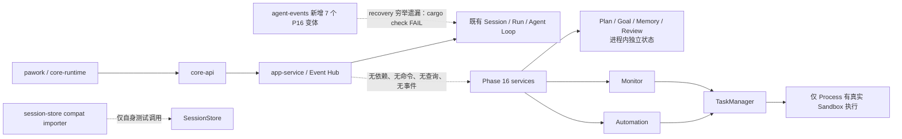

# Phase 16 Review — Modern Agent Workflow

- 评审日期：2026-08-12
- 评审范围：当前工作区源码、[ROADMAP](../../ROADMAP.md)、`plan/P16-*.md`、[ADR-016](../adr/ADR-016-core-event-persist-replay.md)、[ADR-024](../adr/ADR-024-shared-app-service-event-hub.md)、[ADR-025](../adr/ADR-025-cli-is-sole-host.md)、[ADR-030](../adr/ADR-030-core-sole-source-of-truth.md) 及相关架构文档
- 评审性质：只读 Review；除本文件外未修改实现、ROADMAP、计划状态或既有文档
- 评审方式：Commander 统筹、复核并形成最终结论；GLM/DeepSeek 子代理并行调查代码与文档，关键结论由当前源码、依赖图和数据库 schema 交叉核对
- 修复复核：2026-08-12，P16-10 review-remediation 已落地（正式链编译闭包、P16-9 原子导入与 ID scope、`validate_structure` 名实相符、Goal/Memory/Review 重放字段补齐、Automation fired_count 单一源与任务归属校验、Monitor 重复注册与 start 顺序修正、假执行/无消费者路径删除；Automation/Monitor 完整重放与 Monitor config 入 state 未达，见 §11），见文末 [§11 修复记录](#11-修复记录review-remediation)

## 0. 总结论

**结论：Phase 16 不能按当前源码认定为 9/9 完成。它交付了 7 组领域模型、纯函数算法和进程内 service scaffold，但没有形成 ROADMAP 所称的「可审阅 Plan、持久 Goal、后台任务、自动化与长期记忆的最小闭环」；新增的 7 个 `AgentEvent` 变体还使正式依赖链当前无法编译，P16-9 兼容导入则存在同来源第二个会话导入失败、部分提交、伪 replay 校验和错误去重等确定性缺陷。**

当前 7 个新增 crate 合计约 11.4k 行 Rust（含测试）。其中 6 个没有任何 reverse dependency；只有 `task-manager` 被同样未接入宿主的 `automation-service`、`monitor-service` 使用。`app-service`、`core-runtime` 与正式宿主均不依赖这些 crate，[`core-api::AppCommand/AppQuery/AppEvent`](../../crates/core-api/src/lib.rs) 也没有 Phase 16 命令、查询或事件。换言之，`AgentEvent::{Plan,Goal,Task,Automation,Monitor,Memory,Review}` wrapping 变体存在，不等于任何生产路径会产生、持久化、恢复或向 CLI/GUI 发布这些事件。

需要阻断「Phase 已完成」结论的事实有六组：

1. **正式主流程依赖链无法编译。** `cargo check -p app-service` 在 [`agent-engine/src/recovery.rs:60`](../../crates/agent-engine/src/recovery.rs) 报 `E0004`：Phase 16 新增的 Plan/Goal/Task/Automation/Monitor/Memory/Review 变体未进入恢复逻辑的穷举 `match`；`app-service::supervisor` 还有两处同类遗漏。
2. **P16-9 不满足原子导入。** `create_session` 与每个 `append_event` 分别提交；中途失败会留下空 Session 或不可删除的半截事件，重试又会失败或被误判为 deduplicated。
3. **P16-9 的派生 ID 不具备全局唯一性。** `run_id` 仅按来源固定，message ID 仅按 sequence 生成，tool call ID 原样使用；但 `runs.run_id`、`messages.message_id`、`tool_calls.tool_call_id` 都是数据库全局主键。同来源第二个不同会话必定在 RunStarted projection 冲突，跨来源还会条件性撞 message/tool ID。
4. **P16-9 所称 replay 校验实际上只是结构校验。** `validate_batch` 只检查 sequence、parent、首尾事件与 tool call 引用，没有调用 Run 状态机或任何 Phase 16 reducer，无法证明「状态机可推进」。
5. **多项所谓 canonical replay 只能恢复展示子集，不能恢复可继续运行的状态。** Goal 丢 criterion satisfied 位，Memory 丢 embedding/confidence，Review 丢 evidence/assignee/patch/fingerprint，Automation 丢完整配置/schedule/inbox 状态，Monitor 丢 config；重启后会出现「progress=1 但全部 criteria=false」「记忆存在但永远检索不到」「有效 finding 全部 stale」等矛盾。
6. **关键能力未接主流程。** Plan approval 不进入 Agent Loop gate，Goal steering 不进入 context，Automation action 未执行，Monitor 大部分 source 没有 driver，Memory 没有生产 EmbeddingProvider 或 context consumer，Review 没有 checkpoint/policy/真实 Forge，兼容导入没有 core-api/CLI 入口和历史查询。

正确方向不是继续补 facade、trait 或新 crate，而是先收缩交付面：**保留可证明正确的领域 reducer、Process 后台执行、cron/evaluate、anchor/re-anchor、patch dry-run、外部记录归一和 Secret 防线；只给近期真正接入的能力补齐事件与宿主链路；其余 runtime 外壳删除、合并或降级为实验性/default-off。**

## 1. 设计符合度

| 任务 | 结论 | 主要证据与偏差 |
| --- | --- | --- |
| [P16-1 Plan Mode](../../plan/P16-1-plan-mode.md) | 库级部分符合，主流程未实现 | `PlanStepStatus`、版本链、step reducer 与只读 snapshot 可用；但 Plan 不绑定 Session/Run，`app-service`/Agent Loop 无 Plan mode，所谓只读约束没有作用到 capability/policy，core-api 无查询/订阅。 |
| [P16-2 Plan Review](../../plan/P16-2-plan-review-approval.md) | 部分符合 | comment/版本/review 状态存在；但 `request_review` 与 `request_changes` 都发 `ReviewRequested`，事件语义依赖折叠前状态；`approve` 只接受调用方传入的可选 checkpoint ID，不创建 checkpoint；`is_approved_for_execution` 零消费者，policy 与 Agent Loop gate 未接。 |
| [P16-3 Goal Mode](../../plan/P16-3-goal-mode.md) | 不满足 durable goal | Goal 状态机和 Auto/Human 两条命令面存在；但 criterion 满足位不进事件且测试明确接受重放丢失，[`achieve`](../../crates/goal-service/src/service.rs) 不校验全部标准，也没有 actor 身份；progress 未消费 Plan step，resume 预算由调用方直接传值，steering 只写内存历史，不进入 Agent context。 |
| [P16-4 Background Task](../../plan/P16-4-background-task-manager.md) | Process 路径部分符合，其余三 kind 是占位 | `start_process` 真正走注入的 Sandbox backend，取消令牌和 parent subtree 传播值得保留；但 Agent/Monitor/Automation 仅 `register → start` 改状态，不执行动作。Queued 与 output 不进 canonical event/artifact，断进程后无法恢复；内部 broadcast 不接 Event Hub。 |
| [P16-5 Automation](../../plan/P16-5-scheduled-automation.md) | 纯调度算法部分符合，自动化未运行 | cron/interval/once/event 的确定性计算和 inbox 查询存在；但没有 timer/event-loop 调用者。`TaskManagerDispatcher` 忽略 `AutomationAction`，只把记录标成 Running；无 policy/agent-engine/artifact-store，完整配置、schedule、failure streak、inbox status 均不可重放，也没有 retry/backoff。 |
| [P16-6 Persistent Process / Monitor](../../plan/P16-6-persistent-process-monitor.md) | evaluator 部分符合，PersistentProcess 未实现 | 四种 Observation 的纯 `evaluate` 和 FileWatch driver 可保留；不存在 `PersistentProcess`/attach/detach/reconnect 实现，另外三种 source 无真实 driver，输出不进 artifact，sandbox/policy 未接。Monitor 与 TaskManager 各维护一套 lifecycle，且跨两者更新不原子。 |
| [P16-7 Long-term Memory](../../plan/P16-7-long-term-memory.md) | 实验性 scaffold，不是长期记忆 | provider-neutral `EmbeddingProvider` contract 方向正确；但全仓唯一实现是 `memory-service` 测试里的 `FixedEmbedder`。存储是 `BTreeMap` 而非 SQLite BLOB，重放后 embedding 为空，context-engine/compaction/checkpoint/audit 均无消费者。 |
| [P16-8 Review Engine](../../plan/P16-8-review-engine.md) | 纯算法有价值，事件与副作用边界不合格 | AnchorResolver 的路径约束、fingerprint/re-anchor/stale、resolution reducer、aggregate 与 PatchValidator 可保留；但富字段和 fingerprint 是事件外内存补写，session-store 没有 Review snapshot projection；checkpoint/policy 只有注释；Forge publish 先产生外部副作用再返回待持久化事件，且丢弃远端 comment ID。 |
| [P16-9 Compat Import](../../plan/P16-9-session-compat-import.md) | 有解析基础，但存在 P0 正确性缺陷 | ExternalRecord、Codex JSONL 解析、Secret 扫描、batch 结构校验和 append-only 方向正确；但导入非事务、ID 冲突、tool arguments 丢弃、unknown fields/import source/original ID 不持久化、无格式自动探测、无 core-api/CLI/history、内建 patch anchor 无消费者；`validate_batch` 不是 plan 要求的状态机 replay。所谓 P16 簇门禁仅存在于 plan 的 PowerShell 代码块，仓库无可复跑脚本或结果产物，且遗漏当前已编译失败的 agent-engine/app-service 正式链。 |

因此，当前最准确的状态语义是：P16-1/2/4/8 为 **library/domain partially verified**；P16-3/5/6/7 为 **scaffold/incomplete**；P16-9 为 **blocked by correctness defects**。九项均没有达到各自 plan 写明的完整验收面。

## 2. 关键能力是否进入主流程



### 2.1 Host、API、Event Hub 零接线

- [`app-service/Cargo.toml`](../../crates/app-service/Cargo.toml) 没有 7 个 Phase 16 crate 中任何一个依赖；`core-runtime` 与正式宿主同样没有。
- [`core-api/src/lib.rs:131-202`](../../crates/core-api/src/lib.rs) 的 `AppCommand`、`:215-247` 的 `AppQuery`、`:349-436` 的 `AppEvent` 均无 Plan/Goal/Task/Automation/Monitor/Memory/Review/Compat 入口。
- 依赖图中，`plan-service`、`goal-service`、`automation-service`、`monitor-service`、`memory-service`、`review-engine` 均无 reverse dependent；`task-manager` 仅被 automation/monitor 两个孤立 crate 使用。
- 各 service 的注释都采用「先改本地 state，返回事件给 caller 持久化」模型，但 caller 不存在；部分 crate 另建 `tokio::broadcast`，也没有桥接 ADR-024 规定的统一 Event Hub。

由于这些 service 当前不可达，尚未形成两条真实客户端业务路径或已经运行的第二权威源；更准确的定性是：Phase 16 **没有满足或证明** [ADR-024](../adr/ADR-024-shared-app-service-event-hub.md)、[ADR-025](../adr/ADR-025-cli-is-sole-host.md)、[ADR-030](../adr/ADR-030-core-sole-source-of-truth.md) 要求的宿主装配与唯一权威模型。若后续绕过 app-service 直接暴露这些本地 state/broadcast，才会构成直接违反。

### 2.2 Plan / Goal 没有控制 Agent Loop

[`plan-service::is_approved_for_execution`](../../crates/plan-service/src/service.rs) 只读取本地 aggregate；agent-engine、policy-engine、app-service 对它零引用。Plan approval 因而既不暂停 Run，也不阻止未批准计划执行。`approve` 的 `checkpoint_id` 是可选输入参数，不是 checkpoint-service 的结果。

Goal 同样没有 Session/Run/Plan 关联。`GoalEvent::ProgressUpdated` 只有一个 `f64`；当前 progress 只按 criteria 比例计算，不包含 plan 写明的 completed steps。`resume` 接收调用方已经算好的 token 数，`steer` 只追加字符串；没有任何路径把它们交给 budget/context/Agent Loop。更严重的是 `achieve` 只检查 `Active`，不检查 progress 或 Human criteria，命令面无法证明「Agent 不能自行宣布成功」。

### 2.3 Background / Automation / Monitor 只有一条真实执行路径

[`TaskManager::start_process`](../../crates/task-manager/src/manager.rs) 是 Phase 16 唯一真实执行新工作负载的路径：它经 Sandbox backend spawn、共享 CancellationToken、驱动输出并在退出后完成状态。这部分应保留。

其他路径只是状态模拟：

- generic `TaskManager::start` 对四种 `TaskKind` 一律把 Queued 改成 Running，没有 executor；
- `TaskManagerDispatcher::dispatch` 不读取/执行 prompt、tool call 或其他 `AutomationAction`，只 register/start；
- `AutomationEngine` 依赖外部调用者不断传 `now` 调 `dispatch_due`，仓库没有该 loop；
- `MonitorService` 依赖外部 Observation，只有 FileWatch driver；`ProcessExit/RegexMatch/PortState` 只有纯 fixture/evaluate；
- Automation 和 Monitor 又各自维护 Running/Suspended/Stopped，与 TaskManager 状态并存，失败顺序可使两边分叉。

### 2.4 Memory / Review / Compat 没有消费面

- `EmbeddingProvider` 没有生产实现；Memory 检索结果没有进入 context-engine。
- Review 没有 core-api 查询、inline UI、Plan adapter 或真实 Forge adapter。`GenericForgeAdapter::publish_comment` 仅生成本地合成 ID，却被 API 命名为 published。
- `SessionStore::import_compat` 只在 [`compat_import.rs`](../../crates/session-store/src/compat_import.rs) 自测中调用；CLI 现有 `ImportPi` 仍走 [`cli-host::placeholder_for_command`](../../crates/cli-host/src/lib.rs)，不是 P16-9 入口。

## 3. P0：正式链编译、事件重放与兼容导入完整性

### 3.1 Phase 16 事件 schema 变更破坏正式链编译闭包

实际执行 `cargo check -p app-service` 失败，首个错误为 [`agent-engine::recovery`](../../crates/agent-engine/src/recovery.rs) 对 `AgentEvent` 的穷举匹配没有覆盖 7 个 Phase 16 wrapping 变体（`E0004`）。这意味着 app-service 及所有依赖它的正式宿主当前无法通过类型检查，不只是「新能力没有入口」。

[`app-service::supervisor::event_state/translate_payload`](../../crates/app-service/src/supervisor.rs) 也仍按旧 `AgentEvent` 集合穷举；agent-engine 修复后，这两处会成为下一层编译错误。P16-9 计划门禁只测试 7 个新 crate、session-store 与 agent-events，既不含 agent-engine，也不含 app-service/core-runtime，因而即使历史门禁曾全绿也无法发现这一回归。

最小修复是把不影响 Run 状态的 Phase 16 事件显式折叠为 `Vec::new()/None`，并在真正接入后按领域投影；同时把 `cargo check -p app-service`（或覆盖同一正式依赖链的定向测试）纳入 P16 gate。不要用通配 `_` 掩盖未来新增 canonical event。

### 3.2 Compat import 非事务，失败会留下不可恢复的半状态

[`import_compat_inner`](../../crates/session-store/src/compat_import.rs) 在 `:1143-1148` 先调用 `create_session`，再循环调用 `append_event`。每个调用各自开启并提交 SQLite transaction；没有覆盖 Session + 全部 event/projection 的外层事务。

因此发生中途错误时：

- 首事件前失败会留下空 Session，重试再次 `create_session` 失败；
- 写入一部分 event 后失败会留下 append-only 半截序列；
- 重试的去重只检查「是否已有第一条 event」（`:1115-1131`），会把半导入误报为成功 dedup；
- `fingerprint_session` 把 content 纳入 Session ID；同一 `(source, original_id)` 的外部会话只要内容变化就绕过去重创建新 Session，不能充当稳定 import identity；
- plan 所称「失败整批回滚」实际只发生在**写入前**的 `validate_batch`，不覆盖持久化错误。

最小修复不是新增通用 transaction framework，而是在 session-store 现有 database actor 内提供一个私有的 compat import transaction，一次写入 Session、branch、全部 event、projection 与 import identity；任一错误由同一 transaction 回滚。

### 3.3 Compat 派生 ID 与数据库全局主键冲突

数据库 schema 将 `messages.message_id`、`runs.run_id`、`tool_calls.tool_call_id` 定义为全局 primary key（[`migration.rs:51-77`](../../crates/session-store/src/migration.rs)）。但 importer 生成：

- 固定 `run_id = compat-{source}-import`（[`compat_import.rs:1134`](../../crates/session-store/src/compat_import.rs)）；
- `message_id = compat-msg-{sequence}`，不含 Session（`:958-965`）；
- tool call/result 直接使用外部 ID（`:808-863`）。

结果是同一来源第二个 Session 必定在 RunStarted projection 冲突；不同来源也会因相同 message sequence 或外部 tool ID 冲突。当前测试只覆盖每个临时数据库的一次导入，未覆盖「连续导入两个不同会话」这一基本场景。

最小修复：让 run/message/tool ID 像现有 event/review ID 一样以目标 `session_id` 为 scope；增加两个不同 Session、跨来源相同 tool ID、故意中途失败后的零残留回归。

### 3.4 `validate_batch` 是 structural validation，不是 replay

[`validate_batch`](../../crates/session-store/src/compat_import.rs) 的检查面只有：event 非空、sequence 连续、parent 在批次内、首事件 RunStarted、尾事件 RunCompleted、ToolExecutionCompleted 有前置 ToolCallStarted。它没有调用 `RunStateMachine`、session-store projection 重建或 Plan/Goal/Task/Automation/Monitor/Memory/Review 任一 reducer。

因此源码注释和 ROADMAP 中的「replay 校验」「状态机可推进」属于过度声明。最小做法是先把现有函数/文档改称 `validate_structure`；若 P16-9 仍承担簇收尾门禁，则用真实 reducer 重建并比较完整可运行 snapshot。不要再写一套 importer 专用状态机。

### 3.5 canonical event 无法恢复实际可运行状态

[ADR-016](../adr/ADR-016-core-event-persist-replay.md) 要求所有状态转换可持久化、可重放，Projection 可从事件重建。当前至少五处直接违背：

| 模块 | 实时状态 | replay 后 | 后果 |
| --- | --- | --- | --- |
| Goal | criterion 的 `satisfied=true` | 事件只有总 progress，全部 satisfied 恢复为 false；测试在 [`goal-service/src/service.rs:746-754`](../../crates/goal-service/src/service.rs) 明确接受该差异 | progress 与 criteria 自相矛盾，人审事实丢失 |
| Memory | embedding + confidence | [`MemoryStore::apply`](../../crates/memory-service/src/store.rs) 固定 embedding 空、confidence 0 | 重启后所有记忆被检索过滤 |
| Review | evidence/assignee/suggested_patch/fingerprint | `FindingOpened` 后仅写本地内存（[`engine.rs:306-312`](../../crates/review-engine/src/engine.rs)） | 富字段丢失，fingerprint=None 使 finding 变 stale；测试 projection 刻意不比较这些字段 |
| Automation | trigger/action/cron/regex/schedule/failure/inbox status | `Registered` 只有 trigger kind | replay view 可展示，不能继续计算 due、匹配 event 或执行 action |
| Monitor | 完整 MonitorConfig 与 task mapping | `Started` 只有 source/workspace | replay 后 `configs` 为空，无法 evaluate/stop；Task 状态也无法原子对齐 |

TaskManager 也只恢复生命周期事件；Queued、output buffer、output cursor/bytes 与实际 process handle 不在事件或 Artifact Store。它可以支持同进程 receiver 重连，不等于 crash recovery。

修复时不要引入 generic event-sourcing framework。对近期保留的 aggregate，让单个 canonical event/现有持久表足以重建**命令继续执行所需**的状态；对不准备接入的 Memory/Monitor/Forge 等能力，删除或 default-off，避免为了死代码扩充 schema。

## 4. 冗余、过度设计与职责重叠

### 4.1 七个 crate 重复了同一套进程内 service 外壳

Plan、Goal、Task、Automation、Monitor、Memory、Review 都各自实现了若干组合：`Mutex + state + apply/replay + local log + snapshot + local broadcast + caller persists`。这不是七种业务必须拥有的七套基础设施；ADR-024/025 已经规定唯一 app-service/Event Hub/SessionStore。

建议删除本地 event log 与独立 broadcast 作为权威恢复机制，只保留纯 reducer 和必要运行态；持久化、sequence、订阅、snapshot 由现有 SessionStore/AppService 统一承担。**不要再抽一个 `GenericEventSourcedService<T>`**，那只会把重复代码变成更难调试的框架。

### 4.2 Task / Automation / Monitor 三套 lifecycle 表达同一执行事实

- TaskManager 有 `Queued/Running/Suspended/Completed/Failed/Canceled`；
- AutomationState 另有 fired/suspended/archived，ScheduleState 又重复 fired count；
- MonitorState 有 `Registered/Running/Stopped`，同时创建 `TaskKind::Monitor` 记录。

建议以 TaskManager 作为**唯一运行生命周期**；Automation 只拥有 schedule/config/result identity，Monitor 只拥有 trigger config/evaluator。Automation/Monitor 的 snapshot 引用 task ID 并派生执行状态，不再复制 Running/Stopped。Persistent process 归 TaskManager/process-runtime，不归 Monitor。

### 4.3 多个“可替换 adapter”没有真实替换对象

- `AutomationDispatcher` 只有 TaskManager 实现与测试 mock，但实际 action 没有执行语义；
- `ExternalTrigger` 用 Webhook/HTTP/GitHub/GitLab/MCP 五个结构相同的 variant 只透传 id/payload；
- `ForgeKind::{GitHub,GitLab,Generic}` 没有真实 GitHub/GitLab adapter；Generic publish 无远端副作用；
- `Throttle<T>` 没有生产消费者，且 TaskManager 已有 bounded output buffer；
- `TaskKind::{Agent,Monitor,Automation}` 的 generic start 没有 executor。

这些都是为未来接入预留的公共概念。近期没有第二实现时，优先用 composition root 的直接函数/枚举数据；真实第二实现出现后再抽 trait。删除假 publish、空 wrapper 和重复 buffer，比继续补 mock 更有价值。

### 4.4 Plan Review 与 Code Review 不应强行统一

`PlanCommentAnchor(plan_version/step_id)` 与 `ReviewAnchor(file/line)` 解决不同稳定性问题；`PlanReviewStatus` 是执行 gate，`ReviewResolution` 是 finding 生命周期。当前虽然概念相似，但没有真实复用消费者。为“统一”新增通用 Review supertype 会增加转换层。

建议保留两个领域 aggregate，但删掉“后续可无损转换”的提前 adapter 承诺；真正的 UI/host consumer 同时出现时，再以一层查询 projection 组合，而不是合并状态机。

### 4.5 Compat importer 的锚点是无消费者的平行实现

P16-9 为避免 `session-store → diff-service/review-engine` 反向依赖而自写 `parse_diff_anchors_owned`，再把结果塞入无 schema 的 `ToolResult.metadata.compat.patch_anchors`。这一选择守住了依赖方向，却没有得到 ReviewEngine 的 safe-path、line validation、fingerprint/re-anchor 语义，也没有消费者。

最简单的处理是：导入期原样保留外部 diff/comment raw data；等 Review consumer 存在后，在上层调用现有 Review core 做锚定。不要让存储层再实现一套弱化的 diff/review domain，也不要反向依赖 service crate。

## 5. 合并、拆分、简化与删除建议

| 对象 | 建议 | 理由 | 优先级 |
| --- | --- | --- | --- |
| `agent-domain::workflow` IDs/状态枚举 | 保留，但只保留实际可重放字段 | 纯领域依赖方向正确；当前 event payload 过轻导致状态丢失 | P0 |
| Plan + Goal | 保留两个 aggregate 语义；共享同一 host composition/persistence module，可合并 crate 边界；不建通用 workflow framework | 二者需相互消费但状态机不同；当前两个孤立 crate 的样板多于隔离收益 | P1 |
| TaskManager | 保留为唯一后台执行 lifecycle；先只承诺真实 Process 路径 | Sandbox spawn、取消树、输出驱动是真实能力 | P1 |
| Automation runtime | 收缩为 schedule/config/due/result identity；dispatcher 放 composition root，删除“register/start 即执行”的假路径 | 调度规则和执行所有权应分离，TaskManager 不应伪装 action 已运行 | P1 |
| `monitor-service` crate | 保留为 P17-2 Plugin Package Monitor 的稳定 contract/evaluator/driver 入口；删除独立运行 lifecycle，执行状态只引用 TaskManager；persistent process 归 TaskManager/process-runtime | 下游计划已把该 crate 作为 package runtime 入口，但当前又复制 Task 状态 | P1 |
| `memory-service` | 在真实 provider + SQLite persistence + context consumer 前 default-off 或删除；最多保留小型 canonical Embedding contract | P2 功能、零消费者、重放后不可检索；不应再加 vector DB/索引抽象 | P1/P2 |
| Review core | 保留 anchor/re-anchor、resolution reducer、aggregate、PatchValidator；删除/延后 Generic Forge publish 与事件外富状态 | 纯算法有复用价值，副作用与持久化边界错误 | P1 |
| Compat importer | 留在 session-store，但改为一个私有原子导入路径；JSON parser 收敛为 Codex JSONL + 参数化 conversation 两条；删除本地 pseudo-anchor | 不需要新 crate、import-history service 或 diff-service 反向依赖 | P0/P2 |
| local logs/broadcast/snapshot mirrors | 删除为权威机制，统一接 SessionStore/Event Hub | 避免第二事实源与七套恢复逻辑 | P1 |
| `AutomationDispatcher`、`ExternalTrigger` 五 variant、`GenericForgeAdapter::publish_comment`、`Throttle` | 无生产消费者时删除或私有化 | 典型提前抽象/假实现 | P2 |

不建议新增 crate。也不建议把现有大文件继续拆细：当前主要问题是层级和权威源过多，不是单文件过大。

## 6. 架构符合性

### 符合并应保留

- [`agent-domain::workflow`](../../crates/agent-domain/src/workflow.rs) 仍是纯 Rust 领域类型，没有 GUI、SQLite、HTTP、Git 或具体 Provider 依赖。
- Memory 只依赖 canonical `EmbeddingProvider`，没有按 Provider 名分支。
- Process 真实启动经 Sandbox backend → Process Runtime，取消令牌可触达进程树。
- Review AnchorResolver 拒绝绝对路径与 `..`，Review 本体只读文件；compat 输入先做高置信 Secret 拒绝，Event Store 仍有持久化前深层脱敏。
- Compat importer 没有修改/删除既有 event；append-only 数据库约束本身有效。

### 不符合或文档过度声明

- **ADR-016**：事件不足以重建 Goal/Memory/Review/Automation/Monitor 的实际可运行状态（§3.5）。
- **ADR-024/025/030**：七个 service 自持状态/广播，未进入唯一 app-service/Event Hub/host；由于当前不可达，定性为「未满足/未证明既定宿主模型」，不是已经发生客户端双权威（§2.1）。
- **ROADMAP 完成声明**：称「架构红线全部守住」「最小闭环」与源码不符；门禁最多证明独立 crate 测试和 clippy，不证明跨 crate composition、持久化或重启恢复。
- **P16-9 门禁**：plan 只有一段 Windows PowerShell 示例，仓库没有类似 P15 的可执行 gate script；当前源码无法复核 ROADMAP 所称历史全绿结果。即便示例命令曾运行，它也只是分 crate unit test，不包含 agent-engine/app-service 正式链、真实跨服务 replay 或两次兼容导入；本次 `cargo check -p app-service` 已证明该范围不足。
- **文档状态**：9 个 plan 头部均写 `TargetVerified`，但验收 checkbox 仍全部未勾；`docs/features/` 没有 Plan/Goal/Automation/Monitor/Memory/Review 对应功能文档，不符合本仓库模块文档约定。

不需要新 ADR 来合理化这些偏差；现有 Accepted ADR 已足够明确。应修实现或降级状态，而不是新增例外。

## 7. 改进优先级

这里的 P0 表示「Phase 16 完成认定阻断项」，不表示当前生产环境已经暴露安全事故；这些代码目前大多没有生产入口。

### P0（完成认定阻断）

1. **恢复正式依赖链编译闭包**：补齐 agent-engine/app-service 对 7 个 Phase 16 `AgentEvent` 变体的显式处理，把 `cargo check -p app-service` 纳入 gate；在此之前不能称 Phase 完成。
2. **修正 P16-9 原子性、ID scope 与 import identity**：单 transaction 写 Session + 全部 event/projection/私有 import-identity row；修正 run/message/tool ID 的 session scope；增加连续两会话、跨来源重复 tool ID、中途失败零残留测试。
3. **让 validation/replay 名实相符**：现有 `validate_batch` 改称 structural validation；簇门禁用真实 reducer 比较完整可运行 snapshot。首先修 Goal criterion 与 Review rich state；Automation/Monitor/Memory 若不近期接入，则 default-off/收缩，不为死路径继续扩 schema。
4. **纠正状态事实**：在上述问题修复前，ROADMAP 的 Phase 16 9/9 和各 plan `TargetVerified` 应降级为 library/scaffold/blocked 的有界状态；不可用历史 gate 文案替代当前源码证据。

### P1（主流程与显著减复杂度）

5. **只做一个最小纵向闭环**：优先 Plan create/review/approve → checkpoint → Agent Loop gate → SessionStore/EventHub → core-api query/subscription；不要并行扩展九套 API。
6. **统一后台执行权威**：TaskManager 只承诺真实 executor；Automation 只调度，Monitor 只产 observation/trigger，运行状态全部引用 Task；删除双写 lifecycle。
7. **把 Goal 接入 Plan/context/budget 后再称 Goal Mode**：逐项 criterion event 化、Human actor 可证明、achieve 校验标准、steer 注入下一轮 context、resume 由预算组件复算。
8. **收缩 Review**：事件包含真正需要重放的 finding 字段；Forge 副作用移到 host 的显式命令/connector，持久化成功记录远端 ID；SuggestedPatch 仅称 dry-run，直到 checkpoint/policy 真接入。
9. **删除七套本地权威外壳**：不新增 generic framework，复用现有 SessionStore/EventHub；Plan/Goal 可共享一个 composition module；`monitor-service` 保留 P17-2 contract/evaluator 入口，但删除自身重复 lifecycle。

### P2（清理与文档一致性）

10. 删除或私有化零消费者的 `ExternalTrigger` 五分支、Generic Forge 假 publish、`Throttle`、未执行的 Task kind public start、重复 snapshot/query convenience API。
11. Compat parser 收敛为两条真实结构；保留 tool arguments（映射既有 `ToolCallArgumentsDelta`）；source/original ID/content fingerprint 写入 session-store 私有最小 import-identity row 并与事件同事务提交，raw metadata 走 canonical Diagnostic；Session tag 最多用于展示，不承担唯一约束，不新增 import-history 服务。
12. 若 Long-term Memory 暂缓，保留 provider-neutral contract 即可；删除约 999 行（含测试）的进程内 scaffold，避免为未来引入 vector DB、第二索引层或新 memory host。
13. 修正文档：补事实型 feature 文档，plan checkbox 与状态同步；提供可执行、跨重启/跨服务的最小 gate，或删除“集中门禁已全绿”声明。

## 8. 建议验收顺序

1. 先恢复 `cargo check -p app-service`，并把正式依赖链加入 P16 gate。
2. 修 P16-9 transaction/ID/import identity，证明两个不同外部 Session 可连续导入且任意失败零残留。
3. 决定近期保留面；建议只保留 Plan/Goal、Process Task、Review pure core、Compat import，Automation/Monitor/Memory 暂降级；`monitor-service` 只保留 P17-2 所需 contract/evaluator/driver。
4. 对保留面做真实 replay equality：比较完整可运行 snapshot，而不是像 Goal/Review 当前测试那样排除丢失字段。
5. 接一条 app-service/core-api/EventHub 纵向链，验证 CLI/GUI 断连重连与 Core restart。
6. 最后再更新 ROADMAP/plan 状态并运行相关 crate 的 L2 cluster gate。

这一路径优先删除概念和假能力，不要求同时完成 Phase 16 的所有未来设想。

## 9. 一句话结论

Phase 16 当前是「破坏正式链编译闭包的 7 个事件变体 + 七个孤立的领域/算法库 + 一个有数据完整性缺陷的 session importer」，不是 Modern Agent Workflow 闭环；最优改进是先恢复编译、修兼容导入和真实 replay，再以 TaskManager/SessionStore/AppService 为唯一运行与持久化权威，收缩 Monitor/Automation/Review、暂缓 Memory，而不是再增加 facade、trait、状态机或 crate。

## 10. 本次 Review 验证记录

```text
Validation Level: L1（review-only diagnostic）
Affected crates: none
Validated: CodeGraph 关键路径；cargo tree --workspace --invert（7 个 Phase 16 crate）；cargo check -p app-service（FAIL：agent-engine/recovery.rs E0004，作为本次评审发现）；源码/计划/ADR/数据库 schema 对照；文档相对链接与 git diff 检查
Targeted regressions: none（未修改实现）
Independent review: DeepSeek 只读交叉复核；5 项证据口径均已采纳修正，核心结论无冲突
Full workspace gate: NOT RUN（纯 Review 文档，未命中升级条件）
```

## 11. 修复记录（review-remediation）

**修复任务**：[P16-10](../../plan/P16-10-review-remediation.md) · 状态：🟢已完成 · TargetVerified（有界：domain + services verified，host composition deferred）· 修复日期：2026-08-12

按 §7 改进优先级收敛 Phase 16 的四组 P0 阻断项与假执行/无消费者路径：恢复正式依赖链编译闭包（7 个 Phase 16 `AgentEvent` 变体在恢复链显式折叠、不用通配 `_`，并把 `cargo check -p app-service` + 两条 workflow_events 回归纳入 P16 gate）；P16-9 改为单 SQLite transaction 原子导入（Session + branch + `compat_import_identity` + 全部事件 + projection 一次写入，任一失败整体回滚零残留），run/message/tool ID 全部 session-scoped；`validate_batch` 改名 `validate_structure` 并纠正「replay 校验」过度声明；Goal / Memory / Review 三处重放状态丢失完整补齐（canonical 事件携带完整可重放字段，live→fresh snapshot 完整相等）；Automation 仅收敛 fired_count 单一事实源与任务归属校验，Monitor 仅修正重复注册拒绝与 start 顺序（完整 config / schedule / failure / inbox replay 与 config 入 state 未达，登记 deferred，见下）；删除 `TaskManagerDispatcher` 假执行、`ExternalTrigger` 五 variant、`FileWatchDriver`、`parse_diff_anchors_owned` pseudo-anchor 与 `TaskManager::with_platform_default`/ProcessRuntime 字段。无新增 crate 与抽象，全部为「修正确性 / 补重放字段（Goal/Memory/Review）/ 删假路径 / 事实纠正」。

### 成立性勘误（按源码证据修正评审事实）

1. **§0/§3.1「正式依赖链当前无法编译」在评审时点成立、现已修复**：`agent-engine/src/recovery.rs` 与 `app-service/src/supervisor.rs` 对 7 个 P16 wrapping 变体显式折叠为「不改变 Run 状态、不产生 AppEvent」的审计保留事件（穷举 `match`、无通配 `_`），并各补一条 `workflow_events_*` 回归（任一 P16 事件插入事件流不改变重放结果 / 不改变 Run 状态不 emit AppEvent）。评审 §3.1 的最小修复建议（显式折叠而非通配掩盖）被采纳为实际实现。
2. **§3.4「validate_batch 是 structural validation 不是 replay」采纳为改名**：函数与文档改称 `validate_structure`，注释明确「不是状态机 replay；状态机可推进由持久化后 projection 重建承担」，并新增 `ToolCallArgumentsDelta` 的前置 `ToolCallStarted` 引用检查。plan 中「replay 校验门控」表述同步纠正。
3. **§3.5「canonical event 无法恢复实际可运行状态」仅 Goal / Memory / Review 三处完整修复**：Goal `CriterionSatisfied` 事件化（单项满足位可重放，`progress` 与 criteria 不再自相矛盾，测试改为 live→fresh 完整相等）；Memory `Recorded` 事件携带 embedding/confidence（serde 默认兼容旧流，replay 后检索不再失效）；Review `FindingOpened` 携带 evidence/assignee/suggested_patch/fingerprint（`SuggestedPatch` 移入 canonical domain，replay 后 finding 与实时完整一致）。Automation 与 Monitor 为有界修复，「五处全部修复」表述已撤销：
   - **Automation 仅修 fired_count 单一事实源与任务归属**：删命令侧重复计数，`fired_count` 收敛到 canonical `Triggered` 折叠；新增 `TaskNotTriggeredByAutomation` 归属校验。完整配置 / action / cron / schedule / failure streak / inbox status 仍不进事件（`Registered` 仍只有 trigger kind），engine 的完整配置与 cron schedule 仍为进程内内存表——「Automation 完整重放已补齐」不成立，登记 deferred（见下）。
   - **Monitor 仅修重复注册拒绝与 start 顺序**：register 在配置锁内完成查重拒绝（并发重复注册在创建第二个 task 前被拒，task 注册失败配置不落地）；start 先推进 task-manager 镜像再广播 `Started`（task start 失败时不广播权威事件，消除跨生命周期分叉）。config 未入 state：`Started` 仍只有 source/workspace，`MonitorServiceState`/`MonitorRecord` 不含 config，task mapping 仍为 service 进程内内存表——「Monitor config 入 state（replay 后 `configs` 不再为空）」不成立，config / task mapping / 完整 replay / lifecycle 统一登记 deferred（见下）。
4. **§2.3/§4.3「TaskManagerDispatcher 忽略 AutomationAction 只标 Running」通过删除根除**：`TaskManagerDispatcher` 整体删除（automation-service 不再提供伪造 register→start 即执行的 adapter），`AutomationDispatcher` trait 保留为抽象、真实 executor 由调用方注入；`ExternalTrigger` 五 variant 模块与 `FileWatchDriver` 删除（观测样本改由宿主/未来 driver 注入）；`TaskManager` 删除 `ProcessRuntime` 字段与 `with_platform_default`（仅注入 backend，真实 Process 路径保留）。
5. **§4.5「pseudo-anchor 是无消费者的平行实现」采纳删除**：`parse_diff_anchors_owned` 与 `ToolResult.metadata.compat.patch_anchors` 删除，外部 unified diff 原样保留在 tool result content；仅显式携带 file/line 的评审意见映射为 `FindingOpened`；锚点化交未来 Review consumer 复用 Review core（不破坏 storage→services 分层）。
6. **§1「九项均未达到各自 plan 写明的完整验收面」在修复后收窄为「领域/服务层验收达成、生产接线未达成」**：P16-1/2/4/8/9 按源码证据重新认定为 domain verified（有界），P16-3/7 为 scaffold 有界（进程内 service + 事件折叠可重放、无生产接线），P16-5/6 为有界修复（调度/判定收缩、fired_count 单一源、重复注册拒绝与 start 顺序修正；完整 config / schedule / failure / inbox replay 与 config 入 state / task mapping / lifecycle 统一未达，登记 deferred）；P16-9 的「blocked by correctness defects」阻断（原子性 / ID scope / 结构校验命名）已消除，其余各项不再以「blocked by correctness defects」表述。

### 已修复矩阵（§2/§3/§6/§7）

| 章节 | 问题 | 处置 |
| --- | --- | --- |
| §3.1 | 正式链编译闭包 E0004 + supervisor 两处遗漏 | 7 个 P16 变体显式折叠（`recovery.rs` 与 `supervisor.rs` 各两处穷举 match，无通配 `_`）；两条 `workflow_events_*` 回归；`cargo check -p app-service` 纳入 P16 gate official-chain 类别 |
| §3.2 | P16-9 非事务（create_session + append_event 分别提交） | 单 SQLite transaction（`TransactionBehavior::Immediate`）一次写入 Session + branch + identity + 全部事件 + projection（`persist_event_in_transaction` 统一脱敏/事实表/投影）；任一失败整体回滚；新增并发导入测试（双 store 同 identity 恰一导入、不泄漏 SQLITE_BUSY）与中途失败零残留测试 |
| §3.3 | run/message/tool ID 全局主键冲突 | `run_id = compat-run-{session_id}`、`message_id = compat-msg-{session}-{seq}`、`tool_call_id = compat-tool-{session}-{external}`（session-scoped）；新增连续两会话、跨来源重复 tool ID 测试 |
| §3.4 | `validate_batch` 名为 replay 实为结构校验 | 改名 `validate_structure` + 文档/注释纠正 + `ToolCallArgumentsDelta` 引用检查；「状态机可推进」由持久化后 projection 重建承担 |
| §3.5 | Goal criterion 满足位重放丢失 | `GoalEvent::CriterionSatisfied` 事件化（Auto/Human 命令面均产出），state apply 恢复满足位，live→fresh snapshot 完整相等 |
| §3.5 | Memory embedding/confidence 重放丢失 | `MemoryEvent::Recorded` 携带 embedding/confidence（旧流 serde default 空向量/0.0），replay 与实时完整一致 |
| §3.5 | Review 富字段事件外补写 | `FindingOpened` 携带 evidence/assignee/suggested_patch/fingerprint；`SuggestedPatch` 入 canonical domain；删除命令面内存补写路径 |
| §3.5 | Automation fired count 双份计数（有界修复） | 删 `ScheduleState.fired_count`，唯一事实源为 canonical `Triggered` 折叠；`TaskNotTriggeredByAutomation` 防伪造结果记录；完整配置 / schedule / failure / inbox replay 未达（`Registered` 仍只有 trigger kind），登记 deferred |
| §3.5 | Monitor config 重放为空 + start 分叉（部分修复） | start 顺序修正（先推进 task-manager 镜像再广播 `Started`，task start 失败不广播、不推进状态）+ 配置锁内重复注册拒绝（task 注册失败配置不落地）；config 入 state 未做——`Started` 仍只有 source/workspace，`MonitorServiceState` 不含 config，config / task mapping / 完整 replay 登记 deferred |
| §2.3/§4.3 | `TaskManagerDispatcher` 假执行、`ExternalTrigger` 五 variant、`FileWatchDriver` | 全部删除（净删 dispatcher 适配实现与外部信封模块、driver 模块）；trait 抽象保留、executor 由调用方注入 |
| §4.5 | compat importer 自写弱化 diff 锚点 | 删 `parse_diff_anchors_owned`/pseudo-anchor；raw diff 原样保留，锚点化交未来 Review consumer |
| §6 | 文档状态：正式链不可编译、门禁不可复跑 | `scripts/p16-gate.sh` 可复跑（隔离 `target/gates` + trap 清理 + official-chain/schema 类别）；`docs/features/workflow.md` 为本任务新增的 P16 功能文档并已同步——Goal/Memory/Review/Compat 重放状态表述与修复后代码一致，无漂移（独立 reviewer 唯一低严重度注解已校正） |
| §7-4 | 状态事实：9/9 与 plan TargetVerified 与源码不符 | 修复后按有界语义同步：P16-1～P16-9 有界 TargetVerified（domain + services verified；P16-5/6 为有界修复，完整重放未达），P16-10 review-remediation 完成；计数 P16 10/10（P16-1～P16-9 + P16-10）；ROADMAP/plan 已同步——ROADMAP Phase 16 行 10/10、总计 **219/175**，plan checkbox 与「有界完成」表述一致 |

### 保留项（评审建议但判定不采纳/延后执行）

- **§2.1 宿主装配与 core-api 入口**（P0 之外的 P1 纵向闭环）：`app-service`/`core-runtime`/正式宿主仍不依赖 7 个 P16 service crate，`core-api::AppCommand/AppQuery/AppEvent` 仍无 P16 命令/查询/事件。折叠行为已先行落地（本任务），真实接线登记为 deferred（见下）。
- **§2.2 Plan approval → Agent Loop gate、Goal steering → context/budget**：`is_approved_for_execution` 仍零消费者，`achieve` 仍只校验 `Active`——依赖宿主装配，登记为 deferred。
- **§2.3 Automation timer/event-loop 调用者、Monitor 真实 driver、PersistentProcess attach/detach/reconnect**：`dispatch_due` 仍依赖外部注入 `now`，无生产 loop；ProcessExit/RegexMatch/PortState 仍为纯 evaluate——登记为 deferred。
- **§2.4 Memory 生产 EmbeddingProvider / SQLite 持久化 / context consumer、Review 真实 Forge adapter / checkpoint / UI、Compat 导入 core-api/CLI 入口**：保持评审结论（无生产消费面），登记为 deferred。
- **§3.5 Automation 完整 replay / Monitor config 入 state（本次未达，事实纠正）**：Automation 完整配置 / schedule / failure streak / inbox status 与 Monitor config / task mapping 的完整可重放均不在 P16-10 写集——`Registered` 仍只有 trigger kind、`Started` 仍只有 source/workspace，完整配置与 cron schedule、config 与 task mapping 均为进程内内存表。完整重放随真实 executor / driver 与宿主装配落地，登记为 deferred（见下）。
- **§4.2 三套 lifecycle 统一（TaskManager 唯一运行生命周期）**：本次只修复「分叉时序」与「fired_count 单一源」，Automation/Monitor 独立状态仍保留（crate 内自洽），统一到 TaskManager 归宿主装配阶段。
- **§5 合并/降级建议**（Plan+Goal composition、Automation 收缩、memory-service 删 999 行 scaffold、monitor-service 只留 P17-2 contract 入口）：按评审「不新增 crate」原则未在修复期动 crate 边界；memory-service 因 P16-7 为 P2 且已有可重放事件化，保留为有界 scaffold 而非删除。
- **Throttle 保留**（§4.3 曾指无生产消费者）：monitor-service 输出节流的有界缓冲作为已实现的确定性组件保留，随 PersistentProcess 接入后才有真实消费面。

### Deferred items（建议/跟踪，本任务不做）

延期落点按 [plan/README Phase 16 延期落点登记](../../plan/README.md) 六项映射，ROADMAP/plan 已同步（Phase 16 10/10、总计 219/175），不新增计划任务：

- **§2.1 宿主装配**：Plan/Goal 经 host/core-api/EventHub 暴露与 CLI/GUI 呈现 → [P19-12](../../plan/P19-12-workflow-control.md)（Plan/Goal host 控制面）；workflow core-api/EventHub 统一派发与 automation 执行权威归 `task-manager` → [P17-6](../../plan/P17-6-agent-teams.md)。
- **§2.2 Plan/Goal 接 Agent Loop**：approval gate、steering 入 context、achieve 校验标准 → [P19-12](../../plan/P19-12-workflow-control.md) 验收项。
- **§2.3 Automation timer loop 与 Monitor 真实 driver、PersistentProcess**：Automation 生产 executor / timer loop → [P17-6](../../plan/P17-6-agent-teams.md)；Monitor driver 入口与包级生命周期 → [P17-2](../../plan/P17-2-plugin-package-format.md)（Plugin Package Monitors 的 contract/evaluator/driver 入口）/ [P17-3](../../plan/P17-3-plugin-marketplace.md)。
- **§3.5 Automation 完整 replay 与 Monitor config 入 state（本任务未达）**：Automation 完整配置 / action / cron / schedule / failure / inbox 进事件随真实 executor / EventHub 装配落地 → [P17-6](../../plan/P17-6-agent-teams.md)；Monitor config 与 task mapping 入 state 及完整 replay 随真实 driver 落地 → [P17-2](../../plan/P17-2-plugin-package-format.md) / [P17-3](../../plan/P17-3-plugin-marketplace.md)。
- **§2.4 Memory 生产化**（真实 EmbeddingProvider + 持久化 + context consumer）→ [P17-5](../../plan/P17-5-agent-profile-v2.md)（Agent Profile v2 含 memory 维度）/ [P19-2](../../plan/P19-2-client-state-projection.md)；Review 真实 Forge adapter 与 checkpoint/policy 接线、UI → [P19-8](../../plan/P19-8-diff-git-review.md)；Compat 导入 CLI/API 入口与历史查询 → [P17-8](../../plan/P17-8-agent-sdk.md) / [P19-2](../../plan/P19-2-client-state-projection.md)。
- **§4.2 lifecycle 统一**：Automation/Monitor 执行状态引用 TaskManager → 宿主装配阶段（Automation → [P17-6](../../plan/P17-6-agent-teams.md)；Monitor → [P17-2](../../plan/P17-2-plugin-package-format.md) / [P17-3](../../plan/P17-3-plugin-marketplace.md)）。

### 验证记录（2026-08-12）

- **最终独立复核（deepseek_reviewer）：VERDICT: PASS**。独立复跑 `scripts/p16-gate.sh` 全类别 PASS——crates-test 225 + official-chain 2 = **227 tests / 0 failed**；11 crate clippy（`--all-targets -D warnings`）0 warning；official-chain `cargo check -p app-service` PASS；schema 类别 `cargo run -p schema-typegen -- --check` PASS；改动 Rust 文件 rustfmt `--check` 与 `git diff --check` PASS。唯一 finding 为低严重度 `docs/features/workflow.md` 注解（已校正），**无代码 finding**。
- `scripts/p16-gate.sh`：**227 tests / 0 failed**（11 个 P16 相关 crate 联合 test 225 + `agent-engine --lib workflow_events` 1 + `app-service --lib workflow_events` 1；计数与门禁覆盖范围精确吻合）；定向 clippy（11 crate `--all-targets -D warnings`）0 warning；official-chain 类别 `cargo check -p app-service` PASS；schema 类别 `cargo run -p schema-typegen -- --check` PASS；隔离 `target/gates` 已清理。
- 本次复核复跑（默认 target 增量）：`cargo check -p app-service` PASS；`cargo test -p agent-engine --lib workflow_events`（1 passed）；`cargo test -p app-service --lib workflow_events`（1 passed）；`cargo test -p session-store`（57 passed）；`cargo run -p schema-typegen -- --check`（TypeScript declarations up to date）。
- 31 个现存改动 Rust 文件 rustfmt `--check` PASS；另 2 个 Rust 文件为删除项，不适用 rustfmt；`git diff --check` PASS；残留 rg 核验：`TaskManagerDispatcher` / `ExternalTrigger` / `FileWatchDriver` / `parse_diff_anchors_owned` / `fingerprint_session` / `validate_batch` 生产路径零命中（旧符号仅存于评审快照与删除记录）。
- Validation Level：**L2（P16 定向功能簇门禁，未跑 workspace 全量）**；Full workspace gate：**NOT RUN**（未命中升级条件：11 个 `-p` + 专用 gate 已覆盖 P16 写集与正式链，无跨 crate 大规模重构/协议大范围变更）。
- 状态语义：P16-10 与 Phase 16 10/10/有界完成一致——P16-1～P16-9 有界 TargetVerified（domain + services verified、host composition deferred；P16-5/6 为有界修复，Automation/Monitor 完整重放未达），P16-10 review-remediation 🟢 已完成 · TargetVerified；不声称生产已装配。ROADMAP/plan 已同步（ROADMAP Phase 16 行 10/10、总计 219/175；plan/README 六项延期落点登记）。
