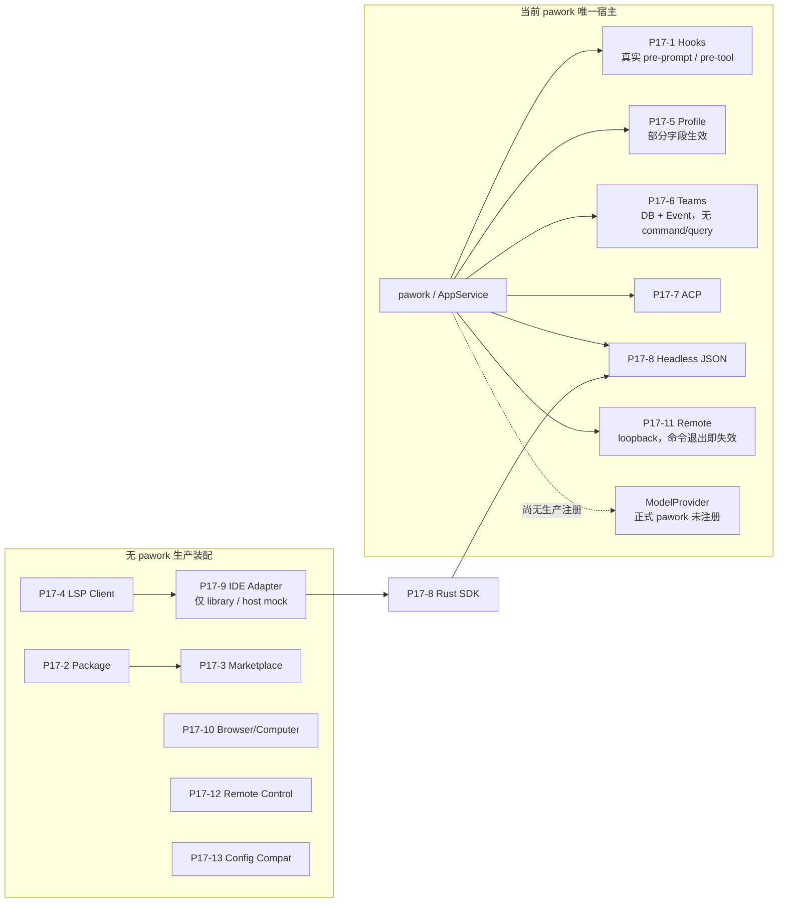

# Phase 17 Review — Ecosystem & Host Compatibility

- 评审日期：2026-08-13
- 评审范围：当前分支与工作区源码、[ROADMAP](../../ROADMAP.md)、`plan/P17-*.md`、[ADR-021](../adr/ADR-021-cli-core-same-process.md)、[ADR-022](../adr/ADR-022-gui-connects-via-cli.md)、[ADR-024](../adr/ADR-024-shared-app-service-event-hub.md)、[ADR-025](../adr/ADR-025-cli-is-sole-host.md)、[ADR-027](../adr/ADR-027-local-remote-same-protocol.md)、[ADR-028](../adr/ADR-028-replaceable-remote-transport.md)、[ADR-030](../adr/ADR-030-core-sole-source-of-truth.md)、[ADR-031](../adr/ADR-031-sandbox-backend-architecture.md) 及相关功能/架构文档
- 评审性质：只读 Review；除本文件外不修改实现、ROADMAP、plan 状态或既有文档
- 评审方式：Commander 统筹、复核并形成最终结论；GLM、DeepSeek 分片调查代码与文档，Grok 做反向审查；结论由 CodeGraph、当前源码、Cargo 依赖图和正式宿主装配交叉核对
- 优先级语义：本文 P0/P1/P2 表示 Phase 完成认定与改进优先级，不等同于安全漏洞等级

## 0. 总结论

**Phase 17 不能按当前源码认定为 13/13 产品能力完成。它完成了大量可测试的 library/domain/adapter 实现，并守住了 Pawork 的关键架构红线；但真正进入 `pawork` 主流程且形成真实协议/事件纵向链路的主要是 P17-1 User Hooks、P17-7 ACP Host、P17-8 Headless/Agent SDK。P17-5、P17-6、P17-11 虽有宿主装配，却分别存在字段只加载不生效、无 command/query 入口、发布后进程立即退出等关键缺口；其余多项仍是无生产消费者的库、mock 或安全 facade。**

Phase 17 的 13 个新增 crate 当前合计 **54,280 行 Rust（含测试）**。这批代码不是普遍低质量：包校验、LSP 协议、ACP/Headless framing、浏览器执行位点隔离、TLS/凭证/重连、兼容配置的只读解析等局部实现均有明确价值。问题在于交付语义和结构比例：

1. [ROADMAP](../../ROADMAP.md) 已声明「有界交付、整阶段未验收」，这一点比直接宣称整阶段 Accepted 更准确；但「13/13 已实现」和 13 个统一绿色状态仍把 **代码存在、L1 测试、宿主接线、产品可用** 四种不同事实压成一个状态。
2. 多个 plan 的 `Accepted` / `Target-Verified` 与实际可达性不一致，尤以 P17-6、P17-10、P17-11 为甚；P17-2/3/7/9/12/13 的 `Built` 表述相对诚实，但 ROADMAP 汇总丢失了这层差异。
3. 当前最严重的确定性缺陷是 P17-11：`remote publish` 只监听 `127.0.0.1:0`，命令返回后宿主进程退出，listener 与注册表随之结束；endpoint token 文件却不会在 drop 时删除。后续独立 `unpublish/revoke` 进程既找不到上一进程的内存 handle，也无法清理遗留凭证。
4. CLI 的 Plugin/MCP/Import 等未实现命令仍返回 `ok: true`，Agent Loop 的工具执行也返回 “tool executed” 的 no-op 结果。它们比明确的 `NotImplemented` 更危险，因为调用方无法区分真实副作用与占位成功。
5. 没有发现 Phase 17 引入第二 Core、GUI 直连 Provider/DB/Tool、在 Agent Engine 按 Provider 名分支、`agent-domain` 依赖基础设施、明文 Secret 入库等架构红线违规。主要问题是**未接入、过度声明和提前抽象**，不是需要新 ADR 才能解释的架构冲突。

建议把 Phase 17 的准确总状态改为：**3 项 host-wired，3 项 partial/blocked host wiring，7 项 library/adapter built**。前三项的协议/事件路径真实存在，但正式 `pawork` 尚未注册任何 ModelProvider，因此涉及模型执行的 Hooks、ACP、Headless Run 仍受这一跨阶段前置缺口限制。下一步不应继续扩 facade 或新 crate，而应先消除假成功，修复 P17-11 生命周期，再只选择一个未闭环能力做最小纵向接线。

## 1. 逐任务设计符合度

| 任务 | 当前准确状态 | 设计符合度与主要偏差 |
| --- | --- | --- |
| [P17-1 User Hooks](../../plan/P17-1-user-hooks.md) | **Host-wired，基本符合** | [`pawork main`](../../apps/pawork/src/main.rs) 装配 global/workspace 配置，[`app-service::supervisor`](../../crates/app-service/src/supervisor.rs) 在 pre-prompt/pre-tool 权威位点调用；Command 经 Sandbox、HTTP、MCP、Audit、Secret 边界完整。PromptEval/AgentEval 依赖正式 Provider 注册，而当前 `pawork` composition 尚未注册 Provider，因此模型型 handler 运行时 fail-closed；这是既有 Provider 宿主缺口，不应掩盖为 P17-1 全能力可用。 |
| [P17-2 Plugin Package](../../plan/P17-2-plugin-package-format.md) | **Package-format library** | archive/hash/path/conflict/secret 校验与确定性 dispatch plan 真实存在；但所谓向 Skills/Agents/Hooks/MCP/LSP/Monitors loader 分发只有 `PackageDispatchSink` trait 与 `RecordingDispatchSink`，没有生产 sink。格式层可以算 Built，不能把 fixture dispatch 当作一次真实安装。 |
| [P17-3 Marketplace](../../plan/P17-3-plugin-marketplace.md) | **Scaffold/library，未形成市场** | install/update/remove/trust/pin 的事务算法有测试；[`source.rs`](../../crates/marketplace/src/source.rs) 只有 `InMemorySourceIo`，[`host.rs`](../../crates/marketplace/src/host.rs) 只有 `RecordingHost`，crate 未依赖 plan 所称的 `http-runtime`、`resource-loader`、`policy-engine`，也没有 AppService/CLI 入口。真实 registry/git/local source 与资源应用均不存在。 |
| [P17-4 LSP Runtime](../../plan/P17-4-lsp-runtime.md) | **Target library complete，未宿主化** | LSP client framing、initialize、document sync、cancel/restart、write policy 与 Sandbox spawner 边界完整；唯一工作区消费者是 P17-9 IDE adapter，没有 `pawork` composition。若目标仅是可复用 LSP client library，Target-Verified 可成立；若目标是“Agent 调用语言服务”，主流程尚未证明。 |
| [P17-5 Agent Profile v2](../../plan/P17-5-agent-profile-v2.md) | **Partial host wiring** | `RunStart.profile` 解析、prompt/model/effort/max_turns/background/memory availability/tool rules 部分进入 run；但 `skills`、`mcp`、`permissions`、`hooks` 只被 loader 校验，无运行时消费者。ProviderLoopConfig 的 tools/hosted_tools/extensions 均为空，工具执行仍是 P13-1 no-op；Restricted/Container 因无执行器能力而 fail-closed。完整 Profile v2 的 TargetVerified 结论不成立。 |
| [P17-6 Agent Teams](../../plan/P17-6-agent-teams.md) | **Durable domain wired，无产品入口** | `TeamService`、SQLite append/replay 与 EventHub 镜像在 `CoreRuntime` 中真实装配；但 [`core-api`](../../crates/core-api/src/lib.rs) 没有 Team command/query，CLI/GUI/ACP/Headless 均不能创建、查询或操作 Team。`AppService::teams()` 是旁路 Rust API，`observe_worker_events` 只有测试调用，生产 presence 不会随 worker 生命周期更新。不能认定 Accepted。 |
| [P17-7 ACP Host](../../plan/P17-7-acp-host.md) | **Host-wired，Built 较准确** | `pawork acp serve` 走共享 AppService/SessionStore，没有第二 Core，stdio/协议/occupancy 有真实测试。当前 `ACP_SUPPORTED_CAPABILITIES` 为空，所有客户端扩展能力都被降级；降级结果只留在内存查询中，没有写入 audit/diagnostic。协议链路真实，但正式宿主无 Provider 时模型 Run 仍不可完成；plan 所称“显式记录协商结果”也未完全满足。 |
| [P17-8 Agent SDK](../../plan/P17-8-agent-sdk.md) | **Host-wired，符合** | `pawork headless --json-stdio` 是真实入口，Rust SDK 实际 spawn `pawork`，并有进程级 e2e；compat import/history 由 Headless 扩展帧接 SessionStore。它保持 client-only、无第二 Core，是 Phase 17 最完整的协议交付之一；模型 Run 同样受正式 Provider 未装配限制。 |
| [P17-9 IDE Host Adapter](../../plan/P17-9-ide-host-adapter.md) | **Adapter kit，Built 较准确** | 通过 Agent SDK/Headless 连接 Host，LSP 仅作可选输出，依赖方向正确；但只有 host mock/contract 测试，没有真实 VS Code/JetBrains 生命周期。`IdeClientAdapter`/factory 与 SDK channel 两套 framing seam 在同一 crate 内并存，虽被内部一致性校验复用，仍比当前单一真实通道所需更复杂。 |
| [P17-10 Browser/Computer Runtime](../../plan/P17-10-browser-computer-runtime.md) | **Safety facade/scaffold** | 三执行位点与 Sandbox-before-driver、ProviderHosted 不进本地 execute 的安全不变量真实且应保留；但 crate 无生产消费者，Local/Playwright 默认均为 Stub，MCP 仅注入 trait，ProviderHosted 仅映射事件。四套 backend wrapper + selector 对零真实 backend 明显提前，不能称 Target-Verified 的产品 runtime。 |
| [P17-11 Remote Transport](../../plan/P17-11-real-remote-transport.md) | **内部 transport 可测，CLI 产品路径 blocked** | TLS 1.3、端点 token、frame limit、reconnect/resend、revoke 的同进程实现与 e2e 有价值；但只绑定 loopback 临时端口，endpoint registry 仅在当前 `RealRemoteTransport` 内存中。`pawork remote publish` 输出成功后进程立即结束，实际端点随之消失，下一次命令无法 unpublish/revoke。当前 Accepted 结论不成立。 |
| [P17-12 Remote Control](../../plan/P17-12-mobile-remote-control.md) | **Unhosted adapter library** | command/query allowlist、审批 gate、通知/replay 和 credential hash-only 方向正确；但没有 production reverse consumer，也未由 P17-11 承载。它又自建内存 `PairingRegistry`，与 transport/client-auth 的认证与撤销生命周期重叠，跨重启不可恢复。 |
| [P17-13 Compat Loader](../../plan/P17-13-compatibility-loader.md) | **Read-only parser/exporter** | 多来源检测、路径/符号链接防护、限制与 Secret 拒绝良好；但 `apply` 只向调用方目录写 `compat-import.json` 与 fingerprint，没有调用 ResourceLoader/AppService 应用任何资源，也没有 CLI 入口。它与 P16-9 Session Compatibility Import 职责不同，不应合并概念，但当前命名把“导出计划”说成了“应用”。 |

## 2. 实际主流程接线

下图按当前正式依赖和 composition root 区分“进入 `pawork` 进程”与“只存在于库/mock/fixture”。SDK/IDE 是外部 client library，位于进程外本身并非缺陷；“无 `pawork` 生产装配”区域的问题是对应 plan/ROADMAP 把其中多项描述成了已经可用的宿主能力。



### 2.1 三条真实纵向路径

- **Hooks**：[`apps/pawork/src/user_hooks.rs`](../../apps/pawork/src/user_hooks.rs) 加载并装配 handler；[`app-service/src/user_hook.rs`](../../crates/app-service/src/user_hook.rs) 组合 Sandbox/HTTP/Judge/MCP/Audit/Secret；[`supervisor.rs`](../../crates/app-service/src/supervisor.rs) 在权威位点调用。它没有复制 P10 Hook dispatch，也没有绕过 Core。
- **ACP**：CLI 入口、协议 adapter、共享 AppService、SessionStore 与事件输出在同一 `pawork` Host 内；降级能力审计是剩余缺口，不是第二运行时。
- **Headless/SDK**：Headless JSON framing 与 core-api command/query/event 复用，SDK 只作为子进程 client；进程级 e2e 能证明“只连接正式 Host”而非 mock-only。

### 2.2 “已装配”不等于“可操作”

- Profile resolver 与 TeamHost 都在 [`apps/pawork/src/main.rs`](../../apps/pawork/src/main.rs) / CoreRuntime 创建，但前者只消费部分字段，后者没有 canonical command/query。
- Remote provider 与 GUI server 共享同一个 `RealRemoteTransport` 实例，这是正确方向；然而它们只活在一次 CLI 子命令进程中，缺少长生命周期 owner，装配反而暴露了生命周期设计错误。
- `PluginList` / `McpList` 在 [`app-service/src/router.rs`](../../crates/app-service/src/router.rs) 固定返回空数组；Plugin/MCP/Import CLI 在 [`cli-host/src/lib.rs`](../../crates/cli-host/src/lib.rs) 走 placeholder，不能视为 Marketplace/Compat 的接入。

## 3. P0：必须先消除的确定性产品错误

### 3.1 P17-11 `remote publish` 成功响应后端点立即消失

[`RealRemoteTransport::publish_endpoint`](../../crates/transport-remote/src/lib.rs) 将 listener 绑定到 `127.0.0.1:0`，并把 endpoint state 保存在当前实例的 `HashMap`。[`CliHost::remote_mode`](../../crates/cli-host/src/lib.rs) 在同一进程 publish、把 endpoint 绑定给 GUI server，然后返回成功 `HostOutcome`；[`apps/pawork/src/main.rs`](../../apps/pawork/src/main.rs) 打印结果后直接结束。Tokio runtime、GUI server、transport registry 与 listener 随进程析构；`EndpointState`/`TokenStore` 没有 drop cleanup，只有显式 unpublish/revoke 才删除 endpoint token 文件。

因此当前行为有三个确定性后果：

1. 地址只能同机 loopback 访问，不满足“远程发布”；
2. 即便同机客户端拿到地址，也只能在 publish 子命令退出前的极短窗口连接；
3. 后续 `pawork remote unpublish/revoke <handle>` 创建的是新 transport，内存 registry 为空，只会得到 unknown handle；上一进程遗留的 token 文件也不会被该路径删除。同实例名再次启动时 endpoint ID 从零开始，还会撞上该文件的 `create_new` 语义而发布失败。

现有 e2e 在一个测试进程里持有 transport/harness 存活，无法覆盖这个 CLI 生命周期缺陷。

**最小结构修复**：让 publish/unpublish/revoke 成为对已经运行的 `pawork serve` 的控制命令，由同一个长生命周期 Host 持有 listener、registry、credentials 与 GUI bind；或者把 `remote publish` 本身明确变成长驻 serve 模式。外部可达地址/relay 作为 transport 配置接入，loopback 只保留测试/开发模式。不要新建第二 daemon，也不要新增一个 Remote Manager crate。

### 3.2 未执行的命令与工具不能返回成功

[`AppService::ServiceOperation::Placeholder`](../../crates/app-service/src/lib.rs) 对 Plugin/MCP/Import 等命令返回 `ok: true` 和 “command route is available”；[`AppServiceRouter`](../../crates/app-service/src/router.rs) 对 Plugin/MCP 列表固定返回空数组；[`supervisor::execute_tools`](../../crates/app-service/src/supervisor.rs) 返回 “tool executed (P13-1 no-op runtime)”。这会让 CLI、SDK、自动化或模型把“没有副作用”误认成“已完成”。

最小修复不是接着补 facade，而是先统一 **fail-closed**：未接线命令返回稳定的 `NotImplemented/Unavailable` 错误和非零退出码；no-op tool 不得生成成功 ToolExecutionCompleted。这样 P17-3、P17-5、P17-13 尚未闭环的事实能被调用方正确处理。

## 4. P1：主流程缺口与状态失真

### 4.1 一个绿色状态不能同时表示四种成熟度

当前至少需要区分：

1. `Domain/format built`：类型、解析、纯算法与 unit/fixture 测试存在；
2. `Adapter/runtime built`：可运行库存在，但没有正式宿主消费者；
3. `Host wired`：composition root、canonical command/query/event 已接；
4. `Product usable/accepted`：真实外部入口和生命周期 e2e 通过。

ROADMAP 可以保留“13 个任务均有代码交付”的事实，但不应再用统一绿色图标暗示同等完成度。历史 L1/L2 结果只能证明当时命令覆盖的范围，不能替代当前生产可达性。建议把 P17-11 标为 Blocked，把 P17-5/P17-6 标为 Partial，其余无宿主项明确标为 Library/Adapter Built。

### 4.2 Profile v2 暴露了未兑现的配置维度

[`AgentProfileV2`](../../crates/agent-domain/src/profile.rs) 公开 prompt/model/effort/tools/skills/MCP/permissions/hooks/memory/isolation/background 等维度；全仓对 `profile.skills/mcp/permissions/hooks` 的引用只出现在 ResourceLoader 校验和测试，没有进入 AppService run。工具 rule 虽在 pre-tool 检查，但 ProviderLoop 的工具列表为空、执行器是 no-op。

最简单的选择二选一：

- 在状态和文档中把当前能力收缩为“Profile execution subset”，只承诺真正消费的字段；或
- 后续直接把现有 ResourceLoader 结果映射到已有 Hook/MCP/Skill/Policy 入口，不再增加 Profile Facade、Resolver 层或 generic capability graph。

未解析或未支持的引用应在 RunStart fail-closed，而不是静默携带。Restricted/Container 当前因没有真实执行器而拒绝运行是正确行为，应保留。

### 4.3 Teams 有持久化权威，却没有 canonical ingress

P17-6 已付出 TeamService、SQLite store、18 个事件变体和约 220 行 1:1 core-api 镜像转换的成本，但 [`AppCommand`/`AppQuery`](../../crates/core-api/src/lib.rs) 没有 Team 操作。`AppService::teams()` 绕过 router 的直接 Rust getter 只在测试/内部可用；`TeamHost::observe_worker_events` 同样没有生产调用者。

这里不需要再加 Team facade。应在两个方向中明确选择一个：

- 近期要交付 Teams：补最薄的 canonical TeamCommand/TeamQuery，并在现有 worker 事件桥调用 `observe_worker_events`；CLI/GUI 只走 AppService；或
- 暂不交付：把 P17-6 标为 durable library，停止正式宿主启动时无条件打开 team DB，等 P19 纵向任务再装配。

在没有 command/query consumer 前，完整复制 18 个公开 TeamEvent 是提前公开协议面；不要再出现第三套 DTO。

### 4.4 Package/Marketplace 只有抽象事务，没有真实 I/O 与资源应用

P17-2 的 Package Format 与 P17-3 的 Marketplace 分层本身合理：前者应保持确定性、无网络，后者拥有 source/trust/install lifecycle。问题不是必须合并两个 crate，而是两层都把 mock seam 写成了交付结果：`RecordingDispatchSink`、`InMemorySourceIo`、`RecordingHost` 是测试工具，不是 loader、registry 或宿主。

最小闭环只需要一个 source 和一个资源类型：例如 local directory source → 验签/冲突计划 → 已有 ResourceLoader 的一种资源 → 原子登记/回滚 → CLI 显式结果。不要同时实现 registry/git/local、六类资源和新的通用 transaction framework。真实纵向路径出现前，Marketplace 应保持 default-off，Plugin 命令必须明确报 unavailable。

### 4.5 Browser/Computer、Remote Control、Compat 的边界正确但外壳偏重

- Browser/Computer 应先保留 canonical action/result、一个 backend contract、Sandbox-before-execute 和 hosted ownership 不变量；在第一个真实 Local/Playwright/MCP backend 接入前，四套 wrapper、默认 Stub 与无消费者 helper 不应继续扩展。
- Remote Control 应成为已认证远程 client session 上的一层 capability allowlist/approval/notification codec。Pairing credential 的签发、持久化、撤销应复用 `client-auth`/`auth-service` 与长生命周期 transport owner，而不是 adapter 内再维护一套内存身份系统。
- Compat Loader 的隔离解析边界有安全价值；当前 `apply` 应准确命名为 `export_plan`。若近期没有配置导入入口，可把它保持为 quarantined parser library；若要接入，只让现有 ResourceLoader 消费用户确认后的 canonical plan，不新增 Import Service。

## 5. 冗余、过度设计与合并/删除建议

| 对象 | 建议 | 原因 | 优先级 |
| --- | --- | --- | --- |
| `transport-remote-placeholder` | 把仍需的 provider/connector contract 收回已有 [`transport-api`](../../crates/transport-api/src/lib.rs)，Mock 移到 test-support/测试模块，删除 placeholder crate；必要时只保留短期 re-export 兼容层 | P17-11 已有真实 crate，但 CLI 与 real transport 仍生产依赖一个名为 placeholder 的 trait+Mock crate；workspace layout 又宣称它已被替换，概念与事实冲突 | P1 |
| P17-11 endpoint registry | 归属于长生命周期 `pawork serve`，不另建 manager/daemon | 当前 per-command 内存 registry 是生命周期错误；已有唯一 Host 足以持有状态 | P0 |
| IDE `IdeClientAdapter` + `SdkChannel` | 保留 Headless/SDK 为唯一执行通道；只保留 Host 真正使用的协议校验，未被真实 IDE consumer 需要的公共 factory/API 私有化或延后 | 同一 crate 同时维护 client-adapter framing 与 SDK framing，当前只有 mock/内部一致性消费 | P2 |
| Browser 四 backend wrappers | 收缩为 action/result + 一个 backend trait + execution-owner check；真实第二 backend 出现后再恢复 selector/fallback 层 | 目前 Local/Playwright 是 Stub、MCP 只注入、Hosted 不本地执行，抽象数量大于实际替换对象数量 | P1 |
| Remote Control pairing | 复用现有 auth/client session，删除 adapter 自有权威 PairingRegistry；adapter 只做 capability gate | 避免 token、revoke、device identity 在 transport/auth/adapter 三处各有生命周期 | P1 |
| Team public event mirror | 有真实 command/query 后只保留一个 canonical public event；否则延后公开 18 变体镜像 | 当前 1:1 手写转换无外部 consumer，易漂移；领域内部事件与 public projection 可有边界，但不需要提前完整复制 | P2 |
| Plugin manifest 中 MCP/Monitor inline DTO | 优先用 resource ref + digest 指向 canonical 文件，由对应 loader 校验；只有包格式确实需要稳定内嵌 schema 时才保留独立 DTO | 当前重复表达 MCP/Monitor 配置，与“child resources 交给 canonical loaders”目标存在张力 | P2 |
| Compat `apply` | 重命名/收缩为 export plan；真实应用放在 ResourceLoader/AppService composition | 当前函数没有应用任何资源，名称导致设计与行为不一致 | P1 |
| `reject_hosted_for_local` 等纯别名 helper | 无生产调用/独立语义时删除 | 小而明确的死抽象，增加 API 表面积却不增加约束 | P2 |

### 5.1 不建议合并或删除的边界

- **User Hooks 与 WASM Hook Runtime**：前者是用户声明和权威触发点，后者是受限执行后端；现有分离避免把配置、生命周期与执行器耦合，应保留。
- **ACP、Headless、GUI 三条 adapter**：协议与 framing 不同，但都汇入同一 AppService；这是合理的端口分离，不应合并成通用“万能协议”。
- **Plugin Package 与 Marketplace**：纯格式/验证和有副作用的 source/install 生命周期应分层；应删 mock-as-product 和重复 DTO，而不是把网络、信任、解包揉进一个 crate。
- **LSP Client Runtime 与 IDE Host Adapter**：一个服务 Agent 的语言能力，一个服务 IDE 接入，职责不同；当前问题是尚未宿主化，不是边界错误。
- **P16-9 Session Import 与 P17-13 Config Import**：前者导入会话历史，后者导入配置/资源，不能为减少 crate 数而混成一个 Import 领域。

## 6. 架构符合性

### 6.1 符合且应保留

- `pawork` 仍是 Core 唯一正式宿主；ACP、Headless、SDK、IDE adapter 都没有嵌入第二 Core，符合 [ADR-021](../adr/ADR-021-cli-core-same-process.md) 与 [ADR-025](../adr/ADR-025-cli-is-sole-host.md)。
- GUI 仍经 GUI Connection Protocol → GuiServer → AppService，不直接访问 Provider、数据库或工具，符合 [ADR-022](../adr/ADR-022-gui-connects-via-cli.md)。
- `agent-domain` 没有引入 GUI、SQLite、HTTP、Keychain、Git 或具体 Provider；Agent Engine 未按 Provider 名走特例。
- User Hooks command 经 Sandbox、HTTP/MCP/Secret/Audit adapter；Browser/Computer 在调用 driver 前执行 Sandbox gate，ProviderHosted 明确不进入本地 tool execute，符合 [ADR-031](../adr/ADR-031-sandbox-backend-architecture.md)。
- Team 事件 append/replay、Headless/ACP 复用 AppService、Remote GUI/provider 共享 transport 实例的方向符合单一事实源；缺口主要在入口和生命周期，不需要另建权威服务。
- Package/Marketplace/Compat 对路径穿越、符号链接、hash/signature、Secret、credential ref 的 fail-closed 处理总体可靠。

### 6.2 文档与真实依赖不一致

- [`docs/architecture/overview.md`](../architecture/overview.md) 把 Phase 17 多项能力描述为在 core-runtime/app-service 统一装配；实际 Package/Marketplace/LSP/Browser/RemoteControl/Compat 均不在正式宿主树。
- [`docs/architecture/workspace-layout.md`](../architecture/workspace-layout.md) 写 Marketplace 依赖 `http-runtime`，当前 Cargo manifest 不依赖；同文档称 `transport-remote` 已替换 placeholder，但 placeholder 仍是 workspace member，并被 `cli-host` 与 real transport 生产依赖。
- [`docs/features/gui-connection.md`](../features/gui-connection.md) 对 remote transport 的描述仍以 placeholder 为主，不能反映当前“real crate 已存在但 CLI 生命周期不可用”的状态。
- [`docs/features/plugins.md`](../features/plugins.md) 对真实 dispatch sink/monitor host 延期的说明比 ROADMAP 诚实，应让 ROADMAP/plan 状态与这一事实一致，而不是再补一层解释文档。

这些偏差不需要新 ADR。现有 ADR 已清楚规定唯一 Host、同协议和可替换 transport；应修正状态/接线或删掉提前声明。

## 7. 建议的收敛顺序

### P0（完成认定阻断）

1. **修 P17-11 生命周期和可达性**：remote endpoint 由长生命周期 `pawork serve` 持有；CLI 通过既有本地控制协议 publish/unpublish/revoke；加入跨真实 CLI 进程的 publish → connect → reconnect → revoke e2e。未完成前 P17-11 标为 Blocked。
2. **消除假成功**：Plugin/MCP/Import 未接线时返回明确错误；no-op tool 不得返回执行成功。先恢复语义可信度，再谈 Marketplace/Profile 扩展。

### P1（一个纵向闭环 + 减复杂度）

3. **校准成熟度状态**：用 Domain Built / Adapter Built / Host Wired / Accepted 四态替代统一绿色；历史 gate 与当前源码不一致时以当前源码为准。
4. **只选一个未闭环能力接主流程**：如果近期产品需要协作，优先 TeamCommand/TeamQuery + worker presence；如果需要生态，优先 local Marketplace source + 一种 resource。不要同时铺开六类插件资源和四种 browser backend。
5. **Profile 要么收缩承诺，要么直接消费现有资源**：不增加 resolver/facade；unsupported reference fail-closed，工具执行真实化前不宣称 tools profile 可用。
6. **删除 stale/重复权威**：placeholder remote contract 并入 `transport-api`，Remote Control pairing 复用 auth/session，Compat `apply` 改成准确的 export 语义。

### P2（维护性与证据）

7. ACP handshake 将 degraded capabilities 写入现有 structured trace/audit，不新增协商服务。
8. 真实 IDE extension 出现前，私有化仅供 mock 的公开 adapter/factory；Browser selector 同理等待第二真实 backend。
9. 修正文档依赖图和交付矩阵；对 library-only 任务明确“没有 `pawork` 生产装配”，避免把 mock/fixture smoke 写成 product acceptance。

## 8. 建议的 Phase 17 状态矩阵

| 成熟度 | 任务 |
| --- | --- |
| **Host-wired / 可接受有界任务验收** | P17-1（模型型 hook 受 Provider 宿主前置条件限制）、P17-7（协议链已接，模型 Run 受同一前置条件限制，降级能力审计待补）、P17-8（Headless/SDK/compat 链已接，模型 Run 受同一前置条件限制） |
| **Partial / Blocked host wiring** | P17-5（只消费部分 profile）、P17-6（无 ingress）、P17-11（CLI 生命周期 blocked） |
| **Library / adapter built，未形成产品能力** | P17-2、P17-3、P17-4、P17-9、P17-10、P17-12、P17-13 |

如果 ROADMAP 中“13/13 已实现”只表示“13 个任务均有源码与 L1 证据”，应直接写明这一狭义定义；它不能作为 Phase 17 设计目标和实际需求已经满足的结论。

## 9. 评审证据与验证边界

本次为只读架构/实现 Review，没有修改生产代码，也没有复跑历史 L1/L2 Cargo 门禁。复核采用：

- CodeGraph 定位 Phase 17 symbol、调用路径与动态边界；
- `cargo metadata --format-version 1 --no-deps` 核对 crate 依赖；
- `cargo tree -p pawork` 核对正式宿主依赖树；
- 当前源码逐项核对 composition root、AppCommand/AppQuery/AppEvent、runtime owner、mock/fixture 与真实 I/O；
- 对 13 个 Phase 17 crate 统计当前 Rust 源码/测试规模；
- 文档链接、Markdown diff 与工作区状态做 L0 检查。

```text
Validation Level: L0
Affected crates: none（仅新增评审文档）
Validated: CodeGraph 调用路径；cargo metadata --format-version 1 --no-deps；cargo tree -p pawork；文档链接与 diff 检查
Targeted regressions: none（Review-only，未修改实现）
Full workspace gate: NOT RUN（未命中 Workspace Full Gate 升级条件）
```

## 10. 最终判断

Phase 17 的方向总体符合 Pawork：生态能力保持纯 Rust、外部客户端不嵌 Core、GUI 不越权、危险执行点有 Sandbox/Policy/Secret 边界。真正需要纠正的是交付模型：**大量横向 library 已经写完，但纵向 Host 只闭合了少数路径；13 个 crate 和 54k 行代码制造了“能力齐全”的视觉效果，却没有对应数量的真实用户入口。**

最优改进不是继续完善每个 scaffold，而是：

1. 先让所有成功响应都代表真实、可持续的副作用；
2. 让 Remote 生命周期回到唯一长驻 Host；
3. 用明确成熟度代替统一绿色；
4. 一次只闭合一个纵向能力；
5. 删除 placeholder、重复 pairing、无第二实现的 selector/factory 和名不副实的 `apply`。

在 P17-11 和假成功路径修正、P17-5/P17-6 状态降级之前，**不建议把 Phase 17 标为整阶段已验收，也不建议把 P17-6/P17-10/P17-11 继续标为 Target-Verified/Accepted。**

## 11. 修复记录（review-remediation）

> 本节为 P17-14（评审修复与成熟度校准）的**最终修复记录**：评审本体（§1–§10）为只读 Review 历史快照，本节是评审后 P17-14 落地的 remediation 记录。八项 review 修复 + 两项门禁衍生可靠性修复已落地并经定向门禁验证；未闭环的纵向能力按五项映射显式延后。P17-14 状态：`🟢已完成 · TargetVerified`。

### 11.1 已修（本轮最终 remediation）

- **§3.1 / §7-P0-1 Remote 长驻生命周期 + token 清理（P17-11）**：`RealRemoteTransport` + `TokenStore` 在 [`apps/pawork/src/main.rs`](../../apps/pawork/src/main.rs) 装配，端点由执行 `remote publish` 的长驻 pawork 进程经 `ServeGuiHost::bind_remote` 实际 bind / accept，publish 长驻至 SIGINT；跨进程仅 connect / reconnect，SIGINT 触发端点关闭与 token 清理。`EndpointState::drop` 幂等删除其自建 endpoint token 文件，transport drop 只清本实例登记过的端点。跨真实进程 e2e：[`apps/pawork/tests/remote.rs`](../../apps/pawork/tests/remote.rs)（长驻 → 跨进程 connect / reconnect → SIGINT → token 清理、清理后同名再发布不冲突）。独立 unpublish / revoke 命令当前没有共享控制面：无长驻 host 时一律 fail-closed，不声称可跨进程操控运行中的 publish 进程。**边界**：bind 仍为 loopback 临时端口（开发/测试默认）；外部可达地址（NAT 穿透 / relay）与共享控制面显式延后 → P19-14。
- **§3.2 / §7-P0-2 假成功消除（fail-closed）**：`ServiceOperation::Placeholder` 改为失败响应（不再 `ok: true`）；`PluginList` / `McpList` 返回 `AppServiceError::Unavailable`（不再固定空数组）；隔离 profile（Restricted/Container）下的 P13-1 no-op 工具执行返回 `ToolResult::failure(ErrorCategory::Unavailable)`，不再生成成功 `ToolExecutionCompleted`；CLI 层 placeholder 命令退出码非 0，`--json` 输出 `ok=false` + 错误帧。
- **§4.2 Profile 未支持引用 fail-closed**：run 解析时 `unsupported_profile_refs` 按固定顺序汇总 `skills` / `mcp` / `permissions` / `hooks`，任一非空即返回 `Unavailable`，不静默携带未兑现的配置维度；工具 rule deny-first 与 Restricted/Container 拒绝执行是评审认定的正确行为，保留。
- **§4.3 Teams 降 durable library（不持久装配）**：`team_db_path` 保持 `CoreRuntimeConfig` 默认 `None`，正式宿主启动不再无条件打开 `teams.sqlite`（回归：正常 CLI 启动不创建 `teams.sqlite`）；TeamService / SQLite append-replay / EventHub 镜像保留为 durable library，canonical TeamCommand/TeamQuery ingress 显式延后 → P19-13。
- **§5 remote placeholder contract 归 `transport-api`**：provider / connector 契约（`RemoteGuiTransportProvider` / `RemotePublishHandle` / `RemotePublishRequest` 等）收回 [`transport-api`](../../crates/transport-api/src/lib.rs)；`transport-remote-placeholder` 收缩为评审允许的「短期 re-export 兼容层 + `MockRemoteTransport` 测试支持」，不再承载生产契约定义。
- **§5 Browser 纯别名 helper 删除**：`reject_hosted_for_local` 等无生产调用、无独立语义的别名 helper 已删除（全仓无引用）；三执行位点、Sandbox-before-driver、ProviderHosted 不进本地 execute 的安全不变量保留。
- **§5 Compat `apply` → `export_plan`**：[`compat-loader`](../../crates/compat-loader/src/lib.rs) 入口更名收缩为显式幂等的 `export_plan`（计划文件名 + 幂等指纹），只把 canonical 计划写入调用方指定输出目录，不执行 hook / MCP、不应用任何资源；「真实应用」留给未来 ResourceLoader / AppService composition 消费（落点并入 P19-11）。
- **JSON stdout 契约（日志一律 stderr）**：`--json` / ACP / Headless 路径 stdout 只承载协议帧，tracing / 日志统一写 stderr，`--json` 输出可整体解析为纯 JSON；这是 remote publish JSON 输出可机读与 §3.1/§3.2 错误语义可被自动化正确消费的前置。
- **门禁衍生可靠性修复 1：RateLimiter 自动冲刷结果保留 + Team 回归**：[`app-service::rate_limit`](../../crates/app-service/src/rate_limit.rs) 的 `enqueue` 把 push 触发的自动冲刷结果（窗口到期 / 容量超限）重新排入内部就绪队列，由下一次 `flush` 发出——不丢失、不重复（`enqueue_requeues_window_expiry_flush_without_loss_or_duplication`）；Team durable library 降级后的回归保持通过（[`teams_state.rs`](../../apps/pawork/tests/teams_state.rs) `teams.sqlite` 不创建、[`team_durability.rs`](../../crates/app-service/tests/team_durability.rs) append/replay）。
- **门禁衍生可靠性修复 2：remote 认证同步 subscribe 与 carrier 联合捕获**：首次认证成功后，`serve_connection` 同步执行 `hub.subscribe()` 并将 `HubSubscription` 传给 pump，消除认证成功与 `tokio::spawn` 内订阅之间的调度窗口；carrier 集成测试的联合捕获——到达顺序任意仅指 RPC 响应与 capture 命中的通知；capture 谓词命中的 RunFinished 帧会缓存，不被等待 RPC 响应的循环丢弃（[`transport_remote_carrier.rs`](../../crates/remote-control-adapter/tests/transport_remote_carrier.rs)）。修后定向复跑：受影响 exact 测试 **30/30 通过**、test target **10/10 通过**。

### 11.2 状态矩阵（终态）

Phase 17 不再以统一绿色 13/13 自述；按评审 §8 四态矩阵终态校准：

| 成熟度 | 任务 |
| --- | --- |
| **HostWired** | P17-1 / P17-7 / P17-8（模型 Run 仍受正式 Provider 未装配的前置限制） |
| **PartialWired** | P17-5（收敛为部分字段生效）/ P17-11（修复后解除 lifecycle blocked，但仅 loopback、无共享控制面） |
| **LibraryBuilt** | P17-2 / P17-3 / P17-4 / P17-6（收敛为 durable library）/ P17-10 / P17-13 |
| **AdapterBuilt** | P17-9 / P17-12 |

计数：P17-14 `🟢已完成 · TargetVerified`，Phase 17 **14/14**、总计 **220/189**。

### 11.3 延期（显式映射，不在本任务）

- **ACP 降级能力审计 → P18-13**（§1 P17-7 / §7-P2-7）：`ACP_SUPPORTED_CAPABILITIES` 为空导致的降级结果写入 canonical audit event / structured trace，不新增协商服务。
- **host-wired 成熟度再认定与功能簇门禁 → P18-15**（§4.1 / §8）：正式宿主 Provider 注册（P18-3）闭合后，P17-1 / P17-7 / P17-8 的 Product usable 再认定、历史 L1/L2 证据与当前可达性对账、跨 crate 不变量集中验证。
- **Marketplace / Plugin 真实纵向 + Profile 引用维度消费 → P19-11**（§4.2 / §4.4 / §7-P1-4 / §7-P1-5）：一个真实 source + 一种资源的最小闭环、Plugin/MCP 真实列表接线、`profile.skills/mcp/permissions/hooks` 由 ResourceLoader 结果映射到既有 Hook/MCP/Skill/Policy 入口；Compat `export_plan` 的真实应用（ResourceLoader 消费 canonical plan）一并落此。
- **Teams canonical ingress → P19-13**（§4.3 / §7-P1-4）：最薄 TeamCommand / TeamQuery + worker presence 桥（`observe_worker_events` 生产调用者）；有真实 ingress 后再收敛 18 变体 public event 镜像。
- **Remote 外部可达 + Remote Control pairing → P19-14**（§3.1 / §4.5 / §7-P1-6）：外部可达地址 / relay 作为 transport 配置接入（loopback 保留测试/开发模式）；pairing credential 签发 / 持久化 / 撤销复用 `client-auth` / auth-service 与长生命周期 transport owner，adapter 只做 capability gate。

### 11.4 验证记录（已回填 · 2026-08-13）

- 代码修复已在工作区落地并经源码 / diff 核对；定向门禁已于 2026-08-13 复跑并回填，范围为 9 crate：`pawork`、`app-service`、`cli-host`、`transport-api`、`transport-remote`、`transport-remote-placeholder`、`compat-loader`、`browser-computer-runtime`、`remote-control-adapter`（transport reverse dependent）：
  - `cargo test`（上述 9 crate，共 38 个 test/doc summary）：**371 passed / 0 failed / 0 ignored**（含 `remote.rs` 跨进程 e2e、`teams_state.rs`、`cli.rs` fail-closed 回归）
  - `cargo clippy --all-targets -- -D warnings`（同 9 crate）：**0 warnings**
  - `rustfmt --edition 2021 --check --config skip_children=true`（本任务涉及的 26 个 Rust 文件）：**通过**
  - `git diff --check`：**通过**
  - 文档链接检查（git diff/未跟踪共 27 个变更 Markdown，733 条本地相对链接，0 broken）：**通过**
- 修复完成判定：八项 review 修复（P0 lifecycle / fail-closed、Profile 引用 fail-closed、Teams 降级、contract 归属、Browser 别名删除、Compat `export_plan`、JSON stdout 契约）+ 两项门禁衍生可靠性修复（RateLimiter 自动冲刷结果保留及 Team 回归；remote 认证同步 subscribe 与 carrier 联合捕获（RPC 响应与命中通知任意顺序），exact 30/30 + target 10/10）真实落地并经定向回归；P17-14 状态 `🟢已完成 · TargetVerified`。

> Validation Level: L1
>
> Affected crates: pawork、app-service、cli-host、transport-api、transport-remote、transport-remote-placeholder、compat-loader、browser-computer-runtime、remote-control-adapter（transport reverse dependent）
>
> Validated: 9 crate cargo test（38 个 test/doc summary，371/0/0）· 9 crate clippy --all-targets -D warnings（0 warnings）· `rustfmt --edition 2021 --check --config skip_children=true`（26 文件）· git diff --check · 文档链接（git diff/未跟踪 27 个变更 Markdown / 733 条本地相对链接 / 0 broken）· remote 可靠性复跑（exact 30/30 · target 10/10）
>
> Targeted regressions: remote 长驻 / 跨进程 connect / reconnect / token drop 清理 / 同名再发布 / 无 host fail-closed、placeholder fail-closed、teams.sqlite 不创建、纯 JSON stdout、RateLimiter 自动冲刷结果保留、remote 认证同步与 carrier 联合捕获（RPC 响应与命中通知任意顺序）
>
> Full workspace gate: NOT RUN（未命中升级条件）
