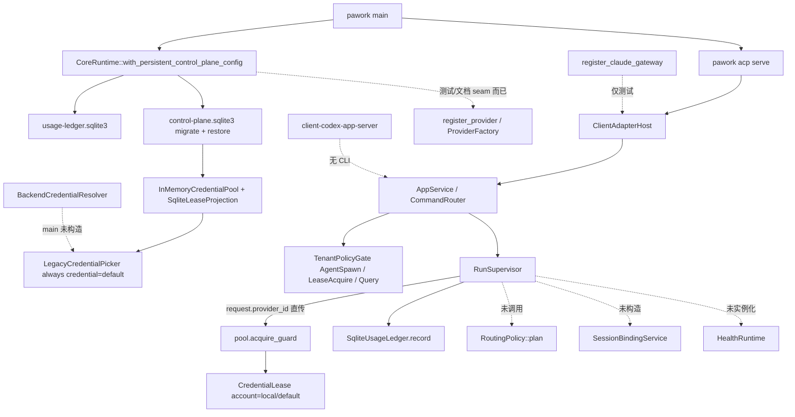

# Phase 18 Review — Account Control Plane & Client Adapters

- 评审日期：2026-08-13
- 评审范围：当前分支与工作区源码、[ROADMAP](../../ROADMAP.md)、`plan/P18-*.md`、[ADR-033](../adr/ADR-033-control-plane-separation.md)、[ADR-002](../adr/ADR-002-agent-engine-provider-decoupled.md)、[ADR-014](../adr/ADR-014-secret-os-keychain.md)、[ADR-016](../adr/ADR-016-core-event-persist-replay.md)、[ADR-025](../adr/ADR-025-cli-is-sole-host.md)、[ADR-030](../adr/ADR-030-core-sole-source-of-truth.md) 及相关功能文档
- 评审性质：只读 Review；除本文件外不修改实现、ROADMAP、plan 状态或既有文档
- 评审方式：Commander 统筹、复核并形成最终结论；GLM、DeepSeek 分片调查代码与文档。关键结论由 CodeGraph、当前源码、Cargo 依赖方向和正式宿主装配交叉核对
- 优先级语义：本文 P0/P1/P2 表示 Phase 完成认定与改进优先级，不等同于安全漏洞等级

## 0. 总结论

**Phase 18 不能按当前源码认定为 15/15 产品控制面完成。** 它交付了一套方向正确、分层清楚、可测试的账号治理与 Client Adapter 库，并真正把 Tenant 身份、Credential Lease、持久 Usage Ledger、deny-first 准入，以及 ACP 经 `ClientAdapterHost` 接进了 `pawork`。但 [ADR-033](../adr/ADR-033-control-plane-separation.md) 要求的控制面主链在正式宿主里只活了中间的 Lease 和身份/账本：没有 Route，没有 Health，没有 Session Binding，没有 Provider factory，也没有真实 `ModelProvider` 注册。

[ROADMAP](../../ROADMAP.md) 已经写明「有界完成、不声称生产已装配」，这比直接宣称整阶段 Accepted 更准确。问题在于 15 个统一绿色状态仍把四种不同事实压成一项：类型/schema 存在、crate 内 L1 与 `scripts/p18-gate.sh` 定向 L2 通过、`app-service`/`core-runtime` 有 seam、以及 `pawork` 主流程真正消费。

当前最值钱的交付是 **P18-4 / P18-8**：正式宿主打开 `usage-ledger.sqlite3` 与 `control-plane.sqlite3`，启动失败不降级；run 前 `acquire_guard`，用量按真实 lease 归属，启动时 `restore`、运行中周期 `reclaim`。当前最大的结构浪费是 `provider-control` 约 1.6 万行里，路由、健康、粘性、registry、reconciler、probe 对 `apps/pawork` 的生产调用数为 0；[`apps/pawork/src/composition.rs`](../../apps/pawork/src/composition.rs) 的 `BackendCredentialResolver` 也从未被 [`main.rs`](../../apps/pawork/src/main.rs) 构造。

没有发现第二 Core、GUI 直连 Provider/DB、Agent Engine 按 Provider 名分支、`agent-domain` 依赖基础设施、明文 Secret 入库等红线违规。主要问题是**未接入的正确抽象被标成已完成**。下一步不应再扩 Client Adapter、Probe 或第二套控制面，而应先校准状态，再只做一条最小纵向接线：Route → Lease → Factory compose → `register_provider`。

建议把 Phase 18 的准确总状态改为：**5 项 host-wired，2 项 partial-wired，3 项 host-seam / adapter-built，4 项 library-only，外加 1 项维护门禁。**

## 1. 逐任务设计符合度

| 任务 | 当前准确状态 | 设计符合度与主要偏差 |
| --- | --- | --- |
| [P18-1 Control Plane 契约](../../plan/P18-1-control-plane-contract.md) | **Partial-wired** | 分层、versioned schema、`account-control-v1` feature 与五类状态机类型都在。`control-plane.sqlite3` 启动时会跑 lease/account 迁移。偏差：五类状态机里只有 Lease 进入宿主；Route / Health / Binding / Account repository 停在库层。契约「冻结」了，主链没有按契约跑起来。 |
| [P18-2 Tenant / Principal](../../plan/P18-2-tenant-principal.md) | **Host-wired，有界符合** | `TenantId` / `PrincipalId` / `IdentityContext` 进入 Session、Run、lease 请求和 usage 归属；未配置用户落到 `local/default`。plan 自己把 Account/Audit 跨任务验收留给后续，这一点比 ROADMAP 汇总诚实。 |
| [P18-3 ProviderAccount / Credential](../../plan/P18-3-provider-account.md) | **Host-seam / unused adapter** | account 与 `secret_ref` 分离、脱敏 API、无明文列，方向正确。plan 自己标了「宿主接线待 P18-14」。现状更硬：生产池用 `LegacyCredentialPicker` 恒返回 `CredentialId("default")`，[`BackendCredentialResolver`](../../apps/pawork/src/composition.rs) 只有单测，`register_provider` 正式宿主零调用。 |
| [P18-4 CredentialPool / Lease](../../plan/P18-4-credential-lease.md) | **Host-wired，单候选原语** | 这是 Phase 18 唯一端到端进入 run 热路径的控制面状态机：`acquire_guard` → 持有 `LeaseGuard` → 终态 release，启动 `restore` + 周期 `reclaim`。偏差：账号选择被跳过（`account_id: None` → `local/default`），picker 不读 `provider_accounts` / `credentials` 表。它是并发租约，不是账号池。 |
| [P18-5 ErrorClassifier / Health](../../plan/P18-5-error-health.md) | **Library-only** | classifier、cooldown、circuit、error-matrix 测试完整，core 无 Provider 名分支。`HealthRuntime` 在 `apps/pawork` / `app-service` / `core-runtime` 生产路径零实例化。失败不会改变账号健康，也就谈不上 failover。 |
| [P18-6 RoutingPolicy](../../plan/P18-6-routing-policy.md) | **Library-only** | `RoutingPolicy::plan` 从未被宿主调用。`RunRequest.provider_id` 直接进入 `AcquireRequest`。`RoutingTenantPolicyAdapter` 只出现在 `tenant_policy` 测试。默认 DB 策略字符串 `'single_candidate'` 没有对应运行时 planner。 |
| [P18-7 Session Affinity](../../plan/P18-7-session-affinity.md) | **Library-only** | `SessionBindingService` 与 session-store schema v9 都在，且有 34+9 条定向测试。宿主从不构造该 service；[`supervisor.rs`](../../crates/app-service/src/supervisor.rs) 只留注释，说明 `LeaseRebound` 要等 binding 接线。粘性/rebind 对产品行为为零。 |
| [P18-8 Usage / Cost Ledger](../../plan/P18-8-usage-cost-ledger.md) | **Host-wired，符合有界目标** | `pawork` 打开持久 SQLite 账本，`QuotaRuntime::production_persistent` 启动 replay，run 终态按 lease 归属写入，查询读同一文件。这闭合了 P14「进程内账本跨 CLI 不可见」的缺口。远端六家 refresh factory 仍未注册，plan/ROADMAP 已承认。 |
| [P18-9 Tenant Policy / RBAC](../../plan/P18-9-tenant-policy.md) | **Host-wired，Route 闸未进入主链** | `AppService` / `CommandRouter` 默认注入 `InMemoryTenantPolicyEngine` + `TenantPolicyGate`。生产路径执行 `AgentSpawn`、`LeaseAcquire`+account 白名单、预算 `RequestAdmission`、Session/Usage/Audit query。`RouteCandidate` 适配器存在但因无 Route 而不被生产调用。恶意 pool 错配回归仍待 `LeaseGuard` 公开构造器。 |
| [P18-10 ClientAdapter Framework](../../plan/P18-10-client-adapter-framework.md) | **Host-wired（仅 ACP）** | 契约、capability snapshot、`SessionRegistry`、ownership epoch 真实存在。`pawork acp serve` 经 `AcpHost` 构造 `ClientAdapterHost` 并走同一 AppService。Codex / Claude 不经该 host 的生产工厂表。GUI 协议保持独立，符合 ADR-030。 |
| [P18-11 Codex App-Server](../../plan/P18-11-codex-app-server.md) | **Adapter-built** | 根 workspace member、versioned goldens、`CoreDispatcher` seam 都在。CLI `Command` 只有 Serve / Acp / Headless，没有 Codex 入口；`apps/pawork` 不依赖该 crate。plan 的 WorkspaceMember 表述相对诚实，ROADMAP 绿点会把它读成已接入。 |
| [P18-12 Claude Gateway](../../plan/P18-12-claude-gateway.md) | **Host-seam only** | identity 上移到 `client-adapter-api`，`register_claude_gateway` / `ClaudeGatewayHost` 存在。生产调用方为零，`register_claude_gateway` 只出现在 `#[cfg(test)]`。stdio CLI 明确延期。 |
| [P18-13 Canonical Audit / OTel](../../plan/P18-13-audit-otel.md) | **Partial-wired** | `AuditEventV1`、allowlist exporter、policy/lease/agent/ACP initialize 会写事件。生产闸口用的是 `InMemoryAuditStore`，`FileAuditStore` 无宿主消费者；重启丢失控制面审计。`LeaseRebound` 生产启发式已删除且未改挂 binding。无 OTel collector；WebScrape `with_audit_sink` 未注入。 |
| [P18-14 Registry / Reconciler](../../plan/P18-14-pool-reconciliation.md) | **Library-only（自身标记诚实）** | `ProviderRegistry` / `ProviderFactory` / `PoolReconciler` / `ProbeRuntime` / `QuotaTargetRegistry` 均有库测。`core-runtime` 周期任务只调用 `pool.reclaim_expired()`，从不 `PoolReconciler::tick`。`builtin_models()` 未喂进 model-registry。这是本阶段最大的「代码在、产品不在」。 |
| [P18-15 Control Plane Gate](../../plan/P18-15-control-plane-gate.md) | **Maintenance-gated，覆盖窄于标题** | `scripts/p18-gate.sh` 隔离 L2、分类汇总、已知 leftovers 清单都值得保留。它验证的是库不变量与协议 golden，不是「控制面已在 pawork 跑通」。clippy 剔除了 `provider-control` / `app-service` / `core-runtime`；也不跑 registry/factory/reconciler/health/lease 全套。quota `both_endpoints_401/429` 过滤能命中 openai adapter 测试，不是空 PASS。 |

## 2. 实际主流程接线

ADR-033 规定的单向链是：

```text
ClientAdapter → SessionRegistry / AgentSupervisor
  → RoutePlanner + TenantPolicy → RoutingPolicy
  → CredentialPool / CredentialLease → ModelProvider
```

当前正式宿主实际跑的是另一条更短的链。



### 2.1 四条真实纵向路径

1. **持久控制面打开**：[`apps/pawork/src/main.rs`](../../apps/pawork/src/main.rs) 在实例目录打开 `usage-ledger.sqlite3` 与 `control-plane.sqlite3`，失败直接退出。[`CoreRuntime::with_persistent_control_plane_config`](../../crates/core-runtime/src/lib.rs) 迁移、`restore` 孤儿 lease，并启动周期 `reclaim_expired`。
2. **Run 前租约**：[`RunSupervisor::spawn_run_task`](../../crates/app-service/src/supervisor.rs) 在有 pool 时 `acquire_guard`，用真实 lease 填 `UsageAttribution`，再做预算准入。orchestration 监督器同样走 `acquire_guard`，但正式 `pawork` 的单 Agent run 不经过 Supervisor/TaskGraph。
3. **Tenant policy**：`CommandRouter` 构造时创建 `TenantPolicyGate` 并注入 supervisor。未配置用户用默认 `local/default` 策略，deny-first 在 lease/agent/query 边界生效。
4. **ACP 适配**：[`AcpHost::with_hub`](../../crates/acp-host/src/host.rs) 构造 `ClientAdapterHost`，`pawork acp serve` 复用同一 AppService 与 SessionStore。这是 Client Adapter 框架唯一的产品入口。

### 2.2 「已打开控制面库」不等于「账号池在工作」

[`open_control_plane_runtime`](../../crates/core-runtime/src/lib.rs) 把 `InMemoryCredentialPool` 接到 SQLite lease projection，但 picker 固定为 [`LegacyCredentialPicker`](../../crates/provider-control/src/lib.rs)：忽略 tenant/account/provider，永远返回 `CredentialId("default")`。acquire 在 `account_id` 为空时写成 `local/default`。`provider_accounts` / `credentials` 表会被迁移并播种，却没有运行时读者。

因此生产行为仍是：调用方先选定 `provider_id`，池只做并发计数和租约持久化。这满足 P18-4 的并发/回收不变量，不满足 ADR-033「Route 过滤后再 Lease」的产品语义。

### 2.3 明确未进入 `pawork` 的能力

- `RoutingPolicy`、`HealthRuntime`、`SessionBindingService`、`PoolReconciler`、`ProviderRegistry` / `ProviderFactory`
- `apps/pawork` 对 `BackendCredentialResolver`、Codex/Claude crate、`register_provider`、`builtin_models()` 合并
- `QuotaRuntime::production_with_ledger` 只挂 `LedgerQuotaAdapter`，不启动 `RefreshScheduler`
- 生产审计落盘（`FileAuditStore`）与 OTel collector

## 3. P0：必须先纠正的完成认定

### 3.1 一个绿色状态不能同时表示四种成熟度

当前至少需要区分：

1. `Domain/library built`：类型、纯算法、crate 内测试存在
2. `Host seam / adapter built`：组合点或协议适配器可调用，但正式宿主未构造
3. `Host wired`：`pawork` / `CoreRuntime` / `AppService` 生产路径真实消费
4. `Product usable`：外部入口、真实 Provider、跨进程生命周期可用

P18-5/6/7/14 属于 1；P18-3/11/12 属于 2；P18-2/4/8/9/10 属于 3 的有界子集；没有任何一项达到「多账号控制面产品可用」。把它们写成 15/15 🟢，会让后续 Phase 19/配额 GUI/外部 Client 误判前置已闭合。

**最小文档修复**（不在本次 Review 执行）：ROADMAP Phase 18 表改用与 Phase 17 相同的成熟度文本；plan 里仍写 TargetVerified 的 P18-5/6/7 应降为 LibraryBuilt。

### 3.2 ADR-033 主链在宿主里是断的

这不是 P17-11 那种「成功响应后端点消失」的确定性产品事故，但是控制面阶段的结构性 P0：没有 Route/Health/Binding，Lease 只能服务单合成账号。调用方指定的 `provider_id` 不会经过 capability / tenant / health 过滤链；账号 429 不会冷却；session 也不会粘在同一个 account/model 上。

`account-control-v1` feature 当前主要开关的是宿主并不加载的模块。legacy `register_provider` HashMap 仍是唯一 Provider 入口，且正式 `pawork` 从不调用它。控制面因此对模型执行是旁路：有租约、无 Provider。

**最小结构修复**：不要再增加 reconciler/probe/adapter。在现有 `spawn_run_task` 前插入一次 `RoutingPolicy::plan`（哪怕先只跑 `SingleCandidate` + `RoutingTenantPolicyAdapter`），让 `AcquireRequest.account_id` 来自决策而不是 `None`；同时用 account repository / 非 legacy picker 替换恒定 `"default"`。然后才谈 factory 与 `register_provider`。

### 3.3 审计事实源与用量事实源不一致

用量账本已经 durable，控制面审计仍停在 `TenantPolicyGate` 内的 `InMemoryAuditStore`。`FileAuditStore` 只在 `audit-log` 自己的测试里打开。进程退出后，policy/lease/ACP 决策不可取证，但 usage 还在。这直接削弱 P18-13「可重放、可跨租户查询」的验收声明。

不要为此新建第三个审计 crate。生产装配应复用已有 `FileAuditStore` 或把 canonical audit 投影进已打开的 `control-plane.sqlite3`。

## 4. P1：主流程缺口与过早抽象

### 4.1 `provider-control` 体量与宿主消费不成比例

`provider-control` 合计约 **16,064** 行 / 14 个文件。宿主实际 import 的生产符号几乎只有 `CredentialPool` / `InMemoryCredentialPool` / `AcquireRequest` / `LeaseGuard` 及若干 ID。模块行数：

| 模块 | 行数 | 正式宿主生产调用 |
| --- | ---: | --- |
| `binding.rs` | 3906 | 无 |
| `lib.rs`（池 + 测试） | 2348 | 池契约被消费 |
| `routing.rs` | 1925 | 无 |
| `health.rs` | 1876 | 无 |
| `repository.rs` | 986 | 无 |
| `lease.rs` | 842 | 状态机经池消费 |
| `reconciler.rs` | 805 | 无 |
| `account.rs` | 770 | 类型被引用，仓储无 |
| `factory.rs` | 764 | 无 |
| `classifier.rs` | 656 | 无 |
| `registry.rs` | 471 | 无 |
| `credential.rs` | 213 | 解析器契约存在，宿主未注入 |
| `legacy.rs` | 97 | 合成默认账号概念被池硬编码复用 |

约三分之二的 crate 是「为完整控制面预留、当前零产品负载」的正确代码。它们质量不差，但继续在同一 crate 里扩 probe/hot-reload/registry 会让唯一热路径更难读。

### 4.2 已写出、从未挂上的组合件

- [`BackendCredentialResolver`](../../apps/pawork/src/composition.rs)：安全边界写对了（plaintext 一次读取、错误脱敏），`main.rs` 不用。
- [`RoutingTenantPolicyAdapter`](../../crates/app-service/src/policy.rs)：为 Route 闸准备的桥，只有集成测试构造。
- [`register_claude_gateway`](../../crates/app-service/src/claude_gateway.rs)：公共 API，生产零调用。
- `ClientAdapterHost::register_factory` 的协议工厂表：ACP 自己持有 `AcpClientAdapterFactory`，并不走这张表注册 Codex/Claude。

这些不是必须立即删除的死代码，但在第一条 Route→Lease→Provider 竖切完成前，不应再复制第三套「host seam」。

### 4.3 命名会夸大持久化程度

`InMemoryCredentialPool::with_projection` 在生产打开 SQLite lease 事件，计数器仍在进程内、凭据选择仍是 legacy 常量。名字会让人以为账号目录也在内存里、或者反过来以为整个池已经是 SQLite 账号池。更准确的产品描述是：**lease 事件 durable，账号选择不是。**

`QuotaRuntime::production()` 语义同样容易被读成「生产额度刷新已装配」；实现只注册本地 ledger 派生适配器。

### 4.4 Client Adapter 的重复拓扑可以保留，但不要再加第四条

ACP 是进程内 `ClientAdapterHost`；IDE 是进程外 Agent SDK + 本地非权威 registry；Codex 是 `CoreDispatcher`；Claude 是未挂上的 factory。协议不同，crate 分开是合理的。真正的浪费不是三个 adapter crate，而是框架声称「统一 ClientAdapter」后，只有 ACP 走权威 host。下一步若要接 Codex/Claude，应复用 `ClientAdapterHost::register_factory`，不要再发明第四种 dispatcher。

## 5. 冗余、过度设计与合并/删除建议

原则：先减概念和接线，不先拆 crate。没有宿主消费者时，拆分只会增加仓库面积。

| 对象 | 建议 | 理由 |
| --- | --- | --- |
| `provider-control` 整 crate | **先不拆** | 依赖方向干净。热路径未通前拆成 4 个 crate 只会让 P18-14 更难接线。 |
| `registry.rs` + `factory.rs` | **接线时合并** | 都是「按 descriptor 建 Provider」。宿主第一次消费时应变成一个 registry owning builders。 |
| `repository.rs` SQLite 账号仓储 | **接线时靠向 `app-database`** | 控制面库已经有 `provider_accounts` / `credentials`。provider-control 保留纯领域记录，避免第二套持久化语义。 |
| `routing::TenantPolicy` vs `tenant_service::TenantPolicyEngine` | **暂保留，Route 接通后再折叠** | 窄 hook 防止 provider-control 依赖 tenant-service，符合 ADR-033。`RoutingTenantPolicyAdapter` 就是折叠点；现在删任一端都会提前破坏竖切。 |
| `AccountHealth` / `HealthState` / `HealthView` | **不合并，先接线 HealthView** | 分层不同。在 `HealthRuntime` 进入 Route 之前改名收益为零。 |
| Codex + Claude crate | **不合并** | 协议、golden、identity 不同。合并省不了接线工作。 |
| `client-adapter-api` | **保留** | ACP 已吃进 SessionRegistry / capability / identity。这是本阶段该留的薄契约。 |
| `BackendCredentialResolver` | **接线时启用，不要平行再写一个** | 已满足 ADR-014/033。缺的是 `main` 把它交给 factory。 |
| `PoolReconciler` / `ProbeRuntime` | **冻结扩面** | 周期 reclaim 已覆盖过期 lease。主动探测和 binding 对账在没有 Route/Binding 宿主前没有输入。 |
| 新的 Web Control Plane / 第二 Core / 支付 | **继续禁止** | ADR-033 已排除。本阶段的问题是没接完第一条链，不是缺管理面。 |

不建议为了「完整」补：第二套 Session Registry、独立 Health crate、生产 OTel SDK、Codex/Claude stdio CLI、六家 quota factory 的 composition。这些都不是当前最短路径。

## 6. 架构符合性

| 红线 | 结论 | 证据 |
| --- | --- | --- |
| CLI/Core 同进程，唯一正式宿主 `pawork` | 遵守 | 无第二 `[[bin]]`；控制面经 `CoreRuntime` 进入同一进程 |
| `agent-domain` 不依赖 GUI/SQLite/HTTP/Keychain/Git/Provider | 遵守 | 只持 opaque ID；account/credential ID 上移后 provider-control re-export |
| Agent Engine 不按 Provider 名分支 | 遵守 | 分类/路由/registry 用 `ProviderId` 与注入 classifier；Claude 里的 anthropic 字面量在测试 |
| GUI 不直连 Provider/DB/工具 | 遵守 | 正式 GUI 仍经 CLI Connection Protocol。`protocol-test-gui` 链 `app-service` 应继续标明测试夹具 |
| Secret 不入库、不进日志 | 遵守 | `credentials` 只有 `secret_ref_*`；`ResolvedCredential::Debug` 脱敏；lease 无明文 |
| 事件可持久化、可重放 | 部分 | lease / usage / session identity 可重放；canonical audit 生产路径不可跨进程重放 |
| ClientAdapter 不做账号决策、不持 credential | 遵守 | Codex/Claude/ACP 适配器无 secret；决策在 AppService / pool |
| `ModelProvider` 契约不扩张 tenant/account | 遵守 | 账号职责留在 provider-control |

架构问题不是方向错，而是**实现了分层之后没有把中间两层接到唯一宿主**。这比再写一个 ADR 更便宜：用现有类型做一次 composition。

## 7. 建议的收敛顺序

1. **校准状态**：ROADMAP / plan 用 HostWired、PartialWired、LibraryBuilt、AdapterBuilt、MaintenanceGated；删掉「15/15 已完成」对产品读者的暗示。
2. **一条竖切，不扩面**：`RoutingPolicy::plan`（先 `SingleCandidate`）→ 非 legacy picker 读已有 account 表 → `acquire_guard` 带真实 `account_id` → `register_provider` 注册至少一只 Mock 或一只真实 adapter，让 run 不再是「有租约、无模型」。
3. **启用已有组合件**：`BackendCredentialResolver` + `RoutingTenantPolicyAdapter` + 已有 `FileAuditStore`。不要新写平行适配器。
4. **然后才是 Binding**：`SessionBindingService` 包在 Route/Lease 外，`LeaseRebound` 挂 `BindingAcquisition.old_lease_release`。没有 Route 的粘性没有候选可粘。
5. **冻结 P18-14 扩面**：`PoolReconciler` / Probe / 六家 quota factory / Codex-Claude CLI 等第一条竖切跑通并有失败域测试后再做。
6. **门禁跟着竖切加一条宿主回归**：`scripts/p18-gate.sh` 增加「pawork 打开持久库 + acquire 使用非 default picker + 未注册 Provider 时 fail-closed」之类的定向测试；不要用更多 golden 代替接线。

同批最多做这一条链。完整派生、workspace full gate、三平台 L3 都不是本 Review 的下一步。

## 8. 建议的 Phase 18 状态矩阵

| 任务 | 建议对外状态 | 一句话 |
| --- | --- | --- |
| P18-1 | PartialWired | schema/feature 在宿主库打开时生效；五类状态机未齐活 |
| P18-2 | HostWired | 身份进入 Session/Run/lease/usage |
| P18-3 | HostSeam | 模型与 resolver 在，账号目录未被池读取 |
| P18-4 | HostWired | 租约/恢复/回收在 run 路径；选择器仍是合成默认 |
| P18-5 | LibraryBuilt | 分类与健康状态机可测，未实例化 |
| P18-6 | LibraryBuilt | 策略链可证，未调用 |
| P18-7 | LibraryBuilt | 粘性状态机可证，未构造 |
| P18-8 | HostWired | 持久账本是生产用量事实源 |
| P18-9 | HostWired | deny-first 在 lease/agent/query 生效；Route 闸闲置 |
| P18-10 | HostWired | ACP 经 ClientAdapterHost；其他 client 未挂 |
| P18-11 | AdapterBuilt | golden 与 crate 在，无 pawork 入口 |
| P18-12 | HostSeam | factory/host 仅测试消费 |
| P18-13 | PartialWired | 事件词汇与内存存储在；不可跨进程取证 |
| P18-14 | LibraryBuilt | reconciler/registry/probe/quota targets 等待编排器 |
| P18-15 | MaintenanceGated | 定向 L2 脚本真实；不等于控制面已装配 |

## 9. 评审证据与验证边界

本次只做只读交叉核对，不重跑 `scripts/p18-gate.sh`，不跑 Workspace Full Gate。

| 核对项 | 结果 |
| --- | --- |
| 正式宿主是否打开持久账本/控制面 | 是。[`main.rs`](../../apps/pawork/src/main.rs) → `CoreRuntime::with_persistent_control_plane_config` |
| run 是否 `acquire_guard` | 是。[`supervisor.rs`](../../crates/app-service/src/supervisor.rs) 在 `credential_pool = Some` 时进入 |
| 生产 picker 是否读账号表 | 否。`LegacyCredentialPicker` 恒返回 `"default"` |
| `RoutingPolicy::plan` / `SessionBindingService` / `HealthRuntime` / `PoolReconciler::tick` 是否被 pawork 调用 | 否 |
| `BackendCredentialResolver` 是否被 main 构造 | 否。仅 `apps/pawork/src/lib.rs` 导出模块 + 单测 |
| ACP 是否经 `ClientAdapterHost` | 是。[`acp-host/src/host.rs`](../../crates/acp-host/src/host.rs) |
| Codex/Claude 是否有 CLI | 否。`cli-command::Command` 无对应变体 |
| 生产 audit 是否落盘 | 否。闸口持 `InMemoryAuditStore`；`FileAuditStore` 无宿主引用 |
| `scripts/p18-gate.sh` 是否空跑 quota 401/429 | 否。过滤名命中 `quota-service` openai 模块中的 `both_endpoints_401_*` / `both_endpoints_429_*` |
| 架构红线抽样 | 未发现第二 Core、明文 Secret 列、agent-domain 依赖翻转 |

Validation Level: **L0 审查**（存在性、接线、文档一致性）。Affected crates: 未改实现。Full workspace gate: **NOT RUN**（本次只 Review）。

分片调查中有一处已被主代理否决，不得沿用：早期对 [`apps/pawork/src/main.rs`](../../apps/pawork/src/main.rs) 「零 QuotaRuntime / CredentialPool 装配」的判断与源码不符。持久账本和控制面库是打开的；缺的是 Route/Factory/Provider，不是打开文件这一步。

## 10. 最终判断

Phase 18 做成了一件正确的基础设施工作：**把账号、租约、身份、账本、适配器契约从 `ModelProvider` 和 Agent Engine 里拆出来，并且把其中 Lease + Ledger + Tenant Policy + ACP 真正接到了唯一宿主。** 它没有做成 ROADMAP 标题所暗示的那件产品工作：一个可路由、可 failover、可粘性、可热切换、可被外部 Codex/Claude 使用的账号控制面。

15/15 绿色可以表示「计划项都有对应代码和定向测试」，不能表示「Account Control Plane 已在 pawork 生效」。按源码，更准确的完成面是 **5 HostWired + 2 Partial + 3 Seam/Adapter + 4 Library + 1 Gate**。

后续唯一高杠杆动作是收缩叙事、冻结新抽象、打通已有类型的一条竖切。继续完善 Probe、OTel collector、第二个 adapter CLI 或把 `provider-control` 拆仓，只会增加已经没有产品负载的表面积。

## 11. 修复记录（2026-08-14 · P18-16 review-remediation）

本节记录评审快照之后的实际修复；上文保持原样，不反向改写当时结论。复核首先纠正一项过于乐观的旧判断：P18-16 前正式 `core-runtime` 启动路径只执行 lease migration，并未执行 account migration；因此上文「lease/account migration 已运行」不能作为当时证据。P18-16 改为同一次启动显式执行两类 migration，并保证旧库升级最多保留一份不会被后续 migration 覆盖的 pre-migration backup。

本轮闭合的是第一条持久 account route → lease 竖切，而不是完整生产控制环：

1. `core-runtime` 严格回读 `provider_accounts` / `credentials` 到共享 repository；未知枚举、坏行、未知 account 与无 Active credential 均 fail loud/fail closed，不把损坏状态降级成 synthetic default。
2. `CredentialPicker` 改为 async object-safe trait，repository picker 直接 await，不再为每次 acquire 新建 OS thread 与 Tokio runtime。
3. `app-service` 在 acquire 前执行 account routing strategy 与 tenant `RouteCandidate` gate，使用 tenant-scoped active lease；策略冲突与无候选 fail-closed，route audit 写入与 policy 共用的持久 sink。
4. 正式 `pawork` 在构造 CoreRuntime 前打开 `FileAuditStore`；父目录、旧记录或 append 文件不可用时启动失败，不静默退回内存审计。未被 Provider Factory 消费的 resolver 占位变量已删除。
5. `scripts/p18-gate.sh` 对 0 passed、隔离 target 越界与 changed-crate Clippy fail-closed，并新增 repository/core/app/pawork 的 Host Route → Lease 类别；八类专项 L2 全部 PASS，隔离目录结束后清理。

修复后的成熟度矩阵是：PartialWired P18-1/3/6/13（4 项）；HostWired P18-2/4/8/9/10（5 项，P18-10 仅 ACP）；LibraryBuilt P18-5/7/14（3 项）；AdapterBuilt P18-11（1 项）；HostSeam P18-12（1 项）；MaintenanceGated P18-15（1 项）；P18-16 是本轮有界 `TargetVerified` remediation（1 项）。机械计数因此为 **16/19**，不代表 Product Ready。

仍未闭合的生产能力有且只有以下三个计划落点：

- [P18-17](../../plan/P18-17-production-provider-composition.md)：SQLite 管理写回、`BackendCredentialResolver` → `ProviderFactory`、真实 Provider 注册与共享 model catalog。
- [P18-18](../../plan/P18-18-runtime-control-loop.md)：真实 capability/Health、route winner credential 单次透传、Session Binding/`LeaseRebound`、Reconciler/Probe/Quota scheduler 生命周期。
- [P18-19](../../plan/P18-19-client-observability-host.md)：Codex/Claude 正式入口、完整 durable audit coverage、WebScrape sink 与 OTel collector/exporter 生命周期。

验证边界：P18 专项 L2 的 selector-property、concurrency-recovery、migration-security、protocol-golden、error-fault、rollback、host-route-lease、clippy-related 八类均 PASS；changed Rust 文件定向 rustfmt、`git diff --check` 与变更 Markdown 相对链接检查另行复核。未运行 Workspace Full Gate：本次命中的是 P18 功能簇专项 L2，相关 crate 与正式竖切已有明确集合，不满足 workspace 全量升级条件。
