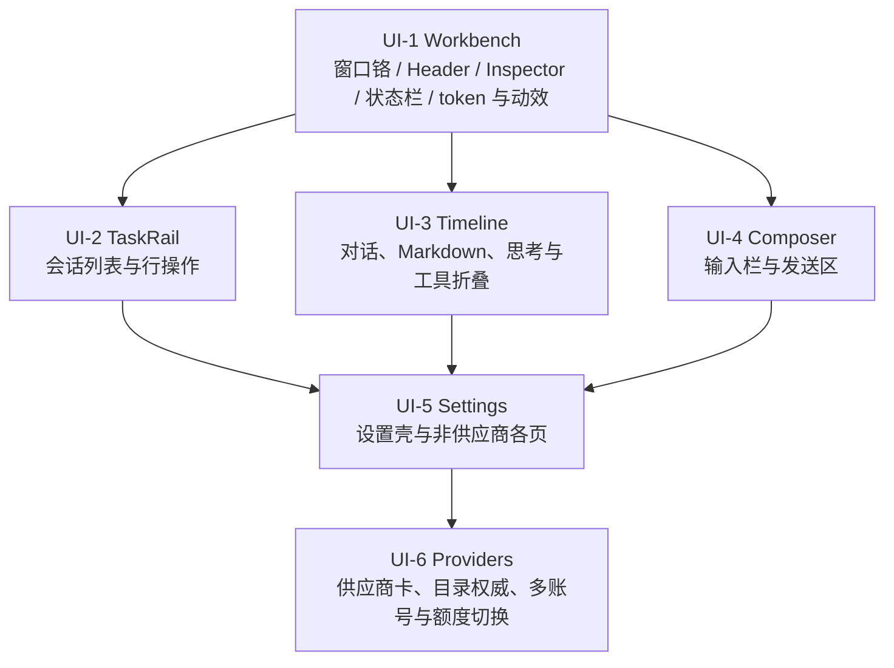

> 历史记录：2026-09-09 GUI 用户视角验收后移出活动路线图。本文保留实施与当时验证状态，不代表本次整体验收通过；新的待办见 [活动 ROADMAP](../ROADMAP.md)。

# Pawork 活动路线图：Desktop 模块重设计（UI）

> 基线日期：2026-09-07。状态：**UI-1 已实现、自动检查通过、用户人工视觉验收通过；未归档。UI-2 已实现、自动检查与代理真窗口检查通过，等待用户人工视觉验收；UI-3 已实现，定向自动检查、真实 Run 与重启回放检查通过，等待用户人工视觉验收，未归档；UI-4 已实现，自动检查与代理真窗口检查通过，等待用户人工视觉验收，未归档；UI-5 已实现，自动检查与代理真窗口检查通过，等待用户人工视觉验收，未归档；UI-6a 已实现，后端与 Desktop 定向检查通过，代理真窗口检查通过；UI-6b G1 已实现，定向自动检查、代理真窗口交互与真实 Run 检查通过，等待用户人工视觉验收；G2 已实现，定向自动检查、代理真窗口交互与真实 Run 检查通过，等待用户人工视觉验收，未归档**。来源：当日正式 Desktop 真窗口人工走查（#01–#05）。本文件是当前活动线的任务规划，**不是**源码或冻结契约的事实源。上一条 OPT-D / OPT-1～OPT-4 已关闭，全文与验收证据见 [review/roadmap-opt-2026-09-05.md](roadmap-opt-2026-09-05.md)。P0–P2 收尾证据仍见 [Desktop Spec §8](../spec/desktop.md#8-gui-收尾验收记录2026-09-05)；未排期候选仍见 [backlog.md](../spec/backlog.md)。

**做法**：每个任务重新设计**一个模块**的 UI 和交互，对照竞品与 [gui-design.md](../gui-design.md) 参照项目（Codex Desktop、OpenCode、Cursor Agent、Zed Agent Panel、DeepSeek Harness）拉到同一美观度；静态观感和动态交互一起做。OPT-D 旧签字稿保留为历史，**不再否决**本线新视觉。

**当前执行入口（2026-09-09）**：本线实现任务已全部落地，下一步是 UI-2～UI-6 的用户人工视觉验收（UI-6 包括 6a、6b G1/G2），收到具体反馈后修正对应模块。UI-1 已人工验收；其余任务不得把既有自动检查或代理真窗口检查记为用户验收。当前没有新的待启动实现项，G3～G7 与发布仍不在本线范围。最新候选及本次恢复情况见[续接核查](#续接核查2026-09-09)。

**共享约束**：

- UI-1 先定工作台 token / 动效节奏，后续模块沿用，不另起一套。
- 不造假额度、假模型、假搜索；无权威 QuotaSnapshot 就不画数字。
- 模型列表以供应商远端目录为权威，探测成功则替换静态条目；**禁止**按模型 id 硬编码隐藏。
- 不引入 Node/JS；不改四层 Desktop 架构；Desktop 仍只依赖 `pawork-client`。
- 凭证只进 auth backend；发布与全量门禁仍是 BK-RELEASE-01，未授权。

---

## 1. 走查总表

| ID | 模块 | 摘要 |
| --- | --- | --- |
| #01 | TaskRail | 鼠标悬停/选中会话行即显示重命名与归档，不必先点一次；归档图标更简洁 |
| #02 | Timeline + Composer | 对话区与输入栏观感远落后竞品；工具/思考默认铺开；Markdown 不成稿；Composer 贴边 |
| #03 | Workbench + Settings | 整个 GUI 静态和动态都过于原始；Settings 要按竞品等级重做 |
| #04 | Providers | DeepSeek 弹出已下线的 chat/reasoner；原因是静态目录与远端探测并集，不要硬编码过滤 |
| #05 | Providers | 同一供应商不能添加多个 OAuth 订阅或 API key；后续要能按剩余额度切换账号 |

---

## 2. 阶段

每个任务只重设计**一个模块**的 UI 与交互（静态观感 + 动态行为），不跨模块顺手改。

UI-2 / UI-3 / UI-4 写入集不重叠，可在 UI-1 token 稳定后并行。UI-5 用同一套 Settings 视觉语言。UI-6 在 UI-5 的供应商页上做产品与内核，不另做一页壳。

---

## 3. UI-1 — Workbench（主窗口壳）

对应 #03 的全局观感。模块：窗口铬、Workspace Header、Inspector、RunStatusBar、主题 token 与动效。

| 任务 | 内容 |
| --- | --- |
| UI-1 | 按竞品重做主窗口壳的静态布局和动态交互：留白、层级、焦点、悬停、折叠/展开过渡。定下本线共用色板、字阶、圆角、阴影、动效时长。Header / Inspector / 状态栏达到可与参照项目并排的完成度，后续模块不得各画一套。 |

不在本任务改会话行操作、时间线消息结构、Composer 或 Settings 内页。

---

## 4. UI-2 — TaskRail（会话列表）

对应 #01。模块：左栏范围筛选、分组、项目头、会话行。

| 任务 | 内容 |
| --- | --- |
| UI-2 | 重做会话行 UI 与交互：指针悬停或键盘选中时立即露出重命名/归档，不必先单击进入「已选中才出按钮」。归档图标改成更简洁的竞品形态。行高、时间戳、选中/悬停/当前会话三态一起设计，避免多一次操作。 |

改名/归档写口沿用 OPT-2；本任务不重做存储契约，只重做发现性与样式。

---

## 5. UI-3 — Timeline（对话时间线）

对应 #02 的聊天区。模块：消息气泡、Markdown、tool group、思考、Run 终态。

| 任务 | 内容 |
| --- | --- |
| UI-3 | 按有竞争力的 Agent 产品重做对话显示：重点（回复正文）与非重点（思考、命令、工具细节）分层；思考和执行命令默认自动折叠为摘要，可展开。修工具卡片叠字/透出、Markdown 原样星号、重复的空「Run completed」卡片、过密的作者行。 |

内核事件不减；改的是投影与渲染合同。

---

## 6. UI-4 — Composer（输入栏）

对应 #02 的输入栏。模块：草稿区、发送、模型选择、工作区 chip、上下文。

| 任务 | 内容 |
| --- | --- |
| UI-4 | 重做 Composer 的 UI 与交互：与窗口底边、侧栏、时间线脱开，不再贴边挤压。占位、模型、发送、上下文的层级和命中区按竞品对齐；空会话/无项目/全禁用模型等诚实空态保留。 |

---

## 7. UI-5 — Settings（设置壳与各页）

对应 #03 的设置页。模块：Settings Rail、全宽内容、Models 以外的各页（Network / Approvals / Tools / Terminal / Appearance / Advanced / About）。

| 任务 | 内容 |
| --- | --- |
| UI-5 | Settings 整页按竞品重做视觉和交互：导航选中、页内分区、控件（按钮/Switch/输入）与主窗口同一 token。本任务覆盖壳层和上述各页；供应商卡的多账号与目录权威放到 UI-6，避免同一文件双任务抢写。 |

已落盘的设置行为不重做；本任务是呈现与交互。

---

## 8. UI-6 — Providers（供应商、目录、多账号）

对应 #04、#05。模块：Models & providers 页的供应商卡、Manage models 弹层、Credentials、Usage。

| 任务 | 内容 | 内核 |
| --- | --- | --- |
| UI-6a | 重做供应商卡与模型弹层的 UI/交互；探测成功时该 provider **以供应商目录接口返回的 ID 集合为准**（替换静态条目，失败才 fallback），再按 adapter 支持的模态与协议筛选。公开目录不能当作凭证验证或账号权限证明。DeepSeek 因此只出现当次远端的 v4 三模型。禁止按 id 黑名单隐藏 chat/reasoner。 | models_overview / model_catalog 的并集改替换；静态 builtin_entries 只作探测失败回退；逐模型协议、能力和认证验证缺口见核查报告 |
| UI-6b | 同一供应商可按其支持的方式添加**多个** OAuth 订阅或 API key（同 kind 多账户，不再只是 key 与 OAuth 两类各一份）。可在账号间切换；有权威额度后再按剩余额度切换，无来源时不画假数字，但切换入口要先在。 | 将 backlog G1 账户池纳入本线；G2 QuotaSnapshot 有来源才接自动切换。Secret 仍只进 auth backend |

目录前置核查已完成（2026-09-08）：覆盖八条正式通道与现有 Anthropic / OpenAI-compatible 适配器。真实 GET 复现 DeepSeek 静态旧模型残留、Go 公开目录无法验证 key、Qwen 非聊天模型进入目录；逐供应商结果和参照项目依据见 [模型目录核查报告](model-catalog-audit-2026-09-08.md)。**UI-6a 已实现：远端 ID 替换、能力与协议筛选、Go 凭证验证及供应商页重设计；后端与 Desktop 定向门禁通过，代理真窗口检查通过，等待用户人工视觉验收。UI-6b [实施方案](ui6b-accounts-plan-2026-09-08.md)已获用户确认，GUI 1.15 / ADR-059 已登记，G1 已实现，定向自动检查与代理真窗口检查通过，等待用户人工视觉验收；G2 [实施方案](ui6b-quota-plan-2026-09-09.md)已获用户确认，GUI 1.16 / ADR-060 已实现，定向自动检查、代理真窗口与真实 Run 检查通过，等待用户人工视觉验收。**

---

## 9. 明确不做（本线）

- 不一次做完 G3–G6（缓存亲和、子 Agent 绑定、缓存策略、账户导入）和 G7 网关。
- 不为填图造假额度或伪造模型目录。
- 不把全局代理/审批写进仓库 `.pawork/config.toml`。
- 不覆盖 P0–P2 与 OPT-D 历史设计资产；本线新图另存 `design/`。
- 发布、全量门禁、三平台安装器仍是 [BK-RELEASE-01](../spec/backlog.md)。

---

## 10. 契约与文档同步

实现触及下列项时，**同批**更新对应文档，golden 先于 wire 改动：

- GUI 命令/查询/config schema → ADR + [architecture.md](../architecture.md) §3.2 + [contracts.md](../spec/contracts.md) + 包级 Spec
- 目录权威、多账号、额度切换 → [settings.md](../spec/settings.md)（新 ADR）
- 主窗口信息架构与模块视觉 → [gui-design.md](../gui-design.md) + [design/README.md](../../design/README.md)
- 用户可见能力 → [capabilities.md](../spec/capabilities.md)

---

## 11. 状态

| 任务 | 状态 |
| --- | --- |
| UI-1 Workbench | 已实现；Desktop 定向自动检查 213/213 通过；代理真窗口检查通过；用户人工视觉验收通过（2026-09-07）；未归档 |
| UI-2 TaskRail | 已实现；Desktop 自动检查 214/214 通过；代理真窗口检查通过；等待用户人工视觉验收；未归档 |
| UI-3 Timeline | 已实现：Markdown、工具与思考折叠、终态呈现及 OpenCode Go 会话请求头（ADR-057）；定向自动检查、真实 Run 与重启回放检查通过，等待用户人工视觉验收；未归档 |
| UI-4 Composer | 已实现：居中输入卡片、模型 / 发送与外部项目 / 上下文分层；自动检查与代理真窗口检查通过，等待用户人工视觉验收；未归档 |
| UI-5 Settings | 已实现：设置导航与七个非供应商页重设计，AX 使用实际布局；自动检查与代理真窗口检查通过，等待用户人工视觉验收；未归档 |
| UI-6 Providers | UI-6a 已实现；后端与 Desktop 定向门禁通过，代理真窗口检查通过，等待用户人工视觉验收；UI-6b G1 已实现，定向自动检查与代理真窗口检查通过，等待用户人工视觉验收；G2 [实施方案](ui6b-quota-plan-2026-09-09.md)已获用户确认，GUI 1.16 / ADR-060 已实现，定向自动检查、代理真窗口与真实 Run 检查通过，等待用户人工视觉验收；未归档；见 [多账号方案](ui6b-accounts-plan-2026-09-08.md) 与 [核查报告](model-catalog-audit-2026-09-08.md) |

走查原文与截图在本机走查笔记中，不检入仓库。

### UI-1 本批证据（2026-09-07）

- **已实现**：共享中性深色 token、紧凑 Header、Inspector 两级页签、180ms 连续开合、30px 分组运行状态栏。过渡期 AX 与可见宽度一致，隐藏动作不发布；1288px / 1320px 展开下限保证 Workspace ≥560px。规格见 [GUI 设计](../gui-design.md#ui-1-工作台视觉更新2026-09-07) 与 [设计索引](../../design/README.md#ui-1-当前工作台规格2026-09-07)。
- **自动检查通过**：`cargo test -p pawork-desktop --offline --bins --features gpui/runtime_shaders`，213 passed / 0 failed；`cargo build -p pawork-desktop --offline --bins --features gpui/runtime_shaders` 成功。`git diff --check`、新增 SVG XML 与本批文档本地链接检查通过。未运行全量 workspace 门禁。
- **本机构建说明**：`target/debug/deps` 有 478,508 个历史产物，目录遍历约 74s，旧路径宏库加载也长时间等待。本批使用临时 `RUSTC_WRAPPER=/tmp/pawork-ui1-rustc-wrapper.py` 将 Desktop 的依赖搜索指向 `target/ui1-rustc-deps`（复用现有库；宏库复制到小目录），不修改 Cargo 配置或依赖。单个 Desktop 增量目录移到 `target/ui1-cache-backup` 保留，未执行清理命令。实际日志：`/tmp/pawork-ui1-tests.log`、`/tmp/pawork-ui1-build.log`。
- **代理真窗口检查通过**：解锁后，以独立候选 bundle `target/pawork-desktop-runtime/Pawork-UI1.app` 连接 `/tmp/pawork-opt4-review/data/pawork-gui-opt4-review.sock`；二进制 SHA-256 与本次 build 相同，未覆盖原运行 bundle。已检查 Inspector 开合 / 连续切换、Changes / Terminal / Resources 页签、Activity → Changes 与焦点、宽窗和 1080×720 内容下限、100% / 125% / 150% 字号；窄窗自动收起，恢复宽窗后保留所选页签，Header 与状态栏保持可见。最后恢复 100% 字号。
- **窗口外证据**：候选 `--probe --socket /tmp/pawork-opt4-review/data/pawork-gui-opt4-review.sock` 成功，`sessions=1, models=13`（`/tmp/pawork-ui1-probe.log`）；进程参数确认测试 Host 为 `opencode-go / glm-5.3-flash`。创建了一个未绑定项目的空测试会话，未发起 Run；Changes 如实显示 `no workspace`，Resources 显示 0 servers，状态栏保持 unavailable / idle。本批未验证真实 Run、文件差异或终端执行。
- **用户人工视觉验收通过**：2026-09-07 用户确认「UI-1 视觉通过」。验收范围是工作台壳观感、Inspector 开合 / 反向过渡 / 页签，以及 100% / 125% / 150% 下 Header 与状态栏仍可见；会话行、时间线、Composer、Settings 不在本批。截图不检入仓库。
- **状态边界**：已实现、自动检查通过、用户人工视觉验收通过；UI-1 未归档（未做发布级收口）。本记录为 UI-1 收口时状态，当时 UI-2～UI-6 未开始；UI-1 已推送到 origin/main（`0ae22304`），未发布。

### UI-2 本批证据（2026-09-07）

- **已实现**：非当前会话在指针悬停或键盘聚焦时立即露出改名 / 归档，焦点进入动作后继续保留；当前会话始终显示。时间戳与两个 32×32px 动作共用 64px 固定槽，标题不随按钮出现而挤动。44px 行高、14px 标题、12px 日期 / 时间、14px 项目头，沿用 UI-1 色板与 6px 控件圆角；归档使用 16px 单色盒形图标。改名 / 归档点击停止传播，不误开会话。规格见 [GUI 设计](../gui-design.md#ui-2-会话行更新2026-09-07) 和 [状态图](../../design/ui2-taskrail-states.svg)。
- **自动检查通过**：`cargo test -p pawork-desktop --offline --bins --features gpui/runtime_shaders`，214 passed / 0 failed；新增一个真实 GPUI hover / click / Tab 回归，覆盖非当前会话直接改名、行宽稳定、取消后焦点、断线禁写与 AX 可见性。`cargo build -p pawork-desktop --offline --bins --features gpui/runtime_shaders` 成功。`git diff --check`、规格 SVG XML 与文档本地文件链接检查通过。日志：`/tmp/pawork-ui2-tests.log`、`/tmp/pawork-ui2-build.log`。
- **本机缓存复用**：继续使用 UI-1 的 `RUSTC_WRAPPER=/tmp/pawork-ui1-rustc-wrapper.py`。测试运行增加临时 `CARGO_TARGET_AARCH64_APPLE_DARWIN_RUNNER=/tmp/pawork-ui2-test-runner.py`，仅将已编译测试二进制复制到 `/tmp` 执行，绕过巨大 `target/debug/deps` 目录带来的加载等待；不改 Cargo 配置、依赖或测试逻辑。
- **代理真窗口检查通过**：独立 `target/pawork-desktop-runtime/Pawork-UI2.app` 连接既有 `opt4-review` 测试 Host（当次参数 `opencode-go / glm-5.3-flash`），未覆盖运行中的原 bundle。候选与 build SHA-256 均为 `efd94d9ff89247bccc36308c0803ba4c447748d9513c1f1b29a64fad670b200b`。已检查悬停非当前会话、Tab 聚焦后 Enter 改名、Esc 取消、长标题、100% / 125% / 150% 字号及窄窗布局；直接归档非当前会话后当前会话未切换。已恢复宽窗与 100% 字号，保留候选窗口供用户验收。
- **窗口外事实**：只读测试 Host `session.db` 确认 `ses-1788785563281-2` 长标题已落盘且 `archived=1`，`ses-1788785605178-3` 标题为 `UI-2 视觉验收 · 会话列表与行操作`、`archived=0`；记录 `/tmp/pawork-ui2-persistence.json`。候选 `--probe` 成功，`sessions=2, models=13`（`/tmp/pawork-ui2-probe.log`）。本批只操作两个新建测试会话，未发起 Run。
- **审查**：确定性检查后只读代码审查无可行动发现，检查了可见性、点击隔离、Tab、断线 gate 与共享组件默认行为。此前一次 GLM 审查因任务传输格式不兼容在执行前失败，改用原生审查者完成。提交前复查项目头计数命中区、悬停可见性与规格链接，无阻塞问题。
- **用户视觉反馈修正**：项目头计数移入同一交互区域，悬停背景与键盘焦点边框完整覆盖右侧计数；同步 AX 点击区域。有项目的独立「+」按钮保持独立。修正后上述 Desktop 测试仍为 214 passed / 0 failed，构建成功（`/tmp/pawork-ui2-header-tests.log`、`/tmp/pawork-ui2-header-build.log`）。独立 `target/pawork-desktop-runtime/Pawork-UI2-header.app` 真窗口确认完整高亮、点击计数折叠、Enter 展开及完整焦点边框；候选与 build SHA-256 均为 `000653aac319d4c28cd51c14c97f08c5001f0a400e6a415a0582e0f721b38620`，保留修正窗口供用户验收。
- **状态边界**：已实现、自动检查通过、代理真窗口检查通过；**等待用户人工视觉验收，未归档**。本提交收录实现与规格，未推送、未发布；未运行全量 workspace 门禁。UI-3～UI-6 未开始。

### UI-3 主体实现证据（2026-09-08，思考链路实施前历史）

- **主体已实现**：16px Markdown 正文、880px 居中阅读列、用户浅底卡片与低强调作者行、两侧至少各留 28px；工具默认折叠、展开后完整输出换行；空助手消息不画作者行，相邻工具可跨空消息归组；展开时保留当前视口，旧 RunPhase 由同 Run 后继状态吸收；成功无 Changes 只保留完成页脚与 Fork，失败/取消与 Review 入口继续保留。详见 [GUI 设计 UI-3](../gui-design.md#ui-3-时间线更新2026-09-08进行中)。未增加依赖，未改持久事件或 wire。
- **自动检查通过**：`cargo test -p pawork-desktop --offline --bins --features gpui/runtime_shaders`，215 passed / 0 failed；`cargo build -p pawork-desktop --offline --bins --features gpui/runtime_shaders` 成功。复用本机临时依赖 wrapper 与测试 runner，不修改 Cargo 配置。日志 `/tmp/pawork-ui3-tests.log`、`/tmp/pawork-ui3-build.log`。Markdown 主路径 / Unicode 流式边界替代旧段落切分测试，现有投影与 AX 几何回归覆盖空消息、旧相位收敛、默认折叠与展开高度。
- **审查**：确定性检查后一次只读审查发现单行三反引号可能吞内容，已修复并纳入现有 streaming 回归。GLM 派发先因加密任务传输不兼容在执行前失败，改用原生代理完成 Markdown 独立实现及收口审查。
- **真实 Provider 失败**：旧 `opt4-review` Host 发送前报告缺少 `opencode-go` 凭证；新建 `ui3-review` 隔离 Host 复用本机已有认证、当次参数固定 `opencode-go / glm-5.3-flash`，Run `run-gui-1788801731466-1` 已进入执行但 Provider 返回 `invalid_request / HTTP 400`。SQLite 中保存 run_started、message_committed、context_prepared、provider_request_started、run_failed 五项事件，与窗口 Run failed 一致；本次没有成功的 assistant/tool 流，不换模型冒充通过。未改持久默认或认证配置。
- **历史真窗口检查**：从原 `~/.pawork/desktop/session.db` 只读备份到独立 `ui3-history` 实例，打开真实历史会话 `ses-1788535764261-1`；未修改源数据库、未在历史副本发起 Run。已检查 Markdown 粗体、列表、行内代码、默认工具摘要、鼠标/Return 折叠、展开完整命令输出与视口保持、空作者行清理及单一完成页脚；100% / 125% / 150% 字号和 1080×720 窄窗下文本换行、工具行与 Header/状态栏均可见，已恢复 100%。历史数据仅证明投影/渲染行为，不计作本次 Provider 成功；副本没有原 artifacts 数据，未据此宣称本次 Changes/Review 验证通过。截图不检入仓库。
- **用户反馈后修正**：初版用户视觉验收未通过，截图指出时间线偏在左侧窄列、正文密集、工具底板抢眼。修正版改为最大 880px 居中阅读列；16px / 26px 正文、12px 作者与段落间距、32px 消息间距，用户消息使用 20px 内边距浅底卡片。已确认 GPUI list 把每个条目按 `layout_as_root` 的高度累计，外 margin 不计入条目高度；改为内部 padding，真实窗口间距才兑现。工具摘要改为 36px 无底色行，去掉首字母图标，展开保留细边线与完整输出。
- **修正版验证**：同一 Desktop 测试命令再次 215 passed / 0 failed，构建成功；日志 `/tmp/pawork-ui3-redesign-tests.log`、`/tmp/pawork-ui3-redesign-build.log`。审查发现新增 bottom padding 会漏报底部可见 AX 条目，已把贴底补齐高度与实际可见边界分开，并在修正后复跑上述检查。未新增测试框架或依赖。
- **修正版真窗口**：同一真实历史副本中检查宽窗居中、1080×720 窄窗、100% / 125% / 150% 正文与用户卡片换行、工具点击展开 / Return 收起、展开时视口保留、用户卡片菜单 AX 命中与回到底部。最终恢复 100% 与工具默认收起。首次候选连接时模型探测曾导致设置请求超时，后续读取恢复，最终候选连接及模型目录可用；本次只做展示交互，未新发起 Run。截图保存在 `/tmp/pawork-ui3-design-review/`，未检入仓库。
- **当时候选**：`target/pawork-desktop-runtime/Pawork-UI3-design-final.app`，连接 `ui3-history`；候选与 build SHA-256 均为 `e10b655db768cf630420bd502f4e869c20c0f3927110d26b27fb14b8ce16e2b8`。该候选现已由文末的思考链路最终候选替代。
- **当时状态**：UI-3 尚缺思考链路，未人工验收；主体实现已提交；未发布，未运行全量 workspace 门禁。当前状态见文末。

#### UI-3 思考链路方案（2026-09-08 已确认实施）

实施前事实：domain 已持久化 `AssistantThinkingDelta`，GUI 已定义 `AppEvent::ThinkingDelta`，但 `gui_host/events.rs` 未转发它、共享 reducer 未消费它，历史 `TimelineItemKind` 也无独立思考条目；`join_text` 只提取正文。因此只改 Desktop 无法完成可重放的思考折叠。

已确认方案（2026-09-08 源码复核后修订）：复用已有 live `ThinkingDelta`；历史 `TimelineItemKind` 增加 `ThinkingDelta`，`TimelineItem` 增加可选 `message_id` / `thinking_text`。同一 `MessageCommitted` 的正文和思考仍装在一条 `AssistantMessage` 中，由共享 reducer 投影为独立显示条目；不把同一事件拆成两条共用 sequence 的 wire 条目，以免被既有按 sequence 去重吞掉其中一条。历史 delta 与 committed 思考按 run/message 锚点合并，committed 全文替换 delta，分页与 live 交错不重复。Desktop 默认显示可展开的“思考”摘要。只展示可见 thinking 文本，redacted 内容不还原，不传递 reasoning signature / encrypted content。实现前补 golden 验证重放一致性；同步协议版本/typegen、旧协商版本的历史响应降级、架构与相关包 Spec。

此项及下述 Provider 契约变更已获用户「确认实施」，决策登记在 [ADR-057](../spec/desktop.md#adr-057ui-3-思考投影与会话身份2026-09-08)。以下诊断保留为实施前证据，本批实现和验收见文末。

#### UI-3 验收阻塞复核（2026-09-08，实施前历史）

- **已复现**：当前 `target/debug/pawork` 以隔离实例 `ui3-followup`、当次 `opencode-go / glm-5.3-flash`、只读审批发起最小 Run，仍为 `invalid_request / HTTP 400`。会话 `ses-1788824300774-1`、Run `run-gui-1788824300783-1`，落盘只有 started / user committed / context prepared / provider request / failed；日志 `/tmp/pawork-ui3-followup-run.jsonl`。未改持久默认、代理或认证配置。
- **已定位**：使用同一认证、已配置代理、`User-Agent: pawork` 和指定模型请求官方 Chat Completions 端点，上游明确返回 `MissingSessionID`，要求 `x-opencode-session`。这与 [OpenCode Go 官方接入要求](https://opencode.ai/docs/go/#where-can-i-use-it) 一致：每个 conversation 应携带稳定的 session ID。脱敏诊断证据 `/tmp/pawork-ui3-configured-proxy.json`。首次未采用 Pawork 已配置代理的探测为 403，不能用来判断 Pawork 原 400 的原因。
- **对照请求成功**：保持上述 400 请求的 body、认证、代理、User-Agent、模型完全相同，只增加 `x-opencode-session: ses-1788824300774-1`，得到 HTTP 200、正文 `UI3_OK`、274 个字符的可见思考增量、`finish_reason=stop` 与 `[DONE]`；证据 `/tmp/pawork-ui3-session-header-ab.json`。这验证了会话头缺失的诊断，不代表产品接线已修复。
- **修复准备**：`CanonicalModelRequest` 当前只有 request_id / trace_id，没有 session_id；trace_id 不应改作会话身份，首条消息 id 也不能在压缩后保证稳定。拟追加可选的 canonical `session_id`，由真实会话入口传入，主请求、工具续轮、压缩与自动命名保留同一身份；仅 OpenCode Go 通道将其映射到 `x-opencode-session`，Chat / Responses 两条传输路径都覆盖，Engine 不判断 Provider 名。此项也触及 [架构 §3.2](../architecture.md#32-冻结契约激活即采用完整形状golden-先于实现改动) 的 Provider 契约，须随本次方案确认后实施，golden 先行。
- **状态边界**：本轮只完成源码定位、诊断与方案修订；尚未修改生产代码或冻结契约，既有 Desktop 改动完整保留。外部诊断请求不计作 Pawork 真窗口 Run 验收通过。思考投影、Provider 会话头接线和用户视觉验收仍未完成。

#### UI-3 思考链路与会话头实施（2026-09-08）

- **已实现**：按 ADR-057 将历史、live 与 committed 可见思考接入共享 reducer；同一持久 sequence 保持一条 wire 条目，GUI API 1.14，对旧 minor 过滤新内容且保留分页游标。Desktop 默认折叠「思考」，展开状态以 run/message 锚点保持，鼠标、键盘、AX 和测高同源。
- **已实现**：canonical 请求增加可选 session_id；真实会话入口、工具续轮、自动/手动压缩和自动命名保留身份，仅 OpenCode Go Chat / Responses 写入 x-opencode-session。非法头值在发网前脱敏拒绝；不改持久默认、认证或代理配置。
- **自动验证**：`cargo test -p pawork-domain -p pawork-engine -p pawork-providers -p pawork-app -p pawork-testkit -p pawork-protocol --offline --lib --tests`（启用 typegen 与全部首发 Provider 测试 feature），755 passed / 0 failed / 1 既有 ignored，日志 `/tmp/pawork-ui3-core-tests-final.log`。typegen 与 golden 检查通过；旧 fork fixture 的分支 committed 身份修正为共享增量的 m-1，显示期望不变。真窗口发现思考被 committed 推到工具之后，修正为保留首次增量位置；迟到增量只前移已有行，不追加全文或恢复隐藏内容。随后 Protocol / App 定向复验 409 passed，投影 golden 8 passed，日志分别为 `/tmp/pawork-ui3-thinking-order-tests.log`、`/tmp/pawork-ui3-thinking-order-golden.log`。Desktop 命令 `cargo test -p pawork-desktop --offline --bins --features gpui/runtime_shaders` 最终复验 215 passed，日志 `/tmp/pawork-ui3-thinking-desktop-final.log`；以上均 0 failed，独立只读审查无未解决问题。
- **构建与真窗口**：`cargo build -p pawork -p pawork-desktop --offline --bins --features gpui/runtime_shaders` 通过，日志 `/tmp/pawork-ui3-thinking-final-build.log`。真实窗口以当次 `opencode-go / glm-5.3-flash` 完成会话 `ses-1788830262399-1` / Run `run-gui-1788830279780-1`：两次 Provider 请求、一次成功的 `read_file`、265 个思考增量、两段可见思考及 Markdown 正文，终态 `run_completed`，输出包含 `UI3_THINKING_OK`；SQLite 与验收文件 SHA-256 交叉验证，文件未修改，脱敏证据 `/tmp/pawork-ui3-thinking-evidence.json`。鼠标和 Enter / Space 可展开、收起思考，收起时 AX 不含正文；最终候选重开同一持久化会话，像素与 AX 均确认「思考 → 工具 → 思考 → 正文」、默认折叠、全文展开与无重复条目。
- **当前候选**：`target/pawork-desktop-runtime/Pawork-UI3-thinking-final.app` 已打开，连接隔离实例 `ui3-thinking`；候选与最终 build SHA-256 均为 `e251459274b16cd42f7d3c78498b3c4ba0aff2f61cdbd2054282563a2e168677`。复用默认 `target/` 缓存；因历史 deps 目录枚举缓慢，本机验证使用 `/tmp` rustc wrapper / test runner 缩小依赖检索与可执行文件启动目录，未修改仓库构建配置。
- **状态边界**：等待用户人工视觉验收；未归档、未提交本批、未推送、未发布；全量 workspace 门禁未运行。

### UI-4 本批证据（2026-09-08）

- **已实现**：输入卡片与 UI-3 的 880px 阅读列居中对齐，两侧至少 28px、顶部 16px、底部 24px 留白；卡片内草稿与模型 / 发送分层，项目 / 上下文位于卡片外。模型与发送使用 36px 命中区，卡片 110–220px，长草稿内部滚动；AX 与可见操作区同源。沿用 UI-1 token 与现有发送 / 草稿 / 模型 gate，不改业务依赖或 wire。规格见 [GUI 设计 UI-4](../gui-design.md#ui-4-输入栏更新2026-09-08)。
- **自动检查通过**：`cargo test -p pawork-desktop --offline --bins --features gpui/runtime_shaders`，216 passed / 0 failed；`cargo build -p pawork-desktop --offline --bins --features gpui/runtime_shaders` 成功。新增一个实际 GPUI 布局回归，覆盖宽窄窗、100% / 125% / 150% 字号、80 行草稿高度上限、模型 / 发送与 AX 坐标一致、离线禁发；现有草稿、IME、发送与空模型测试通过。日志 `/tmp/pawork-ui4-tests-final.log`、`/tmp/pawork-ui4-build-final.log`。`git diff --check`、本批 Rust 格式与文档本地文件链接检查通过；未运行全量 workspace 门禁。
- **本机缓存复用**：继续使用默认 `target/`；本批 `RUSTC_WRAPPER=/tmp/pawork-ui4-rustc-wrapper.py` 指向小依赖目录 `target/ui4-rustc-deps`（rlib / rmeta 链接、135 个宏动态库实际复制），测试另用 `CARGO_TARGET_AARCH64_APPLE_DARWIN_RUNNER=/tmp/pawork-ui3-test-runner.py` 从 `/tmp` 启动已编译二进制，绕过历史 deps 大目录的加载等待；不修改 Cargo 配置或依赖，未执行清理命令。
- **审查**：确定性检查后独立只读审查发现无项目 chip 的可见文字与 AX 不一致，已统一使用 No project 分支并复跑上述测试与构建；无未解决发现。
- **代理真窗口检查通过**：独立候选连接既有 `ui3-thinking` 测试 Host（当次参数固定 `opencode-go / glm-5.3-flash`）。检查模型菜单向上展开 / Esc 关闭、空输入禁发、点击发送、Enter 发送、运行中同槽取消、Shift+Enter 与多行粘贴、会话切换恢复草稿、80 行草稿内部滚动、100% / 125% / 150% 字号和 1080×720 窄窗；项目与 Context 行未覆盖操作区。最终恢复宽窗、100% 字号与空草稿，保留候选供用户验收。系统 IME 组合输入、连接中断与全禁用模型本批未另做真窗口操作；相关既有自动回归通过。截图不检入仓库。
- **窗口外事实**：仅在新建会话 `ses-1788835050699-2`（`UI-4 · 输入栏验收`，无项目）发起两轮无工具请求。SQLite 确认 `run-gui-1788835159163-2` 为 completed，assistant committed 正文为 `UI4_SEND_OK`；`run-gui-1788835192573-3` 为 cancelled，均与窗口终态一致。只读证据 `/tmp/pawork-ui4-evidence.json`；未改持久默认、认证或代理配置。
- **当前候选**：`target/pawork-desktop-runtime/Pawork-UI4-final.app` 已打开，候选与最终 build SHA-256 均为 `d9df3f6f0be7def2ab431aabcd91ec0d0594c7873e1b7ed669aaba00e2791b7a`；使用独立 bundle，未覆盖原运行 bundle。
- **状态边界**：已实现、自动检查通过、代理真窗口检查通过；**等待用户人工视觉验收，未归档**。未提交、未推送、未发布；全量 workspace 门禁未运行。UI-5～UI-6 实现未开始。

### UI-5 本批证据（2026-09-08）

- **已实现**：Settings 导航、Network / Approvals / Tools / Terminal / Appearance / Advanced / About 的分区与控件重设计；七页 AX 改读实际布局并裁剪离屏项。保留 UI-1 token 与现有设置行为、Host gate、持久化和 wire；规格见 [GUI 设计 UI-5](../gui-design.md#ui-5-设置更新2026-09-08)。供应商卡、多账号与目录权威留给 UI-6。
- **自动检查通过**：`cargo test -p pawork-desktop --offline --bins --features gpui/runtime_shaders`，217 passed / 0 failed；`cargo build -p pawork-desktop --offline --bins --features gpui/runtime_shaders` 成功。新增一个真实 GPUI 回归，覆盖 100% / 125% / 150%、输入实际命中与 AX 对齐、网络表单不重叠且用满行宽、滚动离屏裁剪及断线禁写；其余沿用既有设置 gate / 本地偏好回归。`git diff --check`、Rust 格式及本批文档本地链接检查通过。日志：`/tmp/pawork-ui5/tests.log`、`/tmp/pawork-ui5/build.log`。
- **本机缓存复用**：沿用 `RUSTC_WRAPPER=/tmp/pawork-ui4-rustc-wrapper.py` 和测试 `CARGO_TARGET_AARCH64_APPLE_DARWIN_RUNNER=/tmp/pawork-ui3-test-runner.py`，复用现有依赖并在小目录运行测试二进制；未改 Cargo 配置、依赖或 feature，未清理 target。
- **代理真窗口检查通过**：七页内容、1080×720 窄窗与宽窗、三档字号、English / 中文即时切换、页内滚动、网络输入到 Save 的 Tab 焦点、Advanced → About 的 Tab / Enter 导航、返回工作台。原生走查发现并修复网络表单收缩 / 重叠，最终中英文 150% 窄窗均恢复全宽；Terminal Save、Approvals 信任区和 Advanced 长路径可滚动到达。Tools 如实显示未配置 MCP 的空态。最终恢复宽窗、English / 100%，截图不检入仓库。
- **窗口外事实**：独立 `target/pawork-desktop-runtime/Pawork-UI5-review.app` 连接既有 `ui3-thinking` Host（当次参数 `opencode-go / glm-5.3-flash`）。按 `CFBundleExecutable` 核对实际入口，候选与最终 build SHA-256 均为 `ce58a3cf6344f9cf0ad11b18f5b7cbbcd9cc6eae7237320cc317dca9fa3d3afe`；候选 `--probe` 成功。偏好文件确认 `language=en, text_scale=100`，证据见 `/tmp/pawork-ui5/final-evidence.json` 与 `/tmp/pawork-ui5/probe.log`。本批没有发起 Run，也未操作 Host 代理、审批、信任、凭证或 MCP 写入口；这些写入行为沿用既有实现与自动回归。
- **审查**：确定性检查后独立只读审查完成；重连按钮的 AX 全行命中区已收敛至按钮，最终分区与输入布局修正后无未解决发现。
- **状态边界**：已实现、自动检查通过、代理真窗口检查通过；**等待用户人工视觉验收，未归档**。本提交收录实现与规格，未推送、未发布；全量 workspace 门禁未运行；UI-6 实现未开始。

### UI-6a 本批证据（2026-09-08）

- **已实现**：供应商卡与 Manage models 重设计，默认角色说明 / 选择器分列、凭证输入 / 动作分行，页面与弹层 AX 读取实际布局并裁剪离屏项。成功目录替换该 provider 的静态 / 配置 ID，合法空列表同样权威；失败才回退，回退同样过滤不可运行协议。Go / Qwen 目录与 stream 共用官方逐模型协议声明；Kimi / xAI / ChatGPT 消费远端能力字段，未知窗口 / 输出如实保留 unknown。Go 保存 key 改用认证 `/usage`，失败保留旧 key。设计见 [GUI 设计 UI-6a](../gui-design.md#ui-6a-供应商更新2026-09-08)，语义见 [ADR-058](../spec/settings.md#adr-058ui-6a-目录权威与凭证验证2026-09-08)。GUI wire、domain、配置 schema 与业务依赖不变。
- **后端定向检查通过**：`cargo test -p pawork-app -p pawork-providers --offline --lib --tests`，448 passed / 0 failed；复用已有目录、切换与 adapter 回归，增加 Go 验证保旧的必要安全回归。覆盖远端替换旧 ID、合法空目录、错误回退、不可运行协议拒选、Responses metadata 与 stream 同源、畸形响应拒绝及凭证脱敏。只读审查发现的配置回退协议漏洞已修复并复验。日志 `/tmp/pawork-ui6-core-tests.log`。
- **真实目录**：新 Host 二进制运行 `pawork --instance ui6a-catalog --provider opencode-go --model glm-5.3-flash --json models`，DeepSeek 返回当次 v4 三模型，旧 `deepseek-chat/reasoner` 无残留；Go 20、Qwen 8、GLM 10、Kimi 4。xAI 探测失败，如实回退 4 个静态项，不记作远端成功。目录与脱敏证据 `/tmp/pawork-ui6a-models.json`、`/tmp/pawork-ui6a-evidence.json`；模型数是当次观测，不是硬编码验收名单。
- **Desktop 定向检查通过**：`cargo test -p pawork-desktop --offline --bins --features gpui/runtime_shaders`，217 passed / 0 failed；`cargo build -p pawork-desktop --offline --bin pawork-desktop --features gpui/runtime_shaders` 通过。四个既有 Provider AX 测试改用实测框，覆盖脱敏、gate、角色过滤 / 清除、滚动 / 裁剪与三档字号；角色长目录补齐打开定位与方向键跟随，Context 的远端 0 哨兵显示 unavailable。日志 `/tmp/pawork-ui6-desktop-tests.log`、`/tmp/pawork-ui6-desktop-build.log`。后端构建命令 `cargo build -p pawork --offline --bin pawork` 通过，日志 `/tmp/pawork-ui6-host-build.log`。本机沿用 `/tmp` rustc wrapper / test runner 复用 `target/` 与小依赖索引，未改 Cargo 配置或清理缓存。
- **代理真窗口检查**：供应商卡、Go / DeepSeek 展开详情、真实目录弹层、20 模型滚动与离屏 AX、Usage 无数字空态，以及 1440×1024 宽窗的 100% / 125% / 150% 与 1080×720 窄窗 150% 布局。最终候选已复验角色菜单打开时自动滚入当前模型，↑/↓ 跟随高亮、Esc 恢复触发器焦点，默认值未改变；未知 context window 显示 unavailable。实际 API key / OAuth 更新、代理与启用开关未在本机凭证上写入，写入语义由定向回归覆盖。截图不检入仓库。
- **窗口外事实**：隔离 Host `ui6a-review` 固定使用当次 `opencode-go / glm-5.3-flash`、read-only 审批。真窗口会话 `ses-1788853858278-1` / Run `run-gui-1788853881041-1` 返回 `UI6_CATALOG_OK`，SQLite 终态 `run_completed`、assistant committed 正文一致，0 工具调用；证据 `/tmp/pawork-ui6a-evidence.json`。外观偏好恢复 English / 100%，未改持久模型默认或认证。
- **最终候选**：`target/pawork-desktop-runtime/Pawork-UI6a-final.app` 已打开并连接隔离 Host；最终二进制 / bundle SHA-256 一致：`7f36f4e624ec8098bc57bef2a59b317bc6556848234902d556af23b62273f415`。使用独立 bundle，没有覆盖运行中的正式应用；保留宽窗、English / 100% 供用户视觉验收。`git diff --check` 与本批文档相对文件链接检查通过。
- **状态边界**：UI-6b 同 kind 多账号和额度切换未开始；Anthropic 目录、分页、Kimi 视频模态仍为现有边界。等待用户人工视觉验收，未归档、未推送、未发布；全量 workspace 门禁未运行。

### UI-6b G1 本批证据（2026-09-08）

- **已实现**：按用户「确认实施」与 [ADR-059](../spec/settings.md#adr-059ui-6b-命名账号与持久选择2026-09-08) 落地同供应商命名 API key/OAuth 账号、逐账号删除、持久选择与下一请求生效。旧 default 原槽兼容，索引与 secret 原子提交；OAuth 迟到刷新不能复活删除账号或覆盖新登录。GUI API 1.15、四个新命令、旧 minor 字段降级与 typegen 同批更新；Desktop 按稳定 ID 绑定名称、动作与 AX。没有新增包或生产依赖。
- **后端定向检查通过**：`cargo test -p pawork-auth -p pawork-protocol -p pawork-app --offline --lib --tests --features pawork-protocol/typegen -- --test-threads=1`，489 passed / 0 failed / 1 既有 ignored（子进程辅助用例），日志 `/tmp/pawork-ui6b-host-final.log`。覆盖同 kind 共存、重开选择、并发 writer、事务回滚、删除/重新登录与刷新竞态、脱敏以及协议 golden/typegen。首次并行测试出现既有 native file lock 子进程释放断言失败，串行复验通过，未据此改变锁语义。
- **请求与删除回归**：扩展已有 `auth_set_api_key_verifies_replaces_and_masks_end_to_end`：两把不同测试 key 验证后共存，持当前 Run 的 Core 读锁仍可添加/选择，选中账号拒删；下一 Run 的真实 mock HTTP POST 命中所选 Bearer，ledger/DB 不含明文。窗口发现删除未选中账号会短暂显示整个供应商断开，已改为继续发布剩余账号的连接状态；上述用例最终复验通过，日志 `/tmp/pawork-ui6b-remove-regression.log`。
- **Desktop 定向检查通过**：`cargo test -p pawork-desktop --offline --bins --features gpui/runtime_shaders`，219 passed / 0 failed，日志 `/tmp/pawork-ui6b-desktop-final.log`。扩展既有 Providers 回归，覆盖旧 Host gate、名称必填、selected 删除保护、确认对象重排稳定，以及 1080×720 三档字号的实际布局/滚动。保留按钮收紧后单独复跑 `settings_provider_expanded_card_ax_pins_credentials_and_usage` 通过，日志 `/tmp/pawork-ui6b-keep-regression.log`。
- **构建与本机缓存**：`cargo build -p pawork -p pawork-desktop --offline --bins --features gpui/runtime_shaders` 通过（`/tmp/pawork-ui6b-build-final.log`）；最后一处 Desktop 按钮命中框调整后再构建该应用通过（`/tmp/pawork-ui6b-keep-build.log`）。沿用 `/tmp/pawork-ui4-rustc-wrapper.py` 与 `/tmp/pawork-ui3-test-runner.py` 复用默认 target 和小依赖索引；没有更改仓库构建配置或清理缓存。
- **代理真窗口检查**：隔离 `ui6b-review` Host 与独立候选中，使用预置的 Alpha/Beta 两条一次性 GLM 测试记录检查切换、选中保护、二次删除、保留、重启恢复；Beta 持久选中，Alpha 的索引及 secret 已按 ID 删除。新增表单检查空名称禁验证、输入名称后可验证、key 遮罩与取消；1080×768 的 100% / 125% / 150% 下账号文字与动作可用，最终恢复原中文 / 100%。成功新增与验证失败保旧由 mock 自动回归证明，本次没有完成两个真实 OAuth 登录或真实 GLM key 验证；测试记录不能算真实供应商账号认证成功。截图不检入仓库。
- **窗口外事实**：隔离认证文件只复用既有 Go 凭证执行指定模型请求，未修改用户原认证和持久模型默认。会话 `ses-1788881571688-1` / Run `run-gui-1788881599845-1` 使用当次 `opencode-go / glm-5.3-flash`，正文 `UI6B_ACCOUNT_RUN_OK`，SQLite 终态 `run_completed`、1 次 Provider 请求、0 工具调用，与窗口一致；最终 Host/候选重启后正文、思考折叠与终态回放正常。脱敏记录 `/tmp/pawork-ui6b-fixture/evidence.json`。
- **最终候选**：`target/pawork-desktop-runtime/Pawork-UI6b-accounts.app` 已打开，连接隔离 Host；候选与 build SHA-256 相同：`146140e42c1a4a799903ee45464ce8e213d183f7ed434b651d804c7ecbf814a4`。最终真窗口复验保留按钮命中与取消成功，自动回归同时断言其 AX 框不再覆盖整行。没有覆盖原运行 bundle。
- **收口检查**：主代理复核 auth 事务/刷新、请求快照与 GUI 兼容路径；独立代理任务因加密任务传输格式不兼容在执行前失败，没有独立审查结论。Rust 格式、文档本地链接与 `git diff --check` 通过。
- **审查与状态边界**：提交前主代理审查在最终写入集复跑定向门禁（auth/protocol/app 489 passed、Desktop 219 passed、protocol 171 passed，均 0 failed），修正 auth_account_add_api_key registry 幂等标记（每次调用新建账号，非幂等）并补齐 protocol Spec 计数，无其他阻塞发现。G1 已实现，自动检查与以上代理真窗口检查通过；等待用户人工视觉验收，未归档。G2 逐账号权威额度与自动切换尚未接线，Usage 继续 unavailable；UI-6b 整体未完成。已提交、未推送、未发布；全量 workspace 门禁未运行。

### UI-6b 启动核查（2026-09-08，实施前历史）

- **已完成准备**：基于 `main` / `697f5fc3` 干净工作区核对 auth 存储、OAuth refresh、Provider 装配、GUI 命令/状态与账号行交互，形成[可审阅方案](ui6b-accounts-plan-2026-09-08.md)。现状仍是同 kind 唯一 default，缺稳定账号身份与选择写口。
- **拟实施**：同 kind 多账号、验证后新增、逐账号删除、持久选择与下一 Run 生效；复用 auth backend 和既有刷新核心，保留旧凭证。需要新增 GUI 命令和账号状态字段，按 AGENTS.md §5 等待用户确认 API 1.15 契约扩展后实施，golden 先行。
- **额度事实**：Go 已有 `/usage` 认证验证入口，但当前不产出逐账号快照；GUI quota 查询尚未消费 account/credential 身份。G1 手动选择与 G2 额度接线分别记录，后者完成前保留无数字空态，不将本地用量当作剩余额度。
- **本批验证与状态**：文档相对文件链接、`git diff --check` 与差异范围检查通过；仅变更路线图和方案文档，未运行 Cargo。生产实现、定向自动门禁与真窗口检查未开始；未归档、未提交、未推送、未发布，全量 workspace 门禁未运行。

### UI-6b G2 启动核查（2026-09-09）

- **已完成准备**：在 `main` / `697f5fc3` 与既有 G1 未提交改动上核查逐账号凭证、Go `/usage`、quota 查询、单位与 Run 前装配，形成[可审阅方案](ui6b-quota-plan-2026-09-09.md)。G1 改动完整保留，没有重复实施或重跑其门禁。
- **权威来源已核实**：Go 官方源码按 key 对应的 workspace/user 读取订阅，返回三窗整数已用百分比与 UTC 重置时刻，但不返回可用于共享订阅识别的身份。现有 Host quota 查询只使用 provider、返回本地账本；协议缺 Percent 单位。不能用 token 汇总、认证成功或两把 key 推导独立余额。
- **拟实施**：逐账号三窗展示、按需刷新，以及默认关闭的“额度耗尽时切换”；仅在新 Run 前凭新鲜完整读数选候选，复用 G1 原子索引与请求快照。拟追加 GUI 1.16 Percent、模式命令/状态与逐账号查询语义，具体兼容和竞态边界见方案。按 AGENTS.md §5，完成准备后等待该具体 wire 扩展确认；G1 的 1.15 授权不重复请求。
- **验证与状态**：本任务仅写路线图与 G2 方案；文档相对文件链接、`git diff --check` 与本批写入集检查通过。未运行 Cargo、未读真实凭证、未发起认证请求或 Run；G2 生产实现、自动门禁与真窗口检查未开始，未归档。本任务未执行提交、推送或发布；检查期间仓库被并发提交为 `69c2cb51`，收录 G1 与路线图初稿，G2 方案仍未提交；随后仅补写本条状态及方案说明。全量 workspace 门禁未运行。

### UI-6b G2 本批证据（2026-09-09）

- **已实现**：用户确认 [G2 方案](ui6b-quota-plan-2026-09-09.md) 后登记 [ADR-060](../spec/settings.md#adr-060ui-6b-g2-逐账号额度与耗尽切换2026-09-09)。Go 每条存储账号按自身 key 读取一次 `/usage`，以 Percent 快照展示三窗已用百分比、重置与过期状态；不相加同订阅的 key。默认 manual，只有当前账号三窗完整新鲜且有窗口耗尽时，下一 Run 才按候选三窗最小剩余值选择；revision CAS 防覆盖用户选择，失败保旧，当前 Run 不换号。GUI 1.16、旧 minor gate、golden/typegen、相关 Spec 同批更新；无新增包或生产依赖。
- **自动检查通过**：前序后端定向执行中，auth 79 passed / 1 ignored、control-plane 205 passed；最终复跑 `cargo test -p pawork-app -p pawork-providers -p pawork-protocol --offline --lib --tests --features pawork-protocol/typegen -- --test-threads=1` 为 624 passed / 0 failed。Client lib / client_tests / contract 为 12 + 22 + 9 passed。Desktop 最终 `cargo test -p pawork-desktop --offline --bins --features gpui/runtime_shaders` 为 219 passed / 0 failed。`cargo build -p pawork -p pawork-desktop --offline --bins --features gpui/runtime_shaders` 成功；最后仅投影失败保旧修正后复跑 Desktop 测试与 build 成功。协议新增命令计数、旧状态缺省、headless 1.9 fixture 断言与 typegen 注释差异均已修正后通过。未运行全量 workspace 门禁。
- **定向回归**：指定账号 Bearer 命中、Percent 三窗/单窗畸形/过期、401 保旧、同订阅耗尽候选不切换、手动模式与 revision 竞争、日志/DB 无明文；旧 GUI minor 不接新字段/查询；慢 quota 查询不阻塞 Heartbeat、原 request_id 回复、断线 drop 在途读取；slow-drip 正文到总期限返回 Timeout。Desktop 既有 AX 回归覆盖请求代次、模式控件、全失败保留旧读数标过期、首次失败 unavailable、部分失败保留 typed 窗口结果。
- **审查修正**：一个只读审查者发现新增远端查询占用 GUI 串行收帧，以及 HTTP 空闲超时不能限制完整请求，均已修复并由上述定向回归通过。真窗口发现全窗失败覆盖旧数值，也已修复并在最终候选复验。无需恢复归档配额调度器或扩展通用查询框架。
- **代理真窗口与模拟切换**：隔离 fixture Alpha 三窗已用 100%、Beta 25%，分别请求自身 key；开启模式写入 auth 索引。Run `run-gui-1788914457502-1` 先查询 Alpha / Beta，随后 `/chat/completions` 命中 Beta，窗口显示 `G2_QUOTA_BETA_OK`，SQLite 为 completed，持久 Diagnostic 为 `provider.account_selected / quota_exhausted`。手动选回 Alpha 后模式为 manual；重新启用并重启 Host / Desktop 后仍恢复 when_exhausted。最终候选验证刷新失败保留旧值并标过期、刷新恢复、100% / 125% / 150% 字号及窄窗布局，最后恢复 100%。此处为明确标名的模拟账号，不是两个真实订阅验收。
- **测试宿主边界**：正式 CLI 会按既有安全规则忽略 workspace `base_url`。模拟窗口使用 `/tmp/pawork-ui6b-g2-window/quota-host` 临时 harness，通过现有 `AppCore::load_from` 的 Global 参数显式注入本地端点，保留真实 GuiServer / GuiHostAdapter / TokenAuthenticator 和隔离数据库；使用当前 rlib 编译，未改用户 Global 配置或仓库产品入口。真实 Provider 验证使用正式 `target/debug/pawork`，当次 `--provider opencode-go --model glm-5.3-flash`。
- **真实 Go 验证**：从既有 Go key 复制到隔离 auth backend，不改原 key 或持久模型默认。窗口认证读取三窗当时为已用 0% / 0% / 53%，刷新成功；这些是当时读数，不是静态产品数据。真实 Run `run-gui-1788914288120-1` 回复 `G2_LIVE_QUOTA_OK`，窗口完成态与 SQLite completed、1165 input / 31 output tokens 一致。本批没有第二个真实独立订阅，未宣称真实跨订阅切换通过。
- **候选与证据**：最终 Desktop SHA-256 `24609f684f1054ec8078dc6d564ac93ef434e13017dac9e3a6e6df6b0d1b2d49`，独立 bundle `target/pawork-desktop-runtime/Pawork-UI6b-quota-final.app`；真实 Run 使用同批最后投影修正前候选 `2da4c7be6233f7b1d7336156f50769f16f7a3536932f5c60f3f1443573e12c4b`，Host 与 Run 实现相同。最终同哈希 `Pawork-UI6b-quota-live-final.app` 已复验真实额度读取与已完成 Run 重放，并保留真实账号设置页供用户人工视觉验收。测试/构建/窗口外证据放在 `/tmp/pawork-ui6b-g2-impl/`（`core-tests.log`、`protocol-provider-client-tests.log`、`final-core-tests.log`、`desktop-final-tests.log`、`build.log`、`desktop-final-build.log`、`evidence.json`）。复用 `/tmp/pawork-ui4-rustc-wrapper.py` 与 `/tmp/pawork-ui3-test-runner.py` 避开历史巨大 deps 目录；单 Cargo 进程，无 cargo clean。修改文档本地链接与 `git diff --check` 通过，测试数据和日志未含明文 key；截图不检入仓库。
- **状态边界**：已实现、定向自动检查通过、代理真窗口与真实 Run 检查通过；**等待用户人工视觉验收，未归档**。提交前只读复核无阻塞发现；已提交 main（本提交），未推送、未发布；全量门禁仍不在本次范围。

### 续接核查（2026-09-09）

- **当前事实**：`main` / `ac6578d2`，启动时工作区干净；G2 源码已提交，既有后端与 Desktop 通过日志仍在。未重复实现或复跑 Cargo，本批只更新本路线图。
- **验收入口已恢复**：`Pawork-UI6b-quota-live-final.app` 与上述最终候选 SHA-256 一致。原隔离 Host 已停止，已用既有 `/tmp/pawork-ui6b-g2-live/` 数据和 auth backend 恢复 `ui6b-quota-live`，当次参数仍为 `opencode-go / glm-5.3-flash`、read-only；候选 `--probe --instance ui6b-quota-live --socket /tmp/pawork-ui6b-g2-live/data/pawork-gui-ui6b-quota-live.sock` 成功，读取到 1 个会话。未新发起 Run。
- **本次窗口边界**：候选进程仍运行，但窗口控制工具按候选路径读取两次均超时，未取得本次窗口画面，不能宣称窗口已重连或视觉复验通过。用户可在候选窗口重连后验收；UI-2～UI-6 继续等待用户人工视觉反馈，未归档。
