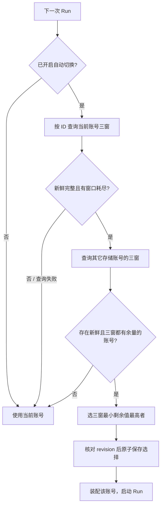

# UI-6b G2 权威额度与切换方案（2026-09-09）

状态：**用户已回复「确认」，GUI 1.16 契约扩展获准；已实现，定向自动检查、代理真窗口与真实 Run 检查通过；等待用户人工视觉验收，未归档**。本次从 [ROADMAP UI-6](roadmap-ui-2026-09-09.md#8-ui-6--providers供应商目录多账号) 接续 G1，不重复多账号实现。启动基线为 `main` / `697f5fc3` 加 G1 未提交改动；检查期间仓库被并发提交为 `69c2cb51`，其中收录了路线图更新，本方案仍未提交。本任务未执行 git 提交；G1 既有验证记录不等于本次重新验证。

## 1. 启动时核实的缺口（实施前）

| 环节 | 当前源码事实 | G2 最小改动 |
| --- | --- | --- |
| 来源 | [verify_api_key](../../crates/providers/src/channels/api_key.rs) 已请求 Go `/usage`，检查三个窗口后丢弃读数，只验证百分比非负和重置字符串非空 | 提取共用的请求与严格解析函数，验证和额度查询消费同一格式 |
| 查询 | [quota_overview](../../crates/app/src/gui_host/handlers/query.rs) 只使用 `provider_id`，返回 `UsageService::usage_overview` 的本地账本形状；忽略 account、credential、window、unit | 增加明确的逐凭证百分比查询路径，真正解析目标凭证；不将旧账本响应冒充远端快照 |
| 协议 | [quota.rs](../../crates/protocol/src/app/quota.rs) 已有身份过滤与 `QuotaSnapshotView`，但单位仅 Count / Token / Cost；[control-plane](../../crates/control-plane/src/quota/domain.rs) 同样缺 Percent | 两端追加整数 Percent 单位；金额、token 与次数语义不变 |
| 缓存 | [QuotaService](../../crates/control-plane/src/quota/service.rs) 按窗口分别抓取；`publish_local_snapshot` 明确限制为本地/派生快照 | 本切片按需一次 GET 取三窗，用既有快照类型表达；不伪装 LocalLedger 发布，也不另建轮询与缓存服务 |
| 选择 | [accounts.rs](../../crates/auth/src/accounts.rs) 已有原子索引、revision 与持久选择；[RunStart](../../crates/app/src/gui_host/handlers/run_start.rs) 在 Run 前重装配 | 在现有账号索引中增加选择模式，并在 Run 前核实额度后按 revision 条件提交选择 |
| 界面 | [Usage 行](../../apps/desktop/src/ui/settings/providers.rs) 恒为 unavailable，账号行已按稳定 ID 绑定 | 每条账号关联自己的三窗读数与刷新状态，供应商级提供自动切换开关 |

## 2. Go 权威来源

核查官方仓库 `anomalyco/opencode` 的 `dev` 快照 `d6855b6b47a8433462ac6aeeba882ccf734cb7f1`，不是以第三方插件或本地 token 估算作为来源。

- [usage.ts](https://github.com/anomalyco/opencode/blob/d6855b6b47a8433462ac6aeeba882ccf734cb7f1/packages/console/app/src/routes/zen/go/v1/usage.ts)：GET 使用 Bearer API key。服务端由 key 找到 `workspaceID + userID`，再查询对应 Go 订阅；缺失/无效 key 返回 401，无 Go 订阅返回 403。成功体只含 `usage.rolling/weekly/monthly`，各有 `status`、`percent`、`resetsAt`，不返回账号、订阅或 workspace 标识。
- [subscription.ts](https://github.com/anomalyco/opencode/blob/d6855b6b47a8433462ac6aeeba882ccf734cb7f1/packages/console/core/src/subscription.ts)：API 的 percent 是已用百分比，向下取整且最高为 100；耗尽时 `status=rate-limited, percent=100`。未耗尽为 `status=ok`。它不是网页模型明细中另一种一位小数读数，不能混用。
- [date.ts](https://github.com/anomalyco/opencode/blob/d6855b6b47a8433462ac6aeeba882ccf734cb7f1/packages/console/core/src/util/date.ts)：周窗以 UTC 周一为界；月窗按订阅日及时分秒锚定，月末短月夹到最后一天，并非自然月一号。[Go 文档](https://opencode.ai/docs/go/#usage-limits) 当前将 rolling 标为 5 小时；服务端长度由配置给出，响应不含长度，客户端不自行重算 reset。`resetsAt` 是服务端输出的 ISO UTC 字符串，须解析成现有毫秒 Timestamp。

**作用域结论**：同一上游 workspace/user 的两把 key 读取同一订阅余额；不同本地 credential ID 不能证明不同订阅。只逐账号展示，不相加、不宣称独立预算，也不靠相同百分比猜测合并身份。其它供应商本切片继续 unavailable，不推断其均无接口。本次没有读取真实凭证或发起认证请求，以上是官方源码证据，不是真实账号或 Pawork Run 验收。

## 3. 快照与查询

一次请求携带明确的 `provider_id + credential_id`。Host 在 G1 账号列表内校验归属与 API key kind，解析该条 StoredCredential；不使用当前选中账号替代指定账号，也不 fallback 到 env。凭证仅在请求内短暂使用；沿用供应商 proxy、禁重定向、超时、取消与错误脱敏边界。

三个窗口分别严格解析：percent 必须是 0–100 整数；status 与 percent 须符合上节格式；reset 必须是合法 UTC 日期时间。畸形窗口返回 typed failure，其余可展示，但不允许不完整结果参与自动切换。保留来源、抓取时刻和重置时刻；不存在上游观测时间就不填 `observed_at`。

`QuotaUnit::Percent` 的 `Exact(n)` 表示供应商公布精度下的 n 个百分点；`limit=100`、`remaining=100-used`，不折算成美元或 token。`confidence=Exact` 仅表示直接采用官方发布读数，不表示未取整的真实消耗。界面显示「已用 N%」，如展示剩余则写「约 N%」。rolling / weekly / monthly 分别映射既有 Rolling5h / Weekly / Monthly；Overall 不合并三窗，返回 unsupported。

查询按需执行，单账号一次 GET 取全部三窗。首次展开账号或点击刷新时获取；切换页面、删除账号、重连或重新登录后不接纳旧请求的迟到结果。界面可保留上一次读数但必须标为过期；自动选择每次重新抓取，最终使用时最多距抓取 30 秒且尚未越过任何 reset，超时或跨窗口后不使用旧读数。当前切片不持久化额度、不启动后台轮询；本地账本继续独立提供原有 usage 能力。

## 4. 选择规则

新增 provider 级模式：`manual`（默认）与 `when_exhausted`（额度耗尽时切换）。显式选择某条账号同时恢复 manual；启用自动模式需要已选中的 Go 存储账号，env 与其它供应商不开放该模式。模式随 G1 索引保存，旧索引缺字段按 manual 读取，外层 auth 文件格式仍为 version 1。

不在每次请求间轮换，不因新账号余量略高就切走仍有额度的账号。候选以 `min(三窗剩余百分比)` 排序，平局按 G1 列表稳定顺序；这只是可用余量比较，不是独立订阅识别或预算保证。同订阅的两条 key 若均耗尽便均不入选。

抓取前读账号索引 revision，提交时在同一 auth 事务中验证 revision、模式、原选中 ID 与目标账号仍有效；用户期间选择、删除或新增账号时，放弃迟到自动结果，不覆盖用户动作。不得持 auth 写锁跨网络等待。自动切换发生于新 Run 的请求快照生成前，已运行 Run 及工具续轮保留原凭证；命名、压缩等独立请求仍沿用 G1 的持久选择解析，本切片不让辅助请求发起新的自动选择。

查额度失败、401/403、无可用候选或快照过期时保持原选择；不增加本地预算拒绝、不把认证失败当额度耗尽、不在已发送请求失败后换账号重试。正常 Provider 请求仍返回其真实结果。自动变更通过既有 `AuthChanged` 刷新列表，原因用既有脱敏诊断记录；仅含本地 opaque ID，不记录 key。GUI 和 CLI 发起新 Run 的入口共用 app 层选择函数，Engine 不按 provider 名分支。

## 5. 已确认的 GUI API 1.16

用户已确认以下附加式变化，实施时 golden 先行，版本与 typegen 同步：

| 项目 | 拟定形状与兼容边界 |
| --- | --- |
| 单位 | `QuotaUnit` 增加 `{ "kind": "percent" }`，对应 control-plane 枚举同步；既有 measure 形状不变，本地账本对该单位返回 unsupported |
| 逐账号查询 | 复用 `quota_overview`，以 `provider_id + credential_id + unit=percent` 明确请求远端账号读数；tenant/account 仍为已有默认本地作用域，`model_id` 不支持，空 windows 表示三窗；返回既有 `QuotaOverviewView`，`scope.credential_hint` 继续脱敏，Desktop 用请求身份绑定结果 |
| 旧查询 | 无 credential 的旧查询保持当前本地 `UsageOverview` 响应；新百分比路径仅 1.16 可用，旧 minor 在发网前拒绝，不向旧端发送 Percent。新路径缺 provider/credential、非默认 tenant/account 或不支持的单位明确报错，不静默回落到账本 |
| 模式命令 | GUI-only `auth_account_set_selection_mode { provider_id, mode: "manual" \| "when_exhausted" }`，registry since 1.16；成功回执包含 provider_id、selection_mode、selected_credential_id |
| 模式状态 | `provider_auth_status.providers[]` 增加 `selection_mode`；旧 Host 缺失时 Desktop 当作 manual，旧 minor 响应剥离新字段。旧 Host 上不显示自动模式控件，不发送新载荷 |
| 现有手动选择 | `auth_account_select` 继续指定稳定 credential ID，新增“显式选择恢复 manual”语义；旧客户端的手动选择同样优先于自动策略，回执仍兼容 |

先写新命令、Percent 快照、失败窗口和旧 minor 的 golden，再接类型、Host、Desktop；测试须验证旧 quota 账本形状原样保留。auth 索引新字段由现有原子事务维护并更新 revision；使用不认识新模式的旧 Host 写回索引可能回到 manual，不保证跨版本保留自动模式。

## 6. 写入集与验收

实现集中在六个核心包与 Client 协议 re-export，不新增包、生产依赖、路由框架或配置层；Client 复用通用查询/命令发送，仅补 Desktop 所需类型 re-export。providers 不依赖 control-plane，由 app 做 Go 返回值到 canonical 快照的转换；时间解析只支持该端点输出的 UTC ISO 形状并校验日历合法性，不新建通用日期库。

| 包 / Spec | 必要写入 |
| --- | --- |
| [providers](../spec/crates/providers.md) | `channels/api_key` 中共用 Go usage 请求/解析与现有验证入口 |
| [control-plane](../spec/crates/control-plane.md) | quota 单位及本地 ledger 对 Percent 的明确拒绝；保持既有缓存与对账职责 |
| [auth](../spec/crates/auth.md) | accounts 索引模式、手动选择与 revision 条件提交 |
| [protocol](../spec/crates/protocol.md) | quota/settings/command/version/registry、golden 与 typegen |
| [app](../spec/crates/app.md) | 逐账号查询、快照转换、Run 前选择与装配、旧版本 gate；复用现有 auth/HTTP 配置 |
| [client](../spec/crates/client.md) | 通用协议类型 re-export 与既有握手版本回归 |
| [desktop](../spec/crates/desktop.md) | Settings controller/状态、Providers 账号额度行、模式开关、AX、i18n |

确认后登记 Settings ADR，同步 architecture/contracts、相关包 Spec、gui-design、capabilities、flows 与 ROADMAP。`design.md` 中 G2“远端适配器保持冻结”的历史边界须说明：本次只开放 Go 按需 GET；不复活归档的六厂商适配器、RefreshScheduler 或 G3–G6。

优先扩展现有 Go 认证保旧、账号选择请求命中与 Providers AX 回归：主路径证明两账号各取自身 key、三窗展示、重启保留模式、耗尽后下一 Run 命中候选 key；关键失败覆盖畸形/过期窗口、共享订阅两 key 同耗尽、查询失败不切换、手动选择/删除与迟到自动提交竞争、日志/DB 无明文。协议必须覆盖新旧 minor；不补历史覆盖率或通用测试基础设施。

定向检查使用一个 Cargo 进程依次执行后端相关包测试（包括 providers 的 API-key 测试 feature、protocol/typegen），再执行 Desktop 既有测试和所改应用构建。真窗口在隔离实例验证展开/刷新/切换、三档字号与窄窗；真实 Run 固定当次 `opencode-go / glm-5.3-flash`。无第二个真实订阅时，自动选择依靠 mock 凭证命中证明，不把两个别名当成两份真实额度验收。

## 7. 实施前准备结果与确认依据（历史）

本批仅写本文与 ROADMAP；未修改已有生产代码、凭证、配置、golden 或生成物。工作区摘要检查检出 `docs/spec/crates/protocol.md` 的并发更新，随后确认其已随 `69c2cb51` 提交，未覆盖该变化；本任务写入集仍为两份文档。官方源码副本与工作区差异摘要放在 `/tmp/pawork-ui6b-g2/`，不检入仓库。独立来源核查代理在执行前因任务传输格式不兼容失败，源码与方案由主代理核查，无独立审查结论。

实际读取的 [AGENTS.md §5](../../AGENTS.md#5-验证决策) 明确要求：**“golden 先于实现改动；schema/wire 演进须用户确认。”** [architecture §3.2](../architecture.md#32-冻结契约激活即采用完整形状golden-先于实现改动) 将 GUI 协议列为冻结契约。[G1 已确认方案](ui6b-accounts-plan-2026-09-08.md#4-已确认的-gui-api-115-扩展) 只确认 GUI 1.15 的账号命令/状态，并将 quota wire 留在后续检查点。本次判断是：路线图已授权启动 G2 和准备工作，但未确认本文 §5 的具体 1.16 变化，故实施前只需确认本方案一次。用户现已回复「确认」，授权已生效；决议见 [ADR-060](../spec/settings.md#adr-060ui-6b-g2-逐账号额度与耗尽切换2026-09-09)。

Validated: 文档相对文件链接、`git diff --check`、本批写入集检查。
Targeted regressions: none（本批为实施前文档准备，未改可执行行为）。
Full workspace gate: NOT RUN（当前未设置全量门禁）。

## 8. 实施结果

本方案已落地。最终实现、定向命令、审查修正、模拟切换/真实 Run 的独立证据与候选哈希统一见 [ROADMAP G2 记录](roadmap-ui-2026-09-09.md#ui-6b-g2-本批证据2026-09-09)。§7 的仅文档写入与确认依据是实施前历史，不代表当前实现状态。
