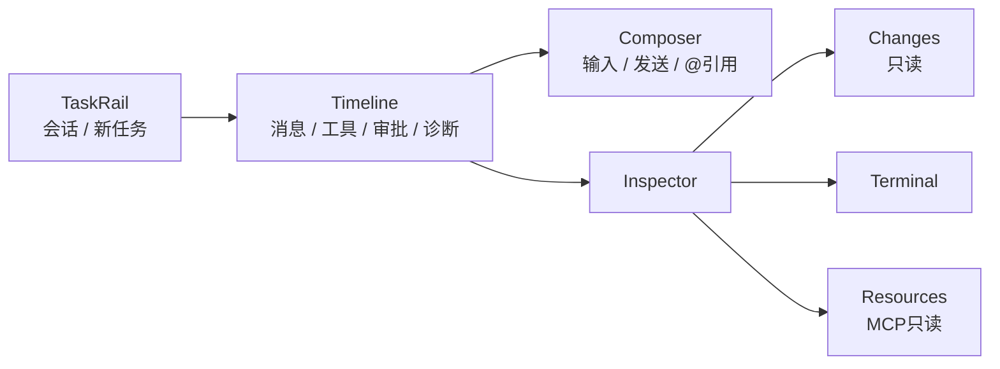

# Desktop 产品与交互规格

> 基线日期：2026-09-01。生产连接、主要组件链路与 macOS AX 语义基座已经存在；正式 Host/Desktop 的项目、对话、文件、Git Changes 与 Terminal 真实核心路径已通过，状态和后续顺序只看 [ROADMAP](../../ROADMAP.md)。

## 1. 产品定位

Pawork Desktop 是本机单窗口 GPUI Agent 工作台。它只负责呈现、输入和用户控制，通过 `pawork-client` 连接 `pawork gui serve`；业务状态、Provider、数据库、工具、Git、PTY 与安全决策均留在 CLI/AppCore 宿主。

默认窗口为 1440×1024，当前只有深色主题。视觉 token、组件值与截图基准以 [design/README.md](../../design/README.md) 为准；本文只定义产品流程和可验收行为。

## 2. 信息架构

| 区域 | 必须呈现 | 当前限制 |
| --- | --- | --- |
| TaskRail | 会话/任务条目、新任务、项目范围、`Add project…`、选中态、长标题截断 | 项目通过系统目录选择器和 Host `workspace_add` 注册；当前 project/session 持久化生命周期仍不完整。100%：宽窗 288px、1080–1279 为 240px；150% 时 320px。 |
| Timeline | 用户/助手/工具/诊断/Run 状态、流式内容、审批卡、fork 边界、回到底部 | 变高虚拟化；菜单锚点卸载、follow-scroll 与千级事件仍需按风险定向复验。 |
| Composer | 多行输入、发送、附件/`@` 引用反馈 | host 已展开 `@token`；无模糊候选浮层。IME、粘贴与草稿仍需系统级人工验收。 |
| Inspector / Changes | 默认 Changes；顶层 Changes/Terminal/Resources 与二级 Files/Summary 分层；DiffView；折叠态 Header ActivityPopover | 只读；无 stage/unstage/hunk 命令。 |
| Inspector / Terminal | PTY 创建、输入、resize、Stop/Close、流式输出与 live/snapshot 终态；任务切换隔离草稿；失败与断线诚实显示 | 创建需 Policy；纯文本视图过滤 ANSI/VT 控制序列但不是完整 VT emulator；ADR-045 的 `terminal_close` / `TerminalExited` 自 API 1.3 起可用，旧 minor 仍只从 snapshot 获知终态。 |
| Inspector / Resources | MCP server/tool 状态、刷新 | 只读；没有已加载 AGENTS.md/Skills 分区。 |

## 3. 连接与状态模型

### 3.1 启动

1. 用户可运行 `./scripts/pawork-desktop.sh start` 构建并启动正式 Host/Desktop；脚本使用独立实例且不加载测试数据。也可手动启动 `pawork gui serve`。
2. Desktop 按 `--socket` / `--instance` 或默认数据目录发现 endpoint/token。
3. `pawork-client` 完成 token proof、API 版本协商和 capability 握手。
4. 客户端 ack/subscribe，再请求 snapshot/resume 建立 projection baseline。

缺 socket、缺 token、认证失败、版本无交集或 capability 不满足时必须显示断线/错误态；禁止无认证或降级绕过。

### 3.2 稳态与重连

- host 空闲超时为 30s；Desktop 事件泵约 15s 无事件发送 heartbeat。
- 任意入站帧刷新 host 活跃时间；heartbeat 失败进入既有断线路径。
- 断开 Desktop 不取消正在运行的 Run。
- Reconnect 后通过 resume 或 snapshot fallback 恢复；同一 session 切 branch 必须清空旧 timeline/seen/tombstone/tool anchors 后建立新 baseline。
- request error 只交给匹配请求；连接级 error 进入全局状态，不能被事件流误吞。
- 自动 Command/Query id 包含每个 `GuiClient` 连接实例的 namespace；Host 重启后即使 `client_id` 重新从 `client-0` 计数，也不能撞上持久化幂等账本里的旧请求。

## 4. 交互需求

| ID | 要求 | 状态 |
| --- | --- | --- |
| DESK-01 | 用户能添加/选择真实项目并新建/切换会话，选中态与标题在长列表中可辨认。 | 项目选择、新建和切换生产入口已实现；稳定的多项目集合与 Session 归属持久化列入 ROADMAP P1。 |
| DESK-02 | Timeline 能按确定顺序投影历史和 live 事件，去重且不跨 Run 串线。 | 已实现；共享 reducer/golden。 |
| DESK-03 | 流式输出时默认跟随底部；用户上滚后脱钩，显式回底后重挂。 | 生产逻辑已实现；长会话与性能按风险定向重验。 |
| DESK-04 | 工具请求以审批卡呈现 ApproveOnce/ApproveForRun/Deny；取消动作可见。 | 生产逻辑已实现；本轮真实 `write_file` 审批路径已通过。 |
| DESK-05 | Fork 只在 reducer 标记的闭合 Run 边界开放，动作入口再次校验。 | 已实现。 |
| DESK-06 | 同时只打开一个菜单；Escape/外点关闭；浮层 occlude 防滚轮穿透。 | 生产逻辑已实现；全部菜单和滚轮边界仍需完整人工走查。 |
| DESK-07 | Composer 支持中文 IME、多行粘贴、Shift+Enter 与明确发送。 | 生产逻辑已实现；真实 IME、paste 与系统级输入仍待人工验收。 |
| DESK-08 | Inspector 三页签独立滚动，切入/展开/会话切换/Run 终态/刷新时拉取正确数据。 | 本轮真实 Changes 与 Terminal 主路径已通过；Resources 和跨会话全矩阵仍按后续任务复验。 |
| DESK-09 | 断线态可 Reconnect，Run/会话不因 UI 断线丢失。 | 重连路径已实现；项目与 Session 归属跨重启仍是 P1 缺口。 |
| DESK-10 | 1080×720 下 Composer、状态栏和 Header Activity 触发器仍可用。 | 生产响应式路径已实现；完整视觉签字仍待人工验收。 |
| DESK-11 | 可见结构和控件具备稳定 AX identifier、正确 role/name/value/state/action；AX 操作复用鼠标/键盘的业务 gate。 | ADR-042 macOS bridge 已实现；本轮主路径可经 AX 驱动，全组件 VoiceOver 与 Windows/Linux 平台仍未验收。 |

### 4.1 可见合同（已实现，非终局签字）

- Timeline wrapper 使用满宽 + 618px 可读列，独立 summary 与 tool-group summary 分别使用 40px / 12px 节奏；关键元信息提升到 secondary。
- TaskRail project count / task time 使用 56px 右对齐尾槽；Header 为 medium；24px StatusBar 使用 12px 字阶和窄窗裁切。
- Composer 的 input/footer 共属同一 panel surface，unavailable Context 使用 tertiary；常态高度、220px 增长上限和 Send/Cancel 单槽不变。
- Changes 文件行使用稳定前后槽；DiffView 的只读路径 header 位于横滚外，24px 语义 gutter 与中性正文分离；ActivityPopover 保持 320×320 与 capability honesty，只组织真实 Changes section。
- 以上是当前生产结构，不代表三张初始设计图已经完成人工视觉签字；完整 Timeline/Changes AX、VoiceOver 与系统偏好仍需后续验收。

## 5. 键盘、IME 与可访问性

最低验收要求：

- Tab 顺序覆盖 TaskRail、Timeline 操作、Composer、Inspector/Header Activity 触发器和当前页主要控件；
- 焦点环清晰；hover 不是唯一状态表达；错误、审批和连接状态不只靠颜色；
- Escape 关闭菜单且不吞掉 Composer 的其他键盘语义；Enter/Shift+Enter 与 IME composition 明确区分；
- 菜单支持键盘到达、选择与关闭；长标题以 truncate + 可辨识上下文呈现；
- 长会话、长 diff 和窄窗不让主要操作不可达。
- AX identifier 与用户可见/可本地化 label 分离；disabled 控件不发布可执行 action，未知 action fail-closed；新增可见交互须同批补语义节点。
- 应用内字号支持 100% / 125% / 150%：`Cmd+=` / `Cmd++` 放大、`Cmd+-` 缩小、`Cmd+0` 重置；状态栏与 AX 发布当前百分比。150% + 1080×720 使用 320px TaskRail，Workspace 保留 760px。
- macOS Increase Contrast 在同一深色主题内增强辅助文字、surface、边界与选区并监听系统变更；当前 UI 无动画，Reduce Motion 无渲染分支。主动系统偏好验收仍未执行，不宣称真系统态通过。

当前锁定 GPUI 0.2.2 不原生导出元素级 AX tree；ADR-042 已由 Desktop 显式 `AxTree` + AppKit 虚拟元素补救。菜单方向键、grouping/scope tab stop 与全局焦点等价路径已经存在；已知缺口仍包括 VoiceOver 屏幕朗读措辞/顺序、主动系统偏好，以及 Windows/Linux 平台 AX，它们不得降级为已通过。

## 6. 只读与写入边界

- Changes 的 Files/Summary/DiffView/ActivityPopover 是只读投影；任何 stage/unstage/hunk 都需新增 protocol command、审批语义和 ADR，不得从 UI 直接调用 Git。
- Resources 只消费 `mcp_list`；无 host query 的“已加载规则”不能伪造占位数据。
- `@` 引用由 host `expand_at_refs` 解析并作为独立 Text part；Desktop 不自行读取任意文件。候选浮层需新增受控 file-index query。
- Terminal 只发协议命令；Desktop 不持有本机 PTY 服务。当前使用 create/write/resize/close 与流式 output/exit；Stop/Close 和 live 终态均走 ADR-045 的真实 Host wire，不以写入 `exit` 或本地 kill 冒充。纯文本展示移除 ANSI/VT 控制序列，但不声称具备终端仿真；Policy 拒绝必须原样 fail-closed。

## 7. 当前验收合同

当前执行入口只有 [ROADMAP](../../ROADMAP.md)。真实 Desktop 主路径至少覆盖：正式启动、添加真实项目、新建 Task、发送消息、文件写入与审批、Git Changes、Terminal 输入输出；不使用 fixture、seed、probe 或测试 profile 冒充通过。

边界口径：

- `ui/mod.rs` 行数属于工程结构，不是视觉放行条件；
- 窄窗使用 240px TaskRail，150% 字号使用 320px；菜单锚点卸载和缺少完整 AX 语义均不作为可签字偏差；
- Desktop Changes 只读是当前协议边界，Git 写操作仍需 ADR，不得用假按钮补图；
- `@` 候选浮层和 Resources 规则分区只有 Host capability 存在时才可展示。

证据必须记录实际窗口状态、连接态、真实操作 trace、文件/Git/PTY 外部事实和实际执行的自动检查。三张初始设计图的视觉签字、VoiceOver 与发布门禁均需单独记录，不能由本轮功能通过替代。
