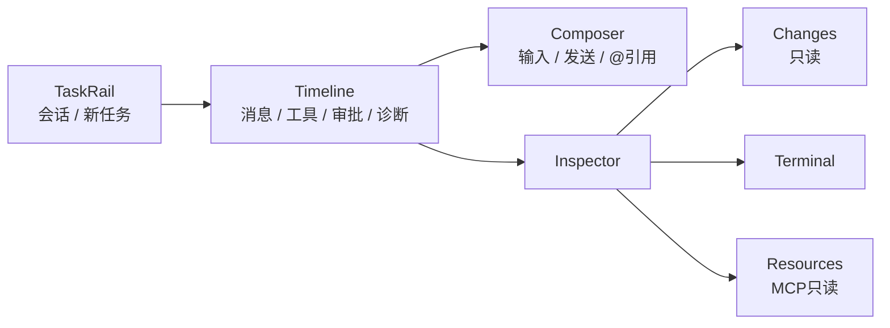

# Desktop 产品与交互规格

> 基线日期：2026-08-26。生产连接、主要组件链路与 macOS AX 语义基座已经存在，但当前真实窗口未达到 design 的 99% 视觉目标，完整交互与模拟操作矩阵也未建立；验收以 [新 R1–R8](../../ROADMAP.md#2-顺序排期) 为准，Desktop 不得标为最终完成。

## 1. 产品定位

Pawork Desktop 是本机单窗口 GPUI Agent 工作台。它只负责呈现、输入和用户控制，通过 `pawork-client` 连接 `pawork gui serve`；业务状态、Provider、数据库、工具、Git、PTY 与安全决策均留在 CLI/AppCore 宿主。

默认窗口为 1440×1024，当前只有深色主题。视觉 token、组件值与截图基准以 [design/README.md](../../design/README.md) 为准；本文只定义产品流程和可验收行为。

## 2. 信息架构

| 区域 | 必须呈现 | 当前限制 |
| --- | --- | --- |
| TaskRail | 会话/任务条目、新任务、选中态、长标题截断 | 当前固定 288px；1080–1279 收窄与 Inspector 折叠恢复为 R7/R8 必过门禁。 |
| Timeline | 用户/助手/工具/诊断/Run 状态、流式内容、审批卡、fork 边界、回到底部 | 变高虚拟化；菜单锚点卸载、follow-scroll 与千级事件须在 R4/R7/R8 重验。 |
| Composer | 多行输入、发送、附件/`@` 引用反馈 | host 已展开 `@token`；无模糊候选浮层。IME、粘贴、草稿与所有输入态纳入 R5/R8。 |
| Inspector / Changes | Files、Summary、DiffView、ActivityPopover | 只读；无 stage/unstage/hunk 命令。 |
| Inspector / Terminal | PTY 创建、输入、resize、流式输出 | 创建需 Policy；安全响应字段尚无完整说明渲染。 |
| Inspector / Resources | MCP server/tool 状态、刷新 | 只读；没有已加载 AGENTS.md/Skills 分区。 |

## 3. 连接与状态模型

### 3.1 启动

1. 用户启动 `pawork gui serve`，宿主创建实例 socket、pid 与 token。
2. Desktop 按 `--socket` / `--instance` 或默认数据目录发现 endpoint/token。
3. `pawork-client` 完成 token proof、API 版本协商和 capability 握手。
4. 客户端 ack/subscribe，再请求 snapshot/resume 建立 projection baseline。

缺 socket、缺 token、认证失败、版本无交集或 capability 不满足时必须显示断线/错误态；禁止无认证或降级绕过。

### 3.2 稳态与重连

- host 空闲超时为 30s；Desktop 事件泵约 15s 无事件发送 heartbeat。
- 任意入站帧刷新 host 活跃时间；heartbeat 失败进入既有断线路径。
- 断开 Desktop 不取消正在运行的 Run。
- Reconnect 后通过 resume 或 snapshot fallback 恢复；同一 session 切 branch 必须清空旧 timeline/seen/tombstone/tool anchors 后建立新 baseline。
- request error 只交给匹配请求；连接级 error 进入全局状态，不能被事件流误吞。

## 4. 交互需求

| ID | 要求 | 状态 |
| --- | --- | --- |
| DESK-01 | 用户能新建/切换会话，选中态与标题在长列表中可辨认。 | 生产入口已实现；视觉/状态/模拟操作按 R3/R8 重验。 |
| DESK-02 | Timeline 能按确定顺序投影历史和 live 事件，去重且不跨 Run 串线。 | 已实现；共享 reducer/golden。 |
| DESK-03 | 流式输出时默认跟随底部；用户上滚后脱钩，显式回底后重挂。 | 生产逻辑已实现；R4/R8 用真输入、千级 fixture 与性能证据重验。 |
| DESK-04 | 工具请求以审批卡呈现 ApproveOnce/ApproveForRun/Deny；取消动作可见。 | 生产逻辑已实现；R4/R8 覆盖审批全状态、零副作用拒绝与重连恢复。 |
| DESK-05 | Fork 只在 reducer 标记的闭合 Run 边界开放，动作入口再次校验。 | 已实现。 |
| DESK-06 | 同时只打开一个菜单；Escape/外点关闭；浮层 occlude 防滚轮穿透。 | 生产逻辑已实现；R7/R8 覆盖全部菜单、锚点、键盘和滚轮边界。 |
| DESK-07 | Composer 支持中文 IME、多行粘贴、Shift+Enter 与明确发送。 | R5/R8 待真实 IME、paste 与系统级输入验收。 |
| DESK-08 | Inspector 三页签独立滚动，切入/展开/会话切换/Run 终态/刷新时拉取正确数据。 | 生产入口已实现；R6/R8 覆盖真实 diff、横滚、PTY、Resources 与恢复。 |
| DESK-09 | 断线态可 Reconnect，Run/会话不因 UI 断线丢失。 | 生产逻辑已实现；R8 待真 Host/Desktop 生命周期验收。 |
| DESK-10 | 1080×720 下 Composer、状态栏和 Inspector 触发器仍可用。 | 当前未通过完整门禁；R7/R8 必须覆盖 Connected 与边界状态。 |
| DESK-11 | 可见结构和控件具备稳定 AX identifier、正确 role/name/value/state/action；AX 操作复用鼠标/键盘的业务 gate。 | ADR-042 macOS bridge 已实现并通过真窗口语义 action；全组件 VoiceOver、动态状态与 Windows/Linux 平台实现仍待 R7/R8。 |

## 5. 键盘、IME 与可访问性

最低验收要求：

- Tab 顺序覆盖 TaskRail、Timeline 操作、Composer、Inspector 触发器和当前页主要控件；
- 焦点环清晰；hover 不是唯一状态表达；错误、审批和连接状态不只靠颜色；
- Escape 关闭菜单且不吞掉 Composer 的其他键盘语义；Enter/Shift+Enter 与 IME composition 明确区分；
- 菜单支持键盘到达、选择与关闭；长标题以 truncate + 可辨识上下文呈现；
- 长会话、长 diff 和窄窗不让主要操作不可达。
- AX identifier 与用户可见/可本地化 label 分离；disabled 控件不发布可执行 action，未知 action fail-closed；新增可见交互须同批补语义节点。

当前锁定 GPUI 0.2.2 不原生导出元素级 AX tree；ADR-042 已由 Desktop 显式 `AxTree` + AppKit 虚拟元素补救，真窗口 75 节点、会话 `AXPress` 与 Composer `AXValue` 证据见 [Wave C ax-bridge](../ui-review/wave-c/ax-bridge/)。已知缺口仍包括菜单内 ↑/↓ 导航、grouping/scope 触发器 tab stop、全组件 VoiceOver/动态状态扩面，以及 Windows/Linux 平台 AX；它们不得降级为可签字差异。

## 6. 只读与写入边界

- Changes 的 Files/Summary/DiffView/ActivityPopover 是只读投影；任何 stage/unstage/hunk 都需新增 protocol command、审批语义和 ADR，不得从 UI 直接调用 Git。
- Resources 只消费 `mcp_list`；无 host query 的“已加载规则”不能伪造占位数据。
- `@` 引用由 host `expand_at_refs` 解析并作为独立 Text part；Desktop 不自行读取任意文件。候选浮层需新增受控 file-index query。
- Terminal 只发协议命令；Desktop 不持有本机 PTY 服务。Policy 返回的 sandboxed/policy/approval_mode/note 应在未来渲染面任务中明确呈现。

## 7. 当前验收合同

完整清单以 [R7–R8 任务书](../../plan/R7-R8-ui-quality-gates.md) 为唯一执行入口，覆盖 IME、多行粘贴、三张 `1440×1024` 定稿图、纯键盘、AX/VoiceOver、全部菜单、Reconnect、`1080×720`、虚拟化、DiffView 横滚、Terminal 与千级事件性能。

边界口径：

- `ui/mod.rs` 行数属于工程结构，不是视觉放行条件；
- 固定 288px 窄窗、菜单锚点卸载和缺少完整 AX 语义均不再作为可签字偏差；
- Desktop Changes 只读是当前协议边界，Git 写操作仍需 ADR，不得用假按钮补图；
- `@` 候选浮层和 Resources 规则分区只有 Host capability 存在时才可展示。

证据必须记录实际窗口尺寸、连接态、fixture/seed、操作 trace、AX tree、Host/event log、reference/current/overlay/diff 与指标。R8 自动门禁全部通过后仍需用户视觉签字。
