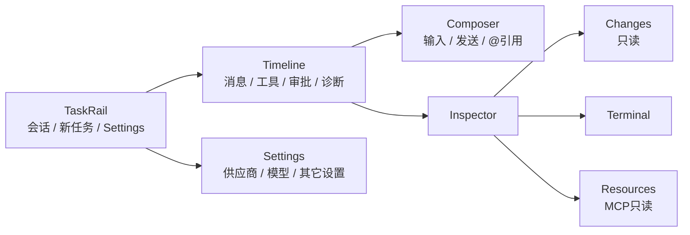

# Desktop 产品与交互规格

> 基线日期：2026-09-05。GUI P0–P2（含中文与供应商代理开关）已实现，定向自动验证与本机真窗口验收完成，证据见 §8；工程约定见 [AGENTS.md](../../AGENTS.md)。

## ADR-054：OPT-2 会话生命周期与自动标题（2026-09-05）

背景：OPT-2（[ROADMAP](../ROADMAP.md) §5，反馈 F7/F9 与 F8 的自动命名）。设计闸门 OPT-D 已签字（[design/README §0](../../design/README.md)）。GUI API minor 1.10 → 1.11，golden/typegen 先行。

- **D1 `SessionCreate.workspace_id` 改可选（since 1.11）**：wire 上字段可缺省或显式 `null` → Host 落盘 `workspace_id = NULL`，归 Unassigned；显式传值行为不变。无项目会话不获得任何 workspace 授权面：文件类工具按现有 Policy 对无 workspace 会话 fail-closed，只适用于问答等不碰仓库的任务。
- **D2 `SessionRename{session_id, title}`**：两字段必填；title trim 后为空为结构化错误，不写盘。写盘成功后回执 Data（session_view，即写后状态）。
- **D3 `SessionArchive{session_id, archived: bool}`**：两字段必填。归档后 `list_sessions`/snapshot 隐藏；归档不删除事件与投影，`SessionOpen` 仍可读；wire 保留 `archived: false` 反向写口，本阶段不提供永久删除，Desktop 只暴露归档入口。
- **D4 命名模型与自动标题**：Global 配置 `naming_provider` / `naming_model`（分层与 `default_provider`/`default_model` 相同；凭证仍只进 auth backend）。未配置则不自动命名，不用启发式冒充模型命名。会话标题仍为占位名（`New session`）且 Run 达成功终态时，Host 用命名模型做一次无工具一次性补全；成功才写回标题，失败/超时保留占位名。Settings 四默认角色的 GUI 入口属 OPT-3b，本阶段只落配置键与 Host 消费。
- **D5 `AppEvent::SessionMetaChanged{session_id, title, archived}`**：改名/归档/自动标题写回后由 Host 经 EventHub 广播；Desktop 收到后重取 snapshot，列表即时反映写后状态。

## 1. 产品定位

Pawork Desktop 是本机单窗口 GPUI Agent 工作台。它只负责呈现、输入和用户控制，通过 `pawork-client` 连接 `pawork gui serve`；业务状态、Provider、数据库、工具、Git、PTY 与安全决策均留在 CLI/AppCore 宿主。

默认窗口为 1440×1024，当前只有深色主题。视觉 token、组件值与截图基准以 [design/README.md](../../design/README.md) 为准；本文只定义产品流程和可验收行为。

## 2. 信息架构

| 区域 | 必须呈现 | 当前限制 |
| --- | --- | --- |
| TaskRail | 会话/任务条目、新任务、项目范围、`Add project…`、选中态、长标题截断 | 项目通过系统目录选择器和 Host `workspace_add` 注册；当前 project/session 持久化生命周期仍不完整。100%：宽窗 288px、1080–1279 为 240px；150% 时 320px。 |
| Timeline | 用户/助手/工具/诊断/Run 状态、流式内容、审批卡、fork 边界、回到底部 | 变高虚拟化；菜单锚点卸载、follow-scroll 与千级事件仍需按风险定向复验。 |
| Composer | 多行输入、发送、附件/`@` 引用反馈 | host 已展开 `@token`；无模糊候选浮层。系统 IME composing 已取得本机证据；多行粘贴与草稿有定向测试，跨平台输入仍需专项验收。 |
| Inspector / Changes | 默认 Changes；顶层 Changes/Terminal/Resources 与二级 Files/Summary 分层；DiffView；折叠态 Header ActivityPopover | 只读；无 stage/unstage/hunk 命令。 |
| Inspector / Terminal | PTY 创建、输入、resize、Stop/Close、流式输出与 live/snapshot 终态；任务切换隔离草稿；失败与断线诚实显示 | 创建需 Policy；纯文本视图过滤 ANSI/VT 控制序列但不是完整 VT emulator；ADR-045 的 `terminal_close` / `TerminalExited` 自 API 1.3 起可用，旧 minor 仍只从 snapshot 获知终态。 |
| Inspector / Resources | MCP server/tool 状态、刷新 | 只读；没有已加载 AGENTS.md/Skills 分区。 |
| Settings | English / 中文 Settings Rail + 820px 可滚动内容列；Models & providers、Network、Approvals、Tools & MCP、Terminal、Appearance、Advanced、About | P2 已产品化现有能力：provider 64px 概览与独立认证操作行、默认模型独立 section、Network 写入 workspace 外的用户 `config.toml`、Approvals 整行 radio、Appearance 即时字号样例、Advanced/About definition list。Host-backed 页按权威能力显示并在 stale 时禁写，本地 Appearance/Advanced 离线常在；普通 UI / AX summary 不显示 credential 片段。本机视觉/键盘走查已完成；四家真实认证/目录矩阵与 E4 用户签字仍单独登记。 |

## 3. 连接与状态模型

### 3.1 启动

1. 用户可运行 `./scripts/pawork-desktop.sh start` 构建并启动正式 Host/Desktop；脚本使用独立实例且不加载测试数据。也可手动启动 `pawork gui serve`。
2. Desktop 按 `--socket` / `--instance` 或默认数据目录发现 endpoint/token。
3. `pawork-client` 完成 token proof、API 版本协商和 capability 握手。
4. 客户端 ack/subscribe，再请求 snapshot/resume 建立 projection baseline。

缺 socket、缺 token、认证失败、版本无交集或 capability 不满足时必须显示断线/错误态；禁止无认证或降级绕过。

### 3.2 稳态与重连

- host 空闲超时为 30s；Desktop 事件泵约 15s 无事件发送 heartbeat。
- 任意入站帧刷新 host 活跃时间；heartbeat 失败进入既有断线路径。
- 断开 Desktop 不取消正在运行的 Run。
- Reconnect 后通过 resume 或 snapshot fallback 恢复；同一 session 切 branch 必须清空旧 timeline/seen/tombstone/tool anchors 后建立新 baseline。
- request error 只交给匹配请求；连接级 error 进入全局状态，不能被事件流误吞。
- 自动 Command/Query id 包含每个 `GuiClient` 连接实例的 namespace；Host 重启后即使 `client_id` 重新从 `client-0` 计数，也不能撞上持久化幂等账本里的旧请求。

## 4. 交互需求

| ID | 要求 | 状态 |
| --- | --- | --- |
| DESK-01 | 用户能添加/选择真实项目并新建/切换会话，选中态与标题在长列表中可辨认。 | 项目选择、新建和切换生产入口已实现；多项目集合与 Session 归属已持久化并通过重启复验。 |
| DESK-01a | 全局 New task 直建无项目会话（Unassigned），会话行右侧可改名/归档；配置命名模型后占位标题会话在 Run 成功后自动命名。 | ADR-054 已实现（API 1.11），定向自动验证与真窗口验收通过（2026-09-05，见 §8 OPT-2 验收；验收中修复无项目会话问答 fail-closed 冲突）。归档仅隐藏不删除；无项目会话以空授权面运行问答，文件类工具 fail-closed，Composer 显示 No project 诚实提示。 |
| DESK-02 | Timeline 能按确定顺序投影历史和 live 事件，去重且不跨 Run 串线。 | 已实现；共享 reducer/golden。 |
| DESK-03 | 流式输出时默认跟随底部；用户上滚后脱钩，显式回底后重挂。 | 生产逻辑已实现；长会话与性能按风险定向重验。 |
| DESK-04 | 工具请求以审批卡呈现 ApproveOnce/ApproveForRun/Deny；取消动作可见。 | 生产逻辑已实现；本轮真实 `write_file` 审批路径已通过。 |
| DESK-05 | Fork 只在 reducer 标记的闭合 Run 边界开放，动作入口再次校验。 | 已实现。 |
| DESK-06 | 同时只打开一个菜单；Escape/外点关闭；浮层 occlude 防滚轮穿透。 | 已实现；本机 scope / model / Activity 及键盘关闭回焦已复验。 |
| DESK-07 | Composer 支持中文 IME、多行粘贴、Shift+Enter 与明确发送。 | 已实现；系统 IME composing 已于 2026-09-05 完成真窗口补证，paste/Shift+Enter 由现有定向回归覆盖。 |
| DESK-08 | Inspector 三页签独立滚动，切入/展开/会话切换/Run 终态/刷新时拉取正确数据。 | 本轮真实 Changes 与 Terminal 主路径已通过；Resources 和跨会话全矩阵仍按后续任务复验。 |
| DESK-09 | 断线态可 Reconnect，Run/会话不因 UI 断线丢失。 | 重连路径已实现；项目与 Session 归属跨重启已复验。 |
| DESK-10 | 1080×720 下 Composer、状态栏和 Header Activity 触发器仍可用。 | 已实现；1440×1024、1080×720 与三档字号的本机视觉复验通过（§8）。 |
| DESK-11 | 可见结构和控件具备稳定 AX identifier、正确 role/name/value/state/action；AX 操作复用鼠标/键盘的业务 gate。 | ADR-042 macOS bridge 已实现；本轮主路径可经 AX 驱动，Windows/Linux 平台仍未验收（VoiceOver 验收已于 2026-09-04 按用户要求移出范围）。 |
| DESK-12 | Settings 从 TaskRail 进入；Host capability 驱动业务页，本地外观页驱动当前 Desktop 字号；本地高级页提供安全连接诊断；关于页呈现当前 Host 权威元数据；返回时保持工作台状态，secure input 不泄漏 AX value。 | SET-3～SET-6g 已实现。外观页在离线态仍可达，三档按钮/快捷键/AX Press 共享 `TextScale`；高级页的握手摘要只在当前连接存活时可用，runtime ID 不冒充配置 instance，Reconnect 与既有 handler 同源；About 的 render/AX 共用 Connected + 非空 `host_data_dir` gate，断线清空并回退高级。本机八页视觉、字号与语言切换已复验；真实账号端到端矩阵与 E4 签字见 [settings.md](settings.md)。 |

### 4.1 当前可见合同

- Timeline wrapper 使用满宽 + 618px 可读列，独立 summary 与 tool-group summary 分别使用 40px / 12px 节奏；关键元信息提升到 secondary。
- TaskRail project count / task time 使用 56px 右对齐尾槽；Header 为 medium；24px StatusBar 使用 12px 字阶和窄窗裁切。
- Composer 的 input/footer 共属同一 panel surface，unavailable Context 使用 tertiary；常态高度、220px 增长上限和 Send/Cancel 单槽不变。
- Changes 文件行使用稳定前后槽；DiffView 的只读路径 header 位于横滚外，24px 语义 gutter 与中性正文分离；ActivityPopover 内容宽 320px，内容高随 100%/125%/150% 为 144/180/216px，外框包含 8px padding 与 1px border，摘要可见且保持 capability honesty。
- 三张阶段图与本机视觉走查已收口；此结论不扩张为 Timeline/Changes 全状态 AX 几何覆盖或发布级签字。

## 5. 键盘、IME 与可访问性

最低验收要求：

- Tab 顺序覆盖 TaskRail、Timeline 操作、Composer、Inspector/Header Activity 触发器和当前页主要控件；
- 焦点环清晰；hover 不是唯一状态表达；错误、审批和连接状态不只靠颜色；
- Escape 关闭菜单且不吞掉 Composer 的其他键盘语义；Enter/Shift+Enter 与 IME composition 明确区分；
- 菜单支持键盘到达、选择与关闭；长标题以 truncate + 可辨识上下文呈现；
- 长会话、长 diff 和窄窗不让主要操作不可达。
- AX identifier 与用户可见/可本地化 label 分离；disabled 控件不发布可执行 action，未知 action fail-closed；新增可见交互须同批补语义节点。
- 应用内字号支持 100% / 125% / 150%：`Cmd+=` / `Cmd++` 放大、`Cmd+-` 缩小、`Cmd+0` 重置；SET-6e 外观页提供同源三档按钮及当前值/AX selected。字号只在当前 Desktop 会话生效，重启恢复 100%；150% + 1080×720 使用 320px TaskRail，Workspace 保留 760px。
- 主题为单一深色 palette，不读取系统显示偏好（Increase Contrast 支持已于 2026-09-04 移除）；当前 UI 无动画，Reduce Motion 无渲染分支。

当前锁定 GPUI 0.2.2 不原生导出元素级 AX tree；ADR-042 已由 Desktop 显式 `AxTree` + AppKit 虚拟元素补救。菜单方向键、grouping/scope tab stop 与全局焦点等价路径已经存在；已知缺口为 Windows/Linux 平台 AX；VoiceOver 屏幕朗读与系统显示偏好验收已于 2026-09-04 按用户要求移出范围。

## 6. 只读与写入边界

- Changes 的 Files/Summary/DiffView/ActivityPopover 是只读投影；任何 stage/unstage/hunk 都需新增 protocol command、审批语义和 ADR，不得从 UI 直接调用 Git。
- Resources 只消费 `mcp_list`；无 host query 的“已加载规则”不能伪造占位数据。
- Settings 高级页只消费 Desktop 已有握手与连接本地事实；不显示 token/token path，不从 socket 推断 data directory/配置 instance，不 shell-out CLI，也不提供实例热切换。
- Settings About 已按 ADR-051 Accepted 落地：只在当前认证握手声明非空 Host data directory 后显示，原样呈现该路径；缺字段、仅空白字段或断线时隐藏并退回高级。路径不用于文件操作或 endpoint 反推。
- `@` 引用由 host `expand_at_refs` 解析并作为独立 Text part；Desktop 不自行读取任意文件。候选浮层需新增受控 file-index query。
- Terminal 只发协议命令；Desktop 不持有本机 PTY 服务。当前使用 create/write/resize/close 与流式 output/exit；Stop/Close 和 live 终态均走 ADR-045 的真实 Host wire，不以写入 `exit` 或本地 kill 冒充。纯文本展示移除 ANSI/VT 控制序列，但不声称具备终端仿真；Policy 拒绝必须原样 fail-closed。

## 7. 当前验收合同

当前执行入口只有 [AGENTS.md](../../AGENTS.md)。Settings 的专项行为与证据见 [settings.md](settings.md)。真实 Desktop 主路径至少覆盖：正式启动、添加真实项目、新建 Task、发送消息、文件写入与审批、Git Changes、Terminal 输入输出；不使用 fixture、seed、probe 或测试 profile 冒充通过。需要真实模型的功能验证固定使用 `opencode-go / glm-5.3-flash`（当次 Host `--provider` / `--model`，不改持久默认）；口径见 [verification.md](verification.md) §2.1。

边界口径：

- `ui/mod.rs` 行数属于工程结构，不是视觉放行条件；
- 窄窗使用 240px TaskRail，150% 字号使用 320px；菜单锚点卸载和缺少完整 AX 语义均不作为可签字偏差；
- Desktop Changes 只读是当前协议边界，Git 写操作仍需 ADR，不得用假按钮补图；
- `@` 候选浮层和 Resources 规则分区只有 Host capability 存在时才可展示。

证据必须记录实际窗口状态、连接态、真实操作 trace、文件/Git/PTY/Provider 外部事实和实际执行的自动检查。三张阶段目标设计图、Settings 真窗口与发布状态均需单独记录，不能由功能测试互相替代。

## 8. GUI 收尾验收记录（2026-09-05）

GUI P0–P2 及追加中文/供应商代理开关均已实现；本机 E2 自动验证与 E3 真窗口检查完成，原活动路线图及实施计划已清理。E4 用户签字、跨平台、真实账号完整矩阵与发布门禁未由此推定。

- **环境与产物**：macOS 26.6.2（25G83），Desktop 0.1.0、GUI API 1.10；源码基线 `f977b34` 加本次局部视觉修复，经正式脚本构建并把真实可执行文件复制进 runtime `.app`。`pawork --instance desktop status` 为 listening，`doctor --instance desktop` 握手正常。
- **P0 Foundation**：对照三张阶段图中的 Foundation，核对 1440×1024 与 1080×720（含窗框截图 1083×723）、空态唯一 New task、Inspector 自适应折叠、Composer、Timeline/Projects 直接切换。鼠标/Return/Space 切换保持 active session、草稿与焦点；scope 菜单在触发器下方展开且只有一个选中勾，Escape 回焦；model 长菜单可滚动、向上展开。
- **P1 Run & Review**：保留 2026-09-05 已有真实 `opencode-go / glm-5.3-flash` streaming/tool/Review、Approval Deny 与系统 IME composing 证据。本次重新读取正式 Host 持久事件并在窗口打开历史会话 `ses-1788535764261-1`：`run-gui-1788538222136-1` 为 completed，包含 49 个 assistant text delta、3 次 tool started/completed 与 1 个 run_completed，provider/model 符合指定测试模型。零文件终态只显示 Run completed，Activity 为 `0 files · +0/−0`；不把历史回放当成本次新发模型请求。
- **P2 Settings & Polish**：computer-use 逐页检查 Models & providers、Network、Approvals、Tools & MCP、Terminal、Appearance、Advanced、About；切换 English/中文及 100%/125%/150%。Connected 与目录错误分层；当前 ChatGPT 目录 HTTP 401 如实展示。真实 Network/供应商代理开关写回证据保留在 [Settings Spec](settings.md)；本次未修改凭证、代理、默认模型或审批策略。
- **本次视觉修复并复验**：Advanced 长路径正常换行；Settings 页启用受限高度内的纵向滚动，切页归零；provider 认证操作移到详情行；两行审批说明随字号增高；单行输入至少容纳当前行高与内边距；Activity 高度与 AX 几何随字号调整；scope 下方锚定与单勾。最小窗 150% 下高级页底部、审批页信任/说明、模型列表及 Network/Terminal 输入完整可达。
- **自动验证**：`cargo test -p pawork-desktop --offline --bins --features gpui/runtime_shaders` 189/189；`./scripts/pawork-desktop.sh build` 成功；`cargo tree -p pawork --offline --prefix none` 成功且 manifest/lock 无差异；`git diff --check` 与改动文档相对链接检查通过。未新增依赖或测试数量，仅扩展既有 Activity 几何断言。

- **证据位置**：本次 Codex 任务 `01a06f10-cd2b-77b3-95a8-165ce4cfe6f8` 的 computer-use trace，以及本机 `~/.codex/visualizations/2026/09/05/01a06f10-cd2b-77b3-95a8-165ce4cfe6f8/pawork-audit`（截图 01–42，最终修复图 31–40，恢复后的常规窗口图 41–42）；截图不检入仓库，不作为仓库可复现门禁。临时测试/构建日志前缀为 `/tmp/pawork-gui-closeout-verified-`。

### 8.1 OPT-2 会话生命周期真窗口验收（2026-09-05）

隔离实例 `opt2acc`，Host 当次 `--provider opencode-go --model glm-5.3-flash`（不写持久默认），生产实例 `desktop` 未受影响。逐项窗口 + AX + SQLite 交叉验证：全局 New task 直建 Unassigned 会话（DB `workspace_id` NULL，无 WorkspaceConfirm）；Composer No project 与文件工具不可用提示；真实问答 Run 三次 completed；行内改名 Enter 提交/Esc 取消（DB 写后状态一致）；归档后列表隐藏且 `archived=1` 未删除；临时配置命名模型后占位标题在 Run 成功终态自动改写并经 SessionMetaChanged 即时刷新；Host 重启后 Reconnect 恢复连接与草稿。验收中发现并修复：ADR-044 D3 对未绑定会话的 fail-closed 与 ADR-054 D1 冲突，致无项目会话无法问答——显式 NULL 归属改以空授权面 `ws-unbound` 运行，文件工具仍 Policy fail-closed（详见 [ROADMAP §10.3](../ROADMAP.md)）。命名用配置已还原，本批不推定 OPT-3/4 与发布状态。

Full workspace gate: NOT RUN（当前未设置全量门禁）。
