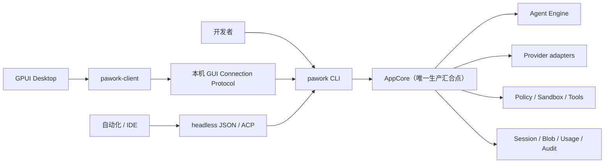

# Pawork 产品规格

> 基线日期：2026-08-25。产品状态：V2 功能线已实现，V3 R0–R7 已收口；R8 仍待 Desktop K-03 人工签字，R9 一致性与终局验证尚未完成。Pawork 当前是本机开发产品，不是已发布发行版。

## 1. 产品定义

Pawork 是纯 Rust 实现的本机 Coding Agent 平台。它把模型对话、可重放会话、工具循环、Policy/Sandbox、Provider、Git、MCP、工作流与 Desktop 汇合到唯一正式宿主 `pawork`；外部客户端通过受认证的本机协议连接，不嵌入第二份 Core。

核心用户：

- 希望在终端中完成“理解仓库 → 修改 → 运行 → 审批 → 恢复”的开发者；
- 希望用独立 Desktop 查看会话、审批、变更、终端和资源的开发者；
- 需要通过 headless JSON、ACP 或 typed client 驱动同一 Core 的工具作者；
- 需要可审计、可重放、Secret 不泄漏和工作区边界约束的本机团队。

## 2. 系统边界

硬边界：

- CLI 与 Core 同进程、同二进制；不提供独立 daemon/RPC Core。
- Desktop 是独立 GPUI 进程，业务依赖仅 `pawork-client`；不直连 Provider、数据库、工具、Git 或 PTY。
- Core 与 Desktop 构建链均不引入 Node、Bun、V8 或嵌入式 JavaScript Runtime。
- `pawork-domain` 保持 canonical 纯净；Engine 不按 Provider 名称分支。
- 所有 Agent 事件可持久化、可重放；明文 Secret 不进数据库、事件和日志。

## 3. 用户问题与预期结果

| ID | 用户问题 | 预期结果 |
| --- | --- | --- |
| PRD-001 | 对话与代码操作散落在不同工具中 | 用户可在一个 Run 内对话、读取、搜索、编辑、执行，并看到结构化事件。 |
| PRD-002 | 长会话中断后难以恢复、审计或分支探索 | 会话以 append-only 事件持久化，可 resume、export/import、fork、compact 与 replay。 |
| PRD-003 | 模型可能越过工作区、执行危险命令或泄漏 Secret | 相对路径、Policy、审批、灾难地板、Sandbox 和全局脱敏共同约束执行。 |
| PRD-004 | 不同模型通道的 wire、能力和凭证形态不同 | Provider adapter 把差异归一到 canonical domain；凭证与配置分离。 |
| PRD-005 | CLI、Desktop 与自动化客户端容易形成三套不一致产品 | 三通道命令/查询能力由 registry 同源登记；客户端连接同一宿主。 |
| PRD-006 | 开发变更、终端、MCP 资源和任务状态难以集中观察 | CLI 与 Desktop 暴露对应只读/受控视图；关键状态可恢复和诊断。 |

## 4. 产品需求

| ID | 要求 | 当前结论 |
| --- | --- | --- |
| PRD-CORE-01 | `pawork` 必须是 Core 唯一正式宿主，保持纯 Rust 和单一生产装配点。 | 已实现；架构红线。 |
| PRD-CHAT-01 | 必须支持流式多轮 chat、单次 run、模型选择、取消和可读错误。 | 已实现。 |
| PRD-SESSION-01 | 必须持久化 Agent 事件并支持 list/show/resume/export/import/fork；重放结果须确定。 | 已实现；schema v12、export v3、envelope v1。 |
| PRD-AGENT-01 | Agent loop 必须以 canonical request 驱动模型与工具，不得在 Engine 中写 Provider 特例。 | 已实现；依赖守护测试在位。 |
| PRD-TOOL-01 | 必须提供工作区内读、查、写、补丁和命令执行工具，并让 descriptor 明确只读/审批语义。 | 已实现；八工具。 |
| PRD-SAFE-01 | 文件与进程操作必须经过工作区路径、Policy、审批和 Sandbox 约束；不可静默放宽灾难地板。 | 已实现；平台能力与回退限制见 [security.md](security.md)。 |
| PRD-PROVIDER-01 | 必须支持内置通道、可配置兼容端点、能力协商、用量归一与凭证脱敏。 | 已实现；真实 Provider 终局复验仍有人工项。 |
| PRD-RESOURCE-01 | 必须加载 AGENTS.md、Skills、profiles、`@file`，并作为 MCP Client 管理资源；导入不得执行外部 hook。 | 已实现；Desktop 的 `@` 候选浮层和已加载规则分区未实现。 |
| PRD-GIT-01 | 必须能查看 diff、创建 checkpoint/rollback；GUI 变更面默认只读。 | 已实现/部分实现：CLI 与核心能力已实现，Desktop stage/unstage/hunk 写操作为候选。 |
| PRD-CLIENT-01 | Desktop、headless 与 ACP 必须连接同一宿主，能力宣告、授权与实现保持同源且未登记 fail-closed。 | 已实现。 |
| PRD-DESKTOP-01 | Desktop 必须呈现 TaskRail、Timeline、Composer、审批和 Inspector，并在断线后可恢复且不取消 Run。 | 已实现，K-03 十一项人工走查待签字。 |
| PRD-OPS-01 | 本机实例必须可诊断、可观测数据目录/连接状态，并提供 service/status/watch/shutdown/doctor/usage 入口。 | 已实现；发布级运维、安装和三平台证据未立项。 |

## 5. 关键用户流程

### 5.1 CLI 编码任务

1. 用户选择 workspace、Provider/model 与 approval mode。
2. `pawork chat` 或 `pawork run` 创建/恢复会话。
3. Engine 流式消费模型输出；工具请求先经 descriptor、Policy 和必要审批。
4. 文件工具只接受 workspace-relative path；命令按平台 Sandbox 执行并公开隔离/回退状态。
5. 事件、用量、诊断与可恢复状态持久化；用户可 diff、rollback 或继续会话。

成功标准：Run 有确定终态；拒绝/取消/降级可见；中断后可以从事件恢复而不重跑已完成副作用。

### 5.2 会话恢复与分支

1. 用户列出或查看历史会话并选择 resume/fork point。
2. fork 只接受冻结的边界类型；分支继承祖先前缀。
3. 父支后续写入或 compaction 不污染既有子支，兄弟分支互不污染。
4. export v3/import 往返保留可见语义；损坏或含 Secret 的导入 fail-closed。

### 5.3 Desktop 工作台

1. 用户先启动 `pawork gui serve`，Desktop 读取实例 socket/token 完成认证握手。
2. TaskRail 选择会话，Timeline 投影事件，Composer 发送消息；审批卡处理工具请求。
3. Inspector 在 Changes、Terminal、Resources 间切换；变更与资源当前只读，终端创建受 Policy 闸约束。
4. 客户端空闲发送 heartbeat；断线不取消 Run，Reconnect 后通过 snapshot/resume 恢复。

### 5.4 自动化客户端

1. headless 使用 stdout-only JSONL；日志进入 stderr。
2. ACP 适配 IDE/Agent Client；typed client 可 spawn `pawork headless --json-stdio` 或走本机 GUI 连接面。
3. 非 TTY/JSON 模式拒绝交互审批，避免无人值守任务悬停或静默授权。

## 6. 非目标与当前限制

- 不提供全屏 TUI、JS/TS 插件运行时或 npm 生态传输。
- 不提供已交付的远程 GUI、Web UI、Cloud 执行、组织 SSO、第一方 IDE 扩展或对外账户池网关。
- `NativeRestricted` 不是对抗性隔离；Sandbox 不应被表述为能抵御主动读取全部本机数据的恶意进程。
- Desktop Changes 不执行 stage/unstage/hunk；`@` 有 host 展开但无候选浮层；Resources 无“已加载规则”分区。
- R8 人工 UI 验收、R9 终局回归/真实冒烟、OAuth 自然临期 refresh 尚未完成。
- License、安装器、自更新、发布/回滚 runbook、全量门禁与三平台发布矩阵未获授权，不属于当前交付。

## 7. 产品完成口径

当前产品 Spec 认为“范围完整”是：需求、状态、限制、契约和证据入口均已记录。它不把 V3 或发布状态改成完成。V3 完成仍需 [R9 退出标准](../../plan/R9-consistency-closeout.md#3-退出标准)实际满足；Desktop 完成仍需 [K-03 人工签字](../gui-design.md#a2-人工走查项用户签字)。

