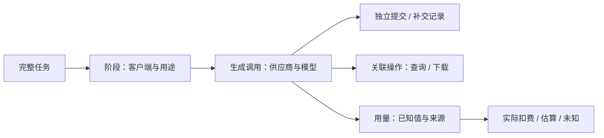

# 完整任务日志与消耗：生产实现与 UI 设计

- 最近更新：2026-10-04。
- 状态：交互原型保留；统一调用记录、统计 API 与 GPUI 统计窗口已实现，正在验证。用户人工验收未完成，未发布。
- 范围：Pawork 共用两级任务 + 可选分部 + 操作类型的记录 / 查询；MoMai、YingMai 后续分别接入小说与视频界面。第 1–6 节保留最初设计及历史案例，第 7 节是本次实际生产边界。
- 关联：[GUI 设计](../gui-design.md)、[模型网关](model-gateway.md)、[providers](crates/providers.md)、[control-plane](crates/control-plane.md)、[desktop](crates/desktop.md)。

## 1. 任务是用户发起的一次完整工作

本次「纸船的午后 · 一分钟视频制作」是一项完整任务，跨 MoMai 内容准备、YingMai 分镜与图片、视频生成、归档与剪辑，包含多个模型调用。Task 与 Pawork 现有会话 / Run、网关请求、供应商视频 taskId 分开；现有 ID 可以作为关联信息，不能直接替代完整任务 ID。

任务完成状态与用量覆盖 / 扣费确认状态独立。例如本次成片已完成，但 Token、credits、实际金额仍未知；任务列表同时显示「已完成」「消耗未齐」。补交成功不会覆盖原失败记录，后续账单到账也不改变历史调用状态。

后续实现通过显式任务关联连接多个客户端，不能按相近时间、同模型或同项目自动拼成任务。缺关联的记录保留为待关联，不悄悄丢弃。本原型只展示用户明确提供的这一真实案例；原型数据的 `design-film-20261004` 是设计标识，不是现有网关已记录的 Task ID。

## 2. 当前事实与现有界面

2026-10-04 实际打开 Pawork，看到任务侧栏、主工作区与底部 Run 用量；本机 GUI Host 未启动，窗口处于连接失败状态。因此本次只核对壳层，不声称已走通生产任务日志。还只读检查了正在运行的 YingMai 窗口，保留其当前项目。

视觉沿用 [theme.rs](../../apps/desktop/src/ui/theme.rs) 的中性深色板、现有图标和系统字体。侧栏目标 288 px；1080–1279 px 时为 240 px；详情沿用 440 px 的 Inspector 尺寸。宽屏总览可并列呈现模型表与覆盖信息，1080 px 时覆盖信息下移。滚动只发生在内容区或明细表，顶部入口与底部状态可达。生产实现仍是 GPUI，经 GUI Connection Protocol 访问 CLI Host。

已核对的记录边界：

| 事实源 | 当前可提供 | 本任务需要补足 |
| --- | --- | --- |
| Pawork `TokenUsage` | 输入、输出、缓存读 / 写 Token | 图片数、视频时长与可信的缺失标记；不能把默认 0 当上游证明 |
| Pawork `UsageRecord` | 供应商、模型、账号、请求 / Run 归属、金额、币种、Actual / Estimated / Unknown 口径 | 跨客户端完整 Task / Stage 关联及非 Token 调用覆盖 |
| [gateway_backend.rs](../../crates/app/src/gateway_backend.rs) | 有非零 usage 的 Chat / 图片请求按 `thirdparty/<client>` 记账；失败可保留已收到的 usage | 无 usage 的成功图片调用会跳过 Token 账本；视频提交 / 查询只有任务与租约处理，不是媒体用量账本 |
| [模型网关](model-gateway.md#凭证与用量) | 第三方租户与实际供应商归属 | 第三方记录当前不并入 GUI 个人 quota 投影，不能声称现有 GUI 已覆盖全部外部消耗 |
| MoMai `ModelUsageService` | 本月已知 Token / 估算、未知条数、最多 100 条本机调用 | 不是跨客户端完整任务；已知小计不能冒充包含未知项的总额 |
| YingMai `PaworkClient` / 项目 Generations | 文本结果、图片与视频归档、状态与不透明供应商任务 ID | 文本客户端当前取结果内容，不保存完整 usage；项目记录数量不等于请求数量 |

以上是原型制作时的事实快照；本次随后实现的变化见第 7 节，不把历史案例回填为生产调用。

## 3. 页面与交互

### 任务列表

沿用任务侧栏，增加「任务总览」入口；主区列完整任务名称、客户端链、结果、日期、供应商 / 模型数量、内容生成次数、实际扣费和任务状态。真实案例只占一行，不填虚构历史任务。支持按名称 / 客户端 / 模型查找以及状态筛选；无结果可清除筛选。

点击整行进入任务详情，返回列表保留同一次查看流程。模型数量是去重的模型数，调用数量是生成提交数；查询、下载、导入和本地导出另列操作记录。

### 任务总览

详情头显示工作名称、MoMai → YingMai、日期、「已完成」和「消耗未齐」，总耗时未知时显示「未留存」。四个主指标分别是文本生成、图片生成、视频计划提交和实际扣费，不把不同单位压成一个总数。

总览中显示供应商 / 模型表、任务阶段和账单覆盖。首个视频回执丢失是可点击的异常条，直接打开原提交详情。点击模型进入已筛选的调用日志；点击阶段进入该阶段；点击来源进入数据来源页。

### 供应商与模型

先按供应商与渠道分组，再按实际模型显示生成次数、已知用量、实际扣费。供应商名称与 Pawork provider ID 都可查看，不按模型名称猜供应商。账号存在时作为归属信息展示，但不显示明文凭证。

实际金额、估算金额、供应商 credits 分开。可信金额按币种单独列总额；一种币种有未知项时标题为「已知实际小计」，同时标出未知项数量。实际 CNY 与 USD 分两行；估算 CNY 与 USD 再分两行，不显示相加后的「总价」。本案无可信金额与币种，因此直接显示未知，不预填 CNY、USD 或价格。

### 阶段与调用

阶段默认可展开，支持阶段 / 模型筛选和「仅异常与补交」。行展示调用用途、模型、已知用量、记录时间、耗时和状态；点击行标题或箭头打开调用详情。

每一次实际提交保留独立记录，补交显示「明确补交」及关联原请求。状态区分本地接收 / 校验状态与供应商状态；本地报错不等于上游未受理，也不等于不扣费。失败、取消、超时、回执丢失均不能从总览中消失，尚无证据时不判定远端终态。

导入、状态查询、下载、剪辑 / 导出显示在所属阶段的操作行，关联原生成，不增加生成计数或重复计费。仅有归档结果时显示「操作汇总 · 请求次数未留存」，不伪造完整 HTTP 日志。供应商如果另有查询或流量收费证据，以独立操作费用记录，而不是再次记为生成费用。

### 调用详情与数据来源

440 px 详情区显示供应商 / 模型、记录来源、用量、Actual / Estimated / Unknown、credits、币种、供应商状态、时间 / 耗时、证据及完整不透明任务 ID。原提交与补交可双向跳转，ID 可复制；没有 ID 时显示未保留，不推测 ID。支持 Esc 关闭、Tab 焦点限制在详情区、关闭后回到触发控件。

数据来源页列文件、证明的事实与覆盖缺口。编码代理单列来源及覆盖范围：本次没有可归属的独立用量来源，因此显示「未接入」，不计入 29 次内容生成。后续接入可作为同一 Task 的独立阶段或来源行，必须显示实际供应商 / 模型、数据时间范围和未覆盖部分，避免重复汇总已由 Pawork 记录的调用。

## 4. 真实案例与显示值

证据目录：YingMai `artifacts/momai-film-20261004/`。引用的证据均为只读，原文件保留在 YingMai；原型数据只提取统计、记录 ID、时间与分镜名称，不复制小说、提示词、临时媒体 URL 或凭证。

| 显示项 | 值 | 依据 / 口径 |
| --- | --- | --- |
| 供应商 | 阿里云百炼 Qwen Token Plan，`qwen-token-plan` | `verification.json` + 渠道契约 |
| 文本模型 | `qwen3.8-flash`，3 次 | 小说、人设、分镜；Token 未完整可信留存 |
| 图片模型 | `wan2.7-image`，13 次 / 13 张归档 | 1 张人设图 + 12 张分镜图 |
| 视频模型 | `happyhorse-1.1-t2v`，13 次提交 | 12 个有 ID 且归档成功的任务 + 1 次回执丢失原提交 |
| 内容生成提交 | 29 次 | 3 + 13 + 13；不是所有网络操作或编码代理调用数 |
| 视频计划提交 | 65 秒 | 13 × 5 秒，不能标作供应商确认的实际扣减 |
| 成片 | 60 秒 / 1440 帧 | 12 段各取 5 秒组成成片 |
| 源文件实测时长 | 61.92 秒 | `media-verification.json`：12 段各 5.16 秒；不是扣费量 |
| 潜在额外消耗 | 1 次 / 计划 5 秒 | 原任务 ID 丢失，明确补交一次；实际扣减未知 |
| 输入 / 输出 / 缓存 Token | 未留存 | 不用字数、生成次数或默认 0 换算 |
| credits、实际金额、估算金额、币种 | 未确认 / 未知 | 没有可信的供应商扣减、账单或价格快照 |
| 任务起止 / 总耗时、单次开始时间 / 耗时 | 未留存 | 快照 `CreatedAt` 仅作为归档 / 记录时间，转为 UTC+8 显示 |

`snapshot.json` 有 27 条记录，其中 1 条为 MoMai 导入；26 条生成记录加 2 次早期文本和 1 次丢失回执提交才得到 29。两个早期文本调用只有制作验证证据，未保留可核对的网关客户端身份和时间；界面显示缺失，不按阶段名称反推认证身份。YingMai 标签表示本地记录来源，不承诺从这些文件恢复了所有网关 client ID。

## 5. 支撑实现的最小字段

以下是视图需要的数据，不是已冻结的 wire / schema 变更；实施时复用已有账本字段，仅补真实缺口。

| 层级 | 最小字段 |
| --- | --- |
| Task | 独立 task ID、用户名称、状态、参与客户端、时间及其来源、用量覆盖状态 |
| Stage | task ID、stage ID、名称、客户端 / 来源、状态、时间范围 |
| Call / 操作 | call ID、task / stage 关联、operation kind（生成 / 查询 / 下载 / 本地操作）、客户端归属、供应商 / 渠道 / 模型、request ID、供应商不透明 task ID、关联生成 / 替代提交 ID、本地与远端状态、时间 / 耗时及其来源 |
| 用量 | 输入 / 输出 / 缓存读 / 写 Token、图片数、计划视频时长、源媒体时长、实际扣减时长、供应商 credits 及单位，各自的值、来源与缺失原因 |
| 金额 | 金额微单位、币种、Actual / Estimated / Unknown、来源、估算时使用的费率版本；缺任一关键依据时不能标实际扣费 |

缺失值保留为空并携带原因（未回传、未留存、未接入、待账单确认等），与有来源的 0 分开。请求成功不推导金额为 0；部分已知用量展示已知小计和缺口。缓存读 / 写保留供应商归一后的定义，避免把已经含在输入 Token 中的缓存读取再次加到总 Token。

Task 总览的调用数、分模型统计和异常统计都从同一记录集合派生；只有内容生成增加生成提交数。账单或晚到用量补充到既有调用关联，不能因补记录再次新增生成费用。现有 Run / request / taskId 保持各自作用；不新增第二套供应商调用路径。

## 6. 原型与验收边界

本地交互预览默认端口 4173，由本次独立设计目录承载；源码为 `src/App.jsx`、`src/styles.css` 和从证据提取的 `src/case-data.json`。它只演示页面、查看、筛选、异常关联与复制，不连接 Provider 或生产数据库，不代表已接入完整任务统计。

原型沿用 Product Design 独立预览模板；依赖与产物在本次设计目录，未加入 Pawork 的 Cargo workspace 或 Desktop 构建链。所有真窗口 / 浏览器截图留在原型目录 `evidence/`，不检入仓库。

本轮验收应覆盖：任务列表 → 任务总览 → 模型筛选 → 原请求 / 补交详情 → 查询 / 下载操作 → 来源；至少在 1440 px 与 1080 px 检查；控制台错误、布局溢出、未知值及统计与证据一致性分别核对。实际执行结果见原型 `design-qa.md`，不能据本文件提前声称通过。

原型验收只证明设计预览；随后经用户授权实施的生产记录 / 协议 / GUI 见第 7 节。原型中的完整页面范围不等于本次已接入的数据能力。

## 7. 本轮生产实现

完整作品用 task，章节 / 视频分段用 subtask，分部用可选 group；消耗类型为独立 operation。Pawork 共用 domain DTO、UsageLedger 调用日志与 Gateway API，不增第二套供应商执行路径。生成请求附 pawork_usage，响应提供 call ID；POST /v1/usage/query 返回全量汇总及游标日志，POST /v1/usage/operations 接收本地操作。完整契约与例子见 [模型网关](model-gateway.md#任务日志与统计2026-10-04)。

侧栏页脚、Local / Settings 行上方的「任务消耗」打开独立 1000 × 820 GPUI 窗口，主会话 / 草稿继续保留。支持完整任务 → 章节 / 分段下钻，按分部、操作、供应商 / 模型、客户端统计；操作、状态、24h / 7d / 30d 筛选，刷新、清除与加载更多。汇总显示已知输入 / 输出 / 缓存读写 Token 和未知条数、已知图片、计划视频秒数、按币种区分的实际 / 估算；列表进入调用详情，可复制 ID、查看任务层级 / 操作类型 / 关联 / 补交 / 视频状态 / 调用耗时，Esc 关闭详情。查询 / 本地操作显示不计生成用量。按钮经键盘与 AX 共用业务路径；旧 Host、断线、错误与空结果显式显示。

生产日志目前没有供应商 credits / 实际扣费、媒体实测时长、整任务成片状态或证据文件页；原型展示的这些值来自明确案例，不能视为 API 可查询值。Gateway 没有费用来源时为未知，原生 Run 只提供既有 pricing 的估算；零值必须有回传依据。未关联记录仍可见，历史缺口不反推。

MoMai 的消费者任务做作品 / 分部 / 章节总结和调用明细，YingMai 做作品 / 分段以及文字 / 分镜 / 图片 / 视频分类，两者使用相同关联和查询契约。Pawork 完成验证后已分别启动这两个消费者任务，消费者 UI 实现与验收在各自任务进行；本页不标记其 UI 已实现。

验证状态：定向自动门禁已通过，Desktop 258 项回归与正式 CLI / Desktop 构建通过。代理真窗口检查章节 / 分部 / 分段、操作 / 模型 / 客户端 / 时间筛选、未知值、失败与补交详情、101 条明细分页、复制调用 ID、Tab / Shift+Tab / Enter / Esc、1000 / 720 / 572 px 宽度及 Host 断线，窗口读数与真实 HTTP / SQLite 一致。模拟数据为 115 条记录、9 次生成、2 张已知图片、10 秒视频计划提交；真实供应商账单不由此证明。临时进程已退出，Global 配置原字节与权限已恢复。详见 [验证记录](model-gateway.md#2026-10-04-任务消耗验证记录) 与 [ROADMAP](../ROADMAP.md)。用户人工验收未完成，已提交并推送，未发布、未归档。
