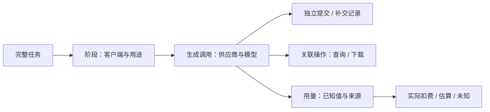

# 完整任务日志与消耗：生产实现与 UI 设计

- 最近更新：2026-10-04。
- 状态：统一调用记录、统计 API 与 GPUI 统计窗口已实现；用户人工验收与消费者接入见 [ROADMAP](../ROADMAP.md)。
- 范围：Pawork 共用两级任务 + 可选分部 + 操作类型的记录 / 查询；第 3、5 节为完整页面的设计参考，第 7 节定义当前生产界面。
- 关联：[GUI 设计](../gui-design.md)、[模型网关](model-gateway.md)、[providers](crates/providers.md)、[control-plane](crates/control-plane.md)、[desktop](crates/desktop.md)。

## 1. 任务是用户发起的一次完整工作

一项完整作品任务可跨内容准备、分镜与图片、视频生成、归档与剪辑，包含多个模型调用。Task 与 Pawork 现有会话 / Run、网关请求、供应商视频 taskId 分开；现有 ID 可以作为关联信息，不能直接替代完整任务 ID。

任务完成状态与用量覆盖 / 扣费确认状态独立。例如作品已完成，但 Token、credits、实际金额仍未知；任务列表同时显示「已完成」「消耗未齐」。补交成功不会覆盖原失败记录，后续账单到账也不改变历史调用状态。

跨客户端关联须显式提交 task ID，不能按相近时间、同模型或同项目自动拼成任务。缺关联的记录仍可查询，不悄悄丢弃。

## 2. 当前记录边界

生产实现为 GPUI，经 GUI Connection Protocol 访问 CLI Host。统一日志记录 Gateway 调用、原生 Run 和客户端关联的本地操作；费用账本仍按原有用量语义去重，不承担完整调用计数。API 与显示口径见 [模型网关](model-gateway.md#任务日志与统计2026-10-04)。

原型的任务总览、阶段与来源页属于设计参考，不能据此推定现有 API 已提供整任务成片状态、供应商账单或媒体实测时长。

## 3. 页面与交互（设计参考）

### 任务列表

沿用任务侧栏，增加「任务总览」入口；主区列完整任务名称、客户端链、结果、日期、供应商 / 模型数量、内容生成次数、实际扣费和任务状态。只显示有来源的任务，不填虚构历史任务。支持按名称 / 客户端 / 模型查找以及状态筛选；无结果可清除筛选。

点击整行进入任务详情，返回列表保留同一次查看流程。模型数量是去重的模型数，调用数量是生成提交数；查询、下载、导入和本地导出另列操作记录。

### 任务总览

详情头显示工作名称、参与客户端、日期、任务状态与用量覆盖状态，总耗时未知时显示「未留存」。四个主指标分别是文本生成、图片生成、视频计划提交和实际扣费，不把不同单位压成一个总数。

总览中显示供应商 / 模型表、任务阶段和账单覆盖。回执丢失等异常条可点击，直接打开原提交详情。点击模型进入已筛选的调用日志；点击阶段进入该阶段；点击来源进入数据来源页。

### 供应商与模型

先按供应商与渠道分组，再按实际模型显示生成次数、已知用量、实际扣费。供应商名称与 Pawork provider ID 都可查看，不按模型名称猜供应商。账号存在时作为归属信息展示，但不显示明文凭证。

实际金额、估算金额、供应商 credits 分开。可信金额按币种单独列总额；一种币种有未知项时标题为「已知实际小计」，同时标出未知项数量。实际 CNY 与 USD 分两行；估算 CNY 与 USD 再分两行，不显示相加后的「总价」。无可信金额与币种时直接显示未知，不预填币种或价格。

### 阶段与调用

阶段默认可展开，支持阶段 / 模型筛选和「仅异常与补交」。行展示调用用途、模型、已知用量、记录时间、耗时和状态；点击行标题或箭头打开调用详情。

每一次实际提交保留独立记录，补交显示「明确补交」及关联原请求。状态区分本地接收 / 校验状态与供应商状态；本地报错不等于上游未受理，也不等于不扣费。失败、取消、超时、回执丢失均不能从总览中消失，尚无证据时不判定远端终态。

导入、状态查询、下载、剪辑 / 导出显示在所属阶段的操作行，关联原生成，不增加生成计数或重复计费。仅有归档结果时显示「操作汇总 · 请求次数未留存」，不伪造完整 HTTP 日志。供应商如果另有查询或流量收费证据，以独立操作费用记录，而不是再次记为生成费用。

### 调用详情与数据来源

440 px 详情区显示供应商 / 模型、记录来源、用量、Actual / Estimated / Unknown、credits、币种、供应商状态、时间 / 耗时、证据及完整不透明任务 ID。原提交与补交可双向跳转，ID 可复制；没有 ID 时显示未保留，不推测 ID。支持 Esc 关闭、Tab 焦点限制在详情区、关闭后回到触发控件。

数据来源页列文件、证明的事实与覆盖缺口。编码代理单列来源及覆盖范围：没有可归属的独立用量来源时显示「未接入」，不计入内容生成。后续接入可作为同一 Task 的独立阶段或来源行，必须显示实际供应商 / 模型、数据时间范围和未覆盖部分，避免重复汇总已由 Pawork 记录的调用。

## 4. 设计数据边界

原型案例与归档结果不能回填为生产调用日志。只有实际调用留存的 client、任务关联、时间与用量才可作为统计依据；文件数量、字数、成片时长和归档时间不用于反推请求次数、Token 或扣费。

## 5. 支撑实现的最小字段

下表是完整视图的设计字段，当前可查询字段以 [模型网关契约](model-gateway.md#任务日志与统计2026-10-04) 为准。新增生产字段须有实际来源并复用现有账本，不把原型字段当作冻结 wire / schema。

| 层级 | 最小字段 |
| --- | --- |
| Task | 独立 task ID、用户名称、状态、参与客户端、时间及其来源、用量覆盖状态 |
| Stage | task ID、stage ID、名称、客户端 / 来源、状态、时间范围 |
| Call / 操作 | call ID、task / stage 关联、operation kind（生成 / 查询 / 下载 / 本地操作）、客户端归属、供应商 / 渠道 / 模型、request ID、供应商不透明 task ID、关联生成 / 替代提交 ID、本地与远端状态、时间 / 耗时及其来源 |
| 用量 | 输入 / 输出 / 缓存读 / 写 Token、图片数、计划视频时长、源媒体时长、实际扣减时长、供应商 credits 及单位，各自的值、来源与缺失原因 |
| 金额 | 金额微单位、币种、Actual / Estimated / Unknown、来源、估算时使用的费率版本；缺任一关键依据时不能标实际扣费 |

缺失值保留为空并携带原因（未回传、未留存、未接入、待账单确认等），与有来源的 0 分开。请求成功不推导金额为 0；部分已知用量展示已知小计和缺口。缓存读 / 写保留供应商归一后的定义，避免把已经含在输入 Token 中的缓存读取再次加到总 Token。

Task 总览的调用数、分模型统计和异常统计都从同一记录集合派生；只有内容生成增加生成提交数。账单或晚到用量补充到既有调用关联，不能因补记录再次新增生成费用。现有 Run / request / taskId 保持各自作用；不新增第二套供应商调用路径。

## 6. 设计与验收边界

交互原型只演示页面、筛选、异常关联与复制，不连接 Provider 或生产数据库，不进入 Pawork 的 Cargo workspace 或 Desktop 构建链。完整页面设计不等于当前接入的数据能力；生产验证须核对真实窗口与 HTTP / SQLite 等外部事实。

## 7. 生产界面

完整作品用 task，章节 / 视频分段用 subtask，分部用可选 group；消耗类型为独立 operation。Pawork 共用 domain DTO、UsageLedger 调用日志与 Gateway API，不增第二套供应商执行路径。生成请求附 pawork_usage，响应提供 call ID；POST /v1/usage/query 返回全量汇总及游标日志，POST /v1/usage/operations 接收本地操作。完整契约与例子见 [模型网关](model-gateway.md#任务日志与统计2026-10-04)。

侧栏页脚、Local / Settings 行上方的「任务消耗」打开独立 1000 × 820 GPUI 窗口，主会话 / 草稿继续保留。支持完整任务 → 章节 / 分段下钻，按分部、操作、供应商 / 模型、客户端统计；操作、状态、24h / 7d / 30d 筛选，刷新、清除与加载更多。汇总显示已知输入 / 输出 / 缓存读写 Token 和未知条数、已知图片、计划视频秒数、按币种区分的实际 / 估算；列表进入调用详情，可复制 ID、查看任务层级 / 操作类型 / 关联 / 补交 / 视频状态 / 调用耗时，Esc 关闭详情。查询 / 本地操作显示不计生成用量。按钮经键盘与 AX 共用业务路径；旧 Host、断线、错误与空结果显式显示。

生产日志目前没有供应商 credits / 实际扣费、媒体实测时长、整任务成片状态或证据文件页；原型展示的这些值来自明确案例，不能视为 API 可查询值。Gateway 没有费用来源时为未知，原生 Run 只提供既有 pricing 的估算；零值必须有回传依据。未关联记录仍可见，历史缺口不反推。

MoMai 的消费者任务做作品 / 分部 / 章节总结和调用明细，YingMai 做作品 / 分段以及文字 / 分镜 / 图片 / 视频分类，两者使用相同关联和查询契约。消费者 UI 的实现与验收由各自项目跟踪。

用户人工验收、消费者接入及真实供应商账单边界见 [ROADMAP](../ROADMAP.md)。
